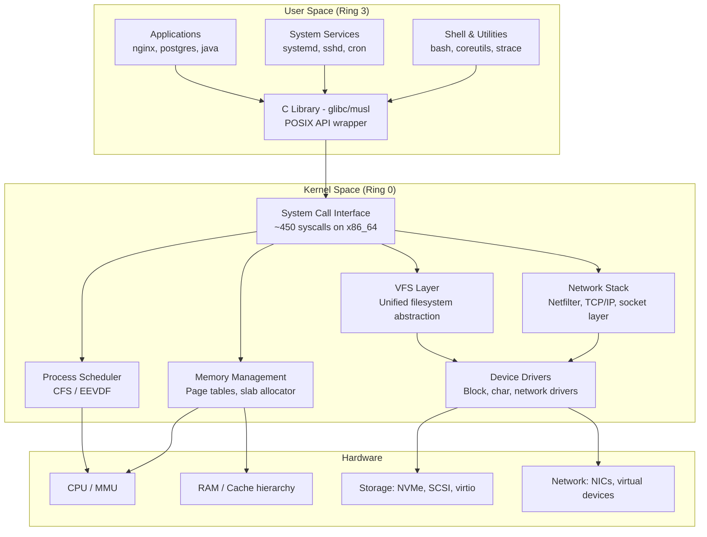
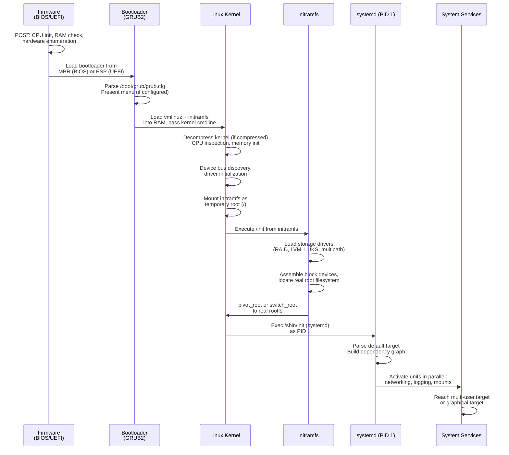

# Topic 00: Fundamentals -- Boot Process, Kernel Architecture, System Calls

> **Target Audience:** Senior SRE / Staff+ Cloud Engineers (10+ years experience)
> **Depth Level:** Principal Engineer interview preparation
> **Cross-references:** [Process Management](../01-process-management/process-management.md) | [CPU & Scheduling](../02-cpu-scheduling/cpu-scheduling.md) | [Memory Management](../03-memory-management/memory-management.md) | [Kernel Internals](../07-kernel-internals/kernel-internals.md)

---

## 1. Concept (Senior-Level Understanding)

### Linux Architecture: The Three-Layer Model

Linux follows a **monolithic kernel** architecture with a strict separation between hardware, kernel space, and user space. At interview depth, you need to understand not just what these layers are, but *why* they exist and what the boundaries enforce.



### Why Linux Chose Monolithic (And Why It Matters)

The Torvalds-Tanenbaum debate of 1992 established one of computing's most consequential architectural decisions. Linux is monolithic: the kernel, device drivers, filesystem implementations, and networking stack all execute in the same address space at Ring 0 privilege level.

**The trade-off matrix a Principal Engineer must articulate:**

| Property | Monolithic (Linux) | Microkernel (Minix, QNX, Fuchsia) |
|---|---|---|
| **Performance** | Fast -- no IPC overhead for driver calls | Slower -- every driver call crosses process boundaries |
| **Reliability** | One bad driver can panic the entire kernel | Driver crash is isolated; kernel continues |
| **Development** | Easier to add features; direct function calls | Harder; requires message-passing protocols |
| **Security surface** | Larger -- entire kernel is Ring 0 | Smaller -- minimal code at highest privilege |
| **Real-world examples** | Linux, FreeBSD, Windows NT (hybrid) | QNX (automotive), seL4 (formally verified), Fuchsia |

Linux mitigates the monolithic downsides through **loadable kernel modules (LKMs)**: drivers compiled separately and inserted/removed at runtime via `insmod`/`modprobe` without rebooting. This gives the practical *flexibility* of a microkernel while retaining the *performance* of a monolithic one. At FAANG scale, this is how you hot-patch a NIC driver across 100,000 nodes without downtime.

### The Kernel as Hardware Abstraction Layer

The kernel's four core responsibilities, which map directly to interview answers:

1. **Process management** -- Scheduling, context switching, fork/exec lifecycle. The kernel's `task_struct` represents every thread and process. The CFS (Completely Fair Scheduler), now evolving into EEVDF in kernel 6.6+, determines CPU time allocation.

2. **Memory management** -- Virtual memory via page tables, demand paging, the OOM killer, slab allocation for kernel objects, huge pages for database workloads. Every process believes it has its own contiguous 48-bit address space (on x86_64).

3. **Device drivers** -- The uniform `/dev` interface. Block devices, character devices, and network devices all present standardized APIs despite wildly different hardware underneath. The VFS (Virtual Filesystem Switch) unifies ext4, XFS, NFS, and procfs behind a single `open()/read()/write()` interface.

4. **System calls** -- The *only* legal mechanism for user-space code to request kernel services. Roughly 450 syscalls on modern x86_64 Linux. This is the contract between user space and kernel space.

### Kernel Mode vs. User Mode: The Hardware Enforcement

This is not a software convention. It is enforced by the CPU's privilege rings (x86) or exception levels (ARM). When a process executes the `syscall` instruction, the CPU physically transitions from Ring 3 to Ring 0, changing which memory regions and instructions are legal. If user-space code attempts to execute a privileged instruction (e.g., `cli` to disable interrupts) or access kernel memory, the CPU generates a protection fault, and the kernel terminates the process.

---

## 2. Internal Working (Kernel-Level Deep Dive)

### Boot Sequence Internals

The boot process is a chain of trust and escalating capability: each stage loads the next, hands off control, and becomes irrelevant.



#### Stage-by-Stage Breakdown

**Stage 1: Firmware (BIOS/UEFI)**

- **Legacy BIOS:** CPU hardwired to execute code at `0xFFFF0` (reset vector). BIOS probes hardware via POST (Power-On Self-Test), then reads the first 512 bytes of the boot device (MBR). The MBR boot code is limited to 446 bytes -- enough only to chain-load a second-stage loader.
- **UEFI:** A miniature operating system in firmware. Reads the GPT partition table, locates the EFI System Partition (ESP, a FAT32 partition typically at `/boot/efi`), and executes an EFI application (e.g., `/EFI/ubuntu/grubx64.efi`). UEFI can boot kernels directly via EFISTUB without a separate bootloader. Supports Secure Boot: firmware verifies cryptographic signatures of every boot component.
- **Key difference for production:** UEFI exposes runtime variables accessible from user space via `/sys/firmware/efi/`. This means `rm -rf /` on a system with `/sys` mounted read-write can brick firmware. This is a real incident class.

**Stage 2: Bootloader (GRUB2)**

- GRUB2 has its own filesystem drivers (ext4, XFS, btrfs, LVM) independent of the kernel. It reads `/boot/grub/grub.cfg` to enumerate available kernels.
- Critical kernel command-line parameters: `root=UUID=...` (root filesystem), `ro` (mount read-only for fsck), `quiet` (suppress console messages), `console=ttyS0,115200` (serial console for cloud instances), `crashkernel=256M` (reserve memory for kdump).
- **GRUB rescue mode** is available when grub.cfg is missing or corrupt. You get a `grub>` prompt with `ls`, `set root=`, `linux`, `initrd`, and `boot` commands.

**Stage 3: Kernel Initialization**

The kernel executes `start_kernel()` in `init/main.c`. Initialization order:
1. CPU inspection and mode setup
2. Memory management initialization (page tables, zone allocator)
3. Scheduler initialization
4. Device bus discovery (PCI, USB, ACPI enumeration)
5. Device driver initialization
6. Mount the initramfs as temporary root
7. Execute `/init` from initramfs

**Stage 4: initramfs (Initial RAM Filesystem)**

This is the critical bridge between "kernel can run" and "real root filesystem is available." The initramfs is a gzip-compressed cpio archive loaded into RAM by GRUB. It contains a minimal userspace with:
- Storage drivers (RAID, LVM, dm-crypt/LUKS, multipath, NVMe, virtio)
- `udev` rules for device node creation
- `systemd` (in initramfs mode) or shell scripts to assemble the root device
- `switch_root` or `pivot_root` to transition to the real rootfs

**Why initramfs exists:** The kernel can't contain drivers for every possible storage configuration. A machine booting off an iSCSI LUN over a bonded NIC using LUKS encryption on LVM on RAID needs dozens of modules loaded *before* the root filesystem is accessible. The initramfs solves this chicken-and-egg problem.

**Stage 5: systemd (PID 1)**

After `switch_root`, the kernel execs `/sbin/init`, which on modern distributions is systemd. systemd:
1. Reads its own configuration from `/etc/systemd/system/` and `/usr/lib/systemd/system/`
2. Determines the default target (usually `multi-user.target` or `graphical.target`)
3. Builds a dependency graph of all required units
4. Activates units **in parallel** where dependencies allow -- this is the key performance improvement over SysV init's sequential scripts
5. Uses cgroups to track all processes spawned by each service
6. Manages socket activation (start services on-demand when their socket receives a connection)

### System Call Mechanism: User-Space to Kernel Transition

The system call is the fundamental boundary crossing in Linux. Here is the exact path on x86_64:

```
 User Space                          Kernel Space
+----------------------------------+  +----------------------------------------+
|                                  |  |                                        |
| Application calls glibc wrapper  |  |                                        |
| e.g., write(fd, buf, count)      |  |                                        |
|         |                        |  |                                        |
|         v                        |  |                                        |
| glibc wrapper:                   |  |                                        |
|   - Places syscall # in RAX      |  |                                        |
|     (write = 1 on x86_64)        |  |                                        |
|   - Args in: RDI, RSI, RDX,     |  |                                        |
|     R10, R8, R9                  |  |                                        |
|   - Executes SYSCALL instruction |  |                                        |
|         |                        |  |                                        |
|=========|========================|==|========================================|
|         | CPU privilege switch   |  |                                        |
|         | Ring 3 -> Ring 0       |  |                                        |
|         | MSR_LSTAR -> entry pt  |  |                                        |
|         +------------------------|->|  entry_SYSCALL_64 (arch/x86/entry/)    |
|                                  |  |    - Saves user registers to pt_regs   |
|                                  |  |    - Switches to kernel stack          |
|                                  |  |         |                              |
|                                  |  |         v                              |
|                                  |  |  sys_call_table[RAX]                   |
|                                  |  |    - Dispatch to handler               |
|                                  |  |    - e.g., ksys_write()               |
|                                  |  |         |                              |
|                                  |  |         v                              |
|                                  |  |  VFS layer -> filesystem driver        |
|                                  |  |    - Permission checks                 |
|                                  |  |    - Page cache interaction            |
|                                  |  |    - Block I/O if needed               |
|                                  |  |         |                              |
|                                  |  |         v                              |
|                                  |  |  Return value in RAX                   |
|                                  |  |  SYSRET instruction                    |
|                                  |  |    - Restores user registers           |
|         <------------------------|--+    - Ring 0 -> Ring 3                  |
|                                  |  |                                        |
| glibc:                           |  |                                        |
|   - Checks RAX for error         |  |                                        |
|   - If negative, set errno       |  |                                        |
|   - Return to application        |  |                                        |
+----------------------------------+  +----------------------------------------+
```

#### Evolution of System Call Entry

| Mechanism | Instruction | Era | Latency |
|---|---|---|---|
| Software interrupt | `int 0x80` | i386 era | ~250+ cycles (slow: full IDT lookup) |
| Fast syscall (32-bit) | `sysenter`/`sysexit` | Pentium II+ | ~100 cycles |
| Fast syscall (64-bit) | `syscall`/`sysret` | AMD64/x86_64 | ~50-100 cycles |
| vDSO (no kernel entry) | Direct user-space call | Kernel 2.6+ | ~5-10 cycles |

#### vDSO: The Kernel in User Space

The vDSO (virtual Dynamic Shared Object) is a kernel-provided shared library mapped into every process's address space. It implements certain syscalls *entirely in user space*, eliminating the Ring 3-to-Ring 0 transition. Key vDSO functions:

- `clock_gettime()` -- reads the kernel's time variables directly from a shared memory page
- `gettimeofday()` -- same mechanism
- `getcpu()` -- reads the CPU/NUMA node from a user-readable TSC or RDTSCP

This matters enormously at scale. A high-frequency trading application or metrics collector calling `clock_gettime()` millions of times per second gains an order of magnitude in performance from vDSO versus trapping into the kernel each time.

You can inspect the vDSO with: `ldd /bin/ls | grep vdso` -- it will show `linux-vdso.so.1`.

### Key Kernel Data Structures

**`task_struct` (defined in `include/linux/sched.h`):**

The process/thread descriptor. At ~6-8 KB on modern kernels, it contains or points to:
- Process state (`TASK_RUNNING`, `TASK_INTERRUPTIBLE`, `TASK_UNINTERRUPTIBLE`, `TASK_ZOMBIE`)
- PID, TGID (thread group ID, which is the "process ID" from userspace perspective)
- Scheduling info (priority, CFS vruntime, CPU affinity mask)
- Memory descriptor (`mm_struct *mm`) -- the process's entire virtual memory layout
- File descriptor table (`files_struct *files`)
- Signal handlers (`sighand_struct`)
- cgroup membership, namespace references, security context (SELinux/AppArmor)
- Parent/child/sibling linked list pointers (the process tree)

All tasks are stored in a circular doubly linked list. The kernel's process table is this linked list, not a fixed-size array.

**Interrupt Descriptor Table (IDT):**

A 256-entry table mapping interrupt/exception vectors to handler functions. Entry 0x80 was the legacy system call vector. Modern kernels use the SYSCALL MSR-based mechanism instead, but the IDT remains critical for hardware interrupts (timer, NIC, disk) and CPU exceptions (page fault at vector 14, general protection fault at vector 13, divide-by-zero at vector 0).

---

## 3. Commands + Practical Examples

### Boot Analysis

```bash
# View kernel boot messages (timestamped, from current boot)
dmesg -T | head -50

# Same via journald -- preferred on systemd systems
journalctl -k -b 0             # kernel messages, current boot
journalctl -b -1                # ALL messages from previous boot
journalctl -b -1 -p err         # only errors from previous boot

# Boot time breakdown
systemd-analyze                  # Total boot time: firmware + loader + kernel + userspace
# Example output:
# Startup finished in 3.522s (firmware) + 1.231s (loader) + 2.456s (kernel) + 8.112s (userspace) = 15.321s
# graphical.target reached after 8.053s in userspace

# Which services took longest to start
systemd-analyze blame | head -20
# Example output:
# 4.234s NetworkManager-wait-online.service
# 2.112s snapd.service
# 1.890s dev-sda1.device
# 1.234s systemd-journal-flush.service

# Critical path -- the chain of units that determined boot time
systemd-analyze critical-chain
# Example output:
# graphical.target @8.053s
# └─multi-user.target @8.052s
#   └─NetworkManager.service @3.112s +234ms
#     └─dbus.service @2.998s +12ms
#       └─basic.target @2.987s
#         └─sockets.target @2.986s

# Generate SVG boot chart
systemd-analyze plot > boot-chart.svg
```

### Kernel & System Information

```bash
# Comprehensive kernel info
uname -a
# Linux prod-web-042 5.15.0-91-generic #101-Ubuntu SMP x86_64 GNU/Linux

# Kernel command line (exactly what GRUB passed)
cat /proc/cmdline
# BOOT_IMAGE=/vmlinuz-5.15.0-91-generic root=UUID=a1b2c3d4... ro quiet console=ttyS0,115200 crashkernel=256M

# Kernel version details
cat /proc/version

# CPU information (critical for NUMA-aware debugging)
lscpu | grep -E "^(Architecture|CPU|Thread|Core|Socket|NUMA)"

# System uptime with idle time
cat /proc/uptime  # first number: uptime in seconds, second: idle time (sum across CPUs)
```

### System Call Tracing

```bash
# Trace all syscalls of a command
strace -c ls /tmp    # Summary: count, time, errors per syscall
# Example output:
# % time     seconds  usecs/call     calls    errors syscall
# ------ ----------- ----------- --------- --------- --------
#  45.23    0.000234           4        52           getdents64
#  22.11    0.000114           2        48           lstat
#  15.67    0.000081           1        55         3 openat
#   8.44    0.000044           1        52           close

# Trace specific syscalls with timestamps
strace -e trace=openat,read,write -T -p <PID>

# Trace a process and all children (useful for service startup debugging)
strace -ff -o /tmp/trace -p <PID>

# Count syscalls per second (production-safe with -c)
strace -c -p <PID> -e trace=network    # Network syscalls only
```

### Interrupt and Kernel Stats

```bash
# Interrupt distribution across CPUs -- critical for NIC tuning
cat /proc/interrupts | head -5
#            CPU0       CPU1       CPU2       CPU3
#   0:         38          0          0          0   IO-APIC   2-edge      timer
#   8:          0          0          0          0   IO-APIC   8-edge      rtc0
#  16:    4532901          0          0          0   IO-APIC  16-fasteoi   ehci_hcd

# Context switches and process stats
cat /proc/stat | head -3
# cpu  1234567 2345 345678 45678901 12345 0 6789 0 0 0
# cpu0 308642  586   86420  11419725  3086 0  1697 0 0 0

# Per-process syscall count (requires CONFIG_TASK_IO_ACCOUNTING)
cat /proc/<PID>/status | grep -E "voluntary_ctxt|nonvoluntary"
```

---

## 4. Advanced Debugging & Observability

### Boot Failure Debugging Decision Tree

```mermaid
flowchart TD
    A[System Not Booting] --> B{Screen Output?}
    B -->|No display at all| C[Hardware/Firmware Issue]
    C --> C1[Check POST beep codes]
    C --> C2[Reseat RAM/GPU, check power]
    C --> C3[Test with serial console:<br/>console=ttyS0,115200]

    B -->|GRUB menu appears| D{Kernel loads?}
    D -->|GRUB error: no such partition| E[GRUB Rescue]
    E --> E1[grub> ls<br/>grub> set root=...<br/>grub> linux /vmlinuz...<br/>grub> initrd /initrd...<br/>grub> boot]
    E --> E2[Boot rescue USB,<br/>mount, chroot,<br/>grub-install + update-grub]

    D -->|Kernel starts but panics| F{Panic message?}
    F -->|VFS: Unable to mount root| G[initramfs Issue]
    G --> G1[Wrong root= in cmdline?<br/>Check UUID vs blkid output]
    G --> G2[Missing storage driver<br/>in initramfs]
    G --> G3[Rebuild: dracut -f or<br/>update-initramfs -u]

    F -->|Kernel panic - not syncing| H[Kernel/Module Issue]
    H --> H1[Boot previous kernel<br/>from GRUB menu]
    H --> H2[Add rd.break to cmdline<br/>to drop into initramfs shell]
    H --> H3[Remove problematic module<br/>from /etc/modprobe.d/]

    D -->|Kernel + initramfs OK| I{systemd starts?}
    I -->|systemd fails or hangs| J[systemd Debug]
    J --> J1[Add systemd.unit=rescue.target<br/>to kernel cmdline]
    J --> J2[Add systemd.unit=emergency.target<br/>for minimal shell]
    J --> J3[journalctl -b -1 -p err<br/>after recovery to find cause]
    J --> J4[systemctl list-units --failed<br/>to find broken units]

    I -->|systemd starts but<br/>specific service fails| K[Service Debug]
    K --> K1[systemctl status service<br/>journalctl -u service]
    K --> K2[systemd-analyze verify service.unit]
    K --> K3[Check dependency cycle:<br/>systemd-analyze dot service | dot -Tsvg]
```

### Boot Failure Triage Procedures

**GRUB rescue (grub.cfg missing or corrupt):**

```bash
# At grub> prompt:
grub> ls                              # List known partitions
grub> ls (hd0,gpt2)/                  # Browse partition contents
grub> set root=(hd0,gpt2)
grub> linux /vmlinuz-5.15.0-91-generic root=UUID=<uuid> ro
grub> initrd /initrd.img-5.15.0-91-generic
grub> boot

# Permanent fix from rescue media:
mount /dev/sda2 /mnt
mount /dev/sda1 /mnt/boot/efi         # if UEFI
for i in dev proc sys run; do mount --bind /$i /mnt/$i; done
chroot /mnt
grub-install /dev/sda                  # BIOS
# OR: grub-install --target=x86_64-efi --efi-directory=/boot/efi  # UEFI
update-grub
```

**initramfs rebuild (missing drivers):**

```bash
# Debian/Ubuntu:
update-initramfs -u -k $(uname -r)

# RHEL/CentOS/Fedora:
dracut --force /boot/initramfs-$(uname -r).img $(uname -r)

# Include specific module:
dracut --add-drivers "nvme megaraid_sas" --force

# Debug initramfs contents:
lsinitramfs /boot/initrd.img-$(uname -r) | grep -i nvme
# OR:
lsinitrd /boot/initramfs-$(uname -r).img | grep -i nvme
```

**rd.break -- Drop into initramfs shell before pivot_root:**

Add `rd.break` to kernel command line in GRUB. This gives you a shell inside the initramfs with the real root filesystem mounted at `/sysroot`. Essential for password resets and filesystem repair when systemd won't start.

```bash
# At the rd.break shell:
mount -o remount,rw /sysroot
chroot /sysroot
passwd root                            # Reset root password
touch /.autorelabel                    # Required if SELinux is enabled
exit
exit                                   # Continue boot
```

### Kernel Crash Debugging

```bash
# kdump -- captures kernel memory on panic for post-mortem analysis
# Verify kdump is configured:
systemctl status kdump

# Kernel crash dumps land in /var/crash/
# Analyze with the crash utility:
crash /usr/lib/debug/lib/modules/$(uname -r)/vmlinux /var/crash/<timestamp>/vmcore

# Inside crash:
crash> bt                              # Backtrace of panicking task
crash> log                             # dmesg at time of crash
crash> ps                              # Process list at crash time
crash> mod                             # Loaded modules
crash> files <PID>                     # Open files of a process
```

---

## 5. Real-World Production Scenarios

### Incident 1: Boot Loop from GRUB Misconfiguration After Kernel Upgrade

**Context:** Fleet of 2,400 bare-metal database servers (PostgreSQL) across three data centers. Rolling kernel upgrade from 5.15 to 6.1 via automated Ansible playbook.

**Symptoms:**
- 340 servers enter continuous reboot loop after the upgrade
- Monitoring shows hosts dropping out of service discovery
- Serial console capture shows GRUB error: `error: file '/vmlinuz-6.1.0-prod' not found`
- Servers never reach the kernel -- cycling between GRUB timeout and BIOS POST

**Investigation:**
```bash
# On a working server, examine the GRUB config generation:
cat /etc/default/grub | grep GRUB_DEFAULT
# GRUB_DEFAULT="Advanced options for Ubuntu>Ubuntu, with Linux 6.1.0-prod"

# The Ansible playbook ran update-grub, but the kernel package named files:
ls /boot/vmlinuz*
# /boot/vmlinuz-6.1.0-12-generic    <-- actual filename
# /boot/vmlinuz-5.15.0-91-generic

# grub.cfg on affected hosts references "6.1.0-prod" -- a custom naming
# convention from /etc/default/grub that was templated incorrectly
```

**Root Cause:** The Ansible template for `/etc/default/grub` used a variable `{{ kernel_version }}` that was set to `6.1.0-prod` (the internal naming convention), but the actual Debian package installed kernel files as `6.1.0-12-generic`. `update-grub` generated a `grub.cfg` pointing to a nonexistent file.

**Immediate Mitigation:**
```bash
# Remote IPMI/iLO access to serial console:
# At GRUB menu, press 'e', change vmlinuz-6.1.0-prod to vmlinuz-6.1.0-12-generic
# Press Ctrl+X to boot
# Then fix /etc/default/grub and run update-grub
```

**Long-term Fix:**
- Ansible playbook now queries `dpkg -l | grep linux-image` to get the actual installed kernel name
- Canary deployment: upgrade 1% of fleet, wait 30 minutes, verify boot via SSH health check before proceeding
- GRUB timeout set to 30 seconds with fallback to previous kernel (`GRUB_DEFAULT=saved` + `GRUB_FALLBACK=1`)

**Prevention:** Added a monitoring check that diffs the kernel filename in `grub.cfg` against actual files in `/boot/`. Alert fires if grub.cfg references any nonexistent files.

---

### Incident 2: initramfs Missing Storage Driver After Hardware Migration

**Context:** Migration of 800 compute nodes from Dell PowerEdge (PERC RAID controller using `megaraid_sas` driver) to Supermicro (LSI HBA using `mpt3sas` driver). Nodes re-imaged with the same golden image.

**Symptoms:**
- Nodes boot to kernel but panic: `VFS: Unable to mount root fs on unknown-block(0,0)`
- dmesg shows SCSI subsystem initializing but no block devices appearing
- initramfs completes but `/dev/sda` never materializes

**Investigation:**
```bash
# From rescue media, inspect the initramfs:
lsinitramfs /mnt/boot/initrd.img-5.15.0-91-generic | grep -E "(megaraid|mpt3sas)"
# Only shows: kernel/drivers/scsi/megaraid/megaraid_sas.ko

# The golden image's initramfs was built on Dell hardware -- it includes
# megaraid_sas but NOT mpt3sas. The Supermicro HBA is invisible to the kernel
# at boot time.

# Verify the module exists in the kernel tree:
find /mnt/lib/modules/5.15.0-91-generic/ -name "mpt3sas*"
# /mnt/lib/modules/5.15.0-91-generic/kernel/drivers/scsi/mpt3sas/mpt3sas.ko
```

**Root Cause:** The initramfs is built at `update-initramfs` time and auto-detects currently attached hardware. The golden image was created on Dell hardware, so only Dell-specific drivers were included. The `mpt3sas` module exists in the kernel modules tree but was not embedded in initramfs.

**Immediate Mitigation:**
```bash
# Boot from rescue USB
mount /dev/sda2 /mnt
mount --bind /dev /mnt/dev
mount --bind /proc /mnt/proc
mount --bind /sys /mnt/sys
chroot /mnt

# Force-include the required driver:
echo "mpt3sas" >> /etc/initramfs-tools/modules
update-initramfs -u -k all
exit
reboot
```

**Long-term Fix:**
- Golden image now built with `MODULES=most` in `/etc/initramfs-tools/initramfs.conf` (includes all hardware drivers, increasing initramfs from ~30MB to ~80MB -- acceptable trade-off)
- Image build pipeline includes a validation step that checks initramfs contains drivers for all target hardware platforms

**Prevention:** Post-imaging boot test on each hardware platform variant before fleet deployment. Monitoring alert for kernel panic strings in serial console logs.

---

### Incident 3: systemd Dependency Cycle Causing Delayed Boot on 10,000-Node Fleet

**Context:** Global CDN fleet, 10,000 edge nodes running a custom health-check service (`cdn-health.service`) that depends on network readiness. Deployment of a new network configuration service (`net-config.service`) introduced a dependency cycle.

**Symptoms:**
- Boot time increased from 12 seconds to 4+ minutes across entire fleet
- `systemd-analyze blame` shows `cdn-health.service` at 3m45s
- Services start eventually but in wrong order -- health checks fail, nodes removed from load balancer

**Investigation:**
```bash
systemd-analyze critical-chain cdn-health.service
# cdn-health.service @245.123s +0.234s
#   └─net-config.service @240.002s +5.100s
#     └─cdn-health.service  <-- CIRCULAR DEPENDENCY DETECTED

# Verify the cycle:
systemd-analyze verify cdn-health.service
# cdn-health.service: Found dependency cycle involving net-config.service

# Examine unit files:
grep -E "After|Requires|Wants" /etc/systemd/system/cdn-health.service
# After=network-online.target net-config.service
# Requires=net-config.service

grep -E "After|Requires|Wants" /etc/systemd/system/net-config.service
# After=cdn-health.service    <-- HERE IS THE PROBLEM
# Wants=cdn-health.service
```

**Root Cause:** The `net-config.service` unit file was written with `After=cdn-health.service` because the developer wanted health checks to be available when networking was reconfigured. This created a cycle: health checks require networking, networking requires health checks. systemd breaks cycles by dropping the weakest dependency, but the ordering was non-deterministic and added a 90-second `DefaultTimeoutStartSec` delay for the cycle resolution.

**Immediate Mitigation:**
```bash
# Remove the circular dependency
sed -i '/After=cdn-health.service/d' /etc/systemd/system/net-config.service
sed -i '/Wants=cdn-health.service/d' /etc/systemd/system/net-config.service
systemctl daemon-reload
```

**Long-term Fix:**
- CI/CD pipeline for unit files now includes `systemd-analyze verify` as a lint step
- Split health-check into boot-time health (no network dependency) and runtime health (full dependency chain)
- Pre-deployment boot time regression test: image + boot in VM, assert boot time < 30 seconds

**Prevention:** `systemd-analyze dot | dot -Tsvg` visualizations reviewed during service onboarding. Alert on boot time exceeding 2x baseline across any fleet segment.

---

### Incident 4: Kernel Panic from Incompatible Module Loaded at Boot

**Context:** Security team pushed an emergency update for a custom kernel module (`secaudit.ko`) that provides real-time syscall auditing. Module was compiled against kernel headers for 5.15.0-91 but deployed to hosts running 5.15.0-94.

**Symptoms:**
- 1,200 hosts panic during boot with: `BUG: unable to handle kernel paging request at ffffffffc0892340`
- Panic occurs immediately after `modprobe secaudit` in early boot
- kdump captures show the panic backtrace originating inside `secaudit_init()`

**Investigation:**
```bash
# From kdump vmcore:
crash> bt
#0 [ffffa23441234568] machine_kexec at ffffffff810634e5
#1 [ffffa234412345c0] __crash_kexec at ffffffff8112b2d2
...
#5 [ffffa23441234780] secaudit_init+0x42 at ffffffffc0892340 [secaudit]

crash> mod | grep secaudit
# ffffffffc0890000  secaudit  24576  (not loaded)  [CONFIG_RETPOLINE]

# Check module metadata:
modinfo secaudit.ko | grep vermagic
# vermagic: 5.15.0-91-generic SMP mod_unload modversions

# Running kernel:
uname -r
# 5.15.0-94-generic

# Module version mismatch -- kernel symbols have different addresses
```

**Root Cause:** The module was compiled against 5.15.0-91 kernel headers. Between -91 and -94, an internal data structure was modified (security subsystem patch), changing the offset of a field the module accessed. With `CONFIG_MODVERSIONS` enabled, the kernel *should* refuse to load mismatched modules, but the module's build system stripped the CRC signatures.

**Immediate Mitigation:**
```bash
# Boot with module blacklisted:
# At GRUB menu, press 'e', add to kernel cmdline:
#   modprobe.blacklist=secaudit
# Or, from rescue shell:
echo "blacklist secaudit" > /etc/modprobe.d/blacklist-secaudit.conf
```

**Long-term Fix:**
- Module CI/CD pipeline now builds against all active kernel versions in the fleet
- `CONFIG_MODVERSIONS` enforcement verified -- module build must preserve CRC symbols
- Module deployment gated by `modinfo --field vermagic` check against target kernel

**Prevention:** Fleet-wide kernel version inventory (exposed via Prometheus `node_uname_info` metric). Module deployment tooling cross-references module vermagic against every target host's kernel. Deployment blocked if any mismatch detected.

---

### Incident 5: Slow Boot (5+ Minutes) from Filesystem Check on Degraded RAID

**Context:** 500-node Hadoop cluster, each node with 12x 8TB HDDs in RAID-6 (mdadm). One data center experienced a power event causing unclean shutdowns across 200 nodes.

**Symptoms:**
- Nodes take 8-15 minutes to boot (normal: 45 seconds)
- Serial console shows: `[  45.234] EXT4-fs (md0): recovery complete` followed by long pauses
- Some nodes take 30+ minutes, causing HDFS to enter safe mode due to missing DataNodes

**Investigation:**
```bash
# From serial console capture:
# [  12.456] md: md0 - recovery in progress
# [  12.457] md: md0 - recovery: 0.1% done, 45 minutes remaining
# [  45.234] EXT4-fs (md0): recovery complete
# [  45.300] systemd[1]: Starting File System Check on /dev/md1...
# [  46.100] fsck.ext4: /dev/md1: recovering journal
# [  48.200] fsck.ext4: Pass 1 - Checking inodes, blocks, and sizes
# ... (this takes 7+ minutes on 8TB ext4)

# On a recovered node:
cat /proc/mdstat
# md0 : active raid6 sd[a-l]1
#       ... [12/11] [UUUUUUUUUU_]    <-- one disk failed during power event

# The RAID rebuild + fsck on 12 disks with one degraded = catastrophic boot time

systemd-analyze blame
# 7m34s systemd-fsck@dev-md1.service
# 4m12s mdadm-raid.service
```

**Root Cause:** Unclean shutdown left the RAID array in degraded state (one disk per node had write-in-flight data corruption). mdadm resync started at boot, combined with ext4 journal recovery and full fsck on the 50TB+ filesystem. The `fsck.repair=yes` kernel parameter (default on these nodes) forced automatic repair.

**Immediate Mitigation:**
```bash
# For nodes that haven't booted yet, skip fsck temporarily:
# Add to kernel cmdline: fsck.mode=skip
# Boot, verify data integrity manually, then schedule maintenance fsck

# For RAID resync -- allow nodes to boot and resync in background:
echo 200000 > /proc/sys/dev/raid/speed_limit_max  # Throttle to 200MB/s
# This allows the system to be usable while resync completes
```

**Long-term Fix:**
- Moved OS partitions to dedicated SSD (separate from HDFS data disks) -- OS boot no longer depends on RAID array health
- `tune2fs -c 0 -i 0` on data filesystems (HDFS manages its own integrity)
- Battery-backed write cache on RAID controller prevents dirty-shutdown scenarios
- UPS hold-time extended from 5 minutes to 15 minutes, with automated graceful shutdown at 10 minutes

**Prevention:** Monitor RAID health via `mdadm --monitor`. Alert on degraded array (missing disk). Pre-stage hot spare disks. Boot time SLO: alert if any node exceeds 2-minute boot time.

---

## 6. Advanced Interview Questions

### Conceptual Deep Questions

**Q1: Explain the difference between a monolithic kernel and a microkernel. Why did Linux choose monolithic, and what are the modern mitigations for its downsides?**

Linux is monolithic: kernel, drivers, filesystem code, and networking all share Ring 0 address space. This means a single bad pointer in any driver can corrupt kernel memory and panic the system. Linux mitigates this with: (1) loadable kernel modules for runtime flexibility, (2) extensive use of reference counting and RCU (Read-Copy-Update) for safe concurrent access, (3) KASAN/UBSAN sanitizers during development, (4) kernel lockdown mode restricting what even root can do to the running kernel, and (5) eBPF for safe, verified code execution in kernel context without writing actual kernel modules. The performance advantage of monolithic -- avoiding IPC overhead for every driver call -- remains decisive for Linux's primary use cases (servers, cloud, embedded).

**Q2: What is the vDSO and why does it exist? Name specific syscalls it accelerates.**

The vDSO (virtual Dynamic Shared Object) is a kernel-provided ELF shared library automatically mapped into every process's address space. It allows certain system calls to execute entirely in user space, avoiding the ~50-100 cycle overhead of Ring 3-to-Ring 0 transitions. Key vDSO functions: `clock_gettime()`, `gettimeofday()`, `time()`, `getcpu()`. The kernel maintains shared read-only pages with current time data that the vDSO code reads directly. On a monitoring agent calling `clock_gettime()` millions of times per second, vDSO provides 10-100x improvement over real syscalls. Prior to vDSO, the `vsyscall` page existed at a fixed address, but it was a security risk (fixed address = easier ROP gadgets), so it was replaced by the ASLR-compatible vDSO.

**Q3: Walk through exactly what happens at the CPU level when a user-space process makes a system call on x86_64.**

The process (via glibc wrapper) places the syscall number in RAX and arguments in RDI, RSI, RDX, R10, R8, R9. It executes the `syscall` instruction. The CPU: (1) saves RIP to RCX and RFLAGS to R11, (2) loads the kernel entry point from MSR_LSTAR into RIP, (3) loads the kernel segment selectors, (4) masks RFLAGS according to MSR_FMASK (disabling interrupts), (5) transitions to Ring 0. The kernel's `entry_SYSCALL_64` handler saves all user registers to a `pt_regs` structure on the kernel stack, performs the syscall dispatch via `sys_call_table[RAX]`, executes the handler, places the return value in RAX, and executes `sysret` to return to Ring 3 (restoring RIP from RCX and RFLAGS from R11).

**Q4: What is the difference between the kernel's process and thread representation?**

In Linux, there is no separate "thread struct." Both processes and threads are represented by `task_struct`. A thread is simply a `task_struct` that shares certain resources with other `task_struct`s. When `clone()` is called (the underlying syscall for both `fork()` and `pthread_create()`), flags determine what is shared: `CLONE_VM` shares the memory space, `CLONE_FILES` shares the file descriptor table, `CLONE_SIGHAND` shares signal handlers. A "process" is a `clone()` with no sharing flags (or `fork()`, which copies everything). A "thread" is a `clone()` with `CLONE_VM|CLONE_FILES|CLONE_SIGHAND|CLONE_THREAD`. The TGID (thread group ID) equals the PID of the main thread, which is why `getpid()` returns the same value for all threads in a process, while `gettid()` returns the unique task ID.

### Scenario-Based Questions

**Q5: You perform a kernel upgrade on a production server and it won't boot. Walk through your troubleshooting approach.**

First, determine *where* in the boot chain the failure occurs by checking serial console output. If you see no GRUB menu: boot from rescue media, mount the boot partition, check that `grub.cfg` references the correct kernel file and that the file exists in `/boot/`. If GRUB loads but the kernel panics: at the GRUB menu, select the previous kernel to restore service immediately. Then investigate: check `dmesg` from the previous boot (`journalctl -b -1 -p err`), look for module incompatibilities, missing initramfs drivers, or changed kernel command-line parameters. If the kernel boots but systemd hangs: add `systemd.unit=rescue.target` to the kernel command line, then inspect `systemctl --failed` and `journalctl -p err`. Always have a rollback plan: keep the previous kernel installed (GRUB auto-detects it), and set `GRUB_DEFAULT=saved` with a fallback entry.

**Q6: A fleet of 10,000 nodes is experiencing 3-minute boot times. The SLO is 45 seconds. How do you diagnose and fix this?**

Collect `systemd-analyze blame` output from a representative sample of affected nodes. Look for the top offenders. Common culprits: `NetworkManager-wait-online.service` (waiting for DHCP or NIC link), `systemd-fsck` (filesystem checks on large partitions), `dev-*.device` (slow storage detection, especially with SAN/multipath). For network waits: ensure link-local addressing or switch to `systemd-networkd` with faster timeout. For fsck: tune `tune2fs -c` and `-i` intervals, or move to a filesystem with faster recovery (XFS journal replay is typically faster than ext4 for large filesystems). For device waits: check for missing multipath paths, degraded RAID arrays, or slow SAN fabric login. Use `systemd-analyze critical-chain` to find the longest *dependency chain*, not just the longest individual unit. Parallelize where possible by removing unnecessary `After=` dependencies.

**Q7: Describe what happens from power-on to a login prompt, at the maximum level of detail you can provide.**

Power button triggers the PSU's power-good signal. The CPU resets to real mode and jumps to the reset vector (`0xFFFFFFF0`), which redirects to UEFI firmware (or BIOS). Firmware performs POST (Power-On Self-Test), enumerates PCIe devices, initializes RAM via SPD/XMP, then reads the GPT (or MBR) to find the EFI System Partition. The UEFI boot manager loads the bootloader (`grubx64.efi` or `systemd-bootx64.efi`) into memory. GRUB reads `grub.cfg`, presents the menu, then loads the compressed kernel image (`vmlinuz`) and the initramfs (`initrd.img`) into memory, sets up the kernel command line, and transfers control. The kernel decompresses itself, enters `start_kernel()` in `init/main.c`, initializes the memory allocator (buddy system + SLAB/SLUB), sets up the IDT and GDT, calibrates the timer, initializes the scheduler (CFS/EEVDF), brings up secondary CPUs (SMP), and mounts the initramfs as a tmpfs root. Inside initramfs, `systemd` (or a shell script) runs `udevd` for coldplug device enumeration, loads storage drivers (NVMe, SCSI, dm-multipath), assembles LVM/RAID, locates the real root device, runs `fsck` if needed, then calls `switch_root` to pivot to the real root filesystem. PID 1 (`systemd`) re-execs itself from the real root, reads `default.target` (typically `multi-user.target` or `graphical.target`), builds the dependency tree, and activates units in parallel. Near the end of the chain, `systemd-logind` starts, `getty@tty1.service` spawns `/sbin/agetty`, which opens the TTY device, prints the login banner, and invokes `/bin/login`. PAM authenticates the user (checking `/etc/pam.d/login`, `/etc/shadow`, and optionally LDAP/SSSD), then `login` calls `setuid()`, `initgroups()`, `chdir()` to the home directory, and `execve()` the user's shell. (For detailed coverage, see [Section 2 Boot Sequence](#2-internal-working-kernel-level-deep-dive).)

**Q8: A process is making millions of `gettimeofday()` calls per second and you need to optimize it. What kernel mechanisms are relevant?**

The vDSO handles `gettimeofday()` without entering the kernel. Verify the application links against `linux-vdso.so.1` (check with `ldd`). If the application is statically linked or uses raw `syscall()` instead of the glibc wrapper, it bypasses vDSO and traps into the kernel each time. Fix: ensure dynamic linking or switch to `clock_gettime(CLOCK_MONOTONIC_COARSE)` for even faster (but slightly less precise) timing. Also check the clocksource: `cat /sys/devices/system/clocksource/clocksource0/current_clocksource`. TSC is fastest; if it shows `hpet` or `acpi_pm`, performance will be significantly worse. On VMs, `kvm-clock` or `tsc` should be used.

### Debugging Questions

**Q9: `dmesg` shows `Out of memory: Kill process 1234 (java)`. Explain the full chain of events.**

The kernel's page allocator failed to find free pages even after reclaiming from page cache and inactive lists. The OOM killer was invoked (function `out_of_memory()` in `mm/oom_kill.c`). It calculates a "badness score" for each process based on RSS, oom_score_adj, and whether it holds root privileges. The Java process had the highest score (likely large heap). The kernel sends SIGKILL to the selected process. The OOM kill is logged to the kernel ring buffer. To investigate: check `cat /proc/<PID>/oom_score_adj` for score adjustment, `cat /proc/meminfo` for system memory state, and verify if memory cgroups were set (`cat /sys/fs/cgroup/memory/*/memory.limit_in_bytes`). Prevention: set `vm.overcommit_memory=2` for strict accounting, or tune oom_score_adj to protect critical processes.

**Q10: A node shows "hung_task_timeout_secs" errors in dmesg. What does this indicate and how do you debug it?**

The kernel's hung task detector found a process in TASK_UNINTERRUPTIBLE (D-state) for longer than `kernel.hung_task_timeout_secs` (default: 120 seconds). This typically indicates a process waiting on I/O that never completes -- usually a storage issue (failed disk, NFS server unreachable, iSCSI timeout). Debug: `cat /proc/<PID>/stack` shows the kernel stack trace of the blocked process. Common blocking points: `nfs_wait_on_request`, `blk_mq_get_tag` (all I/O queues full), `mutex_lock` (kernel lock contention). Check storage health: `iostat -x 1`, `cat /proc/mdstat`, NFS server reachability.

**Q11: After a reboot, `systemd-analyze` shows userspace took 90 seconds. How do you find the bottleneck?**

Run `systemd-analyze critical-chain` to find the *dependency chain* that determined the total time (not just the longest individual service). Then `systemd-analyze blame` to see all unit start times. Look for: (1) a single slow unit blocking everything (e.g., a disk mount waiting for a SAN), (2) a dependency cycle detected by `systemd-analyze verify`, (3) `Type=oneshot` units that block their dependents (these run synchronously), (4) `ExecStartPre=` commands in unit files that hang or timeout. Generate the full dependency graph with `systemd-analyze dot | dot -Tsvg -o deps.svg` and look for unexpected edges.

**Q12: How would you determine if a performance issue is caused by excessive system calls?**

Use `strace -c -p <PID>` for a summary of syscall frequency and latency (production-safe as it uses ptrace). For lower overhead, use `perf stat -e syscalls:sys_enter_* -p <PID>` or eBPF-based `syscount-bpfcc -p <PID>`. Compare the syscall rate against expected behavior. A web server making 50,000 `epoll_wait` calls/second is normal; 50,000 `open`/`close` cycles per second suggests the application is not caching file descriptors. For deeper analysis: `perf trace -p <PID>` provides strace-like output with lower overhead using perf events rather than ptrace.

### Trick Questions

**Q13: Does Linux load average include processes waiting for I/O? If so, why is this different from most other Unix systems?**

Yes. Linux's load average includes both TASK_RUNNING and TASK_UNINTERRUPTIBLE (D-state) processes. This is unlike Solaris, FreeBSD, and macOS, which count only runnable processes. This was a deliberate decision (1993 kernel patch) to capture I/O-bound load. The consequence: a load average of 8 on an 8-core machine does *not* necessarily mean CPU saturation -- it could mean 8 processes are blocked waiting for NFS or disk I/O. Always cross-reference load average with `%user + %system` from `mpstat` or `vmstat` to distinguish CPU load from I/O load.

**Q14: Is `init=/bin/bash` a security vulnerability?**

Passing `init=/bin/bash` on the kernel command line gives you a root shell without authentication. However, this requires physical access (or IPMI/iLO/serial console access) to modify the GRUB configuration at boot time. If an attacker has physical access, you have already lost -- they could just remove the disk. Mitigations: (1) GRUB password (`grub-mkpasswd-pbkdf2`), (2) UEFI Secure Boot (prevents unsigned kernels/command-line tampering), (3) encrypted root filesystem (LUKS -- even with `init=/bin/bash`, data is inaccessible without the key), (4) measured boot with TPM (detects command-line modifications). In cloud environments, this vector is largely irrelevant because the hypervisor controls the boot chain.

**Q15: A server shows an uptime of 400 days. Is this good or bad?**

It depends. From a stability perspective, 400 days uptime demonstrates reliability. From a security perspective, 400 days without a reboot means 400 days of unpatched kernel vulnerabilities. A 400-day uptime likely means the kernel is missing critical CVE fixes (Spectre/Meltdown mitigations, use-after-free fixes, privilege escalation patches). Modern practice: use kernel live patching (`kpatch`, `livepatch`, or vendor solutions like Canonical Livepatch or RHEL kpatch) for critical security fixes, and schedule regular reboot windows (quarterly or monthly) for kernel upgrades that cannot be live-patched. At FAANG scale, rolling reboots are automated and continuous -- no node should go more than 30-60 days without a reboot.

---

## 7. Common Pitfalls & Misconceptions

### "Load average directly maps to CPU utilization"

Load average on Linux includes D-state (uninterruptible sleep) processes, not just runnable ones. A load average of 16 on a 16-core machine could mean: (a) 16 processes running on CPU (saturated), (b) 16 processes waiting for I/O (CPU is idle!), or (c) some mix. Always combine load average with `mpstat` (per-CPU %idle) and `iostat -x` (I/O wait) to understand the actual bottleneck. This catches many senior engineers off guard in interviews.

### "init=/bin/bash bypasses all security"

This gives a root shell, but only if the attacker can modify the kernel command line (physical/console access). It does NOT bypass: LUKS disk encryption (you get a shell but the filesystem is still encrypted), SELinux (in enforcing mode, the shell is still constrained), or UEFI Secure Boot (which prevents command-line modification if properly configured). The threat model matters -- treat it as an equivalent to physical access, not a remote exploit.

### "systemd targets are just renamed runlevels"

While systemd provides `runlevel*.target` aliases for backward compatibility, targets are fundamentally different from runlevels. A runlevel is a single system-wide state; only one runlevel is active at a time. Targets are dependency units -- multiple targets can be active simultaneously, and they participate in the full unit dependency graph. `multi-user.target` activating does not mean `sysinit.target` deactivated -- both remain active. Treating targets as mere runlevel aliases will lead you to create incorrect dependency configurations.

### "The kernel ring buffer preserves all boot messages"

The kernel ring buffer (`dmesg`) has a fixed size (default: 256KB, configurable via `log_buf_len` kernel parameter). On a long-running system, early boot messages are overwritten by runtime kernel messages. If you need to investigate boot issues on a production server that has been running for weeks, use `journalctl -k -b 0` (which persists kernel messages to disk if `/var/log/journal` exists). Alternatively, increase `log_buf_len=4M` in the kernel command line for systems where early boot diagnostics are critical.

### "Rebooting is always the fastest fix for boot-related issues"

At scale, a reboot takes a node out of service for minutes. If the issue is a misconfigured service, rebooting will reproduce the problem. Always prefer: (1) `systemctl restart <unit>` for service issues, (2) `modprobe -r && modprobe` for driver issues, (3) `sysctl -w` for tunable issues. Reserve reboots for kernel upgrades and hardware changes. When you do reboot, verify the fix by checking `systemd-analyze` and `journalctl -b 0 -p err` immediately after.

---

## 8. Pro Tips (From 15+ Years Experience)

### Kernel Command-Line Tuning for Production

```bash
# Standard production kernel cmdline additions:
# Serial console for out-of-band debugging (cloud and bare-metal):
console=tty0 console=ttyS0,115200n8

# Reserve memory for kdump crash analysis:
crashkernel=256M

# Disable speculative execution mitigations (ONLY for isolated compute, never internet-facing):
# mitigations=off  # +5-15% performance, but vulnerable to Spectre/Meltdown

# Reduce console output noise:
quiet loglevel=3

# Transparent huge pages -- disable for latency-sensitive workloads (databases):
transparent_hugepage=madvise

# IOMMU for PCIe passthrough (VMs, DPDK):
intel_iommu=on iommu=pt

# Disable USB/Bluetooth (servers don't need these; reduces attack surface):
modprobe.blacklist=usb-storage,bluetooth
```

### systemd Optimization for Fast Boot

```bash
# Identify and disable unnecessary services:
systemctl list-unit-files --state=enabled | grep -v essential
systemctl disable bluetooth.service ModemManager.service cups.service

# Mask services you never want to start (even as dependencies):
systemctl mask apt-daily.service apt-daily-upgrade.service

# Reduce default timeouts (default is 90 seconds per unit):
# /etc/systemd/system.conf:
# DefaultTimeoutStartSec=30s
# DefaultTimeoutStopSec=30s

# Use socket activation for infrequently-used services:
# Instead of starting sshd at boot, let systemd listen on port 22
# and start sshd only when a connection arrives

# Parallel fsck on multiple partitions:
# /etc/fstab: set pass number (6th field) to 2 for non-root partitions
# Root gets 1, others get 2 -- all with pass=2 run in parallel
```

### Boot Resilience Strategies

1. **Always keep at least two kernels installed.** GRUB auto-detects them. If the latest kernel fails, you can select the previous one at boot.

2. **GRUB fallback configuration:** Set `GRUB_DEFAULT=saved` and `GRUB_SAVEDEFAULT=true` in `/etc/default/grub`. After a successful boot, run `grub-set-default 0`. If the default kernel panics, manually select the fallback at the GRUB menu.

3. **Automated boot verification:** After every reboot, an init script or systemd unit should run a health check. If the check fails within 5 minutes, reboot into the previous kernel automatically (using `grub-reboot` to set a one-time boot entry).

4. **kdump for post-mortem:** Configure `crashkernel=256M` and the `kdump` service. When a kernel panic occurs, a secondary kernel boots (using the reserved 256MB), captures a memory dump, and saves it to `/var/crash/`. This is your flight recorder.

5. **immutable infrastructure at scale:** At 10,000+ nodes, don't repair broken nodes -- replace them. Golden images built and tested in CI/CD pipeline. Failed boot? PXE boot a fresh image. This philosophy underpins the "cattle not pets" approach to fleet management.

---

## 9. Cheatsheet

### Boot Sequence Quick Reference

```
Power On
  └─> Firmware (BIOS POST / UEFI init)
       └─> Boot device selection (MBR / ESP)
            └─> GRUB2 loads vmlinuz + initramfs
                 └─> Kernel: start_kernel()
                      ├─> CPU init
                      ├─> Memory init
                      ├─> Device discovery
                      └─> Mount initramfs as /
                           └─> /init in initramfs
                                ├─> Load storage drivers
                                ├─> Assemble root device
                                └─> switch_root to real rootfs
                                     └─> systemd (PID 1)
                                          ├─> default.target
                                          ├─> Activate units in parallel
                                          └─> multi-user.target / graphical.target
                                               └─> Login prompt / SSH
```

### Key /proc and /sys Files

| Path | Purpose |
|---|---|
| `/proc/cmdline` | Kernel boot parameters |
| `/proc/version` | Kernel version + build info |
| `/proc/uptime` | System uptime (seconds) |
| `/proc/stat` | CPU, context switches, boot time |
| `/proc/interrupts` | IRQ counts per CPU |
| `/proc/meminfo` | Memory usage breakdown |
| `/proc/<PID>/status` | Process state, memory, context switches |
| `/proc/<PID>/stack` | Kernel stack trace (D-state debugging) |
| `/proc/<PID>/maps` | Virtual memory mappings |
| `/sys/firmware/efi/` | UEFI variables (if UEFI boot) |
| `/sys/devices/system/clocksource/` | Active clocksource (TSC, HPET) |
| `/sys/kernel/debug/` | debugfs mount (ftrace, tracing) |
| `/sys/fs/cgroup/` | cgroup hierarchies |

### Essential One-Liners

```bash
# What kernel am I running?
uname -r

# How did this kernel boot?
cat /proc/cmdline

# How long did boot take?
systemd-analyze

# What took the longest to start?
systemd-analyze blame | head -10

# What is the critical path?
systemd-analyze critical-chain

# What services failed?
systemctl --failed

# Kernel messages from this boot
journalctl -k -b 0

# Errors from last boot (useful after crash)
journalctl -b -1 -p err

# Is this UEFI or BIOS?
[ -d /sys/firmware/efi ] && echo "UEFI" || echo "BIOS"

# List loaded kernel modules
lsmod | head -20

# Trace syscalls of a running process
strace -c -p <PID>

# Check interrupt affinity (for NIC tuning)
cat /proc/interrupts | grep <NIC>

# Rebuild initramfs after driver changes
update-initramfs -u    # Debian/Ubuntu
dracut --force         # RHEL/Fedora
```

### Debugging Flowchart Summary

```
Boot problem?
  ├─ No GRUB menu → Firmware/bootloader issue → rescue media → grub-install
  ├─ GRUB loads, kernel panics → missing initramfs driver → dracut/update-initramfs
  ├─ Kernel loads, systemd hangs → add systemd.unit=rescue.target → debug from shell
  ├─ Specific service fails → systemctl status <unit> + journalctl -u <unit>
  └─ Boot slow → systemd-analyze blame + critical-chain → disable/optimize units

Kernel panic?
  ├─ Check /var/crash/ for kdump → crash utility for analysis
  ├─ Boot previous kernel from GRUB menu
  └─ Blacklist suspect module: modprobe.blacklist=<module>

Process stuck in D-state?
  ├─ cat /proc/<PID>/stack → identify blocked kernel function
  ├─ iostat -x 1 → check I/O health
  └─ Check NFS mounts, RAID status, SAN connectivity
```

---

> **Next topic:** [Process Management](../01-process-management/process-management.md) -- fork/exec, signals, zombie processes, namespaces, cgroups
