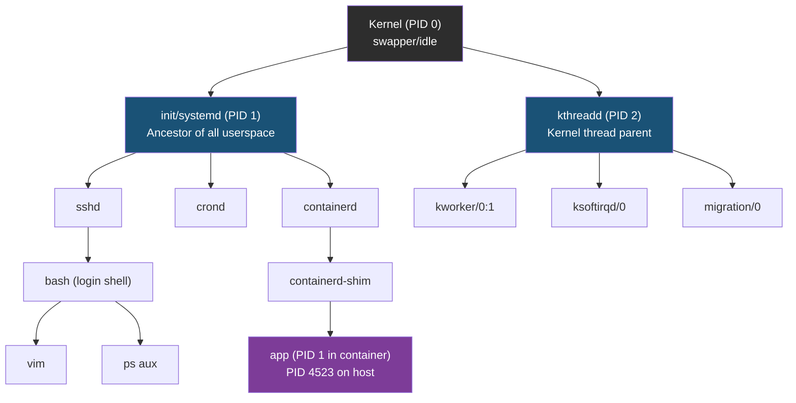
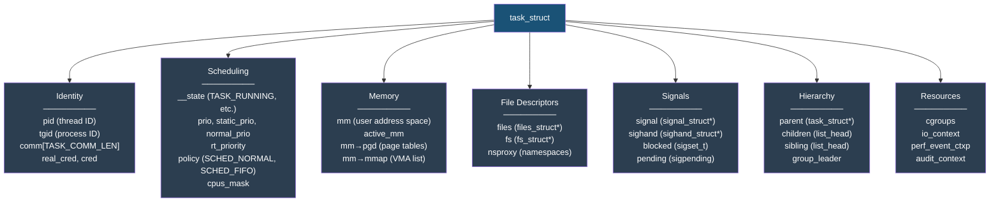
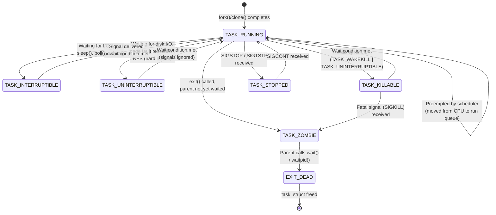
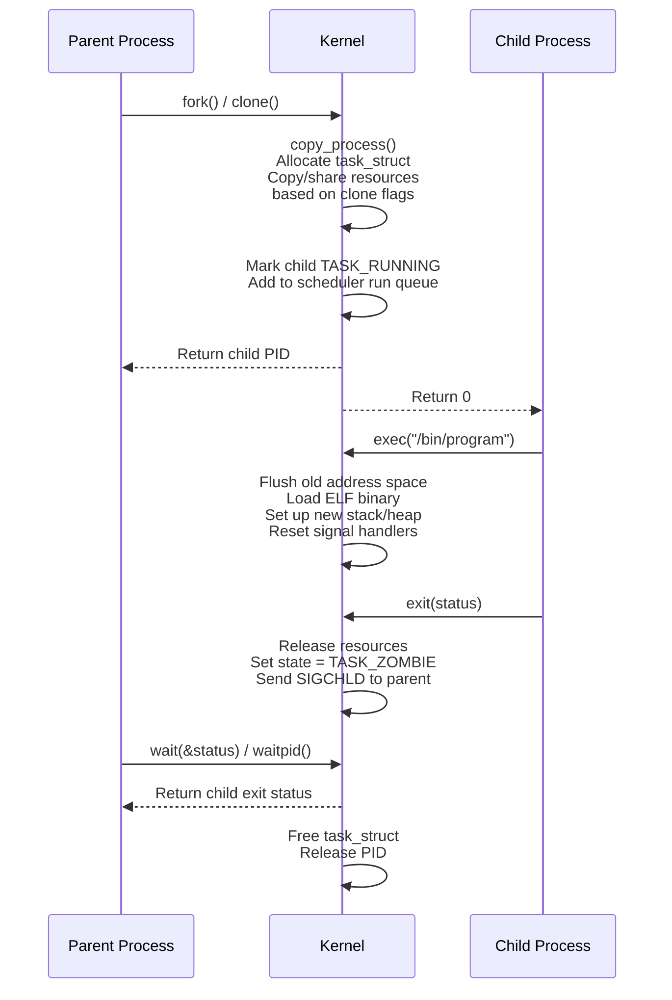
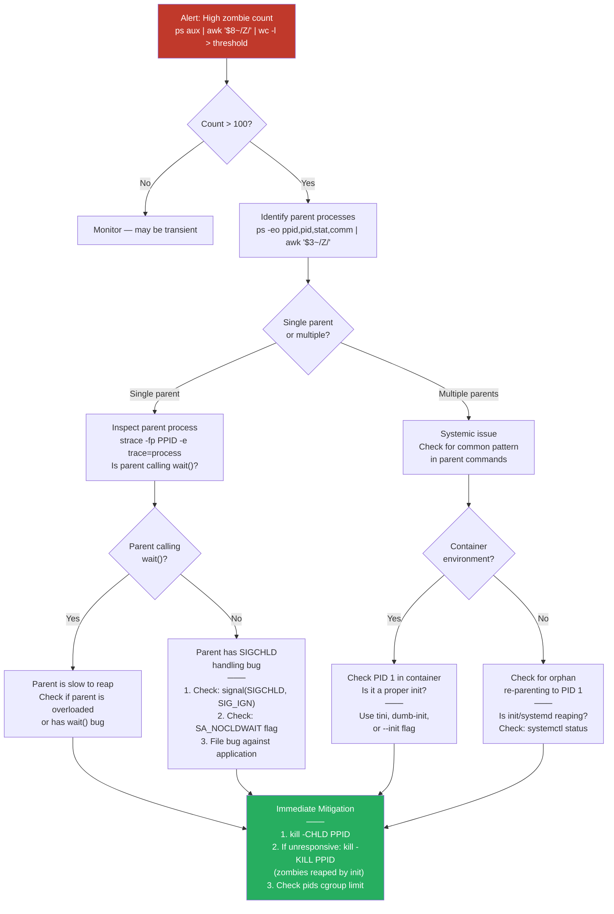

# Topic 01: Process Management

> **Target Audience:** Senior SRE / Cloud Engineers (10+ years experience)
> **Depth:** Kernel internals, production debugging, FAANG-scale incidents
> **Cross-references:** [CPU Scheduling](../02-cpu-scheduling/cpu-scheduling.md) | [Memory Management](../03-memory-management/memory-management.md) | [Kernel Internals](../07-kernel-internals/kernel-internals.md)

---

## Section 1: Concept (Senior-Level Understanding)

### The Linux Process Model

A process is the kernel's abstraction for a running program. It encapsulates an address space, one or more threads of execution, open file descriptors, signal dispositions, credentials, namespaces, and scheduling parameters. The kernel tracks all of this through a single data structure per thread: `task_struct`.

Linux does not distinguish between processes and threads at the kernel level. Both are represented as `task_struct` instances managed by the same scheduler. The difference lies solely in what resources are shared:

| Attribute | Process (fork) | Thread (clone + shared flags) |
|-----------|---------------|-------------------------------|
| Address space (`mm_struct`) | Copied (COW) | Shared |
| File descriptors (`files_struct`) | Copied | Shared |
| Signal handlers (`sighand_struct`) | Copied | Shared |
| PID namespace identity | New PID | New PID, same TGID |
| Credentials | Copied | Shared |

**Key insight for interviews:** When someone asks "what is the difference between a process and a thread in Linux," the correct kernel-level answer is: there is no fundamental difference. Both are `task_struct` objects. A "thread" is simply a `task_struct` that was created with `clone()` flags specifying shared memory (`CLONE_VM`), shared file descriptors (`CLONE_FILES`), and shared signal handlers (`CLONE_SIGHAND`). The userspace concept of "process" maps to a thread group (all tasks sharing the same `TGID`).

### Trade-offs: Processes vs Threads

| Consideration | Multi-process | Multi-threaded |
|---------------|---------------|----------------|
| Fault isolation | One crash does not affect others | One crash kills all threads |
| Memory overhead | Higher (separate page tables, COW) | Lower (shared address space) |
| Context switch cost | Higher (TLB flush required) | Lower (no TLB flush for same mm) |
| Communication | IPC required (pipes, sockets, shm) | Direct memory access |
| Security isolation | Strong (separate credentials possible) | Weak (shared credentials) |
| Debugging | Easier (independent state) | Harder (shared state, race conditions) |

**Production pattern:** At FAANG scale, the multi-process model (e.g., Chromium's site isolation, nginx worker processes, PostgreSQL backends) is preferred when fault isolation is critical. Multi-threaded models (e.g., Java services, Go goroutines mapped to OS threads) are preferred when low-latency inter-thread communication matters.

### Process Hierarchy



Every userspace process descends from PID 1 (`init` or `systemd`). Kernel threads descend from PID 2 (`kthreadd`). When a parent process exits before its children, the orphaned children are re-parented to PID 1 (or to the nearest `subreaper` process if one has been set via `prctl(PR_SET_CHILD_SUBREAPER)`). This re-parenting is critical because PID 1 is responsible for calling `wait()` on these orphans to reap their exit status and prevent zombie accumulation.

---

## Section 2: Internal Working (Kernel-Level Deep Dive)

### 2.1 The `task_struct` — Process Descriptor

Every schedulable entity in the Linux kernel is represented by a `task_struct` (defined in `include/linux/sched.h`). This structure is approximately 6-8 KB and contains hundreds of fields. The key fields relevant to SRE work:



**Critical distinction — PID vs TGID:**

| Field | Kernel Name | Userspace Mapping | `getpid()` returns | `gettid()` returns |
|-------|-------------|-------------------|--------------------|--------------------|
| `pid` | Thread ID | Unique per thread | TGID | PID |
| `tgid` | Thread Group ID | What userspace calls "PID" | TGID | PID |

In a single-threaded process, `pid == tgid`. In a multi-threaded process, all threads share the same `tgid` (the PID of the thread group leader) but each has a unique `pid`. The `getpid()` syscall returns `tgid`, not `pid`. This is a common interview trick question.

### 2.2 Process States and Transitions



**State details:**

| State | ps STAT | Description | Can be killed? |
|-------|---------|-------------|----------------|
| `TASK_RUNNING` | `R` | On run queue or actively executing on CPU | Yes |
| `TASK_INTERRUPTIBLE` | `S` | Sleeping, wakes on signal or event | Yes |
| `TASK_UNINTERRUPTIBLE` | `D` | Sleeping, will NOT wake on signal | No (not even SIGKILL) |
| `TASK_KILLABLE` | `D` | Like uninterruptible, but wakes on fatal signals | Only SIGKILL |
| `TASK_STOPPED` | `T` | Stopped by signal (SIGSTOP/SIGTSTP) | Yes (SIGKILL) |
| `TASK_TRACED` | `t` | Stopped by debugger (ptrace) | Yes (after detach) |
| `TASK_ZOMBIE` | `Z` | Exited, waiting for parent to reap | Already dead |
| `EXIT_DEAD` | `X` | Final state, being removed | N/A |

**Why `TASK_UNINTERRUPTIBLE` exists:** Certain kernel code paths (disk I/O, page fault handling, mutex acquisition) must not be interrupted mid-operation or data structures could be left in an inconsistent state. The process sleeps in `D` state until the operation completes. If the operation never completes (e.g., NFS server goes down on a hard mount), the process is stuck forever.

**`TASK_KILLABLE` (kernel 2.6.25+):** Introduced to solve the "unkillable NFS process" problem. It is `TASK_WAKEKILL | TASK_UNINTERRUPTIBLE` — the process ignores most signals but will respond to fatal signals like `SIGKILL`. NFS client code has been progressively converted to use this state.

### 2.3 Process Creation: `fork()` / `clone()` / `exec()` Internals

#### The `fork()` → `exec()` → `wait()` → `exit()` Lifecycle



#### Copy-on-Write (COW)

When `fork()` is called, the kernel does NOT immediately copy the parent's entire address space. Instead:

1. The parent's page table entries are duplicated (a cheap metadata copy)
2. All writable pages are marked read-only in BOTH parent and child
3. When either process writes to a page, a page fault occurs
4. The kernel's fault handler allocates a new physical page, copies the old page's content, and updates the faulting process's page table to point to the new copy
5. The other process retains the original page

**Why COW matters in production:**
- `fork()` is fast even for processes with large address spaces (e.g., Redis with 30 GB datasets)
- But if the child (or parent) writes to many pages after fork, the COW faults cause a memory spike — this is the infamous Redis `BGSAVE` memory doubling issue
- `vfork()` is an optimization that suspends the parent until the child calls `exec()` or `exit()`, avoiding even the page table copy

#### `clone()` Flags

`clone()` is the underlying syscall. `fork()` is `clone()` with no sharing flags. `pthread_create()` is `clone()` with maximum sharing.

| Flag | What is shared |
|------|---------------|
| `CLONE_VM` | Address space (memory) |
| `CLONE_FILES` | File descriptor table |
| `CLONE_FS` | Filesystem info (cwd, root, umask) |
| `CLONE_SIGHAND` | Signal handlers |
| `CLONE_THREAD` | Thread group (same TGID) |
| `CLONE_NEWPID` | New PID namespace |
| `CLONE_NEWNS` | New mount namespace |
| `CLONE_NEWNET` | New network namespace |
| `CLONE_NEWUSER` | New user namespace |

### 2.4 Signals Internals

Signals are software interrupts delivered to processes. The kernel maintains per-task signal state:

| Component | Location | Purpose |
|-----------|----------|---------|
| `sighand_struct` | `task→sighand` | Signal handler function pointers (shared by threads) |
| `sigpending` | `task→pending` | Per-thread pending signal queue |
| `sigpending` | `task→signal→shared_pending` | Process-wide pending signal queue |
| `sigset_t` | `task→blocked` | Bitmask of currently blocked signals |

**Signal delivery flow:**
1. Sender calls `kill(pid, sig)` — kernel places signal on target's pending queue
2. If target is in `TASK_INTERRUPTIBLE` sleep, kernel wakes it
3. On return to userspace (from syscall or interrupt), kernel checks pending signals
4. If a handler is registered, kernel sets up a signal frame on the user stack and redirects execution to the handler
5. After handler returns (via `sigreturn()`), original execution resumes

**Signals that cannot be caught or ignored:** `SIGKILL` (9) and `SIGSTOP` (19). These are handled entirely by the kernel.

| Signal | Number | Default Action | Common Use |
|--------|--------|---------------|------------|
| `SIGHUP` | 1 | Terminate | Daemon config reload |
| `SIGINT` | 2 | Terminate | Ctrl+C |
| `SIGQUIT` | 3 | Core dump | Ctrl+\\ |
| `SIGKILL` | 9 | Terminate (uncatchable) | Force kill |
| `SIGSEGV` | 11 | Core dump | Memory violation |
| `SIGPIPE` | 13 | Terminate | Broken pipe |
| `SIGTERM` | 15 | Terminate | Graceful shutdown |
| `SIGCHLD` | 17 | Ignore | Child status change |
| `SIGSTOP` | 19 | Stop (uncatchable) | Freeze process |
| `SIGTSTP` | 20 | Stop | Ctrl+Z |
| `SIGCONT` | 18 | Continue | Resume stopped process |
| `SIGUSR1` | 10 | Terminate | App-defined (e.g., log reopen) |
| `SIGUSR2` | 12 | Terminate | App-defined |

---

## Section 3: Commands + Practical Examples

### 3.1 Process Inspection

#### `ps` — Snapshot of current processes

```bash
# The SRE's daily driver — show all processes with full detail
ps auxf
# a = all users, u = user-oriented format, x = include daemonized, f = forest (tree)

# Custom format — exactly the fields you need for debugging
ps -eo pid,ppid,uid,stat,wchan:20,comm,args --sort=-%mem | head -30

# Find zombies
ps aux | awk '$8 ~ /^Z/ { print }'

# Show threads for a specific process
ps -Lp <PID> -o pid,tid,nlwp,pcpu,pmem,stat,wchan:20,comm

# Show process tree rooted at a specific PID
ps -ejH   # or: pstree -p <PID>

# Show all D-state (uninterruptible sleep) processes
ps -eo pid,ppid,stat,wchan:32,comm | awk '$3 ~ /D/'
```

**Reading `ps` STAT column (compound states):**
```
STAT  Meaning
────  ────────────────────────────────────────
Ss    Sleeping, session leader
R+    Running, foreground process group
Dl    Uninterruptible sleep, multi-threaded
Z     Zombie
T     Stopped
Ssl   Sleeping, session leader, multi-threaded
```

Modifiers: `s` = session leader, `l` = multi-threaded, `+` = foreground, `<` = high priority, `N` = low priority, `L` = pages locked in memory.

#### `top` / `htop` — Real-time monitoring

```bash
# top with per-core CPU view (press '1' inside top)
top -H -p <PID>    # -H shows threads, -p filters to one process

# Batch mode for scripting (capture one snapshot)
top -bn1 -o %MEM | head -20

# htop — superior interactive process viewer
htop -p <PID>      # monitor specific process
htop -t             # tree view
```

**Critical `top` header fields for SRE:**
```
load average: 12.5, 8.3, 4.1    # 1/5/15 min — rising = growing problem
Tasks: 423 total, 3 running, 417 sleeping, 0 stopped, 3 zombie
%Cpu(s): 45.2 us, 12.1 sy, 0.0 ni, 38.4 id, 3.2 wa, 0.0 hi, 1.1 si
#         user    system   nice    idle    iowait  hw_irq  sw_irq
```

If `wa` (iowait) is high, processes are blocked on disk/network I/O. If `sy` (system) is high, kernel overhead is significant (possibly excessive syscalls or context switches).

### 3.2 Process Discovery and Signaling

```bash
# Find PID by name (better than ps | grep)
pgrep -a nginx           # -a shows full command line
pgrep -u www-data -c     # count processes owned by user
pidof sshd                # returns all PIDs for exact name match

# Kill by name — dangerous in production, use with filters
pkill -TERM -u deploy -f "celery worker"
# -f matches against full command line, -u filters by user

# Signal a process
kill -TERM <PID>          # graceful shutdown (signal 15)
kill -HUP <PID>           # config reload for daemons
kill -USR1 <PID>          # app-defined (nginx: reopen logs)
kill -KILL <PID>          # last resort (signal 9) — no cleanup

# Kill all children of a process
pkill -TERM -P <PPID>    # -P matches parent PID
```

### 3.3 Priority and Scheduling

```bash
# Start a process with modified niceness
nice -n 10 ./batch-job.sh          # lower priority (higher nice)
nice -n -20 ./latency-critical     # highest priority (root only)

# Change niceness of running process
renice -n 15 -p <PID>             # set nice to 15
renice -n -5 -u postgres          # boost all postgres processes

# Real-time scheduling (use with extreme caution)
chrt -f 99 ./realtime-app          # SCHED_FIFO, priority 99
chrt -r 50 -p <PID>               # SCHED_RR, priority 50
chrt -p <PID>                      # query current policy
```

### 3.4 `/proc` Filesystem — The Kernel's Window

```bash
# Process status overview
cat /proc/<PID>/status
# Key fields: State, Pid, PPid, Uid, VmRSS, VmSize, Threads, voluntary_ctxt_switches

# Memory map — which libraries, heap, stack regions
cat /proc/<PID>/maps | head -20

# Open file descriptors — find leaked FDs, socket connections
ls -la /proc/<PID>/fd/ | wc -l        # count open FDs
ls -la /proc/<PID>/fd/ | grep socket  # find network connections
readlink /proc/<PID>/fd/3             # what is FD 3 pointing to?

# File descriptor limits
cat /proc/<PID>/limits | grep "open files"

# Current working directory and executable
readlink /proc/<PID>/cwd
readlink /proc/<PID>/exe

# Environment variables (null-delimited)
cat /proc/<PID>/environ | tr '\0' '\n'

# Kernel stack trace (requires root) — find where process is blocked
cat /proc/<PID>/stack

# Wait channel — one-word summary of what process is waiting on
cat /proc/<PID>/wchan

# cgroup membership
cat /proc/<PID>/cgroup

# Namespace IDs
ls -la /proc/<PID>/ns/

# System-wide PID limit
cat /proc/sys/kernel/pid_max
# Default: 32768 (can be raised to 4194304 = 2^22)

# Current number of processes
ls -d /proc/[0-9]* | wc -l
```

---

## Section 4: Advanced Debugging & Observability

### 4.1 `strace` — System Call Tracing

```bash
# Attach to running process
strace -fp <PID> -e trace=network -o /tmp/strace.out
# -f follows forks, -p attaches, -e filters syscalls

# Common trace filters
strace -e trace=open,openat,read,write -p <PID>    # file I/O
strace -e trace=network -p <PID>                     # socket ops
strace -e trace=signal -p <PID>                      # signal delivery
strace -e trace=process -p <PID>                     # fork/exec/exit
strace -e trace=memory -p <PID>                      # mmap/brk/mprotect

# Timing analysis — find slow syscalls
strace -T -p <PID>                          # -T = time spent in each syscall
strace -c -p <PID>                          # -c = summary statistics
strace -e trace=read -e read=3 -p <PID>    # dump data read from FD 3

# Trace a command from start
strace -ff -o /tmp/trace ./my-daemon
# -ff = follow forks into separate output files per PID
```

### 4.2 Other Debugging Tools

```bash
# ltrace — library call tracing
ltrace -p <PID> -e malloc+free    # track memory allocation calls

# perf — hardware/software performance counters
perf top -p <PID>                 # live sampling
perf record -g -p <PID> -- sleep 30   # record 30s profile with callgraphs
perf report                        # analyze recording

# /proc/<PID>/stack — kernel stack trace
cat /proc/<PID>/stack
# Example output for a D-state NFS process:
# [<0>] rpc_wait_bit_killable+0x24/0x90 [sunrpc]
# [<0>] __rpc_execute+0xf5/0x1f0 [sunrpc]
# [<0>] rpc_execute+0x60/0xa0 [sunrpc]
# [<0>] nfs_execute_read+0x51/0x80 [nfs]

# /proc/<PID>/wchan — what the process is waiting on
cat /proc/<PID>/wchan
# Examples: "futex_wait_queue_me", "pipe_wait", "poll_schedule_timeout"

# lsof — list open files for process
lsof -p <PID>                    # all open files
lsof -i -p <PID>                 # network connections only
lsof +D /var/log                 # who has files open in /var/log
```

### 4.3 Zombie Process Debugging Decision Tree



---

## Section 5: Real-World Production Scenarios

### Incident 1: Fork Bomb DoS on Shared Compute Cluster

**Context:** A multi-tenant Hadoop/Spark cluster running hundreds of jobs. A user submitted a bash script containing `:(){ :|:& };:` (classic fork bomb) as part of a data pipeline test.

**Symptoms:**
- Load average spiked from 4.0 to 3000+ within seconds
- SSH connections to the node timed out
- All other jobs on the node froze
- Monitoring showed PID allocation failures: `fork: retry: Resource temporarily unavailable`
- Node became unresponsive to cluster manager heartbeats and was fenced

**Investigation:**
```bash
# From a pre-existing SSH session or console (if accessible):
dmesg | grep -i "fork"
# cgroup: fork rejected by pids controller in /user.slice/user-1001.slice

# If you can get a shell:
ps aux | wc -l
# 32767 — PID space exhausted

cat /proc/sys/kernel/pid_max
# 32768

ps -eo user,pid,ppid,comm --sort=user | awk '{print $1}' | sort | uniq -c | sort -rn | head
# 31000+ processes owned by user "datateam"

pstree -p <user_shell_PID> | head -50
# Exponential branching tree
```

**Root Cause:** No per-user process limits were configured. The default `pid_max` of 32768 was exhausted by a single user's fork bomb. The node had no cgroup-based PID limits.

**Immediate Mitigation:**
1. Kill the entire process tree: `loginctl kill-user datateam` or `kill -9 -1` (as the user via sudo)
2. If system is too overloaded, use SysRq: `echo i > /proc/sysrq-trigger` (SIGKILL all processes except init)
3. As a last resort, hard reboot via IPMI/BMC

**Long-term Fix:**
1. Set per-user process limits in `/etc/security/limits.conf`: `* hard nproc 4096`
2. Enable cgroup-based PID limits via systemd: `TasksMax=4096` in user slices
3. Raise `pid_max` to 4194304 on large machines: `sysctl -w kernel.pid_max=4194304`
4. Deploy process count monitoring with alerting at 80% of limits

**Prevention:**
- Enforce `ulimit -u` via PAM for all login sessions
- Use cgroup v2 `pids.max` controller for workload isolation
- Implement admission control in job schedulers to reject scripts with known fork bomb patterns
- Run untrusted workloads in containers with cgroup PID limits

---

### Incident 2: Zombie Process Accumulation from Buggy Daemon

**Context:** A microservice written in Python (using `subprocess.Popen`) spawned child processes to handle image processing jobs. After a code deployment, zombie count began climbing.

**Symptoms:**
- Monitoring alert: `zombie_process_count > 500` and rising steadily
- `top` header showed: `Tasks: 2847 total, 3 running, 1200 sleeping, 0 stopped, 1644 zombie`
- The microservice was still functional but approaching the container's `pids.max` limit of 4096
- Kubernetes began failing health checks on neighboring pods due to PID pressure

**Investigation:**
```bash
# Confirm zombie count
ps aux | awk '$8 == "Z"' | wc -l
# 1644

# Find parent of zombies
ps -eo ppid,stat | awk '$2 == "Z" {print $1}' | sort | uniq -c | sort -rn
# 1644 12345    <-- all zombies have same parent

# Inspect the parent
ps -p 12345 -o pid,ppid,stat,comm,args
# 12345  1  Ssl  python3  /app/image-processor.py

# Check if parent is handling SIGCHLD
strace -fp 12345 -e trace=wait4,waitpid,waitid 2>&1 | head
# (no wait calls observed over 30 seconds)

# Confirm the code bug
cat /proc/12345/environ | tr '\0' '\n' | grep DEPLOY
# DEPLOY_VERSION=v2.3.1 — the deployment that introduced the bug
```

**Root Cause:** A code refactor replaced `subprocess.run()` (which calls `wait()`) with `subprocess.Popen()` without ever calling `.wait()` or `.communicate()` on the returned `Popen` object. Child processes completed but their exit status was never collected, leaving them as zombies.

**Immediate Mitigation:**
1. Restart the microservice (kills parent, zombies are re-parented to init and reaped)
2. Deploy hotfix: add `.wait()` calls or use `subprocess.run()`
3. Alternatively, send `SIGCHLD` to parent to nudge a handler: `kill -CHLD 12345`

**Long-term Fix:**
1. Add `signal.signal(signal.SIGCHLD, signal.SIG_IGN)` as a defense-in-depth (tells kernel to auto-reap children)
2. Code review checklist: every `Popen()` must have a corresponding `.wait()` or `.communicate()`
3. Add zombie count to service health checks
4. Set `pids.max` in Kubernetes pod spec to prevent cascade

**Prevention:**
- Linting rules to flag `Popen()` without `.wait()`
- Container base images should use `tini` or `dumb-init` as PID 1 (they reap orphaned zombies)
- Monitor `/proc/loadavg` field 4 (zombie count) with alerting

---

### Incident 3: PID Namespace Leak in Container Orchestration

**Context:** A Kubernetes cluster running thousands of short-lived batch jobs (CronJobs completing in 5-30 seconds). Over several days, the host's PID space began filling up even though container process counts were normal.

**Symptoms:**
- Node-level monitoring showed steadily increasing PID consumption
- `cat /proc/sys/kernel/pid_max` was 32768, and `ls -d /proc/[0-9]* | wc -l` showed 28000+ even with only 40 running containers
- New pod creation started failing with `cannot allocate memory` (misleading error — actual cause was PID exhaustion)
- `kubelet` logs: `Failed to create sandbox: rpc error: code = Unknown desc = failed to start sandbox container`

**Investigation:**
```bash
# Count active PID namespaces
ls /proc/*/ns/pid | xargs readlink | sort -u | wc -l
# 8500 — far more than the 40 running containers

# Look for leaked namespace references
find /var/run/containerd -name "*.pid" | wc -l
# 8200 stale PID files

# Check for shim processes still holding namespace references
ps aux | grep containerd-shim | wc -l
# 8100 containerd-shim processes — they should have exited

# Inspect a shim
strace -p <SHIM_PID> -e trace=wait4
# shim is blocked in wait4() — child already exited but shim didn't get the signal
```

**Root Cause:** A containerd bug caused `containerd-shim` processes to leak when containers exited during a narrow race condition. Each leaked shim held a reference to a PID namespace, preventing namespace cleanup. The leaked namespaces each consumed kernel memory (PID namespace structures, approximately 4 KB each) and a PID slot for the shim itself.

**Immediate Mitigation:**
1. Kill orphaned shim processes: `ps aux | grep containerd-shim | awk '{print $2}' | xargs kill`
2. Restart containerd to force cleanup
3. Cordon the node and drain workloads during recovery

**Long-term Fix:**
1. Upgrade containerd to patched version
2. Raise `pid_max` to 4194304 on all nodes to increase headroom
3. Deploy a DaemonSet that periodically detects and cleans leaked shim processes
4. Add PID namespace count to node-level monitoring

**Prevention:**
- Automated containerd version management with rollout testing
- Node-level PID consumption alerting at 70% threshold
- Periodic namespace leak detection as part of node health checks

---

### Incident 4: SIGKILL Not Working on D-State Process

**Context:** A production database server running PostgreSQL with a storage backend over iSCSI. The storage array experienced a firmware bug causing the iSCSI target to stop responding.

**Symptoms:**
- PostgreSQL processes appeared "hung" — no queries completing
- `ps aux` showed multiple postgres processes in `D` state (uninterruptible sleep)
- `kill -9 <PID>` had no effect — processes remained
- Application connection pools exhausted; full service outage
- DBA attempted `pg_terminate_backend()` — no effect

**Investigation:**
```bash
# Confirm D state
ps -eo pid,stat,wchan:40,comm | grep postgres
# 5501  D  blkdev_issue_flush    postgres
# 5502  D  iSCSI_eh_session_rst  postgres
# 5503  D  io_schedule           postgres

# View kernel stack to understand what they're waiting on
cat /proc/5501/stack
# [<0>] io_schedule+0x12/0x40
# [<0>] blkdev_issue_flush+0xa5/0x100
# [<0>] ext4_sync_file+0x1c2/0x300
# [<0>] do_fsync+0x38/0x70

# Check block device status
cat /sys/block/sda/device/state
# blocked

# Check iSCSI session status
iscsiadm -m session -P 3 | grep -A5 "Target:"
# Session State: FAILED
# Internal iscsid Session State: REOPEN
```

**Root Cause:** The iSCSI target became unresponsive. The kernel's SCSI error handler put the block device in `blocked` state. All processes doing I/O to that device entered `TASK_UNINTERRUPTIBLE` sleep in the block layer, waiting for the error handler to either recover the session or fail the I/O. Since `TASK_UNINTERRUPTIBLE` processes cannot receive signals (including `SIGKILL`), they were completely stuck.

**Immediate Mitigation:**
1. Fix the storage path: restart the iSCSI target or fix the network path
2. If storage cannot be recovered, force the SCSI error handler to give up:
   ```bash
   echo offline > /sys/block/sda/device/state    # or:
   echo 1 > /sys/block/sda/device/delete         # remove the device entirely
   ```
3. Once I/O errors are returned, D-state processes will wake and be killable
4. If all else fails: SysRq reboot (`echo b > /proc/sysrq-trigger`)

**Long-term Fix:**
1. Configure iSCSI timeouts: `node.session.timeo.replacement_timeout = 30` (fail sessions after 30s)
2. Set SCSI device timeout: `echo 30 > /sys/block/sda/device/timeout`
3. Use multipath I/O (`dm-multipath`) for storage redundancy
4. Consider `TASK_KILLABLE` adoption in newer kernel versions for more I/O paths

**Prevention:**
- Storage health monitoring with proactive failover
- Kernel version selection favoring `TASK_KILLABLE` adoption in I/O paths
- Testing storage failure scenarios during disaster recovery drills
- Set aggressive SCSI/iSCSI timeouts to prevent indefinite hangs

---

### Incident 5: Process Stuck in Uninterruptible Sleep Blocking NFS `umount`

**Context:** A fleet of build servers with NFS-mounted shared artifact caches. During a maintenance window, operations attempted to unmount the NFS share to migrate to a new NFS server. The `umount` command hung.

**Symptoms:**
- `umount /mnt/artifacts` hung indefinitely
- `umount -f /mnt/artifacts` also hung (force flag)
- `umount -l /mnt/artifacts` succeeded (lazy unmount) but left D-state processes
- Several build processes were stuck in `D` state, preventing clean shutdown
- The old NFS server could not be decommissioned because clients still held state

**Investigation:**
```bash
# Find processes using the mount point
fuser -mv /mnt/artifacts
#                      USER  PID  ACCESS  COMMAND
# /mnt/artifacts:      build 8801  ..c..   make
#                      build 8802  f....   gcc
#                      build 8803  F....   ld

# Check process states
ps -p 8801,8802,8803 -o pid,stat,wchan:40
# 8801  D  nfs_wait_bit_killable
# 8802  D  rpc_wait_bit_killable
# 8803  S  poll_schedule_timeout

# Check NFS client state
nfsstat -m | grep /mnt/artifacts
# /mnt/artifacts from nfsserver:/exports/artifacts
#  Flags: rw,relatime,vers=4.0,hard,proto=tcp

# The "hard" mount option means NFS will retry forever

# Check kernel stack for stuck process
cat /proc/8801/stack
# [<0>] rpc_wait_bit_killable+0x24/0x90 [sunrpc]
# [<0>] __rpc_execute+0xf5/0x1f0 [sunrpc]
# [<0>] nfs4_proc_getattr+0x68/0xa0 [nfsv4]
```

**Root Cause:** The NFS server was already drained of active connections but the build processes had open file handles on the mount. With `hard` mount option (the default for NFSv4), NFS operations retry indefinitely when the server becomes unreachable. The processes entered `D` state waiting for NFS RPCs that would never complete. However, the kernel was using `TASK_KILLABLE` (visible from `nfs_wait_bit_killable` in wchan), meaning `SIGKILL` should work.

**Immediate Mitigation:**
```bash
# Since wchan shows "killable", SIGKILL should work:
kill -9 8801 8802
# Success! Processes reaped.

# For the non-killable process (8803 in S state, easier):
kill -9 8803

# Now umount succeeds:
umount /mnt/artifacts

# If processes were truly unkillable (older kernel without TASK_KILLABLE):
umount -l /mnt/artifacts    # lazy unmount — removes from namespace
# Then wait for processes to exit naturally or reboot
```

**Long-term Fix:**
1. Use `soft` or `softreval` mount options for non-critical NFS mounts: `mount -o soft,timeo=50,retrans=3`
2. Use `TASK_KILLABLE`-aware kernels (4.x+) — most NFS code paths now use killable waits
3. Implement `autofs` for on-demand mounting with automatic timeout-based unmounting
4. Pre-check for open files before `umount`: `fuser -mv /mnt/target` and `lsof +D /mnt/target`

**Prevention:**
- Maintenance runbooks should always check `fuser`/`lsof` before `umount`
- Use `noac` or `actimeo=0` during maintenance windows to prevent attribute caching stalls
- Monitor NFS client RPC stats (`nfsstat -rc`) for timeouts and retransmissions
- Build systems should use local caching with rsync rather than direct NFS access for build artifacts

---

## Section 6: Advanced Interview Questions

### Category A: Conceptual Deep Questions

**Q1. Explain the relationship between PID and TGID in the Linux kernel. Why does `getpid()` return TGID?** [Senior]

1. In the kernel's `task_struct`, `pid` is the unique thread identifier and `tgid` (Thread Group ID) is the process identifier
2. All threads created by `clone(CLONE_THREAD)` share the same `tgid` but have distinct `pid` values
3. The thread group leader's `pid` equals its `tgid`
4. `getpid()` returns `tgid` (not `pid`) to maintain POSIX compatibility — POSIX specifies that all threads in a process share the same process ID
5. `gettid()` returns the kernel `pid` field (the actual thread ID)
6. This means `/proc/<PID>/task/<TID>` directories use kernel `pid` values for TIDs while the directory name uses `tgid` for PID

**Q2. What happens to a process's children when the parent dies? Describe the complete orphan handling mechanism.** [Senior]

1. The kernel calls `forget_original_parent()` in `exit_notify()`
2. All children are re-parented — the new parent is determined by:
   - First, check for a `subreaper` ancestor (set via `prctl(PR_SET_CHILD_SUBREAPER)`)
   - If no subreaper exists, re-parent to PID 1 (`init`/`systemd`)
3. Any children that are already zombies get immediately reaped by the new parent
4. `SIGCHLD` is sent to the new parent for any zombie children
5. The subreaper mechanism was introduced for container init processes (e.g., `tini`, `dumb-init`) — they register as subreapers so orphans are adopted by the container's PID 1, not the host's PID 1
6. In a PID namespace, the namespace's init process (PID 1 within that namespace) acts as the reaper for all orphans in that namespace

**Q3. Explain Copy-on-Write in `fork()`. What are the performance implications for memory-intensive applications?** [Staff]

1. After `fork()`, parent and child share the same physical memory pages
2. The kernel marks all writable pages as read-only in both processes' page tables
3. When either process writes, a page fault occurs, the kernel allocates a new page, copies the content, and updates the page table
4. This makes `fork()` O(page_table_size) not O(memory_size) — very fast even for large processes
5. **Performance implications:**
   - Redis `BGSAVE`: fork for background save can cause memory usage to temporarily double if the dataset is being actively written during the save (every modified page gets copied)
   - JVM garbage collectors: a GC cycle after fork can trigger COW on large portions of the heap
   - Transparent Huge Pages (THP) amplify COW cost: a single write to a 2MB huge page requires copying the entire 2MB, not just 4KB
6. **Mitigation strategies:**
   - Disable THP for Redis: `echo never > /sys/kernel/mm/transparent_hugepage/enabled`
   - Use `posix_spawn()` or `vfork() + exec()` instead of `fork() + exec()` when you just want to launch a new program
   - `MADV_WIPEONFORK` flag (Linux 4.14+) tells kernel to zero pages instead of COW-copying them in the child

**Q4. Why can `SIGKILL` fail to kill a process? List all scenarios.** [Staff]

1. **`TASK_UNINTERRUPTIBLE` (D state):** Process is in an uninterruptible kernel code path (typically block I/O, NFS hard mount). Cannot receive any signals until the kernel operation completes
2. **Zombie process:** Already dead. Not a process anymore, just a process table entry. `SIGKILL` has no target to kill. The parent must call `wait()`
3. **PID 1 (init):** The kernel protects PID 1 from signals it has not explicitly registered handlers for. `SIGKILL` is dropped for init unless it has registered a handler (which it never should)
4. **PID 1 inside a PID namespace:** Similar protection — the namespace init process is immune to `SIGKILL` from within its namespace. It CAN be killed from the parent namespace
5. **Process in a frozen cgroup:** If a cgroup is in `FROZEN` state (via the freezer controller), signals are not delivered until the cgroup is thawed
6. **Kernel thread:** Kernel threads (visible in brackets in `ps`, e.g., `[kworker/0:1]`) cannot be killed by userspace signals

### Category B: Scenario-Based Questions

**Q5. You receive an alert that a production server has 5000 zombie processes. Walk through your investigation and remediation.** [Senior]

1. **Assess severity:** Check `cat /proc/sys/kernel/pid_max` and current PID count. If approaching limit, escalate immediately
2. **Identify zombie parents:**
   ```
   ps -eo ppid,stat | awk '$2=="Z"{print $1}' | sort | uniq -c | sort -rn | head
   ```
3. **Determine if parent is a single process or systemic issue**
4. **Inspect the parent:**
   - `strace -fp <PPID> -e trace=wait4` — is it calling wait()?
   - `cat /proc/<PPID>/status` — check thread count, state
   - Check if parent has `SIGCHLD` set to `SIG_IGN`
5. **Immediate remediation:**
   - Send `SIGCHLD` to parent: `kill -CHLD <PPID>` — may trigger a wait() call
   - Restart the parent process (zombies get re-parented to init and reaped)
   - If parent is unkillable, zombies will persist until reboot
6. **Root cause:** File bug with the application team — parent is not reaping children
7. **Prevention:** Container init process (tini/dumb-init), zombie monitoring alert, `pids.max` cgroup limit

**Q6. A container running in Kubernetes cannot spawn new processes (`fork: Resource temporarily unavailable`), but the host has plenty of resources. Diagnose.** [Senior]

1. **Check cgroup PID limit:**
   ```
   cat /sys/fs/cgroup/pids/<pod-cgroup>/pids.max
   cat /sys/fs/cgroup/pids/<pod-cgroup>/pids.current
   ```
2. **If current is near max:** count zombies inside the container. They consume PID slots
3. **Check container init process:** If PID 1 in the container is the application itself (not a proper init), it will not reap orphaned zombie children
4. **Check thread count:** Threads also consume PID slots in the cgroup. A Java application with 500 threads eats into the limit
5. **Solution:**
   - Increase `pids.max` in pod spec if legitimately needed
   - Fix zombie leak if present
   - Use `shareProcessNamespace: true` in Kubernetes pod spec to enable cross-container PID visibility
   - Add `tini` as PID 1 in Dockerfile: `ENTRYPOINT ["/tini", "--"]`

**Q7. Explain what happens step-by-step when you type `ls | grep foo` in bash, from fork to exit.** [Staff]

1. Bash calls `pipe()` — kernel creates a pipe, returns two file descriptors: `fd[0]` (read end) and `fd[1]` (write end)
2. Bash calls `fork()` for the first child (will run `ls`):
   - Child closes `fd[0]` (read end)
   - Child calls `dup2(fd[1], STDOUT_FILENO)` — redirects stdout to pipe write end
   - Child closes `fd[1]` (original is no longer needed)
   - Child calls `execvp("ls", ...)` — replaces process image with `ls`
3. Bash calls `fork()` for the second child (will run `grep`):
   - Child closes `fd[1]` (write end)
   - Child calls `dup2(fd[0], STDIN_FILENO)` — redirects stdin to pipe read end
   - Child closes `fd[0]`
   - Child calls `execvp("grep", ["grep", "foo"])` — replaces process image with `grep`
4. Bash (parent) closes both pipe FDs (important — otherwise `grep` will never see EOF)
5. `ls` writes to stdout (which is the pipe), then calls `exit(0)` — becomes zombie
6. `grep` reads from stdin (the pipe), filters, writes to its stdout (the terminal), then calls `exit(0)` — becomes zombie
7. Bash calls `waitpid()` for each child, collects exit statuses, zombies are reaped
8. Bash stores `$?` from the last command in the pipeline (`grep`)

**Q8. Your team's Go service is leaking goroutines, and the process has 50,000 threads. What is the system-level impact and how do you investigate?** [Staff]

1. **System impact:**
   - Each OS thread consumes a PID slot (threads are tracked as `task_struct` with unique PIDs)
   - Each thread has a kernel stack (~16KB) and thread-local storage
   - 50,000 threads = ~800 MB of kernel stack memory alone
   - Can hit `threads-max` limit (`cat /proc/sys/kernel/threads-max`)
   - Can exhaust PID space if other processes are also running
2. **Investigation:**
   ```
   cat /proc/<PID>/status | grep Threads   # confirm thread count
   ls /proc/<PID>/task/ | wc -l            # list all thread TIDs
   cat /proc/<PID>/task/<TID>/stack        # per-thread kernel stack
   ```
3. **Go-specific debugging:**
   - Send `SIGQUIT` to the process — Go dumps all goroutine stacks to stderr
   - Use `pprof` endpoint: `curl http://localhost:6060/debug/pprof/goroutine?debug=2`
   - Look for goroutines blocked on channel operations, HTTP connections, or mutexes
4. **Mitigation:** Set `GOMAXPROCS` to limit OS threads, fix goroutine leaks, implement goroutine pool patterns

### Category C: Debugging Questions

**Q9. How do you determine what a process in `D` state is waiting for?** [Senior]

1. `cat /proc/<PID>/wchan` — shows the kernel function the process is sleeping in
2. `cat /proc/<PID>/stack` — full kernel stack trace showing the call chain
3. `cat /proc/<PID>/status | grep State` — confirm D state
4. Common wchan values and their meanings:
   - `io_schedule` — waiting for block I/O
   - `rpc_wait_bit_killable` — NFS RPC call
   - `blkdev_issue_flush` — disk flush
   - `mutex_lock` — kernel mutex contention
   - `page_fault` — waiting for memory page
5. Check block device status: `cat /sys/block/*/device/state`
6. Check NFS status: `nfsstat -rc` for retransmission counts
7. Use `echo w > /proc/sysrq-trigger` to dump all D-state processes to kernel log

**Q10. A process is consuming 100% of a CPU core but no output is being produced. How do you diagnose?** [Senior]

1. **Determine if CPU time is user or system:**
   ```
   pidstat -p <PID> 1 5
   # Watch %usr vs %system columns
   ```
2. **If mostly user-space:** The process is in a tight loop in application code
   - `perf top -p <PID>` — see which function is hot
   - `perf record -g -p <PID> -- sleep 10 && perf report` — flamegraph-ready profile
   - `strace -c -p <PID>` — if no syscalls, it is a pure userspace spin
3. **If mostly kernel-space:** The process is spinning in kernel code
   - `cat /proc/<PID>/stack` — check kernel stack
   - `perf top -p <PID>` — kernel function consuming CPU
   - May indicate spinlock contention or kernel bug
4. **Check if stuck in a futex spin:**
   - `strace -e futex -p <PID>` — repeated `futex(FUTEX_WAIT)` returning immediately indicates a livelock
5. **For Java/Go processes:** Use language-specific profilers (jstack, async-profiler, pprof)

**Q11. After deploying a new kernel, processes randomly receive SIGSEGV. How do you investigate?** [Staff]

1. **Collect core dumps:** Ensure `ulimit -c unlimited` and check `cat /proc/sys/kernel/core_pattern`
2. **Analyze with gdb:**
   ```
   gdb /path/to/binary /path/to/core
   (gdb) bt full        # full backtrace
   (gdb) info registers # check instruction pointer
   ```
3. **Check kernel changelog:** Look for changes in memory management, ASLR, or security features
4. **Compare sysctl settings:** `diff <(ssh old-kernel-host sysctl -a) <(sysctl -a)`
5. **Check SMEP/SMAP:** New kernel may enable Supervisor Mode Execution/Access Prevention
6. **Check compiler flags:** If kernel was compiled with different options (e.g., `CONFIG_HARDENED_USERCOPY`)
7. **Use `dmesg`:** Look for kernel messages about memory violations, segfault addresses
8. **Bisect:** If possible, test with intermediate kernel versions to narrow the regression

**Q12. How do you trace why a process is slow to start?** [Senior]

1. `strace -T -o /tmp/startup.log <command>` — timestamp each syscall with elapsed time
2. Sort by time: `awk '{print $NF, $0}' /tmp/startup.log | sort -rn | head -20`
3. Common culprits:
   - `openat()` calls to network filesystems (NFS, CIFS) — look for slow returns
   - DNS resolution in `connect()` — check `nsswitch.conf` and resolver config
   - Shared library loading — excessive `mmap()` calls for `.so` files
   - SELinux/AppArmor policy evaluation — visible in `access()` and `stat()` calls
4. `perf stat <command>` — shows total syscall count, context switches, CPU migrations
5. `bootchart` / `systemd-analyze blame` for service startup specifically

### Category D: Trick Questions

**Q13. Can a zombie process be killed with `kill -9`?** [Senior]

- **No.** A zombie is already dead. It has already called `exit()`. There is no running code to receive the signal
- The `Z` entry in the process table is just a placeholder holding the exit status until the parent calls `wait()`
- The only way to remove a zombie is:
  1. The parent calls `wait()` / `waitpid()` to collect the exit status
  2. The parent is killed (zombies are re-parented to init, which reaps them)
  3. System reboot
- The PID consumed by the zombie IS released back to the pool after reaping
- Zombies consume no CPU, no memory (their address space is already freed), just a `task_struct` slot (~6 KB) and a PID

**Q14. If `fork()` returns 0, are you in the parent or child? What if it returns -1?** [Senior]

- Return value 0: **you are in the child process**
- Return value > 0: you are in the parent, and the return value is the child's PID
- Return value -1: `fork()` **failed** — no child was created. Common reasons:
  1. `EAGAIN`: PID limit reached (`pid_max`, `ulimit -u`, cgroup `pids.max`)
  2. `ENOMEM`: Insufficient memory for new `task_struct` or page tables
- **Trick aspect:** Many candidates say "0 means parent" — it is the opposite
- The reason for this design: the child needs to know it is the child (to call `exec()`), while the parent needs the child's PID (to call `waitpid()`)

**Q15. Is it possible for a process to have PID 0? What about negative PIDs?** [Principal]

- **PID 0:** The idle task (swapper) has PID 0. It is created by the kernel during boot, not via `fork()`. It is never visible in userspace process listings because it runs only when no other process is schedulable. On SMP systems, each CPU has its own idle task, all with PID 0
- **Negative PIDs:** Not valid as process IDs, but `kill()` uses negative PID values with special semantics:
  - `kill(0, sig)` — send signal to all processes in the caller's process group
  - `kill(-1, sig)` — send signal to all processes the caller has permission to signal (except PID 1)
  - `kill(-pgid, sig)` — send signal to all processes in process group `pgid`
- **Follow-up trap:** PID 0 is not the same as kernel threads (those have PIDs > 0 and are children of PID 2, `kthreadd`)

---

## Section 7: Common Pitfalls & Misconceptions

### Pitfall 1: Using `kill -9` as the first resort
- `SIGKILL` prevents clean shutdown: no flushing buffers, no releasing locks, no closing connections gracefully, no removing PID files
- **Correct approach:** `SIGTERM` first, wait 10-30 seconds, then `SIGKILL` only if the process does not exit
- Production impact: killing a database process with `SIGKILL` can require crash recovery on restart, adding minutes of downtime

### Pitfall 2: Confusing `SIGKILL` failure with a bug
- If `kill -9` does not work, the process is either in `D` state (uninterruptible sleep), is a zombie, or is PID 1
- This is not a kernel bug — it is working as designed
- Check `ps -o stat -p <PID>` before concluding that kill is broken

### Pitfall 3: Believing that zombie processes consume resources
- Zombies consume no CPU, no memory, and no file descriptors
- They consume exactly one `task_struct` (~6 KB) and one PID slot
- The danger is PID exhaustion (relevant when `pid_max` is low or cgroup `pids.max` is reached), not resource consumption
- A single zombie is completely harmless. Thousands indicate a bug in the parent

### Pitfall 4: Not understanding the difference between `ps aux` and `ps -ef`
- `ps aux` uses BSD syntax (no dash), shows `%CPU`, `%MEM`, `VSZ`, `RSS`, `STAT`
- `ps -ef` uses UNIX/POSIX syntax (with dash), shows `UID`, `PPID`, `STIME`
- They are NOT equivalent. `ps aux` shows memory usage; `ps -ef` shows parent PID
- For debugging, `ps -eo pid,ppid,stat,wchan:30,comm,args` with custom fields is superior to both

### Pitfall 5: Assuming `kill <PID>` always sends SIGTERM
- `kill <PID>` sends `SIGTERM` (15) — correct
- But `kill -<PID>` (negative PID) sends the signal to the entire process group — potentially killing unrelated processes
- Dangerous in scripts: always use `kill -- <PID>` to prevent argument parsing issues with PIDs that could be misinterpreted as signal numbers

### Pitfall 6: Running fork-heavy workloads without process limits
- Default `pid_max` is 32768 — can be exhausted by a single fork bomb in under a second
- `ulimit -u` limits are per-user but easy to bypass (create new users)
- Cgroup `pids.max` is the correct control for containerized workloads
- Production systems should ALWAYS have process limits configured at multiple levels

---

## Section 8: Pro Tips (From 15+ Years Experience)

### Tip 1: Always use `tini` or `dumb-init` as PID 1 in containers
In containers, your application typically runs as PID 1. But PID 1 has special signal handling semantics — `SIGTERM` is not delivered unless the process has registered a handler. Additionally, PID 1 is responsible for reaping orphaned zombie children. Most applications do not implement this. Use `tini` (2 KB binary) as the entrypoint:
```dockerfile
RUN apt-get install -y tini
ENTRYPOINT ["/usr/bin/tini", "--"]
CMD ["/app/server"]
```
Or use Docker's `--init` flag: `docker run --init myimage`.

### Tip 2: Prefer `pgrep`/`pkill` over `ps | grep | kill`
The classic anti-pattern `ps aux | grep process | grep -v grep | awk '{print $2}' | xargs kill` is fragile and has race conditions. Use:
```bash
pkill -TERM -f "celery worker --queue=email"
# or for exact name match:
pkill -TERM -x nginx
```
The `-f` flag matches against the full command line. The `-x` flag requires exact command name match.

### Tip 3: Use `process_namespaces` for blast radius control
When running untrusted workloads, isolate at the namespace level. A minimal isolation setup:
```bash
unshare --pid --fork --mount-proc bash
# Now inside a new PID namespace where bash is PID 1
# Processes created here cannot see host processes
```

### Tip 4: Monitor process churn, not just process count
High process creation/destruction rates indicate potential issues (short-lived CGI processes, crash loops, fork bombs starting). Track this via:
```bash
# Process creation rate from /proc/stat
awk '/processes/ {print $2}' /proc/stat   # cumulative forks since boot
# Compare two readings 60 seconds apart for the rate
```

### Tip 5: Use `PR_SET_CHILD_SUBREAPER` for service managers
If you write a process supervisor (like supervisord or a custom daemon manager), register as a subreaper so orphaned grandchildren are re-parented to your supervisor rather than PID 1:
```c
prctl(PR_SET_CHILD_SUBREAPER, 1);
```
This prevents orphan accumulation at PID 1 and keeps your supervision tree intact.

### Tip 6: Know your `/proc` shortcuts
```bash
# Instead of ps, read status directly (faster in scripts)
read -r _ state < /proc/<PID>/stat      # 3rd field is state character

# Quick FD leak detection
watch -n5 "ls /proc/<PID>/fd | wc -l"

# OOM score (higher = more likely to be killed by OOM killer)
cat /proc/<PID>/oom_score
cat /proc/<PID>/oom_score_adj           # adjustable: -1000 to 1000
echo -1000 > /proc/<PID>/oom_score_adj  # protect from OOM killer
```

### Tip 7: Understand `SIGSTOP` + `SIGCONT` for live process surgery
You can freeze a runaway process without killing it, investigate, then resume or kill:
```bash
kill -STOP <PID>     # freeze the process (uncatchable)
# Now safely inspect: strace -p <PID>, /proc/<PID>/*, lsof -p <PID>
kill -CONT <PID>     # resume, or:
kill -KILL <PID>     # kill while stopped
```
This is invaluable during live incident investigation when you want to preserve state.

### Tip 8: Set process names for debuggability
In production services, set thread names for easier debugging:
```python
# Python
import ctypes
ctypes.CDLL('libc.so.6').prctl(15, b'worker-email', 0, 0, 0)
```
```go
// Go - the runtime does this automatically for goroutines
// But for OS threads:
runtime.LockOSThread()
syscall.Prctl(syscall.PR_SET_NAME, uintptr(unsafe.Pointer(&name[0])))
```
Named threads appear in `ps -Lp <PID>`, `htop`, and `top -H`, making it immediately clear what each thread does.

---

## Section 9: Quick Reference Cheatsheet

See the complete cheatsheet: [Process Management Cheatsheet](../cheatsheets/01-process-management.md)

### Essential Commands at a Glance

| Task | Command |
|------|---------|
| List all processes | `ps auxf` |
| Find process by name | `pgrep -a <name>` |
| Show process tree | `pstree -p <PID>` |
| Kill gracefully | `kill -TERM <PID>` |
| Force kill | `kill -KILL <PID>` |
| Find zombies | `ps aux \| awk '$8~/Z/'` |
| Find D-state processes | `ps -eo pid,stat,wchan:30,comm \| awk '$2~/D/'` |
| Check kernel stack | `cat /proc/<PID>/stack` |
| Count open FDs | `ls /proc/<PID>/fd \| wc -l` |
| Trace syscalls | `strace -fp <PID> -e trace=<category>` |
| Check PID limit | `cat /proc/sys/kernel/pid_max` |
| Check process limits | `cat /proc/<PID>/limits` |

### Process States Quick Reference

| STAT | State | Killable? |
|------|-------|-----------|
| `R` | Running/runnable | Yes |
| `S` | Interruptible sleep | Yes |
| `D` | Uninterruptible sleep | No |
| `T` | Stopped | Yes |
| `Z` | Zombie | Already dead |
| `t` | Traced (debugger) | After detach |
| `X` | Dead (exiting) | N/A |

---

## Cross-References

- **[CPU Scheduling](../02-cpu-scheduling/cpu-scheduling.md):** CFS, scheduling classes, nice values, real-time scheduling, cgroup CPU limits
- **[Memory Management](../03-memory-management/memory-management.md):** COW internals, page faults, OOM killer, /proc/<PID>/maps, mm_struct
- **[Kernel Internals](../07-kernel-internals/kernel-internals.md):** task_struct deep dive, syscall mechanism, kernel stack, namespaces

---

*Last updated: 2026-03-24*
