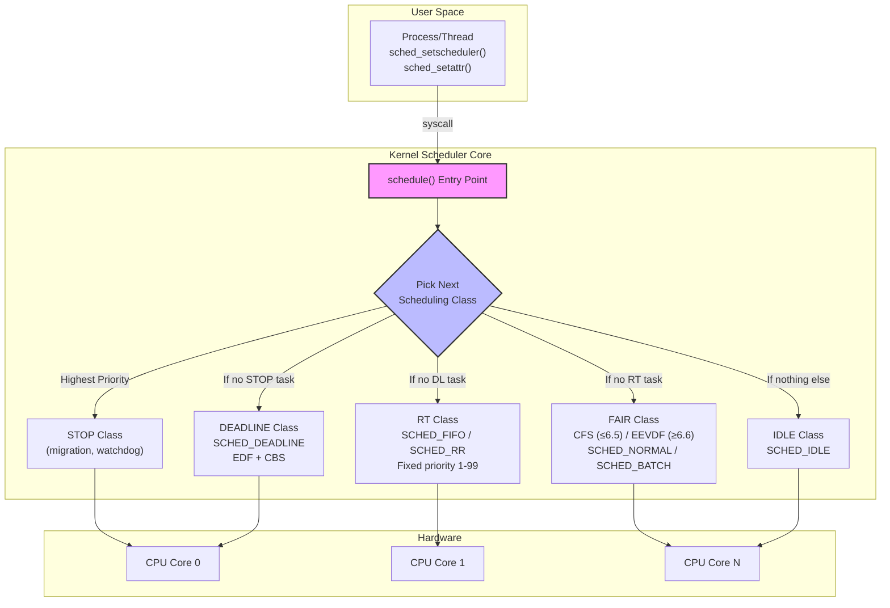
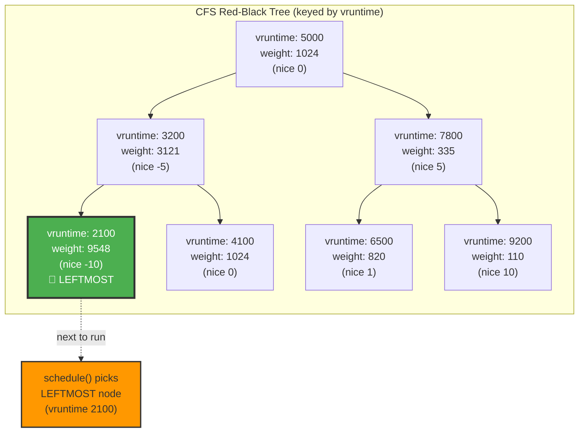
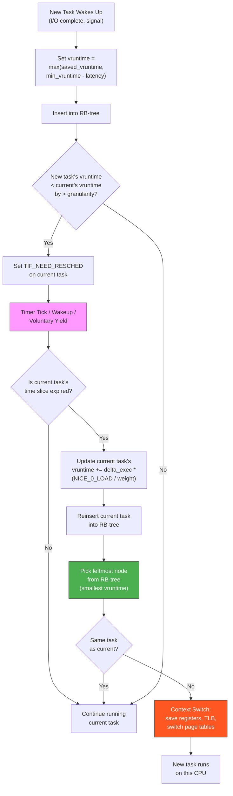
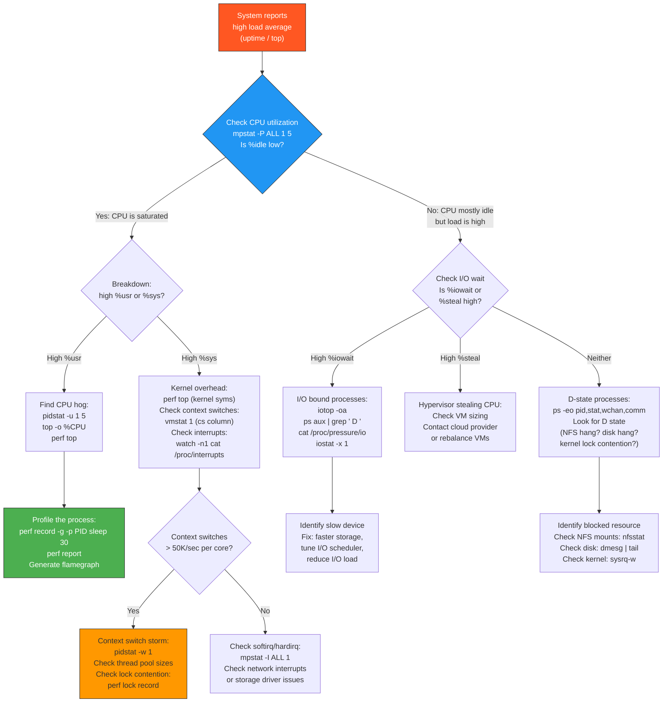

# Topic 02 -- CPU Scheduling

> **Linux Interview Knowledge Base -- Senior SRE / Staff+ / Principal Engineer**
> Cross-references: [Process Management](../01-process-management/process-management.md) | [Memory Management](../03-memory-management/memory-management.md) | [Performance & Debugging](../08-performance-and-debugging/performance-and-debugging.md) | [Kernel Internals](../07-kernel-internals/kernel-internals.md)
> Cheatsheet: [02-cpu-scheduling.md](../cheatsheets/02-cpu-scheduling.md) | Interview questions: [02-cpu-scheduling.md](../interview-questions/02-cpu-scheduling.md)

---

<!-- toc -->
## Table of Contents

- [Section 1: Concept (Senior-Level Understanding)](#section-1-concept-senior-level-understanding)
  - [What CPU Scheduling Actually Means at Scale](#what-cpu-scheduling-actually-means-at-scale)
  - [Scheduling Policies](#scheduling-policies)
  - [Preemption and Time Slices](#preemption-and-time-slices)
  - [Scheduler Architecture Overview](#scheduler-architecture-overview)
- [Section 2: Internal Working (Kernel-Level Deep Dive)](#section-2-internal-working-kernel-level-deep-dive)
  - [2.1 CFS Internals (Kernel <= 6.5)](#21-cfs-internals-kernel-65)
  - [2.2 EEVDF Scheduler (Kernel >= 6.6)](#22-eevdf-scheduler-kernel-66)
  - [2.3 Real-Time Scheduling Classes](#23-real-time-scheduling-classes)
  - [2.4 Load Balancing and CPU Topology](#24-load-balancing-and-cpu-topology)
- [Section 3: Commands + Practical Examples](#section-3-commands-practical-examples)
  - [3.1 Viewing and Setting Scheduling Policy](#31-viewing-and-setting-scheduling-policy)
  - [3.2 Nice and Renice](#32-nice-and-renice)
  - [3.3 CPU Affinity](#33-cpu-affinity)
  - [3.4 Monitoring CPU Scheduling](#34-monitoring-cpu-scheduling)
  - [3.5 cgroups v2 CPU Controller](#35-cgroups-v2-cpu-controller)
- [Section 4: Advanced Debugging & Observability](#section-4-advanced-debugging-observability)
  - [4.1 perf sched -- Scheduler Tracing](#41-perf-sched----scheduler-tracing)
  - [4.2 PSI (Pressure Stall Information)](#42-psi-pressure-stall-information)
  - [4.3 /proc/pressure and schedtool](#43-procpressure-and-schedtool)
  - [4.4 High CPU / High Load Average Debugging Decision Tree](#44-high-cpu-high-load-average-debugging-decision-tree)
- [Section 5: Real-World Production Scenarios](#section-5-real-world-production-scenarios)
  - [Incident 1: CPU Starvation from Runaway RT (SCHED_FIFO) Process](#incident-1-cpu-starvation-from-runaway-rt-sched_fifo-process)
  - [Incident 2: Noisy Neighbor in Shared cgroup Causing Latency Spikes](#incident-2-noisy-neighbor-in-shared-cgroup-causing-latency-spikes)
  - [Incident 3: Load Average Spike with Low CPU -- The Classic I/O Wait Misconception](#incident-3-load-average-spike-with-low-cpu----the-classic-io-wait-misconception)
  - [Incident 4: Context Switch Storm from Thread Pool Misconfiguration](#incident-4-context-switch-storm-from-thread-pool-misconfiguration)
  - [Incident 5: NUMA Imbalance Causing 2x Latency on Cross-Node Memory Access](#incident-5-numa-imbalance-causing-2x-latency-on-cross-node-memory-access)
- [Section 6: Advanced Interview Questions](#section-6-advanced-interview-questions)
  - [Category 1: Conceptual Deep Questions](#category-1-conceptual-deep-questions)
  - [Category 2: Scenario-Based Questions](#category-2-scenario-based-questions)
  - [Category 3: Debugging Questions](#category-3-debugging-questions)
  - [Category 4: Trick Questions](#category-4-trick-questions)
- [Section 7: Common Pitfalls & Misconceptions](#section-7-common-pitfalls-misconceptions)
  - [Pitfall 1: "Load average = CPU utilization"](#pitfall-1-load-average-cpu-utilization)
  - [Pitfall 2: "Nice values are additive -- nice 10 is twice as nice as nice 5"](#pitfall-2-nice-values-are-additive----nice-10-is-twice-as-nice-as-nice-5)
  - [Pitfall 3: "Setting SCHED_FIFO makes my application faster"](#pitfall-3-setting-sched_fifo-makes-my-application-faster)
  - [Pitfall 4: "More threads = more throughput"](#pitfall-4-more-threads-more-throughput)
  - [Pitfall 5: "CPU limits in Kubernetes protect my application"](#pitfall-5-cpu-limits-in-kubernetes-protect-my-application)
  - [Pitfall 6: "isolcpus completely removes a CPU from the scheduler"](#pitfall-6-isolcpus-completely-removes-a-cpu-from-the-scheduler)
  - [Pitfall 7: "Disabling RT throttling (`sched_rt_runtime_us=-1`) is safe because we control all RT tasks"](#pitfall-7-disabling-rt-throttling-sched_rt_runtime_us-1-is-safe-because-we-control-all-rt-tasks)
- [Section 8: Pro Tips (From 15+ Years Experience)](#section-8-pro-tips-from-15-years-experience)
  - [Tip 1: Use PSI Instead of Load Average for Alerting](#tip-1-use-psi-instead-of-load-average-for-alerting)
  - [Tip 2: Profile Before Tuning -- Always](#tip-2-profile-before-tuning----always)
  - [Tip 3: The Thread Pool Formula That Actually Works](#tip-3-the-thread-pool-formula-that-actually-works)
  - [Tip 4: NUMA Pinning Is Table Stakes for Latency-Sensitive Services](#tip-4-numa-pinning-is-table-stakes-for-latency-sensitive-services)
  - [Tip 5: Monitor Throttling, Not Just Utilization](#tip-5-monitor-throttling-not-just-utilization)
  - [Tip 6: The `sched_rt_runtime_us` Safety Net](#tip-6-the-sched_rt_runtime_us-safety-net)
  - [Tip 7: Use `perf sched timehist` for Latency Root Cause](#tip-7-use-perf-sched-timehist-for-latency-root-cause)
  - [Tip 8: cgroup cpu.weight Is More Important Than cpu.max for Mixed Workloads](#tip-8-cgroup-cpuweight-is-more-important-than-cpumax-for-mixed-workloads)
  - [Tip 9: Check `/proc/sys/kernel/sched_autogroup_enabled`](#tip-9-check-procsyskernelsched_autogroup_enabled)
- [Section 9: Cheatsheet](#section-9-cheatsheet)
  - [Quick Reference: Scheduling Policy Comparison](#quick-reference-scheduling-policy-comparison)
  - [Quick Reference: Key /proc and /sys Paths](#quick-reference-key-proc-and-sys-paths)
  - [Quick Reference: Essential Commands](#quick-reference-essential-commands)

<!-- toc stop -->


## Section 1: Concept (Senior-Level Understanding)

### What CPU Scheduling Actually Means at Scale

CPU scheduling is the kernel subsystem that decides **which runnable thread gets to execute on which CPU core for how long**. In a production environment running thousands of containers across multi-socket NUMA servers, scheduling decisions directly affect tail latency, throughput, fairness, and resource cost.

The scheduler must balance three competing goals:

1. **Throughput** -- maximize total work completed per unit time
2. **Latency** -- minimize time from a task becoming runnable to actually running
3. **Fairness** -- ensure proportional CPU share based on configured weights/priorities

### Scheduling Policies

Linux provides multiple scheduling policies organized into **scheduling classes**, each with its own priority domain:

| Class | Policy | Priority Range | Use Case |
|---|---|---|---|
| **Stop** | (internal) | Highest | Migration threads, watchdog (not user-accessible) |
| **Deadline** | `SCHED_DEADLINE` | Above RT | Hard real-time with CBS/EDF guarantees |
| **Real-Time** | `SCHED_FIFO` | 1-99 | Latency-critical, no time slice, runs until yield/preemption |
| **Real-Time** | `SCHED_RR` | 1-99 | Like FIFO but round-robin among same-priority tasks |
| **Fair (Normal)** | `SCHED_NORMAL` (CFS/EEVDF) | Nice -20 to +19 | Default for all user processes |
| **Fair (Batch)** | `SCHED_BATCH` | Nice -20 to +19 | Throughput-oriented, less preemption |
| **Idle** | `SCHED_IDLE` | Lowest | Only runs when nothing else wants the CPU |

### Preemption and Time Slices

Linux is a **preemptive kernel** (with configurable preemption level):

- `PREEMPT_NONE` -- server workloads, minimize context switches
- `PREEMPT_VOLUNTARY` -- compromise, preempts at explicit check points
- `PREEMPT_FULL` -- desktop/low-latency, preempts almost anywhere in kernel
- `PREEMPT_RT` -- real-time patch (mainlined in kernel 6.12), preempts everywhere including spinlocks

Time slices in CFS are not fixed. They are dynamically calculated based on the number of runnable tasks and their weights. The **targeted scheduling latency** (`sched_latency_ns`, default 6ms for <= 8 tasks) defines the period within which every runnable task should get at least one turn. The minimum granularity (`sched_min_granularity_ns`, default 0.75ms) prevents time slices from becoming uselessly small under heavy load.

### Scheduler Architecture Overview



---

## Section 2: Internal Working (Kernel-Level Deep Dive)

### 2.1 CFS Internals (Kernel <= 6.5)

The **Completely Fair Scheduler** (CFS), introduced in kernel 2.6.23 by Ingo Molnar, models an ideal multitasking CPU where each task receives an equal share of processor time. Since real hardware cannot truly run N tasks simultaneously, CFS tracks how much CPU time each task "should" have received versus how much it "actually" received.

#### Virtual Runtime (vruntime)

The central concept of CFS is **vruntime** -- a per-task counter that measures the weighted CPU time consumed:

```
vruntime += delta_exec * (NICE_0_LOAD / task_weight)
```

Where:
- `delta_exec` = actual wall-clock nanoseconds spent on CPU
- `NICE_0_LOAD` = 1024 (weight of a nice-0 task)
- `task_weight` = weight from `sched_prio_to_weight[]` table

**Effect:** A high-priority (low-nice) task has a larger weight, so its vruntime advances **slower**. It therefore stays toward the left of the run queue longer, receiving more CPU time. A low-priority task's vruntime advances faster, causing it to yield sooner.

#### Nice-to-Weight Mapping

The `sched_prio_to_weight[40]` array maps nice values (-20 to +19) to weights. The design ensures that each nice level difference translates to roughly a **10% change in CPU share** (multiplicative, not additive):

| Nice | Weight | Nice | Weight | Nice | Weight | Nice | Weight |
|------|--------|------|--------|------|--------|------|--------|
| -20 | 88761 | -10 | 9548 | 0 | **1024** | 10 | 110 |
| -19 | 71755 | -9 | 7620 | 1 | 820 | 11 | 87 |
| -18 | 56483 | -8 | 6100 | 2 | 655 | 12 | 70 |
| -17 | 46273 | -7 | 4904 | 3 | 526 | 13 | 56 |
| -16 | 36291 | -6 | 3906 | 4 | 423 | 14 | 45 |
| -15 | 29154 | -5 | 3121 | 5 | 335 | 15 | 36 |
| -14 | 23254 | -4 | 2501 | 6 | 272 | 16 | 29 |
| -13 | 18705 | -3 | 1991 | 7 | 215 | 17 | 23 |
| -12 | 14949 | -2 | 1586 | 8 | 172 | 18 | 18 |
| -11 | 11916 | -1 | 1277 | 9 | 137 | 19 | 15 |

The ratio between adjacent nice values is approximately 1.25 (since 1.25^10 ~= 10, giving a 10x weight difference across 10 nice levels).

#### Red-Black Tree (Run Queue)

CFS organizes all runnable tasks in a **self-balancing red-black tree** keyed by vruntime:

- **Leftmost node** = task with smallest vruntime = most "owed" CPU time = **picked next**
- Insertion/removal: O(log N)
- Picking next task: O(1) -- the leftmost pointer is cached in `cfs_rq->rb_leftmost`



#### min_vruntime and Sleeper Fairness

CFS tracks `cfs_rq->min_vruntime` -- a monotonically increasing floor value. When a sleeping task wakes up, its vruntime is set to:

```
se->vruntime = max(se->vruntime, cfs_rq->min_vruntime - sched_latency)
```

This prevents a long-sleeping task from monopolizing the CPU upon wakeup (its vruntime would otherwise be far behind), while still giving it a slight boost to ensure responsive wakeup behavior.

#### CFS Scheduling Decision Path



### 2.2 EEVDF Scheduler (Kernel >= 6.6)

The **Earliest Eligible Virtual Deadline First** (EEVDF) scheduler replaced CFS starting in kernel 6.6 (merged October 2023, authored by Peter Zijlstra). EEVDF is based on a 1995 academic paper and provides the same proportional-share fairness as CFS but with cleaner latency guarantees and fewer ad-hoc heuristics.

#### Key Concepts

1. **Lag**: Measures how far ahead or behind a task is relative to its ideal CPU share
   - `lag > 0` -- task is owed CPU time (underserved)
   - `lag < 0` -- task has consumed more than its share (overserved)
   - `lag = 0` -- perfectly fair

2. **Eligibility**: A task is **eligible** to be scheduled only if `lag >= 0` (it has not exceeded its fair share)

3. **Virtual Deadline (VD)**: For each eligible task, a virtual deadline is computed:
   ```
   VD = vruntime + (time_slice / weight)
   ```
   The scheduler picks the eligible task with the **earliest virtual deadline**.

4. **No more CFS heuristics**: EEVDF removes `sched_latency_ns`, `sched_min_granularity_ns`, and the sleeper fairness workarounds. Fairness and latency emerge naturally from the algorithm.

#### EEVDF vs CFS -- Key Differences

| Aspect | CFS (<=6.5) | EEVDF (>=6.6) |
|---|---|---|
| Task selection | Leftmost vruntime in RB-tree | Earliest virtual deadline among eligible tasks |
| Latency control | Tunable knobs (`sched_latency_ns`, etc.) | Algorithmic -- lag-based eligibility |
| Sleeper fairness | Ad-hoc `min_vruntime` adjustment | Natural -- lag tracks cumulative debt |
| Preemption decision | vruntime difference > granularity | Incoming task's VD < current's VD |
| Tuning knobs | Many sysctl parameters | Fewer -- designed to work without tuning |
| Data structure | Red-black tree (still used) | Augmented red-black tree (with deadline tracking) |

### 2.3 Real-Time Scheduling Classes

Real-time tasks **always preempt** normal (SCHED_NORMAL) tasks. They are managed by a separate scheduling class with fixed priorities.

#### SCHED_FIFO (First-In-First-Out)

- Priority range: 1 (lowest RT) to 99 (highest RT)
- **No time slice** -- runs until it voluntarily yields, blocks, or is preempted by a higher-priority RT task
- Dangerous in production: a runaway SCHED_FIFO 99 task can starve the entire system, including the kernel's own worker threads
- Use case: low-latency packet processing, hardware interrupt handler threads

#### SCHED_RR (Round-Robin)

- Same priority range as SCHED_FIFO (1-99)
- Adds a **time quantum** (default 100ms, tunable via `/proc/sys/kernel/sched_rr_timeslice_ms`)
- Tasks at the same priority rotate in round-robin fashion
- Use case: multiple real-time tasks at the same priority that should share time

#### SCHED_DEADLINE

- Highest-priority scheduling class accessible to user space (above SCHED_FIFO/RR)
- Based on **Earliest Deadline First (EDF)** with **Constant Bandwidth Server (CBS)** throttling
- Three parameters: `runtime`, `deadline`, `period` (all in nanoseconds)
  - Task gets `runtime` ns of CPU time within every `period` ns
  - Must complete within `deadline` ns of the period start
- Kernel performs an **admission test** -- rejects tasks if total bandwidth would exceed capacity
- Use case: periodic real-time workloads with strict timing (audio processing, robotics control loops)

```
sched_setattr(pid, {
    sched_policy:   SCHED_DEADLINE,
    sched_runtime:  10000000,    // 10ms of CPU time
    sched_deadline: 30000000,    // must complete within 30ms
    sched_period:   50000000     // every 50ms
});
```

### 2.4 Load Balancing and CPU Topology

The scheduler must also decide **which CPU** a task runs on. This involves:

1. **Scheduling Domains** -- hierarchical grouping of CPUs (SMT siblings -> core -> socket -> NUMA node)
2. **Load Balancing** -- periodic rebalancing of tasks across CPUs within a domain
3. **Task Migration** -- moving tasks between CPUs (has cache/TLB invalidation cost)
4. **NUMA Balancing** (`kernel.numa_balancing=1`) -- automatic migration of tasks and their memory pages to the same NUMA node

---

## Section 3: Commands + Practical Examples

### 3.1 Viewing and Setting Scheduling Policy

```bash
# View scheduling policy and priority of a process
chrt -p <PID>
# Output: pid 1234's current scheduling policy: SCHED_OTHER
#         pid 1234's current scheduling priority: 0

# Set SCHED_FIFO with priority 50
sudo chrt -f -p 50 <PID>

# Set SCHED_RR with priority 10
sudo chrt -r -p 10 <PID>

# Set SCHED_DEADLINE (runtime/deadline/period in ns)
sudo chrt -d --sched-runtime 5000000 --sched-deadline 10000000 --sched-period 20000000 0 <PID>

# Launch a command with SCHED_FIFO priority 80
sudo chrt -f 80 /usr/local/bin/myapp

# View maximum RT priority supported
chrt -m
```

### 3.2 Nice and Renice

```bash
# Launch a process with nice value 10 (lower priority)
nice -n 10 /usr/bin/compile-job

# Change nice value of running process (requires root to decrease)
renice -n -5 -p <PID>       # increase priority (root only)
renice -n 15 -p <PID>       # decrease priority
renice -n 10 -u username    # all processes of a user

# View nice values in ps
ps -eo pid,ni,pri,comm --sort=-ni | head -20
```

### 3.3 CPU Affinity

```bash
# View CPU affinity of a process
taskset -p <PID>
# Output: pid 1234's current affinity mask: f  (CPUs 0-3)

# Set CPU affinity -- pin to CPUs 0 and 1
taskset -pc 0,1 <PID>

# Launch process pinned to CPUs 4-7
taskset -c 4-7 /usr/bin/myworker

# NUMA-aware execution -- bind to NUMA node 0
numactl --cpunodebind=0 --membind=0 /usr/bin/myapp

# View NUMA topology
numactl --hardware
lscpu | grep -i numa

# Check process NUMA placement
cat /proc/<PID>/numa_maps | head -20
```

### 3.4 Monitoring CPU Scheduling

```bash
# Per-CPU utilization (1-second intervals, 10 reports)
mpstat -P ALL 1 10

# Per-process CPU and context switches
pidstat -u -w 1 5
# Key columns: %usr, %sys, cswch/s (voluntary), nvcswch/s (involuntary)

# System-wide context switches and interrupts
vmstat 1 10
# Key columns: r (run queue), cs (context switches), us/sy/id/wa

# Detailed scheduling stats for a process
cat /proc/<PID>/sched
# Key fields: se.vruntime, nr_switches, nr_voluntary_switches,
#             nr_involuntary_switches, se.sum_exec_runtime

# Scheduler debug info (all run queues)
cat /proc/sched_debug | head -100

# Per-CPU scheduling statistics
cat /proc/schedstat

# Context switch counts from /proc/PID/status
grep ctxt /proc/<PID>/status
# voluntary_ctxt_switches:    12345
# nonvoluntary_ctxt_switches: 678

# Load average
uptime
cat /proc/loadavg
# Fields: 1min 5min 15min running/total last_PID

# PSI (Pressure Stall Information) -- kernel 4.20+
cat /proc/pressure/cpu
# some avg10=2.50 avg60=1.80 avg300=1.20 total=123456789
```

### 3.5 cgroups v2 CPU Controller

```bash
# Enable CPU controller for a cgroup hierarchy
echo "+cpu" | sudo tee /sys/fs/cgroup/myapp/cgroup.subtree_control

# Create a child cgroup
sudo mkdir /sys/fs/cgroup/myapp/worker

# Set CPU weight (proportional share, default 100, range 1-10000)
echo 200 | sudo tee /sys/fs/cgroup/myapp/worker/cpu.weight
# This cgroup gets 2x the CPU of a weight-100 sibling when contending

# Set CPU bandwidth limit (hard cap)
# Format: $QUOTA $PERIOD (microseconds)
echo "200000 100000" | sudo tee /sys/fs/cgroup/myapp/worker/cpu.max
# 200ms per 100ms period = max 2 CPU cores

# Throttle to 50% of one core
echo "50000 100000" | sudo tee /sys/fs/cgroup/myapp/worker/cpu.max

# Remove CPU limit (uncapped)
echo "max 100000" | sudo tee /sys/fs/cgroup/myapp/worker/cpu.max

# View current CPU stats
cat /sys/fs/cgroup/myapp/worker/cpu.stat
# usage_usec, user_usec, system_usec, nr_periods, nr_throttled, throttled_usec

# Pin cgroup to specific CPUs
echo "0-3" | sudo tee /sys/fs/cgroup/myapp/worker/cpuset.cpus

# Pin cgroup to specific NUMA node memory
echo "0" | sudo tee /sys/fs/cgroup/myapp/worker/cpuset.mems

# Move a process into the cgroup
echo <PID> | sudo tee /sys/fs/cgroup/myapp/worker/cgroup.procs

# Systemd integration (equivalent of above)
systemctl set-property myapp.service CPUWeight=200
systemctl set-property myapp.service CPUQuota=200%    # 2 cores
systemctl set-property myapp.service AllowedCPUs=0-3
```

---

## Section 4: Advanced Debugging & Observability

### 4.1 perf sched -- Scheduler Tracing

```bash
# Record scheduling events for 10 seconds
sudo perf sched record -- sleep 10

# Analyze scheduling latency
sudo perf sched latency --sort max
# Shows per-task: max/avg/runtime/switches/latency

# View scheduler timeline
sudo perf sched timehist
# Shows timestamp, task, runtime, wait time per switch

# Map scheduler events to CPUs
sudo perf sched map

# Count scheduling events system-wide
sudo perf stat -e 'sched:sched_switch,sched:sched_wakeup' -a sleep 5
```

### 4.2 PSI (Pressure Stall Information)

```bash
# CPU pressure -- how much time tasks are waiting for CPU
cat /proc/pressure/cpu
# some avg10=4.50 avg60=2.10 avg300=0.88 total=789012345

# "some" = percentage of time at least one task was stalled on CPU
# CPU PSI does NOT have a "full" metric (unlike memory/io)

# Set up PSI trigger (notification when pressure exceeds threshold)
# Trigger when CPU pressure exceeds 50000us in a 1000000us window
echo "some 50000 1000000" > /proc/pressure/cpu
# Then poll/select on the fd to get notifications

# Per-cgroup PSI
cat /sys/fs/cgroup/myapp/cpu.pressure
```

### 4.3 /proc/pressure and schedtool

```bash
# schedtool -- view/set scheduling policy (alternative to chrt)
schedtool <PID>             # view current policy
schedtool -F -p 50 <PID>   # set SCHED_FIFO, priority 50
schedtool -R -p 10 <PID>   # set SCHED_RR, priority 10
schedtool -N <PID>          # set SCHED_NORMAL
schedtool -B <PID>          # set SCHED_BATCH
schedtool -D <PID>          # set SCHED_IDLE
schedtool -a 0x3 <PID>     # set CPU affinity (bitmask)

# Trace context switches for a specific process
sudo perf stat -e context-switches,cpu-migrations -p <PID> sleep 10

# Watch run queue depth in real time
sar -q 1 10    # run queue length, load avg
```

### 4.4 High CPU / High Load Average Debugging Decision Tree



---

## Section 5: Real-World Production Scenarios

### Incident 1: CPU Starvation from Runaway RT (SCHED_FIFO) Process

**Context:** A monitoring agent on bare-metal database hosts was configured with `SCHED_FIFO` priority 90 to ensure it always collected metrics on time. A bug in the agent caused an infinite loop during a metric collection failure.

**Symptoms:**
- Database queries timing out across all instances on the host
- SSH to the host extremely slow (30+ seconds to get a shell)
- No alerts from the monitoring agent itself (it was the cause)
- Host appeared "up" to network-level health checks (ICMP still responded via kernel)

**Investigation:**
```bash
# From a slow SSH session or emergency console:
top -bn1 | head -20
# Shows monitoring-agent at 100% CPU with RT priority

chrt -p $(pgrep monitoring-agent)
# pid 8832's current scheduling policy: SCHED_FIFO
# pid 8832's current scheduling priority: 90

# Confirm the starvation -- nearly 0% CPU available for SCHED_NORMAL tasks
cat /proc/pressure/cpu
# some avg10=98.50 avg60=95.22 avg300=72.14

# Check how long it has been running
ps -o pid,policy,rtprio,etime,pcpu -p $(pgrep monitoring-agent)
```

**Root Cause:** The monitoring agent entered an infinite retry loop when it could not reach its metric sink. Because it was SCHED_FIFO at priority 90, it preempted all normal processes including the database, systemd, and sshd. Only kernel threads at higher priority (migration, watchdog) continued running.

**Immediate Mitigation:**
```bash
# Change to normal scheduling policy immediately
sudo chrt -o -p 0 $(pgrep monitoring-agent)

# Or if that is too slow, kill it
sudo kill -9 $(pgrep monitoring-agent)
```

**Long-term Fix:**
1. Never use `SCHED_FIFO` for monitoring agents -- use `SCHED_NORMAL` with nice -5 at most
2. Implement RT throttling as a safety net: `echo 950000 > /proc/sys/kernel/sched_rt_runtime_us` (RT tasks get at most 950ms per 1000ms, reserving 50ms for normal tasks -- this is the default, ensure it was not disabled)
3. Add a cgroup with `cpu.max` hard limit for the agent
4. Add a watchdog timer in the agent that calls `sched_yield()` or exits on timeout

**Prevention:**
- Audit all processes running with RT scheduling policies: `ps -eo pid,policy,rtprio,comm | grep -v TS`
- Enforce via systemd unit files: never set `CPUSchedulingPolicy=fifo` without `CPUSchedulingResetOnFork=yes`
- `sched_rt_runtime_us` must never be set to -1 (unlimited) in production

---

### Incident 2: Noisy Neighbor in Shared cgroup Causing Latency Spikes

**Context:** A Kubernetes cluster running mixed workloads. A batch data processing pod and a latency-sensitive API pod were scheduled on the same node. Both were in separate cgroups but the batch pod had no CPU limit set (only requests).

**Symptoms:**
- API p99 latency increased from 15ms to 350ms during batch job execution windows
- API pod CPU utilization showed only 60% -- not obviously saturated
- Node-level CPU was at 95% utilization across all cores

**Investigation:**
```bash
# Check cgroup CPU throttling on the API pod
cat /sys/fs/cgroup/kubepods/burstable/pod-api-xyz/cpu.stat
# nr_throttled: 48291
# throttled_usec: 2847291000  <-- 2847 seconds of total throttle time!

# Check CPU pressure for the API pod's cgroup
cat /sys/fs/cgroup/kubepods/burstable/pod-api-xyz/cpu.pressure
# some avg10=34.20 avg60=28.50 avg300=15.10

# Compare CPU weights
cat /sys/fs/cgroup/kubepods/burstable/pod-api-xyz/cpu.weight    # 100
cat /sys/fs/cgroup/kubepods/burstable/pod-batch-abc/cpu.weight  # 100

# Check if batch pod has a limit
cat /sys/fs/cgroup/kubepods/burstable/pod-batch-abc/cpu.max
# max 100000  <-- no limit! ("max" = unlimited)

# Watch per-CPU utilization
mpstat -P ALL 1 5

# Check involuntary context switches on API pod
pidstat -w -G api-server 1 5
# nvcswch/s: 4200  <-- very high involuntary switches
```

**Root Cause:** The batch pod had no `cpu.max` (no Kubernetes CPU limit), only a CPU request which sets `cpu.weight`. With equal weights and no hard cap, the batch job consumed as much CPU as it could, forcing the API pod into frequent involuntary preemptions and throttling.

**Immediate Mitigation:**
```bash
# Hard-cap the batch pod to 2 cores
echo "200000 100000" > /sys/fs/cgroup/kubepods/burstable/pod-batch-abc/cpu.max

# Increase API pod priority
echo 500 > /sys/fs/cgroup/kubepods/burstable/pod-api-xyz/cpu.weight
```

**Long-term Fix:**
1. Set CPU limits on all batch workloads: `resources.limits.cpu: "4"` in pod spec
2. Increase `cpu.weight` for latency-sensitive pods: use Kubernetes `CPUWeight` or custom priority classes
3. Use node affinity/taints to separate batch and latency-sensitive workloads
4. Enable CPU Manager static policy in kubelet for guaranteed QoS pods (`--cpu-manager-policy=static`)

**Prevention:**
- Enforce resource quotas and limit ranges requiring CPU limits on all pods
- Monitor `nr_throttled` and `throttled_usec` via Prometheus cAdvisor metrics
- Alert on CPU PSI `some avg60 > 10%` per cgroup

---

### Incident 3: Load Average Spike with Low CPU -- The Classic I/O Wait Misconception

**Context:** A team reported that their application servers were "running out of CPU" based on load average alerts. The monitoring dashboard showed load average at 45 on a 16-core host. Knee-jerk reaction was to scale up to 32 cores.

**Symptoms:**
- Load average: 45.2, 38.7, 22.1 (1/5/15 min)
- Application response times degraded from 50ms to 2 seconds
- Alerts firing on load average > 2x CPU count threshold

**Investigation:**
```bash
# First instinct: check CPU -- but it is mostly idle!
mpstat -P ALL 1 5
# CPU    %usr   %sys   %iowait   %idle
# all    3.2    1.1    62.4      33.3    <-- 62% iowait, 33% idle!

# This is NOT a CPU problem. Load average includes D-state processes.
# Count processes in D state (uninterruptible sleep)
ps aux | awk '$8 ~ /D/ {print}' | wc -l
# 43

# What are they waiting on?
ps -eo pid,stat,wchan:32,comm | grep ' D'
# Many processes stuck in nfs_wait_bit_killable or blkdev_read_iter

# Check I/O pressure
cat /proc/pressure/io
# some avg10=78.20 avg60=65.10 avg300=42.30
# full avg10=72.50 avg60=58.90 avg300=38.60

# Check for NFS issues
nfsstat -c
mount | grep nfs
# Noticed: NFS mount to file server with very high latency

# Check disk I/O
iostat -x 1 5
# Device    r_await   w_await    %util
# sda       2.1       3.4        12%     <-- local disk fine
# (NFS not visible here -- it is network I/O)

# Check dmesg for NFS timeouts
dmesg | grep -i nfs | tail -20
# nfs: server fileserver01 not responding, still trying
```

**Root Cause:** An NFS file server had a degraded RAID array causing 10x normal latency. All application threads performing file reads against the NFS mount entered D-state (uninterruptible sleep), inflating the load average to 45 despite actual CPU utilization being under 5%. The load average includes both runnable (R) and uninterruptible (D) state processes -- it is NOT a CPU utilization metric.

**Immediate Mitigation:**
```bash
# Remount NFS with soft mount option (allows interruption)
sudo mount -o remount,soft,timeo=50,retrans=2 fileserver01:/data /mnt/data

# Or redirect traffic to a healthy NFS replica
```

**Long-term Fix:**
1. Replace load average alerts with actual CPU utilization + PSI alerts
2. Monitor NFS latency separately (`nfsiostat 1`)
3. Use soft NFS mounts with appropriate timeouts in production
4. Add separate dashboards for CPU utilization, I/O wait, load average, and D-state process count

**Prevention:**
- **Never use load average alone as a CPU alert** -- always combine with `%idle`, `%iowait`, and PSI metrics
- Monitor D-state count: `awk '$3 == "D" {count++} END {print count}' /proc/*/stat 2>/dev/null`
- Set up NFS server health monitoring with automatic failover

---

### Incident 4: Context Switch Storm from Thread Pool Misconfiguration

**Context:** A Java microservice on a 4-core VM was configured with a thread pool of 2000 worker threads (a copy-paste from the 64-core bare-metal configuration guide). Under moderate load, the service exhibited severe latency degradation.

**Symptoms:**
- p50 latency: 200ms (expected: 5ms)
- p99 latency: 4 seconds (expected: 50ms)
- CPU utilization: 85% with 40% in kernel space (%sys)
- Application throughput actually decreased as more requests arrived

**Investigation:**
```bash
# Check context switch rate
vmstat 1 5
# r    b    cs     us  sy  id
# 12   0    185000  45  40  15    <-- 185K context switches/sec!

# Per-process context switches
pidstat -w -p $(pgrep java) 1 5
# cswch/s    nvcswch/s
# 2100       45000    <-- 45K involuntary switches/sec for this process alone

# Thread count
ls /proc/$(pgrep java)/task/ | wc -l
# 2047

# Where is kernel time being spent?
sudo perf top -p $(pgrep java)
# 18.2%  [kernel]  __schedule
# 12.4%  [kernel]  finish_task_switch.isra.0
#  8.1%  [kernel]  native_queued_spin_lock_slowpath
#  6.3%  [kernel]  _raw_spin_lock

# Context switch overhead estimate:
# 185K switches/sec * ~5us per switch = ~925ms per second of overhead
# On a 4-core system: 925ms / 4000ms = ~23% of total CPU capacity wasted on switching
```

**Root Cause:** 2000 threads on 4 cores meant ~500 threads per core competing for CPU time. The scheduler was spending a massive portion of its time performing context switches (saving/restoring registers, flushing TLB/cache), lock contention in the scheduler itself, and cache/TLB thrashing. Each thread had a time slice of roughly 6ms/500 = 12 microseconds before being preempted.

**Immediate Mitigation:**
```bash
# Reduce thread pool via JVM options (requires restart)
# -Dworker.threads=32  (2x CPU count for I/O-bound, 1x for CPU-bound)

# Or apply CPU limit to reduce contention
echo "400000 100000" > /sys/fs/cgroup/myapp/cpu.max  # limit to 4 cores (already had)
```

**Long-term Fix:**
1. Set thread pool size to `N_cores * 2` for I/O-bound work, `N_cores` for CPU-bound work
2. Use non-blocking I/O (epoll/io_uring) instead of thread-per-request models
3. Implement per-environment configuration that auto-detects available cores: `Runtime.getRuntime().availableProcessors()`
4. Monitor context switch rate and alert when `cs/core > 20000/sec`

**Prevention:**
- Configuration management should parameterize thread pools based on detected core count
- Load testing must be done on production-equivalent hardware (not 64-core build servers)
- Track `voluntary_ctxt_switches` vs `nonvoluntary_ctxt_switches` in `/proc/<PID>/status` as part of application health

---

### Incident 5: NUMA Imbalance Causing 2x Latency on Cross-Node Memory Access

**Context:** A Redis instance on a 2-socket (2 NUMA nodes) server with 128GB RAM (64GB per node) was showing inconsistent latency. Some operations completed in 50us, others took 120us, with no apparent pattern from the application's perspective.

**Symptoms:**
- Bimodal latency distribution: two distinct peaks at ~50us and ~120us
- No correlation with key size, command type, or client
- CPU utilization only 30% on the Redis core
- `perf stat` showed high LLC (Last Level Cache) miss rate

**Investigation:**
```bash
# Check NUMA topology
numactl --hardware
# available: 2 nodes (0-1)
# node 0 cpus: 0-15
# node 0 size: 65536 MB
# node 1 cpus: 16-31
# node 1 size: 65536 MB
# node distances:
# node  0  1
#   0: 10 21    <-- cross-node access is 2.1x slower

# Check where Redis is running and its memory placement
taskset -p $(pgrep redis-server)
# pid 4521's current affinity mask: ffffffff  <-- all 32 CPUs! No pinning.

# Check NUMA memory allocation
numastat -p $(pgrep redis-server)
# Node 0          Node 1
# Huge:       0.00     0.00
# Heap:    2048.00  1892.00    <-- memory split across BOTH nodes!
# Stack:      0.12     0.00
# Private:18432.00 16384.00   <-- 53%/47% split

# Check NUMA migration stats
cat /proc/vmstat | grep numa
# numa_hit 284761923
# numa_miss 142819451       <-- 33% of accesses are remote!
# numa_foreign 142819451

# Monitor which CPU Redis is bouncing between
pidstat -u -p $(pgrep redis-server) 1 10
# CPU column alternates between node 0 and node 1 CPUs

# perf stat for cache misses
sudo perf stat -e LLC-loads,LLC-load-misses,node-loads,node-load-misses -p $(pgrep redis-server) sleep 10
```

**Root Cause:** Redis was not pinned to a specific NUMA node. The scheduler migrated the Redis process between CPUs on different NUMA nodes. When Redis ran on node 0 but accessed memory allocated on node 1 (or vice versa), every memory access paid a 2.1x penalty due to the cross-node interconnect (QPI/UPI). The bimodal latency corresponded directly to local-node vs. remote-node memory access patterns.

**Immediate Mitigation:**
```bash
# Pin Redis to NUMA node 0 (both CPU and memory)
sudo numactl --cpunodebind=0 --membind=0 -- redis-server /etc/redis/redis.conf

# Or for a running process, set CPU affinity (memory migration happens over time)
sudo taskset -pc 0-15 $(pgrep redis-server)
```

**Long-term Fix:**
1. Always start memory-intensive single-threaded services with `numactl --cpunodebind=N --membind=N`
2. Configure via systemd: `CPUAffinity=0-15` and `NUMAPolicy=bind` + `NUMAMask=0`
3. For multi-threaded apps, use `numactl --interleave=all` to distribute memory evenly if access patterns are unpredictable
4. Enable kernel NUMA balancing for workloads with dynamic access patterns: `sysctl kernel.numa_balancing=1`
5. Size instances so a single NUMA node has sufficient memory for the working set

**Prevention:**
- Audit all latency-sensitive services for NUMA pinning configuration
- Monitor `numa_miss` and `numa_foreign` in `/proc/vmstat` -- alert if ratio exceeds 5%
- Include NUMA-awareness checks in deployment checklists for new hosts
- Use `lstopo` (hwloc package) to visualize and document server topology

---

## Section 6: Advanced Interview Questions

### Category 1: Conceptual Deep Questions

#### Q1. Explain the difference between load average and CPU utilization. Why can you have a load average of 50 on a 16-core system with 5% CPU utilization?

**Difficulty:** Senior | **Category:** Core Concepts

**Answer:**

1. **CPU utilization** measures the percentage of time CPUs are executing (non-idle). It only counts time in `%usr`, `%sys`, `%irq`, `%softirq`, `%steal`, `%guest` states
2. **Load average** counts the average number of tasks in **both** the runnable (R) state AND the uninterruptible sleep (D) state over 1, 5, and 15 minute windows
3. The **D-state inclusion** is Linux-specific (other Unixes only count runnable tasks). This was added intentionally to capture tasks waiting on I/O
4. A load of 50 with 5% CPU means ~48 processes are in D-state (uninterruptible sleep), typically waiting on:
   - Blocked NFS operations (server unresponsive)
   - Disk I/O on failing/slow storage
   - Kernel lock contention (rare)
5. **Diagnostic approach:**
   - `mpstat -P ALL 1` to confirm low CPU, check `%iowait`
   - `ps aux | awk '$8 ~ /D/'` to list D-state processes
   - `cat /proc/pressure/io` for I/O pressure
   - Check `dmesg` for storage/NFS errors
6. **Key takeaway:** Load average is a **demand** metric (how many things want to run), not a **utilization** metric (how busy CPUs are)

---

#### Q2. How does CFS calculate time slices? What happens to time slices as the number of runnable tasks increases?

**Difficulty:** Staff | **Category:** Scheduler Internals

**Answer:**

1. CFS does not use fixed time slices. It calculates a **proportional share** of the scheduling period
2. The **scheduling period** (`sched_latency_ns`) is the interval within which every runnable task should get at least one turn (default: 6ms for up to 8 tasks)
3. Each task's time slice = `sched_latency * (task_weight / total_weight_of_all_runnable_tasks)`
4. **Example:** With 4 tasks all at nice 0 (weight 1024 each): each gets 6ms/4 = 1.5ms
5. With a mix: nice -5 (weight 3121) + three nice 0 (weight 1024 each):
   - Total weight = 3121 + 3072 = 6193
   - Nice -5 task: 6ms * (3121/6193) = 3.02ms
   - Each nice 0 task: 6ms * (1024/6193) = 0.99ms
6. When tasks exceed `sched_nr_latency` (default 8), the period extends: `period = nr_tasks * sched_min_granularity_ns` (default 0.75ms)
7. With 100 tasks: period becomes 100 * 0.75ms = 75ms, so each nice-0 task gets 0.75ms
8. **Trade-off:** More tasks = longer scheduling period = higher scheduling latency but minimum granularity prevents context switch thrashing

---

#### Q3. Explain EEVDF and how it improves upon CFS. What specific problems did CFS have that EEVDF solves?

**Difficulty:** Principal | **Category:** Scheduler Internals

**Answer:**

1. **EEVDF** = Earliest Eligible Virtual Deadline First, replaced CFS in kernel 6.6 (October 2023)
2. **CFS problems it solves:**
   - CFS relied on ad-hoc heuristics for latency control (`sched_latency_ns`, `sched_min_granularity_ns`, sleeper vruntime adjustment)
   - Sleeper fairness was a constant source of regressions -- CFS had to guess how much vruntime credit to give waking tasks
   - CFS picked the leftmost (lowest vruntime) task, but this did not account for how much of a time slice the task actually needed
3. **EEVDF mechanism:**
   - Tracks **lag** for each task: positive lag = underserved, negative lag = overserved
   - A task is **eligible** only if `lag >= 0` (has not exceeded its fair share)
   - Among eligible tasks, picks the one with the **earliest virtual deadline**
   - Virtual deadline = `vruntime + (requested_time_slice / weight)`
4. **Why this is better:**
   - Latency guarantees are **algorithmic**, not tunable -- a task that has been waiting gets a shorter virtual deadline automatically
   - No need for sleeper-fairness heuristics -- lag naturally accounts for time away from CPU
   - Short-running tasks (latency-sensitive) get earlier deadlines than long-running tasks (throughput-oriented)
   - Fewer sysctl knobs to misconfigure in production
5. **Practical impact:** Most workloads see negligible difference; latency-sensitive workloads (desktop interactivity, real-time audio) see measurable improvement

---

#### Q4. What is the relationship between scheduling priority, nice value, and weight in the Linux kernel? Why is the mapping exponential rather than linear?

**Difficulty:** Staff | **Category:** Scheduler Design

**Answer:**

1. **Priority** = kernel internal value (0-139)
   - 0-99: real-time priorities
   - 100-139: normal task priorities (maps to nice -20 to +19)
2. **Nice value** = user-visible priority (-20 to +19), maps to kernel priority as `priority = nice + 120`
3. **Weight** = what the scheduler actually uses for CPU share calculation, from `sched_prio_to_weight[]` table
   - Nice 0 = weight 1024 (the baseline)
   - Nice -20 = weight 88761 (86.7x baseline)
   - Nice +19 = weight 15 (0.015x baseline)
4. **Why exponential (1.25x per level):**
   - With linear mapping, the difference between nice 0 and nice 1 would be the same as between nice 18 and nice 19 in absolute terms
   - Exponential means each nice level always represents a **10% relative change** in CPU share regardless of starting point
   - This makes nice values intuitive: "nice +1 always gives 10% less CPU than before"
   - Mathematical basis: `weight_ratio = 1.25` because `1 - 1/1.25 = 0.2` and with two tasks differing by 1 nice level, the higher-priority task gets ~55% vs ~45% -- approximately a 10% advantage

---

### Category 2: Scenario-Based Questions

#### Q5. Your team's latency-sensitive API service is experiencing p99 latency spikes every 30 seconds. The spikes last 2-3 seconds. CPU utilization is normal. What do you investigate?

**Difficulty:** Senior | **Category:** Debugging

**Answer:**

1. **Hypothesis:** Periodic task causing preemption or resource contention
2. **Investigation steps:**
   - `pidstat -u -w 1 60` -- correlate involuntary context switch spikes with the 30-second interval
   - `cat /sys/fs/cgroup/<pod>/cpu.stat` -- check for CPU throttling (`nr_throttled`)
   - `sar -q 1 60` -- check if run queue depth spikes every 30 seconds
   - `perf sched record -- sleep 60` then `perf sched latency --sort max` -- find scheduling latency outliers
3. **Common causes of periodic spikes:**
   - Cron jobs or systemd timers running every 30 seconds (log rotation, health checks)
   - Garbage collection pauses (JVM, Go GC) -- check GC logs
   - Kubernetes liveness/readiness probes triggering expensive health checks
   - cgroup CPU throttling (burst then throttle cycle)
   - Transparent Huge Page (THP) compaction -- check `cat /proc/vmstat | grep thp_collapse_alloc`
4. **Resolution:** Identify the periodic task with `atop` recording, stagger cron jobs, tune GC, or disable THP defrag

---

#### Q6. After deploying a new version, your service's CPU utilization jumped from 40% to 85%. How do you methodically identify the cause?

**Difficulty:** Senior | **Category:** Performance

**Answer:**

1. **Immediate triage:**
   - `mpstat -P ALL 1 5` -- is the increase in `%usr` (application code) or `%sys` (syscalls/kernel)?
   - `pidstat -u -t 1 5` -- per-thread CPU breakdown
2. **If %usr increase:**
   - `perf record -g -p <PID> sleep 30` then `perf report` or generate flamegraph
   - Compare flamegraph with previous version's baseline
   - Look for new hot functions, increased call frequency, or regression in algorithmic complexity
   - `strace -c -p <PID>` -- summary of syscall frequency and time
3. **If %sys increase:**
   - `perf stat -e syscalls:sys_enter_* -p <PID> sleep 10` -- which syscalls increased?
   - Common causes: new logging (excessive `write()`), new serialization causing memory allocation storms (`mmap/brk`), new network calls (`connect/sendto`)
4. **Correlation with deployment:**
   - `diff` the deployment artifacts / configs between versions
   - Check if thread pool sizes, connection pools, or buffer sizes changed
   - Check for dependency version changes (new library doing CPU-intensive work)
5. **Quick win:** If the increase is acceptable, set a `cpu.max` limit to protect co-located services while investigating

---

#### Q7. You notice that a specific CPU core is at 100% while all other cores are near idle. What could cause this, and how do you fix it?

**Difficulty:** Staff | **Category:** CPU Topology

**Answer:**

1. **Possible causes:**
   - A single-threaded process pinned (via `taskset` or `cpuset`) to that core
   - IRQ affinity: a busy NIC's interrupts all assigned to one core (`cat /proc/interrupts`)
   - Software interrupt (softirq) processing for networking concentrated on one core (RPS/RFS not configured)
   - Kernel worker thread (`kworker`) bound to a specific CPU
2. **Investigation:**
   - `mpstat -P ALL 1` -- identify the hot core number
   - `ps -eo pid,psr,pcpu,comm --sort=-pcpu | head` -- `psr` column shows which CPU each process uses
   - `cat /proc/interrupts | awk '{print $1, $NF}'` -- check IRQ distribution
   - `cat /proc/irq/<IRQ>/smp_affinity_list` -- see which CPUs handle each interrupt
3. **Fixes by cause:**
   - **Pinned process:** Remove the affinity constraint: `taskset -pc 0-$(nproc) <PID>`
   - **IRQ imbalance:** Spread interrupts: `echo 2 > /proc/irq/<IRQ>/smp_affinity` or enable `irqbalance` daemon
   - **NIC softirq:** Enable Receive Packet Steering: `echo fff > /sys/class/net/eth0/queues/rx-0/rps_cpus`
   - **Single-threaded bottleneck:** Architectural problem -- must refactor for multi-threading or use multi-process design

---

#### Q8. A containerized workload is using exactly its CPU limit but its actual throughput is 30% lower than expected. The same workload on a bare-metal host with the same CPU count performs fine. Diagnose.

**Difficulty:** Staff | **Category:** cgroups/Containers

**Answer:**

1. **Check CPU throttling:**
   - `cat /sys/fs/cgroup/<pod>/cpu.stat` -- look at `nr_throttled` and `throttled_usec`
   - Even if average utilization equals the limit, throttling can occur due to **burst patterns**
   - A workload may use 4 cores for 50ms then idle for 50ms, but `cpu.max` enforces per-period bandwidth
2. **CFS bandwidth control bug (pre-5.4 kernels):**
   - Known issue where multi-threaded applications were over-throttled because the quota was consumed globally but checked per-CPU
   - Fixed in kernel 5.4 with the "CFS bandwidth timer" rework
3. **NUMA effects in containers:**
   - Container not pinned to a NUMA node -- cross-node memory access adding latency
   - `numastat -p <PID>` to check memory distribution
4. **CPU steal time:**
   - `mpstat 1` -- check `%steal` column. Hypervisor may be reclaiming cycles
5. **Context switch overhead:**
   - Container has many threads sharing a small CPU quota, leading to excessive context switching within the cgroup
   - `cat /proc/<PID>/status | grep ctxt`
6. **Resolution:** Increase `cpu.max` period (e.g., from 100ms to 250ms) to reduce throttling granularity, pin to NUMA node, verify no CPU steal, right-size thread pool

---

### Category 3: Debugging Questions

#### Q9. Walk through exactly how you would use `perf sched` to diagnose a scheduling latency problem.

**Difficulty:** Staff | **Category:** Observability

**Answer:**

1. **Record scheduling events:**
   ```bash
   sudo perf sched record -a -- sleep 30
   ```
   This traces `sched_switch`, `sched_wakeup`, and `sched_migrate` events system-wide for 30 seconds
2. **Analyze with `perf sched latency`:**
   ```bash
   sudo perf sched latency --sort max
   ```
   - Shows per-task: maximum scheduling latency, average latency, total runtime, number of switches
   - Look for tasks with max latency >> avg latency (outliers)
3. **Timeline view with `perf sched timehist`:**
   ```bash
   sudo perf sched timehist --summary
   ```
   - Shows each context switch with wait time and run time
   - Filter for your process: `perf sched timehist | grep myapp`
4. **CPU map view:**
   ```bash
   sudo perf sched map
   ```
   - Shows which task is running on which CPU at each point in time
   - Useful for finding migration patterns or idle CPUs
5. **Key metrics to look for:**
   - Max wait time > 10ms indicates scheduling starvation
   - Frequent migrations between CPUs indicate cache thrashing
   - Involuntary switches >> voluntary switches indicate CPU contention

---

#### Q10. A process has 50,000 involuntary context switches per second. Is this a problem? How do you determine the cause?

**Difficulty:** Senior | **Category:** Performance

**Answer:**

1. **Assessment:** 50K involuntary switches/sec is likely a problem -- each costs ~2-5 microseconds, totaling 100-250ms of overhead per second on one core (10-25% of a core)
2. **Why involuntary (vs. voluntary):**
   - **Voluntary:** Process called `sleep()`, `read()`, `futex()`, etc. -- it chose to yield. Normal and expected
   - **Involuntary:** Scheduler forcibly preempted the process because its time slice expired or a higher-priority task became runnable
3. **Diagnosis:**
   - `pidstat -w -t -p <PID> 1` -- per-thread involuntary switch counts
   - `cat /proc/<PID>/sched` -- `nr_involuntary_switches`, `se.slice` (time slice)
   - `vmstat 1` -- system-wide `cs` column
   - `ps -eLo pid,tid,psr,ni,comm -p <PID>` -- thread count and CPU assignments
4. **Common causes:**
   - Too many threads for available cores (thread pool oversizing)
   - Low nice value with many competing processes
   - CPU cgroup throttling (quota exhausted within period)
   - RT task preemption from another process
5. **Fix:** Reduce thread count, pin to dedicated CPUs, increase CPU weight/quota, or reduce competing workloads

---

#### Q11. Explain what `/proc/sched_debug` shows and when you would use it.

**Difficulty:** Staff | **Category:** Kernel Internals

**Answer:**

1. **What it contains:**
   - Per-CPU run queue state: number of runnable tasks, current task, clock values
   - CFS run queue details: `min_vruntime`, `nr_running`, `load` weight
   - RT run queue state: per-priority-level task counts
   - Per-task scheduling entity details: `vruntime`, `sum_exec_runtime`, `nr_switches`
2. **When to use:**
   - Investigating why a specific task is not getting scheduled despite being runnable
   - Debugging scheduler fairness issues -- compare `vruntime` values across tasks
   - Verifying CPU isolation (`isolcpus`) is working -- isolated CPUs should show 0 tasks
   - Checking for run queue imbalance across CPUs
3. **Key fields to examine:**
   - `runnable tasks:` count per CPU -- should be roughly balanced
   - `.min_vruntime` -- per-CFS-RQ tracking value
   - `curr->vruntime` -- current task's virtual runtime
   - `clock` and `clock_task` -- per-CPU scheduler clocks
4. **Complementary files:**
   - `/proc/schedstat` -- per-CPU scheduling statistics (yield count, schedule calls, idle time)
   - `/proc/<PID>/sched` -- per-process scheduling details

---

#### Q12. How do you identify and resolve CPU throttling in a Kubernetes pod?

**Difficulty:** Senior | **Category:** Containers

**Answer:**

1. **Detection:**
   - `cat /sys/fs/cgroup/kubepods/pod-<ID>/cpu.stat` or via cAdvisor metrics
   - Key fields: `nr_throttled` (count of throttle events), `throttled_usec` (total time throttled)
   - Calculate throttle ratio: `nr_throttled / nr_periods` -- alert if > 10%
2. **Symptoms of throttling:**
   - Application latency spikes at regular intervals
   - CPU utilization flat at exactly the limit
   - `container_cpu_cfs_throttled_periods_total` in Prometheus increasing
3. **Common causes:**
   - CPU limit set too low for bursty workloads
   - Multi-threaded app with more threads than allocated cores
   - Short `cpu.max` period (100ms default) penalizes burst patterns
4. **Resolution options:**
   - Increase CPU limit (most straightforward)
   - Remove CPU limit entirely (use only requests for scheduling) -- controversial but used at Google-scale
   - Increase CFS period: change `--cpu-cfs-quota-period` in kubelet (e.g., 200ms instead of 100ms)
   - Right-size thread pool to match allocated cores
   - Use `CPUManagerPolicy=static` for guaranteed QoS pods (gives exclusive cores)

---

### Category 4: Trick Questions

#### Q13. A system with 8 cores shows a load average of 4. Is the system underutilized, overloaded, or properly loaded?

**Difficulty:** Senior | **Category:** Trick Question

**Answer:**

1. **You cannot determine this from load average alone** -- this is the trick
2. If load average 4 = four CPU-bound runnable tasks: system is using 50% of capacity (4 out of 8 cores busy). Likely fine
3. If load average 4 = four tasks in D-state (I/O wait): CPU might be 0% utilized, but the system is **stalled** on I/O. Performance is degraded despite "low" load
4. If load average 4 = 300 tasks each using a tiny slice of CPU: could indicate microservice sprawl with overhead from context switching
5. **What you actually need:**
   - `mpstat -P ALL 1` for per-CPU utilization breakdown
   - `cat /proc/pressure/cpu` for CPU pressure
   - D-state process count: `ps -eo stat | grep -c D`
   - `vmstat 1` for run queue depth and context switches
6. **Rule of thumb (rough):** Load average < core count = generally OK, but only if the load is from runnable (not D-state) processes

---

#### Q14. If you set a process to nice -20, does it get "all the CPU"?

**Difficulty:** Senior | **Category:** Trick Question

**Answer:**

1. **No, it does not get all the CPU.** Nice -20 gives weight 88761 vs. nice 0 weight 1024 (86.7x ratio)
2. With one nice -20 task and one nice 0 task: the nice -20 task gets `88761/(88761+1024)` = **98.86%** of CPU. The nice 0 task still gets **1.14%**
3. Nice only affects **proportional share** among SCHED_NORMAL tasks on the same CPU
4. It does NOT provide:
   - Guaranteed CPU time (a SCHED_FIFO task will still preempt it)
   - Exclusive CPU access (other tasks still get their proportional share)
   - Any I/O priority benefit (nice does not affect I/O scheduling)
   - Memory allocation priority
5. For "all the CPU," you would need: `SCHED_FIFO` at priority 99 (dangerous), or `cpuset` isolation giving the process exclusive cores

---

#### Q15. Can a SCHED_IDLE task starve a SCHED_NORMAL task?

**Difficulty:** Staff | **Category:** Trick Question

**Answer:**

1. **Yes, in theory it can** -- and this surprises many people
2. `SCHED_IDLE` tasks are still scheduled by the CFS/EEVDF fair class, just with an extremely low weight (approximately weight 3)
3. A SCHED_IDLE task will not normally starve a SCHED_NORMAL task because the weight ratio is massive (~341:1 for nice 0 vs. SCHED_IDLE)
4. **However**, starvation can occur indirectly:
   - If the SCHED_IDLE task holds a kernel lock (mutex, spinlock) that a SCHED_NORMAL task needs, the normal task blocks until the idle task releases it
   - Priority inversion: the SCHED_IDLE task is holding a lock but rarely gets scheduled, so the SCHED_NORMAL task waits indefinitely
   - Kernel mitigates this with priority inheritance (PI) on RT mutexes, but not all locks use PI
5. This is why `SCHED_IDLE` is not the same as "will never cause problems" -- lock dependencies create transitive scheduling relationships

---

#### Q16. Load average is 0.01 on an 8-core machine. Is the system definitely idle?

**Difficulty:** Senior | **Category:** Trick Question

**Answer:**

1. **Not necessarily.** Load average is an exponentially decaying moving average
2. A burst of activity that just ended will take time to show in the 1-minute average
3. More importantly: load average only counts R-state and D-state tasks. Tasks in S-state (interruptible sleep) waiting for:
   - Network I/O (socket reads) -- not counted
   - Futex waits (lock contention) -- not counted
   - Poll/epoll waits -- not counted
4. A web server handling 10,000 requests/second could show a load average near 0 if each request completes in microseconds and the event loop uses epoll (the thread sleeps in S-state between events)
5. CPU utilization (`%usr + %sys`) could be 70% while load average is 0.5 if the work is done in very short bursts by a small number of threads
6. **Conclusion:** Load average = 0.01 means very few tasks are in R or D state **on average**, but says nothing about instantaneous CPU utilization or throughput

---

## Section 7: Common Pitfalls & Misconceptions

### Pitfall 1: "Load average = CPU utilization"

**Reality:** Load average includes D-state (uninterruptible sleep) processes. A load average of 100 on a 64-core machine might mean zero CPU utilization if all 100 tasks are waiting on a hung NFS mount. Always cross-reference with `mpstat`, `%iowait`, and PSI metrics.

### Pitfall 2: "Nice values are additive -- nice 10 is twice as nice as nice 5"

**Reality:** Nice values are multiplicative. The weight difference between nice 0 and nice 1 gives a 10% CPU share change. Between nice 0 and nice 10, the difference is `1.25^10 = ~9.3x`. Between nice 10 and nice 20, it is also `1.25^10 = ~9.3x`. The ratio is what matters, not the absolute difference.

### Pitfall 3: "Setting SCHED_FIFO makes my application faster"

**Reality:** SCHED_FIFO removes time-sharing preemption, but it does not make your code execute faster. It only guarantees that no SCHED_NORMAL task will preempt it. If your application is I/O-bound, SCHED_FIFO provides zero benefit and adds significant risk of system-wide starvation.

### Pitfall 4: "More threads = more throughput"

**Reality:** Beyond `N_cores` threads (or `2*N_cores` for I/O-bound workloads), adding threads increases context switch overhead without adding throughput. Each context switch costs 2-5 microseconds of CPU time plus indirect costs from cache/TLB pollution. On a 4-core machine, 2000 threads can waste 20%+ of CPU capacity on switching alone.

### Pitfall 5: "CPU limits in Kubernetes protect my application"

**Reality:** CPU limits (via `cpu.max`) **throttle** your application, they don't protect it. When your app hits the limit, it is forcibly paused until the next period. This causes latency spikes. For latency-sensitive services, consider using only CPU requests (which set `cpu.weight`) without limits, and use dedicated node pools for isolation instead.

### Pitfall 6: "isolcpus completely removes a CPU from the scheduler"

**Reality:** `isolcpus` removes CPUs from the **general scheduler domain** so no normal tasks are automatically placed there. However, kernel threads (ksoftirqd, kworker, migration threads) may still run on isolated CPUs. Per-CPU kernel threads are bound at boot. Use `nohz_full=` and `rcu_nocbs=` in combination for true CPU isolation (as used in real-time and HFT environments).

### Pitfall 7: "Disabling RT throttling (`sched_rt_runtime_us=-1`) is safe because we control all RT tasks"

**Reality:** Even if you control your RT tasks, a bug causing an infinite loop in a SCHED_FIFO task at priority 99 will permanently lock out **all** SCHED_NORMAL tasks on that CPU, including sshd, systemd, and recovery tools. The default 50ms per second reservation (`sched_rt_runtime_us=950000` out of `sched_rt_period_us=1000000`) is your last line of defense.

---

## Section 8: Pro Tips (From 15+ Years Experience)

### Tip 1: Use PSI Instead of Load Average for Alerting

Load average is a legacy metric with poor signal-to-noise ratio. PSI (`/proc/pressure/cpu`) directly measures the **percentage of time tasks are stalled waiting for CPU**, which is exactly what you care about. Set alerts on `some avg60 > 15%` for CPU pressure. This works correctly regardless of D-state processes inflating load average.

### Tip 2: Profile Before Tuning -- Always

I have seen teams spend weeks tuning `sched_latency_ns`, `sched_min_granularity_ns`, and CPU governor settings when the real problem was a O(n^2) loop in application code. Run `perf record -g` and generate a flamegraph **before** touching any scheduler tunables. 95% of "scheduling problems" are application problems visible in a flamegraph.

### Tip 3: The Thread Pool Formula That Actually Works

For production services, start with:
- **CPU-bound work:** `thread_pool_size = N_cores`
- **I/O-bound work:** `thread_pool_size = N_cores * (1 + wait_time/compute_time)`
- **Mixed:** `N_cores * 2` and measure from there

Monitor `voluntary_ctxt_switches` vs `nonvoluntary_ctxt_switches` in `/proc/<PID>/status`. If involuntary switches dominate, your pool is too large. If voluntary switches are very high and CPU is low, your pool may be too small (threads spending all time waiting).

### Tip 4: NUMA Pinning Is Table Stakes for Latency-Sensitive Services

On any multi-socket server, **always** pin latency-sensitive processes to a single NUMA node with `numactl --cpunodebind=N --membind=N`. Cross-node memory access typically adds 40-100% latency (2.1x in the Intel UPI example). This is the single highest-impact performance optimization for in-memory databases, caches, and packet processing.

### Tip 5: Monitor Throttling, Not Just Utilization

In Kubernetes/cgroup environments, CPU utilization can look "healthy" at 60% while the application suffers from severe throttling. The key metric is `throttled_usec / (nr_periods * period_us)` -- the fraction of time your workload was forcibly paused. Export `container_cpu_cfs_throttled_periods_total` and `container_cpu_cfs_throttled_seconds_total` from cAdvisor to Prometheus and alert on throttle ratio > 10%.

### Tip 6: The `sched_rt_runtime_us` Safety Net

Never set this to -1 in production. The default reserves 50ms per second for SCHED_NORMAL tasks. I have personally been called into an incident where this was disabled "for performance" and a runaway SCHED_FIFO process locked out an entire 64-core database server for 45 minutes until someone drove to the data center and power-cycled it. Keep the safety net. The 5% CPU overhead is insurance.

### Tip 7: Use `perf sched timehist` for Latency Root Cause

When investigating scheduling latency, `perf sched latency` gives you summaries but `perf sched timehist` gives you **every individual context switch** with wait time and run time. Filter for your process and look for specific switches where wait time exceeds your latency budget. Then check what was running on that CPU during the wait -- often it is a surprise kernel worker, a competing container's burst, or a softirq handler.

### Tip 8: cgroup cpu.weight Is More Important Than cpu.max for Mixed Workloads

In environments with mixed workloads (latency-sensitive + batch), `cpu.weight` is often more valuable than `cpu.max`. Weights allow latency-sensitive services to burst beyond their "fair share" when batch jobs are idle, while guaranteeing their minimum share when batch jobs are active. Hard limits (`cpu.max`) prevent bursting entirely, which wastes available CPU capacity. The Google approach: high weight + no limit for latency-sensitive, low weight + hard limit for batch.

### Tip 9: Check `/proc/sys/kernel/sched_autogroup_enabled`

Desktop-oriented distributions enable scheduler autogroups by default. This groups tasks by their terminal session, which can **completely override** nice values and cgroup weights. A nice -20 process in one terminal session may get the same CPU share as a nice 19 process in another session because autogroups equalize between sessions first, then within sessions. Disable with `sysctl kernel.sched_autogroup_enabled=0` on servers.

---

## Section 9: Cheatsheet

See the full cheatsheet: [02-cpu-scheduling.md](../cheatsheets/02-cpu-scheduling.md)

### Quick Reference: Scheduling Policy Comparison

| Policy | Class | Priority | Time Slice | Preempts Normal? | Use Case |
|---|---|---|---|---|---|
| `SCHED_DEADLINE` | Deadline | Highest (user) | Runtime/Period | Yes (preempts RT too) | Periodic real-time with guarantees |
| `SCHED_FIFO` | RT | 1-99 | None (runs until yield) | Yes | Ultra-low latency, dangerous |
| `SCHED_RR` | RT | 1-99 | Configurable (default 100ms) | Yes | Multiple RT tasks sharing |
| `SCHED_NORMAL` | Fair | Nice -20 to +19 | Dynamic (weight-based) | No | Default for everything |
| `SCHED_BATCH` | Fair | Nice -20 to +19 | Dynamic (less preemption) | No | Throughput batch jobs |
| `SCHED_IDLE` | Fair (idle) | Lowest | Dynamic | No | Only when CPU is idle |

### Quick Reference: Key /proc and /sys Paths

| Path | Purpose |
|---|---|
| `/proc/loadavg` | Load average (1/5/15 min), running/total tasks |
| `/proc/pressure/cpu` | CPU pressure stall information |
| `/proc/<PID>/sched` | Per-process scheduler stats (vruntime, switches) |
| `/proc/<PID>/status` | Context switch counts (voluntary/involuntary) |
| `/proc/sched_debug` | All run queue states, per-CPU scheduler details |
| `/proc/schedstat` | Per-CPU scheduling statistics |
| `/proc/sys/kernel/sched_rt_runtime_us` | RT throttling: max RT time per period (default 950000) |
| `/proc/sys/kernel/sched_rt_period_us` | RT throttling period (default 1000000) |
| `/proc/sys/kernel/sched_rr_timeslice_ms` | SCHED_RR time quantum (default 100) |
| `/proc/sys/kernel/sched_autogroup_enabled` | Session-based scheduler grouping (disable on servers) |
| `/sys/fs/cgroup/<G>/cpu.weight` | cgroups v2 CPU proportional weight (1-10000) |
| `/sys/fs/cgroup/<G>/cpu.max` | cgroups v2 CPU bandwidth limit (quota period) |
| `/sys/fs/cgroup/<G>/cpu.stat` | cgroups v2 CPU usage and throttling stats |
| `/sys/fs/cgroup/<G>/cpu.pressure` | Per-cgroup PSI for CPU |
| `/sys/fs/cgroup/<G>/cpuset.cpus` | CPU pinning for cgroup |
| `/sys/fs/cgroup/<G>/cpuset.mems` | NUMA node memory pinning for cgroup |

### Quick Reference: Essential Commands

| Command | Purpose |
|---|---|
| `chrt -p <PID>` | View scheduling policy and priority |
| `chrt -f -p <PRIO> <PID>` | Set SCHED_FIFO |
| `nice -n <VAL> <CMD>` | Launch with nice value |
| `renice -n <VAL> -p <PID>` | Change nice value |
| `taskset -pc <CPUS> <PID>` | Set CPU affinity |
| `numactl --cpunodebind=N --membind=N <CMD>` | NUMA-aware launch |
| `mpstat -P ALL 1` | Per-CPU utilization |
| `pidstat -u -w 1` | Per-process CPU + context switches |
| `vmstat 1` | Run queue, context switches, CPU breakdown |
| `perf sched record -- sleep N` | Record scheduling events |
| `perf sched latency --sort max` | Scheduling latency analysis |

---

> **Last updated:** 2026-03-24
> **Kernel versions covered:** 4.x -- 6.12+
> **Sources:** Linux kernel documentation, ULSAH 5th ed., How Linux Works 3rd ed., Brendan Gregg's blog, kernel.org scheduler docs, Red Hat performance tuning guides
