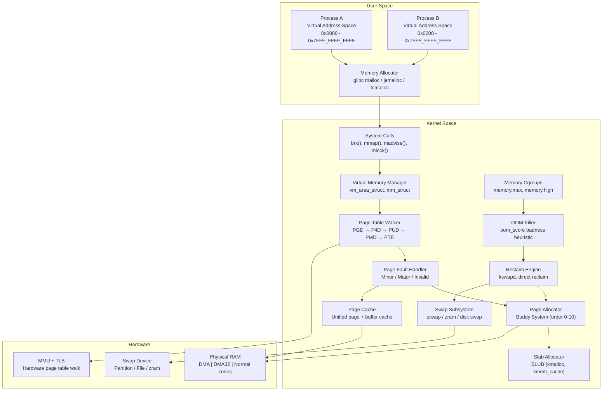
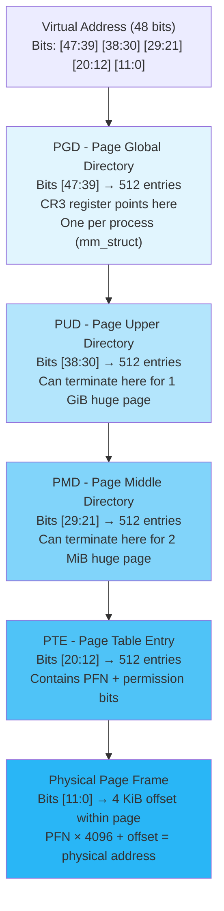
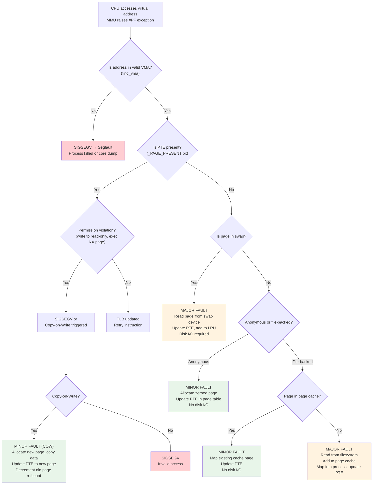
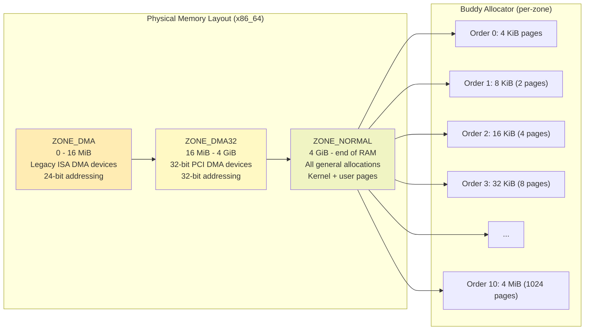
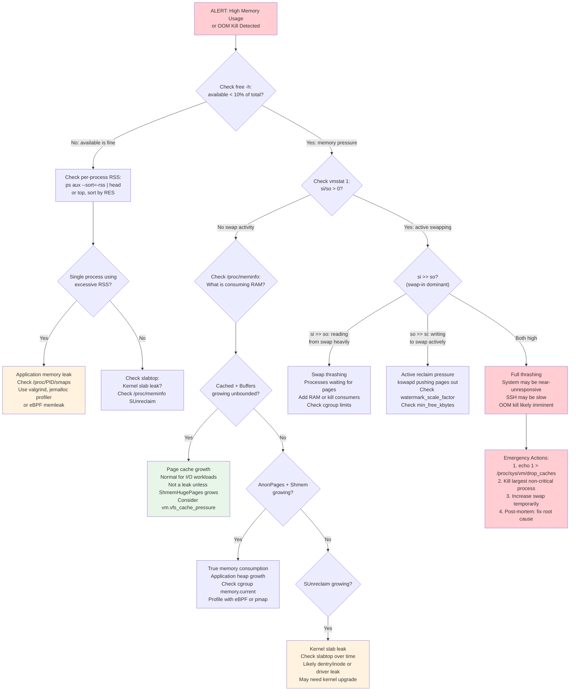

# Topic 03: Memory Management -- Virtual Memory, Page Tables, OOM, NUMA, Swap

> **Target Audience:** Senior SRE / Staff+ Cloud Engineers (10+ years experience)
> **Depth Level:** Principal Engineer interview preparation
> **Cross-references:** [Process Management](../01-process-management/process-management.md) | [CPU Scheduling](../02-cpu-scheduling/cpu-scheduling.md) | [Kernel Internals](../07-kernel-internals/kernel-internals.md) | [Performance & Debugging](../08-performance-and-debugging/performance-and-debugging.md)

---

## 1. Concept (Senior-Level Understanding)

### The Linux Memory Model: Virtual Memory and Demand Paging

Every process in Linux operates under the illusion that it owns a vast, contiguous address space -- 128 TiB on x86_64 with 4-level page tables (48-bit virtual addresses), or 64 PiB with 5-level page tables (57-bit, kernel 4.14+). This illusion is fundamental to Linux's design philosophy and directly affects how you reason about production memory issues.

The key design principles a senior engineer must internalize:

1. **Virtual memory decouples allocation from physical backing.** A process can `malloc()` 100 GB on a 16 GB host without error. Physical pages are only assigned on first access (demand paging). This is not a bug -- it is intentional overcommit philosophy.
2. **The page is the fundamental unit.** All memory operations -- allocation, protection, swapping, reclaim -- happen at page granularity (4 KiB default, 2 MiB or 1 GiB for huge pages).
3. **Memory is a cache hierarchy.** Registers > L1/L2/L3 cache > RAM > Swap (compressed or disk). The kernel's job is to keep the hottest data in the fastest tier.
4. **Memory pressure is the normal state.** Linux aggressively uses "free" memory for page cache. A system with 0% free memory and 95% cache is healthy. A system with 30% free memory but high major page fault rate is sick.

### Memory Subsystem Architecture



### Overcommit Philosophy: Why Linux Promises More Than It Has

Linux defaults to heuristic overcommit (`vm.overcommit_memory = 0`) because most processes allocate far more virtual memory than they ever touch. A Java application with `-Xmx8g` on a 16 GB host maps 8 GB of virtual memory but may only use 3 GB of RSS. Fork+exec patterns temporarily double virtual memory usage. Without overcommit, these patterns would fail unnecessarily.

The three overcommit modes:

| Mode | `vm.overcommit_memory` | Behavior | Production Use Case |
|---|---|---|---|
| **Heuristic** | `0` (default) | Kernel estimates if allocation is "reasonable"; rejects obviously excessive requests | General-purpose servers |
| **Always** | `1` | Never refuse any `malloc()`; rely on OOM killer as safety net | Redis (requires `vm.overcommit_memory=1` to handle `fork()` for BGSAVE) |
| **Strict** | `2` | Total committed memory cannot exceed `swap + (RAM * vm.overcommit_ratio/100)` | Financial systems, databases requiring deterministic behavior |

**The critical production insight:** Mode 0 is neither strict nor permissive -- it applies a heuristic that examines the request size relative to free + reclaimable memory. The heuristic can still allow significant overcommit. Mode 2 with `vm.overcommit_ratio=80` on a 256 GB host with 32 GB swap means `CommitLimit = 32 + (256 * 0.8) = 236.8 GB`.

---

## 2. Internal Working (Kernel-Level Deep Dive)

### Page Table Hierarchy: Virtual-to-Physical Translation

On x86_64 with 4-level page tables, a 48-bit virtual address is decomposed into five fields that walk a radix tree of page tables:



**Key details for interview depth:**
- Each table level contains exactly 512 entries (9 bits of addressing), each entry is 8 bytes, so each table is exactly 4 KiB (one page)
- The CR3 register holds the physical address of the PGD for the currently running process; on context switch, CR3 is reloaded
- The TLB (Translation Lookaside Buffer) caches recent translations; a TLB miss triggers a hardware page table walk on x86_64 (software walk on some architectures like MIPS)
- `_PAGE_PRESENT`, `_PAGE_RW`, `_PAGE_USER`, `_PAGE_NX` (no-execute) are critical PTE flags
- 5-level page tables (P4D inserted between PGD and PUD) extend virtual address space to 57 bits (128 PiB); enabled via `CONFIG_X86_5LEVEL` since kernel 4.14

### Page Fault Handling

When the MMU cannot resolve a virtual address, it raises a page fault exception. The kernel's page fault handler (`do_page_fault()` on x86) determines the type and takes action:



**Minor vs. Major Faults -- the production-critical distinction:**
- **Minor fault:** Page is already in RAM (either newly allocated zero-page or already in page cache). Cost: ~1-10 microseconds. Tracked in `/proc/<PID>/stat` field 10 (`minflt`).
- **Major fault:** Page must be read from disk (swap or filesystem). Cost: 1-10+ milliseconds (HDD) or 50-200 microseconds (NVMe). Tracked in field 12 (`majflt`). A sudden spike in major faults is the hallmark of memory pressure.

### Memory Zones and the Buddy Allocator

Physical memory is divided into zones based on hardware addressing constraints:



**Buddy allocator mechanics:**
- Manages free pages in power-of-two blocks (order 0 through order 10, i.e., 4 KiB to 4 MiB)
- On allocation: finds the smallest order that satisfies the request; if only larger blocks are free, splits them recursively (e.g., order-3 request splits an order-4 block into two order-3 buddies)
- On free: merges adjacent "buddy" blocks back into larger blocks (coalescing)
- Fragmentation viewable via `/proc/buddyinfo`:
  ```
  Node 0, zone   Normal  4567  3210  1890  920  410  180  65  21  7  2  1
  ```
  Each column shows free blocks of order 0, 1, 2, ..., 10. Low counts at higher orders indicate external fragmentation.

**Note on ZONE_HIGHMEM:** Only exists on 32-bit systems for memory above ~896 MiB that cannot be permanently mapped into kernel virtual address space. Irrelevant on x86_64 but may appear in interview questions as a trick.

### SLAB/SLUB Allocator

The buddy allocator handles page-level allocations, but most kernel objects (inodes, dentries, `task_struct`, `sk_buff`) are far smaller than 4 KiB. The slab allocator provides efficient sub-page allocation:

- **SLAB:** Original implementation (Bonwick, inspired by Solaris). Complex per-CPU/per-node caches, three slab states (full/partial/empty). Removed from mainline in kernel 6.5.
- **SLUB:** Default since kernel 2.6.23. Simplified design: no per-CPU queues (uses per-CPU freelists instead), better NUMA awareness, superior debugging via `slub_debug` boot parameter.
- **SLOB:** Minimal allocator for embedded systems with <64 MiB RAM. Removed in kernel 6.4.

Monitor slab usage with `slabtop` or `/proc/slabinfo`. In production, dentry and inode caches often dominate slab usage and can grow to multiple GiB on hosts with millions of files.

### Page Cache: The Unified Cache

Since Linux 2.4, the page cache and buffer cache are unified. The page cache holds:
- File data read from or written to filesystems
- Memory-mapped file pages (`mmap()`)
- tmpfs/shmem pages

The buffer cache still exists conceptually for tracking filesystem metadata at block granularity, but its pages live within the page cache. In `/proc/meminfo`:
- `Cached`: Pages in the page cache (file-backed data)
- `Buffers`: Pages tracking raw block device metadata (subset of page cache)
- `SReclaimable`: Slab cache entries (dentries, inodes) that can be reclaimed under pressure

**Available memory** (what `free` shows as "available") = `MemFree + Buffers + Cached + SReclaimable - Shmem` (approximately). This is the number you care about, not `MemFree`.

### Memory Reclaim: kswapd, Direct Reclaim, and Watermarks

The kernel maintains three watermark levels per zone (`/proc/zoneinfo`):

- **High watermark:** kswapd stops reclaiming. System is comfortable.
- **Low watermark:** kswapd wakes up and begins background reclaim (asynchronous, non-blocking for allocating processes).
- **Min watermark:** Direct reclaim kicks in. The allocating process itself must synchronously reclaim pages before its allocation can proceed. This is the latency cliff.

```
min_free_kbytes → sets the min watermark
watermark_scale_factor → controls gap between min, low, high (default: 10 = 0.1% of memory)
```

**kswapd** is a per-NUMA-node kernel thread that scans LRU lists (active/inactive, anon/file) and reclaims pages by:
1. Dropping clean page cache pages
2. Writing dirty page cache pages to disk, then reclaiming
3. Swapping anonymous pages to swap space

**Direct reclaim** happens in the context of the allocating process when free memory drops below the min watermark. This is the primary cause of allocation latency spikes -- the process blocks until enough memory is reclaimed.

### OOM Killer

When reclaim fails (no more reclaimable pages and swap is full or disabled), the kernel invokes the OOM killer:

1. Calculates `oom_score` for every process: base score proportional to RSS + swap usage, adjusted by `oom_score_adj` (-1000 to +1000)
2. Selects the process with the highest `oom_score`
3. Sends `SIGKILL` to the selected process and all processes sharing its `mm_struct`
4. Logs the event to kernel ring buffer (`dmesg`)

Key tuning:
- `/proc/<PID>/oom_score_adj = -1000` makes a process effectively immune (set for critical daemons like sshd)
- `/proc/<PID>/oom_score_adj = 1000` makes it the first kill target
- Cgroup-level OOM: `memory.max` triggers cgroup OOM before system-wide OOM
- **earlyoom:** Userspace daemon that monitors `MemAvailable` and kills processes before kernel OOM, with configurable thresholds and preferred kill targets

---

## 3. Commands + Practical Examples

### free -- Memory Overview

```bash
$ free -h
               total        used        free      shared  buff/cache   available
Mem:           251Gi        89Gi       2.1Gi       4.3Gi       160Gi       154Gi
Swap:           31Gi        12Gi        19Gi
```

**Interpretation for senior engineers:**
- `free` (2.1 GiB) is NOT the available memory. It is truly unused RAM -- Linux intentionally keeps this low.
- `buff/cache` (160 GiB) = `Buffers + Cached + SReclaimable` from `/proc/meminfo`. This is memory used for caching that CAN be reclaimed.
- `available` (154 GiB) is the kernel's estimate of memory available for new allocations without swapping. This is the number to monitor and alert on.
- `used` (89 GiB) = `total - free - buff/cache`. This is memory consumed by processes and kernel that cannot be reclaimed.
- **Alert threshold:** When `available` drops below 10-15% of total, investigate. When it drops below 5%, you are approaching OOM risk.

### /proc/meminfo Deep Dive

```bash
$ cat /proc/meminfo
MemTotal:       263450624 kB    # Total usable RAM (minus kernel reserved)
MemFree:          2203648 kB    # Truly free pages (Zone free lists)
MemAvailable:   161349632 kB    # Estimated available for user allocation
Buffers:          1245184 kB    # Raw block device metadata cache
Cached:         156827648 kB    # Page cache (file data)
SwapCached:       1048576 kB    # Swap pages also in RAM (read-ahead)
Active:          98304000 kB    # Recently accessed pages (hard to reclaim)
Inactive:       148275200 kB    # Not recently accessed (easy to reclaim)
Active(anon):    72351744 kB    # Recently accessed anonymous pages
Inactive(anon):  21626880 kB    # Inactive anonymous pages (swap candidates)
Active(file):    25952256 kB    # Recently accessed file-backed pages
Inactive(file): 126648320 kB    # Inactive file pages (easily reclaimable)
SwapTotal:       33554432 kB    # Total swap space
SwapFree:        20971520 kB    # Unused swap
Dirty:             524288 kB    # Pages waiting to be written to disk
Writeback:              0 kB    # Pages actively being written
AnonPages:       89128960 kB    # Anonymous pages mapped into page tables
Mapped:           3145728 kB    # File-backed pages mapped into page tables
Shmem:            4521984 kB    # tmpfs + shared memory (counts as "used")
Slab:             8388608 kB    # Kernel slab allocator total
SReclaimable:     6291456 kB    # Slab pages that can be reclaimed
SUnreclaim:       2097152 kB    # Slab pages permanently allocated
PageTables:        786432 kB    # Memory used for page tables themselves
CommitLimit:     165279744 kB   # Overcommit limit (swap + RAM * ratio)
Committed_AS:   195035136 kB    # Total virtual memory committed
VmallocTotal:   34359738367 kB  # Total vmalloc address space
VmallocUsed:       262144 kB    # vmalloc currently used
HugePages_Total:        0       # Pre-allocated huge pages
HugePages_Free:         0
Hugepagesize:       2048 kB
```

**Critical fields to monitor in production:**
- `Committed_AS > CommitLimit` means you are overcommitted. Not necessarily dangerous with mode 0, but critical with mode 2.
- `Dirty` > a few hundred MiB indicates potential I/O bottleneck or writeback stall.
- `SUnreclaim` growing over time suggests a kernel memory leak (slab leak).
- `AnonPages` + `SwapCached` growing with low `MemAvailable` indicates actual memory pressure.

### vmstat -- Real-time Memory Stats

```bash
$ vmstat 1 5
procs -----------memory---------- ---swap-- -----io---- -system-- ------cpu-----
 r  b   swpd   free   buff  cache   si   so    bi    bo   in   cs us sy id wa st
 3  0 12582912 2203648 1245184 156827648 0  0   120   450  8500 12000 35 10 52  3  0
 5  1 12582912 2150400 1245184 156830720 0  24   80  1200  9200 13500 42 12 40  6  0
 2  0 12583936 2100224 1245696 156835840 8  48  320  2400 11000 15000 38 15 38  9  0
```

**Key columns for memory analysis:**
- `swpd`: Swap used. Non-zero is not inherently bad; *increasing* swap-in/out is bad.
- `si` (swap-in) / `so` (swap-out): Pages swapped in/out per second. `si > 0` means processes are actively waiting for swapped-out pages. `so > 0` means kswapd or direct reclaim is pushing pages to swap. Both > 0 simultaneously = thrashing.
- `free`: Free memory (same as `/proc/meminfo` `MemFree`).
- `buff`: Buffer cache.
- `cache`: Page cache.
- `b`: Processes blocked on I/O. High `b` with high `si`/`so` = swap thrashing confirmed.

### numastat and numactl -- NUMA Analysis

```bash
# Per-node memory stats
$ numastat
                           node0           node1
numa_hit              1248967432      1156789234
numa_miss                2345678        89012345
numa_foreign            89012345         2345678
interleave_hit            123456          123456
local_node            1246621754      1067776889
other_node               2345678        89012345

# Per-node memory breakdown
$ numastat -m
                          Node 0          Node 1           Total
                 --------------- --------------- ---------------
MemTotal                128725.12       128725.12       257450.24
MemFree                   1024.50         1179.14         2203.64
MemUsed                 127700.62       127545.98       255246.60
Active                   49152.00        49152.00        98304.00
Inactive                 74137.60        74137.60       148275.20
```

**Red flag:** `numa_miss` significantly higher on one node than the other indicates NUMA imbalance. The `other_node` counter shows remote memory allocations -- every such allocation adds ~100 ns of cross-socket latency.

```bash
# Pin process to specific NUMA node
$ numactl --cpunodebind=0 --membind=0 /usr/bin/mysqld

# Interleave memory across all nodes (useful for in-memory databases)
$ numactl --interleave=all /usr/bin/redis-server

# Show NUMA policy of running process
$ numactl --show
policy: default
preferred node: current
```

### Process-Level Memory Analysis

```bash
# Detailed per-mapping memory info
$ cat /proc/<PID>/smaps_rollup
Rss:             5242880 kB     # Resident set size (actually in RAM)
Pss:             4718592 kB     # Proportional share (shared pages divided by users)
Shared_Clean:     524288 kB     # Shared pages not modified
Shared_Dirty:          0 kB     # Shared pages modified
Private_Clean:    204800 kB     # Private unmodified pages
Private_Dirty:   4513792 kB     # Private modified pages (true "owned" memory)
Referenced:      4915200 kB     # Pages accessed recently
Anonymous:       4513792 kB     # Anonymous pages (heap, stack)
Swap:             131072 kB     # Pages swapped out
SwapPss:          131072 kB     # Proportional swap share
Locked:                0 kB     # mlocked pages

# OOM score inspection
$ cat /proc/<PID>/oom_score        # Current OOM score (0-2000+)
$ cat /proc/<PID>/oom_score_adj    # Manual adjustment (-1000 to +1000)

# Set OOM protection for critical service
$ echo -1000 > /proc/$(pidof sshd)/oom_score_adj
```

### slabtop -- Kernel Memory Allocation

```bash
$ slabtop -o | head -15
 Active / Total Objects (% used)    : 15234567 / 16789012 (90.7%)
 Active / Total Slabs (% used)      : 456789 / 567890 (80.4%)
 Active / Total Caches (% used)     : 112 / 156 (71.8%)
 Active / Total Size (% used)       : 6144.00M / 8192.00M (75.0%)

  OBJS ACTIVE  USE OBJ SIZE  SLABS OBJ/SLAB CACHE SIZE NAME
3456789 3200000  92%    0.19K 164609       21    658436K dentry
2345678 2100000  89%    0.58K 167548       14   1340384K inode_cache
 892345  800000  89%    1.06K  59489       15    951824K ext4_inode_cache
 567890  500000  88%    0.25K  35493       16    141972K kmalloc-256
 345678  300000  86%    0.06K   5321       65     21284K kmalloc-64
```

**Production insight:** `dentry` and `inode_cache` growth is normal on file servers -- the kernel caches directory entries and inode metadata for performance. Drop these caches in emergency with `echo 2 > /proc/sys/vm/drop_caches` (dentries + inodes) or `echo 3` (+ page cache). Never do this routinely -- it kills read performance.

---

## 4. Advanced Debugging & Observability

### Memory Debugging Decision Tree



### eBPF Memory Tools (bcc/bpftrace)

```bash
# Track all OOM kills in real-time
$ sudo oomkill
Tracing OOM kills... Ctrl-C to stop.
14:32:17 Triggered by PID 45231 (batch-worker), OOM kill of PID 12890 (mysqld), 8192 pages

# Trace memory allocation stack traces to find leaks
$ sudo memleak -p $(pidof myapp) --top 10 -a
[14:33:45] Top 10 stacks with outstanding allocations:
    524288 bytes in 128 allocations from stack
        myapp`process_request+0x42
        myapp`handle_connection+0x1a0
        libpthread.so`start_thread+0xdb

# Trace page faults for a specific process
$ sudo bpftrace -e 'tracepoint:exceptions:page_fault_user /pid == 12345/ {
    @[comm, ustack] = count();
}'

# Monitor page cache hit ratio
$ sudo cachestat 1
    HITS   MISSES  DIRTIES HITRATIO   BUFFERS_MB  CACHED_MB
   45678     1234      890   97.37%        1216      153152
   52341      987      567   98.15%        1216      153180
```

### Kernel Memory Leak Detection

```bash
# Enable kmemleak (must be enabled at boot with kmemleak=on)
$ echo scan > /sys/kernel/debug/kmemleak
$ cat /sys/kernel/debug/kmemleak
unreferenced object 0xffff88003c4b4320 (size 192):
  comm "insmod", pid 4587, jiffies 4294937246
  hex dump (first 32 bytes):
    ...
  backtrace:
    [<ffffffff8176b100>] kmem_cache_alloc+0x1a0/0x210
    [<ffffffffa0023456>] my_driver_alloc+0x36/0x90

# Monitor /proc/meminfo trends over time
$ watch -n 5 'grep -E "^(MemAvailable|AnonPages|Slab|SUnreclaim|Committed_AS)" /proc/meminfo'

# Per-cgroup memory tracking
$ cat /sys/fs/cgroup/memory/<group>/memory.stat
anon 4294967296          # 4 GiB anonymous pages
file 2147483648          # 2 GiB page cache
slab_reclaimable 268435456   # 256 MiB reclaimable slab
pgfault 987654321        # Total page faults
pgmajfault 12345         # Major faults (disk I/O)
oom_kill 3               # OOM kills within this cgroup
```

---

## 5. Real-World Production Scenarios

### Incident 1: OOM Killer Targeting Critical Database Instead of Batch Job

**Context:** Production PostgreSQL cluster on 128 GiB hosts running alongside nightly ETL batch workers. During peak batch processing window, the OOM killer kills the PostgreSQL primary, causing a 12-minute failover and data replication lag.

**Symptoms:**
- Monitoring alert: PostgreSQL primary unreachable
- Kubernetes/systemd shows service restarted
- `dmesg` shows `Out of memory: Killed process 4521 (postgres) total-vm:98304000kB, anon-rss:78643200kB, file-rss:1048576kB`
- Batch workers had 10x smaller RSS but were not selected

**Investigation:**
```bash
# Review OOM kill log (post-mortem)
$ dmesg | grep -A 30 "Out of memory"
Out of memory: Kill process 4521 (postgres) score 614 or sacrifice child
Killed process 4521 (postgres) total-vm:98304000kB, anon-rss:78643200kB

# Check OOM scores before incident (from monitoring)
$ cat /proc/$(pidof postgres)/oom_score        # Was: 614
$ cat /proc/$(pidof batch-worker)/oom_score    # Was: 89

# Check OOM adjustments
$ cat /proc/$(pidof postgres)/oom_score_adj    # Was: 0 (default!)
$ cat /proc/$(pidof batch-worker)/oom_score_adj # Was: 0 (default!)
```

**Root Cause:** PostgreSQL's RSS was 77 GiB (shared_buffers + work_mem per connection). Batch workers used only 3 GiB each but there were 20 of them. The OOM killer selects by highest individual `oom_score`, which is proportional to RSS. PostgreSQL was the single largest process, so it was killed first despite being the most critical.

**Immediate Mitigation:**
```bash
# Protect PostgreSQL from OOM killer
$ echo -900 > /proc/$(pidof postgres)/oom_score_adj

# Make batch workers preferred OOM targets
$ echo 500 > /proc/$(pidof batch-worker)/oom_score_adj
```

**Long-term Fix:**
1. Added `OOMScoreAdjust=-900` to PostgreSQL's systemd unit file
2. Configured memory cgroup limits for batch workers: `memory.max=8G` per worker
3. Reduced batch worker parallelism from 20 to 8 during peak hours
4. Set `vm.overcommit_memory=2` with `vm.overcommit_ratio=85` to prevent silent overcommit
5. Deployed earlyoom with `--prefer 'batch-worker'` and threshold at 5% available

**Prevention:**
- Every production service MUST have `OOMScoreAdjust` set in its unit file, tiered by criticality
- Cgroup memory limits are mandatory for all batch and non-critical workloads
- Monitoring on `MemAvailable` with alert at 10% and page at 5%

---

### Incident 2: Page Cache Growth Mistaken for Application Memory Leak

**Context:** Operations team reports that a Java application server is "leaking memory" on 64 GiB hosts. `free` shows only 500 MiB free after 7 days of uptime. Ticket is escalated as P2 to the application team.

**Symptoms:**
- `free` output shows nearly zero "free" memory
- Monitoring dashboard (incorrectly configured) alerts on `MemFree` < 1 GiB
- Application team reports no heap growth in JVM metrics
- No swap usage, no OOM kills

**Investigation:**
```bash
$ free -h
               total        used        free      shared  buff/cache   available
Mem:            63Gi        18Gi       512Mi       256Mi        44Gi        43Gi
Swap:            8Gi          0B         8Gi

# The key insight: available is 43 GiB!
$ grep -E "^(MemFree|MemAvailable|Cached|Buffers|SReclaimable)" /proc/meminfo
MemFree:          524288 kB
MemAvailable:   45088768 kB
Buffers:          262144 kB
Cached:         45613056 kB
SReclaimable:    1048576 kB

# Confirm: page cache is the "consumer"
$ cat /proc/meminfo | grep -E "^(Active|Inactive)\(file\)"
Active(file):    12582912 kB
Inactive(file):  33030144 kB
# 43+ GiB of file-backed page cache -- this is NORMAL

# Verify Java process is not leaking
$ cat /proc/$(pidof java)/smaps_rollup | grep -E "^(Rss|Pss|Private)"
Rss:            18874368 kB      # 18 GiB -- matches JVM heap + metaspace
Pss:            18612224 kB
Private_Dirty:  18350080 kB      # Actual unique memory consumption
```

**Root Cause:** The application reads large log files and data files via `java.io.FileInputStream`. The kernel caches these reads in the page cache, which is the correct and desirable behavior. The monitoring team had configured alerts on `MemFree` instead of `MemAvailable`, creating a false alarm.

**Immediate Mitigation:**
- Closed the ticket as "not a bug"
- Corrected monitoring dashboards to alert on `MemAvailable` (or `available` from `free`)

**Long-term Fix:**
1. Updated all monitoring templates organization-wide to use `MemAvailable` instead of `MemFree`
2. Added documentation explaining that Linux page cache is not "used" memory
3. If page cache truly needs to be limited (rare), use cgroup v2 `memory.high` to apply back-pressure
4. For applications that read large files once (log processing), use `posix_fadvise(POSIX_FADV_DONTNEED)` or `fadvise` to hint the kernel not to cache

**Prevention:**
- Monitoring runbook updated: "Low MemFree is normal. Alert on MemAvailable."
- Added `node_memory_MemAvailable_bytes` as the standard Prometheus metric for memory alerting

---

### Incident 3: NUMA Imbalance Causing 3x Latency on Database Queries

**Context:** A 2-socket (2 NUMA nodes) server running MySQL with 256 GiB RAM. P99 query latency is 3x higher than expected, with periodic latency spikes up to 50 ms for queries that normally complete in 5 ms.

**Symptoms:**
- P99 latency spikes correlated with specific queries but not specific tables
- CPU utilization is uneven: node 0 at 75%, node 1 at 25%
- `perf stat` shows high LLC (Last Level Cache) miss rate
- No swap activity, plenty of available memory

**Investigation:**
```bash
$ numastat -m
                          Node 0          Node 1           Total
                 --------------- --------------- ---------------
MemTotal               128000.00       128000.00       256000.00
MemUsed                124500.00        45000.00       169500.00
Active                   89000.00        21000.00       110000.00
Inactive                 32000.00        22000.00        54000.00

$ numastat
                           node0           node1
numa_hit              8934567890      2156789012
numa_miss                     0       6891234567   # <-- MASSIVE remote allocations on node1
numa_foreign          6891234567               0
local_node            8934567890      2156789012
other_node                    0       6891234567

$ numactl --hardware
available: 2 nodes (0-1)
node 0 cpus: 0 1 2 3 4 5 6 7 8 9 10 11 12 13 14 15
node 0 size: 131072 MB
node 1 cpus: 16 17 18 19 20 21 22 23 24 25 26 27 28 29 30 31
node 1 size: 131072 MB
node distances:
node   0   1
  0:  10  21
  1:  21  10
# Node distance 21 = ~2x latency for cross-node memory access
```

**Root Cause:** MySQL was started without NUMA awareness. The default memory allocation policy (`local`) allocated InnoDB buffer pool pages on whichever node the allocating thread happened to run. Initial startup allocated most of the buffer pool on node 0. When MySQL threads migrated to node 1 CPUs (kernel scheduler load balancing), they accessed buffer pool pages on remote node 0, paying 2x memory latency for every access.

**Immediate Mitigation:**
```bash
# Restart MySQL with interleaved memory policy
$ numactl --interleave=all /usr/sbin/mysqld

# Alternatively, for running process, verify NUMA stats
$ numastat -p $(pidof mysqld)
```

**Long-term Fix:**
1. Added `numactl --interleave=all` to MySQL's systemd unit file (`ExecStart=`)
2. Set `innodb_numa_interleave=ON` in MySQL 5.7+ / 8.0+ configuration
3. Configured CPU affinity for MySQL to use all cores across both nodes
4. For more granular control on newer kernels, used `set_mempolicy()` with `MPOL_INTERLEAVE`
5. Monitored `numa_miss` and `other_node` counters in Prometheus

**Prevention:**
- Standard operating procedure: all database services start with `numactl --interleave=all` on multi-socket hosts
- NUMA-aware monitoring: alert when `numa_miss / numa_hit` ratio exceeds 5%
- Capacity planning accounts for NUMA topology -- prefer single-socket or NUMA-aware allocation

---

### Incident 4: Swap Storm from Aggressive Overcommit on 256 GiB Hosts

**Context:** Kubernetes worker nodes with 256 GiB RAM running mixed workloads. No resource limits on most pods (legacy deployment). Gradual degradation over 4 hours culminating in nodes becoming unresponsive.

**Symptoms:**
- Node becomes unresponsive to `kubectl` commands
- SSH sessions hang or take 30+ seconds to establish
- `vmstat` (captured from monitoring agent before node became unreachable) shows:
  ```
  si: 45000   so: 52000   # Massive bidirectional swap activity
  b: 47                     # 47 processes blocked on I/O
  wa: 78                    # 78% CPU time waiting for I/O
  ```
- Load average exceeds 500 on a 32-core machine
- Disk I/O on swap device is 100% utilized

**Investigation (post-recovery):**
```bash
# Check overcommit settings (were defaults)
$ sysctl vm.overcommit_memory vm.overcommit_ratio vm.swappiness
vm.overcommit_memory = 0
vm.overcommit_ratio = 50
vm.swappiness = 60     # Default: fairly aggressive swapping

# Check committed memory at time of incident (from monitoring)
# Committed_AS was 380 GiB on a 256 GiB host with 32 GiB swap
# CommitLimit = 32 + (256 * 50/100) = 160 GiB
# But with overcommit_memory=0, this limit was not enforced!

# Post-incident: check which pods had no memory limits
$ kubectl get pods --all-namespaces -o json | jq -r \
  '.items[] | select(.spec.containers[].resources.limits.memory == null) | .metadata.name'

# Check swap device throughput
$ iostat -x 1 | grep dm-1    # dm-1 was the swap LV
dm-1  100.00  0.00  45000.00  52000.00  97.5%  89.50ms
# avgqu-sz of 89.5 = severely overloaded swap device
```

**Root Cause:** Over 4 hours, cumulative pod memory usage grew to 290 GiB. With `vm.overcommit_memory=0` (heuristic mode), the kernel allowed allocations beyond physical RAM. When processes began touching allocated-but-not-backed pages, the kernel entered a spiral: kswapd could not reclaim fast enough, direct reclaim kicked in for every allocation, and the swap device (a spinning disk LV) became the bottleneck. Every allocation now required a synchronous disk I/O, causing cascading latency.

**Immediate Mitigation:**
```bash
# On the unresponsive node (via IPMI/iLO console):
# Kill the largest non-critical pods
$ kill -9 $(pgrep -f batch-processor)
$ echo 1 > /proc/sys/vm/drop_caches  # Free page cache for breathing room
```

**Long-term Fix:**
1. Enforced mandatory memory limits on all Kubernetes pods via `LimitRange` and `ResourceQuota`
2. Reduced `vm.swappiness` to 10 (prefer reclaiming file pages over swapping anonymous pages)
3. Increased `min_free_kbytes` to 524288 (512 MiB) to trigger reclaim earlier
4. Increased `watermark_scale_factor` to 500 (5% gap between watermarks instead of 0.1%)
5. Moved swap to NVMe-backed storage for 100x better swap I/O throughput
6. Deployed earlyoom as a DaemonSet with `--avoid 'kubelet|containerd'`

**Prevention:**
- Kubernetes admission webhook rejects pods without memory limits
- Node-level monitoring: alert when `SwapFree` drops below 50% of `SwapTotal`
- Capacity planning: total requested memory across all pods must not exceed 85% of node RAM
- Consider `vm.overcommit_memory=2` for nodes running critical stateful workloads

---

### Incident 5: Transparent Huge Pages Causing Latency Jitter in Redis

**Context:** Redis cluster serving real-time bidding platform. P99 latency suddenly increases from 0.5 ms to 15 ms with periodic 50-100 ms spikes, correlated with BGSAVE (fork-based persistence) operations.

**Symptoms:**
- P99 latency spikes every 60 seconds (BGSAVE interval)
- `perf top` shows high CPU in `khugepaged` and `copy_huge_page`
- `/proc/vmstat` shows `thp_collapse_alloc` and `thp_fault_alloc` increasing rapidly
- Redis `INFO` shows `fork` operations taking 200-800 ms instead of expected 10-50 ms
- `dmesg` shows compaction activity during spike windows

**Investigation:**
```bash
# Check THP status
$ cat /sys/kernel/mm/transparent_hugepage/enabled
[always] madvise never    # <-- THP enabled system-wide!

$ cat /sys/kernel/mm/transparent_hugepage/defrag
[always] defer defer+madvise madvise never

# Check THP activity in vmstat
$ grep -E "^thp_" /proc/vmstat
thp_fault_alloc 456789
thp_collapse_alloc 234567
thp_fault_fallback 12345
thp_collapse_alloc_failed 6789
thp_split_page 89012

# Check memory compaction activity
$ grep compact /proc/vmstat
compact_stall 45678          # <-- Processes stalled waiting for compaction!
compact_success 23456
compact_fail 22222

# Verify Redis fork overhead
$ redis-cli INFO persistence
rdb_last_cow_size:8589934592     # 8 GiB COW during BGSAVE
rdb_last_fork_usec:800000        # 800ms fork time!

# Check Redis page table size
$ grep VmPTE /proc/$(pidof redis-server)/status
VmPTE:   2048 kB    # With THP, page tables are small but page-level COW is huge
```

**Root Cause:** With THP enabled in `always` mode, the kernel promotes Redis's 4 KiB pages to 2 MiB huge pages via `khugepaged`. When Redis forks for BGSAVE, Copy-on-Write occurs at 2 MiB granularity instead of 4 KiB. A single byte write to a 2 MiB huge page triggers a 2 MiB copy (512x more data than a 4 KiB COW). Additionally, the kernel's memory compaction subsystem stalls Redis threads while defragmenting physical memory to create contiguous 2 MiB regions.

**Immediate Mitigation:**
```bash
# Disable THP system-wide
$ echo never > /sys/kernel/mm/transparent_hugepage/enabled
$ echo never > /sys/kernel/mm/transparent_hugepage/defrag

# Or, use madvise mode (per-process opt-in)
$ echo madvise > /sys/kernel/mm/transparent_hugepage/enabled
```

**Long-term Fix:**
1. Set THP to `madvise` mode in kernel boot parameters: `transparent_hugepage=madvise`
2. Added to `/etc/sysctl.conf` persistence via tuned profile or systemd tmpfiles
3. Redis startup script explicitly disables THP via sysfs
4. For Java applications (JVM), THP can be beneficial for heap access -- use `madvise` mode and let the JVM opt-in with `-XX:+UseTransparentHugePages`
5. Monitored `compact_stall` in `/proc/vmstat` as a key latency indicator
6. Switched from BGSAVE to AOF persistence with `appendfsync everysec` to eliminate fork overhead

**Prevention:**
- Base OS image ships with `transparent_hugepage=madvise` on kernel command line
- Redis, MongoDB, and other latency-sensitive services explicitly disable THP in their unit files
- Runbook: "latency jitter" checklist includes THP and compaction check as step 2
- Monitor `compact_stall` and `thp_fault_fallback` as leading indicators

---

## 6. Advanced Interview Questions

### Conceptual Deep Questions

**Q1. Explain the difference between page cache and buffer cache. Are they the same thing in modern Linux?**

**Difficulty:** Senior | **Category:** Memory Internals

**Answer:**
1. Historically (pre-Linux 2.4), these were separate caches:
   - **Buffer cache:** Cached raw disk blocks at block granularity (typically 512 bytes or 1 KiB), indexed by block device + block number
   - **Page cache:** Cached file data at page granularity (4 KiB), indexed by inode + offset
2. This caused double-caching: the same data could exist in both caches simultaneously
3. Starting with Linux 2.4, they were unified:
   - The page cache became the primary cache for all file I/O
   - Buffer heads (`struct buffer_head`) still exist but point into page cache pages
   - A "buffer" is now a view into a page cache page that tracks the block-to-page mapping
4. In `/proc/meminfo`:
   - `Cached` = page cache (file data pages)
   - `Buffers` = metadata buffers associated with raw block devices (e.g., superblock, inode tables)
   - Both are reclaimable under memory pressure
5. The classic interview trick: asking "which one does `free` show?" -- `free` combines them into `buff/cache` precisely because the distinction is largely historical

---

**Q2. What happens when a process calls malloc(1 GiB) on a system with only 512 MiB of free RAM? Walk through each step.**

**Difficulty:** Staff | **Category:** Virtual Memory

**Answer:**
1. `malloc()` in glibc calls `mmap(NULL, 1GiB, PROT_READ|PROT_WRITE, MAP_PRIVATE|MAP_ANONYMOUS, -1, 0)` for large allocations (threshold: `MMAP_THRESHOLD`, default 128 KiB)
2. The kernel creates a `vm_area_struct` in the process's `mm_struct` describing the new virtual mapping
3. **No physical pages are allocated.** The kernel only reserves address space. `Committed_AS` in `/proc/meminfo` increases by 1 GiB.
4. With `vm.overcommit_memory=0` (default), the kernel applies heuristics: if `Committed_AS` is not wildly larger than `CommitLimit`, the allocation succeeds (returns a valid pointer)
5. With `vm.overcommit_memory=2`, if `Committed_AS + 1 GiB > CommitLimit`, the allocation fails immediately (`mmap` returns `MAP_FAILED`, `malloc` returns `NULL`)
6. When the process first touches a page within the allocation, a page fault occurs:
   - Kernel allocates a physical page via the buddy allocator
   - Page is zeroed (security: prevent reading previous process's data)
   - PTE is updated to map the virtual address to the new physical page
   - This is a minor fault (no disk I/O)
7. If physical memory runs out during demand paging:
   - kswapd or direct reclaim attempts to free pages
   - If reclaim fails, OOM killer is invoked
   - The OOM killer may kill the allocating process or another process with a higher `oom_score`

---

**Q3. Explain the relationship between RSS, VSZ, PSS, and USS. Which metric should you use for capacity planning?**

**Difficulty:** Senior | **Category:** Memory Metrics

**Answer:**
1. **VSZ (Virtual Size):** Total virtual address space mapped by the process. Includes all mapped regions whether backed by RAM, swap, or nothing (not yet faulted in). Essentially useless for capacity planning -- a process can have 100 GiB VSZ and use 50 MiB RSS.
2. **RSS (Resident Set Size):** Physical memory currently mapped into the process's page tables. Includes shared libraries and shared mappings. **Problem:** shared pages are counted multiple times -- if 100 processes share a 50 MiB libc, RSS counts it 100 times.
3. **PSS (Proportional Set Size):** Like RSS, but shared pages are divided by the number of sharers. If 100 processes share 50 MiB libc, each gets credited with 0.5 MiB. **Sum of all PSS values approximates total physical memory used.** This is the best metric for capacity planning.
4. **USS (Unique Set Size):** Only private pages belonging exclusively to this process. This is the memory that would be freed if the process were killed. Found as `Private_Clean + Private_Dirty` in `/proc/<PID>/smaps_rollup`.
5. **For capacity planning:** Use PSS. For "how much memory does killing this process free?": use USS. For quick operational triage: RSS is sufficient. Never use VSZ for memory capacity analysis.

---

**Q4. How does Copy-on-Write work at the page table level during fork()? Why is this important for Redis and PostgreSQL?**

**Difficulty:** Staff | **Category:** Virtual Memory / Production

**Answer:**
1. When `fork()` is called, the kernel does NOT copy the parent's physical memory:
   - It copies only the page tables (`mm_struct` and `vm_area_struct` structures)
   - Both parent and child PTEs point to the same physical pages
   - All shared pages are marked read-only in both processes' PTEs
2. When either process writes to a shared page:
   - The CPU raises a page fault (write to read-only page)
   - The kernel checks the page's reference count
   - If refcount > 1: allocates a new page, copies the content, updates the writing process's PTE to point to the new page with write permission. Old page's refcount is decremented.
   - If refcount == 1: simply marks the page writable (last reference, no copy needed)
3. **Redis implication:** Redis uses `fork()` for BGSAVE/BGREWRITEAOF. During persistence, the child writes to the dump file while the parent continues serving writes. Each write by the parent to a COW page triggers a 4 KiB copy (or 2 MiB with THP). A write-heavy workload during BGSAVE can double memory usage in the worst case.
4. **PostgreSQL implication:** `fork()` is used for each client connection (multiprocess model). Shared buffers are COW-shared. The initial fork is cheap (just page table copy), but as connections modify pages, COW copies accumulate.
5. **Key metric:** `rdb_last_cow_size` in Redis `INFO` tells you how much memory was copied during the last BGSAVE. If this approaches total RSS, your workload is extremely write-heavy during persistence.

---

### Scenario-Based Questions

**Q5. A production server shows 0% free memory in monitoring but no alerts from the application. The SRE team wants to add more RAM. How do you assess the situation?**

**Difficulty:** Senior | **Category:** Operational

**Answer:**
1. First, check `free -h` output, specifically the `available` column, not `free`
2. If `available` is >20% of total: system is healthy, the "consumed" memory is page cache
3. Verify with `/proc/meminfo`:
   - Check `Cached + Buffers + SReclaimable` -- this is reclaimable memory
   - Check `AnonPages` -- this is actual process memory consumption
   - Check `SwapFree` vs `SwapTotal` -- any active swapping?
4. Check `vmstat 1` for `si`/`so` columns:
   - If both are 0: no memory pressure, no RAM needed
   - If `so > 0` persistently: system is under pressure, investigate
5. Check `/proc/vmstat` for `pgmajfault` rate:
   - Increasing major fault rate = pages being read from swap = real pressure
6. **Recommendation to the team:**
   - Fix the monitoring to use `MemAvailable` instead of `MemFree`
   - Do NOT add RAM just because `MemFree` is low -- that is Linux working correctly
   - Add RAM only if `MemAvailable` is consistently low OR `si`/`so` activity is persistent

---

**Q6. You SSH into a server and it takes 45 seconds to get a shell. Once logged in, commands are slow. What is your memory-related debugging approach?**

**Difficulty:** Staff | **Category:** Debugging

**Answer:**
1. SSH slowness suggests the system is under heavy memory pressure (direct reclaim or swap thrashing blocking even basic operations)
2. First command: `vmstat 1 5` -- look at:
   - `si`/`so` > 0: swap thrashing confirmed
   - `b` column (blocked processes): high = processes stuck in D-state waiting for I/O
   - `wa` column: high = CPU spending time waiting for I/O (likely swap device)
3. `free -h` to see overall memory state:
   - If `available` < 1% and `swap` near full: system is in OOM territory
4. `dmesg | tail -50` to check for OOM kills or memory allocation failures
5. `ps aux --sort=-rss | head -10` to identify top memory consumers
6. Check `/proc/meminfo` for `Committed_AS` vs `CommitLimit`:
   - If severely overcommitted, the root cause is too many processes for available memory
7. Emergency actions:
   - `kill -9` the largest non-critical process to free memory immediately
   - `echo 1 > /proc/sys/vm/drop_caches` to free page cache
   - `swapoff -a && swapon -a` to force all swapped pages back to RAM (only if there is now enough free RAM)
8. Root cause analysis: determine why memory grew -- application leak, missing cgroup limits, or insufficient capacity

---

**Q7. Your team runs a service on NUMA-aware hardware. After a kernel upgrade, P99 latency doubles. Memory usage and CPU usage appear unchanged. Where do you look?**

**Difficulty:** Principal | **Category:** NUMA / Performance

**Answer:**
1. Check if the kernel upgrade changed the default NUMA balancing behavior:
   - `sysctl kernel.numa_balancing` -- if this changed from 0 to 1 (or vice versa), it directly affects page placement
   - Automatic NUMA balancing migrates pages between nodes, which can cause latency during migration
2. Run `numastat -m` and `numastat -p <PID>`:
   - Compare `numa_miss` / `numa_hit` ratio before and after upgrade
   - Check if memory distribution across nodes changed
3. Check if the kernel's scheduler topology changed:
   - `lscpu` to verify NUMA node configuration is detected correctly
   - New kernel might detect different LLC domains, affecting thread migration
4. Check THP behavior change:
   - New kernel may have changed THP defaults or compaction behavior
   - `grep -E "compact_stall|thp_" /proc/vmstat`
5. Check memory reclaim changes:
   - New kernel may have different watermark calculations or kswapd behavior
   - `grep -E "pgscan|pgsteal" /proc/vmstat`
6. Check if `numactl` settings in the service's systemd unit survived the upgrade
7. Use `perf stat -e cache-misses,cache-references,node-loads,node-load-misses` to quantify NUMA impact at the hardware counter level

---

**Q8. A container running with memory.max=4G is being OOM-killed, but the application inside reports using only 2 GiB of heap. What is consuming the other 2 GiB?**

**Difficulty:** Staff | **Category:** Containers / Cgroups

**Answer:**
1. The cgroup `memory.max` limit counts ALL memory charged to the cgroup, not just application heap:
   - Anonymous pages (heap + stack + mmap'd anonymous regions)
   - Page cache pages for files opened by processes in the cgroup
   - Kernel slab pages allocated on behalf of the cgroup (dentries, inodes)
   - Tmpfs/shmem pages
   - Kernel stack pages for threads
2. Check the cgroup's memory breakdown:
   ```bash
   cat /sys/fs/cgroup/<path>/memory.stat
   ```
   - `anon`: anonymous pages (likely ~2 GiB matching the heap)
   - `file`: page cache charged to this cgroup (likely the "missing" 2 GiB)
   - `slab_reclaimable`: kernel slab objects
   - `kernel_stack`: kernel stacks for all threads
3. Common culprits for the "hidden" memory:
   - Application writes extensive logs: page cache for log files is charged to the cgroup
   - Application reads large data files: page cache for those reads is charged
   - Application creates many files/directories: dentry/inode slab cache grows
4. Solutions:
   - Set `memory.high` slightly below `memory.max` to apply back-pressure before hard OOM
   - Use `fadvise(POSIX_FADV_DONTNEED)` after reading large files to release page cache
   - Reduce log verbosity or configure log rotation within the container
   - Increase the memory limit to account for page cache requirements

---

### Debugging Questions

**Q9. How do you determine whether a system is experiencing memory pressure vs. healthy page cache usage?**

**Difficulty:** Senior | **Category:** Monitoring

**Answer:**
1. **Healthy state indicators:**
   - `MemAvailable` > 15-20% of `MemTotal`
   - `si` and `so` in `vmstat` are both 0 (or near-zero occasional blips)
   - `pgmajfault` in `/proc/vmstat` has a low rate of increase (< 10/sec)
   - `pgscan_kswapd` and `pgscan_direct` in `/proc/vmstat` are not increasing rapidly
   - Large `Cached` value in `/proc/meminfo` -- this is desirable
2. **Memory pressure indicators:**
   - `MemAvailable` < 5% of `MemTotal`
   - `so > 0` sustained in `vmstat` (kernel actively pushing pages to swap)
   - `pgmajfault` increasing at >100/sec
   - `pgscan_direct > 0` and increasing (allocating processes forced to reclaim)
   - `allocstall_normal` or `allocstall_dma32` in `/proc/vmstat` increasing
   - `kswapd` consuming significant CPU in `top`
3. **The key formula:** Pressure state = `pgscan_direct > 0 AND MemAvailable < 10%`
4. On newer kernels (4.20+), check PSI (Pressure Stall Information):
   ```bash
   cat /proc/pressure/memory
   some avg10=0.42 avg60=1.23 avg300=0.95 total=45678901
   full avg10=0.00 avg60=0.15 avg300=0.08 total=1234567
   ```
   - `some > 0`: at least one task stalled on memory
   - `full > 0`: ALL tasks stalled on memory (severe)

---

**Q10. A process is consuming 50 GiB of RSS but you cannot find the memory in its heap or mapped files. How do you investigate?**

**Difficulty:** Principal | **Category:** Advanced Debugging

**Answer:**
1. Start with `/proc/<PID>/smaps` to get a detailed per-mapping breakdown:
   ```bash
   cat /proc/<PID>/smaps | awk '/^[0-9a-f]/{region=$0} /^Rss:/{rss+=$2; if($2>1024) print rss, region}' | sort -rn | head -20
   ```
2. Check for large anonymous mappings (no file path in the mapping):
   - These could be from `mmap(MAP_ANONYMOUS)` calls -- JNI native allocations, memory-mapped buffers, custom allocators
3. Check for `[heap]` region size vs. actual heap usage:
   - If `[heap]` is huge, the process may be fragmenting its malloc arena
   - glibc malloc can hold large amounts of freed-but-not-returned memory (`MALLOC_TRIM_THRESHOLD_`)
4. Check `/proc/<PID>/maps` for unexpected shared memory segments (`/dev/shm/*` or `/SYSV*`)
5. Look for memory-mapped files that are not obviously named:
   - Some databases use `mmap()` for data files
   - JVM can have large mapped regions for JIT compiled code
6. Use `pmap -x <PID>` for a cleaner view than raw smaps
7. For JVM processes: off-heap memory (DirectByteBuffer, Unsafe allocations, JNI) does not appear in JMX heap metrics but shows as anonymous RSS
8. Use eBPF `memleak` to trace allocation stack traces and find the source of unmapped anonymous allocations

---

**Q11. How do you investigate a suspected kernel slab memory leak?**

**Difficulty:** Staff | **Category:** Kernel Debugging

**Answer:**
1. Monitor `/proc/meminfo` `SUnreclaim` over time:
   - Steadily increasing `SUnreclaim` that does not plateau = slab leak
2. Use `slabtop -s c` (sort by cache size) to identify which slab cache is growing:
   ```bash
   watch -d -n 30 'slabtop -o -s c | head -20'
   ```
3. Common leak sources:
   - `dentry` cache growing without corresponding file activity: possible filesystem driver bug
   - `kmalloc-*` caches growing: generic kernel allocation leak
   - Network-related caches (`sk_buff`, `tcp_sock`): possible network driver or netfilter leak
4. Enable `kmemleak` (if available):
   ```bash
   echo scan > /sys/kernel/debug/kmemleak
   cat /sys/kernel/debug/kmemleak
   ```
5. Use `echo 2 > /proc/sys/vm/drop_caches` to force reclaim of dentries and inodes:
   - If `SUnreclaim` drops significantly: not a leak, just aggressive caching
   - If `SUnreclaim` does not drop: true leak
6. Check kernel version for known slab leak bugs
7. As a last resort, use ftrace to trace `kmem_cache_alloc` and `kmem_cache_free` for the suspect cache

---

**Q12. Explain how to use /proc/buddyinfo and /proc/pagetypeinfo to diagnose memory fragmentation.**

**Difficulty:** Staff | **Category:** Kernel Internals

**Answer:**
1. `/proc/buddyinfo` shows free block counts per order per zone:
   ```
   Node 0, zone   Normal  4096  2048  1024  512  256  128  64  32  16  8  4
   ```
   - Column N = number of free blocks of order N (2^N pages)
   - Healthy system: decent counts across all orders
   - Fragmented system: high counts at order 0-2, near-zero at order 4+
2. Fragmentation matters when the kernel needs contiguous high-order allocations:
   - Huge pages (order 9 = 2 MiB) require contiguous physical pages
   - Some DMA operations require contiguous buffers
   - Network jumbo frames may need order-3 allocations
3. `/proc/pagetypeinfo` adds detail on page mobility types:
   - `Unmovable`: kernel pages (cannot be migrated)
   - `Movable`: user pages (can be migrated for compaction)
   - `Reclaimable`: page cache (can be dropped)
4. If high-order allocations fail:
   - Check `/proc/vmstat` for `compact_stall` and `compact_fail`
   - Trigger manual compaction: `echo 1 > /proc/sys/vm/compact_memory`
   - Long-term: ensure sufficient `min_free_kbytes` to maintain free high-order blocks

---

### Trick Questions

**Q13. Is it possible for a Linux system to run out of memory even when /proc/meminfo shows significant MemFree?**

**Difficulty:** Staff | **Category:** Trick

**Answer:**
1. **Yes**, several scenarios:
   - **Memory zone exhaustion:** Free memory might be in `ZONE_NORMAL` but the allocation requires `ZONE_DMA32` memory (e.g., 32-bit DMA device needs memory below 4 GiB). The kernel cannot substitute higher-zone memory for lower-zone requirements.
   - **Fragmentation:** Free memory exists at order 0 (4 KiB pages) but a high-order allocation (e.g., order 9 for a huge page) requires 512 contiguous pages. If free pages are scattered, the allocation fails despite sufficient total free memory.
   - **NUMA constraints:** Free memory may be on node 1 but the allocation policy requires node 0 memory (strict `membind` policy)
   - **Cgroup limits:** The process's cgroup may have reached its `memory.max` even though the system has free memory
   - **`vm.overcommit_memory=2`:** `Committed_AS` may have reached `CommitLimit` even with free RAM. This prevents new virtual allocations despite physical availability.
2. This is why monitoring `MemFree` alone is insufficient -- you need per-zone, per-NUMA, and per-cgroup visibility.

---

**Q14. A process has 20 GiB VSZ and 50 MiB RSS. Is this process consuming excessive memory?**

**Difficulty:** Senior | **Category:** Trick

**Answer:**
1. **Almost certainly not.** VSZ includes:
   - Memory-mapped files not yet faulted in (demand paging)
   - Mapped but never-touched regions (e.g., JVM reserves large virtual address space)
   - Shared library address space
   - Stack guard pages
   - `MAP_NORESERVE` regions
2. RSS of 50 MiB means only 50 MiB of physical RAM is consumed
3. The 20 GiB VSZ costs essentially nothing -- virtual address space is free on 64-bit systems (the kernel only allocates page table entries for touched pages)
4. **However:** if `vm.overcommit_memory=2`, this 20 GiB counts toward `Committed_AS` and may prevent other allocations
5. Common examples of high VSZ / low RSS: JVM with large `-Xmx`, Go runtime (pre-allocates large virtual arena), mmap'd files not yet accessed

---

**Q15. If you set vm.swappiness=0, does Linux never swap?**

**Difficulty:** Senior | **Category:** Trick

**Answer:**
1. **No.** `vm.swappiness=0` does NOT disable swapping entirely
2. With `swappiness=0`, the kernel strongly prefers reclaiming file-backed pages (page cache) over swapping anonymous pages
3. **However**, if the only reclaimable pages are anonymous (no file-backed pages left to reclaim), the kernel WILL swap even with `swappiness=0`
4. The exact behavior changed across kernel versions:
   - Before kernel 3.5: `swappiness=0` effectively prevented anonymous page reclaim under most conditions
   - After kernel 3.5: `swappiness=0` means "avoid swapping unless absolutely necessary" -- the kernel will swap during direct reclaim as a last resort before OOM
5. To truly prevent swapping: `swapoff -a` (disable swap entirely) or use `mlock()` on critical pages
6. For production databases, a common setting is `swappiness=1` (minimal swapping) combined with adequate RAM to avoid OOM

---

## 7. Common Pitfalls & Misconceptions

1. **"Free memory is wasted memory" -- but panicking when free is low.**
   The most common junior mistake in production. Linux intentionally fills "free" RAM with page cache. `MemFree` approaching zero is normal. Monitor `MemAvailable`.

2. **Treating RSS as actual memory usage.**
   RSS double-counts shared pages. On a host running 200 Python workers sharing a 100 MiB Python runtime, RSS-based accounting shows 20 GiB of "usage" that is actually ~200 MiB. Use PSS for accurate accounting.

3. **Assuming OOM killer picks the "right" process.**
   The OOM killer selects by RSS, not by importance. Without explicit `oom_score_adj` tuning, it will happily kill your database to save a forgotten debug process.

4. **Setting vm.overcommit_memory=2 without understanding the implications.**
   Strict overcommit can cause legitimate applications to fail on malloc() even when physical memory is available. Redis, PostgreSQL, and any fork-heavy process may fail because fork() temporarily doubles committed memory.

5. **Disabling swap entirely on production servers.**
   "We have enough RAM" is a famous last words. Swap provides a safety net -- without it, the first time memory exceeds RAM, the OOM killer activates immediately with no intermediate step. A small swap (1-4 GiB) on NVMe gives the system time to alert and respond.

6. **Blindly enabling huge pages for "performance."**
   Huge pages help workloads with large, stable, sequentially accessed memory (databases, VMs). They hurt workloads with small, sparse, or short-lived allocations. THP's `always` mode is harmful to Redis, MongoDB, and many JVM applications due to compaction latency and COW amplification.

7. **Ignoring NUMA on multi-socket servers.**
   The default Linux memory allocation policy is `local` -- allocate from the node where the thread is currently running. If the scheduler migrates threads between nodes, memory stays on the original node, causing remote access penalties. Use `numactl --interleave=all` for databases and `--membind` for latency-critical services.

8. **Using `echo 3 > /proc/sys/vm/drop_caches` routinely.**
   Dropping all caches forces subsequent file reads to go to disk, causing a massive performance hit. This is an emergency tool, not a tuning knob. The kernel's page cache eviction is almost always smarter than manual intervention.

9. **Confusing Committed_AS with actual memory usage.**
   `Committed_AS` is the total virtual memory promised to all processes. Due to overcommit, it can far exceed physical RAM. A high `Committed_AS` is not a problem unless `vm.overcommit_memory=2` or actual touch patterns push RSS beyond physical capacity.

10. **Not accounting for kernel memory in capacity planning.**
    Page tables, slab caches, network buffers, and other kernel allocations can consume 5-15% of total RAM. On a 128 GiB host running many small containers, page table overhead alone can reach several GiB.

---

## 8. Pro Tips (From 15+ Years Experience)

1. **The golden monitoring trio for memory:** Watch three metrics: `MemAvailable`, PSI `some avg60` (memory), and `pgscan_direct` rate. If all three are healthy, your memory subsystem is fine regardless of what `free` or `top` show.

2. **Pre-warm page cache for latency-critical services.** After a restart, read critical data files into cache before accepting traffic: `cat /var/lib/mysql/ibdata1 > /dev/null`. Better: use `vmtouch` to lock specific files into cache.

3. **Use memory cgroups as insurance, not throttling.** Set `memory.max` to 120% of expected usage. Set `memory.high` to 100%. The `high` limit applies back-pressure (slows allocations) without killing, giving the application time to adapt. The `max` limit is the hard kill boundary.

4. **Profile before tuning swappiness.** The right swappiness depends on your workload mix. File-server workloads benefit from higher swappiness (preserve file cache, swap out idle processes). In-memory databases need lower swappiness (keep anonymous pages in RAM). Measure, do not guess.

5. **For large-memory hosts (>256 GiB), increase min_free_kbytes and watermark_scale_factor.** The defaults are sized for small systems. On a 512 GiB host, `min_free_kbytes=1048576` (1 GiB) and `watermark_scale_factor=500` prevent direct reclaim stalls during burst allocations.

6. **Use `perf record -e page-faults` to find the hot allocation paths.** If you see unexpected major fault rates, this tells you exactly which code paths are triggering them, down to the source line (with debug symbols).

7. **For Kubernetes: always set both requests and limits.** `requests` determines scheduling (which node has capacity). `limits` sets the cgroup `memory.max`. If `limits >> requests`, you are overcommitting at the cluster level. Track the ratio cluster-wide.

8. **zram is the modern answer to "should we add swap?"** zram provides compressed swap in RAM with ~3:1 compression ratio. A 4 GiB zram device uses ~1.3 GiB of RAM but provides 4 GiB of swap at memory speed, no disk I/O. Ideal for cloud instances where disk swap is expensive.

9. **Audit oom_score_adj across your fleet.** Run a fleet-wide query: for every host, list all processes and their `oom_score_adj`. You will invariably find that someone set `-1000` on a non-critical process years ago, making it OOM-immune while your database has the default 0.

10. **The "available" memory in free(1) is a kernel estimate, not a guarantee.** On some workloads (heavy `shmem`, `mlock`, non-reclaimable slab), `MemAvailable` overestimates what can actually be reclaimed. Cross-validate with `MemFree + Active(file) + Inactive(file) + SReclaimable - Shmem` for a conservative estimate.

---

## 9. Cheatsheet

See the dedicated [Memory Management Cheatsheet](../cheatsheets/03-memory-management.md) for quick-reference commands, `/proc/meminfo` field guide, and memory zones reference.

**Quick reference -- essential commands:**

| Task | Command |
|---|---|
| Memory overview | `free -h` |
| Detailed memory stats | `cat /proc/meminfo` |
| Real-time memory monitoring | `vmstat 1` |
| Per-process memory | `ps aux --sort=-rss \| head` or `pmap -x <PID>` |
| Process memory detail | `cat /proc/<PID>/smaps_rollup` |
| NUMA topology | `numactl --hardware` |
| NUMA stats | `numastat -m` |
| Slab allocator | `slabtop -o` |
| Page cache hit ratio | `cachestat 1` (bcc tools) |
| OOM kill tracing | `oomkill` (bcc tools) or `dmesg \| grep -i oom` |
| Memory fragmentation | `cat /proc/buddyinfo` |
| Zone watermarks | `cat /proc/zoneinfo \| grep -E "Node\|min\|low\|high\|free "` |
| THP status | `cat /sys/kernel/mm/transparent_hugepage/enabled` |
| Swap details | `swapon --show` or `cat /proc/swaps` |
| Memory pressure (PSI) | `cat /proc/pressure/memory` |
| Cgroup memory stats | `cat /sys/fs/cgroup/<path>/memory.stat` |

**Critical sysctl tunables:**

| Sysctl | Default | Description |
|---|---|---|
| `vm.overcommit_memory` | 0 | Overcommit mode (0=heuristic, 1=always, 2=strict) |
| `vm.overcommit_ratio` | 50 | % of RAM for CommitLimit (mode 2 only) |
| `vm.swappiness` | 60 | Balance between swapping anon pages vs reclaiming file pages |
| `vm.min_free_kbytes` | varies | Minimum free memory before direct reclaim |
| `vm.watermark_scale_factor` | 10 | Gap between min/low/high watermarks (10 = 0.1%) |
| `vm.vfs_cache_pressure` | 100 | Tendency to reclaim dentry/inode caches (lower = keep more) |
| `vm.dirty_ratio` | 20 | % of RAM that can be dirty before synchronous writeback |
| `vm.dirty_background_ratio` | 10 | % of RAM dirty before background writeback starts |
| `vm.zone_reclaim_mode` | 0 | Zone reclaim aggressiveness for NUMA (0=off, usually best) |
