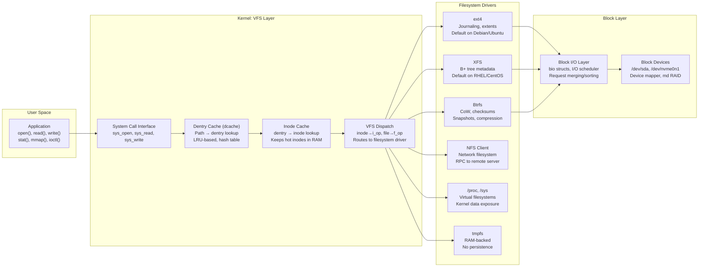
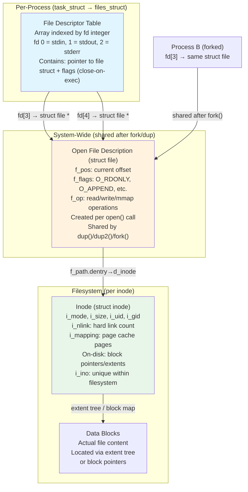
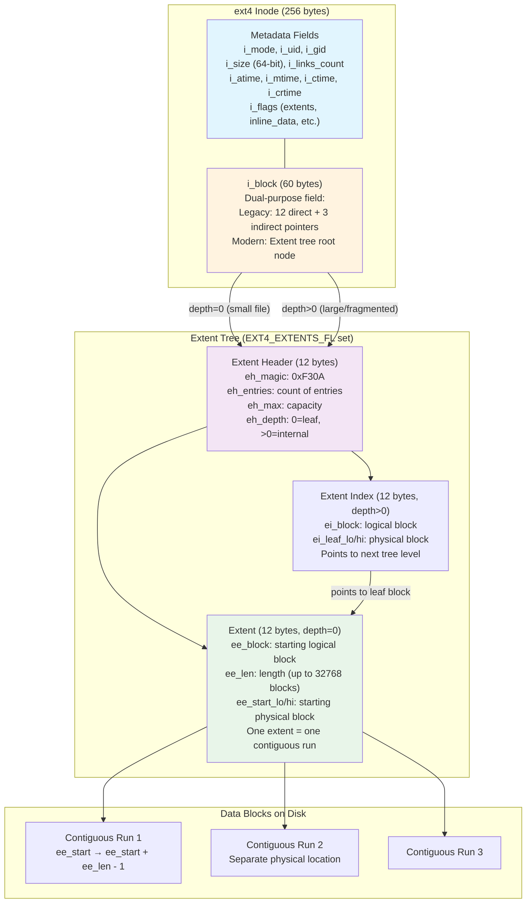
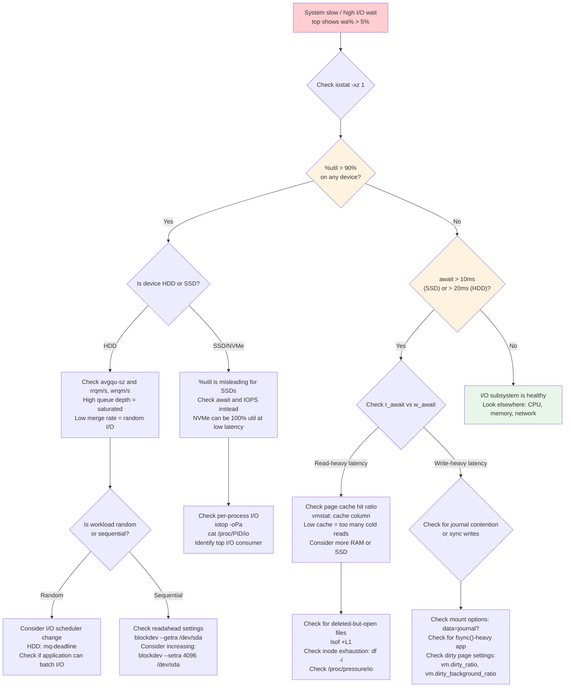

# Topic 04: Filesystem & Storage -- VFS, Inodes, Journaling, I/O Schedulers, ext4/XFS/Btrfs/ZFS

> **Target Audience:** Senior SRE / Staff+ Cloud Engineers (10+ years experience)
> **Depth Level:** Principal Engineer interview preparation
> **Cross-references:** [Fundamentals](../00-fundamentals/fundamentals.md) | [LVM](../05-lvm/lvm.md) | [Performance & Debugging](../08-performance-and-debugging/performance-and-debugging.md) | [Kernel Internals](../07-kernel-internals/kernel-internals.md)

---

## 1. Concept (Senior-Level Understanding)

### The Linux Filesystem Model: Everything Is a File

The Linux filesystem is not merely a place to store data -- it is the universal abstraction layer for the entire system. Processes, devices, kernel data structures, interprocess communication channels, network sockets, and of course regular files all appear within a single unified hierarchy rooted at `/`. This design philosophy, inherited from UNIX, is the single most important architectural decision a senior engineer must internalize.

The filesystem can be decomposed into four components:

1. **Namespace** -- a hierarchical naming scheme (single-rooted tree, `/` at top, pathnames up to 4095 bytes, individual components up to 255 characters)
2. **API** -- system calls (`open()`, `read()`, `write()`, `close()`, `stat()`, `mmap()`, `ioctl()`) that operate uniformly regardless of what backs the file
3. **Security model** -- POSIX permissions (owner/group/other), ACLs, SELinux/AppArmor labels, capabilities
4. **Implementation** -- the actual code that translates API calls into disk block operations (or network operations, or kernel data reads)

### The Virtual File System (VFS): The Kernel's Indirection Layer

The VFS is the critical abstraction that allows Linux to support dozens of filesystem types simultaneously. It defines a common interface that every filesystem must implement, analogous to an interface or abstract class in object-oriented programming. When userspace calls `open()`, the VFS dispatches to the correct filesystem-specific implementation without the caller ever knowing which filesystem backs the file.



### Design Philosophy: Trade-offs That Matter in Production

| Design Decision | Trade-off | Production Impact |
|---|---|---|
| **Single namespace hierarchy** | Simplicity vs. complexity of mount management | Mount storms during boot; stale NFS mounts can block entire directory subtrees |
| **VFS abstraction** | Uniformity vs. filesystem-specific optimization | Cannot access Btrfs snapshots or ZFS datasets via standard POSIX calls without mount tricks |
| **Inodes as metadata containers** | Fixed metadata overhead vs. flexibility | ext4 preallocates inodes at mkfs time; running out of inodes with disk space remaining is a classic production failure |
| **Page cache integration** | Performance vs. memory pressure | Filesystem I/O always goes through page cache (except O_DIRECT); hot files stay in RAM automatically |
| **Journaling** | Crash consistency vs. write amplification | Journal mode choice (data vs. ordered vs. writeback) directly affects both safety and throughput |

### Hard Links vs. Soft Links: The Inode-Level Explanation

A hard link is not a copy and not a pointer -- it is an additional directory entry pointing to the same inode. The inode maintains a reference count (`i_nlink`). `rm` decrements this count; the inode and its data blocks are freed only when `i_nlink` reaches zero AND no process holds the file open (reference count in the open file table also reaches zero).

A symbolic (soft) link is a separate inode whose data content is the pathname of the target. The kernel resolves symlinks during path traversal by reading the link content and restarting the lookup. Symlinks can cross filesystem boundaries, can point to nonexistent targets (dangling), and can form loops (the kernel enforces a maximum symlink depth of 40 to prevent infinite recursion).

| Property | Hard Link | Symbolic Link |
|---|---|---|
| **Own inode?** | No (shares target inode) | Yes (separate inode, type `l`) |
| **Cross filesystem?** | No (inodes are per-filesystem) | Yes |
| **Target deletion** | File persists (link count > 0) | Dangling link (broken) |
| **Directory linking** | Prohibited (except `.` and `..`) | Allowed |
| **Performance** | Direct inode access (one lookup) | Extra lookup (read symlink content, restart path resolution) |
| **Space overhead** | One directory entry (name + inode number) | Full inode + data (pathname string, often inline in inode for short targets) |

---

## 2. Internal Working (Kernel-Level Deep Dive)

### VFS Core Data Structures

The VFS operates through four fundamental kernel structures. Understanding these is essential for interpreting kernel traces, debugging filesystem issues, and answering FAANG interview questions.

**`struct super_block`** -- represents a mounted filesystem instance:
- Contains filesystem type, block size, mount flags, dirty flag
- Holds the root dentry (`s_root`) for the mounted filesystem
- Contains `s_op` (struct super_operations) with methods: `alloc_inode()`, `destroy_inode()`, `write_super()`, `sync_fs()`, `statfs()`
- One super_block per mounted filesystem; kept in a global linked list

**`struct inode`** -- represents a file/directory/device/pipe in the VFS:
- Contains metadata: `i_mode`, `i_uid`, `i_gid`, `i_size`, `i_atime`, `i_mtime`, `i_ctime`, `i_nlink`
- `i_op` (struct inode_operations): `create()`, `lookup()`, `link()`, `unlink()`, `mkdir()`, `rename()`
- `i_fop` (struct file_operations): default operations for files opened from this inode
- `i_mapping` (struct address_space): links the inode to its page cache pages
- Identified uniquely within a filesystem by `i_ino` (inode number)

**`struct dentry`** -- connects names (pathnames) to inodes:
- Contains `d_name` (the path component), `d_inode` (pointer to associated inode), `d_parent`
- Maintained in the dentry cache (dcache) -- a hash table for O(1) path-to-dentry lookup
- States: positive (points to valid inode), negative (caches "file not found" to avoid repeated disk lookups), unused (valid but refcount is 0, eligible for reclaim)
- The dcache is one of the most performance-critical caches in the kernel; a cache miss requires a disk read

**`struct file`** -- represents an open file descriptor:
- Created on each `open()` call; destroyed on last `close()`
- Contains `f_pos` (current file offset), `f_flags` (O_RDONLY, O_APPEND, etc.), `f_op` (file operations)
- Points to `f_path.dentry` which points to the inode
- Multiple file structs can point to the same dentry/inode (multiple opens of the same file)

### The Three-Table File Descriptor Architecture

When a process opens a file, the kernel traverses three linked data structures. This is a foundational concept for understanding `lsof`, `/proc/<PID>/fd`, file descriptor inheritance across `fork()`, and the "deleted-but-open file" production scenario.



**Critical production implications:**
- `fork()` duplicates the fd table but shares the open file descriptions -- both parent and child share `f_pos`, so concurrent reads advance the same offset
- `dup()`/`dup2()` creates a new fd pointing to the same open file description
- Deleting a file (`unlink()`) removes the directory entry and decrements `i_nlink`, but the inode and data blocks persist as long as any process holds an open file descriptor -- this is the root cause of the "disk full but `du` shows space available" production incident
- `/proc/<PID>/fd/` exposes the per-process fd table; `ls -la /proc/<PID>/fd/` shows symlinks to files, with `(deleted)` suffix for unlinked-but-open files

### ext4 Inode Internals: From Block Pointers to Extent Trees

The ext4 inode is 256 bytes (configurable at mkfs, was 128 in ext2/ext3). The critical field is `i_block` -- a 60-byte region that stores either the legacy direct/indirect block map or the modern extent tree.



**Key details for interview depth:**
- The 60-byte `i_block` fits exactly one extent header (12 bytes) + 4 extent entries (48 bytes) at the root level -- so files with up to 4 contiguous extents require no additional metadata blocks
- Each extent describes up to 32,768 contiguous blocks (128 MiB with 4K blocks) -- a 1 GiB sequential file needs only 8 extents
- The extent tree depth is typically 0 (leaf in inode) for most files, 1 for large files, rarely 2+
- Legacy indirect block mapping (ext2/ext3): 12 direct blocks (48 KiB), 1 single-indirect (4 MiB), 1 double-indirect (4 GiB), 1 triple-indirect (4 TiB) -- each indirect level requires reading an additional metadata block from disk
- ext4 enables extents by default; the `EXT4_EXTENTS_FL` flag in `i_flags` distinguishes the two modes
- XFS has always used extent-based allocation (B+ trees for metadata), which is why it excels at large files and parallel I/O

### Journaling Internals

Journaling solves the crash consistency problem: if power fails mid-write, on-disk data structures could be left in an inconsistent state. Without journaling, `fsck` had to walk the entire filesystem to detect and repair inconsistencies -- hours on large disks.

**The journal write protocol (ext4/JBD2):**

1. **Transaction open** -- filesystem operations are grouped into a compound transaction
2. **Journal write** -- modified metadata blocks (and optionally data blocks) are written sequentially to the journal area on disk
3. **Commit record** -- a commit block is written to mark the transaction as complete
4. **Checkpoint** -- the journaled blocks are written to their final on-disk locations
5. **Journal reclaim** -- completed transactions are marked as reclaimable in the journal superblock

**ext4 journaling modes (mount option `data=`):**

| Mode | What is Journaled | Consistency Guarantee | Performance | Use Case |
|---|---|---|---|---|
| **`journal`** | Metadata AND data | Strongest: both metadata and data are crash-consistent | Slowest (2x write amplification for data) | Critical data where any inconsistency is unacceptable |
| **`ordered`** (default) | Metadata only, but data is flushed before metadata commit | Strong: data blocks are written before the metadata pointing to them | Moderate | General-purpose (default for good reason) |
| **`writeback`** | Metadata only, no data ordering | Metadata-consistent, but stale data may appear in newly allocated blocks after crash | Fastest | Temporary data, scratch space, when application handles its own consistency (databases) |

**The critical distinction:** In `ordered` mode, if you `write()` new data to a file, the kernel ensures the data blocks hit disk BEFORE the metadata (extent tree, inode timestamps) is committed to the journal. This prevents the "stale data exposure" vulnerability where a crash could leave metadata pointing to blocks containing old data from a different file.

**XFS journaling:** XFS journals only metadata (similar to ext4 `writeback` for data), but uses write barriers and flush commands to ensure ordering. XFS's journal is a dedicated area typically at the start of the filesystem (or an external log device for performance). XFS uses delayed allocation by default, which batches allocation decisions until data flush time, resulting in better contiguous allocation.

### I/O Schedulers: Multi-Queue Architecture

Modern Linux (5.0+) uses the blk-mq (multi-queue block layer) framework. The legacy single-queue schedulers (CFQ, deadline, noop) are removed. The four available schedulers:

| Scheduler | Design | Best For | Avoid When |
|---|---|---|---|
| **`none`** | No scheduling; passes requests directly to hardware queues | NVMe SSDs (already have internal scheduling), high-IOPS devices | HDDs (causes seek storms) |
| **`mq-deadline`** | Batches reads/writes with per-request deadlines; prevents starvation | HDDs, SATA SSDs, mixed read/write workloads, databases | Low-latency NVMe (adds unnecessary overhead) |
| **`bfq`** (Budget Fair Queueing) | Proportional-share scheduling, ensures interactive responsiveness | Desktop systems, mixed interactive + batch I/O, containers needing I/O fairness | High-throughput servers (high per-I/O CPU overhead) |
| **`kyber`** | Token-based latency-targeting; limits in-flight requests per latency class | Fast SSDs where latency matters more than throughput | HDDs (not designed for rotational media) |

**Checking and changing the scheduler:**
```bash
# View current scheduler for a device
cat /sys/block/sda/queue/scheduler
# Output: [mq-deadline] kyber bfq none

# Change at runtime
echo kyber > /sys/block/sda/queue/scheduler

# Persistent via udev rule
# /etc/udev/rules.d/60-ioscheduler.rules
ACTION=="add|change", KERNEL=="sd[a-z]", ATTR{queue/scheduler}="mq-deadline"
ACTION=="add|change", KERNEL=="nvme[0-9]*", ATTR{queue/scheduler}="none"
```

---

## 3. Commands (Production Reference)

### Filesystem Information and Mounting

```bash
# Show all mounted filesystems with type and options
mount | column -t
findmnt --real                               # Tree view, excludes virtual filesystems
findmnt -t ext4,xfs                          # Filter by filesystem type

# Disk space usage
df -hT                                       # Human-readable with filesystem type
df -i                                        # Inode usage (CRITICAL -- catches inode exhaustion)
df -h --output=source,fstype,size,used,avail,pcent,target   # Custom columns

# Directory space usage
du -sh /var/log                              # Summary of a directory
du -h --max-depth=1 /var | sort -rh | head   # Top space consumers under /var
ncdu /var                                    # Interactive disk usage analyzer (install separately)

# Mount operations
mount -t ext4 -o noatime,data=ordered /dev/sda1 /mnt
mount -o remount,noatime /                   # Remount with new options (no umount needed)
mount --bind /data/shared /mnt/shared        # Bind mount: same filesystem at two paths
```

### Inode and File Investigation

```bash
# Inode information
ls -li /path/to/file                         # Show inode number
stat /path/to/file                           # Full inode metadata
stat -f /path/to/file                        # Filesystem-level stats

# Find hard links (same inode number)
find / -inum 12345 2>/dev/null               # Find all paths pointing to inode 12345
find /data -samefile /data/important.txt     # Find hard links to a specific file

# Filesystem debugging (ext4)
debugfs /dev/sda1                            # Interactive ext4 debugger
debugfs -R "stat <12345>" /dev/sda1          # Dump inode 12345 without entering interactive mode
debugfs -R "ncheck 12345" /dev/sda1          # Inode number → pathname
tune2fs -l /dev/sda1                         # Superblock information (ext4)
dumpe2fs /dev/sda1 | head -60                # Detailed filesystem parameters
xfs_info /dev/sda1                           # XFS filesystem parameters
xfs_db -r /dev/sda1                          # XFS debugger (read-only)
```

### Open Files and File Descriptors

```bash
# Open files by process
lsof -p <PID>                                # All open files for a process
lsof +D /var/log                             # All open files under a directory (recursive)
lsof /var/log/syslog                         # Which processes have this file open

# Deleted-but-open files (CRITICAL for "disk full" debugging)
lsof +L1                                     # Files with link count < 1 (deleted but still open)
lsof +L1 | awk '{sum += $7} END {print sum/1024/1024/1024 " GiB held by deleted files"}'

# Per-process fd info via /proc
ls -la /proc/<PID>/fd/                       # List all open file descriptors
readlink /proc/<PID>/fd/3                    # What file is fd 3 pointing to
cat /proc/<PID>/fdinfo/3                     # Offset, flags for fd 3
cat /proc/sys/fs/file-nr                     # System-wide: allocated / free / max file descriptors
cat /proc/sys/fs/inode-nr                    # Allocated / free inodes in kernel cache
```

### I/O Performance Monitoring

```bash
# iostat (from sysstat package)
iostat -xz 1                                 # Extended stats, skip idle devices, 1-sec interval
# Key columns:
#   %util    -- device saturation (100% = fully saturated for HDDs; misleading for SSDs)
#   await    -- average I/O latency (ms), including queue time
#   r_await/w_await  -- read/write latency breakdown
#   avgqu-sz -- average queue depth
#   r/s, w/s -- IOPS

# /proc/diskstats (raw kernel counters)
cat /proc/diskstats
# Fields: major minor name rd_ios rd_merges rd_sectors rd_ticks
#         wr_ios wr_merges wr_sectors wr_ticks ios_in_progress io_ticks weighted_io_ticks
#         (kernel 4.18+ adds discard fields; 5.5+ adds flush fields)

# blktrace (deep I/O tracing)
blktrace -d /dev/sda -o trace &              # Start tracing (generates binary output)
blkparse -i trace                            # Parse trace data
# Or combined:
btrace /dev/sda                              # blktrace + blkparse in one command

# I/O pressure (kernel 4.20+ with PSI enabled)
cat /proc/pressure/io                        # PSI metrics for I/O
# some avg10=5.00 avg60=3.25 avg300=1.50 total=123456789
# full avg10=2.00 avg60=1.50 avg300=0.75 total=98765432

# Per-process I/O stats
cat /proc/<PID>/io
# rchar, wchar    = bytes read/written (includes page cache hits)
# read_bytes, write_bytes = actual disk I/O bytes
# cancelled_write_bytes   = bytes written then deleted before flush

# iotop (requires CONFIG_TASK_IO_ACCOUNTING)
iotop -oPa                                   # Only show active processes, accumulated I/O
```

### Filesystem Check and Repair

```bash
# ext4
e2fsck -n /dev/sda1                          # Read-only check (safe on mounted, but limited)
e2fsck -fp /dev/sda1                         # Auto-repair (MUST unmount first)
tune2fs -c 50 /dev/sda1                      # Force fsck after 50 mounts
tune2fs -l /dev/sda1 | grep -i mount         # Check mount count and max

# XFS
xfs_repair -n /dev/sda1                      # Read-only check
xfs_repair /dev/sda1                         # Repair (MUST unmount first)
xfs_repair -L /dev/sda1                      # Zero-out log (LAST RESORT -- may lose data)

# Verify filesystem consistency online (ext4 kernel 4.12+)
# Requires CONFIG_EXT4_FS_ONLINE_FSCK (experimental)
```

---

## 4. Debugging (Production Scenarios)

### I/O Bottleneck Decision Tree



### Debugging Stale NFS Handles

**Symptoms:** `ls` or `stat` on an NFS-mounted path returns `Stale file handle` (errno ESTALE). Processes accessing the mount hang in D state (uninterruptible sleep).

**Investigation:**
```bash
# Check NFS mount status
mount -t nfs,nfs4                            # List NFS mounts
nfsstat -c                                   # Client-side NFS statistics
nfsiostat 1                                  # Per-mount NFS I/O stats

# Identify stuck processes
ps aux | awk '$8 ~ /D/'                      # Processes in D state
cat /proc/<PID>/wchan                        # What kernel function they're sleeping in
# Common: rpc_wait_bit_killable, nfs_wait_bit_killable

# Check if server exported filesystem was recreated
# (new fsid = all client file handles become invalid)
showmount -e nfs-server                      # Check exports from client side

# Force unmount (disruptive but necessary if server is unreachable)
umount -f /mnt/nfs-share                     # Force unmount NFS
umount -l /mnt/nfs-share                     # Lazy unmount (removes from namespace, closes on last reference)

# Prevention: mount options
mount -t nfs4 -o soft,timeo=30,retrans=3,nointr server:/export /mnt
# soft = return error on timeout instead of hanging forever
# hard (default) = retry indefinitely (guarantees data integrity but risks hangs)
```

### Debugging Filesystem Corruption

```bash
# Step 1: Check kernel log for filesystem errors
dmesg | grep -iE "ext4|xfs|error|corrupt|readonly"
journalctl -k --grep="filesystem\|EXT4-fs\|XFS"

# Step 2: If filesystem is remounted read-only automatically
mount | grep "ro,"                           # Check for read-only remounts

# Step 3: Check SMART data for hardware errors
smartctl -a /dev/sda                         # Full SMART report
smartctl -H /dev/sda                         # Quick health check
smartctl -l error /dev/sda                   # Error log

# Step 4: Backup before repair
dd if=/dev/sda1 of=/backup/sda1.img bs=64K status=progress

# Step 5: Unmount and repair
umount /dev/sda1
e2fsck -fvy /dev/sda1                        # ext4: force check, verbose, auto-yes
xfs_repair /dev/sda1                         # XFS
```

---

## 5. FAANG-Level Incidents

### Incident 1: Inode Exhaustion from Millions of Container Log Fragments

**Context:** A Kubernetes cluster running 200+ pods on each node. Each pod writes per-request log files to a shared `/var/log/containers/` directory on the node's root ext4 filesystem. After 3 weeks of operation, new pods fail to start with `No space left on device` despite `df -h` showing 45% disk space available.

**Symptoms:**
- Pod creation fails with `No space left on device` in kubelet logs
- `df -h` shows ample free space (45% available)
- `df -i` shows inode usage at 100%
- Node cannot create any new files anywhere on the root filesystem
- Existing services continue running but cannot rotate logs or write temp files

**Investigation:**
```bash
$ df -h /
Filesystem      Size  Used Avail Use%  Mounted on
/dev/sda1       100G   55G   45G  55%  /

$ df -i /
Filesystem      Inodes    IUsed    IFree IUse%  Mounted on
/dev/sda1       6553600  6553600       0  100%  /

# Find directories with the most files
$ find /var/log/containers -maxdepth 2 -type d -exec sh -c 'echo "$(find "$1" -maxdepth 1 -type f | wc -l) $1"' _ {} \; | sort -rn | head
4215789  /var/log/containers/audit-sidecar
1832456  /var/log/containers/metrics-proxy
 892341  /var/log/containers/request-logger

# Confirm: millions of tiny files
$ find /var/log/containers/audit-sidecar -type f | head -5
/var/log/containers/audit-sidecar/req-2024-01-15T08:23:45.123Z.log
/var/log/containers/audit-sidecar/req-2024-01-15T08:23:45.124Z.log
...
# Each file is a single request log: 200-500 bytes

$ tune2fs -l /dev/sda1 | grep -i inode
Inode count:              6553600
Free inodes:              0
Inodes per group:         8192
Inode size:               256
# Inodes per group × bytes_per_inode ratio was set at mkfs time -- cannot be changed
```

**Root Cause:** The audit sidecar container was configured to write one file per HTTP request rather than appending to a rotating log file. At ~2000 requests/second, this generated 172 million files per day. The ext4 filesystem was created with the default `bytes_per_inode` ratio of 16384, yielding ~6.5 million inodes for 100 GiB -- exhausted in under 4 days of log accumulation (cleanup ran weekly).

**Fix:**
```bash
# Immediate: purge old log files
find /var/log/containers/audit-sidecar -type f -mtime +1 -delete

# Batch deletion (avoid argument list too long)
find /var/log/containers/audit-sidecar -type f -mtime +1 -print0 | xargs -0 -P4 rm -f
```

**Prevention:**
1. Reconfigured audit sidecar to append to a single rotating log file (logrotate with 10 MiB rotation)
2. Deployed inode monitoring: `node_filesystem_files_free` in Prometheus with alert at 10% free inodes
3. For new filesystems: `mkfs.ext4 -i 4096 /dev/sdX` (one inode per 4 KiB instead of 16 KiB) for workloads with many small files, or use XFS which allocates inodes dynamically
4. Added kubelet `--eviction-hard=nodefs.inodesFree<5%` flag for inode-based pod eviction

---

### Incident 2: Journal Corruption After Unexpected Power Loss on ext4

**Context:** A bare-metal database server running ext4 with `data=writeback` (set for performance). UPS failed silently during a datacenter power event. Server rebooted but the ext4 filesystem containing the database WAL directory remounted as read-only.

**Symptoms:**
- Database process cannot write: `EROFS: Read-only file system`
- `dmesg` shows: `EXT4-fs error (device sda3): ext4_journal_check_start:83: Detected aborted journal`
- `mount` confirms: `/dev/sda3 on /data type ext4 (ro,errors=remount-ro)`
- Journal replay at boot failed with checksum errors

**Investigation:**
```bash
$ dmesg | grep -i ext4
[    3.456] EXT4-fs (sda3): mounting ext4 file system
[    3.789] EXT4-fs (sda3): recovery required, journal checksum error
[    3.812] EXT4-fs (sda3): error loading journal
[    4.001] EXT4-fs (sda3): mount failed, journal recovery failed
[    4.002] EXT4-fs (sda3): mounted filesystem with errors, running in read-only mode

$ tune2fs -l /dev/sda3 | grep -i state
Filesystem state:         ERROR

$ dumpe2fs /dev/sda3 2>/dev/null | grep -i journal
Journal inode:            8
Journal backup:           inode blocks
Journal features:         journal_checksum_v3 journal_64bit
Journal size:             128M
Journal length:           32768
Journal sequence:         0x0024f8a3
```

**Root Cause:** The `data=writeback` mode does not enforce ordering between data writes and journal commits. During the power loss, the journal was mid-write with partially flushed blocks. The journal checksum (v3, enabled by default in modern ext4) correctly detected the corruption, preventing the kernel from replaying a corrupted journal -- which is the safety mechanism working as designed. However, the journal itself was unrecoverable via normal replay.

**Fix:**
```bash
# Step 1: Full disk backup first
dd if=/dev/sda3 of=/backup/sda3-pre-repair.img bs=64K status=progress

# Step 2: Force-check the filesystem (must be unmounted)
umount /dev/sda3 2>/dev/null
e2fsck -fy /dev/sda3
# e2fsck will: clear the corrupted journal, rebuild it, fix orphan inodes

# Step 3: If e2fsck cannot repair the journal
# Recreate the journal (LAST RESORT -- may lose recently written data)
tune2fs -O ^has_journal /dev/sda3            # Remove journal
e2fsck -f /dev/sda3                          # Full check without journal
tune2fs -j /dev/sda3                         # Re-add journal

# Step 4: Remount
mount -o data=ordered /dev/sda3 /data        # Switch to ordered mode
```

**Prevention:**
1. Changed mount option to `data=ordered` (the default) -- the performance delta vs. `writeback` is ~5-10% but crash safety is dramatically better
2. Enabled `barrier=1` (default) to ensure write barriers are not disabled
3. Deployed UPS monitoring with auto-shutdown before battery exhaustion
4. For database workloads: the database's own WAL provides crash recovery, so `writeback` is defensible IF the UPS is reliable and monitored; otherwise `ordered` is the safe default
5. Added `errors=remount-ro` (already default) to prevent further damage after detection

---

### Incident 3: I/O Scheduler Causing Tail Latency for Database Workload

**Context:** A MySQL database on RHEL 8 with NVMe storage. P99 query latency is 5x higher than P50 (25 ms vs. 5 ms) despite low average I/O utilization. The issue appeared after a kernel upgrade from RHEL 7 (which used the legacy CFQ scheduler).

**Symptoms:**
- P50 latency: 5 ms (acceptable)
- P99 latency: 25 ms (SLA violation at 15 ms)
- `iostat` shows average await of 0.1 ms and %util of 15% -- not saturated
- Periodic latency spikes correlated with `kworker` threads flushing dirty pages

**Investigation:**
```bash
$ cat /sys/block/nvme0n1/queue/scheduler
[bfq] mq-deadline kyber none

# BFQ is set! This was the RHEL 8 default for NVMe at the time
# BFQ provides fairness but has high per-I/O CPU overhead

$ iostat -xz 1 nvme0n1
Device  r/s    w/s   rkB/s   wkB/s  rrqm/s wrqm/s %rrqm %wrqm r_await w_await avgqu-sz %util
nvme0n1 8500   3200  34000   51200  0.00   125.00  0.00  3.76  0.08    0.15    0.95     14.5

# Latency histogram via blktrace
$ blktrace -d /dev/nvme0n1 -o - | blkparse -i - -d latency.bin
$ btt -i latency.bin | head -20
# Shows: Q2C (queue-to-complete) P99 at 15ms during BFQ scheduling

# Confirm BFQ is the bottleneck
$ perf top -p $(pgrep -f "kworker.*blk")
# Shows bfq_dispatch_request consuming 18% CPU
```

**Root Cause:** BFQ (Budget Fair Queueing) was designed for HDDs and interactive desktops where fairness between I/O-competing processes is important. For NVMe devices, BFQ's per-I/O scheduling overhead (budget calculation, queue rebalancing) introduced artificial latency spikes. NVMe devices have deep internal queues and sub-millisecond latency; the I/O scheduler's sorting and batching adds no value and only introduces jitter.

**Fix:**
```bash
# Immediate: switch to none (no scheduling)
echo none > /sys/block/nvme0n1/queue/scheduler

# Persistent via udev rule
cat > /etc/udev/rules.d/60-ioscheduler.rules << 'EOF'
ACTION=="add|change", KERNEL=="nvme[0-9]*", ATTR{queue/scheduler}="none"
ACTION=="add|change", KERNEL=="sd[a-z]", ATTR{queue/scheduler}="mq-deadline"
EOF
udevadm control --reload-rules && udevadm trigger
```

**Prevention:**
1. Standard operating procedure: NVMe devices use `none`, HDDs use `mq-deadline`
2. Added scheduler verification to server provisioning automation
3. P99 latency monitoring with scheduler-awareness in runbooks
4. For mixed HDD+NVMe systems: set per-device rules, never a global default

---

### Incident 4: Filesystem Full from Deleted-but-Open Files

**Context:** A production web application server running Nginx and a log processing pipeline. `df -h` reports the root filesystem at 100%, but `du -sh /` shows only 60 GiB used on a 100 GiB disk. Deployments fail because the filesystem cannot create new temp files.

**Symptoms:**
- `df -h /` shows 100% usage (0 bytes available)
- `du -sh / --exclude=/proc --exclude=/sys` shows 60 GiB -- 40 GiB is "missing"
- Application deployments fail: `No space left on device`
- Existing services continue running (they have their fds open already)
- No inode exhaustion: `df -i` shows 25% used

**Investigation:**
```bash
$ df -h /
Filesystem      Size  Used Avail Use%  Mounted on
/dev/sda1       100G  100G     0  100%  /

$ du -sh / --exclude=/proc --exclude=/sys --exclude=/dev 2>/dev/null
60G     /

# 40 GiB discrepancy! Check for deleted-but-open files
$ lsof +L1 | head
COMMAND     PID   USER   FD   TYPE DEVICE    SIZE/OFF NLINKS  NODE NAME
nginx     12345   www    5w   REG  8,1   21474836480  0     67890 /var/log/nginx/access.log (deleted)
nginx     12345   www    6w   REG  8,1   16106127360  0     67891 /var/log/nginx/error.log (deleted)
logstash  23456   root   9r   REG  8,1    4294967296  0     67890 /var/log/nginx/access.log (deleted)

# Confirm: 21 GiB access.log + 15 GiB error.log + 4 GiB logstash buffer = 40 GiB
$ lsof +L1 | awk '{sum += $7} END {printf "%.1f GiB held by deleted files\n", sum/1024/1024/1024}'
40.0 GiB held by deleted files
```

**Root Cause:** `logrotate` was configured with `copytruncate` mode (which copies the file then truncates), but the rotation script had a bug that used `rm` followed by `touch` instead of `truncate`. The `rm` removed the directory entry (`i_nlink` dropped to 0), but Nginx still had the file open via its fd. The inode and all data blocks remained allocated because the kernel tracks both link count AND open fd count -- blocks are freed only when both reach zero. Logstash was also reading the same deleted file via its fd.

**Fix:**
```bash
# Option 1: Truncate the file via the still-open fd (no process restart needed)
: > /proc/12345/fd/5                         # Truncates the deleted file to 0 bytes
# This works because /proc/PID/fd/N is a magic symlink that accesses the open file description

# Option 2: If process has many large deleted files, signal it to reopen
kill -USR1 12345                             # Nginx: graceful reopen of log files
# Or for generic services:
kill -HUP <PID>                              # Many daemons reopen logs on SIGHUP

# Option 3: Nuclear option -- restart the process to close all fds
systemctl restart nginx

# Verify space was reclaimed
$ df -h /
Filesystem      Size  Used Avail Use%  Mounted on
/dev/sda1       100G   60G   40G   60%  /
```

**Prevention:**
1. Fixed logrotate config to use `copytruncate` correctly (or `postrotate` with `kill -USR1`) instead of `rm` + `touch`
2. Added monitoring: `node_filesystem_avail_bytes` alert plus a custom check comparing `df` vs. `du` for discrepancy
3. Periodic `lsof +L1` check in cron, alerting if deleted-but-open files exceed 1 GiB
4. Documentation: "Never `rm` a log file that a running process has open. Use `truncate -s 0` or signal the process to reopen."

---

### Incident 5: XFS Extent Tree Corruption Causing Silent Data Loss

**Context:** A large-scale data processing cluster storing intermediate results on XFS-formatted local NVMe drives. After a kernel upgrade (5.4 to 5.10), specific files return zeros when read, despite appearing with correct size in `ls -la`. No error messages in kernel logs. Data is silently wrong.

**Symptoms:**
- Application checksums fail for specific output files
- Files show correct size and timestamps in `stat` output
- `md5sum` of affected files returns hashes of all-zero content
- No filesystem errors in `dmesg` or `journalctl`
- Issue affects only files written during a 2-hour window after the kernel upgrade

**Investigation:**
```bash
# Confirm file is zeros
$ hexdump -C /data/output/batch-42.parquet | head
00000000  00 00 00 00 00 00 00 00  00 00 00 00 00 00 00 00  |................|
*
38000000

$ stat /data/output/batch-42.parquet
  File: /data/output/batch-42.parquet
  Size: 939524096    Blocks: 1835008    IO Block: 4096   regular file
# Size and block count look correct

# Check XFS extent mapping
$ xfs_bmap -v /data/output/batch-42.parquet
/data/output/batch-42.parquet:
 EXT: FILE-OFFSET      BLOCK-RANGE          AG AG-OFFSET           TOTAL
   0: [0..1835007]:    hole                                       1835008
# ALL EXTENTS ARE HOLES! The extent tree maps the entire file to unallocated space

$ xfs_repair -n /dev/nvme0n1p1
Phase 1 - find and verify superblock...
Phase 2 - using internal log
        - zero log...
Phase 3 - for each AG...
        - scan and clear agi unlinked lists...
        - process known inodes and perform inode discovery...
        - agno = 0
        - agno = 1
ERROR: inode 134217891: extent tree corrupted, expected extent at offset 0, got hole
# xfs_repair found the corruption
```

**Root Cause:** A known kernel regression (tracked in upstream XFS, specific to the 5.10.x series before 5.10.52) in the delayed allocation writeback path. When the system was under heavy memory pressure during the kernel upgrade window, `writeback` for files using delayed allocation (`EOFBLOCKS` flag) could fail to convert delalloc extents to real extents before the inode was flushed. The metadata (inode size, timestamps) was committed correctly, but the extent tree was never updated from "delalloc reservations" to "real allocations" -- resulting in the extent map showing holes where data should exist.

**Fix:**
```bash
# The data is unrecoverable -- extents point to unallocated space
# The blocks may have been reallocated to other files already

# Step 1: Identify all affected files
$ xfs_repair -n /dev/nvme0n1p1 2>&1 | grep "extent tree corrupted" | wc -l
847   # 847 files affected

# Step 2: Regenerate from upstream source data
# (This is a data processing pipeline -- rerun the affected batches)

# Step 3: Apply kernel fix
dnf update kernel-5.10.52+
reboot
```

**Prevention:**
1. Never upgrade kernels on data-processing nodes without first flushing all pending I/O (`sync; echo 3 > /proc/sys/vm/drop_caches`)
2. Pin kernel versions in production; test upgrades on canary nodes for 7 days before fleet rollout
3. Enable data checksums in application layer (Parquet CRC, application-level SHA256)
4. For critical data: XFS `reflink` snapshots before kernel upgrades, or Btrfs/ZFS with built-in checksums
5. Monitor `xfs_stats` in `/proc/fs/xfs/stat` for anomalous delalloc behavior

---

## 6. Interview Questions

### Category 1: Conceptual Deep Questions

#### Q1. Explain the VFS layer. What are the four core objects, and how does a read() system call traverse them?

**Difficulty:** Senior | **Category:** Filesystem Internals

**Answer:**
1. The VFS (Virtual File System) is a kernel abstraction layer that provides a uniform interface to all filesystem types
2. Four core objects:
   - **Superblock (`super_block`)**: represents a mounted filesystem; holds block size, inode count, root dentry, filesystem operations
   - **Inode (`inode`)**: represents a file object; holds metadata (permissions, size, timestamps), operation vectors (`i_op`, `i_fop`), page cache mapping
   - **Dentry (`dentry`)**: maps pathname components to inodes; cached in the dcache for fast lookup; states: positive, negative, unused
   - **File (`file`)**: represents an open file; holds current offset (`f_pos`), flags, pointer to dentry/inode
3. `read()` traversal path:
   - Userspace calls `read(fd, buf, count)`
   - Kernel looks up `fd` in the per-process file descriptor table to get `struct file`
   - `struct file` contains `f_op->read` or `f_op->read_iter` (the filesystem-specific read function)
   - VFS calls the filesystem's read method (e.g., `ext4_file_read_iter`)
   - The filesystem checks the page cache (`address_space` linked from the inode)
   - Cache hit: data is copied directly from page cache to userspace buffer (minor I/O)
   - Cache miss: filesystem issues a block I/O request, reads data into page cache, then copies to userspace

---

#### Q2. What is the difference between a hard link and a symbolic link at the inode level? What happens to each when the original file is deleted?

**Difficulty:** Senior | **Category:** Filesystem Fundamentals

**Answer:**
1. **Hard link:**
   - A directory entry pointing to the same inode as the original file
   - Both the original name and the hard link are equally "real" -- there is no concept of "the original"
   - The inode's `i_nlink` count tracks the number of directory entries pointing to it
   - When one name is `unlink()`'d, `i_nlink` is decremented; data remains as long as `i_nlink > 0`
   - Cannot cross filesystem boundaries (inodes are per-filesystem)
   - Cannot link to directories (prevents cycles in the directory tree)
2. **Symbolic link:**
   - A separate inode of type `S_IFLNK` whose data content is a pathname string
   - The kernel resolves symlinks during path traversal by reading the target path and restarting resolution
   - Short symlinks (< 60 bytes on ext4) store the target inline in `i_block` ("fast symlink")
   - When the target file is deleted, the symlink becomes dangling -- it still exists but resolution fails with ENOENT
   - Can cross filesystem boundaries and point to directories
3. **Deletion behavior:**
   - Deleting the "original" file when a hard link exists: data persists, both paths were equivalent
   - Deleting the "original" file when a symlink exists: symlink breaks, data is gone (unless other hard links exist)
4. **Production relevance:** Hard links are used by package managers (dpkg uses `i_nlink` for safety) and backup tools (rsync `--link-dest`); symlinks are used for config management (`/etc/alternatives/`), library versioning (`libfoo.so -> libfoo.so.1.2.3`)

---

#### Q3. Explain the three ext4 journaling modes. When would you use each in production?

**Difficulty:** Staff | **Category:** Filesystem Internals

**Answer:**
1. **`data=journal`:**
   - Journals both metadata AND file data
   - Provides strongest consistency: after crash recovery, both file content and metadata are guaranteed consistent
   - Performance cost: all data is written twice (once to journal, once to final location) -- up to 50% throughput reduction
   - Use case: financial transaction logs, audit trails where any data inconsistency is unacceptable
2. **`data=ordered`** (default):
   - Journals metadata only
   - Data blocks are flushed to disk BEFORE the metadata commit record is written to the journal
   - Prevents "stale data exposure" (post-crash, a file cannot contain data from a previously deleted file)
   - Use case: general-purpose servers, web applications, most production workloads
3. **`data=writeback`:**
   - Journals metadata only, no ordering between data and metadata writes
   - After crash, files may contain stale data from previously allocated blocks (security concern in multi-tenant)
   - Highest performance: kernel can reorder writes freely
   - Use case: temporary data, scratch space, databases that implement their own WAL (PostgreSQL, MySQL with InnoDB -- they handle their own data consistency)
4. **Production decision matrix:**
   - Default to `ordered` unless you have a specific, measured reason to change
   - `writeback` is defensible for databases with their own crash-recovery mechanisms AND reliable power infrastructure
   - `journal` is rarely used due to performance cost; consider ZFS or Btrfs for end-to-end data integrity instead

---

#### Q4. How does the file descriptor table, open file table, and inode table relate to each other? What happens during fork() and dup()?

**Difficulty:** Staff | **Category:** Kernel Internals

**Answer:**
1. **Three-layer architecture:**
   - **File descriptor table** (per-process, in `files_struct`): array indexed by fd integer; each entry points to an open file description + close-on-exec flag
   - **Open file description** (system-wide, `struct file`): contains `f_pos` (offset), `f_flags`, `f_op`, pointer to dentry; one created per `open()` call
   - **Inode** (per-filesystem, `struct inode`): file metadata and data block mapping; shared by all opens of the same file
2. **`fork()` behavior:**
   - Child gets a COPY of the parent's fd table (new array, same pointers)
   - Both parent and child share the same open file descriptions (`struct file`)
   - Both share the same file offset (`f_pos`) -- concurrent reads/writes advance the same offset
   - This is why redirecting output in a forked child affects the parent's offset
3. **`dup()`/`dup2()` behavior:**
   - Creates a new fd in the SAME process's fd table
   - New fd points to the SAME open file description as the original
   - Both fds share `f_pos` and `f_flags`
   - Closing one fd does not affect the other
4. **Key implications:**
   - Multiple processes can have fd entries pointing to different open file descriptions for the same inode (independent `open()` calls result in independent offsets)
   - `lsof` shows all open file descriptions across all processes
   - Deleted-but-open files: `unlink()` decrements `i_nlink` to 0, but `struct file` still references the inode; blocks freed only when last fd is closed

---

#### Q5. Compare ext4 vs XFS for a high-throughput database server with 10 TB of data. Which would you choose and why?

**Difficulty:** Staff | **Category:** Architecture Decision

**Answer:**
1. **XFS advantages for this workload:**
   - Dynamic inode allocation: never runs out of inodes regardless of file count
   - B+ tree metadata: O(log n) lookups scale better than ext4's htree for directories with millions of entries
   - Better parallelism: per-allocation-group locking allows concurrent writes from different threads without contention on a single lock
   - Online defragmentation with `xfs_fsr`
   - Better handling of large files: extent-based allocation was in XFS from inception (ext4 added extents later)
   - Default on RHEL/CentOS, which most database teams use
2. **ext4 advantages:**
   - Mature, battle-tested codebase with decades of production history
   - Online resizing (both grow and shrink; XFS can only grow)
   - Simpler recovery tools (`e2fsck` is more forgiving than `xfs_repair`)
   - Lower memory overhead
3. **Recommendation for 10 TB database:**
   - XFS, because:
     - Per-AG parallelism matches database multi-threaded I/O patterns
     - Large file handling is superior
     - No inode pre-allocation limit
     - `noatime` + `allocsize=64k` mount options for database optimization
   - Exception: if the team has deep ext4 expertise and the database is PostgreSQL with its own WAL, ext4 with `data=writeback,noatime` is also a valid choice

---

### Category 2: Scenario-Based Debugging

#### Q6. `df` shows disk is 100% full but `du` shows only 60% used. What is happening and how do you investigate?

**Difficulty:** Senior | **Category:** Debugging

**Answer:**
1. **Most likely cause: deleted-but-open files**
   - `lsof +L1` -- lists files with link count < 1 (deleted but held open by a process)
   - The discrepancy equals the total size of deleted-but-open files
   - Fix: truncate via `/proc/<PID>/fd/<N>` or signal the process to reopen files
2. **Other causes to check:**
   - Hidden mount: another filesystem mounted on top of a directory containing data (`umount` the overlaying filesystem to reveal data underneath)
   - Reserved blocks: ext4 reserves 5% by default for root -- `tune2fs -m 1 /dev/sdX` reduces to 1%
   - Filesystem overhead: metadata, journal, superblock copies
3. **Investigation sequence:**
   - `lsof +L1 | awk '{sum+=$7} END {print sum}'` -- quantify deleted-but-open space
   - `mount | grep <mountpoint>` -- check for stacked mounts
   - `tune2fs -l /dev/sdX | grep "Reserved block count"` -- check reserved blocks
   - `debugfs -R "stats" /dev/sdX | grep overhead` -- filesystem metadata overhead

---

#### Q7. A server has high I/O wait but iostat shows low disk utilization. What could cause this?

**Difficulty:** Staff | **Category:** Performance

**Answer:**
1. **NFS or network filesystem latency:**
   - `nfsiostat 1` -- check NFS mount latency
   - `mount -t nfs4` -- identify NFS mounts
   - Network latency appears as I/O wait but local disk is idle
2. **Filesystem-level lock contention:**
   - `perf record -g -a sleep 10 && perf report` -- look for lock contention in filesystem code paths
   - ext4 journal lock contention under heavy `fsync()` workloads
   - XFS AG lock contention if all writes go to the same allocation group
3. **Swap I/O:**
   - `vmstat 1` -- check `si/so` columns for swap activity
   - Swap I/O counts as I/O wait but may be on a different device than the one monitored
4. **Deleted-but-open file writes:**
   - Process writing to a deleted file still generates I/O but the file does not appear in normal df/du
5. **Device mapper or LVM layer:**
   - `iostat` may show the dm- device utilization, not the underlying physical device
   - Check both: `iostat -xz 1` shows all devices including dm-*
6. **Investigation approach:**
   - `cat /proc/pressure/io` -- PSI confirms I/O stalling
   - `iotop -oPa` -- identify the processes generating the I/O
   - `strace -fp <PID> -e trace=read,write,fsync` -- identify what syscalls are blocking

---

#### Q8. After a power outage, an ext4 filesystem shows errors and remounts as read-only. Walk through your recovery process.

**Difficulty:** Senior | **Category:** Recovery

**Answer:**
1. **Assess the damage (DO NOT write to the filesystem):**
   - `dmesg | grep -i ext4` -- identify specific errors
   - `tune2fs -l /dev/sdX | grep -i state` -- check filesystem state
   - `mount | grep ro` -- confirm read-only status
2. **Backup before repair:**
   - `dd if=/dev/sdX of=/backup/device.img bs=64K status=progress` -- full block-level copy
3. **Unmount and run fsck:**
   - `umount /dev/sdX` (or reboot to single-user/rescue mode if it is the root filesystem)
   - `e2fsck -fvy /dev/sdX` -- force check, verbose, auto-repair
   - `-f` forces check even if clean flag is set
   - `-v` shows progress
   - `-y` auto-answers yes to all repair questions
4. **If journal replay fails:**
   - `e2fsck -fy /dev/sdX` -- attempts journal replay first
   - If that fails: `tune2fs -O ^has_journal /dev/sdX` to remove journal, then `e2fsck -f`, then `tune2fs -j` to recreate
5. **Post-repair:**
   - Check `lost+found/` for orphan files (named by inode number, use `debugfs` to identify)
   - Verify application data integrity (checksums, database consistency checks)
   - Investigate why the power outage caused journal corruption (UPS health, write cache on RAID controller)

---

### Category 3: Architecture & Design

#### Q9. You are designing the storage architecture for a new microservices platform. How do you choose between ext4, XFS, Btrfs, and ZFS?

**Difficulty:** Principal | **Category:** Architecture

**Answer:**
1. **Decision criteria matrix:**
   - Production maturity and team expertise
   - Kernel integration status (in-tree vs. out-of-tree)
   - Specific feature requirements (snapshots, checksums, compression)
   - Hardware characteristics (NVMe vs. HDD, RAID controller vs. software RAID)
   - Scale requirements (max file size, max filesystem size, inode limits)
2. **ext4:**
   - Choose when: general-purpose, well-understood, maximum compatibility
   - Avoid when: need dynamic inode allocation, >16 TiB files, built-in snapshots
   - Team requirement: any Linux admin can manage it
3. **XFS:**
   - Choose when: large files, high-throughput parallel I/O, RHEL-based infrastructure
   - Avoid when: need to shrink the filesystem, need cheap snapshots
   - Note: cannot shrink an XFS filesystem after creation
4. **Btrfs:**
   - Choose when: need snapshots, compression, checksums, send/receive replication
   - Avoid when: RAID5/6 (still considered unstable), databases with heavy random writes (CoW amplification)
   - Note: SUSE default, in-tree kernel support, actively developed
5. **ZFS:**
   - Choose when: maximum data integrity, built-in RAID, deduplication, enterprise NAS
   - Avoid when: tight RAM budget (ARC cache is memory-hungry), need in-tree kernel module (CDDL license conflict with GPL)
   - Note: requires OpenZFS out-of-tree module; cannot be included in mainline kernel
6. **Recommendation for microservices platform:**
   - Kubernetes nodes: XFS (dynamic inodes handle container image layers well, default on RHEL)
   - Persistent volumes (databases): ext4 or XFS depending on team experience
   - Backup/snapshot storage: Btrfs or ZFS (snapshot and replication features)
   - Object storage: XFS (tested at scale by Ceph, Swift)

---

#### Q10. Explain the I/O path from a userspace write() call to data hitting the disk platter. Include all kernel layers.

**Difficulty:** Principal | **Category:** I/O Path

**Answer:**
1. **Userspace:** Application calls `write(fd, buf, count)`
2. **System call entry:** `sys_write()` in kernel
3. **VFS layer:** Resolves `fd` to `struct file`, calls `f_op->write_iter()`
4. **Filesystem layer (e.g., ext4):**
   - Allocates page cache pages if not present
   - Copies data from userspace buffer to page cache pages
   - Marks pages as dirty in the `address_space`
   - Updates inode metadata (size, mtime)
   - Returns to userspace (write is "complete" from app perspective)
5. **Writeback:**
   - `pdflush`/`flush-X:Y` kernel threads (or direct writeback if `dirty_ratio` exceeded)
   - Triggered by: timer expiry (`dirty_expire_centisecs`), memory pressure, explicit `sync`/`fsync`
   - Filesystem's `writepages()` converts dirty pages to block I/O requests
6. **Block layer:**
   - Creates `struct bio` (block I/O descriptor) with physical block numbers
   - I/O scheduler (mq-deadline/bfq/kyber/none) may reorder, merge, or batch requests
   - Creates `struct request` from merged bios
7. **Device driver:**
   - Submits request to hardware command queue (e.g., NVMe submission queue)
   - For NVMe: directly to hardware ring buffer via MMIO
   - For SCSI/SATA: through SCSI midlayer, then HBA driver
8. **Hardware:**
   - Controller writes data to media (NAND flash for SSD, magnetic platter for HDD)
   - Completion interrupt signals the driver
9. **Completion path:**
   - Driver marks `bio` as complete
   - Page cache pages are marked clean
   - If `fsync()` was called, the process is woken up

---

### Category 4: Quick-Fire / Trivia

#### Q11. What is the default inode size in ext4, and what does `tune2fs -l` show you?

**Difficulty:** Senior

**Answer:**
- Default inode size: 256 bytes (was 128 in ext2/ext3)
- `tune2fs -l /dev/sdX` shows: filesystem features, block size, inode count, free inodes, block count, free blocks, mount count, last fsck, journal size, filesystem UUID, volume label
- Extended attributes (xattrs), ACLs, and inline data fit in the extra 128 bytes of the 256-byte inode

---

#### Q12. How do you find which process is preventing a filesystem from being unmounted?

**Difficulty:** Senior

**Answer:**
- `fuser -vm /mount/point` -- shows PIDs and access types (current directory, open file, executable)
- `lsof +D /mount/point` -- lists all open files under the mount point
- `fuser -k /mount/point` -- kills all processes using the filesystem (destructive)
- Last resort: `umount -l /mount/point` -- lazy unmount (detaches from namespace, actual unmount when references close)

---

#### Q13. What is the maximum number of hard links to a single file on ext4?

**Difficulty:** Senior

**Answer:**
- ext4: 65,000 hard links per inode (limited by `i_links_count` being 16-bit in original ext format)
- With `dir_nlink` feature (default in modern ext4): directories can have >65,000 subdirectories (link count set to 1 and managed differently)
- XFS: no practical limit (64-bit link count)
- Btrfs: 65,535 (16-bit)

---

#### Q14. What is the difference between `sync`, `fsync()`, and `fdatasync()`?

**Difficulty:** Staff

**Answer:**
- **`sync` (command/syscall):** Flushes ALL dirty buffers and pages system-wide to all filesystems; returns before writes complete on some implementations
- **`fsync(fd)`:** Flushes all dirty data AND metadata for the specific file to disk; blocks until hardware confirms write completion; includes file size, timestamps, extent tree
- **`fdatasync(fd)`:** Like `fsync()` but skips metadata that is not required to read the data (e.g., skips `mtime`/`atime` update but NOT size change); slightly faster when only data integrity matters
- **Production relevance:** Database WAL writers use `fdatasync()` for each transaction commit; `fsync()` after `rename()` is required for crash-safe file replacement (the "fsync dance")

---

#### Q15. Explain what `/proc/diskstats` fields mean and how iostat derives its metrics from them.

**Difficulty:** Staff

**Answer:**
- `/proc/diskstats` provides per-device cumulative counters since boot
- Key fields (0-indexed after device name):
  - Field 0: reads completed
  - Field 1: reads merged (adjacent requests coalesced by the scheduler)
  - Field 2: sectors read (multiply by 512 for bytes)
  - Field 3: read time (ms) -- total time spent in read requests
  - Field 4-7: same for writes
  - Field 8: I/Os in progress (instantaneous snapshot, NOT cumulative)
  - Field 9: I/O time (ms) -- wall-clock time the device had I/O in flight
  - Field 10: weighted I/O time (ms) -- sum of all I/O durations
- `iostat` reads these counters at intervals and computes deltas:
  - `r/s` = delta(reads completed) / interval
  - `await` = delta(read time + write time) / delta(reads + writes completed)
  - `%util` = delta(I/O time) / (interval * 1000) * 100
  - `avgqu-sz` = delta(weighted I/O time) / (interval * 1000)
- **Critical insight:** `%util` at 100% means the device had I/O in flight every millisecond of the interval -- for HDDs this means saturated, for NVMe it may still have abundant IOPS headroom

---

#### Q16. A Kubernetes node shows `df -i` at 95% inode usage but `df -h` at 30% disk usage. What is the most likely cause and how do you fix it?

**Difficulty:** Senior

**Answer:**
1. **Most likely cause:** Container image layers or container logging creating millions of small files
   - OverlayFS (Docker/containerd storage driver) creates many metadata files per layer
   - Application pods writing one file per request/transaction
2. **Investigation:**
   - `find / -xdev -maxdepth 5 -type d | while read d; do echo "$(find "$d" -maxdepth 1 -type f | wc -l) $d"; done | sort -rn | head -20`
   - Check `/var/lib/docker/overlay2/` or `/var/lib/containerd/`
   - `docker system df` / `crictl stats`
3. **Immediate fix:**
   - `docker system prune -a` / `crictl rmi --prune`
   - Clean up application temp files
   - Restart pods that are generating excessive small files
4. **Long-term fix:**
   - Use XFS (dynamic inode allocation) instead of ext4 for Kubernetes node root filesystems
   - Set kubelet eviction thresholds: `--eviction-hard=nodefs.inodesFree<5%`
   - For ext4: recreate with `mkfs.ext4 -i 4096` for lower bytes-per-inode ratio
   - Fix application to use consolidated log files instead of one-file-per-event

---

## 7. Common Pitfalls

1. **Monitoring MemFree instead of disk space on `/tmp`**: tmpfs-backed `/tmp` (common in containers and systemd systems) is RAM-limited; filling it causes OOM, not just "disk full"

2. **Assuming `df` and `du` should agree**: They measure different things. `df` reflects filesystem block allocation (includes deleted-but-open files). `du` walks the directory tree (only counts visible files). Discrepancy is always deleted-but-open files, stacked mounts, or reserved blocks.

3. **Using `nobarrier` mount option for performance**: Disabling write barriers on filesystems with volatile write cache (non-battery-backed RAID) risks catastrophic data loss on power failure. Only safe with battery-backed write cache (BBWC) or when the application handles its own durability.

4. **Ignoring inode monitoring**: Default ext4 `bytes_per_inode` ratio of 16384 means a 1 TiB filesystem gets ~67 million inodes. Container workloads can exhaust this. Always monitor `df -i` alongside `df -h`.

5. **Using `rm` on files held open by long-running processes**: The space is not reclaimed until the last fd is closed. Use `truncate -s 0` or signal the process to reopen.

6. **Forgetting `fsync()` after `rename()` for crash-safe writes**: The correct pattern is: write to temp file, `fsync(temp)`, `rename(temp, target)`, `fsync(directory fd)`. Omitting any step can lose data on crash.

7. **Choosing `data=writeback` without understanding the security implications**: After a crash, newly allocated blocks may contain data from previously deleted files belonging to other users. In multi-tenant environments, this is a data leak.

8. **Assuming NVMe benefits from an I/O scheduler**: NVMe devices have deep internal queues and sub-100us latency. Schedulers like BFQ add CPU overhead and latency with no throughput benefit. Use `none`.

9. **Not testing `xfs_repair` on a copy first**: `xfs_repair` modifies the filesystem in place. Unlike `e2fsck -n`, `xfs_repair -n` is read-only but the actual repair has no "dry run with commit" mode. Always `dd` the partition first.

10. **Using `ext4` with default settings for Kubernetes nodes**: Default bytes-per-inode ratio and lack of dynamic inode allocation makes ext4 vulnerable to inode exhaustion. XFS is strongly preferred for container infrastructure.

---

## 8. Pro Tips

1. **Measure before choosing a filesystem**: Use `fio` to benchmark your actual workload pattern (random vs. sequential, read/write ratio, block size) on candidate filesystems before committing to a production choice.

2. **Use `findmnt` instead of `mount`**: `findmnt` provides cleaner, tree-structured output and can filter by filesystem type, source, or target. `mount` output is increasingly unreadable with cgroups and namespaces.

3. **The `fallocate` trick for instant large files**: `fallocate -l 10G /data/preallocated` allocates space without writing zeros (unlike `dd`). Useful for database tablespace preallocation and swap file creation on ext4/XFS.

4. **Monitor `/proc/pressure/io` for I/O stall detection**: PSI (Pressure Stall Information) is more actionable than `%iowait` from `top`. `some avg10>10` means tasks are waiting for I/O more than 10% of the time in the last 10 seconds.

5. **Use `debugfs` to recover deleted files on ext4**: `debugfs -R 'lsdel' /dev/sdX` lists recently deleted inodes with their size and deletion time. Use `dump <inode_number> /recovery/file` to recover data before blocks are reallocated.

6. **XFS allocation groups for parallelism**: XFS divides the filesystem into allocation groups (AGs), each with independent free space and inode management. For maximum write throughput, ensure your filesystem has at least as many AGs as you have concurrent writer threads.

7. **The `noatime` mount option is almost always correct**: Every `read()` triggers an `atime` update (metadata write). `noatime` eliminates this write amplification. `relatime` (default) reduces but does not eliminate it. For databases and high-IOPS workloads, always use `noatime`.

8. **Use `ionice` for background tasks**: `ionice -c 3 tar czf backup.tar.gz /data` runs tar at idle I/O priority, preventing it from impacting production workloads (only effective with BFQ or CFQ schedulers, not `none`).

9. **For ext4 emergency recovery, keep a superblock backup map**: `dumpe2fs /dev/sdX | grep -i superblock` shows backup superblock locations. If the primary superblock is corrupted: `e2fsck -b 32768 /dev/sdX` uses the backup at block 32768.

10. **Profile filesystem overhead with `perf`**: `perf record -g -a -e 'block:*' sleep 10` traces all block-layer events. `perf report` shows which filesystem functions are generating the most I/O -- invaluable for finding hidden `fsync()` storms or journal contention.

---

## 9. Quick Reference Cheatsheet

### Filesystem Comparison at a Glance

| Feature | ext4 | XFS | Btrfs | ZFS |
|---|---|---|---|---|
| **Max file size** | 16 TiB | 8 EiB | 16 EiB | 16 EiB |
| **Max FS size** | 1 EiB | 8 EiB | 16 EiB | 256 ZiB |
| **Inode allocation** | Static (mkfs time) | Dynamic | Dynamic | Dynamic |
| **Journaling** | Yes (JBD2) | Yes (metadata only) | CoW (no journal needed) | CoW (ZIL for sync writes) |
| **Checksums** | Metadata only | Metadata only | Data + metadata | Data + metadata |
| **Snapshots** | No | No | Yes (CoW) | Yes (CoW) |
| **Compression** | No | No | Yes (zstd, lzo, zlib) | Yes (lz4, gzip, zstd) |
| **Shrink** | Yes | No | Yes | No (pool level) |
| **RAID built-in** | No | No | Yes (0/1/10/5/6) | Yes (mirror, raidz1/2/3) |
| **Kernel status** | In-tree | In-tree | In-tree | Out-of-tree (OpenZFS) |
| **Default on** | Debian/Ubuntu | RHEL/CentOS | SUSE (optional) | FreeBSD |

### Essential One-Liners

```bash
# Quick filesystem health check
df -hT && echo "---" && df -i               # Space AND inode usage

# Find space hogs
du -h --max-depth=1 / 2>/dev/null | sort -rh | head -15

# Find inode hogs
find / -xdev -type d -exec sh -c 'echo "$(find "$1" -maxdepth 1 | wc -l) $1"' _ {} \; 2>/dev/null | sort -rn | head -15

# Deleted-but-open files consuming space
lsof +L1 2>/dev/null | awk 'NR>1{sum+=$7} END{printf "%.2f GiB held by deleted-but-open files\n", sum/1073741824}'

# Quick I/O check
iostat -xz 1 3 | tail -20

# Filesystem type and mount options
findmnt --real -o TARGET,SOURCE,FSTYPE,OPTIONS

# Current I/O scheduler per device
for dev in /sys/block/*/queue/scheduler; do echo "$(dirname $(dirname $dev) | xargs basename): $(cat $dev)"; done

# Inode usage per mounted filesystem
df -i | awk 'NR>1 && $5+0 > 50 {print "WARNING: " $5 " inode usage on " $6}'
```

### /proc and /sys Filesystem Paths

| Path | Purpose |
|---|---|
| `/proc/diskstats` | Per-device I/O statistics (cumulative counters) |
| `/proc/mounts` | Currently mounted filesystems (same as `/etc/mtab`) |
| `/proc/filesystems` | Filesystem types supported by the kernel |
| `/proc/pressure/io` | I/O Pressure Stall Information (kernel 4.20+) |
| `/proc/sys/fs/file-nr` | System-wide file descriptor usage: allocated / unused / max |
| `/proc/sys/fs/inode-nr` | Inode cache: allocated / free |
| `/proc/sys/fs/file-max` | System-wide max open file descriptors |
| `/proc/<PID>/fd/` | Per-process open file descriptors (symlinks) |
| `/proc/<PID>/io` | Per-process I/O counters (rchar, wchar, read_bytes, write_bytes) |
| `/proc/<PID>/fdinfo/<N>` | Per-fd flags, offset, mnt_id |
| `/sys/block/<dev>/queue/scheduler` | Current and available I/O schedulers |
| `/sys/block/<dev>/queue/nr_requests` | I/O queue depth |
| `/sys/block/<dev>/queue/rotational` | 0 = SSD, 1 = HDD |
| `/sys/block/<dev>/queue/read_ahead_kb` | Readahead window size |
| `/sys/block/<dev>/stat` | Same as `/proc/diskstats` but per-device |

### Kernel Tunables for I/O

```bash
# Dirty page writeback control
sysctl vm.dirty_ratio                        # % of RAM before synchronous writeback (default: 20)
sysctl vm.dirty_background_ratio             # % of RAM before background writeback (default: 10)
sysctl vm.dirty_expire_centisecs             # Age before dirty pages are eligible for writeback (default: 3000 = 30s)
sysctl vm.dirty_writeback_centisecs          # Writeback thread wakeup interval (default: 500 = 5s)

# For database servers (reduce dirty page accumulation):
sysctl -w vm.dirty_ratio=5
sysctl -w vm.dirty_background_ratio=2

# VFS cache pressure
sysctl vm.vfs_cache_pressure                 # Controls tendency to reclaim dcache/icache (default: 100)
# Lower = keep more dcache/icache in memory (good for workloads with many files)
# Higher = reclaim more aggressively (good when RAM is scarce)

# Readahead
blockdev --getra /dev/sda                    # Current readahead in 512-byte sectors
blockdev --setra 4096 /dev/sda              # Set to 2 MiB (4096 × 512 bytes)
```
