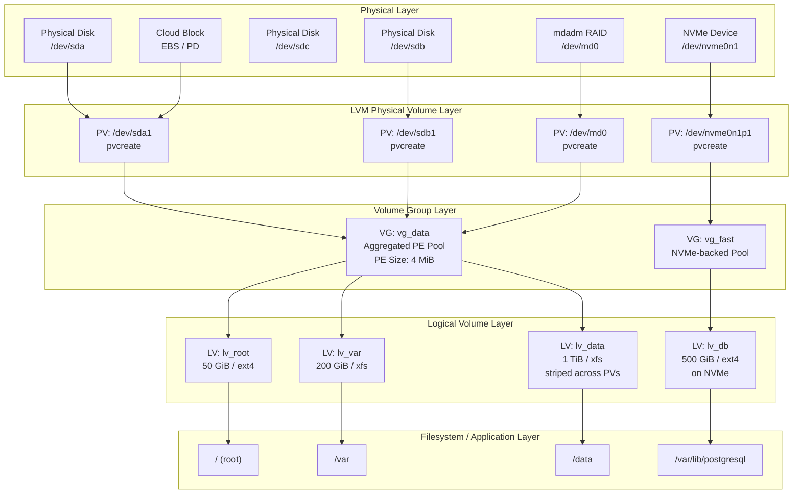
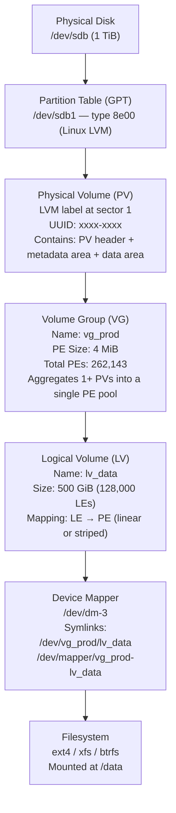
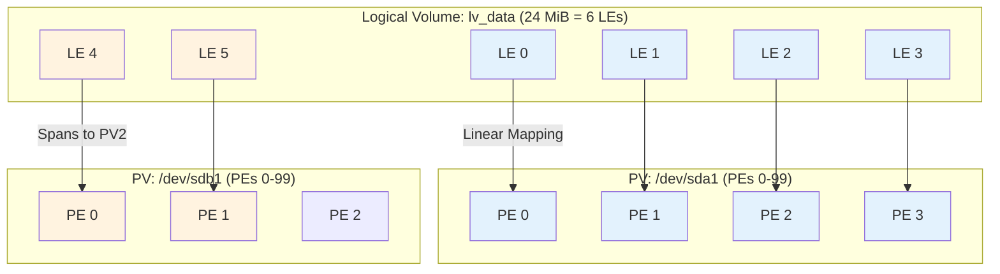
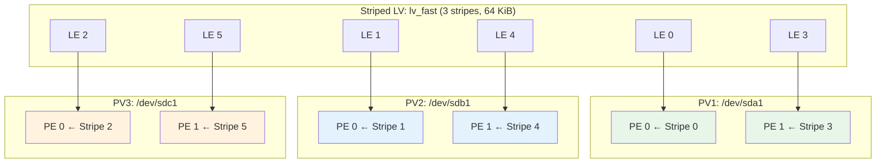
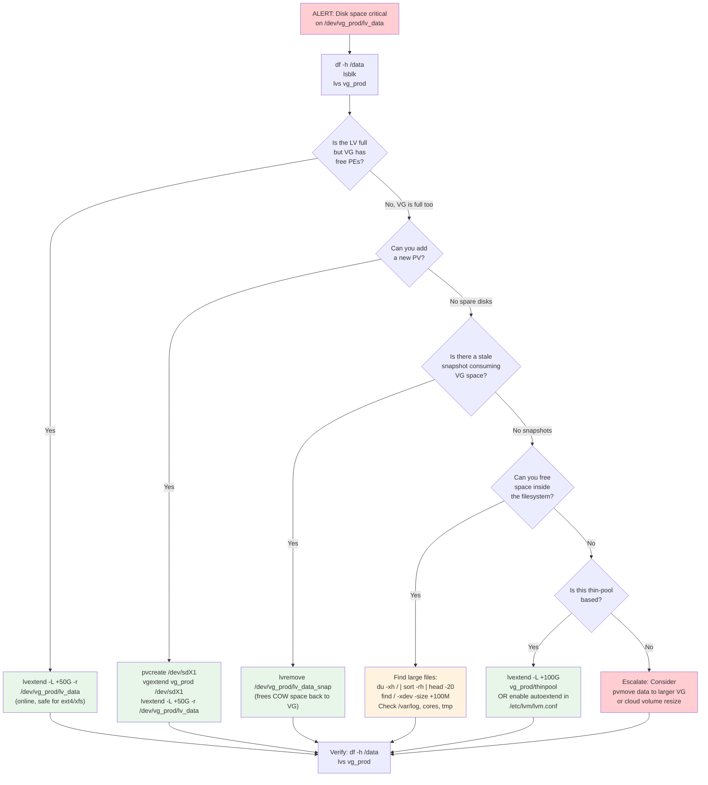
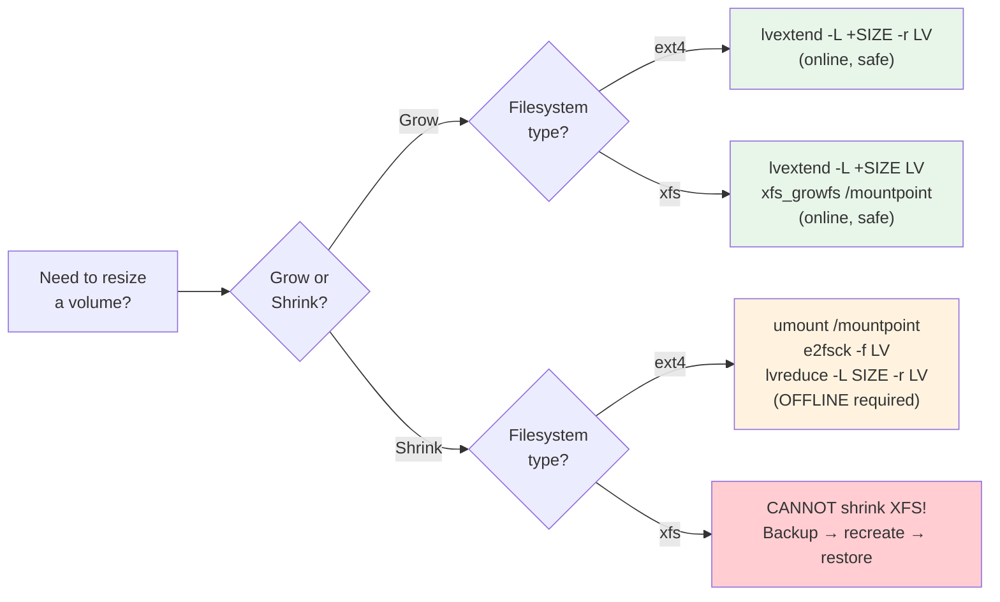

# Topic 05: LVM & Disk Management -- Logical Volumes, RAID, Partitioning, Device Mapper

> **Target Audience:** Senior SRE / Staff+ Cloud Engineers (10+ years experience)
> **Depth Level:** Principal Engineer interview preparation
> **Cross-references:** [Filesystem & Storage](../04-filesystem-and-storage/filesystem-and-storage.md) | [Performance & Debugging](../08-performance-and-debugging/performance-and-debugging.md) | [Kernel Internals](../07-kernel-internals/kernel-internals.md)

---

## 1. Concept (Senior-Level Understanding)

### Why LVM Exists: The Abstraction Problem

Traditional disk partitioning creates a rigid, 1:1 mapping between physical disk regions and mountable block devices. Once you carve `/var` as a 50 GB partition, resizing it requires offline operations, data migration, or rewriting the partition table -- all high-risk on production systems. LVM (Logical Volume Manager) decouples **logical storage allocation** from **physical disk layout**, introducing a layer of indirection that enables runtime flexibility.

The key design principles a senior engineer must internalize:

1. **LVM is a userspace/device-mapper collaboration.** The `lvm2` tools (pvcreate, vgcreate, lvcreate, etc.) are all symlinks to a single binary that constructs device-mapper tables. The kernel knows nothing about "LVM" -- it only sees device-mapper targets (dm-linear, dm-striped, dm-snapshot, dm-thin).
2. **The Physical Extent (PE) is the atomic unit.** All allocation, mapping, and movement happens at PE granularity (default 4 MiB). Understanding PE/LE mapping is essential for debugging pvmove, capacity planning, and snapshot sizing.
3. **LVM does not replace RAID -- it complements it.** LVM provides flexible allocation; RAID provides redundancy. The classic production stack is: Physical Disks -> mdadm RAID -> LVM PV -> VG -> LV -> Filesystem. Mixing concerns (LVM RAID) is possible but has operational trade-offs.
4. **Snapshots are not free.** Classic LVM snapshots (non-thin) consume COW space from the same VG and degrade I/O performance. Thin snapshots improve this significantly but introduce thin pool metadata management complexity.
5. **Cloud block storage is external LVM.** AWS EBS, GCP Persistent Disks, and Azure Managed Disks are logical volumes managed by the hypervisor's storage layer. You still need LVM inside the VM when you want to aggregate multiple cloud volumes or need snapshot/resize capabilities beyond what the cloud API provides.

### LVM Stack Overview



### When to Use LVM (and When Not To)

| Scenario | Use LVM? | Rationale |
|---|---|---|
| Production servers with growing storage needs | **Yes** | Online resize, pvmove for hardware migration |
| Database servers needing predictable I/O | **Sometimes** | LVM adds one device-mapper hop; thin provisioning adds metadata overhead. For extreme IOPS, consider raw partitions or direct filesystem on RAID |
| Ephemeral cloud instances (stateless) | **No** | Root EBS is sufficient; LVM adds complexity for no benefit |
| Multi-disk aggregation without hardware RAID | **Yes** | VG pools multiple PVs; combine with dm-raid or mdadm for redundancy |
| Container hosts (Docker/K8s) | **Yes** | devicemapper or thin pool backend for overlay2 storage driver; LVM thin for PV provisioning |
| ZFS or Btrfs environments | **No** | These filesystems include their own volume management; layering LVM beneath them defeats the purpose |

### Partitioning: GPT vs MBR

Every senior engineer should default to GPT. The comparison matters because legacy systems and recovery scenarios still surface MBR:

| Feature | MBR | GPT |
|---|---|---|
| Max disk size | 2 TiB | 9.4 ZiB (2^64 sectors) |
| Max partitions | 4 primary (or 3 + extended) | 128 (expandable) |
| Partition table location | First 512-byte sector only | Primary + backup at end of disk |
| Boot support | BIOS only | UEFI native; BIOS via protective MBR |
| Integrity | None | CRC32 checksums |
| Partition type IDs | 1-byte codes | 16-byte GUIDs |
| Recovery | Fragile; single copy | Robust; redundant header at disk end |

**Production rule:** Use GPT with a single partition per disk (type `8e00` for LVM) for all data disks. The partition table makes the disk recognizable to any OS and recovery tool, even if LVM metadata is corrupted.

---

## 2. Internal Working (Kernel-Level Deep Dive)

### LVM Layer Stack: From Physical Disk to Filesystem



### Physical Volume (PV) Internals

When you run `pvcreate /dev/sdb1`, LVM writes:

1. **LVM label** (sector 1, 512 bytes): Contains the magic number `LABELONE`, the PV UUID, and a pointer to the metadata area. The label is always at sector 1 (byte offset 512) regardless of sector size -- this is how `pvscan` finds PVs by scanning every block device.
2. **Metadata area** (default: first 1 MiB): Contains the VG metadata in a text-based format (JSON-like). This metadata describes the entire VG structure -- all PVs, LVs, segments, and PE mappings. Every PV in the VG holds a complete copy of the VG metadata, providing redundancy.
3. **Data area**: The remaining disk space, divided into Physical Extents (PEs).

### PE/LE Mapping: How Logical Blocks Become Physical

The fundamental mapping in LVM is between Logical Extents (LEs) in an LV and Physical Extents (PEs) on PVs. Each LE has exactly the same size as a PE (set at VG creation time, default 4 MiB). The mapping strategies determine how data is physically laid out.



**Linear mapping** (default, dm-linear): LEs map sequentially to PEs on one PV, then continue on the next PV. This is how concatenation works -- a 1 TiB LV can span a 600 GiB PV and a 400 GiB PV.

**Striped mapping** (dm-striped): LEs are interleaved across PVs in round-robin fashion. With 3 PVs and 64 KiB stripe size: LE 0 -> PV1, LE 1 -> PV2, LE 2 -> PV3, LE 3 -> PV1, etc. This distributes I/O load for higher throughput.



### Device Mapper: The Engine Beneath LVM

LVM does not implement block device I/O itself. It constructs **device-mapper mapping tables** and passes them to the kernel's device-mapper framework (`dm_mod` module). Each LV becomes a dm device (`/dev/dm-N`) with a table that routes I/O to underlying block devices.

You can inspect the raw mapping table:

```bash
# Show the device-mapper table for an LV
dmsetup table /dev/mapper/vg_prod-lv_data
# Output for linear: 0 1048576 linear /dev/sda1 2048
# Format: start_sector num_sectors target_type target_args

# Output for striped: 0 1048576 striped 3 128 /dev/sda1 2048 /dev/sdb1 2048 /dev/sdc1 2048
# Format: start num striped num_stripes chunk_size dev1 offset1 dev2 offset2 ...
```

Key device-mapper targets used by LVM:

| dm Target | Purpose | LVM Use Case |
|---|---|---|
| `dm-linear` | Maps a contiguous sector range to another device + offset | Default LV mapping; each LV segment is one linear entry |
| `dm-striped` | Round-robin distribution across N devices | `lvcreate -i 3` (3-way stripe) |
| `dm-snapshot` | Copy-on-write snapshots using exception store | Classic `lvcreate -s` snapshots |
| `dm-snapshot-origin` | Tracks the origin device of a snapshot | Paired with dm-snapshot |
| `dm-thin` | Thin provisioning + thin snapshots via shared data pool | `lvcreate --type thin-pool` / `lvcreate -T` |
| `dm-mirror` | 1:1 mirroring across devices | `lvcreate -m 1` (LVM mirror) |
| `dm-raid` | Full RAID 1/4/5/6/10 in device-mapper | `lvcreate --type raid5` |
| `dm-cache` | SSD caching for slow HDD-backed LVs | `lvconvert --type cache` |
| `dm-crypt` | Full disk encryption (LUKS) | Typically layered beneath or above LVM |

### Classic LVM Snapshots vs Thin Snapshots

**Classic snapshots** (dm-snapshot):
- Snapshot is a separate LV with a fixed-size COW exception store
- Every write to the origin copies the old data to the snapshot first (read-modify-write penalty)
- If the COW store fills up, the snapshot is invalidated and becomes useless
- Performance degrades linearly with number of snapshots (each write triggers COW for every snapshot)
- Best used for short-lived backup windows, not long-term versioning

**Thin snapshots** (dm-thin):
- Both origin and snapshots live in a shared thin pool
- Snapshots share data blocks via reference counting in pool metadata
- No fixed COW store; space is allocated from the pool on demand
- Snapshots of snapshots are cheap (flat metadata, not recursive)
- Metadata is stored in a separate metadata LV (2 MiB to 16 GiB)
- Pool can be over-provisioned: total logical size of thin LVs can exceed pool data size
- **Risk:** If the thin pool runs out of space with no autoextend configured, all thin LVs in the pool freeze and I/O errors propagate to applications

### RAID: Levels and Production Trade-offs

| RAID Level | Min Disks | Capacity (N disks) | Fault Tolerance | Read Perf | Write Perf | Write Penalty | Production Use Case |
|---|---|---|---|---|---|---|---|
| **0 (stripe)** | 2 | N | None | N x | N x | 1x | Scratch/temp; never for data you care about |
| **1 (mirror)** | 2 | N/2 | 1 disk | ~N x | 1x | 2x | Boot disks, OS volumes, small critical data |
| **5 (parity)** | 3 | (N-1) | 1 disk | (N-1) x | Moderate | 4x | **Deprecated for large disks (>2 TiB)**; read-heavy workloads on small disks only |
| **6 (dual parity)** | 4 | (N-2) | 2 disks | (N-2) x | Low | 6x | Large arrays where RAID 10 cost is prohibitive |
| **10 (stripe+mirror)** | 4 | N/2 | 1 per mirror pair | N x | N/2 x | 2x | **Default choice for production databases and high-IOPS workloads** |

**Why RAID 5 is dangerous with modern large disks:**

1. **Unrecoverable Read Error (URE) risk during rebuild.** Consumer SATA drives have a URE rate of ~10^14 bits (1 per 12.5 TiB read). Rebuilding a 5-disk RAID 5 array with 10 TiB drives reads ~40 TiB, giving a ~30% probability of hitting a URE, which causes a complete array failure.
2. **Rebuild times are measured in days.** A 10 TiB disk at 200 MB/s sustained takes ~14 hours, during which the array is degraded and a second failure is fatal.
3. **The write hole.** A crash during a write can desynchronize data and parity blocks. The corruption is silent until a disk failure triggers reconstruction from the inconsistent parity. mdadm's write-intent bitmap mitigates this; ZFS RAID-Z eliminates it entirely with variable-width stripes.

**mdadm vs Hardware RAID vs LVM RAID:**

| Feature | mdadm (md) | Hardware RAID | LVM RAID (dm-raid) |
|---|---|---|---|
| Kernel module | `md` | Vendor driver | `dm-raid` (built on md) |
| RAID 5/6 support | Full, mature | Full | Full, but newer code |
| Write-intent bitmap | Yes | N/A (BBU cache) | Yes |
| Hot spare | Yes | Yes | Yes |
| Monitoring | `mdadm --monitor`, `/proc/mdstat` | Vendor tools (MegaCLI, storcli) | `lvs -o+raid_sync_action` |
| Portability | Disks readable on any Linux box | Locked to controller model | Disks readable on any LVM2 system |
| Controller failure risk | None (software) | **Single point of failure** | None (software) |
| Typical production choice | **Yes** -- most common for Linux RAID | Legacy datacenters, vendor lock-in | Growing adoption; convenient if already using LVM |

---

## 3. Commands (Production Recipes)

### Physical Volume Operations

```bash
# Initialize a disk partition as an LVM PV
pvcreate /dev/sdb1
pvcreate /dev/sdc1

# Display PV details
pvdisplay /dev/sdb1            # Verbose single PV
pvs                            # Summary of all PVs
pvs -o+pv_used,pv_free         # Extended columns

# Scan for PVs (useful after adding new disks)
pvscan

# Check PV metadata consistency
pvck /dev/sdb1

# Remove LVM label from a PV (must not be in a VG)
pvremove /dev/sdb1
```

### Volume Group Operations

```bash
# Create a VG from one or more PVs
vgcreate vg_data /dev/sdb1 /dev/sdc1

# Create with specific PE size (default 4 MiB)
vgcreate -s 16M vg_bigpe /dev/sdd1

# Add a PV to an existing VG
vgextend vg_data /dev/sdd1

# Remove a PV from a VG (must be empty -- use pvmove first)
vgreduce vg_data /dev/sdb1

# Display VG details
vgdisplay vg_data
vgs                            # Summary of all VGs
vgs -o+vg_free,vg_free_count   # Free space and free PEs

# Rename a VG
vgrename vg_data vg_prod

# Export/Import VG for moving disks between systems
vgexport vg_data               # Deactivate and mark for export
# (physically move disks)
vgimport vg_data               # Re-register on new system

# Check and repair VG metadata
vgck vg_data
```

### Logical Volume Operations

```bash
# Create a 100 GiB linear LV
lvcreate -L 100G -n lv_data vg_data

# Create an LV using 100% of remaining free space
lvcreate -l 100%FREE -n lv_var vg_data

# Create a striped LV (3 stripes, 256 KiB stripe size)
lvcreate -L 300G -i 3 -I 256 -n lv_fast vg_data

# Create a mirrored LV (1 mirror = 2 copies)
lvcreate -L 50G -m 1 -n lv_critical vg_data

# Create a RAID 5 LV with 4 data stripes
lvcreate --type raid5 -L 400G -i 4 -n lv_raid5 vg_data

# --- Resize Operations (THE MOST IMPORTANT PRODUCTION COMMANDS) ---

# Extend LV + resize filesystem in one step (-r flag)
lvextend -L +50G -r /dev/vg_data/lv_data

# Extend to a specific size
lvextend -L 200G -r /dev/vg_data/lv_data

# Extend using all remaining VG space
lvextend -l +100%FREE -r /dev/vg_data/lv_data

# Reduce LV (DANGEROUS -- must shrink filesystem FIRST if not using -r)
# For ext4 (supports shrink):
lvreduce -L -20G -r /dev/vg_data/lv_data
# For XFS: CANNOT SHRINK. Must backup, recreate smaller LV, restore.

# --- Snapshot Operations ---

# Create a classic snapshot (500 MiB COW store)
lvcreate -s -L 500M -n lv_data_snap /dev/vg_data/lv_data

# Create thin pool and thin volumes
lvcreate --type thin-pool -L 500G -n thinpool vg_data
lvcreate -V 100G --thin -n lv_thin1 vg_data/thinpool

# Create thin snapshot (no size needed -- shares pool)
lvcreate -s -n lv_thin1_snap vg_data/lv_thin1

# --- Data Migration ---

# Move all PEs from one PV to another (online, in background)
pvmove /dev/sdb1 /dev/sdd1

# Move a specific LV's extents
pvmove -n lv_data /dev/sdb1 /dev/sdd1

# Monitor pvmove progress
lvs -a -o+copy_percent

# --- Activation ---

# Activate/deactivate an LV
lvchange -ay /dev/vg_data/lv_data    # Activate
lvchange -an /dev/vg_data/lv_data    # Deactivate

# Display LV details
lvdisplay /dev/vg_data/lv_data
lvs                            # Summary
lvs -a -o+devices,seg_pe_ranges  # Show PE mapping and devices
```

### Partitioning Tools

```bash
# GPT partitioning with gdisk
gdisk /dev/sdb                 # Interactive GPT partitioning
sgdisk -Z /dev/sdb             # Zap all partition tables
sgdisk -n 1:0:0 -t 1:8e00 /dev/sdb   # Single partition, type LVM

# GPT partitioning with parted (scriptable)
parted /dev/sdb mklabel gpt
parted /dev/sdb mkpart primary 0% 100%
parted /dev/sdb set 1 lvm on

# View partition tables
parted -l                      # All disks
fdisk -l /dev/sdb              # Single disk
lsblk -f                      # Tree view with filesystem types
blkid                         # UUIDs and types

# Inform kernel of partition table changes (without reboot)
partprobe /dev/sdb
```

### mdadm RAID Operations

```bash
# Create RAID 10 array (4 disks)
mdadm --create /dev/md/data --level=10 --raid-devices=4 \
    /dev/sd[b-e]1

# Create RAID 6 array with hot spare
mdadm --create /dev/md/archive --level=6 --raid-devices=5 \
    --spare-devices=1 /dev/sd[b-g]1

# Check status
cat /proc/mdstat
mdadm --detail /dev/md/data

# Save configuration
mdadm --detail --scan >> /etc/mdadm/mdadm.conf

# Monitor (daemon mode -- alerts on failure)
mdadm --monitor --mail=oncall@company.com --delay=300 /dev/md/data

# Simulate disk failure (testing)
mdadm --fail /dev/md/data /dev/sdc1
mdadm --remove /dev/md/data /dev/sdc1

# Add replacement disk
mdadm --add /dev/md/data /dev/sdf1

# Watch rebuild progress
watch cat /proc/mdstat

# Scrub (verify parity consistency -- schedule via cron weekly)
echo check > /sys/block/md127/md/sync_action
cat /sys/block/md127/md/mismatch_cnt   # Should be 0 after scrub
```

---

## 4. Debugging (Production Triage)

### Disk Space Emergency Triage Flowchart



### LVM Metadata Corruption Recovery

When LVM metadata becomes corrupted (e.g., from a bad sector in the metadata area, interrupted vgcfgbackup, or a misbehaving storage driver), PVs may appear as "unknown" and LVs will not activate.

**Diagnosis:**

```bash
# Check if PVs are visible
pvs                            # Look for "[unknown]" PV entries
pvscan --cache                 # Force rescan

# Inspect raw PV header
pvck --dump headers /dev/sdb1
pvck --dump metadata /dev/sdb1

# List automatic metadata backups (LVM keeps these!)
ls -la /etc/lvm/backup/        # Per-VG backup (text format)
ls -la /etc/lvm/archive/       # Historical snapshots with timestamps

# Read the backup to understand expected state
cat /etc/lvm/backup/vg_data
```

**Recovery (from automatic backup):**

```bash
# Restore VG metadata from backup
vgcfgrestore -f /etc/lvm/archive/vg_data_00042-xxxx.vg vg_data

# If PV UUID changed or was lost, force restore with correct UUID
vgcfgrestore --force -f /etc/lvm/archive/vg_data_00042-xxxx.vg vg_data

# Reactivate VG and LVs
vgchange -ay vg_data
lvchange -ay /dev/vg_data/lv_data

# Verify filesystem integrity before mounting
fsck -n /dev/vg_data/lv_data
```

### RAID Array Debugging

```bash
# Identify degraded arrays
cat /proc/mdstat                # [UU_] means one disk is down

# Get detailed array state
mdadm --detail /dev/md0         # Look for "State" and "Failed Devices"

# Examine RAID superblock on a component device
mdadm --examine /dev/sdb1

# If array won't assemble automatically
mdadm --assemble --scan --verbose

# Force-assemble with available disks (dangerous -- use as last resort)
mdadm --assemble --force /dev/md0 /dev/sdb1 /dev/sdc1

# Check for bitmap consistency
mdadm --examine /dev/sdb1 | grep -i bitmap
```

### Device Mapper Debugging

```bash
# List all dm devices
dmsetup ls
dmsetup ls --tree              # Show dependency tree

# Show mapping table (how LVs map to physical devices)
dmsetup table                  # All devices
dmsetup table /dev/mapper/vg_prod-lv_data  # Specific LV

# Show device status (useful for snapshots/thin pools)
dmsetup status                 # All devices
dmsetup status /dev/mapper/vg_prod-thinpool  # Thin pool usage

# Show I/O statistics per dm device
dmsetup info -c               # Columns: name, open count, targets, etc.

# Debug: show all dm targets loaded in kernel
dmsetup targets
```

---

## 5. War Stories (Production Incidents)

### Incident 1: LV Resize Gone Wrong -- Shrinking the Volume Before the Filesystem

**Context:** A mid-sized SaaS company. Junior SRE was tasked with reclaiming 200 GiB from a 500 GiB `/data` LV (ext4) to allocate to a new service. They found instructions for `lvreduce` online.

**Symptoms:**
- After running `lvreduce -L 300G /dev/vg_prod/lv_data`, the filesystem immediately went read-only
- All application writes to `/data` started returning I/O errors
- `dmesg` showed: `EXT4-fs error: ext4_find_entry: reading directory lblock 0 of size 1048576 failed`
- Mounting the volume after reboot failed: `mount: wrong fs type, bad option, bad superblock`

**Investigation:**

```bash
# The SRE had run:
lvreduce -L 300G /dev/vg_prod/lv_data   # WRONG ORDER!

# What they should have seen first:
df -h /data                     # Filesystem was still 500 GiB
lvs /dev/vg_prod/lv_data        # LV was now 300 GiB
# The filesystem extended 200 GiB beyond the LV -- those blocks are gone

# Attempted filesystem check
e2fsck -f /dev/vg_prod/lv_data  # Massive errors, orphaned inodes

# Checked if LVM kept the old metadata
ls -la /etc/lvm/archive/        # Found pre-resize metadata backup
```

**Root Cause:** The SRE shrank the LV (the container) without first shrinking the filesystem (the contents). The ext4 filesystem's superblock, block group descriptors, and data blocks that lived in the now-deallocated 200 GiB region were instantly inaccessible. This is equivalent to cutting the bottom off a filing cabinet while the drawers are still full.

**Fix:**
1. Restored the LV to its original size: `lvextend -L 500G /dev/vg_prod/lv_data`
2. Ran `e2fsck -fy /dev/vg_prod/lv_data` to repair the filesystem (recovered ~95% of data; some files in the boundary region were lost to `lost+found`)
3. Restored missing files from backups

**Prevention:**
- Always use `lvreduce -r` (or `lvresize -r`) which calls `resize2fs` automatically before resizing the LV
- For ext4 shrink: `umount` -> `e2fsck -f` -> `resize2fs /dev/vg/lv NEW_SIZE` -> `lvreduce -L NEW_SIZE`
- XFS cannot be shrunk at all. The only option is backup, recreate, restore.
- Add a pre-execution checklist to runbooks: "Is the filesystem smaller than or equal to the target LV size?"
- Never run `lvreduce` without `-r` flag unless you have verified the filesystem has already been resized

---

### Incident 2: RAID 5 Degradation Unnoticed for Months

**Context:** An e-commerce platform running on bare-metal servers. 8-disk RAID 5 arrays (mdadm) holding product catalog and images. No dedicated storage monitoring -- only basic Nagios checks for CPU/memory/disk space.

**Symptoms:**
- A second disk failed in the RAID 5 array at 3 AM on Black Friday
- Array went offline. `/dev/md0` status showed `[UUUUU_U_]` (two failed members)
- All product images became inaccessible; site showed broken images
- Investigation revealed the first disk had failed **4 months earlier** and nobody noticed

**Investigation:**

```bash
# Current state
cat /proc/mdstat
# md0 : active (auto-read-only) raid5 sdb1[0] sdc1[1] sdd1[2](F) sde1[3] sdf1[4] sdg1[5](F) sdh1[6] sdi1[7]
#       5860270080 blocks super 1.2 level 5, 512k chunk, algorithm 2 [8/6] [UU_UU_UU]

mdadm --detail /dev/md0
# State : clean, degraded
# Failed Devices : 2
# Active Devices : 6

# Check historical logs
journalctl -u mdadm --since "4 months ago" | grep -i fail
# Found: "md0: Disk failure on sdd1, disabling device."
# This event was logged but never alerted on

# No hot spare was configured
mdadm --detail /dev/md0 | grep -i spare
# Spare Devices : 0
```

**Root Cause:** RAID 5 tolerates exactly one disk failure. The first failure went unnoticed because `mdadm --monitor` was not configured to send alerts, and there was no integration with the monitoring system. The array ran degraded for 4 months. When the second disk failed, RAID 5 could not reconstruct data -- the array was destroyed.

**Fix:**
1. Emergency: Restored from the most recent backup (2 days old, losing 2 days of catalog updates)
2. Rebuilt with RAID 6 (tolerates 2 disk failures) + 1 hot spare
3. Implemented monitoring integration

**Prevention:**
- **Always monitor RAID arrays.** Configure `mdadm --monitor --mail=oncall@company.com --program=/usr/local/bin/raid-alert.sh` and ensure the daemon starts at boot
- Add `/proc/mdstat` scraping to your monitoring system (Prometheus `node_exporter` exposes `node_md_disks_active` and `node_md_state`)
- Configure hot spares: `mdadm --add-spare /dev/md0 /dev/sdj1`
- Use RAID 6 or RAID 10 instead of RAID 5 for any production data -- RAID 5 on modern large disks is unacceptable due to URE risk during rebuild
- Schedule weekly RAID scrubs via cron: `echo check > /sys/block/md0/md/sync_action`
- Test RAID rebuild procedures annually using simulated failures in staging

---

### Incident 3: LVM Snapshot Filling Up Root VG, Causing System Freeze

**Context:** A fintech company's database server. A DBA created an LVM snapshot of the PostgreSQL data volume before a schema migration, intending to delete it after verifying the migration succeeded. They forgot.

**Symptoms:**
- 3 days after the migration, the server became completely unresponsive -- SSH connections hung, applications timed out
- ILO/IPMI console showed the system was up but all I/O was blocked
- `dmesg` (viewed after hard reboot) showed: `device-mapper: snapshots: Invalidating snapshot because it exceeds the COW device size`
- After reboot, the root filesystem was read-only, `/var/log` was full, and the database refused to start

**Investigation:**

```bash
# After rebooting with snapshot removed at emergency console:
lvs -a
#   LV              VG      Attr       LSize   Pool Origin  Data%
#   lv_root         vg_sys  -wi-ao---- 50.00g
#   lv_pgdata       vg_sys  owi-a-s--- 400.00g
#   lv_pgdata_snap  vg_sys  swi-I-s--- 50.00g       lv_pgdata 100.00  # <-- INVALIDATED, 100% full

vgs
#   VG      #PV #LV #SN Attr   VSize   VFree
#   vg_sys    2   3   1 wz--n- 500.00g  0       # <-- VG completely full

# The snapshot was 50 GiB but the origin had 400 GiB of writes over 3 days
# Every write to lv_pgdata had to COW to the snapshot first
# When COW store filled, the snapshot was invalidated, but the damage was done
```

**Root Cause:** Classic LVM snapshots (non-thin) allocate their COW exception store from the same VG as the origin. The 50 GiB snapshot was far too small for a 400 GiB actively-written database volume. As PostgreSQL performed writes, every modified block required a COW operation that consumed snapshot space. When the snapshot's COW store filled up:
1. The snapshot was invalidated (marked unusable)
2. But the VG was already at 0 bytes free
3. The root LV, also in the same VG, could not allocate any new blocks
4. `/var/log` filled up, systemd journal could not write, logging stopped
5. All processes waiting on I/O to any LV in the VG blocked indefinitely

**Fix:**
1. Hard reboot via IPMI
2. Boot into emergency/rescue mode
3. `lvremove /dev/vg_sys/lv_pgdata_snap` to free the 50 GiB back to VG
4. `fsck -f /dev/vg_sys/lv_root` to repair any filesystem inconsistencies
5. `systemctl start postgresql` -- database recovered via WAL replay

**Prevention:**
- Never place long-lived snapshots in the same VG as critical system volumes
- Monitor snapshot fill percentage: `lvs -o+snap_percent` and alert at 70%
- Set up automatic snapshot deletion at threshold:
  ```bash
  # In cron: delete snapshots > 90% full
  lvs --noheadings -o lv_name,snap_percent --select 'snap_percent>90' | while read lv pct; do
      lvremove -f /dev/vg_sys/$lv
  done
  ```
- **Use thin snapshots instead.** They share a pool and don't have fixed COW store sizes. Configure thin pool autoextend in `/etc/lvm/lvm.conf`:
  ```
  thin_pool_autoextend_threshold = 70
  thin_pool_autoextend_percent = 20
  ```
- Keep root VG and data VG separate so that data snapshots cannot starve the OS

---

### Incident 4 (Composite): LVM + Filesystem Corruption from Interrupted pvmove

**Context:** A media streaming company migrating storage from old SATA SSDs to new NVMe drives. The plan was to use `pvmove` to migrate data online from `/dev/sda1` (old SSD) to `/dev/nvme0n1p1` (new NVMe) without downtime.

**Symptoms:**
- `pvmove` was running for 2 hours at 60% completion when the host experienced an unexpected power loss (UPS battery failure)
- After power restoration, the system booted but the migrating LV showed as `[pvmove0]` with partial segments
- The ext4 filesystem on the LV failed consistency checks with thousands of errors
- Some files had mixed content (first half old data, second half new data from different files)

**Investigation:**

```bash
# After reboot, LVM showed the in-progress pvmove
lvs -a
#   [pvmove0]   vg_data  p-C-a-m---  400.00g    60.23  # pvmove stuck at 60%
#   lv_media    vg_data  -wi-------  400.00g            # LV not active

# Check what pvmove was doing
dmsetup table /dev/mapper/vg_data-pvmove0
# Shows mixed linear segments: some pointing to old PV, some to new PV

# The LV has segments on BOTH devices in an inconsistent state
pvs -o+pv_used
#   /dev/sda1        vg_data  lvm2 a--  400.00g  160.00g   # Still has 240 GiB
#   /dev/nvme0n1p1   vg_data  lvm2 a--  500.00g  260.00g   # Has 240 GiB migrated

# Filesystem check
e2fsck -n /dev/vg_data/lv_media    # Hundreds of errors
```

**Root Cause:** `pvmove` works by creating a temporary mirror. It reads each PE from the source, writes it to the destination, then updates the metadata to point to the new location. If power is lost mid-operation:
- Some PEs are on the old device, some on the new device
- The LVM metadata may reference a mix of old and new locations
- If a PE was being written at the moment of power loss, that PE is corrupted
- The filesystem spans both devices with an inconsistent block map

The known issue with `pvmove` across devices with different logical block sizes (512 vs 4096) can also cause silent corruption, as documented in Red Hat Bug #1817097.

**Fix:**
1. Resume the pvmove: `pvmove` (LVM detects the interrupted operation and resumes). This worked because LVM's pvmove checkpointing preserved the progress.
2. After pvmove completed, ran `e2fsck -fy /dev/vg_data/lv_media` -- recovered most data, some files in `lost+found`
3. Restored corrupted files from backup

**Prevention:**
- Ensure UPS battery health before starting long-running pvmove operations
- For critical data, take a snapshot before pvmove: `lvcreate -s -L 50G -n lv_media_premove /dev/vg_data/lv_media`
- Verify source and target PVs have matching logical block sizes: `blockdev --getbsz /dev/sda1` vs `blockdev --getbsz /dev/nvme0n1p1`
- Consider `dd` + LVM metadata edit for offline migrations where downtime is acceptable -- it is atomic at the block level
- Monitor pvmove progress and have a rollback plan: `pvmove --abort` cancels and reverts to the original device

---

### Incident 5 (Composite): Cloud EBS Volume Detach During Active I/O

**Context:** A SaaS company on AWS. An automation script was cleaning up "orphaned" EBS volumes. Due to a tagging bug, it force-detached an active EBS volume (`vol-abc123`) from a production EC2 instance while the database was performing heavy writes.

**Symptoms:**
- PostgreSQL crashed with `PANIC: could not write to file "pg_wal/...": Input/output error`
- The instance's `dmesg` showed: `blk_update_request: I/O error, dev xvdf, sector 12345678` followed by `Buffer I/O error on dev xvdf`
- The application returned 500 errors for all requests
- The EBS volume appeared as "available" (detached) in the AWS console
- After re-attaching the volume, the ext4 filesystem was heavily corrupted

**Investigation:**

```bash
# On the instance after crash
dmesg | tail -50
# [xxx] blk_update_request: I/O error, dev xvdf, sector ...
# [xxx] Buffer I/O error on dev xvdf, logical block ...
# [xxx] EXT4-fs error (device xvdf1): ext4_journal_check_start: Detected aborted journal

# After re-attaching the EBS volume
lsblk                          # xvdf visible again
e2fsck -n /dev/xvdf1           # Hundreds of errors
# Superblock, group descriptors, and journal are inconsistent

# AWS CloudTrail showed the detach
aws cloudtrail lookup-events --lookup-attributes AttributeKey=ResourceName,AttributeValue=vol-abc123
# Found: DetachVolume event from automation IAM role at timestamp

# The automation script's logic
# IF volume.state == "attached" AND volume.tags["Owner"] == None THEN detach
# BUG: The volume had its "Owner" tag removed during a Terraform apply race condition
```

**Root Cause:** The EBS force-detach operation (`--force` flag) disconnects the volume at the hypervisor level without coordinating with the guest OS. This is equivalent to yanking a SATA cable from a running server. All in-flight I/Os are lost. The filesystem journal, which was mid-transaction, was left in an inconsistent state. PostgreSQL's WAL files were partially written, preventing clean recovery.

**Fix:**
1. Re-attached the EBS volume to the instance
2. Ran `e2fsck -fy /dev/xvdf1` to repair the filesystem
3. Started PostgreSQL in recovery mode -- it replayed WAL from the last consistent checkpoint
4. Lost approximately 30 seconds of transactions (data between the last WAL flush and the detach)
5. Reconciled lost transactions from application-level audit logs

**Prevention:**
- **Never use `--force` detach on volumes attached to running instances** in automation. Use graceful detach which fails if the volume is mounted.
- Tag volumes with `do-not-detach=true` for critical data volumes and check this tag in automation scripts
- Implement a "volume protection" policy: use AWS resource-level IAM policies to prevent `ec2:DetachVolume` on tagged volumes
- Use EBS Multi-Attach (for io1/io2 volumes) with shared-nothing database designs to reduce single-volume dependency
- Filesystem-level protection: mount with `errors=remount-ro` (ext4) so the OS remounts read-only on I/O errors instead of continuing to write inconsistent data
- Use PostgreSQL synchronous WAL commit (`synchronous_commit = on`) and EBS io2 Block Express for guaranteed durability

---

## 6. Interview Questions

> See also the dedicated file: [05-lvm.md](../interview-questions/05-lvm.md) for the complete set with detailed answers.

**Quick reference of topics covered:**
1. LVM architecture and PE/LE mapping
2. Online LV extension procedure
3. Classic vs thin snapshots
4. RAID level selection for production
5. Device mapper role in LVM
6. pvmove internals and risks
7. GPT vs MBR for server environments
8. LVM metadata backup and recovery
9. Thin pool overprovisioning risks
10. RAID 5 write hole
11. LVM + RAID stacking order
12. Handling "VG full" emergencies
13. Cloud block storage vs local LVM
14. RAID rebuild time estimation
15. LVM in containerized environments

---

## 7. Common Pitfalls

### Pitfall 1: Mixing System and Data in the Same VG

Placing the root LV (`/`), swap, `/var`, and application data LVs in a single VG means that any space exhaustion in one area (data growth, snapshot COW overflow, thin pool exhaustion) can starve the operating system. When `/var/log` cannot write, you lose debugging information at the worst possible time. When swap is in the same VG and it fills, the OOM killer starts without any way to log what it killed.

**Rule:** Separate VGs for OS (`vg_sys`) and data (`vg_data`). The OS VG should be on physically separate disks from the data VG when possible.

### Pitfall 2: Forgetting That XFS Cannot Shrink

XFS supports online growth (`xfs_growfs`) but does not support shrinking -- at all. If you create a 500 GiB XFS volume and later need to reclaim space, your only option is to back up the data, destroy the LV, recreate it smaller, and restore. This is a frequent gotcha when engineers accustomed to ext4 (which supports offline shrink via `resize2fs`) encounter XFS.

**Rule:** If you anticipate needing to shrink volumes, use ext4. If you use XFS (RHEL default), start conservatively and grow as needed.

### Pitfall 3: Running pvmove Across Mismatched Block Sizes

Moving PEs from a 512-byte-sector device to a 4096-byte-sector device (common when migrating from SATA to NVMe or to LUKS-encrypted devices) can cause silent filesystem corruption. LVM moves data at PE granularity without awareness of the filesystem's block alignment assumptions.

**Rule:** Always verify block sizes match before pvmove: `blockdev --getbsz /dev/source` vs `blockdev --getbsz /dev/target`. If they differ, use filesystem-level tools (rsync, xfsdump/xfsrestore) instead.

### Pitfall 4: Classic Snapshot COW Performance Penalty

Every write to a snapshotted origin volume triggers a read-old-data + write-to-COW-store + write-new-data sequence. With multiple snapshots, this multiplies. A volume with 3 active classic snapshots has 4x write amplification. This can crater database performance.

**Rule:** Use thin snapshots for anything that needs to live longer than a few minutes. Classic snapshots are acceptable only for brief backup windows (minutes, not hours).

### Pitfall 5: Not Monitoring Thin Pool Usage

Thin provisioning allows overcommitment: thin LVs can claim more space than the pool physically has. When the pool fills, all thin LVs in the pool freeze. Unlike classic LVM where you get ENOSPC, thin pool exhaustion causes I/O hangs that look like a system lockup.

**Rule:** Enable autoextend and monitor aggressively:
```bash
# /etc/lvm/lvm.conf
thin_pool_autoextend_threshold = 70
thin_pool_autoextend_percent = 20
```
Monitor with: `lvs -o+data_percent,metadata_percent --select 'pool_lv!=""'`

### Pitfall 6: RAID Without Monitoring is Worse Than No RAID

RAID creates a false sense of security. An unmonitored RAID 5 array with a silently failed disk is one failure away from total data loss -- and you will not know until the second failure occurs. This is arguably worse than no RAID, because with no RAID you would have noticed the disk failure immediately.

**Rule:** RAID monitoring is not optional. Configure `mdadm --monitor`, integrate with Prometheus/Nagios/PagerDuty, and test the alerting path monthly.

### Pitfall 7: Forgetting partprobe After Partition Table Changes

After modifying a partition table with `fdisk`, `gdisk`, or `parted`, the kernel may still have the old partition table cached. Operations on the "new" partitions will target wrong disk regions. This is especially dangerous with scripted provisioning.

**Rule:** Always run `partprobe /dev/sdX` after partition table changes, and verify with `lsblk` before proceeding.

---

## 8. Pro Tips

### Pro Tip 1: lvextend -r Is Your Best Friend

The `-r` (or `--resizefs`) flag to `lvextend` and `lvreduce` automatically handles filesystem resizing in the correct order. For extensions, it grows the LV first, then the filesystem. For reductions, it shrinks the filesystem first, then the LV. This single flag eliminates the most common LVM disaster (Incident 1).

```bash
# Extend LV AND filesystem in one atomic operation
lvextend -L +50G -r /dev/vg_data/lv_data

# Works for ext4 (online), xfs (online, grow only), and others
# For ext4, it calls resize2fs internally
# For xfs, it calls xfs_growfs internally
```

### Pro Tip 2: Use lvs Format Strings for Monitoring Scripts

```bash
# Custom output format for monitoring integration
lvs --noheadings --nosuffix --units g \
    -o lv_name,vg_name,lv_size,data_percent,snap_percent,copy_percent \
    --select 'lv_attr=~[^-]......... || snap_percent > 0'

# Thin pool monitoring one-liner
lvs -o+data_percent,metadata_percent --select 'seg_type=thin-pool'
```

### Pro Tip 3: Pre-stage VG Free Space Alerts

Rather than waiting for a filesystem to fill, alert on VG free space dropping below thresholds:

```bash
# Prometheus node_exporter textfile collector
vgs --noheadings --nosuffix --units b -o vg_name,vg_free | while read vg free; do
    echo "node_vg_free_bytes{vg=\"$vg\"} $free"
done > /var/lib/prometheus/node-exporter/lvm.prom
```

### Pro Tip 4: Use vgcfgbackup Before Any Destructive Operation

```bash
# Manual metadata backup with descriptive name
vgcfgbackup -f /root/vg_prod_before_migration_$(date +%Y%m%d).vg vg_prod

# LVM automatically saves to /etc/lvm/archive/ on every metadata change
# But having a named manual backup makes incident response faster
```

### Pro Tip 5: RAID Scrub Scheduling

```bash
# Weekly RAID scrub via systemd timer or cron
# Detects silent data corruption (bit rot) and parity inconsistencies
echo check > /sys/block/md0/md/sync_action

# Check results
cat /sys/block/md0/md/mismatch_cnt
# Should be 0. Non-zero means parity/mirror inconsistency detected.

# For automated repair (use with caution -- repairs may choose wrong copy)
echo repair > /sys/block/md0/md/sync_action
```

### Pro Tip 6: Cloud Volume Resize Without Reboot

On AWS EC2, you can expand an EBS volume and extend the filesystem without any downtime:

```bash
# 1. Resize in AWS (API/console)
aws ec2 modify-volume --volume-id vol-abc123 --size 500

# 2. Wait for modification to complete
aws ec2 describe-volumes-modifications --volume-id vol-abc123

# 3. Grow the partition (if partitioned)
growpart /dev/xvdf 1           # Extends partition 1 to fill disk

# 4. Grow the filesystem
resize2fs /dev/xvdf1           # ext4 (online)
xfs_growfs /data               # xfs (online, specify mountpoint)

# If using LVM inside the VM:
pvresize /dev/xvdf1            # Inform LVM of the larger PV
lvextend -l +100%FREE -r /dev/vg_data/lv_data
```

### Pro Tip 7: dmsetup for Emergency Debugging

When LVM tools refuse to cooperate (corrupted metadata, partially active VGs), `dmsetup` lets you interact directly with device-mapper:

```bash
# List all device-mapper devices with their dependencies
dmsetup ls --tree

# Show the actual mapping table (what LVM constructed)
dmsetup table /dev/mapper/vg_prod-lv_data

# Suspend I/O to a device (freeze for consistent snapshot)
dmsetup suspend /dev/mapper/vg_prod-lv_data
dmsetup resume /dev/mapper/vg_prod-lv_data

# Create a manual dm device from known-good mapping (emergency data recovery)
echo "0 $(blockdev --getsz /dev/sdb1) linear /dev/sdb1 0" | dmsetup create emergency_recovery
```

---

## 9. Cheatsheet

> See the dedicated cheatsheet file: [05-lvm.md](../cheatsheets/05-lvm.md)

### Quick Reference: The LVM Resize Decision Matrix



### Command Prefix Quick Guide

| Prefix | Layer | Key Commands |
|---|---|---|
| `pv*` | Physical Volume | `pvcreate`, `pvdisplay`, `pvs`, `pvmove`, `pvresize`, `pvremove`, `pvscan`, `pvck` |
| `vg*` | Volume Group | `vgcreate`, `vgdisplay`, `vgs`, `vgextend`, `vgreduce`, `vgrename`, `vgcfgbackup`, `vgcfgrestore` |
| `lv*` | Logical Volume | `lvcreate`, `lvdisplay`, `lvs`, `lvextend`, `lvreduce`, `lvresize`, `lvrename`, `lvremove`, `lvchange` |
| `dm*` | Device Mapper | `dmsetup ls`, `dmsetup table`, `dmsetup status`, `dmsetup info`, `dmsetup suspend/resume` |
| `mdadm` | Software RAID | `--create`, `--detail`, `--examine`, `--fail`, `--remove`, `--add`, `--assemble`, `--monitor` |
| `*disk`/`*part` | Partitioning | `fdisk`, `gdisk`, `parted`, `partprobe`, `lsblk`, `blkid` |
