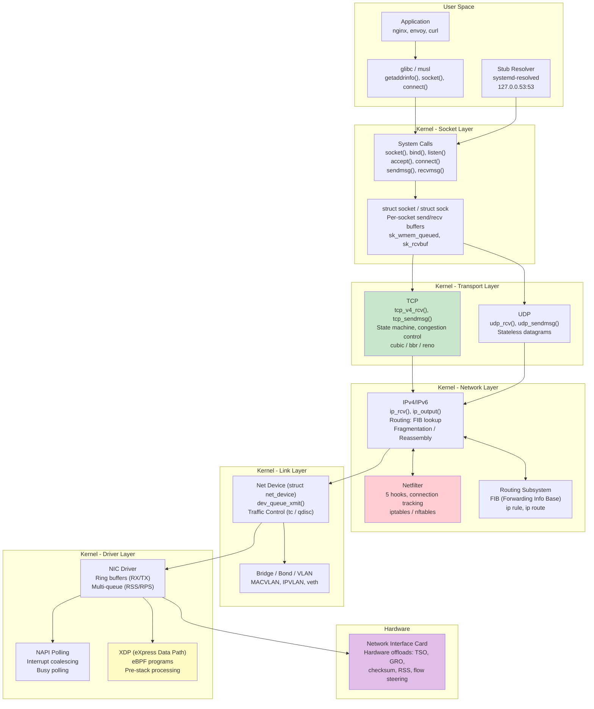
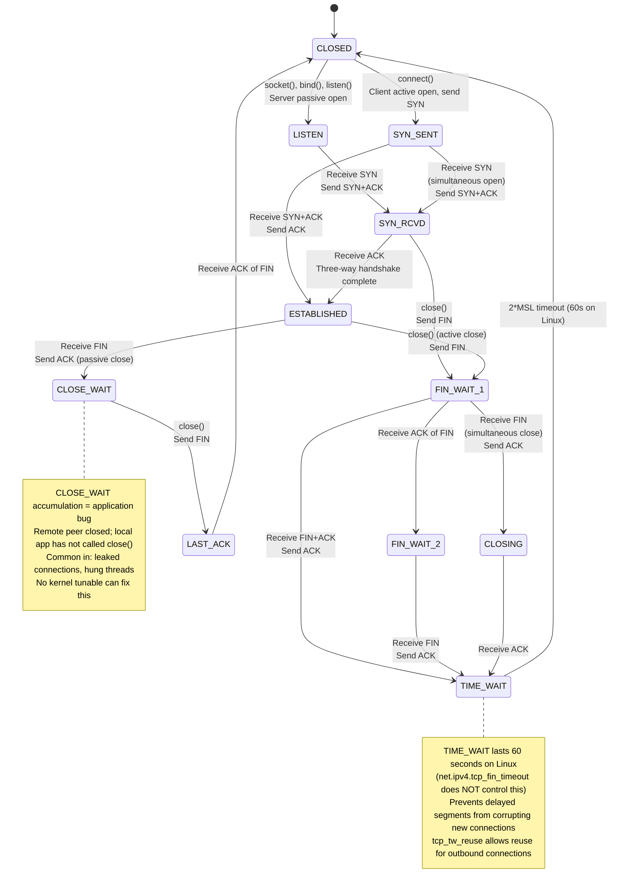
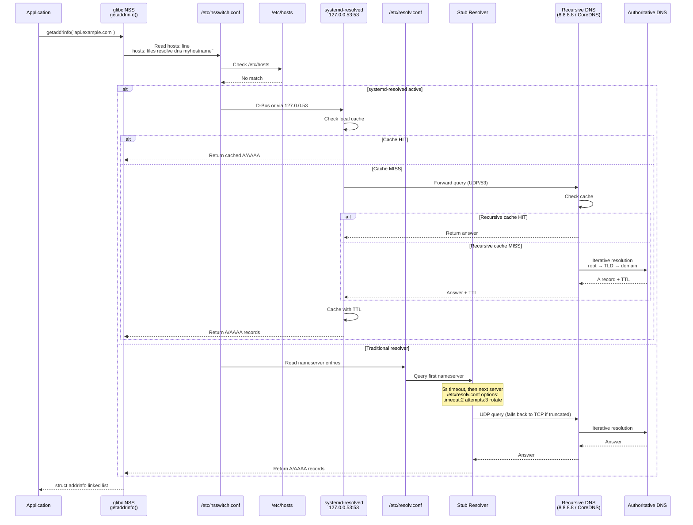
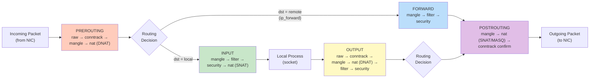
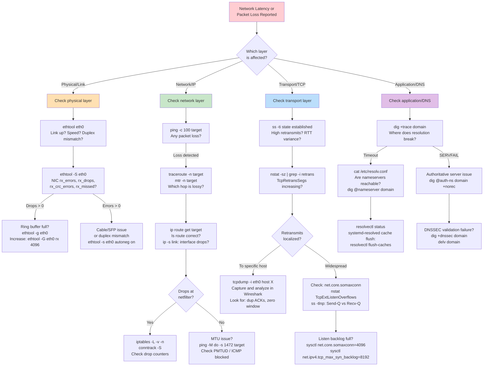

# Topic 06: Networking -- TCP/IP Stack, DNS Resolution, Netfilter, and Packet Path

> **Target Audience:** Senior SRE / Staff+ Cloud Engineers (10+ years experience)
> **Depth Level:** Principal Engineer interview preparation
> **Cross-references:** [Fundamentals](../00-fundamentals/fundamentals.md) | [Kernel Internals](../07-kernel-internals/kernel-internals.md) | [Performance & Debugging](../08-performance-and-debugging/performance-and-debugging.md) | [Security](../09-security/security.md)

---

<!-- toc -->
## Table of Contents

- [1. Concept (Senior-Level Understanding)](#1-concept-senior-level-understanding)
  - [The Linux Networking Stack: Architecture and Design Philosophy](#the-linux-networking-stack-architecture-and-design-philosophy)
  - [Networking Stack Architecture](#networking-stack-architecture)
  - [Protocol Suite: What a Senior Engineer Must Know Cold](#protocol-suite-what-a-senior-engineer-must-know-cold)
- [2. Internal Working (Kernel-Level Deep Dive)](#2-internal-working-kernel-level-deep-dive)
  - [TCP State Machine](#tcp-state-machine)
  - [Packet Path Through the Kernel: Ingress](#packet-path-through-the-kernel-ingress)
  - [DNS Resolution Flow](#dns-resolution-flow)
  - [Netfilter Chain Traversal](#netfilter-chain-traversal)
  - [Network Namespaces, veth Pairs, and Bridge Networking](#network-namespaces-veth-pairs-and-bridge-networking)
- [3. Commands (Production Toolkit)](#3-commands-production-toolkit)
  - [Socket and Connection Analysis](#socket-and-connection-analysis)
  - [IP and Routing](#ip-and-routing)
  - [Packet Capture and Analysis](#packet-capture-and-analysis)
  - [DNS Debugging](#dns-debugging)
  - [Netfilter / Firewall](#netfilter-firewall)
  - [Network Statistics and /proc/net](#network-statistics-and-procnet)
- [4. Debugging (Systematic Methodology)](#4-debugging-systematic-methodology)
  - [Network Latency and Packet Loss Decision Tree](#network-latency-and-packet-loss-decision-tree)
  - [Debugging Cookbook: Common Scenarios](#debugging-cookbook-common-scenarios)
- [5. FAANG-Level Incident Scenarios](#5-faang-level-incident-scenarios)
  - [Incident 1: TIME_WAIT Exhaustion Under Microservices Connection Churn](#incident-1-time_wait-exhaustion-under-microservices-connection-churn)
  - [Incident 2: DNS Resolution Timeout Causing Cascading Service Failures](#incident-2-dns-resolution-timeout-causing-cascading-service-failures)
  - [Incident 3: Conntrack Table Overflow Silently Dropping Packets](#incident-3-conntrack-table-overflow-silently-dropping-packets)
  - [Incident 4: SYN Flood Overwhelming Backlog Queue](#incident-4-syn-flood-overwhelming-backlog-queue)
  - [Incident 5: MTU Mismatch Causing Silent Packet Drops (Path MTU Discovery Failure)](#incident-5-mtu-mismatch-causing-silent-packet-drops-path-mtu-discovery-failure)
- [6. Interview Questions (15+)](#6-interview-questions-15)
  - [Q1: Walk through the complete lifecycle of a TCP connection, including all state transitions. What happens at each stage in the kernel?](#q1-walk-through-the-complete-lifecycle-of-a-tcp-connection-including-all-state-transitions-what-happens-at-each-stage-in-the-kernel)
  - [Q2: Explain the difference between TIME_WAIT and CLOSE_WAIT. Why is CLOSE_WAIT always an application bug?](#q2-explain-the-difference-between-time_wait-and-close_wait-why-is-close_wait-always-an-application-bug)
  - [Q3: How does Linux handle a SYN flood attack? Explain SYN cookies in detail.](#q3-how-does-linux-handle-a-syn-flood-attack-explain-syn-cookies-in-detail)
  - [Q4: Describe the complete DNS resolution path on a modern Linux system, from application call to authoritative server response.](#q4-describe-the-complete-dns-resolution-path-on-a-modern-linux-system-from-application-call-to-authoritative-server-response)
  - [Q5: What is conntrack and why does it matter in production? How do you size and tune it?](#q5-what-is-conntrack-and-why-does-it-matter-in-production-how-do-you-size-and-tune-it)
  - [Q6: What is the difference between iptables and nftables? When would you choose one over the other?](#q6-what-is-the-difference-between-iptables-and-nftables-when-would-you-choose-one-over-the-other)
  - [Q7: How do network namespaces work? How does container networking use them?](#q7-how-do-network-namespaces-work-how-does-container-networking-use-them)
  - [Q8: Explain how TCP congestion control works. Compare cubic, bbr, and reno.](#q8-explain-how-tcp-congestion-control-works-compare-cubic-bbr-and-reno)
  - [Q9: What is Path MTU Discovery and why does it break? How do you diagnose and fix it?](#q9-what-is-path-mtu-discovery-and-why-does-it-break-how-do-you-diagnose-and-fix-it)
  - [Q10: How does the `ss` command differ from `netstat`? What information can `ss` provide that `netstat` cannot?](#q10-how-does-the-ss-command-differ-from-netstat-what-information-can-ss-provide-that-netstat-cannot)
  - [Q11: What happens when a Linux host receives a packet destined for another host? Describe the forwarding path.](#q11-what-happens-when-a-linux-host-receives-a-packet-destined-for-another-host-describe-the-forwarding-path)
  - [Q12: How would you diagnose and fix a situation where `nstat` shows increasing TcpExtListenOverflows?](#q12-how-would-you-diagnose-and-fix-a-situation-where-nstat-shows-increasing-tcpextlistenoverflows)
  - [Q13: Explain the role of ARP in packet delivery. What happens when the ARP cache is stale?](#q13-explain-the-role-of-arp-in-packet-delivery-what-happens-when-the-arp-cache-is-stale)
  - [Q14: What is TCP Fast Open and when would you use it?](#q14-what-is-tcp-fast-open-and-when-would-you-use-it)
  - [Q15: Describe how you would troubleshoot intermittent packet loss between two hosts in a cloud environment.](#q15-describe-how-you-would-troubleshoot-intermittent-packet-loss-between-two-hosts-in-a-cloud-environment)
  - [Q16: What are the key sysctl parameters every production Linux host should tune for networking?](#q16-what-are-the-key-sysctl-parameters-every-production-linux-host-should-tune-for-networking)
- [7. Pitfalls (Common Misunderstandings)](#7-pitfalls-common-misunderstandings)
  - [Pitfall 1: "net.ipv4.tcp_fin_timeout controls TIME_WAIT duration"](#pitfall-1-netipv4tcp_fin_timeout-controls-time_wait-duration)
  - [Pitfall 2: "Setting nf_conntrack_max higher always fixes conntrack drops"](#pitfall-2-setting-nf_conntrack_max-higher-always-fixes-conntrack-drops)
  - [Pitfall 3: "tcp_tw_recycle is the solution for TIME_WAIT exhaustion"](#pitfall-3-tcp_tw_recycle-is-the-solution-for-time_wait-exhaustion)
  - [Pitfall 4: "Blocking ICMP improves security"](#pitfall-4-blocking-icmp-improves-security)
  - [Pitfall 5: "DNS resolution is instant and reliable"](#pitfall-5-dns-resolution-is-instant-and-reliable)
  - [Pitfall 6: "/proc/sys/net/ipv4/ sysctls only affect IPv4"](#pitfall-6-procsysnetipv4-sysctls-only-affect-ipv4)
  - [Pitfall 7: "somaxconn alone determines the listen backlog"](#pitfall-7-somaxconn-alone-determines-the-listen-backlog)
- [8. Pro Tips (Expert Techniques)](#8-pro-tips-expert-techniques)
  - [Tip 1: Use `ss -ti` for per-connection TCP diagnostics](#tip-1-use-ss--ti-for-per-connection-tcp-diagnostics)
  - [Tip 2: Decode /proc/net/tcp when ss is unavailable](#tip-2-decode-procnettcp-when-ss-is-unavailable)
  - [Tip 3: Use `conntrack -E` for real-time flow monitoring](#tip-3-use-conntrack--e-for-real-time-flow-monitoring)
  - [Tip 4: Detect microbursts with ethtool ring buffer stats](#tip-4-detect-microbursts-with-ethtool-ring-buffer-stats)
  - [Tip 5: Use TCP_INFO socket option programmatically](#tip-5-use-tcp_info-socket-option-programmatically)
  - [Tip 6: XDP for extreme-scale packet processing](#tip-6-xdp-for-extreme-scale-packet-processing)
  - [Tip 7: Profile network latency with `perf` and tracing](#tip-7-profile-network-latency-with-perf-and-tracing)
  - [Tip 8: Test conntrack performance before production](#tip-8-test-conntrack-performance-before-production)
- [9. Quick Reference (Cheatsheet)](#9-quick-reference-cheatsheet)
  - [TCP State Quick Reference](#tcp-state-quick-reference)
  - [Critical Sysctl Parameters](#critical-sysctl-parameters)
  - [Key /proc/net Files](#key-procnet-files)
  - [One-Liners for Production Emergencies](#one-liners-for-production-emergencies)

<!-- toc stop -->

## 1. Concept (Senior-Level Understanding)

### The Linux Networking Stack: Architecture and Design Philosophy

The Linux networking stack is a layered, protocol-agnostic subsystem that sits at the core of every modern cloud deployment. Unlike textbook OSI models, the kernel implements a pragmatic four-layer architecture where the boundaries blur for performance -- GRO merges packets across layers, XDP processes frames before they reach the IP stack, and hardware offloads push checksum and segmentation into NICs.

A senior engineer must internalize these design principles:

1. **The socket is the universal abstraction.** Every network operation -- whether HTTP, gRPC, database wire protocol, or raw packet capture -- passes through the `struct socket` / `struct sock` interface. The `socket()` system call creates a file descriptor that unifies network I/O with the VFS layer (`read()`, `write()`, `poll()`, `sendmsg()`).
2. **sk_buff is the packet currency.** The `struct sk_buff` (socket buffer) carries every packet through the entire kernel path -- from NIC driver to socket receive queue. It holds pointers to L2/L3/L4 headers, payload data, metadata (marks, timestamps, conntrack references), and is designed for zero-copy manipulation via pointer adjustments rather than memory copies.
3. **Netfilter is the policy enforcement plane.** Five hooks (PREROUTING, INPUT, FORWARD, OUTPUT, POSTROUTING) are embedded in the packet path. Every packet traverses at least two hooks. Connection tracking (conntrack) maintains stateful flow tables that NAT, firewalling, and load balancing depend on.
4. **Network namespaces provide complete isolation.** Each namespace gets its own routing table, iptables rules, interfaces, /proc/net, and socket space. This is the foundation of container networking -- every Docker container and Kubernetes pod operates in its own network namespace.
5. **Tuning is mandatory at scale.** Default kernel parameters (backlog sizes, buffer depths, connection tracking limits, TIME_WAIT behavior) are configured for modest workloads. Running 100k+ connections per second on a microservices host requires deliberate sysctl tuning.

### Networking Stack Architecture



### Protocol Suite: What a Senior Engineer Must Know Cold

| Protocol | Layer | Key Kernel Function | RFC | Production Relevance |
|---|---|---|---|---|
| **TCP** | Transport | `tcp_v4_rcv()`, `tcp_transmit_skb()` | RFC 793, 7323 | Reliable delivery, flow control, congestion control |
| **UDP** | Transport | `udp_rcv()`, `udp_sendmsg()` | RFC 768 | DNS, QUIC, gaming, telemetry |
| **IP** | Network | `ip_rcv()`, `ip_output()` | RFC 791 | Routing, fragmentation, TTL |
| **ICMP** | Network | `icmp_rcv()` | RFC 792 | Path MTU discovery, ping, traceroute |
| **ARP** | Link | `arp_rcv()`, `arp_process()` | RFC 826 | IP-to-MAC resolution on broadcast networks |
| **TCP (BBR)** | Transport | `tcp_bbr_main()` | n/a (Google) | Model-based congestion control, better on lossy links |

---

## 2. Internal Working (Kernel-Level Deep Dive)

### TCP State Machine

The TCP state machine governs every connection's lifecycle. Understanding each state and transition is essential for diagnosing production issues -- a buildup of CLOSE_WAIT means your application is not calling `close()`, while TIME_WAIT exhaustion means you are churning connections too fast.



**Critical interview points about TCP states:**

- **TIME_WAIT** duration is hardcoded at 60 seconds in the Linux kernel (`TCP_TIMEWAIT_LEN`). The sysctl `net.ipv4.tcp_fin_timeout` controls FIN_WAIT_2 timeout, NOT TIME_WAIT -- this is one of the most common misconceptions.
- **CLOSE_WAIT** means the remote end sent FIN but your application has not called `close()`. This is always an application bug (connection leak, blocked thread). No kernel parameter can fix it.
- **SYN_RECV** (SYN_RCVD) accumulation during SYN floods is mitigated by SYN cookies (`net.ipv4.tcp_syncookies = 1`), which avoid allocating state until the three-way handshake completes.
- **ESTABLISHED** connections are tracked by `inet_hashinfo` using a hash table keyed on (src_ip, src_port, dst_ip, dst_port) -- O(1) lookup.

### Packet Path Through the Kernel: Ingress

The journey of an incoming packet from NIC to application socket:

1. **NIC receives frame** -- DMA writes packet into a pre-allocated ring buffer (`sk_buff`) in host memory. NIC raises hardware interrupt (IRQ).
2. **Top-half IRQ handler** -- Acknowledges the interrupt, schedules NAPI softirq processing. Minimal work done here.
3. **NAPI poll loop** (softirq context) -- `napi_poll()` pulls packets from the ring buffer in batches (budget = 64 by default). Disables further interrupts while polling. GRO (Generic Receive Offload) coalesces related TCP segments.
4. **XDP hook** (optional) -- eBPF programs can DROP, PASS, TX (bounce), or REDIRECT packets before any stack processing. Operates on raw `xdp_buff`.
5. **`netif_receive_skb()`** -- Hands packet to the protocol stack. Passes through traffic control ingress qdisc, packet taps (tcpdump captures here), and bridge/VLAN processing.
6. **`ip_rcv()`** -- Validates IP header (version, checksum, length). Enters Netfilter PREROUTING chain.
7. **Routing decision** (`ip_route_input()`) -- FIB lookup determines: local delivery (INPUT) or forwarding (FORWARD).
8. **Netfilter INPUT chain** -- Firewall rules applied for locally-destined packets.
9. **`ip_local_deliver()`** -- Reassembles fragments if needed. Demuxes to transport protocol handler.
10. **`tcp_v4_rcv()`** -- Looks up socket via `inet_lookup()` using 4-tuple. Validates TCP checksum, sequence numbers. Processes through TCP state machine. Enqueues data to socket receive buffer.
11. **Application `recv()`** -- Wakes blocked process or triggers `epoll` event. Data copied from kernel socket buffer to user-space buffer.

### DNS Resolution Flow

DNS resolution on Linux follows a multi-layered path that senior engineers must understand end-to-end, especially in containerized environments where failures cascade rapidly.



**Key DNS details for production:**

- **`/etc/nsswitch.conf`** controls resolution order. The `hosts:` line typically reads `files dns` (traditional) or `files resolve [!UNAVAIL=return] dns` (systemd-resolved). Kubernetes injects `ndots:5` into `/etc/resolv.conf`, causing queries for `api-service` to attempt five FQDN expansions before trying bare name.
- **`/etc/resolv.conf`** limits to 3 nameservers; each is tried with a 5-second default timeout. The `options rotate` directive load-balances across servers. In containers, this file is often auto-generated by the container runtime.
- **`systemd-resolved`** runs a caching stub resolver at `127.0.0.53`. It supports DNS-over-TLS, per-link DNS configuration, and LLMNR/mDNS. Modern distributions (Ubuntu 18.04+, Fedora 33+) use it by default.
- **Negative caching** stores NXDOMAIN results per the SOA record's minimum TTL. A misconfigured DNS entry can linger as a cached negative result for minutes to hours.
- **DNS in Kubernetes** is particularly fragile: CoreDNS handles cluster DNS, pods query the node's kube-dns service IP, and conntrack race conditions between A and AAAA queries on the same UDP source port are a well-documented source of 5-second DNS timeouts.

### Netfilter Chain Traversal

Every packet traverses a specific path through Netfilter hooks. The path depends on whether the packet is locally generated, locally destined, or being forwarded.



**Netfilter tables and their purpose:**

| Table | Chains | Purpose | Priority |
|---|---|---|---|
| **raw** | PREROUTING, OUTPUT | Bypass connection tracking (`NOTRACK`) | -300 |
| **mangle** | All 5 chains | Packet header modification (TOS, TTL, MARK) | -150 |
| **nat** | PREROUTING, INPUT, OUTPUT, POSTROUTING | SNAT, DNAT, MASQUERADE, REDIRECT | -100 (DNAT), 100 (SNAT) |
| **filter** | INPUT, FORWARD, OUTPUT | Accept/Drop/Reject decisions | 0 |
| **security** | INPUT, FORWARD, OUTPUT | SELinux/AppArmor mandatory access control | 50 |

**Connection tracking (conntrack):**

- Maintains a hash table of all active flows, keyed by (proto, src_ip, src_port, dst_ip, dst_port)
- Default table size: `net.netfilter.nf_conntrack_max` (65536 on many distros; far too low for production)
- Each entry consumes ~300 bytes. 1M entries = ~300 MB RAM.
- States: NEW, ESTABLISHED, RELATED, INVALID, UNTRACKED
- Conntrack is the foundation for stateful firewalling and NAT; without it, `iptables -m state --state ESTABLISHED,RELATED -j ACCEPT` cannot work
- Hash table size: `net.netfilter.nf_conntrack_buckets` (ideally `nf_conntrack_max / 4`)

### Network Namespaces, veth Pairs, and Bridge Networking

Network namespaces are the kernel primitive behind container networking. Each namespace provides complete network stack isolation:

```bash
# Create a namespace and veth pair
ip netns add container1
ip link add veth-host type veth peer name veth-container
ip link set veth-container netns container1

# Configure addresses
ip addr add 10.200.0.1/24 dev veth-host
ip link set veth-host up
ip netns exec container1 ip addr add 10.200.0.2/24 dev veth-container
ip netns exec container1 ip link set veth-container up
ip netns exec container1 ip link set lo up

# Bridge multiple containers
ip link add br0 type bridge
ip link set br0 up
ip link set veth-host master br0
```

**What a namespace isolates:** interfaces, IP addresses, routing tables, iptables rules, `/proc/net/*`, socket bindings, ARP tables, and neighbor entries. The `init_net` (default namespace) is the host namespace. Each Docker container gets `clone(CLONE_NEWNET)` which creates a new namespace.

---

## 3. Commands (Production Toolkit)

### Socket and Connection Analysis

```bash
# ss - modern replacement for netstat, queries kernel via netlink (faster)
ss -tlnp                              # TCP listening sockets with process info
ss -tanp                              # All TCP connections with state and process
ss -s                                 # Summary: total, established, TIME_WAIT, etc.
ss -ti state established              # Detailed TCP info (cwnd, rtt, retrans)
ss -tanp state time-wait | wc -l      # Count TIME_WAIT sockets
ss -tanp state close-wait             # Find CLOSE_WAIT (application bugs)
ss -tnp dst 10.0.0.0/8               # Connections to private ranges
ss -tnp sport = :443                  # All connections to local port 443
ss -tnpi                              # Include internal TCP info (cwnd, rto, rtt)
```

### IP and Routing

```bash
# ip - unified tool for interfaces, addresses, routes, neighbors, namespaces
ip -br addr show                      # Brief interface summary (up/down, addresses)
ip -s link show eth0                  # Interface statistics (RX/TX bytes, errors, drops)
ip route show                         # IPv4 routing table
ip route get 8.8.8.8                  # Which route/interface for a specific destination
ip -6 route show                      # IPv6 routing table
ip neigh show                         # ARP / neighbor cache
ip neigh flush dev eth0               # Flush ARP cache for interface

# Routing table / policy routing
ip rule show                          # Policy routing rules
ip route show table main              # Main routing table
ip route add 10.100.0.0/16 via 10.0.0.1 dev eth0  # Add static route

# Network namespaces
ip netns list                         # List network namespaces
ip netns exec <ns> ip addr show       # Run command in namespace
nsenter --net=/proc/<pid>/ns/net ss -tlnp  # Enter container's net namespace
```

### Packet Capture and Analysis

```bash
# tcpdump - packet capture at the netif layer
tcpdump -i eth0 -nn -c 100           # 100 packets, numeric output
tcpdump -i any port 53                # DNS traffic on all interfaces
tcpdump -i eth0 'tcp[tcpflags] & (tcp-syn) != 0'  # SYN packets only
tcpdump -i eth0 'tcp[tcpflags] & (tcp-rst) != 0'  # RST packets (connection rejects)
tcpdump -i eth0 host 10.0.0.5 -w /tmp/capture.pcap  # Save to file for Wireshark
tcpdump -i eth0 -nn 'tcp port 443 and (tcp[tcpflags] & tcp-syn != 0)' # TLS SYNs
tcpdump -r /tmp/capture.pcap -A      # Read pcap, print ASCII payload
```

### DNS Debugging

```bash
# dig - DNS query tool
dig example.com                       # A record lookup
dig +trace example.com                # Full delegation chain from root
dig @8.8.8.8 example.com A           # Query specific resolver
dig +short example.com AAAA          # IPv6 address, short output
dig -x 8.8.8.8                       # Reverse DNS lookup (PTR record)
dig +norecurse @ns1.example.com example.com  # Non-recursive query (test auth server)

# Resolver debugging
resolvectl status                     # systemd-resolved status and per-link DNS
resolvectl query example.com          # Query via systemd-resolved
getent hosts example.com              # Test full NSS resolution path (what apps see)
getent ahosts example.com             # All addresses (IPv4 + IPv6)
cat /etc/resolv.conf                  # Effective resolver configuration
cat /etc/nsswitch.conf                # Name service switch order
```

### Netfilter / Firewall

```bash
# iptables (legacy) and nft (modern)
iptables -L -v -n --line-numbers      # List all filter rules with counters
iptables -t nat -L -v -n              # NAT table rules
iptables -t raw -L -v -n              # Raw table (conntrack bypass)

nft list ruleset                      # All nftables rules
nft list table inet filter            # Specific table
nft monitor trace                     # Live packet tracing through rules

# Connection tracking
conntrack -L                          # List all tracked connections
conntrack -C                          # Count entries
conntrack -S                          # Per-CPU conntrack stats (shows drops!)
conntrack -E                          # Event-based monitoring (real-time)
conntrack -D -s 10.0.0.5             # Delete entries for a specific source

# Counters and stats
cat /proc/sys/net/netfilter/nf_conntrack_count  # Current conntrack entries
cat /proc/sys/net/netfilter/nf_conntrack_max    # Maximum allowed
```

### Network Statistics and /proc/net

```bash
# nstat - network statistics (better than netstat -s)
nstat -s                              # All statistics (SNMP MIBs)
nstat -sz | grep -i retrans           # TCP retransmissions
nstat -sz | grep -i overflow          # Listen overflow and backlog drops
nstat -sz TcpExtListenOverflows       # Specific counter

# /proc/net files
cat /proc/net/tcp                     # Raw TCP socket table (hex-encoded)
cat /proc/net/tcp6                    # IPv6 TCP sockets
cat /proc/net/udp                     # UDP sockets
cat /proc/net/sockstat                # Socket allocation summary
cat /proc/net/snmp                    # Protocol statistics
cat /proc/net/netstat                 # Extended network statistics
cat /proc/net/nf_conntrack            # Conntrack entries (if loaded)

# ethtool - NIC hardware information and offload status
ethtool eth0                          # Link status, speed, duplex
ethtool -S eth0                       # NIC-level statistics (rx_drops, tx_errors)
ethtool -k eth0                       # Offload features (tso, gro, gso, checksum)
ethtool -g eth0                       # Ring buffer sizes
ethtool -l eth0                       # Number of RX/TX queues
ethtool -c eth0                       # Interrupt coalescing settings
```

---

## 4. Debugging (Systematic Methodology)

### Network Latency and Packet Loss Decision Tree



### Debugging Cookbook: Common Scenarios

**Scenario: High tail latency on TCP connections**
```bash
# Step 1: Check for retransmissions
nstat -sz | grep -E 'Retrans|Lost'
# TcpRetransSegs > 0 indicates packet loss + retransmit

# Step 2: Examine per-connection TCP state
ss -ti dst 10.0.0.5
# Look at: rtt, rttvar, retrans, cwnd, send (throughput)

# Step 3: Check for listen queue overflow
nstat TcpExtListenOverflows TcpExtListenDrops
# Non-zero = backlog full, connections being dropped

# Step 4: Capture and analyze
tcpdump -i eth0 host 10.0.0.5 -w /tmp/slow.pcap -s0
# Open in Wireshark: Analyze → Expert Info → look for retransmissions
```

**Scenario: DNS resolution takes 5+ seconds intermittently (Kubernetes)**
```bash
# This is the classic conntrack race condition
# A and AAAA queries sent simultaneously on same UDP source port

# Step 1: Verify the timeout pattern
time dig +short service.namespace.svc.cluster.local

# Step 2: Check conntrack drops
conntrack -S | grep insert_failed
# insert_failed > 0 confirms conntrack race

# Step 3: Fix options
# Option A: Use TCP for DNS (eliminates conntrack race)
# In /etc/resolv.conf: options use-vc

# Option B: Disable parallel A/AAAA queries
# In /etc/resolv.conf: options single-request-reopen

# Option C: Run a node-local DNS cache (NodeLocal DNSCache)
```

---

## 5. FAANG-Level Incident Scenarios

### Incident 1: TIME_WAIT Exhaustion Under Microservices Connection Churn

**Context:** A microservices platform with 200+ services communicating via HTTP/1.1. Each service makes short-lived connections to downstream services. During a traffic surge (3x baseline), connection establishment begins failing across the cluster.

**Symptoms:**
- `connect()` calls returning `EADDRNOTAVAIL` (errno 99)
- Application logs: "Cannot assign requested address"
- `ss -s` showing 60,000+ sockets in TIME_WAIT state
- Latency spikes as connection pools fail to acquire new connections

**Investigation:**
```bash
# Count TIME_WAIT sockets
ss -tan state time-wait | wc -l
# Result: 62,847

# Check ephemeral port range
sysctl net.ipv4.ip_local_port_range
# Result: 32768  60999  (28,231 ports)

# Outbound connections to a single destination exhaust the range
ss -tan state time-wait dst 10.0.5.20 | wc -l
# Result: 28,100 (nearly all ephemeral ports for this destination)

# Verify tcp_tw_reuse is off
sysctl net.ipv4.tcp_tw_reuse
# Result: 0
```

**Root Cause:** With HTTP/1.1 without connection keepalive (or very short keepalive timeout), each request creates and tears down a TCP connection. The side that initiates close enters TIME_WAIT for 60 seconds. With 28,231 ephemeral ports and 60-second TIME_WAIT, maximum sustained rate to a single destination is ~470 new connections/second. The traffic surge exceeded this.

**Fix (immediate):**
```bash
sysctl -w net.ipv4.tcp_tw_reuse=1      # Reuse TIME_WAIT sockets for outbound
sysctl -w net.ipv4.ip_local_port_range="1024 65535"  # Widen ephemeral port range
```

**Fix (permanent):**
1. Enable HTTP keepalive with connection pooling in all service clients
2. Migrate to HTTP/2 or gRPC (multiplexed connections)
3. Add `net.ipv4.tcp_tw_reuse = 1` and wider port range to sysctl.d config
4. Monitor `TcpExtTWKilled` and `TcpExtTWRecycled` via nstat

**Prevention:** Implement connection pool metrics (pool size, wait time, exhaustion events) in all services. Alert when TIME_WAIT count exceeds 50% of ephemeral port range.

---

### Incident 2: DNS Resolution Timeout Causing Cascading Service Failures

**Context:** A critical payment processing service depends on an internal service-discovery DNS name (`payments-gateway.internal.corp`). The internal DNS infrastructure consists of two recursive resolvers. One fails silently during a routine certificate rotation.

**Symptoms:**
- Payment processing latency jumps from 50ms p99 to 5,200ms p99
- Error rate spikes to 30% with "connection timeout" errors
- Other services begin failing as they timeout waiting for payments
- The cascade spreads to 12 upstream services within 3 minutes

**Investigation:**
```bash
# Step 1: Identify DNS latency
time dig @10.1.0.53 payments-gateway.internal.corp
# Result: 5.003 seconds (timeout to first server, failover to second)

# Step 2: Check resolver health
dig @10.1.0.53 payments-gateway.internal.corp +tcp
# Result: ;; connection timed out; no servers could be reached

dig @10.1.0.54 payments-gateway.internal.corp
# Result: 10ms response, correct IP returned

# Step 3: Inspect resolv.conf
cat /etc/resolv.conf
# nameserver 10.1.0.53    <-- dead resolver listed first
# nameserver 10.1.0.54
# options timeout:5 attempts:2

# Step 4: Check for widespread impact
nstat -sz | grep -i udp
# UdpInErrors: 14,892  (rising)
```

**Root Cause:** The first nameserver (10.1.0.53) became unresponsive during TLS certificate rotation on the resolver daemon. The default glibc resolver timeout is 5 seconds, and all DNS queries hit the dead server first, waiting 5 seconds before trying the backup. Since DNS resolution is in the synchronous request path for payment processing, every request added 5+ seconds of latency.

**Fix (immediate):**
```bash
# Swap nameserver order in resolv.conf
echo -e "nameserver 10.1.0.54\nnameserver 10.1.0.53" > /etc/resolv.conf

# Reduce timeout for faster failover
echo "options timeout:1 attempts:2 rotate" >> /etc/resolv.conf

# Restart affected services to clear cached dead connections
```

**Fix (permanent):**
1. Run `systemd-resolved` or `dnsmasq` as a local caching resolver on every host (query `127.0.0.53` or `127.0.0.1`)
2. In Kubernetes: deploy NodeLocal DNSCache DaemonSet
3. Configure `options timeout:1 attempts:2 rotate` in resolv.conf across the fleet
4. Implement DNS health checks in monitoring (probe each resolver every 10s)
5. Set circuit breakers in application code with DNS resolution timeout of 1-2 seconds

**Prevention:** Never rely on a single path for DNS resolution. Use local caching resolvers. Monitor DNS resolution latency as a first-class SLI. Add synthetic DNS probes to every resolver.

---

### Incident 3: Conntrack Table Overflow Silently Dropping Packets

**Context:** A high-traffic load balancer running Linux with iptables NAT processes 500,000+ active connections during peak hours. After a traffic increase from a new customer onboarding, packet drops begin occurring with no clear error in application logs.

**Symptoms:**
- Intermittent connection failures and timeouts reported by clients
- `dmesg` shows: `nf_conntrack: table full, dropping packet`
- Monitoring shows packet loss at the load balancer but NIC counters are clean
- Application metrics show no errors (packets never reach the application)

**Investigation:**
```bash
# Step 1: Check kernel log
dmesg | grep conntrack
# [timestamp] nf_conntrack: table full, dropping packet.

# Step 2: Check conntrack utilization
cat /proc/sys/net/netfilter/nf_conntrack_count
# 262144
cat /proc/sys/net/netfilter/nf_conntrack_max
# 262144   <-- 100% full!

# Step 3: Check per-CPU drop stats
conntrack -S
# cpu=0   found=847362 invalid=2104 insert=0 insert_failed=0 drop=28471
# cpu=1   found=819204 invalid=1847 insert=0 insert_failed=0 drop=31209
# (drops on every CPU)

# Step 4: Analyze what's consuming entries
conntrack -L | awk '{print $3}' | sort | uniq -c | sort -rn | head
# 189204 tcp
#  61288 udp
#  11652 icmp
```

**Root Cause:** The default `nf_conntrack_max` of 262,144 was exhausted. Every packet traversing iptables NAT rules creates a conntrack entry. UDP entries (DNS, NTP, health checks) with long default timeouts (180 seconds) accumulated alongside the TCP flow entries. When the table filled, the kernel silently dropped NEW connection packets -- existing ESTABLISHED flows continued working, making the issue appear intermittent.

**Fix (immediate):**
```bash
# Increase conntrack table size
sysctl -w net.netfilter.nf_conntrack_max=1048576
sysctl -w net.netfilter.nf_conntrack_buckets=262144  # max/4

# Reduce timeout for UDP (default 180s is excessive)
sysctl -w net.netfilter.nf_conntrack_udp_timeout=30
sysctl -w net.netfilter.nf_conntrack_udp_timeout_stream=120

# Reduce generic timeout
sysctl -w net.netfilter.nf_conntrack_generic_timeout=60
```

**Fix (permanent):**
1. Size conntrack table based on expected peak flows + 50% headroom
2. Add to `/etc/sysctl.d/99-conntrack.conf` and ensure it loads at boot
3. For pure routing/forwarding (no NAT), use `NOTRACK` in raw table to bypass conntrack
4. Consider nftables with `ct state untracked` for stateless flows
5. Monitor `nf_conntrack_count` vs `nf_conntrack_max` continuously

**Prevention:** Alert at 75% conntrack utilization. Include conntrack sizing in capacity planning. Ensure `dmesg` is monitored (many teams miss kernel log messages). Each conntrack entry consumes ~300 bytes; 1M entries = ~300 MB, which is a small price for a load balancer.

---

### Incident 4: SYN Flood Overwhelming Backlog Queue

**Context:** A public-facing API service behind a Linux-based reverse proxy (nginx) starts dropping legitimate client connections during a mixed traffic event -- a legitimate traffic spike combined with a SYN flood attack.

**Symptoms:**
- Legitimate clients receiving connection timeouts (TCP handshake not completing)
- `dmesg`: `TCP: request_sock_TCP: Possible SYN flooding on port 443. Sending cookies.`
- `nstat TcpExtListenOverflows` increasing rapidly
- Connection success rate drops from 99.9% to 72%

**Investigation:**
```bash
# Step 1: Check SYN backlog
nstat -sz | grep -E 'ListenOverflow|ListenDrop|SyncookiesSent|SyncookiesRecv'
# TcpExtListenOverflows     847291
# TcpExtListenDrops         847291
# TcpExtSyncookiesSent      1204871
# TcpExtSyncookiesRecv      389410

# Step 2: Check current backlog settings
sysctl net.ipv4.tcp_max_syn_backlog
# 256  <-- far too low

sysctl net.core.somaxconn
# 128  <-- far too low

# Step 3: Verify SYN cookies are enabled
sysctl net.ipv4.tcp_syncookies
# 1  (enabled, but backlog is still a bottleneck)

# Step 4: Check per-socket backlog
ss -tlnp | grep :443
# LISTEN  0  128  *:443  (Recv-Q 0, Send-Q 128 = backlog limit)

# Step 5: Identify attack traffic
tcpdump -i eth0 'tcp[tcpflags] == tcp-syn' -nn -c 1000 | \
  awk '{print $3}' | cut -d. -f1-4 | sort | uniq -c | sort -rn | head
# Thousands of SYNs from random source IPs (spoofed)
```

**Root Cause:** The SYN backlog queue (`tcp_max_syn_backlog = 256`) and the accept queue (`somaxconn = 128`) were both at default values, appropriate for a desktop but not a production server. During the SYN flood, even with SYN cookies enabled, the listen socket's accept queue overflowed because nginx could not `accept()` connections fast enough to drain the backlog. Legitimate SYN-ACKs were dropped.

**Fix (immediate):**
```bash
sysctl -w net.core.somaxconn=65535
sysctl -w net.ipv4.tcp_max_syn_backlog=65535
sysctl -w net.ipv4.tcp_syncookies=1
sysctl -w net.ipv4.tcp_abort_on_overflow=0  # Don't RST, let client retry

# In nginx.conf: increase backlog
# listen 443 ssl backlog=65535;
# Then: nginx -s reload
```

**Fix (permanent):**
1. Set production baseline sysctls in `/etc/sysctl.d/99-tcp.conf`
2. Configure nginx/envoy listen backlog to match somaxconn
3. Deploy SYN flood mitigation at network edge (hardware firewall, cloud DDoS protection)
4. Implement rate limiting per source IP at the proxy layer
5. Consider XDP-based SYN proxy for extreme scale

**Prevention:** Production servers must always tune `somaxconn` and `tcp_max_syn_backlog` to at least 4096 (ideally 65535 for high-traffic services). Monitor `TcpExtListenOverflows` as a critical SLI. Deploy upstream DDoS mitigation for all public-facing services.

---

### Incident 5: MTU Mismatch Causing Silent Packet Drops (Path MTU Discovery Failure)

**Context:** After migrating a service to a new VXLAN-based overlay network in a Kubernetes cluster, large HTTP responses (API payloads > 1400 bytes) fail intermittently. Small responses work fine. The TCP handshake completes successfully every time.

**Symptoms:**
- Small API responses (<1400 bytes) succeed; large responses hang or timeout
- `curl` to the service hangs after receiving HTTP headers
- TCP handshake completes (SYN cookies / normal 3WHS) but data transfer stalls
- No errors in application logs; the application believes it sent the response

**Investigation:**
```bash
# Step 1: Capture traffic at the sending side
tcpdump -i eth0 host 10.244.1.5 -nn -s 0
# Observe: large packets (1500 bytes) being sent, no corresponding ACKs
# No ICMP "Fragmentation Needed" messages arriving

# Step 2: Check interface MTU
ip link show eth0
# mtu 1500  <-- standard Ethernet

ip link show vxlan0
# mtu 1500  <-- WRONG! VXLAN adds 50-byte overhead, effective payload MTU is 1450

# Step 3: Verify PMTUD is attempting to work
nstat -sz | grep -i pmtu
# TcpExtTCPMTUProbe: 0 (TCP MTU probing not active)

# Step 4: Check if ICMP is being blocked
iptables -L -v -n | grep icmp
# No ICMP rules... but check intermediate firewalls/security groups
# Cloud security groups often block ICMP by default

# Step 5: Test with known MTU
ping -M do -s 1422 10.244.1.5   # 1422 + 28 (IP+ICMP headers) = 1450
# Works
ping -M do -s 1450 10.244.1.5   # 1450 + 28 = 1478
# Hangs -- packet too big, no ICMP response (black hole)
```

**Root Cause:** The VXLAN overlay adds a 50-byte encapsulation header (outer Ethernet 14 + outer IP 20 + outer UDP 8 + VXLAN 8 = 50 bytes). With a physical MTU of 1500, the effective MTU for inner packets is 1450. However, the inner interface (pod's eth0) was configured with MTU 1500. When TCP sent a 1500-byte segment, the encapsulated packet became 1550 bytes, which was silently dropped by intermediate switches that could not forward oversized frames. ICMP "Fragmentation Needed" (Type 3, Code 4) messages were blocked by a cloud security group, breaking Path MTU Discovery.

**Fix (immediate):**
```bash
# Set correct MTU on overlay interface
ip link set vxlan0 mtu 1450

# Enable TCP MTU probing as a safety net
sysctl -w net.ipv4.tcp_mtu_probing=1  # 1 = probe when ICMP black hole detected

# MSS clamping via iptables (belt and suspenders)
iptables -t mangle -A FORWARD -p tcp --tcp-flags SYN,RST SYN \
  -j TCPMSS --clamp-mss-to-pmtu
```

**Fix (permanent):**
1. Set inner MTU = physical MTU - encapsulation overhead (1500 - 50 = 1450 for VXLAN)
2. Enable `net.ipv4.tcp_mtu_probing = 1` across all hosts
3. Allow ICMP Type 3 (Destination Unreachable) in all security groups and firewalls -- never block PMTUD
4. Use MSS clamping on all overlay gateways
5. In Kubernetes: configure CNI plugin with correct MTU (e.g., Calico `mtu: 1450`)

**Prevention:** Always account for encapsulation overhead when configuring MTUs. Audit security groups for ICMP blocking. Include MTU testing (large-packet ping) in post-deployment verification. Enable TCP MTU probing fleet-wide as defense against PMTUD black holes.

---

## 6. Interview Questions (15+)

### Q1: Walk through the complete lifecycle of a TCP connection, including all state transitions. What happens at each stage in the kernel?

1. **CLOSED to SYN_SENT (client):** Application calls `connect()`. Kernel allocates a `struct sock`, selects an ephemeral port from `ip_local_port_range`, constructs a SYN segment with initial sequence number (ISN, randomized for security), and transmits via `tcp_v4_connect()`. Socket enters SYN_SENT state.
2. **LISTEN to SYN_RCVD (server):** Server had previously called `socket()`, `bind()`, `listen()`. Incoming SYN arrives at `tcp_v4_rcv()`, kernel creates a `request_sock` (mini-socket, not a full sock -- saves memory during SYN floods). Sends SYN+ACK. If SYN cookies are active, no state is stored at all.
3. **SYN_SENT to ESTABLISHED (client):** Client receives SYN+ACK, validates sequence numbers, sends ACK, socket moves to ESTABLISHED. Connection is now in the established hash table.
4. **SYN_RCVD to ESTABLISHED (server):** Server receives final ACK. `request_sock` is promoted to a full `struct sock` and placed on the accept queue. Application's `accept()` call returns the new file descriptor.
5. **Data transfer (ESTABLISHED):** `sendmsg()` copies data into socket send buffer (`sk_wmem_queued`). TCP segments sent with Nagle's algorithm, congestion window control (cubic/bbr), and sliding window flow control.
6. **Active close:** Application calls `close()`. Kernel sends FIN, enters FIN_WAIT_1. Receives ACK (FIN_WAIT_2), then receives peer's FIN, sends ACK, enters TIME_WAIT for 60 seconds.
7. **Passive close:** Receives FIN, sends ACK, enters CLOSE_WAIT. Application calls `close()`, kernel sends FIN, enters LAST_ACK. Receives final ACK, connection freed.

---

### Q2: Explain the difference between TIME_WAIT and CLOSE_WAIT. Why is CLOSE_WAIT always an application bug?

- **TIME_WAIT** occurs on the side that initiates the close (active closer). It is a normal, healthy state that lasts 60 seconds on Linux. Its purpose is twofold:
  1. Ensure delayed segments from the old connection do not corrupt a new connection on the same 4-tuple
  2. Provide reliability for the final ACK (if lost, the peer retransmits FIN, and the TIME_WAIT state can re-ACK)
- **CLOSE_WAIT** occurs on the side that receives FIN (passive closer). It means the peer has closed their end, but the local application has not yet called `close()`. This state has no timeout -- it persists until the application acts.
- CLOSE_WAIT is always an application bug because:
  1. No kernel tunable can force the application to close the socket
  2. It typically indicates leaked connections (connection pool bug, exception handler not closing sockets, blocked thread)
  3. Diagnosis: `ss -tanp state close-wait` shows the owning process; examine that process's connection handling code

---

### Q3: How does Linux handle a SYN flood attack? Explain SYN cookies in detail.

1. **Normal SYN handling:** Each incoming SYN creates a `request_sock` on the SYN queue (half-open connection). This consumes memory and a slot in `tcp_max_syn_backlog`.
2. **SYN flood problem:** Attacker sends millions of SYNs from spoofed IPs. SYN queue fills up, legitimate connections cannot be established.
3. **SYN cookies mechanism** (`net.ipv4.tcp_syncookies = 1`):
   - When the SYN queue is full, instead of allocating state, the kernel encodes connection parameters into the ISN of the SYN+ACK
   - The ISN encodes: a timestamp (5 bits), MSS index (3 bits), and a cryptographic hash of (src_ip, src_port, dst_ip, dst_port, timestamp) using a secret key
   - No state is stored for the connection
   - When the client's ACK arrives, the kernel reconstructs the connection parameters from the ACK number (which is ISN+1)
   - The connection is then promoted directly to ESTABLISHED
4. **Limitations of SYN cookies:**
   - TCP options (window scaling, SACK, timestamps) cannot be encoded in the ISN, so features are degraded
   - Newer kernels use TCP Fast Open cookies and improved encoding to mitigate this
5. **Complementary defenses:** Increase `somaxconn` and `tcp_max_syn_backlog`, deploy network-level SYN flood protection, use XDP-based SYN proxies

---

### Q4: Describe the complete DNS resolution path on a modern Linux system, from application call to authoritative server response.

1. **Application calls `getaddrinfo()`** (glibc NSS framework)
2. **NSS reads `/etc/nsswitch.conf`** -- typical `hosts:` line: `files resolve dns`
3. **files:** Checks `/etc/hosts` for static mappings
4. **resolve:** Queries `systemd-resolved` via D-Bus or UDP to `127.0.0.53`
   - `systemd-resolved` checks its local cache (positive and negative entries)
   - On cache miss, it queries upstream recursive resolvers configured per network link
5. **dns (fallback):** Reads `/etc/resolv.conf` for nameserver IPs, queries each in order with 5-second timeout
6. **Recursive resolver** (e.g., 8.8.8.8, CoreDNS) checks its cache
7. **Iterative resolution on cache miss:**
   - Queries root servers (13 anycast addresses, hardcoded as root hints)
   - Root returns NS records for TLD (e.g., `.com`)
   - Queries TLD server, which returns NS for the domain
   - Queries authoritative nameserver, which returns the A/AAAA record
8. **Response flows back** through caches at each layer, stored with the TTL from the authoritative answer
9. **`getaddrinfo()` returns** a linked list of `struct addrinfo` with addresses in order (respects RFC 6724 for address selection)

---

### Q5: What is conntrack and why does it matter in production? How do you size and tune it?

- **What:** Conntrack (connection tracking) is the Netfilter subsystem that tracks the state of every network flow traversing the host. It maintains a hash table mapping each flow's 5-tuple (protocol, src_ip, src_port, dst_ip, dst_port) to a state (NEW, ESTABLISHED, RELATED, INVALID).
- **Why it matters:**
  1. Required for stateful firewall rules (`iptables -m state --state ESTABLISHED,RELATED`)
  2. Required for NAT (SNAT, DNAT, MASQUERADE) -- NAT needs to reverse-translate return packets
  3. Overflow silently drops packets with no application-visible error
- **Sizing:**
  1. `net.netfilter.nf_conntrack_max` -- maximum entries (default often 65536 or 262144)
  2. `net.netfilter.nf_conntrack_buckets` -- hash table buckets (set to `nf_conntrack_max / 4`)
  3. Each entry ~300 bytes; 1M entries = ~300 MB
  4. Rule of thumb: set max to 2x expected peak concurrent flows
- **Tuning timeouts:**
  1. `nf_conntrack_tcp_timeout_established` = 432000 (5 days default; reduce to 3600 for high-churn)
  2. `nf_conntrack_udp_timeout` = 30 (down from default 180)
  3. `nf_conntrack_generic_timeout` = 60
- **Bypassing conntrack:** Use `iptables -t raw -A PREROUTING -j NOTRACK` for flows that do not need stateful tracking (pure forwarding, high-throughput stateless services)

---

### Q6: What is the difference between iptables and nftables? When would you choose one over the other?

- **iptables (legacy):**
  1. Separate binaries per protocol family: `iptables`, `ip6tables`, `arptables`, `ebtables`
  2. Rules compiled and loaded as a single atomic blob via `iptables-restore`
  3. Linear rule evaluation per chain (O(n) per packet in worst case)
  4. Mature, widely documented, extensive community knowledge
  5. On modern kernels, `iptables` commands often translate to nftables under the hood (`iptables-nft`)
- **nftables (modern):**
  1. Single binary (`nft`) handles IPv4, IPv6, ARP, bridge filtering
  2. In-kernel virtual machine executes bytecode (more efficient rule matching)
  3. Native support for sets, maps, concatenated lookups (O(1) matching)
  4. Atomic rule replacement per table
  5. Better syntax with named sets and variables
- **When to choose:**
  1. New deployments on kernel 4.x+: prefer nftables
  2. Kubernetes environments: most CNI plugins still generate iptables rules; migrating requires `iptables-nft` compatibility layer
  3. Extreme rule counts (10k+ rules): nftables with sets dramatically outperforms linear iptables chains

---

### Q7: How do network namespaces work? How does container networking use them?

1. **Kernel mechanism:** `clone(CLONE_NEWNET)` or `unshare(CLONE_NEWNET)` creates a new `struct net` in the kernel. Each namespace has its own:
   - Network interfaces (loopback auto-created)
   - Routing table (`ip route` is per-namespace)
   - iptables/nftables rules
   - `/proc/net/*` files
   - Socket binding space (port 80 in ns1 is independent of port 80 in ns2)
   - ARP/neighbor tables
2. **veth pairs:** Virtual Ethernet pairs connect namespaces. One end lives in the container namespace, the other in the host namespace (or bridge)
3. **Bridge networking (Docker default):**
   - Docker creates `docker0` bridge in host namespace
   - Each container gets a veth pair: one end in container ns, other end attached to `docker0`
   - NAT via iptables MASQUERADE rule on `docker0` provides outbound internet access
4. **Kubernetes networking:**
   - Each pod gets its own network namespace
   - CNI plugins (Calico, Cilium, Flannel) configure the namespace with IP, routes, and inter-pod connectivity
   - Flat network model: every pod can reach every other pod without NAT

---

### Q8: Explain how TCP congestion control works. Compare cubic, bbr, and reno.

- **Core concept:** TCP congestion control prevents the sender from overwhelming the network. The sender maintains a congestion window (`cwnd`) that limits bytes in flight. `cwnd` adjusts based on feedback (ACKs, losses, RTT).
- **Reno (RFC 5681):**
  1. Slow start: cwnd doubles every RTT until `ssthresh`
  2. Congestion avoidance: cwnd increases by 1 MSS per RTT (additive increase)
  3. On loss (3 dup ACKs): cwnd halved (multiplicative decrease), fast retransmit
  4. On timeout: cwnd reset to 1 MSS, slow start
  5. Problem: conservative recovery, single loss dramatically reduces throughput
- **Cubic (Linux default since 2.6.19):**
  1. cwnd growth follows a cubic function of time since last loss
  2. Faster recovery: cwnd approaches pre-loss value quickly, then probes cautiously
  3. Better utilization of high-bandwidth, high-delay links (BDP)
  4. Loss-based: still relies on packet loss as congestion signal
- **BBR (Bottleneck Bandwidth and RTT, Google):**
  1. Model-based: estimates bottleneck bandwidth and minimum RTT
  2. Does not rely on packet loss as primary signal
  3. Paces packets to match estimated bottleneck rate
  4. Significantly better on lossy links (wireless, intercontinental)
  5. Enable: `sysctl net.ipv4.tcp_congestion_control=bbr` (requires kernel 4.9+)
  6. BBRv2 addresses fairness issues with cubic coexistence

---

### Q9: What is Path MTU Discovery and why does it break? How do you diagnose and fix it?

1. **How PMTUD works:**
   - TCP sets the Don't Fragment (DF) bit on all IPv4 packets
   - If a packet exceeds a link's MTU, the router drops it and sends ICMP Type 3, Code 4 ("Fragmentation Needed") with the correct MTU
   - The sender reduces its MSS accordingly
2. **Why it breaks (PMTUD black hole):**
   - Firewalls or security groups block ICMP entirely (including Type 3 Code 4)
   - The sender never learns the correct MTU
   - TCP handshake works (small packets), but data transfer stalls for large payloads
3. **Diagnosis:**
   - `ping -M do -s <size> target` -- probe with DF bit, binary search for maximum working size
   - `tcpdump` on both sides -- look for large packets sent but never ACKed
   - `nstat TcpExtTCPMTUProbe` -- check if kernel probing is active
4. **Fix:**
   - Enable `net.ipv4.tcp_mtu_probing = 1` (TCP probes MTU by reducing segment size when retransmits occur)
   - Apply MSS clamping: `iptables -t mangle -A FORWARD -p tcp --tcp-flags SYN,RST SYN -j TCPMSS --clamp-mss-to-pmtu`
   - Allow ICMP Type 3 in all firewalls
   - Set correct MTU on overlay/tunnel interfaces

---

### Q10: How does the `ss` command differ from `netstat`? What information can `ss` provide that `netstat` cannot?

1. **Architecture:** `ss` queries the kernel via netlink sockets (fast, direct kernel interface). `netstat` reads `/proc/net/tcp` and other proc files (slower, requires text parsing).
2. **Performance:** On a host with 100k connections, `ss` returns in milliseconds; `netstat` can take seconds.
3. **Extended TCP info (`ss -ti`):**
   - `cwnd`: current congestion window (segments)
   - `rtt`: smoothed round-trip time and variance
   - `retrans`: retransmission count per connection
   - `send`: calculated send throughput
   - `mss`: maximum segment size
   - `rcv_space`: receive window size
   - `bytes_sent`, `bytes_received`: per-connection byte counters
4. **State filtering:** `ss state established`, `ss state time-wait`, `ss state close-wait` -- directly filter by TCP state
5. **Socket memory:** `ss -m` shows `skmem:(r<rbuf>,rb<rbuf_alloc>,t<tbuf>,tb<tbuf_alloc>,f<fwd_alloc>,w<wmem_queued>,o<opt_mem>,bl<backlog>)`
6. **Process info:** `ss -p` shows pid and process name (like `netstat -p`)

---

### Q11: What happens when a Linux host receives a packet destined for another host? Describe the forwarding path.

1. **Packet arrives at NIC**, processed through NAPI, enters `ip_rcv()`
2. **Netfilter PREROUTING** chain is traversed (DNAT may alter destination)
3. **Routing decision** (`ip_route_input()`): destination IP is not local, FIB lookup finds a next-hop
4. **Check `ip_forward` sysctl:** If `net.ipv4.ip_forward = 0` (default), packet is silently dropped. Must be `1` for forwarding.
5. **Netfilter FORWARD** chain is traversed (firewall rules for forwarded traffic)
6. **TTL decremented:** If TTL reaches 0, packet dropped and ICMP Time Exceeded sent back
7. **Netfilter POSTROUTING** chain traversed (SNAT/MASQUERADE may alter source)
8. **ARP resolution** for next-hop MAC address (or use cached neighbor entry)
9. **`dev_queue_xmit()`** -- packet enters the TX qdisc, then NIC driver for transmission

---

### Q12: How would you diagnose and fix a situation where `nstat` shows increasing TcpExtListenOverflows?

1. **What it means:** The accept queue (fully established connections waiting for `accept()`) has overflowed. New connections completing the 3WHS are being dropped.
2. **Diagnosis steps:**
   - `ss -tlnp` -- compare Recv-Q (current backlog) with Send-Q (backlog limit)
   - `sysctl net.core.somaxconn` -- kernel-wide max (often 128 default)
   - Check application listen backlog (e.g., nginx `listen 80 backlog=511;`)
   - The effective backlog = `min(application_backlog, somaxconn)`
3. **Common causes:**
   - Application too slow to call `accept()` (thread pool exhausted, GC pause)
   - `somaxconn` too low for traffic volume
   - Sudden traffic spike (flash crowd, thundering herd after failover)
4. **Fix:**
   - `sysctl -w net.core.somaxconn=65535`
   - Increase application backlog to match
   - Profile application: is `accept()` latency high? (thread pool sizing, event loop blocking)

---

### Q13: Explain the role of ARP in packet delivery. What happens when the ARP cache is stale?

1. **ARP maps IP to MAC addresses** on local broadcast networks. When a host needs to send a packet to a local IP, it broadcasts an ARP request ("who has 10.0.0.5?"). The target responds with its MAC address.
2. **ARP cache** (`ip neigh show`) stores mappings. Entries have states: REACHABLE, STALE, DELAY, PROBE, FAILED.
3. **Stale entries:** Kernel marks entries STALE after `base_reachable_time/2` (default ~15-45s). On next use, kernel sends unicast ARP probe (DELAY → PROBE). If no response, entry goes to FAILED.
4. **Production issues:**
   - Floating IPs (VIP failover): ARP cache on other hosts still points to old MAC. Fix: gratuitous ARP (GARP) on failover, or reduce `gc_stale_time`
   - Containers: ARP entries for containers on remote hosts may become stale when pods reschedule
   - `ip neigh flush dev eth0` -- clear cache (forces re-resolution)

---

### Q14: What is TCP Fast Open and when would you use it?

1. **Problem:** Standard TCP requires a full round trip (SYN → SYN+ACK → ACK + data) before sending data. For short-lived HTTP connections, this RTT is significant.
2. **TCP Fast Open (TFO, RFC 7413):**
   - On first connection, server issues a TFO cookie (encrypted token)
   - On subsequent connections, client includes cookie + data in the SYN packet
   - Server validates cookie and can deliver data to the application immediately, saving 1 RTT
3. **Enable:**
   - `sysctl net.ipv4.tcp_fastopen=3` (bit 0 = client, bit 1 = server, 3 = both)
   - Application must use `sendto()` with `MSG_FASTOPEN` flag or `TCP_FASTOPEN` socket option
4. **Use cases:** CDN origin fetches, DNS over TCP, any protocol with predictable initial data
5. **Limitations:** Some middleboxes (firewalls, NAT devices) drop SYN packets with data payload; TFO includes a fallback mechanism

---

### Q15: Describe how you would troubleshoot intermittent packet loss between two hosts in a cloud environment.

1. **Quantify the loss:**
   - `ping -c 1000 -i 0.01 target` -- measure loss rate
   - `mtr -n -c 100 target` -- per-hop loss rates
2. **Check local host:**
   - `ethtool -S eth0` -- NIC-level drops, errors, missed interrupts
   - `ip -s link show eth0` -- kernel interface stats (RX dropped, TX errors)
   - `nstat -sz | grep -i drop` -- protocol-level drops
   - `dmesg | grep -i drop` -- kernel messages (conntrack full, etc.)
3. **Check netfilter:**
   - `iptables -L -v -n` -- any DROP rules matching traffic?
   - `conntrack -S` -- per-CPU drop counters
4. **Check path:**
   - `traceroute -n target` -- identify intermediate hops
   - `tcpdump` on both sender and receiver -- compare packet counts
5. **Check cloud-specific:**
   - Security group rules (are ICMP, specific ports allowed?)
   - Network ACLs (stateless, easy to forget return traffic)
   - Cloud provider bandwidth limits / instance type network performance
   - VPC flow logs for drops
6. **MTU issues:** `ping -M do -s 1472 target` (max for 1500 MTU)
7. **Systematic approach:** Capture at sender, each hop, and receiver. Compare. The hop where packets disappear is the culprit.

---

### Q16: What are the key sysctl parameters every production Linux host should tune for networking?

1. **Connection handling:**
   - `net.core.somaxconn = 65535` -- listen backlog max
   - `net.ipv4.tcp_max_syn_backlog = 65535` -- SYN queue depth
   - `net.ipv4.tcp_syncookies = 1` -- SYN flood protection
2. **Port range and reuse:**
   - `net.ipv4.ip_local_port_range = 1024 65535` -- ephemeral ports
   - `net.ipv4.tcp_tw_reuse = 1` -- reuse TIME_WAIT for outbound connections
3. **Buffer sizes:**
   - `net.core.rmem_max = 16777216` -- max receive buffer
   - `net.core.wmem_max = 16777216` -- max send buffer
   - `net.ipv4.tcp_rmem = 4096 131072 16777216` -- TCP auto-tuning range
   - `net.ipv4.tcp_wmem = 4096 16384 16777216` -- TCP auto-tuning range
4. **Connection tracking:**
   - `net.netfilter.nf_conntrack_max = 1048576` (or higher)
   - `net.netfilter.nf_conntrack_buckets = 262144`
5. **Congestion control:**
   - `net.ipv4.tcp_congestion_control = bbr` (if kernel 4.9+)
   - `net.core.default_qdisc = fq` (required for BBR)
6. **MTU probing:**
   - `net.ipv4.tcp_mtu_probing = 1`

---

## 7. Pitfalls (Common Misunderstandings)

### Pitfall 1: "net.ipv4.tcp_fin_timeout controls TIME_WAIT duration"
**Reality:** `tcp_fin_timeout` controls how long a socket stays in FIN_WAIT_2 state (waiting for the peer's FIN after you sent yours and got an ACK). TIME_WAIT duration is hardcoded at 60 seconds (`TCP_TIMEWAIT_LEN` in the kernel source). There is no sysctl to change TIME_WAIT duration without recompiling the kernel.

### Pitfall 2: "Setting nf_conntrack_max higher always fixes conntrack drops"
**Reality:** Increasing `nf_conntrack_max` without also adjusting `nf_conntrack_buckets` degrades hash table performance. The hash table degenerates to O(n) chains if buckets are too few. Set `buckets = max / 4`. Also review timeouts -- long-lived idle entries may be the real problem.

### Pitfall 3: "tcp_tw_recycle is the solution for TIME_WAIT exhaustion"
**Reality:** `tcp_tw_recycle` was removed in Linux 4.12 because it is incompatible with NAT. When clients share a public IP (common behind corporate NAT or cloud NAT gateways), `tcp_tw_recycle` uses TCP timestamps to distinguish connections. Clients behind NAT have unsynchronized timestamps, causing connections to be silently dropped. Use `tcp_tw_reuse` instead (safe for outbound connections only).

### Pitfall 4: "Blocking ICMP improves security"
**Reality:** Blocking all ICMP breaks Path MTU Discovery (Type 3 Code 4), traceroute (Type 11), and ping (Type 8). PMTUD failures cause TCP connections to hang when transferring large data. The correct approach: allow ICMP Type 3 (destination unreachable) and Type 11 (time exceeded) always; optionally rate-limit Type 8 (echo request).

### Pitfall 5: "DNS resolution is instant and reliable"
**Reality:** Default glibc resolver timeout is 5 seconds per nameserver. With 3 nameservers, a complete failure takes 30 seconds (5s * 3 servers * 2 attempts). In the request path of a low-latency service, this is catastrophic. Always use a local caching resolver, set `options timeout:1 attempts:2 rotate`, and implement application-level DNS caching.

### Pitfall 6: "/proc/sys/net/ipv4/ sysctls only affect IPv4"
**Reality:** Despite the `ipv4` in the path, many of these sysctls affect both IPv4 and IPv6 TCP behavior (e.g., `tcp_tw_reuse`, `tcp_syncookies`, `tcp_congestion_control`). The naming is a historical artifact. Check kernel documentation for each specific parameter.

### Pitfall 7: "somaxconn alone determines the listen backlog"
**Reality:** The effective backlog is `min(application_backlog, somaxconn)`. Setting `somaxconn = 65535` but leaving nginx at `backlog=511` (the default) caps the effective backlog at 511. Both must be tuned.

---

## 8. Pro Tips (Expert Techniques)

### Tip 1: Use `ss -ti` for per-connection TCP diagnostics
```bash
ss -ti dst 10.0.0.5:443
# Shows: cwnd:10 rtt:2.5/0.3 retrans:0/2 bytes_sent:14720 send 47.1Mbps
# cwnd = congestion window (low = congested), rtt = latency, retrans = reliability
```
This gives you per-connection visibility equivalent to a packet capture, without the overhead.

### Tip 2: Decode /proc/net/tcp when ss is unavailable
```bash
# In minimal containers without ss/netstat:
cat /proc/net/tcp
# Fields: local_address:port  remote_address:port  state ...
# Addresses are hex (little-endian on x86), state: 01=ESTABLISHED, 0A=LISTEN, 06=TIME_WAIT
# Decode: printf "%d.%d.%d.%d\n" 0xAC 0x10 0x00 0x01
```

### Tip 3: Use `conntrack -E` for real-time flow monitoring
```bash
conntrack -E -p tcp --dport 3306
# Real-time events: [NEW] [UPDATE] [DESTROY] for MySQL connections
# Shows state transitions, timeout changes, NAT translations
```

### Tip 4: Detect microbursts with ethtool ring buffer stats
```bash
# NIC rx_missed_errors indicates ring buffer overflow from traffic bursts
ethtool -S eth0 | grep -E 'miss|drop|pause'
# Increase ring buffers: ethtool -G eth0 rx 4096
# Enable interrupt coalescing: ethtool -C eth0 rx-usecs 50
```

### Tip 5: Use TCP_INFO socket option programmatically
```python
import socket, struct
# Applications can query per-connection TCP stats at runtime:
# getsockopt(SOL_TCP, TCP_INFO) returns struct tcp_info
# Fields: tcpi_rtt, tcpi_rttvar, tcpi_snd_cwnd, tcpi_retrans, tcpi_lost
# Use for application-level circuit breakers and health checks
```

### Tip 6: XDP for extreme-scale packet processing
```bash
# XDP programs run before sk_buff allocation, at NIC driver level
# Use cases: DDoS mitigation, load balancing, telemetry at 10M+ pps
# Modes: XDP_NATIVE (driver), XDP_GENERIC (any NIC, slower), XDP_OFFLOAD (NIC hardware)
# Load: ip link set dev eth0 xdp obj prog.o sec xdp
```

### Tip 7: Profile network latency with `perf` and tracing
```bash
# Trace TCP retransmissions with kernel tracepoint
perf trace -e 'tcp:tcp_retransmit_skb' -a
# Or with bpftrace:
bpftrace -e 'tracepoint:tcp:tcp_retransmit_skb { printf("%s:%d -> %s:%d\n", ntop($4), $5, ntop($6), $7); }'
```

### Tip 8: Test conntrack performance before production
```bash
# Populate conntrack table to test performance under load
# Use conntrack -I to inject synthetic entries
# Or: hping3 --flood -S -p 80 target  (in test environments only)
# Monitor: conntrack -S (watch drop counter), /proc/net/stat/nf_conntrack
```

---

## 9. Quick Reference (Cheatsheet)

### TCP State Quick Reference

| State | Meaning | Normal? | Action if Accumulating |
|---|---|---|---|
| LISTEN | Waiting for connections | Yes | Expected on servers |
| SYN_SENT | Client sent SYN, awaiting SYN+ACK | Transient | Check connectivity to server |
| SYN_RECV | Server received SYN, sent SYN+ACK | Transient | SYN flood if large number |
| ESTABLISHED | Connection active | Yes | Expected |
| FIN_WAIT_1 | Sent FIN, awaiting ACK | Transient | Peer not responding |
| FIN_WAIT_2 | FIN ACKed, awaiting peer's FIN | Transient | Peer not closing (timeout: `tcp_fin_timeout`) |
| TIME_WAIT | Active closer, 60s cooldown | Normal | Tune: `tcp_tw_reuse`, widen port range |
| CLOSE_WAIT | Received FIN, app not closed | **Bug** | Application connection leak |
| LAST_ACK | Sent FIN, awaiting final ACK | Transient | Peer not ACKing |
| CLOSING | Simultaneous close | Rare | Normal for simultaneous close |

### Critical Sysctl Parameters

| Parameter | Default | Production Value | Purpose |
|---|---|---|---|
| `net.core.somaxconn` | 128 | 65535 | Max listen backlog |
| `net.ipv4.tcp_max_syn_backlog` | 128-1024 | 65535 | SYN queue depth |
| `net.ipv4.tcp_syncookies` | 1 | 1 | SYN flood protection |
| `net.ipv4.tcp_tw_reuse` | 0 | 1 | Reuse TIME_WAIT (outbound) |
| `net.ipv4.ip_local_port_range` | 32768 60999 | 1024 65535 | Ephemeral ports |
| `net.ipv4.tcp_fin_timeout` | 60 | 15-30 | FIN_WAIT_2 timeout |
| `net.ipv4.tcp_mtu_probing` | 0 | 1 | PMTUD black hole detection |
| `net.ipv4.tcp_congestion_control` | cubic | bbr | Congestion control algorithm |
| `net.core.default_qdisc` | pfifo_fast | fq | Queueing discipline (BBR needs fq) |
| `net.core.rmem_max` | 212992 | 16777216 | Max socket receive buffer |
| `net.core.wmem_max` | 212992 | 16777216 | Max socket send buffer |
| `net.netfilter.nf_conntrack_max` | 65536 | 1048576+ | Conntrack table size |
| `net.ipv4.tcp_fastopen` | 0 | 3 | TCP Fast Open (client+server) |

### Key /proc/net Files

| File | Content |
|---|---|
| `/proc/net/tcp` | All TCP sockets (hex encoded: addresses, state, timers) |
| `/proc/net/tcp6` | IPv6 TCP sockets |
| `/proc/net/udp` | UDP sockets |
| `/proc/net/sockstat` | Socket allocation counts per protocol |
| `/proc/net/snmp` | SNMP MIB counters (IP, TCP, UDP, ICMP) |
| `/proc/net/netstat` | Extended TCP statistics (retransmits, SACK, ECN) |
| `/proc/net/nf_conntrack` | Active conntrack entries |
| `/proc/net/stat/nf_conntrack` | Per-CPU conntrack statistics |
| `/proc/sys/net/netfilter/nf_conntrack_count` | Current conntrack entries |
| `/proc/sys/net/netfilter/nf_conntrack_max` | Maximum conntrack entries |

### One-Liners for Production Emergencies

```bash
# Count connections by state
ss -tan | awk '{print $1}' | sort | uniq -c | sort -rn

# Top 10 IPs by connection count
ss -tan | awk '{print $5}' | cut -d: -f1 | sort | uniq -c | sort -rn | head -10

# Watch for conntrack table pressure
watch -n1 'echo "$(cat /proc/sys/net/netfilter/nf_conntrack_count) / $(cat /proc/sys/net/netfilter/nf_conntrack_max)"'

# Find processes with most connections
ss -tanp | grep -oP 'pid=\d+' | sort | uniq -c | sort -rn | head

# Check for listen backlog overflow (non-zero = dropping connections)
nstat TcpExtListenOverflows TcpExtListenDrops

# Trace DNS queries in real time
tcpdump -i any port 53 -nn -l

# Quick network namespace inspection (for containers)
nsenter --net=/proc/$(docker inspect -f '{{.State.Pid}}' CONTAINER)/ns/net ss -tlnp
```
