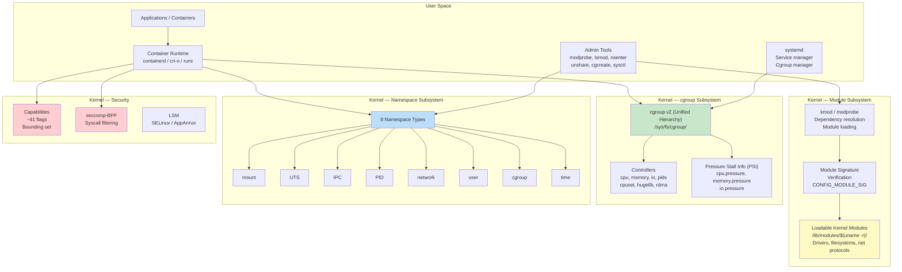
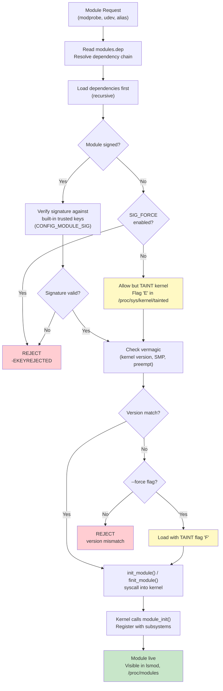
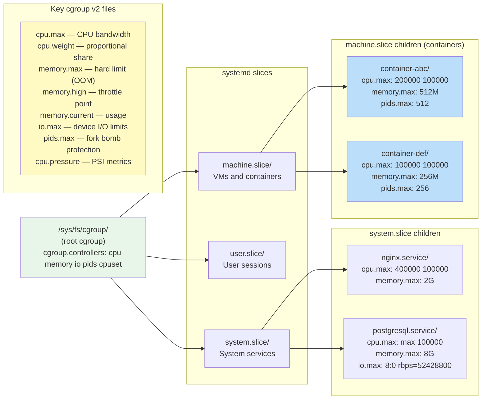
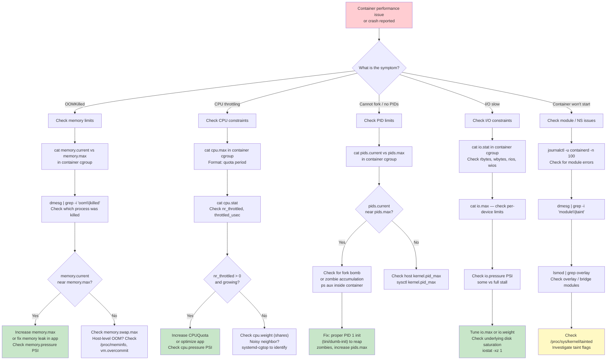

# Topic 07: Kernel Internals -- Modules, cgroups, and Namespaces

> **Target Audience:** Senior SRE / Staff+ Cloud Engineers (10+ years experience)
> **Depth Level:** Principal Engineer interview preparation
> **Cross-references:** [Process Management](../01-process-management/process-management.md) | [Memory Management](../03-memory-management/memory-management.md) | [Performance & Debugging](../08-performance-and-debugging/performance-and-debugging.md) | [Security](../09-security/security.md)

---

<!-- toc -->
## Table of Contents

- [1. Concept (Senior-Level Understanding)](#1-concept-senior-level-understanding)
  - [Kernel Extensibility and Containerization Building Blocks](#kernel-extensibility-and-containerization-building-blocks)
  - [Kernel Internals Architecture Overview](#kernel-internals-architecture-overview)
- [2. Internal Working (Kernel-Level Deep Dive)](#2-internal-working-kernel-level-deep-dive)
  - [2.1 Kernel Module Loading Path](#21-kernel-module-loading-path)
  - [2.2 cgroups v2 Unified Hierarchy](#22-cgroups-v2-unified-hierarchy)
  - [2.3 Namespace Isolation Layers](#23-namespace-isolation-layers)
  - [2.4 How Containers Compose Kernel Primitives](#24-how-containers-compose-kernel-primitives)
- [3. Commands (Production Reference)](#3-commands-production-reference)
  - [Kernel Module Management](#kernel-module-management)
  - [Kernel Tuning with sysctl](#kernel-tuning-with-sysctl)
  - [cgroup v2 Management](#cgroup-v2-management)
  - [Namespace Operations](#namespace-operations)
- [4. Debugging (Production Scenarios)](#4-debugging-production-scenarios)
  - [Container Resource Issue Debugging Tree](#container-resource-issue-debugging-tree)
  - [Debugging Checklists](#debugging-checklists)
- [5. Real-World Incidents](#5-real-world-incidents)
  - [Incident 1: Kernel Module Taint Causes Vendor Support Rejection](#incident-1-kernel-module-taint-causes-vendor-support-rejection)
  - [Incident 2: cgroup OOM Kill Cascade in Kubernetes](#incident-2-cgroup-oom-kill-cascade-in-kubernetes)
  - [Incident 3: PID Namespace Exhaustion from Zombie Accumulation](#incident-3-pid-namespace-exhaustion-from-zombie-accumulation)
  - [Incident 4: cgroups v1-to-v2 Migration Breaks Production Monitoring](#incident-4-cgroups-v1-to-v2-migration-breaks-production-monitoring)
  - [Incident 5: Kernel Panic from Unsigned Third-Party GPU Module](#incident-5-kernel-panic-from-unsigned-third-party-gpu-module)
- [6. Interview Questions (15+ Senior/Staff Level)](#6-interview-questions-15-seniorstaff-level)
  - [Q1: Explain the difference between insmod and modprobe. Why should you never use insmod in production?](#q1-explain-the-difference-between-insmod-and-modprobe-why-should-you-never-use-insmod-in-production)
  - [Q2: What does it mean for the kernel to be "tainted"? How do you decode the taint flags?](#q2-what-does-it-mean-for-the-kernel-to-be-tainted-how-do-you-decode-the-taint-flags)
  - [Q3: Explain cgroups v2 unified hierarchy. How does it differ from v1, and why does it matter for Kubernetes?](#q3-explain-cgroups-v2-unified-hierarchy-how-does-it-differ-from-v1-and-why-does-it-matter-for-kubernetes)
  - [Q4: How would you set a CPU limit of exactly 2.5 cores for a process using cgroups v2?](#q4-how-would-you-set-a-cpu-limit-of-exactly-25-cores-for-a-process-using-cgroups-v2)
  - [Q5: List all 8 Linux namespace types and explain a production scenario for each.](#q5-list-all-8-linux-namespace-types-and-explain-a-production-scenario-for-each)
  - [Q6: What happens at the kernel level when a container is OOM-killed? Walk through the entire chain.](#q6-what-happens-at-the-kernel-level-when-a-container-is-oom-killed-walk-through-the-entire-chain)
  - [Q7: How do you enter a running container's namespaces without using `docker exec`?](#q7-how-do-you-enter-a-running-containers-namespaces-without-using-docker-exec)
  - [Q8: Explain the "no internal processes" rule in cgroups v2.](#q8-explain-the-no-internal-processes-rule-in-cgroups-v2)
  - [Q9: What is seccomp-BPF and how does Docker use it?](#q9-what-is-seccomp-bpf-and-how-does-docker-use-it)
  - [Q10: How would you debug a container that cannot reach the network?](#q10-how-would-you-debug-a-container-that-cannot-reach-the-network)
  - [Q11: What are Linux capabilities and why are they critical for container security?](#q11-what-are-linux-capabilities-and-why-are-they-critical-for-container-security)
  - [Q12: Explain how cgroup PSI (Pressure Stall Information) works and how you would use it for container autoscaling.](#q12-explain-how-cgroup-psi-pressure-stall-information-works-and-how-you-would-use-it-for-container-autoscaling)
  - [Q13: A developer wants to run Docker inside a Docker container. What are the kernel-level implications?](#q13-a-developer-wants-to-run-docker-inside-a-docker-container-what-are-the-kernel-level-implications)
  - [Q14: How does the cgroup `memory.high` setting differ from `memory.max`, and when would you use each?](#q14-how-does-the-cgroup-memoryhigh-setting-differ-from-memorymax-and-when-would-you-use-each)
  - [Q15: Describe how user namespaces enable rootless containers and their security implications.](#q15-describe-how-user-namespaces-enable-rootless-containers-and-their-security-implications)
  - [Q16: Walk through what happens when you run `unshare --pid --fork --mount-proc bash`.](#q16-walk-through-what-happens-when-you-run-unshare---pid---fork---mount-proc-bash)
- [7. Common Pitfalls](#7-common-pitfalls)
- [8. Pro Tips (Staff+ Level)](#8-pro-tips-staff-level)
- [9. Quick Reference / Cheatsheet](#9-quick-reference-cheatsheet)
  - [Module Management One-Liners](#module-management-one-liners)
  - [cgroup v2 Key Files](#cgroup-v2-key-files)
  - [Namespace Quick Reference](#namespace-quick-reference)
  - [Critical sysctls for Containers](#critical-sysctls-for-containers)
  - [Emergency Playbook](#emergency-playbook)

<!-- toc stop -->

## 1. Concept (Senior-Level Understanding)

### Kernel Extensibility and Containerization Building Blocks

The Linux kernel is a monolithic kernel with modular extensibility. Three subsystems form the backbone of modern containerized infrastructure: **Loadable Kernel Modules (LKMs)** extend kernel functionality at runtime without recompilation, **control groups (cgroups)** enforce resource limits and accounting, and **namespaces** provide process-level isolation of kernel resources. Together, cgroups and namespaces are the twin pillars that make containers possible -- Docker, containerd, Podman, and every OCI-compliant runtime are ultimately wrappers around these kernel primitives.

A senior engineer must internalize these design principles:

1. **Modules are the kernel's plugin system.** Device drivers, filesystems, network protocols, and security modules (SELinux, AppArmor) are all loadable modules. The kernel's module infrastructure handles dependency resolution, symbol versioning (`vermagic`), and optional cryptographic signature verification. An unsigned or version-mismatched module taints the kernel, which is a critical signal in production root cause analysis.

2. **cgroups are the resource control plane.** Every process on a modern Linux system belongs to a cgroup hierarchy. systemd is itself a cgroup manager -- each service, slice, and scope gets its own cgroup subtree. In container orchestration (Kubernetes, ECS, Nomad), cgroups enforce CPU shares/quotas, memory limits (with OOM kill semantics), I/O bandwidth throttling, and PID limits. cgroups v2 (unified hierarchy) is now the production standard; v1 (per-controller hierarchies) is in maintenance mode.

3. **Namespaces are the isolation boundary.** Eight namespace types (mount, UTS, IPC, PID, network, user, cgroup, time) each virtualize a specific kernel resource. A container is nothing more than a process running within a set of namespaces with cgroup constraints and filtered syscalls (seccomp). Understanding this demystifies container "magic" and is essential for debugging container escapes, network issues, and resource contention.

4. **Capabilities and seccomp complete the sandbox.** Linux capabilities decompose root privilege into ~41 granular flags (CAP_NET_ADMIN, CAP_SYS_PTRACE, CAP_DAC_OVERRIDE, etc.). Seccomp-BPF restricts which system calls a process may invoke. Container runtimes drop most capabilities and apply a default seccomp profile (~44 syscalls blocked).

5. **These primitives compose, not compete.** A container runtime orchestrates: `clone()` with namespace flags, cgroup placement, capability bounding set, seccomp filter, pivot_root, and mount namespace setup. Understanding each layer independently is essential for debugging production issues that cross abstraction boundaries.

### Kernel Internals Architecture Overview



---

## 2. Internal Working (Kernel-Level Deep Dive)

### 2.1 Kernel Module Loading Path

When a module is requested (explicitly via `modprobe` or automatically via udev/hotplug), the kernel follows a well-defined loading pipeline. The `modprobe` command is the user-space counterpart to `kmod` in the kernel. It reads `/lib/modules/$(uname -r)/modules.dep` (generated by `depmod`) to resolve dependencies, then issues `init_module()` or `finit_module()` syscalls.

Key details a senior engineer must know:

- **Module location:** `/lib/modules/$(uname -r)/kernel/` organized by subsystem (drivers/, net/, fs/, crypto/)
- **Dependency database:** `modules.dep` and `modules.dep.bin` map each module to its prerequisites. Generated by `depmod -a` after kernel/module updates.
- **Signature verification:** When `CONFIG_MODULE_SIG_FORCE=y`, the kernel refuses any module without a valid signature. When `CONFIG_MODULE_SIG` is enabled without FORCE, unsigned modules taint the kernel (flag 'E' in `/proc/sys/kernel/tainted`).
- **vermagic:** Each module records the kernel version, SMP config, preemption model, and gcc version it was built against. Version mismatch prevents loading unless `--force` is used (which taints the kernel with flag 'F').
- **Taint flags:** The `/proc/sys/kernel/tainted` bitmask is critical for support. Key flags: P (proprietary module), F (forced load), E (unsigned), O (out-of-tree). A tainted kernel may be rejected by vendor support (Red Hat, SUSE).
- **Blacklisting:** `/etc/modprobe.d/*.conf` with `blacklist <module>` prevents auto-loading. `install <module> /bin/true` prevents even explicit loading.



### 2.2 cgroups v2 Unified Hierarchy

cgroups v2 replaces the v1 model of independent per-controller hierarchies with a single unified hierarchy rooted at `/sys/fs/cgroup/`. This is the default on RHEL 9+, Ubuntu 22.04+, Fedora 31+, and Debian 12+. Kubernetes v1.31+ has deprecated v1 support; v1.35+ will refuse to start kubelet on v1 nodes by default.

**Key architectural differences from v1:**

| Aspect | cgroups v1 | cgroups v2 |
|--------|-----------|-----------|
| Hierarchy | Multiple (one per controller) | Single unified tree |
| Mounting | Each controller at separate mountpoint | All at `/sys/fs/cgroup/` |
| Thread granularity | Per-thread | Per-process (threaded controllers opt-in) |
| No-internal-process rule | Not enforced | Enforced: leaf cgroups hold processes, internal nodes hold only child cgroups |
| Delegation | Unsafe for unprivileged users | Safe delegation model via `cgroup.delegate` |
| PSI (Pressure Stall Information) | Not available | Built-in: `cpu.pressure`, `memory.pressure`, `io.pressure` |
| Memory swap control | `memory.memsw.limit_in_bytes` | `memory.swap.max` (independent of memory limit) |
| I/O controller | `blkio` (coarse, broken for buffered I/O) | `io` (works with writeback, proper accounting) |

**cgroup v2 file interface (key files):**

- `cgroup.controllers` -- available controllers in this subtree
- `cgroup.subtree_control` -- controllers enabled for children (write `+cpu +memory` to enable)
- `cgroup.procs` -- PIDs in this cgroup (write PID to move process)
- `cpu.max` -- format `$MAX $PERIOD` (e.g., `200000 100000` for 2 CPU limit)
- `cpu.weight` -- proportional share (1-10000, default 100)
- `memory.max` -- hard limit in bytes (OOM kill on breach)
- `memory.high` -- throttle threshold (reclaim pressure, no kill)
- `memory.current` -- current usage
- `memory.swap.max` -- swap limit
- `io.max` -- per-device BPS/IOPS limits (e.g., `8:0 rbps=1048576 wbps=1048576`)
- `pids.max` -- maximum process count (fork bomb protection)
- `pids.current` -- current process count



### 2.3 Namespace Isolation Layers

Namespaces partition global kernel resources so that processes within a namespace see their own isolated instance. The `clone()` system call with `CLONE_NEW*` flags creates new namespaces; `unshare()` moves the calling process into new namespaces; `setns()` joins an existing namespace.

Each namespace type isolates a specific resource:

| Namespace | Clone Flag | Isolates | `/proc/<pid>/ns/` | Kernel Version |
|-----------|-----------|----------|-------------------|----------------|
| **Mount** | `CLONE_NEWNS` | Filesystem mount table | `mnt` | 2.4.19 (2002) |
| **UTS** | `CLONE_NEWUTS` | Hostname, domain name | `uts` | 2.6.19 (2006) |
| **IPC** | `CLONE_NEWIPC` | SysV IPC, POSIX MQs, semaphores | `ipc` | 2.6.19 (2006) |
| **PID** | `CLONE_NEWPID` | Process ID space | `pid` | 2.6.24 (2008) |
| **Network** | `CLONE_NEWNET` | Network stack (interfaces, routing, iptables) | `net` | 2.6.29 (2009) |
| **User** | `CLONE_NEWUSER` | UID/GID mappings, capabilities | `user` | 3.8 (2013) |
| **Cgroup** | `CLONE_NEWCGROUP` | cgroup root view | `cgroup` | 4.6 (2016) |
| **Time** | `CLONE_NEWTIME` | CLOCK_MONOTONIC, CLOCK_BOOTTIME | `time` | 5.6 (2020) |

**How `runc` creates a container (simplified):**

1. Parse OCI runtime spec (`config.json`)
2. `clone()` with `CLONE_NEWNS | CLONE_NEWPID | CLONE_NEWNET | CLONE_NEWIPC | CLONE_NEWUTS | CLONE_NEWCGROUP`
3. In child: `pivot_root()` to container rootfs (mount namespace)
4. Mount `/proc`, `/sys`, `/dev` (minimal, read-only where possible)
5. Set hostname (UTS namespace)
6. Configure networking (veth pair into network namespace, bridge on host)
7. Write UID/GID maps (`/proc/self/uid_map`, `/proc/self/gid_map`) if user namespace
8. Set cgroup membership: write child PID to `cgroup.procs`
9. Apply seccomp-BPF filter (blocks ~44 dangerous syscalls)
10. Drop capabilities to bounding set
11. `execve()` the container entrypoint

```mermaid
graph TD
    HOST["Host Kernel<br/>(Shared)"]

    subgraph "Container A (e.g., nginx)"
        MNT_A["Mount NS<br/>Private rootfs<br/>/var/www, /etc/nginx"]
        PID_A["PID NS<br/>PID 1 = nginx master<br/>Isolated PID space"]
        NET_A["Network NS<br/>eth0 (veth pair)<br/>Own IP: 172.17.0.2<br/>Own routing table"]
        UTS_A["UTS NS<br/>hostname: web-abc"]
        IPC_A["IPC NS<br/>Isolated SHM, MQs"]
        USER_A["User NS<br/>root inside = uid 1000 outside"]
        CG_A["Cgroup NS<br/>Sees / as own cgroup root"]
    end

    subgraph "Container B (e.g., postgres)"
        MNT_B["Mount NS<br/>Private rootfs<br/>/var/lib/postgresql"]
        PID_B["PID NS<br/>PID 1 = postgres<br/>Isolated PID space"]
        NET_B["Network NS<br/>eth0 (veth pair)<br/>Own IP: 172.17.0.3<br/>Own routing table"]
        UTS_B["UTS NS<br/>hostname: db-xyz"]
        IPC_B["IPC NS<br/>Isolated SHM, MQs"]
        USER_B["User NS<br/>root inside = uid 2000 outside"]
        CG_B["Cgroup NS<br/>Sees / as own cgroup root"]
    end

    HOST --> MNT_A
    HOST --> PID_A
    HOST --> NET_A
    HOST --> UTS_A
    HOST --> IPC_A
    HOST --> USER_A
    HOST --> CG_A

    HOST --> MNT_B
    HOST --> PID_B
    HOST --> NET_B
    HOST --> UTS_B
    HOST --> IPC_B
    HOST --> USER_B
    HOST --> CG_B

    style HOST fill:#e8f5e9
    style NET_A fill:#bbdefb
    style NET_B fill:#bbdefb
    style PID_A fill:#fff9c4
    style PID_B fill:#fff9c4
    style MNT_A fill:#f3e5f5
    style MNT_B fill:#f3e5f5
```



### 2.4 How Containers Compose Kernel Primitives

A container runtime (containerd/runc) orchestrates the following kernel primitives at container creation time:

| Layer | Kernel Primitive | What It Does | Docker Flag Example |
|-------|-----------------|-------------|---------------------|
| **Isolation** | Namespaces | Restricts what process can see | `--pid=host` (disable PID NS) |
| **Resource Limits** | cgroups v2 | Restricts what process can consume | `--memory=512m --cpus=2` |
| **Privilege** | Capabilities | Restricts what process can do as root | `--cap-drop=ALL --cap-add=NET_BIND_SERVICE` |
| **Syscall Filter** | seccomp-BPF | Restricts how process talks to kernel | `--security-opt seccomp=profile.json` |
| **MAC** | SELinux/AppArmor | Mandatory access control policy | `--security-opt label=type:container_t` |
| **Filesystem** | pivot_root + overlay | Isolated rootfs with copy-on-write | `--read-only --tmpfs /tmp` |

**Defense-in-depth summary:** Namespaces isolate what a container can *see*. Cgroups limit what it can *consume*. Capabilities restrict what it can *do*. Seccomp filters how it *talks* to the kernel.

---

## 3. Commands (Production Reference)

### Kernel Module Management

```bash
# List loaded modules with size and dependents
lsmod
lsmod | grep -i nvidia                   # Check specific module

# Module information
modinfo e1000e                            # Driver details, dependencies, vermagic
modinfo -F depends bluetooth              # Show only dependencies
modinfo -F vermagic ext4                  # Verify ABI compatibility

# Load and unload modules
sudo modprobe e1000e                      # Load with dependency resolution
sudo modprobe -r snd_usb_audio            # Remove (only if refcount=0)
sudo modprobe bonding mode=4 miimon=100   # Load with parameters

# Low-level (avoid in production -- no dependency handling)
sudo insmod /path/to/module.ko            # Direct insert (no deps)
sudo rmmod module_name                    # Direct remove (no deps)

# Module dependency database
sudo depmod -a                            # Rebuild modules.dep after kernel update

# Blacklisting
echo "blacklist nouveau" | sudo tee /etc/modprobe.d/blacklist-nouveau.conf
echo "install nouveau /bin/true" | sudo tee -a /etc/modprobe.d/blacklist-nouveau.conf
sudo dracut --force                       # Rebuild initramfs (RHEL/CentOS)
sudo update-initramfs -u                  # Rebuild initramfs (Ubuntu/Debian)

# Check taint state
cat /proc/sys/kernel/tainted              # 0 = clean, nonzero = tainted
# Decode: scripts/taint_flags.sh in kernel source, or check kernel docs
# Common: 1=proprietary(P), 4096=unsigned(E), 2=forced(F), 4096=out-of-tree(O)

# Module signing verification
modinfo -F sig_hashalgo <module>          # Show signing algorithm
modinfo -F signer <module>                # Show signing authority
```

### Kernel Tuning with sysctl

```bash
# View all parameters
sysctl -a                                 # All tunable parameters (~1500+)
sysctl -a | grep -c ''                    # Count parameters

# Network tuning examples
sysctl net.ipv4.ip_forward                # Check IP forwarding
sudo sysctl -w net.ipv4.ip_forward=1      # Enable (runtime, lost on reboot)

# Persistent: edit /etc/sysctl.d/99-custom.conf
# net.ipv4.ip_forward = 1
# net.core.somaxconn = 65535
# vm.swappiness = 10
sudo sysctl -p /etc/sysctl.d/99-custom.conf   # Apply file
sudo sysctl --system                           # Reload all sysctl.d/ files
```

### cgroup v2 Management

```bash
# Check cgroup version
mount | grep cgroup                        # cgroup2 on /sys/fs/cgroup type cgroup2
stat -fc %T /sys/fs/cgroup/                # Returns cgroup2fs (v2) or tmpfs (v1)

# View hierarchy
systemd-cgls                              # Full cgroup tree
systemd-cgls --unit docker.service        # Specific service tree
systemd-cgtop                             # Real-time per-cgroup resource usage

# Inspect a cgroup
cat /sys/fs/cgroup/system.slice/nginx.service/memory.current
cat /sys/fs/cgroup/system.slice/nginx.service/memory.max
cat /sys/fs/cgroup/system.slice/nginx.service/cpu.max
cat /sys/fs/cgroup/system.slice/nginx.service/pids.current

# PSI (Pressure Stall Information)
cat /sys/fs/cgroup/system.slice/nginx.service/cpu.pressure
cat /sys/fs/cgroup/system.slice/nginx.service/memory.pressure
cat /sys/fs/cgroup/system.slice/nginx.service/io.pressure
# Output: some avg10=0.00 avg60=0.00 avg300=0.00 total=0
# "some" = at least one task stalled; "full" = all tasks stalled

# Manual cgroup creation (v2)
sudo mkdir /sys/fs/cgroup/mygroup
echo "+cpu +memory +pids" | sudo tee /sys/fs/cgroup/mygroup/cgroup.subtree_control
sudo mkdir /sys/fs/cgroup/mygroup/child1
echo "200000 100000" | sudo tee /sys/fs/cgroup/mygroup/child1/cpu.max      # 2 CPUs
echo "536870912" | sudo tee /sys/fs/cgroup/mygroup/child1/memory.max       # 512M
echo "100" | sudo tee /sys/fs/cgroup/mygroup/child1/pids.max               # 100 procs
echo $$ | sudo tee /sys/fs/cgroup/mygroup/child1/cgroup.procs              # Move self

# systemd-based cgroup control
sudo systemctl set-property nginx.service MemoryMax=2G
sudo systemctl set-property nginx.service CPUQuota=200%
sudo systemctl set-property nginx.service TasksMax=512

# Docker container resource limits
docker run -d --name app \
  --memory=512m --memory-swap=1g \
  --cpus=2 --cpu-shares=512 \
  --pids-limit=256 \
  --blkio-weight=500 \
  nginx:latest

# Inspect container cgroup
docker inspect --format '{{.HostConfig.CgroupParent}}' <container>
cat /sys/fs/cgroup/system.slice/docker-<container-id>.scope/memory.current
```

### Namespace Operations

```bash
# List namespaces
lsns                                       # All namespaces on system
lsns -t net                                # Network namespaces only
lsns -p <pid>                              # Namespaces for specific PID

# View process namespaces
ls -la /proc/<pid>/ns/                     # Namespace inodes for process
readlink /proc/<pid>/ns/net                # net:[<inode>] -- same inode = same NS

# Create new namespaces with unshare
sudo unshare --mount --uts --ipc --pid --net --fork bash
# Inside: isolated hostname, mounts, PIDs, network

# Isolate hostname only
sudo unshare --uts bash
hostname container-test                    # Changes only inside this NS

# Create PID namespace (must fork to become PID 1)
sudo unshare --pid --fork --mount-proc bash
ps aux                                     # Only see processes in this NS

# Create network namespace
sudo ip netns add testns
sudo ip netns exec testns ip link show     # Only loopback
sudo ip netns exec testns bash             # Shell inside NS

# Connect network namespace to host (veth pair)
sudo ip link add veth-host type veth peer name veth-ns
sudo ip link set veth-ns netns testns
sudo ip addr add 10.0.0.1/24 dev veth-host
sudo ip link set veth-host up
sudo ip netns exec testns ip addr add 10.0.0.2/24 dev veth-ns
sudo ip netns exec testns ip link set veth-ns up

# Enter existing namespaces with nsenter
nsenter -t <pid> -n                        # Enter network namespace of PID
nsenter -t <pid> -m -u -i -p -n           # Enter all namespaces (like exec into container)
nsenter -t <pid> --all                     # Enter all namespaces (shorthand)

# Equivalent to "docker exec" without Docker
PID=$(docker inspect --format '{{.State.Pid}}' <container>)
sudo nsenter -t $PID --all -- /bin/bash

# User namespace (rootless)
unshare --user --map-root-user bash        # Map current user to root inside
id                                          # Shows uid=0(root) inside NS
# But has no real privileges on host resources
```

---

## 4. Debugging (Production Scenarios)

### Container Resource Issue Debugging Tree



### Debugging Checklists

**Container OOM Kill:**
```bash
# 1. Identify the kill
dmesg | grep -i "oom\|killed" | tail -20
journalctl -k | grep -i oom

# 2. Inspect cgroup memory state
CGROUP_PATH=$(cat /proc/<pid>/cgroup | grep -oP '0::/\K.*')
cat /sys/fs/cgroup/${CGROUP_PATH}/memory.current
cat /sys/fs/cgroup/${CGROUP_PATH}/memory.max
cat /sys/fs/cgroup/${CGROUP_PATH}/memory.events  # oom, oom_kill, oom_group_kill counts
cat /sys/fs/cgroup/${CGROUP_PATH}/memory.pressure

# 3. Check if it's container or host OOM
cat /proc/meminfo | grep -E 'MemTotal|MemAvailable|SwapTotal|SwapFree'
sysctl vm.overcommit_memory                # 0=heuristic, 1=always, 2=strict
```

**Namespace Debugging:**
```bash
# Find which namespaces a container process uses
ls -la /proc/<pid>/ns/
lsns -p <pid>

# Compare namespaces between host and container
readlink /proc/1/ns/net            # Host init network NS
readlink /proc/<pid>/ns/net        # Container process network NS
# Different inodes = different namespaces

# Debug container network issues
nsenter -t <pid> -n ip addr show
nsenter -t <pid> -n ip route show
nsenter -t <pid> -n ss -tlnp
nsenter -t <pid> -n iptables -L -n -v

# Debug mount namespace issues
nsenter -t <pid> -m cat /etc/resolv.conf
nsenter -t <pid> -m findmnt
```

**Module Debugging:**
```bash
# Check if module is loaded and functioning
lsmod | grep <module>
modinfo <module>
dmesg | grep -i <module>

# Check taint
cat /proc/sys/kernel/tainted
# Decode value: see kernel docs or use:
# python3 -c "t=int(open('/proc/sys/kernel/tainted').read()); [print(f'Bit {i}: set') for i in range(20) if t & (1<<i)]"

# Find what loaded a module
journalctl | grep -i "loading module\|modprobe"
```

---

## 5. Real-World Incidents

### Incident 1: Kernel Module Taint Causes Vendor Support Rejection

**Environment:** Production database cluster on RHEL 8, running Oracle-provided kernel modules for ASM storage.

**What happened:**
- DBA installed a third-party storage driver module from a vendor ISO
- Module was compiled for a different kernel minor version
- Admin used `modprobe --force` to load it, setting taint flags F (forced) and O (out-of-tree)
- System ran for weeks without apparent issue
- Unrelated kernel panic occurred (null pointer dereference in XFS)
- Red Hat support refused to investigate: "Kernel is tainted (flags FO). Remove third-party modules and reproduce."

**Root cause:** The forced module loaded with ABI mismatch corrupted a memory region used by the SCSI subsystem. Corruption manifested later as an XFS metadata error.

**Resolution:**
1. Obtained module source, recompiled against exact running kernel headers (`yum install kernel-devel-$(uname -r)`)
2. Signed module with organization's MOK key for Secure Boot
3. Added module rebuild to kernel update automation (DKMS)
4. Implemented monitoring alert on `/proc/sys/kernel/tainted != 0`

**Lesson:** Never use `modprobe --force` in production. A tainted kernel invalidates vendor support SLAs and masks the true root cause of subsequent failures.

---

### Incident 2: cgroup OOM Kill Cascade in Kubernetes

**Environment:** 200-node Kubernetes cluster on GKE, running microservices architecture with ~3000 pods.

**What happened:**
- Java service had a memory leak (off-heap DirectByteBuffer allocations not visible to JVM heap metrics)
- Pod `memory.max` was set to 2Gi, but the JVM was configured with `-Xmx1536m`
- Off-heap + metaspace + thread stacks + JNI pushed resident memory past 2Gi
- cgroup OOM killer terminated the container
- Kubernetes restarted the pod (CrashLoopBackOff), which landed on a different node
- Pattern repeated across nodes, each time the leak hit the limit faster due to JVM warmup caches
- Cascading restarts caused connection storms to upstream services, triggering their OOM kills

**Detection trail:**
```bash
# On affected node
dmesg | grep -i "oom-kill"
# Memory cgroup out of memory: Killed process 12345 (java) total-vm:4194304kB

# Container cgroup inspection
cat /sys/fs/cgroup/kubepods/pod-abc/container-xyz/memory.events
# oom 47  oom_kill 47  oom_group_kill 0

# PSI showed sustained pressure before kills
cat /sys/fs/cgroup/kubepods/pod-abc/container-xyz/memory.pressure
# some avg10=85.32 avg60=72.18 avg300=58.41 total=891234567
```

**Resolution:**
1. Set `-XX:MaxDirectMemorySize=256m` and `-XX:NativeMemoryTracking=summary`
2. Increased pod memory limit to 3Gi with `memory.high` at 2.5Gi (throttle before kill)
3. Added cgroup memory PSI alerting: alert when `avg60 > 50`
4. Deployed `oom_score_adj` tuning via PodSpec to protect critical sidecar containers

---

### Incident 3: PID Namespace Exhaustion from Zombie Accumulation

**Environment:** CI/CD platform running 500+ ephemeral build containers on bare-metal hosts.

**What happened:**
- Build containers used a shell script as PID 1 (entrypoint) that spawned child processes
- Shell script did not call `wait()` on children, creating zombie processes
- Zombies are not subject to PID cgroup limits (they have already exited)
- Over hours, zombies accumulated to 30,000+ per container
- Host `kernel.pid_max` (default 32768) was approached across all containers
- New processes (including kubelet health checks) failed with `fork: Cannot allocate memory`
- Nodes went `NotReady`, triggering pod evictions cluster-wide

**Root cause:** PID 1 in the container was bash, which does not reap adopted orphans. In a PID namespace, PID 1 inherits orphaned child processes and must call `wait()` to reap them.

**Resolution:**
1. Required all container images to use `tini` or `dumb-init` as PID 1 (proper init that reaps zombies)
2. Set `pids.max` in cgroup to 512 per container
3. Increased host `kernel.pid_max` to 4194304
4. Added monitoring: alert when `pids.current > 0.8 * pids.max` in any cgroup
5. Added OPA/Gatekeeper policy: reject pods without a proper init process

**Lesson:** PID 1 in a container has special responsibilities. Always use a proper init process (tini, dumb-init, or `--init` in Docker).

---

### Incident 4: cgroups v1-to-v2 Migration Breaks Production Monitoring

**Environment:** 1500-node fleet migrating from Ubuntu 20.04 (cgroups v1) to Ubuntu 22.04 (cgroups v2 default).

**What happened:**
- Rolling OS upgrade proceeded smoothly through canary and staging
- In production, after ~200 nodes upgraded, all container metrics went to zero in Prometheus/Grafana
- cAdvisor (container metrics exporter) was reading v1 paths: `/sys/fs/cgroup/memory/docker/<id>/memory.usage_in_bytes`
- On v2, the path is: `/sys/fs/cgroup/system.slice/docker-<id>.scope/memory.current`
- cAdvisor version was too old to support cgroups v2
- Alerting on container memory usage went blind -- no OOM warnings for 4 hours
- During that window, a memory-leaking service caused 3 node OOM kills

**Detection:**
```bash
# Metrics returning 0 for all containers
curl localhost:8080/metrics | grep container_memory_usage_bytes
# All values 0.0

# cAdvisor logs
journalctl -u cadvisor | grep -i "cgroup"
# "failed to get cgroup stats: no such file or directory: /sys/fs/cgroup/memory/"

# Verify cgroup version
stat -fc %T /sys/fs/cgroup/
# cgroup2fs (v2 on upgraded nodes)
```

**Resolution:**
1. Upgraded cAdvisor to v0.47+ (cgroups v2 support)
2. Updated all monitoring agents (node_exporter, Datadog agent) to v2-compatible versions
3. Tested the full monitoring pipeline in staging with v2 before resuming rollout
4. Added canary check: verify metrics pipeline returns non-zero values before marking node as healthy
5. Created compatibility matrix document for all monitoring tools vs cgroup versions

---

### Incident 5: Kernel Panic from Unsigned Third-Party GPU Module

**Environment:** ML training cluster with NVIDIA A100 GPUs, running Ubuntu 22.04 with Secure Boot enabled.

**What happened:**
- Platform team deployed new NVIDIA driver (535.xx) via automation
- Driver package installed correctly, but module was not signed with the machine's MOK key
- With `CONFIG_MODULE_SIG_FORCE=y` (enforced by organization security policy), the module was rejected at load time
- GPU pods entered `Pending` state (NVIDIA device plugin could not initialize)
- Training jobs queued for 6+ hours across 400 GPU nodes
- Automation had worked in test (where Secure Boot was disabled), masking the signing issue

**Detection:**
```bash
dmesg | grep -i "module.*sig\|PKCS\|required key"
# module: x509 certificate not found: -ENOKEY
# nvidia: module verification failed: signature and/or required key missing - tainting kernel

journalctl -u nvidia-persistenced
# Failed to initialize NVML: Driver Not Loaded

lsmod | grep nvidia
# (empty -- module never loaded)
```

**Resolution:**
1. Generated MOK key pair, enrolled public key via `mokutil --import`
2. Added signing step to driver deployment automation: `kmodsign sha512 private.pem public.der nvidia.ko`
3. Used DKMS with signing hooks so kernel updates automatically rebuild and re-sign modules
4. Added pre-deployment validation: `modinfo -F signer nvidia` must return org CA name
5. Ensured test environments mirror production Secure Boot configuration

---

## 6. Interview Questions (15+ Senior/Staff Level)

### Q1: Explain the difference between insmod and modprobe. Why should you never use insmod in production?

- `insmod` directly inserts a single `.ko` file into the kernel using the `init_module()` syscall
- It does NOT resolve dependencies -- if the module depends on other modules, `insmod` fails silently or causes undefined behavior
- `modprobe` reads `modules.dep` (generated by `depmod`) and recursively loads all dependencies first
- `modprobe` also reads `/etc/modprobe.d/*.conf` for options, blacklists, and install/remove hooks
- `modprobe` checks the running kernel version and selects the correct module from `/lib/modules/$(uname -r)/`
- In production, `insmod` risks loading a module with unresolved symbols, which can cause kernel oops or panic
- `modprobe -r` also unloads dependent modules (if refcount is 0); `rmmod` does not

---

### Q2: What does it mean for the kernel to be "tainted"? How do you decode the taint flags?

- The kernel maintains a bitmask in `/proc/sys/kernel/tainted`
- Once tainted, the flag persists until reboot (even if the offending module is removed)
- Key taint flags:
  1. Bit 0 (P): Proprietary/non-GPL module loaded
  2. Bit 1 (F): Module force-loaded (version mismatch)
  3. Bit 2 (S): SMP kernel on non-SMP hardware
  4. Bit 9 (W): Warning condition occurred
  5. Bit 12 (O): Out-of-tree module loaded
  6. Bit 13 (E): Unsigned module loaded (sig enforcement enabled)
- Vendor support implications: Red Hat, SUSE, Canonical may refuse to investigate kernel bugs on tainted kernels
- Production best practice: monitor `/proc/sys/kernel/tainted` and alert on any nonzero value
- Decode: `python3 -c "t=<value>; [print(f'Bit {i}') for i in range(20) if t & (1<<i)]"`

---

### Q3: Explain cgroups v2 unified hierarchy. How does it differ from v1, and why does it matter for Kubernetes?

- **v1:** Each controller (cpu, memory, blkio, pids) has its own independent hierarchy mounted separately
  - A process can be in different cgroups in different hierarchies
  - No consistent view of resource usage across controllers
  - Race conditions when moving processes between cgroups across hierarchies
- **v2:** Single unified hierarchy at `/sys/fs/cgroup/`
  - A process belongs to exactly one cgroup, which has all enabled controllers
  - "No internal processes" rule: leaf cgroups hold processes, internal nodes hold child cgroups
  - Safe delegation to unprivileged users (container runtimes)
  - PSI (Pressure Stall Information) metrics built-in
  - Proper I/O accounting for buffered writes (v1 blkio only tracked direct I/O)
- **Kubernetes impact:**
  - K8s v1.31 deprecated v1 support, v1.35+ refuses to start kubelet on v1 nodes by default
  - Memory QoS (`memory.high` for throttling) only available in v2
  - PSI-based eviction (alpha) requires v2
  - Swap support in containers requires v2

---

### Q4: How would you set a CPU limit of exactly 2.5 cores for a process using cgroups v2?

1. Create a cgroup: `mkdir /sys/fs/cgroup/myapp`
2. Enable CPU controller: `echo "+cpu" > /sys/fs/cgroup/cgroup.subtree_control`
3. Create leaf cgroup: `mkdir /sys/fs/cgroup/myapp/worker`
4. Set CPU bandwidth: `echo "250000 100000" > /sys/fs/cgroup/myapp/worker/cpu.max`
   - Quota: 250000 microseconds per 100000 microsecond period = 2.5 CPUs
5. Move process: `echo <PID> > /sys/fs/cgroup/myapp/worker/cgroup.procs`
6. Verify: `cat /sys/fs/cgroup/myapp/worker/cpu.stat` -- check `nr_throttled` and `throttled_usec`
7. For systemd-managed services: `systemctl set-property myapp.service CPUQuota=250%`
8. For Docker: `docker run --cpus=2.5 ...`

---

### Q5: List all 8 Linux namespace types and explain a production scenario for each.

1. **Mount (mnt):** Container gets private rootfs via overlay mount. Production use: read-only rootfs for security, tmpfs for ephemeral data.
2. **UTS:** Container gets its own hostname. Production use: Java apps that embed hostname in logs; each pod needs a distinct identity.
3. **IPC:** Isolates System V IPC and POSIX message queues. Production use: preventing shared memory leaks between containers on the same host.
4. **PID:** Container processes start from PID 1. Production use: `kill -1` inside container sends SIGHUP to container init, not host init.
5. **Network:** Container gets private network stack. Production use: each Kubernetes pod gets its own IP, routing table, and iptables rules.
6. **User:** Maps container root (UID 0) to unprivileged host UID. Production use: rootless containers (Podman default), defense against container escape.
7. **Cgroup:** Container sees its own cgroup hierarchy as root. Production use: container-internal monitoring tools see relative (not absolute) resource usage.
8. **Time:** Provides per-namespace CLOCK_MONOTONIC and CLOCK_BOOTTIME. Production use: migration of long-running containers between hosts without breaking uptime calculations.

---

### Q6: What happens at the kernel level when a container is OOM-killed? Walk through the entire chain.

1. Process allocates memory, pushing `memory.current` past `memory.max` in its cgroup
2. Kernel's memory reclaim path (`try_charge()` in mm/memcontrol.c) attempts to reclaim pages within the cgroup
3. If reclaim fails, cgroup OOM handler is invoked (`mem_cgroup_oom()`)
4. OOM killer selects victim within the cgroup based on `oom_score` (proportional to memory usage)
5. `oom_score_adj` offsets can protect or target specific processes (-1000 to +1000)
6. Selected process receives SIGKILL
7. `memory.events` file increments `oom_kill` counter
8. `dmesg` logs: "Memory cgroup out of memory: Killed process <PID>"
9. If `memory.oom.group` is set to 1, ALL processes in the cgroup are killed (group OOM kill)
10. Container runtime detects exit, reports OOMKilled status
11. Orchestrator (Kubernetes) may reschedule, or enter CrashLoopBackOff if repeated

---

### Q7: How do you enter a running container's namespaces without using `docker exec`?

1. Find the container's PID 1 on the host: `docker inspect --format '{{.State.Pid}}' <container>`
2. Use `nsenter`: `nsenter -t <PID> --all -- /bin/sh`
   - `--all` enters all namespaces (mount, UTS, IPC, PID, net, user, cgroup)
   - Can selectively enter: `-n` (network only), `-m` (mount only)
3. Alternative: `nsenter -t <PID> -m -u -i -p -n -r -w`
   - `-r` sets root directory, `-w` sets working directory
4. For network debugging only: `nsenter -t <PID> -n ip addr show`
5. Namespace files are at `/proc/<PID>/ns/` -- can also use `setns()` syscall programmatically
6. `ip netns exec` works for network namespaces registered in `/var/run/netns/`
7. This is essential when container has no shell binary or debugging tools installed

---

### Q8: Explain the "no internal processes" rule in cgroups v2.

- In v2, a cgroup cannot simultaneously contain processes AND have child cgroups with controllers enabled
- Processes must reside in leaf cgroups only
- Internal (non-leaf) cgroups manage only the hierarchy structure and controller delegation
- Rationale: prevents ambiguity in resource distribution (should the internal process compete with child cgroups?)
- Exception: the root cgroup can hold processes
- Exception: threaded cgroups (for thread-level control of cpu/cpuset) relax this rule
- Impact on container runtimes: must create leaf cgroups for each container, not place processes in intermediate nodes
- Common migration error: v1 code that puts processes in non-leaf cgroups fails on v2

---

### Q9: What is seccomp-BPF and how does Docker use it?

- Seccomp (secure computing mode) restricts which system calls a process can make
- BPF (Berkeley Packet Filter) provides programmable filtering logic
- Docker applies a default seccomp profile that blocks ~44 of 300+ syscalls:
  - `clone()` with `CLONE_NEWUSER` (prevent user namespace creation inside container)
  - `mount()`, `umount2()` (prevent filesystem modifications)
  - `reboot()` (prevent host reboot)
  - `kexec_load()` (prevent kernel replacement)
  - `init_module()`, `finit_module()` (prevent kernel module loading)
  - `settimeofday()`, `clock_settime()` (prevent time manipulation)
- Profile is applied after namespace creation but before `execve()` of the container process
- Violation results in EPERM (or SIGSYS if configured to kill)
- Custom profiles: `docker run --security-opt seccomp=custom.json ...`
- Disable (dangerous): `docker run --security-opt seccomp=unconfined ...`
- Kubernetes: via `securityContext.seccompProfile` in PodSpec

---

### Q10: How would you debug a container that cannot reach the network?

1. Enter the container's network namespace: `nsenter -t <PID> -n bash`
2. Check interfaces: `ip link show` -- is eth0 UP? Is loopback UP?
3. Check IP assignment: `ip addr show` -- does eth0 have an IP?
4. Check routing: `ip route show` -- is there a default route?
5. Check DNS: `cat /etc/resolv.conf` inside the mount namespace
6. Check connectivity to gateway: `ping <gateway-ip>`
7. On the host: verify veth peer exists: `ip link show | grep <veth>`
8. Check host bridge: `brctl show` or `ip link show type bridge`
9. Check iptables rules: `iptables -t nat -L -n -v` (DNAT, MASQUERADE)
10. Check conntrack: `conntrack -L | grep <container-ip>`
11. Verify no netfilter DROP rules: `iptables -L FORWARD -n -v --line-numbers`
12. Check for NetworkPolicy (Kubernetes): CNI plugin may have dropped the flow

---

### Q11: What are Linux capabilities and why are they critical for container security?

- Capabilities split the monolithic root privilege (UID 0) into ~41 discrete flags
- Key capabilities and their impact:
  - `CAP_NET_ADMIN`: configure interfaces, routing, iptables
  - `CAP_NET_RAW`: raw sockets (ping, packet capture)
  - `CAP_SYS_ADMIN`: mount, swapon, setns, clone namespaces (the "new root")
  - `CAP_SYS_PTRACE`: trace any process (debug, but also container escape vector)
  - `CAP_DAC_OVERRIDE`: bypass file permission checks
  - `CAP_CHOWN`: change file ownership
  - `CAP_SETUID/CAP_SETGID`: change process UID/GID
- Container runtimes drop all capabilities by default, then add back only what's needed
- Docker default: keeps ~14 capabilities (NET_RAW, CHOWN, SETUID, etc.)
- Best practice: `--cap-drop=ALL --cap-add=<only-what-needed>`
- `CAP_SYS_ADMIN` is almost never needed and should be treated as equivalent to full root
- View process capabilities: `cat /proc/<pid>/status | grep Cap`; decode with `capsh --decode=<hex>`

---

### Q12: Explain how cgroup PSI (Pressure Stall Information) works and how you would use it for container autoscaling.

- PSI tracks the percentage of time tasks in a cgroup are stalled waiting for CPU, memory, or I/O
- Three files per cgroup: `cpu.pressure`, `memory.pressure`, `io.pressure`
- Each reports two lines: `some` (at least one task stalled) and `full` (ALL tasks stalled)
- Format: `some avg10=X avg60=Y avg300=Z total=T`
- `avg10` = 10-second exponential moving average of stall percentage (0-100)
- Production use cases:
  1. Autoscaling trigger: scale up when `memory.pressure avg60 > 30`
  2. Pre-OOM detection: alert when `memory.pressure avg10 > 70` before OOM kill happens
  3. Noisy neighbor detection: compare PSI across sibling cgroups
  4. Capacity planning: track `cpu.pressure avg300` over weeks for rightsizing
- PSI polling: use `poll()` syscall on pressure file with threshold trigger (kernel 5.2+)
- Kubernetes: PSI-based eviction is in alpha (v1.29+), evicts pods when node-level PSI exceeds threshold
- Only available in cgroups v2

---

### Q13: A developer wants to run Docker inside a Docker container. What are the kernel-level implications?

- Docker-in-Docker (DinD) requires the inner Docker daemon to create namespaces, cgroups, and overlay mounts
- Kernel-level requirements:
  1. Inner container needs `CAP_SYS_ADMIN` (to call `mount()`, `clone()` with NS flags) -- massive security risk
  2. Alternatively, use `--privileged` flag (grants ALL capabilities, disables seccomp, shares all namespaces)
  3. Need nested cgroup delegation: inner daemon must be able to create child cgroups
  4. Storage driver: `overlay2` inside `overlay2` requires kernel 5.11+ for nested overlayfs support
- Security implications:
  - `--privileged` container can escape to host trivially (mount host filesystems, load kernel modules)
  - Inner container has access to host devices, PID space via `/proc` manipulation
- Production alternatives:
  1. Docker socket bind mount: `docker run -v /var/run/docker.sock:/var/run/docker.sock` (simpler but shares host daemon)
  2. Kaniko/Buildah: build container images without Docker daemon (no privileges needed)
  3. Sysbox runtime: safely nests containers using user namespaces (no --privileged)

---

### Q14: How does the cgroup `memory.high` setting differ from `memory.max`, and when would you use each?

- `memory.max`: **hard limit** -- exceeding it triggers OOM kill immediately after reclaim fails
- `memory.high`: **soft limit / throttle point** -- exceeding it triggers aggressive memory reclaim, slowing the process but NOT killing it
- Interaction:
  1. Process allocates memory
  2. Usage exceeds `memory.high` -> kernel throttles the process (increased direct reclaim, writeback pressure)
  3. Usage exceeds `memory.max` -> OOM kill
- Production strategy:
  - Set `memory.high` at 80-90% of `memory.max`
  - Gives applications time to shed caches and respond to pressure before hard kill
  - Monitor `memory.pressure` PSI to detect when throttling is happening
- Kubernetes integration:
  - `resources.requests.memory` -> scheduler placement
  - `resources.limits.memory` -> `memory.max`
  - Memory QoS (alpha, v2 only): `memory.high` set proportionally
- v1 comparison: v1 had no equivalent of `memory.high` -- only hard limit (`memory.limit_in_bytes`)

---

### Q15: Describe how user namespaces enable rootless containers and their security implications.

- User namespaces map UIDs/GIDs inside the namespace to different UIDs/GIDs on the host
- Mapping defined in `/proc/<pid>/uid_map` and `/proc/<pid>/gid_map`
  - Format: `<inside-uid> <outside-uid> <count>`
  - Example: `0 100000 65536` maps container UID 0 to host UID 100000
- Inside the namespace, process is root (UID 0) with full capabilities
- On the host, process runs as unprivileged user (UID 100000)
- Security benefits:
  1. Container escape gives attacker only unprivileged host access
  2. File ownership in container rootfs mapped to unprivileged host UIDs
  3. No risk of overwriting host files owned by real root
- Rootless container runtimes: Podman (default), Docker rootless mode, Singularity
- Limitations:
  - Slight performance overhead for UID translation
  - Some syscalls fail (e.g., `mknod` for device nodes)
  - NFS and some filesystems do not support UID mapping
  - Network namespace setup requires `slirp4netns` or `pasta` (no raw socket access)
- Production adoption: standard for CI/CD runners, development environments, multi-tenant platforms

---

### Q16: Walk through what happens when you run `unshare --pid --fork --mount-proc bash`.

1. `unshare()` syscall is called with `CLONE_NEWPID` flag
   - Creates a new PID namespace
   - The calling process is NOT in the new namespace -- its children will be
2. `--fork` causes `unshare` to `fork()` a child process
   - The child becomes PID 1 in the new PID namespace
   - PID 1 has special semantics: receives orphaned processes, SIGKILL cannot be sent from within the NS
3. `--mount-proc` does:
   - Creates a new mount namespace (implicit `CLONE_NEWNS`)
   - Mounts a fresh `/proc` filesystem reflecting only the new PID namespace
   - Without this, `ps` would still show host processes (reading host's `/proc`)
4. `bash` is `execve()`'d in the child process
   - bash is PID 1 inside the namespace
   - `ps aux` shows only processes in this namespace
   - `echo $$` returns 1
5. On exit: PID namespace is destroyed when last process exits
6. Caution: bash as PID 1 does not reap orphans properly -- use tini for production

---

## 7. Common Pitfalls

1. **Using `modprobe --force` in production.** Force-loading bypasses version checking, taints the kernel, and can cause silent memory corruption that manifests days later. Always recompile against the running kernel headers.

2. **Confusing cgroup `memory.max` with actual available memory.** A 4Gi limit does not guarantee 4Gi is available -- the host may be overcommitted. Requests (scheduler hints) and limits (cgroup enforcement) serve different purposes.

3. **Not using a proper init in containers.** Bash, Python, Node.js as PID 1 do not reap zombie processes. Use `tini`, `dumb-init`, or `docker run --init`. Zombies accumulate and exhaust the PID cgroup limit.

4. **Assuming containers are VMs.** Containers share the host kernel. A kernel exploit inside a container can compromise the host. `--privileged` containers have nearly no isolation. Never use `--privileged` for application workloads.

5. **Ignoring the cgroups v1-to-v2 transition.** Monitoring tools, custom scripts, and older container runtimes that read v1 paths (`/sys/fs/cgroup/memory/`) will silently fail on v2 systems, creating blind spots.

6. **Not setting `pids.max` on containers.** Without PID limits, a fork bomb in one container can exhaust the host's PID table, affecting all containers and even the kubelet.

7. **Granting `CAP_SYS_ADMIN` instead of finding the specific capability needed.** `CAP_SYS_ADMIN` is equivalent to root for practical purposes. Debug with `strace -f -e trace=capget,capset,prctl` to identify the exact capability required.

8. **Modifying sysctl without persistence.** `sysctl -w` changes are lost on reboot. Always add to `/etc/sysctl.d/` and run `sysctl --system`.

9. **Overlooking module signature enforcement with Secure Boot.** Modules compiled locally or from third parties are rejected on Secure Boot systems unless signed with an enrolled MOK key. Test environments must mirror production Secure Boot settings.

10. **Using `ip netns` commands expecting to see Docker/Kubernetes namespaces.** `ip netns list` only shows namespaces with a bind mount in `/var/run/netns/`. Container runtimes do not create these by default. Use `lsns` or `/proc/<pid>/ns/net` instead.

---

## 8. Pro Tips (Staff+ Level)

1. **Monitor kernel taint as a fleet-wide metric.** Push `/proc/sys/kernel/tainted` to your metrics system. Alert on any nonzero value. This catches: rogue driver installs, unsigned module loads, MCE (machine check exceptions), and soft lockups.

2. **Use `memory.high` + PSI for graceful degradation.** Set `memory.high` at 80% of `memory.max`. Monitor `memory.pressure` PSI. This gives applications a "yellow zone" of throttling before the "red zone" of OOM kill. Java applications can respond to GC pressure in this window.

3. **Use `nsenter` for zero-install debugging.** When a container has no debugging tools (distroless, scratch), `nsenter -t <PID> --all -- /host/usr/bin/strace -p 1` lets you debug from the host while in the container's namespaces. Bind-mount host tools into the namespace.

4. **Enable PSI at the node level for proactive eviction.** `echo 1 > /proc/pressure/cpu` (if not already enabled). Use PSI triggers via `poll()` for sub-second response to resource pressure. This is faster and more accurate than polling `/proc/meminfo`.

5. **Use DKMS for third-party module lifecycle.** Dynamic Kernel Module Support (DKMS) automatically rebuilds and signs modules when the kernel is updated. Critical for: NVIDIA drivers, ZFS, Wireguard, custom storage drivers.

6. **Audit capability usage before tightening.** Capture actual capability usage in staging: `ausearch -k cap_check` (with auditd rules) or eBPF tracing with `bpftrace -e 'tracepoint:capability:cap_capable { printf("%s needs CAP_%d\n", comm, args->cap); }'`. Then set `--cap-drop=ALL --cap-add=<observed>`.

7. **Use cgroup delegation for multi-tenant platforms.** In v2, create a subtree per tenant with `cgroup.delegate` set. Tenants can manage their own child cgroups without affecting siblings. This is the foundation for safe Kubernetes multi-tenancy.

8. **Simulate OOM in staging.** `echo 1 > /sys/fs/cgroup/<path>/memory.oom.group` then `echo 0 > memory.max` -- observe how your application handles SIGKILL. Test graceful shutdown, data persistence, connection draining.

9. **Decode container networking with `lsns -t net` + `nsenter`.** When container networking is broken, first map the namespace topology with `lsns`, then selectively enter each namespace to test connectivity layer by layer (interface -> IP -> route -> iptables -> connectivity).

10. **Pin kernel modules on immutable infrastructure.** On immutable OS images (Flatcar, Bottlerocket, Talos), modules cannot be loaded at runtime. Pre-build images with required modules compiled in. Maintain a module manifest per image version.

---

## 9. Quick Reference / Cheatsheet

### Module Management One-Liners

| Task | Command |
|------|---------|
| List loaded modules | `lsmod` |
| Module details | `modinfo <module>` |
| Load with dependencies | `sudo modprobe <module>` |
| Unload | `sudo modprobe -r <module>` |
| Rebuild dependency DB | `sudo depmod -a` |
| Blacklist module | `echo "blacklist <mod>" > /etc/modprobe.d/bl.conf` |
| Check taint | `cat /proc/sys/kernel/tainted` |
| Verify module signature | `modinfo -F signer <module>` |

### cgroup v2 Key Files

| File | Purpose | Example Value |
|------|---------|---------------|
| `cpu.max` | CPU bandwidth limit | `200000 100000` (2 CPUs) |
| `cpu.weight` | Proportional share | `100` (default) |
| `memory.max` | Hard memory limit | `536870912` (512M) |
| `memory.high` | Throttle threshold | `429496729` (~410M) |
| `memory.current` | Current usage | (read-only) |
| `memory.pressure` | PSI metrics | `some avg10=X...` |
| `pids.max` | Process limit | `512` |
| `io.max` | I/O BPS/IOPS limit | `8:0 rbps=10485760` |

### Namespace Quick Reference

| NS Type | `unshare` Flag | `nsenter` Flag | Key Use |
|---------|---------------|---------------|---------|
| Mount | `--mount` | `-m` | Private rootfs |
| UTS | `--uts` | `-u` | Hostname |
| IPC | `--ipc` | `-i` | Shared memory |
| PID | `--pid --fork` | `-p` | Process isolation |
| Network | `--net` | `-n` | Network stack |
| User | `--user` | `-U` | UID mapping |
| Cgroup | `--cgroup` | `-C` | Cgroup view |
| Time | `--time` | `-T` | Clock offsets |

### Critical sysctls for Containers

```bash
# Host-level tuning for container workloads
kernel.pid_max = 4194304          # Allow millions of PIDs
vm.overcommit_memory = 0          # Heuristic (default, safe)
vm.panic_on_oom = 0               # Do NOT panic on OOM (let cgroup handle it)
kernel.panic = 10                 # Reboot 10s after panic
net.ipv4.ip_forward = 1           # Required for container networking
net.bridge.bridge-nf-call-iptables = 1   # Required for Kubernetes
fs.inotify.max_user_instances = 8192     # High container count needs this
fs.inotify.max_user_watches = 524288     # Same
```

### Emergency Playbook

```bash
# Container OOM investigation
dmesg | grep -i "oom\|killed" | tail -20
cat /sys/fs/cgroup/<path>/memory.events
cat /sys/fs/cgroup/<path>/memory.pressure

# Container can't start
journalctl -u containerd -n 50 --no-pager
dmesg | grep -i "module\|taint\|cgroup"
cat /proc/sys/kernel/tainted

# Enter container without docker exec
PID=$(docker inspect -f '{{.State.Pid}}' <ctr>)
nsenter -t $PID --all -- sh

# Check cgroup version
stat -fc %T /sys/fs/cgroup/

# Find container's cgroup
cat /proc/<pid>/cgroup
```
