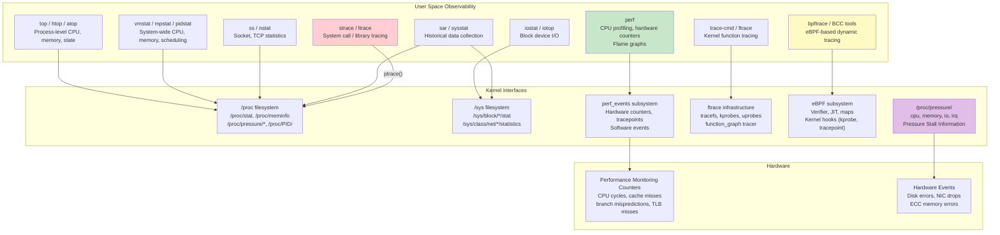
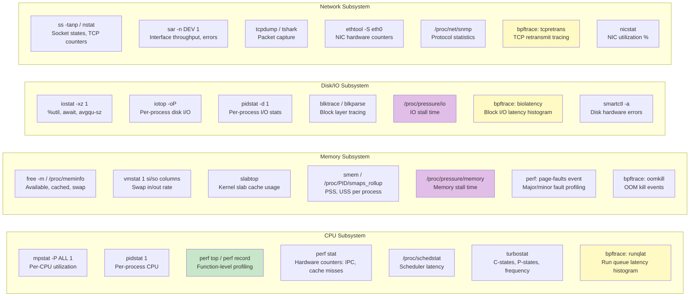
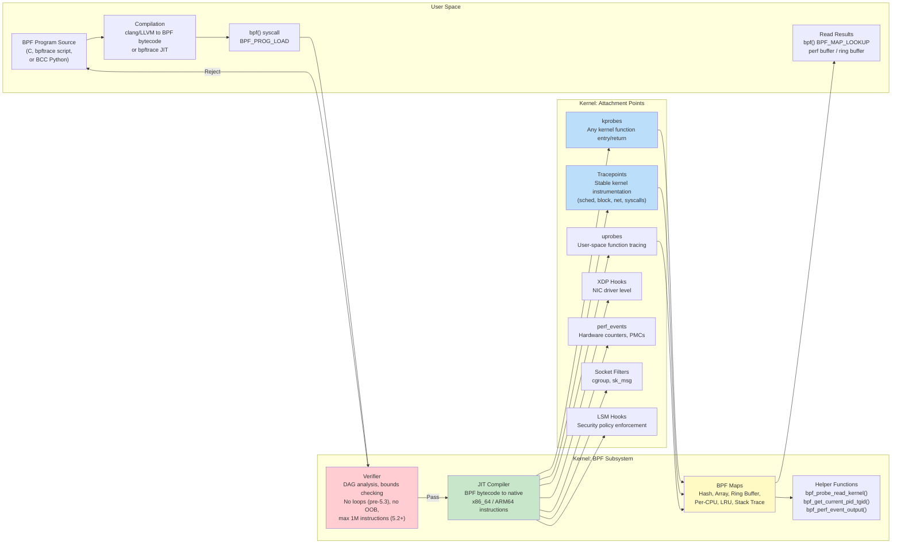
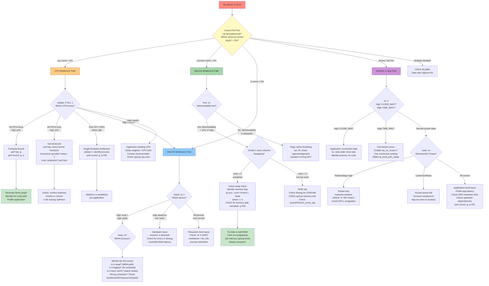

# Topic 08: Performance & Debugging -- Observability, Profiling, Tracing, and the Art of Diagnosis

> **Target Audience:** Senior SRE / Staff+ Cloud Engineers (10+ years experience)
> **Depth Level:** Principal Engineer interview preparation -- CAPSTONE CHAPTER
> **Cross-references:** [Fundamentals](../00-fundamentals/fundamentals.md) | [Process Management](../01-process-management/process-management.md) | [CPU Scheduling](../02-cpu-scheduling/cpu-scheduling.md) | [Memory Management](../03-memory-management/memory-management.md) | [Filesystem & Storage](../04-filesystem-and-storage/filesystem-and-storage.md) | [LVM](../05-lvm/lvm.md) | [Networking](../06-networking/networking.md)

---

## 1. Concept (Senior-Level Understanding)

### The Observability Philosophy: From Monitoring to Understanding

Performance debugging is the capstone discipline for a senior SRE because it synthesizes everything: process management, CPU scheduling, memory subsystems, filesystem I/O, networking, and kernel internals. You cannot debug a slow server without understanding all of these layers simultaneously.

The key mindset shift from junior to senior:

1. **Measure, do not guess.** "The server feels slow" is not a diagnosis. Before touching anything, establish which resource is the bottleneck -- CPU, memory, disk, or network -- with quantitative data.
2. **Observability is not monitoring.** Monitoring tells you *that* something is wrong (alerts). Observability lets you ask *why* it is wrong (exploration). A monitored system fires a page at 95% CPU. An observable system lets you trace that CPU usage to a specific kernel function, system call, or user-space code path.
3. **USE and RED are complementary frameworks, not competing ones.** USE is for infrastructure resources; RED is for service-level behavior.
4. **Tooling follows a cost/resolution tradeoff.** `vmstat` is free but coarse. `perf` is precise but has measurable overhead. `strace` is detailed but can slow processes 100x. Choose the right tool for the investigation phase.
5. **Baselines are everything.** A load average of 32 on a 64-core machine is fine. A load average of 32 on a 4-core machine is catastrophic. Every metric requires context.

### The USE Method (Brendan Gregg)

For every physical or software **resource** in the system, check three things:

| Metric | Definition | Why It Matters |
|---|---|---|
| **Utilization** | Percentage of time the resource is busy (or % capacity used) | Tells you if the resource is the bottleneck |
| **Saturation** | Degree to which work is queued because the resource is full | Tells you how badly it hurts |
| **Errors** | Count of error events on the resource | Often the fastest path to root cause |

The investigation order matters: **Errors first** (they are fast to check and often decisive), then **Saturation** (easy to interpret), then **Utilization** (provides context).

### The RED Method (Tom Wilkie)

For every **service** (microservice, API endpoint, request handler), measure:

| Metric | Definition | Example |
|---|---|---|
| **Rate** | Requests per second handled by the service | `rate(http_requests_total[5m])` |
| **Errors** | Failed requests per second | `rate(http_requests_total{status=~"5.."}[5m])` |
| **Duration** | Distribution of response times (histograms, not averages) | `histogram_quantile(0.99, ...)` |

**When to use which:** USE for infrastructure (CPU, disks, NICs, kernel queues). RED for application services. Google's Four Golden Signals (latency, traffic, errors, saturation) combine both perspectives.

### Observability Architecture Overview



---

## 2. Internal Working (Kernel-Level Deep Dive)

### Linux Observability Tool Landscape by Subsystem

Every tool in the Linux performance engineer's arsenal maps to one or more subsystems. Understanding which tool illuminates which layer prevents wasted time during an outage.



### eBPF Architecture: From Userspace to Kernel Hooks

eBPF (Extended Berkeley Packet Filter) is the most transformative technology in Linux observability since perf_events. It allows sandboxed programs to run inside the kernel at near-native speed, without modifying kernel source or loading kernel modules. Understanding the eBPF pipeline is essential for any senior SRE working at scale.



**Key architectural details:**

- **Verifier:** The safety gate. Performs static analysis of every possible execution path (DAG walk). Ensures no out-of-bounds memory access, no infinite loops (pre-5.3; bounded loops allowed in 5.3+), no unreachable code. Programs are limited to 1 million instructions (kernel 5.2+, up from 4096). This is what makes eBPF safe to run in production kernels.
- **JIT Compiler:** Converts verified BPF bytecode to native machine instructions (x86_64, ARM64). Eliminates interpreter overhead. Enabled by default on modern kernels (`net.core.bpf_jit_enable = 1`).
- **Maps:** Shared data structures between BPF programs and userspace. Types include hash tables, arrays, ring buffers, per-CPU variants, LRU caches, and stack trace storage. Maps persist across BPF program invocations and enable stateful analysis.
- **Helper functions:** Kernel-provided functions that BPF programs can call. Examples: `bpf_probe_read_kernel()` to safely read kernel memory, `bpf_get_current_comm()` to get process name, `bpf_ktime_get_ns()` for nanosecond timestamps.

### BCC vs. bpftrace: Choosing the Right Frontend

| Aspect | **BCC** | **bpftrace** |
|---|---|---|
| **Language** | Python/Lua + embedded C | AWK-like DSL |
| **Best for** | Complex tools, daemons, long-running collection | One-liners, ad-hoc investigation |
| **Compilation** | Compiles C at runtime via LLVM (slow startup) | JIT compilation (faster startup) |
| **Included tools** | 80+ tools: `execsnoop`, `opensnoop`, `biolatency`, `tcpretrans`, `runqlat`, `memleak` | Built-in probes and aggregations |
| **Example** | `execsnoop` traces all `exec()` calls fleet-wide | `bpftrace -e 'tracepoint:raw_syscalls:sys_enter { @[comm] = count(); }'` |

### strace Internals: The ptrace Tax

`strace` uses the `ptrace()` system call, which fundamentally operates by stopping the traced process at each system call boundary:

1. Tracer calls `ptrace(PTRACE_SYSCALL, pid)` to resume the tracee
2. Tracee runs until it enters a system call -- kernel sets `TIF_SYSCALL_TRACE` flag
3. Kernel stops the tracee, sends `SIGTRAP` to tracer -- **context switch #1**
4. Tracer reads syscall number and arguments via `ptrace(PTRACE_PEEKUSER)`
5. Tracer calls `ptrace(PTRACE_SYSCALL)` again to let the syscall execute
6. Kernel stops the tracee again on syscall exit -- **context switch #2**
7. Tracer reads return value, formats output, repeats

**Cost:** 2 context switches per system call, plus data copying between address spaces. For a process making 100k syscalls/second, this can cause 100x slowdown. **Never use strace in production on latency-sensitive services.** Use eBPF-based alternatives (`syscount`, `opensnoop`) instead.

### perf Subsystem Architecture

The `perf` tool leverages the `perf_events` kernel subsystem (since Linux 2.6.31):

- **Hardware counters (PMCs):** CPU cycles, instructions retired, cache misses (L1/L2/LLC), branch mispredictions, TLB misses. Accessed via MSR (Model Specific Registers). Limited number per CPU (typically 4-8 programmable counters).
- **Software events:** Page faults (minor/major), context switches, CPU migrations, alignment faults.
- **Tracepoints:** Stable kernel instrumentation points (e.g., `sched:sched_switch`, `block:block_rq_issue`).
- **Sampling mode:** `perf record` periodically interrupts the CPU (default: every N cycles), captures the instruction pointer and call stack. This creates a statistical profile of where CPU time is spent.
- **Counting mode:** `perf stat` counts events over the lifetime of a command. Zero overhead beyond the counter read.
- **Flame graphs:** Generated from `perf record` stack traces using Brendan Gregg's FlameGraph tools. Width of each frame represents the percentage of on-CPU time in that function. Read bottom-up: root is the entry point, leaves are the functions burning CPU.

### Pressure Stall Information (PSI)

Available since Linux 4.20, PSI provides direct measurement of resource contention through `/proc/pressure/`:

- **`/proc/pressure/cpu`:** Time tasks spend waiting for CPU (runqueue latency).
- **`/proc/pressure/memory`:** Time tasks spend in memory reclaim (direct reclaim, compaction, swapping).
- **`/proc/pressure/io`:** Time tasks spend waiting for block I/O completion.
- **`/proc/pressure/irq`:** Time tasks spend waiting due to IRQ/softirq contention (kernel 5.18+).

Each file contains two lines:
- **`some`:** Percentage of wall-clock time during which at least one task was stalled
- **`full`:** Percentage of wall-clock time during which all non-idle tasks were stalled simultaneously

```
some avg10=4.67 avg60=2.15 avg300=1.08 total=2345678
full avg10=1.23 avg60=0.87 avg300=0.45 total=987654
```

PSI is superior to traditional metrics for detecting contention because it directly measures the impact on tasks, not just resource utilization. A CPU at 80% utilization with 0% PSI is fine. A CPU at 80% utilization with 15% PSI `some` means tasks are waiting and users are being affected.

### ftrace and trace-cmd: In-Kernel Tracing

ftrace is the kernel's built-in tracing framework, accessible via the `tracefs` filesystem (usually mounted at `/sys/kernel/debug/tracing` or `/sys/kernel/tracing`):

- **function tracer:** Records every kernel function call. Uses GCC's `-pg` flag to insert `mcount()` calls, which are NOP'd at boot and dynamically patched when tracing is enabled.
- **function_graph tracer:** Like function tracer but also records function return, enabling call-depth visualization with timing.
- **trace-cmd:** User-space frontend for ftrace created by Steven Rostedt. `trace-cmd record -p function_graph -g do_sys_open` records a function call graph for file opens. `trace-cmd report` renders the output.

### kdump and crash: Post-Mortem Kernel Analysis

When the kernel panics, `kdump` (using `kexec`) boots a secondary "capture kernel" that saves the memory image (`vmcore`) to disk. The `crash` utility then analyzes the vmcore:

- `crash vmlinux vmcore` -- Opens the dump
- `bt` -- Backtrace of the panicking task
- `ps` -- Process list at time of crash
- `kmem -i` -- Kernel memory summary
- `log` -- dmesg buffer from the crashed kernel
- `files <pid>` -- Open files of a specific process

---

## 3. Commands (Master Reference)

### vmstat -- Virtual Memory Statistics

```bash
vmstat 1 5                             # 1-second intervals, 5 samples
```

| Column | Meaning | Healthy Range | Red Flag |
|---|---|---|---|
| `r` | Runnable processes (run queue length) | < CPU core count | > 2x cores = CPU saturation |
| `b` | Blocked processes (uninterruptible sleep, usually I/O) | 0-2 | > 10 = I/O bottleneck |
| `swpd` | Virtual memory used (swap) | 0 | > 0 and increasing = memory pressure |
| `free` | Free memory (KiB) | Varies | Low `free` alone is NOT a problem |
| `buff` | Buffer cache (block device metadata) | Varies | -- |
| `cache` | Page cache (file content) | Varies | -- |
| `si` | Swap in (KiB/s) | 0 | > 0 = pages being read from swap |
| `so` | Swap out (KiB/s) | 0 | > 0 sustained = memory exhaustion |
| `bi` | Blocks in from disk (blocks/s) | Varies | Compare to baseline |
| `bo` | Blocks out to disk (blocks/s) | Varies | Compare to baseline |
| `in` | Interrupts per second | Varies | Sudden spikes = hardware issue |
| `cs` | Context switches per second | Varies | > 100k = contention or busy polling |
| `us` | User CPU time % | Varies | -- |
| `sy` | System (kernel) CPU time % | < 30% | > 50% = excessive syscalls or I/O |
| `id` | Idle CPU time % | > 0 | 0% sustained = CPU saturated |
| `wa` | I/O wait % | < 5% | > 20% = I/O bottleneck |
| `st` | Stolen time % (hypervisor took it) | 0 | > 10% = noisy neighbor / CPU throttle |

**Critical:** The first line of `vmstat` output is an average since boot -- **always ignore it.** Read from line 2 onward.

### iostat -- I/O Statistics

```bash
iostat -xz 1                           # Extended, skip idle devices, 1-sec
iostat -xzd nvme0n1 1                  # Specific device
```

| Column | Meaning | Red Flag |
|---|---|---|
| `r/s`, `w/s` | Reads/writes per second (IOPS) | Compare to device capability |
| `rkB/s`, `wkB/s` | Read/write throughput (KiB/s) | Approaching device bandwidth limit |
| `await` | Average I/O response time (ms), includes queue time | > 10ms (SSD), > 20ms (HDD) |
| `r_await`, `w_await` | Separate read/write latency | Write >> Read may indicate journal contention |
| `avgqu-sz` | Average request queue length | > 1 for single device = saturation |
| `%util` | Percentage of time device was busy | > 80% = approaching saturation |

**Gotcha:** `%util` is misleading for modern NVMe devices that can serve many requests in parallel. A device can show 100% `%util` while still handling more IOPS. Use `await` and `avgqu-sz` as better saturation indicators.

### mpstat -- Multiprocessor Statistics

```bash
mpstat -P ALL 1                        # Per-CPU stats, 1-sec intervals
```

Key use case: identifying **single-threaded bottlenecks.** If one CPU is at 100% while others idle, you have a single-threaded application bottleneck, not a system-wide CPU issue. Also shows `%irq` and `%soft` -- high values indicate interrupt affinity imbalance (see [Networking](../06-networking/networking.md) for RSS/RPS tuning).

### pidstat -- Per-Process Statistics

```bash
pidstat 1                              # Per-process CPU, 1-sec intervals
pidstat -d 1                           # Per-process disk I/O
pidstat -r 1                           # Per-process memory (RSS, VSZ, faults)
pidstat -w 1                           # Per-process context switches
pidstat -t 1                           # Per-thread mode
pidstat -p <PID> 1                     # Monitor specific process
```

### sar -- System Activity Reporter (Historical)

```bash
sar -u 1 10                            # CPU usage, 1-sec, 10 samples
sar -r 1                               # Memory usage
sar -B 1                               # Paging statistics (pgscank, pgscand)
sar -d 1                               # Disk activity
sar -n DEV 1                           # Network interface stats
sar -n TCP,ETCP 1                      # TCP stats and errors
sar -q 1                               # Run queue length and load averages
sar -f /var/log/sa/sa15                # Read historical data (15th of month)
sar -A                                 # Everything (useful for post-incident)
```

**Key:** `sar` relies on `sa1`/`sa2` cron jobs from the `sysstat` package to collect historical data to `/var/log/sa/`. Without these configured, `sar` only works in live mode.

### strace -- System Call Tracing

```bash
strace -p <PID>                        # Attach to running process
strace -f -e trace=file <cmd>          # Trace file operations (follows forks)
strace -f -e trace=network <cmd>       # Trace network operations
strace -c -p <PID>                     # Syscall summary (count, time, errors)
strace -T -p <PID>                     # Show time spent in each syscall
strace -e trace=openat -p <PID>        # Trace only openat() calls
strace -o /tmp/trace.out -ff <cmd>     # Output to file, per-child-pid files
strace -e trace=%signal -p <PID>       # Trace only signal-related calls
```

**Production rule:** Use `strace -c` (summary mode) first -- it has lower overhead than full tracing. For production tracing, prefer eBPF-based alternatives: `execsnoop` (exec calls), `opensnoop` (file opens), `syscount` (syscall frequency).

### perf -- Performance Profiler

```bash
# Counting mode (zero overhead)
perf stat <command>                     # Hardware counters for a command
perf stat -a sleep 10                   # System-wide stats for 10 seconds
perf stat -e cache-misses,cache-references -p <PID> sleep 5

# Sampling mode (statistical profiler)
perf record -g -p <PID> sleep 30       # Profile PID for 30s with call graphs
perf record -a -g sleep 30             # System-wide profiling
perf report                             # Interactive report from perf.data
perf report --stdio                     # Text report

# Flame graphs
perf script | stackcollapse-perf.pl | flamegraph.pl > flame.svg

# Live top-like profiling
perf top -g                             # Live system-wide function profiling

# Tracepoints
perf trace -p <PID>                     # strace alternative (lower overhead)
perf record -e sched:sched_switch -a sleep 10   # Scheduler events
perf record -e block:block_rq_issue -a sleep 10  # Block I/O events
```

### bpftrace -- eBPF Dynamic Tracing

```bash
# System call frequency by process
bpftrace -e 'tracepoint:raw_syscalls:sys_enter { @[comm] = count(); }'

# Block I/O latency histogram
bpftrace -e 'tracepoint:block:block_rq_complete { @usecs = hist((nsecs - args->io_start_time_ns) / 1000); }'

# New process tracing (exec calls)
bpftrace -e 'tracepoint:syscalls:sys_enter_execve { printf("%s %s\n", comm, str(args->filename)); }'

# TCP retransmit tracing
bpftrace -e 'kprobe:tcp_retransmit_skb { @[kstack] = count(); }'

# Read latency by file
bpftrace -e 'kprobe:vfs_read { @start[tid] = nsecs; }
             kretprobe:vfs_read /@start[tid]/ { @us[comm] = hist((nsecs - @start[tid]) / 1000); delete(@start[tid]); }'

# Run queue latency
bpftrace -e 'tracepoint:sched:sched_wakeup { @qtime[args->pid] = nsecs; }
             tracepoint:sched:sched_switch { if (@qtime[args->next_pid]) {
               @usecs = hist((nsecs - @qtime[args->next_pid]) / 1000);
               delete(@qtime[args->next_pid]); } }'
```

### BCC Tools (Essential Kit)

```bash
execsnoop                               # Trace new process execution
opensnoop                               # Trace file opens
biolatency                              # Block I/O latency histogram
biosnoop                                # Per-event block I/O with latency
tcpretrans                              # TCP retransmissions with details
tcpconnect                              # Active TCP connections (connect())
tcpaccept                               # Passive TCP connections (accept())
runqlat                                 # CPU run queue latency histogram
runqlen                                 # CPU run queue length histogram
memleak                                 # Memory leak detector (malloc/free)
funccount 'vfs_*'                       # Count kernel function calls
trace 'do_sys_open "%s", arg2'          # Trace function with arg
profile                                 # CPU stack sampling (flame graph source)
offcputime                              # Off-CPU time flame graphs
ext4slower 10                           # ext4 operations slower than 10ms
```

### ss and Network Diagnostics

```bash
ss -tanp                                # All TCP sockets with process info
ss -s                                   # Summary (established, time-wait, etc.)
ss -ti state established                # TCP internals (cwnd, rtt, retrans)
nstat -sz                               # Kernel TCP/IP counters since last read
nstat -sz | grep -E 'Retrans|Drop|Overflow'  # Key error counters
cat /proc/net/snmp                      # Protocol-level statistics
ethtool -S eth0 | grep -i err           # NIC hardware error counters
```

### Pressure Stall Information

```bash
cat /proc/pressure/cpu                  # CPU contention
cat /proc/pressure/memory               # Memory contention
cat /proc/pressure/io                   # I/O contention
# Watch for changes over time:
watch -n1 'cat /proc/pressure/cpu; echo "---"; cat /proc/pressure/memory; echo "---"; cat /proc/pressure/io'
```

### /proc Filesystem -- Key Performance Files

```bash
cat /proc/stat                          # System-wide CPU time breakdown
cat /proc/meminfo                       # Detailed memory statistics
cat /proc/vmstat                        # VM event counters (pgfault, pgmajfault, pswpin, pswpout)
cat /proc/diskstats                     # Per-disk I/O statistics
cat /proc/net/dev                       # Per-interface network statistics
cat /proc/<PID>/status                  # Process memory, threads, signals
cat /proc/<PID>/smaps_rollup            # Aggregated memory map (RSS, PSS, USS)
cat /proc/<PID>/io                      # Process I/O counters
cat /proc/<PID>/sched                   # Scheduling statistics (nr_switches, wait_sum)
cat /proc/<PID>/fd/ | wc -l            # Open file descriptor count
cat /proc/schedstat                     # Per-CPU scheduler statistics
```

---

## 4. Debugging (The Master Section)

### The Master Debugging Flowchart: "My Server Is Slow"

This is the single most important diagram in the knowledge base. When someone reports "the server is slow," this is your systematic triage path. Every branch has specific commands and thresholds. Do not guess -- follow the flowchart.



### Debugging Methodology: The 60-Second Checklist

Run these 10 commands in the first 60 seconds of any performance investigation. This is the Brendan Gregg / Netflix methodology adapted for modern kernels:

```bash
# 1. Load averages and uptime (has the system recently rebooted?)
uptime
# Look at 1/5/15 minute load averages. Compare to CPU count.

# 2. Kernel errors and OOM kills
dmesg -T | tail -20
# Check for OOM kills, hardware errors, segfaults, kernel warnings

# 3. System-wide CPU, memory, I/O (live)
vmstat 1 5
# Focus: r (run queue), si/so (swap), us/sy/wa/st (CPU breakdown)

# 4. Per-CPU balance
mpstat -P ALL 1 3
# Check for single-CPU bottleneck, high %iowait on specific CPUs

# 5. Per-process CPU
pidstat 1 3
# Which processes are burning CPU right now?

# 6. Disk I/O latency and utilization
iostat -xz 1 3
# Focus: await (latency), %util (saturation), r/s + w/s (IOPS)

# 7. Memory usage
free -m
# Focus: available (NOT free!). If available < 10% of total, investigate.

# 8. Network interface stats
sar -n DEV 1 3
# Focus: rxkB/s, txkB/s (throughput), rxdrop/s, txdrop/s (drops)

# 9. TCP statistics
sar -n TCP,ETCP 1 3
# Focus: active/s (new connections), retrans/s (packet loss indicator)

# 10. Top processes (snapshot)
top -bn1 | head -20
# Quick snapshot of CPU and memory hogs
```

### Debugging Specific Scenarios

**Scenario: Short-Lived Processes Invisible to top**

`top` refreshes every 1-3 seconds and misses processes that fork, execute, and exit within that window. High CPU but no visible culprit:

```bash
# Use execsnoop to see every new process
execsnoop-bpfcc                        # BCC version
# Or:
bpftrace -e 'tracepoint:syscalls:sys_enter_execve { printf("%d %s %s\n", pid, comm, str(args->filename)); }'

# Count fork rate
perf stat -e 'sched:sched_process_fork' -a sleep 10
# If > 1000 forks/10s, short-lived process churn is the issue

# Historical: check process accounting
sa -m                                  # If acct is configured
```

**Scenario: Identifying a Memory Leak**

```bash
# Step 1: Confirm which process is growing
pidstat -r 1 | grep <suspect>          # Watch RSS over time

# Step 2: Check allocation patterns
memleak-bpfcc -p <PID> 10             # Top 10 allocation stacks after 10s

# Step 3: If no BCC available, use /proc
while true; do
  grep -E "^(VmRSS|VmSize)" /proc/<PID>/status
  sleep 5
done

# Step 4: Check slab growth (kernel-side leaks)
slabtop -s c                           # Sort by cache size
watch -n5 'cat /proc/slabinfo | sort -k3 -rn | head'
```

**Scenario: Identifying Disk Latency Spikes**

```bash
# Step 1: Confirm I/O latency
biolatency-bpfcc                       # Histogram of block I/O latency

# Step 2: Identify which files
biosnoop-bpfcc                         # Per-I/O details: PID, device, latency

# Step 3: Check I/O scheduler
cat /sys/block/sda/queue/scheduler     # [mq-deadline] kyber bfq none
# For NVMe: 'none' is typically best
# For HDD: 'mq-deadline' or 'bfq'

# Step 4: Check queue depth
cat /sys/block/sda/queue/nr_requests   # Max queued I/O requests
```

---

## 5. Real-World Incidents (5 Production Scenarios)

### Incident 1: High CPU from Short-Lived Fork Bombs Invisible to top

**Context:** A CI/CD build server running Jenkins shows sustained load average of 48 on an 8-core machine. `top` shows no process using more than 5% CPU. Total user CPU across all visible processes sums to only 30%.

**Symptoms:**
- Load average 48 on 8-core machine
- `top` shows no single CPU hog; many processes each using 1-5%
- `vmstat`: `r` column consistently 40+, `us` at 95%, `id` at 0%
- User reports: builds taking 10x longer than usual

**Investigation:**
```bash
# Step 1: top shows nothing obvious -- suspect short-lived processes
execsnoop-bpfcc
# TIME     PCOMM   PID    PPID   ARGS
# 14:23:01 sh      91234  91200  /bin/sh -c echo "checking version"
# 14:23:01 echo    91235  91234  /usr/bin/echo checking version
# 14:23:01 sh      91236  91200  /bin/sh -c cat /etc/os-release
# 14:23:01 cat     91237  91236  /bin/cat /etc/os-release
# ... hundreds of lines per second, all from PPID 91200

# Step 2: Identify the parent process
ps -ef | grep 91200
# jenkins  91200 91180  0 14:20 ?  Ss  0:00 /bin/bash /workspace/build.sh

# Step 3: Count fork rate
perf stat -e 'sched:sched_process_fork' -a sleep 10
# 14,832 sched:sched_process_fork  (10s) = ~1,483 forks/sec

# Step 4: Examine the build script
# Build script had: for i in $(seq 1 10000); do VERSION=$(cat VERSION); ...
# Each loop iteration spawned subshells for command substitution
```

**Root Cause:** A Jenkins build script used a Bash `for` loop with command substitution (`$(...)`) inside, spawning 2 new processes (subshell + command) per iteration, 10,000 iterations. At ~1,500 forks/second, each process lived only 1-3ms, too fast for `top`'s 3-second refresh to capture. The aggregate CPU consumption was enormous but distributed across thousands of ephemeral processes.

**Fix:**
1. Replaced shell command substitutions with variable reads and built-in string operations
2. Replaced the Bash loop with an equivalent Python script (single process)
3. Added `execsnoop` to the CI monitoring toolkit for future fork-bomb detection
4. Established fork-rate monitoring: alert when `sched:sched_process_fork` > 500/sec sustained

**Cross-reference:** [Process Management](../01-process-management/process-management.md) (fork/exec mechanics), [CPU Scheduling](../02-cpu-scheduling/cpu-scheduling.md) (run queue saturation)

---

### Incident 2: Memory Leak Diagnosed with eBPF on a Kubernetes Node

**Context:** A Kubernetes worker node running 40 pods gradually consumes all available memory over 3 days. `MemAvailable` drops from 48 GiB to 800 MiB. The OOM killer starts killing random pods.

**Symptoms:**
- `MemAvailable` trending to zero over 72 hours
- No single pod appears to be using excessive memory (all within cgroup limits)
- `slabtop` shows `dentry` and `inode_cache` growing without bound
- OOM kills on random pods: `dmesg | grep "Out of memory"`
- After pod restarts, memory is not reclaimed

**Investigation:**
```bash
# Step 1: Confirm it's kernel slab memory, not application memory
slabtop -s c -o | head
# Active / Total Objects (% used)    : 89012345 / 91234567 (97.6%)
# Active / Total Slabs (% used)      : 2345678 / 2345678 (100.0%)
# Active / Total Caches (% used)     : 112 / 195 (57.4%)
# Active / Total Size (% used)       : 34.5G / 35.2G (97.9%)
# OBJS   ACTIVE  USE OBJ SIZE  SLABS OBJ/SLAB CACHE SIZE NAME
# 45000000 44980000 99% 0.19K  1125000  40   4500000K dentry

# Step 2: 35 GiB in dentry cache -- what's creating them?
# Use BCC dcsnoop to trace dentry cache operations
dcsnoop-bpfcc
# Shows massive dentry lookups from a specific container

# Step 3: Trace which process is generating dentry allocations
bpftrace -e 'kprobe:d_alloc { @[comm, kstack(5)] = count(); }' -c 'sleep 10'
# Output shows massive allocations from a monitoring agent doing
# recursive directory walks of /proc and /sys every 5 seconds

# Step 4: Confirm the leak -- dentries not being freed
echo 2 > /proc/sys/vm/drop_caches     # Temporarily free dentries
# Memory recovers! But starts growing again immediately.
```

**Root Cause:** A container monitoring agent (deployed as a DaemonSet) was walking the entire `/proc` and `/sys` filesystems every 5 seconds to collect metrics. Each walk created millions of dentry cache entries. The dentry shrinker was not aggressive enough to keep up because `vfs_cache_pressure` was at the default value of 100, and the kernel preferred to evict page cache over slab cache. Over 72 hours, dentry slab grew to consume 35 GiB.

**Fix:**
1. Reconfigured the monitoring agent to use targeted `/proc` reads instead of recursive walks
2. Increased `vm.vfs_cache_pressure = 500` to make the dentry shrinker more aggressive
3. Set `min_free_kbytes = 1048576` (1 GiB) to ensure reclaim triggers earlier
4. Added monitoring for `slab_unreclaimable` in Prometheus to detect future slab growth

**Cross-reference:** [Memory Management](../03-memory-management/memory-management.md) (slab allocator, kswapd, reclaim), [Filesystem & Storage](../04-filesystem-and-storage/filesystem-and-storage.md) (dentry cache)

---

### Incident 3: Disk Latency from Wrong I/O Scheduler

**Context:** After migrating a PostgreSQL database from HDD-backed storage to NVMe SSDs, write latency improved only marginally. Expected P99 of 0.5ms, observed P99 of 8ms with periodic 50ms spikes.

**Symptoms:**
- `iostat -x`: `%util` frequently hits 100% even though IOPS is well below NVMe capability
- `await` averaging 8ms, spiking to 50ms
- `perf top` shows significant CPU in `cfq_*` and `blk_mq_*` functions
- P99 query latency not meeting SLO despite NVMe hardware

**Investigation:**
```bash
# Step 1: Check I/O scheduler
cat /sys/block/nvme0n1/queue/scheduler
# [cfq] deadline noop

# CFQ on NVMe is terrible -- it's designed for rotational media!
# CFQ tries to merge and reorder I/O requests, adding latency
# NVMe has its own internal scheduling and parallelism

# Step 2: Measure actual device latency vs. observed
biolatency-bpfcc -D nvme0n1 10
# Histogram shows bimodal distribution:
# Most I/Os: 100-500 usec (this is the real NVMe speed)
# A cluster: 10-50 ms (this is CFQ scheduling overhead!)

# Step 3: Check queue depth
cat /sys/block/nvme0n1/queue/nr_requests
# 32  <-- Default, NVMe can handle 64k+

# Step 4: Check hardware queues
cat /sys/block/nvme0n1/queue/nr_hw_queues
# 16  (multi-queue NVMe, but CFQ doesn't exploit this)
```

**Root Cause:** The NVMe device was using the CFQ (Completely Fair Queuing) I/O scheduler, which was the default on the older kernel (4.x). CFQ is designed for rotational disks: it reorders requests to minimize seek time and enforces fairness across processes. On NVMe, this adds scheduling latency without benefit because NVMe devices have no seek penalty and handle parallelism internally. The `%util` metric was also misleading -- it showed 100% because CFQ serialized requests, but the NVMe device had capacity for 100x more parallelism.

**Fix:**
```bash
# Immediate: switch to none (noop for blk-mq)
echo none > /sys/block/nvme0n1/queue/scheduler
# Verify:
cat /sys/block/nvme0n1/queue/scheduler
# [none] mq-deadline kyber bfq

# Increase queue depth for NVMe
echo 1024 > /sys/block/nvme0n1/queue/nr_requests
```

**Permanent fix:**
1. Added udev rule: `ACTION=="add|change", KERNEL=="nvme*", ATTR{queue/scheduler}="none"`
2. Updated provisioning automation to set `none` scheduler for all NVMe devices
3. Set kernel boot parameter `elevator=none` for NVMe-only hosts
4. Updated monitoring to track `await` (not `%util`) as the primary disk health metric for NVMe

**Result:** P99 write latency dropped from 8ms to 0.3ms. Spikes eliminated.

**Cross-reference:** [Filesystem & Storage](../04-filesystem-and-storage/filesystem-and-storage.md) (I/O schedulers, block layer)

---

### Incident 4: Network Microbursts Causing TCP Retransmissions

**Context:** A high-frequency trading data pipeline running on 10Gbps links shows periodic 200ms latency spikes. Average bandwidth utilization is only 2Gbps (20%). Network team says "the network is fine."

**Symptoms:**
- Average NIC utilization: 20% (looks fine to 5-minute monitoring)
- P99 latency spikes every 5-15 seconds lasting 100-300ms
- `nstat`: `TcpRetransSegs` increasing at ~200/sec
- Application logs show timeout errors to downstream services
- Network monitoring dashboards (5-min averages) show nothing unusual

**Investigation:**
```bash
# Step 1: Check TCP retransmit patterns
tcpretrans-bpfcc
# Shows retransmissions clustered to specific 100ms windows

# Step 2: High-resolution NIC stats (per-second, not per-5-min)
sar -n DEV 1 60 | grep eth0
# Most seconds: rxkB/s ~250000 (2Gbps)
# But every 5-15 seconds: rxkB/s spikes to 1200000 (9.6Gbps)
# That's a microburst hitting 96% NIC capacity!

# Step 3: Check NIC ring buffer drops
ethtool -S eth0 | grep -E 'drop|miss|over'
# rx_queue_0_drops: 12345
# rx_missed_errors: 67890  <-- NIC dropping packets!

# Step 4: Check ring buffer size
ethtool -g eth0
# Pre-set maximums:
# RX:     4096
# Current hardware settings:
# RX:     256   <-- Default, way too small for microbursts!

# Step 5: Measure burst characteristics
bpftrace -e 'tracepoint:net:netif_receive_skb { @bytes = sum(args->len); }
             interval:ms:100 { printf("100ms: %d bytes\n", @bytes); clear(@bytes); }'
# Shows 100ms windows with 120MB (9.6Gbps burst rate)
```

**Root Cause:** An upstream data source batched market data updates and flushed them in bursts every 5-15 seconds. Each burst sent 100-120MB in a sub-second window, temporarily saturating the 10Gbps link. The NIC's receive ring buffer (256 entries, default) was too small to absorb the burst, causing packet drops. The kernel's TCP stack then retransmitted, adding 200ms RTT-based delays. Traditional 5-minute monitoring averaged out the bursts, making the network appear underutilized.

**Fix:**
```bash
# Increase NIC ring buffer to maximum
ethtool -G eth0 rx 4096

# Enable interrupt coalescing tuning
ethtool -C eth0 rx-usecs 50 rx-frames 64

# Increase TCP buffer sizes
sysctl -w net.core.rmem_max=16777216
sysctl -w net.core.rmem_default=1048576
sysctl -w net.ipv4.tcp_rmem="4096 1048576 16777216"

# Increase socket backlog
sysctl -w net.core.netdev_budget=600
sysctl -w net.core.netdev_max_backlog=5000
```

**Permanent fix:**
1. Increased ring buffers to max via persistent `ethtool` configuration
2. Tuned TCP buffer sizes in `/etc/sysctl.d/99-network.conf`
3. Worked with upstream to implement rate limiting / traffic shaping on the data source
4. Deployed per-second (not per-5-minute) NIC drop rate monitoring
5. Added `ethtool -S` drop counters to Prometheus collection

**Cross-reference:** [Networking](../06-networking/networking.md) (NIC ring buffers, RSS, TCP tuning)

---

### Incident 5: Kernel Soft Lockup from Spinlock Contention

**Context:** A 64-core server running a high-throughput network proxy begins logging `BUG: soft lockup` messages. The system becomes partially unresponsive, with some SSH sessions hanging while others work. No kernel panic, but degraded functionality.

**Symptoms:**
- `dmesg`: `BUG: soft lockup - CPU#23 stuck for 22s! [ksoftirqd/23:145]`
- Multiple CPUs reporting soft lockups within a 60-second window
- `mpstat -P ALL`: affected CPUs show 100% `%soft` (softirq time)
- Load average rising rapidly (200+ on 64-core)
- Network throughput drops from 40Gbps to 5Gbps
- `perf top` shows heavy CPU in `_raw_spin_lock` and `nf_conntrack_find_get`

**Investigation:**
```bash
# Step 1: Identify the hot spinlock
perf record -a -g sleep 10
perf report --stdio
# 35% of CPU in _raw_spin_lock
# Called from nf_conntrack_find_get -> __nf_conntrack_find
# Called from nf_conntrack_in (netfilter connection tracking)

# Step 2: Check conntrack table status
conntrack -C
# 2,097,152  (conntrack table is full!)
sysctl net.netfilter.nf_conntrack_max
# 2097152

cat /proc/net/nf_conntrack | wc -l
# 2,097,151

# Step 3: Check conntrack hash table sizing
sysctl net.netfilter.nf_conntrack_buckets
# 65536  <-- 2M entries / 65K buckets = 32 entries per bucket!
# Hash chains are too long, causing O(n) traversal under spinlock

# Step 4: Verify it's the hash table spinlock causing contention
bpftrace -e 'kprobe:_raw_spin_lock { @[kstack(5)] = count(); }' -c 'sleep 5'
# Confirms nf_conntrack hash table lock contention

# Step 5: Check if conntrack is even needed
iptables -L -t nat | wc -l
# Only MASQUERADE rules for a few pods -- not needed for proxy traffic
```

**Root Cause:** The network proxy handled 2 million concurrent flows, filling the conntrack table to capacity. The conntrack hash table had only 65,536 buckets, creating an average chain length of 32. Every packet lookup required traversing the chain while holding a per-bucket spinlock. On a 64-core machine processing 5 million packets/second, many cores competed for the same bucket locks, causing spinlock contention severe enough to trigger soft lockup warnings (a CPU held the lock for > 20 seconds worth of softirq processing).

**Fix:**
```bash
# Immediate: increase hash table and max entries
echo 524288 > /sys/module/nf_conntrack/parameters/hashsize
sysctl -w net.netfilter.nf_conntrack_max=8388608

# For the proxy traffic that doesn't need conntrack:
iptables -t raw -A PREROUTING -p tcp --dport 8080 -j NOTRACK
iptables -t raw -A OUTPUT -p tcp --sport 8080 -j NOTRACK
```

**Permanent fix:**
1. Disabled conntrack entirely for proxy traffic using `-j NOTRACK` rules in the `raw` table
2. For remaining conntrack traffic, sized hash table to ensure < 4 entries per bucket
3. Upgraded to nftables with `ct state untracked` for better performance
4. Added monitoring for `nf_conntrack_count` vs `nf_conntrack_max` (alert at 80%)
5. For future high-throughput proxies, evaluated XDP-based forwarding to bypass netfilter entirely

**Cross-reference:** [Networking](../06-networking/networking.md) (conntrack, netfilter), [CPU Scheduling](../02-cpu-scheduling/cpu-scheduling.md) (softirq processing)

---

## 6. Interview Questions (15+)

### Q1: Walk me through how you would debug a slow server. What is your methodology?

1. **Do not guess. Establish which resource is the bottleneck first.** Start with the 60-second checklist: `uptime`, `dmesg -T | tail`, `vmstat 1`, `mpstat -P ALL 1`, `pidstat 1`, `iostat -xz 1`, `free -m`, `sar -n DEV 1`, `sar -n TCP,ETCP 1`, `top -bn1`
2. **Check PSI (Pressure Stall Information)** if available (kernel 4.20+): `cat /proc/pressure/{cpu,memory,io}`. This directly tells you which resource has contention.
3. **CPU path:** If `r` > core count in `vmstat` or `mpstat` shows high `us`/`sy`: use `pidstat` to identify the process, then `perf top -g` or `perf record -g` for function-level profiling. Generate a flame graph.
4. **Memory path:** If `si`/`so` > 0 in `vmstat` or `free -m` shows low available: identify the memory consumer with `ps aux --sort=-%mem`, check `smaps_rollup`, look for leaks with `memleak`.
5. **Disk path:** If `wa` > 5% in `vmstat` or `iostat` shows high `await`: identify the I/O generator with `iotop`, check the I/O scheduler, check for swap activity contributing to disk load.
6. **Network path:** If none of the above: check `ss -s` for socket state issues, `nstat` for retransmits/drops, `ethtool -S` for NIC errors. Check DNS resolution latency. Check upstream dependency health.
7. **Application path:** If infrastructure looks clean: profile the application with `perf record -g -p PID`, check for lock contention, examine application logs, check thread dumps.
8. **Correlate with recent changes:** What changed? Deployment? Config change? Traffic pattern? `last reboot`, check deployment history, git blame config files.

---

### Q2: Explain the USE method. Apply it to diagnose CPU saturation.

- **USE = Utilization, Saturation, Errors** -- Brendan Gregg's methodology for systematically checking every physical resource
- For CPU:
  - **Utilization:** `mpstat -P ALL 1` (per-CPU `%usr + %sys + %irq + %soft + %steal`), `vmstat 1` (`us + sy + st`)
  - **Saturation:** `vmstat 1` (`r` column, the run queue length -- if `r` > CPU core count, the CPU is saturated), `/proc/PID/schedstat` (second field = time spent waiting on run queue), `perf sched latency` (scheduler latency per process)
  - **Errors:** `perf stat` with CPU error events (machine check exceptions), `dmesg` for MCE events
- CPU saturation means processes are ready to run but must wait for a CPU. The run queue length directly measures this. A load average > core count sustained over 15 minutes indicates chronic CPU saturation.

---

### Q3: What is the difference between perf and strace? When would you use each?

- **strace** traces system calls using `ptrace()`. It stops the process twice per syscall (entry and exit), causing 2 context switches per call. Overhead can be 100x or more.
  - Use for: development debugging, understanding program behavior, finding missing files/config, one-off troubleshooting on non-production systems
  - Never use in production on latency-sensitive services
- **perf** uses the `perf_events` kernel subsystem. Sampling mode uses PMU interrupts at configurable frequency with < 5% overhead. Counting mode has near-zero overhead.
  - Use for: production profiling, CPU flame graphs, hardware counter analysis (IPC, cache misses), scheduler analysis
  - Safe for production with appropriate sample rate
- **Key difference:** strace is exact but expensive; perf is statistical but cheap. For system call analysis in production, use `perf trace` (uses tracepoints, not ptrace) or eBPF-based `syscount`.

---

### Q4: Explain eBPF architecture. Why is it safe to run in the production kernel?

1. **eBPF programs are compiled** from C or bpftrace DSL to BPF bytecode using clang/LLVM
2. **The verifier** performs static analysis of every possible execution path before the program is loaded:
   - Ensures all memory accesses are bounded (no buffer overflows)
   - Ensures all branches terminate (no infinite loops pre-5.3; bounded loops allowed in 5.3+)
   - Ensures no unreachable code paths
   - Limits program complexity (1M instructions max in 5.2+)
   - Validates all helper function calls and argument types
3. **JIT compiler** converts verified bytecode to native machine code (x86_64, ARM64), eliminating interpreter overhead
4. **Programs attach to hooks:** kprobes (any kernel function), tracepoints (stable ABI), uprobes (user-space functions), XDP (NIC driver), socket filters, LSM hooks
5. **Maps** provide shared state between kernel-space BPF programs and user-space tools (hash tables, arrays, ring buffers, per-CPU variants)
6. **Safety guarantees:** cannot crash the kernel, cannot access arbitrary memory, bounded execution time, resource limits enforced. This is why eBPF is fundamentally different from (and safer than) kernel modules.

---

### Q5: How do you generate and interpret a CPU flame graph?

1. **Record stack traces:** `perf record -g -a sleep 30` (system-wide, 30 seconds, with call graphs)
2. **Generate the flame graph:**
   ```
   perf script | stackcollapse-perf.pl | flamegraph.pl > flame.svg
   ```
3. **Interpretation:**
   - X-axis: stack trace population (wider = more samples = more CPU time), NOT time
   - Y-axis: call stack depth (bottom = entry point, top = leaf function)
   - Color: random warm palette (no semantic meaning by default)
   - A wide "plateau" at the top means that function is burning CPU directly
   - A wide frame in the middle with narrow children means that function dispatches to many callees, each burning a small amount
4. **Off-CPU flame graphs** (using `offcputime` from BCC): show where threads are *blocked* (sleeping, waiting for I/O, lock contention). Complementary to on-CPU flame graphs.
5. **Differential flame graphs:** Compare two profiles (before/after a change) to identify regressions. Red = increased CPU, blue = decreased.

---

### Q6: Explain PSI (Pressure Stall Information). How is it superior to traditional metrics?

- **PSI** (kernel 4.20+) measures the percentage of wall-clock time tasks are stalled waiting for a resource, exported via `/proc/pressure/{cpu,memory,io,irq}`
- **`some` line:** At least one task is stalled (partial stall -- some work still happening)
- **`full` line:** All non-idle tasks are stalled simultaneously (complete stall -- zero productive work)
- **Why superior to traditional metrics:**
  - CPU utilization of 80% tells you nothing about whether tasks are waiting. PSI `some` tells you they are.
  - Memory: `free -m` shows available memory but not whether reclaim is causing latency. PSI `memory some` detects direct reclaim and compaction stalls.
  - I/O: `iostat %util` is misleading for parallel devices. PSI `io some` measures actual task-level I/O waiting.
- **Practical use:** PSI triggers can be configured to fire when pressure exceeds a threshold, enabling proactive resource management. Kubernetes uses PSI for node health assessment. `systemd-oomd` uses memory PSI to kill processes before the OOM killer.
- **Production integration:** Export `avg10` values to Prometheus; alert when `some avg10 > 10%` sustained.

---

### Q7: What does %util in iostat actually measure? Why can it be misleading?

- `%util` measures the percentage of wall-clock time during which at least one I/O request was active on the device
- **It was designed for single-queue, rotational devices** where the device can only service one request at a time. For those devices, 100% means the device is completely saturated.
- **For modern devices (NVMe, RAID arrays, SSDs):** The device can service many requests in parallel. A device can show 100% `%util` while still having abundant capacity -- because during that time it was serving 64 requests in parallel, and it could serve 128.
- **Better saturation indicators for modern storage:**
  - `avgqu-sz` (average queue size): how many requests are queued. If this exceeds the device's queue depth, you are saturating it.
  - `await` (average I/O wait time): if this is much higher than the device's rated latency, you are saturating it.
  - `r_await` and `w_await` separately: write latency much higher than read may indicate journal contention or write amplification.
- **Rule of thumb:** Ignore `%util` for NVMe. Focus on `await` and `avgqu-sz`.

---

### Q8: How does strace work internally? Why is its overhead so high?

- strace uses the `ptrace(PTRACE_SYSCALL)` system call
- **For each system call the traced process makes:**
  1. Kernel stops the tracee at syscall entry (context switch to tracer)
  2. Tracer reads syscall number and arguments via `ptrace(PTRACE_PEEKUSER)` or `PTRACE_GETREGS`
  3. Tracer resumes tracee with `ptrace(PTRACE_SYSCALL)`
  4. Kernel stops the tracee at syscall exit (second context switch to tracer)
  5. Tracer reads return value, formats output, resumes tracee
- **Overhead sources:**
  - 2 context switches per syscall (entry + exit)
  - Data copying between address spaces (ptrace passes small fixed-size blocks, requiring multiple calls for large data like strings)
  - Signal delivery and handling for each stop
  - The traced process does zero useful work while stopped
- **Quantified:** For a process doing 100,000 syscalls/second, strace introduces 200,000 context switches/second. In benchmarks, strace can slow a process by 100-300x.
- **Alternatives with lower overhead:** `perf trace` (tracepoint-based, ~3x overhead), `bpftrace` with syscall tracepoints (< 5% overhead), BCC `syscount` (< 1% overhead)

---

### Q9: Explain the differences between vmstat, mpstat, pidstat, and sar. When do you use each?

- **vmstat:** System-wide snapshot of CPU, memory, swap, and I/O. Use as the first command to get a high-level picture. Key columns: `r` (run queue), `si`/`so` (swap), `us`/`sy`/`wa`/`st` (CPU breakdown).
- **mpstat:** Per-CPU statistics. Use when `vmstat` shows high CPU but you need to know if it is evenly distributed or concentrated on one core. Essential for diagnosing single-threaded bottlenecks or IRQ affinity issues.
- **pidstat:** Per-process statistics (CPU, memory, I/O, context switches). Use when you know the system is busy but need to identify which process is responsible. Like a scriptable `top`.
- **sar:** Historical data collection and replay. Use for: (a) post-incident analysis when you need to see what happened 2 hours ago, (b) baseline comparison, (c) comprehensive report (`sar -A`). Requires sysstat cron job for historical data. Covers CPU, memory, disk, network, TCP.
- **Workflow:** `vmstat` (system-wide overview) -> `mpstat` (per-CPU breakdown) -> `pidstat` (per-process attribution) -> `sar` (historical context and trend analysis)

---

### Q10: How would you diagnose TCP retransmissions in production?

1. **Detect:** `nstat -sz | grep Retrans` -- `TcpRetransSegs` shows total retransmissions. Compare to `TcpOutSegs` for retransmission ratio.
2. **Identify affected connections:** `ss -ti state established | grep -v 'retrans:0'` -- shows per-connection retransmit counts.
3. **Trace live retransmissions:** `tcpretrans-bpfcc` (BCC tool) or `bpftrace -e 'kprobe:tcp_retransmit_skb { printf("%s:%d -> %s:%d\n", ...); }'`
4. **Determine cause:**
   - Retransmits to specific destination = remote host or path issue
   - Retransmits on all connections = local NIC/switch problem
   - Check `ethtool -S eth0 | grep -i drop` for NIC-level drops
   - Check `nstat TcpExtTCPLossProbes` -- if high, may be tail loss probes (TLP), which is TCP probing, not necessarily bad
5. **Check for microbursts:** `sar -n DEV 1` per-second -- look for bandwidth spikes that saturate the link momentarily
6. **Resolution paths:**
   - Increase NIC ring buffers: `ethtool -G eth0 rx 4096`
   - Check congestion control: BBR handles loss better than CUBIC on lossy links
   - Check MTU/PMTUD issues (see [Networking](../06-networking/networking.md))

---

### Q11: What is the difference between load average and CPU utilization? A server has load average 64 but only 10% CPU utilization -- what is happening?

- **Load average:** Average number of processes in the run queue (running + waiting to run) AND processes in uninterruptible sleep (D state, usually I/O wait). On Linux, load average includes I/O-blocked processes.
- **CPU utilization:** Percentage of time CPUs are executing (user + system + IRQ + softirq + steal). Does not include processes waiting for I/O.
- **Load 64, CPU 10%:** 64 processes are in the run queue, but most are in uninterruptible sleep (D state) waiting for I/O, not consuming CPU.
  - Diagnosis: `vmstat 1` will show high `b` column (blocked processes) and high `wa` (I/O wait)
  - Common cause: NFS server is down (processes stuck in D state waiting for NFS), disk is failing (high latency), or mass page fault activity (all processes stalled on I/O)
  - Check: `ps aux | awk '$8 ~ /D/ {print}'` to find processes in D state
  - Check: `iostat -xz 1` for disk device with high `await`
  - This is a classic interview trap: high load average does NOT always mean CPU bottleneck

---

### Q12: How would you use eBPF/bpftrace to trace why a specific file is being written to?

1. **Trace all write() syscalls to the file:**
   ```
   bpftrace -e 'tracepoint:syscalls:sys_enter_write /comm != "bpftrace"/ {
     @[comm, pid, tid] = count();
   }'
   ```
2. **Filter by specific file descriptor (requires knowing the fd):**
   ```
   bpftrace -e 'tracepoint:syscalls:sys_enter_openat /str(args->filename) == "/var/log/app.log"/ {
     printf("PID %d (%s) opened target file, fd=%d\n", pid, comm, retval);
   }'
   ```
3. **Use BCC opensnoop for broader tracing:**
   ```
   opensnoop-bpfcc -f /var/log/app.log
   ```
4. **For production, use `bpftrace` with VFS tracepoints:**
   ```
   bpftrace -e 'kprobe:vfs_write { @[comm, kstack(3)] = count(); }'
   ```
   Then filter output for the target file's inode.
5. **Advantage over `lsof`:** `lsof` shows a snapshot; eBPF shows activity over time including processes that open, write, and close quickly.

---

### Q13: Explain what happens when the kernel OOM killer activates. How do you control it?

1. **Trigger:** When the kernel cannot reclaim enough memory to satisfy an allocation (direct reclaim fails, compaction fails, all watermarks breached)
2. **Process selection:** The OOM killer scores every process using `oom_badness()`:
   - Base score = RSS + swap usage of the process (and its children)
   - Adjusted by `oom_score_adj` (-1000 to +1000): -1000 = never kill, +1000 = always kill first
   - Kernel threads and init (PID 1) are exempt
   - The process with the highest final score is killed
3. **Kill mechanism:** Sends `SIGKILL` to the selected process. The kill is logged in `dmesg` with full memory state.
4. **Control mechanisms:**
   - `echo -1000 > /proc/<PID>/oom_score_adj` -- Protect critical processes (use sparingly)
   - `echo +1000 > /proc/<PID>/oom_score_adj` -- Sacrifice low-priority processes first
   - Memory cgroups (`memory.max`) -- Limit per-container/service; OOM kill is scoped to the cgroup
   - `vm.overcommit_memory=2` -- Strict mode; refuse allocations beyond `CommitLimit`; prevents OOM entirely but may cause `malloc()` failures
   - `earlyoom` / `systemd-oomd` -- Userspace OOM killers that act before the kernel OOM killer, using PSI memory pressure as the trigger

**Cross-reference:** [Memory Management](../03-memory-management/memory-management.md) (OOM killer, overcommit, cgroups)

---

### Q14: How would you debug a process stuck in D (uninterruptible sleep) state?

1. **Identify the process:** `ps aux | awk '$8 ~ /^D/'` or `top` (look for D state in STAT column)
2. **Get the kernel stack:** `cat /proc/<PID>/stack` -- shows where in the kernel the process is blocked
3. **Common D-state causes:**
   - Waiting for disk I/O (most common): check `iostat -xz 1` for the device
   - Waiting for NFS (hung NFS mount): `mount | grep nfs`, check NFS server health
   - Waiting for device driver (hardware issue): check `dmesg` for driver errors
   - Waiting for a kernel lock (rare): check `/proc/<PID>/stack` for `mutex_lock` or `down_read`
4. **D-state processes cannot be killed** with `SIGKILL` (the signal is pending but the process cannot wake to handle it). The only resolution is to fix the underlying I/O or resource issue.
5. **For NFS:** `mount -o soft,timeo=50` allows NFS operations to fail (return error) instead of hanging forever. Or use `mount -o intr` on older kernels.
6. **For disk:** If the disk is failing, D-state processes will be released once the I/O either completes or the device error timeout expires (`/sys/block/sdX/device/timeout`).

---

### Q15: What is ftrace and when would you use it instead of perf or eBPF?

- **ftrace** is the kernel's built-in tracing framework (no additional tools needed):
  - Controlled via `/sys/kernel/debug/tracing/` (tracefs)
  - Tracers: `function` (all kernel function calls), `function_graph` (with call depth and timing), `nop` (tracepoints only)
  - Low overhead due to NOP patching (functions are NOP'd at boot, dynamically patched when tracing is enabled)
- **When to use ftrace over perf/eBPF:**
  1. **Minimal environment:** No perf or BCC installed (embedded systems, rescue mode, old kernels). ftrace is always available if `CONFIG_FTRACE=y`.
  2. **Function call flow visualization:** `function_graph` tracer shows exact call sequences with indentation and timing -- perf and eBPF cannot easily replicate this.
  3. **Kernel boot tracing:** ftrace can be enabled at boot time to trace kernel initialization.
  4. **When you need trace-cmd/KernelShark:** `trace-cmd record -p function_graph -g ext4_file_write_iter` captures a detailed call graph that KernelShark can visualize.
- **When NOT to use ftrace:** When you need aggregation (histograms, per-process statistics) -- use eBPF. When you need userspace tracing -- use uprobes via perf/bpftrace.

---

### Q16: A Java application is consuming 8 GiB RSS but free -m shows 2 GiB available and the system is not swapping. Should you be concerned?

- **Not necessarily.** Linux reports "available" memory as the sum of truly free memory plus reclaimable memory (page cache + reclaimable slab). 2 GiB available on a machine with a single 8 GiB Java process may be perfectly healthy.
- **Check these indicators:**
  1. `cat /proc/pressure/memory` -- if `some avg10` is near 0, there is no memory pressure
  2. `vmstat 1` -- if `si`/`so` are 0, no swapping is occurring
  3. `sar -B 1` -- if `pgscank` and `pgscand` are near 0, kswapd and direct reclaim are not active
  4. `cat /proc/$(pidof java)/smaps_rollup` -- check `Private_Dirty` for actual unique memory usage
- **When to be concerned:**
  - If `MemAvailable` is trending downward over time (memory leak)
  - If `some avg10` in PSI memory is > 5% (active reclaim pressure)
  - If `si`/`so` are non-zero (swapping has begun)
  - If the JVM has `-Xmx` larger than physical memory and GC is not keeping the heap compact
- **Key point:** `MemFree` being low is normal and expected. `MemAvailable` is the metric that matters.

**Cross-reference:** [Memory Management](../03-memory-management/memory-management.md) (page cache, MemAvailable vs MemFree)

---

## 7. Common Pitfalls

### Pitfall 1: Alerting on MemFree Instead of MemAvailable
Linux aggressively uses free memory for page cache. A system with 200 MiB `MemFree` and 45 GiB `MemAvailable` is healthy. Alert on `MemAvailable` (or `available` column in `free -m`), not `MemFree`.

### Pitfall 2: Trusting %util from iostat on NVMe/RAID
`%util` was designed for single-queue rotational devices. On multi-queue NVMe or RAID arrays, 100% `%util` does not mean saturation. Use `await` and `avgqu-sz` instead.

### Pitfall 3: Ignoring the First Line of vmstat
The first line of `vmstat` output is an average since boot, which is almost never useful for diagnosing current issues. Always skip it.

### Pitfall 4: Using strace in Production
`strace` can slow a process by 100x due to ptrace overhead. Use `perf trace`, BCC `syscount`, or `bpftrace` with syscall tracepoints for production tracing.

### Pitfall 5: Assuming Load Average = CPU Load
On Linux, load average includes processes in uninterruptible sleep (D state, typically I/O wait). A load average of 100 with 5% CPU means you have a disk or NFS problem, not a CPU problem.

### Pitfall 6: Not Accounting for Stolen Time in VMs
In virtualized environments, the hypervisor can take away CPU cycles. Check `st` (stolen) in `vmstat`/`mpstat`. If `st > 10%`, your VM is being CPU-throttled by the hypervisor -- no amount of application tuning will help.

### Pitfall 7: Using 5-Minute Averages to Detect Microbursts
Network microbursts lasting 100ms can cause packet drops and retransmissions but are invisible in 5-minute average bandwidth monitoring. Use per-second `sar -n DEV 1` and NIC drop counters from `ethtool -S`.

### Pitfall 8: Forgetting CFQ I/O Scheduler on SSDs
The CFQ scheduler adds significant latency on SSDs/NVMe by reordering requests for rotational seek optimization. Always use `none` (noop) or `mq-deadline` for SSDs.

### Pitfall 9: Not Sizing Conntrack Hash Tables
Default `nf_conntrack_buckets` of 65,536 with `nf_conntrack_max` of 2,097,152 means 32 entries per bucket. Hash chain traversal under spinlock on many-core machines causes lock contention and soft lockups at scale.

### Pitfall 10: Treating All Retransmissions as Network Problems
TCP Loss Probes (TLP, `TcpExtTCPLossProbes`) are proactive retransmissions that TCP sends to detect tail loss. They are a feature, not a bug. Always separate TLP from actual loss-based retransmissions (`TcpExtTCPLostRetransmit`).

---

## 8. Pro Tips

### Pro Tip 1: PSI Triggers for Proactive Response
Configure PSI triggers to execute scripts when pressure exceeds thresholds:
```bash
# Write trigger to /proc/pressure/memory:
# "some 150000 1000000" = 15% pressure over any 1-second window
echo "some 150000 1000000" > /proc/pressure/memory
# Use select()/poll()/epoll() on the fd to wait for the trigger
```
This enables proactive memory management before the OOM killer activates. `systemd-oomd` already uses this mechanism.

### Pro Tip 2: The Off-CPU Flame Graph
On-CPU flame graphs only show where the CPU is burning. Off-CPU flame graphs show where threads are blocked -- I/O, locks, page faults, sleep. For latency investigations, you often need both:
```bash
# Record off-CPU stacks
offcputime-bpfcc -df 30 > off.stacks
# Generate off-CPU flame graph
flamegraph.pl --color=io --countname=us < off.stacks > offcpu.svg
```

### Pro Tip 3: perf stat for IPC (Instructions Per Cycle)
IPC tells you how efficiently the CPU is working:
```bash
perf stat -a sleep 5
# instructions: 45,000,000,000   #   1.85  insn per cycle
```
- IPC > 1.5: CPU-bound, compute-efficient. Optimize the algorithm.
- IPC < 0.5: Memory-bound (stalled on cache misses). Optimize data locality.
- IPC ~ 1.0: Mixed workload. Profile further.

### Pro Tip 4: funccount for Rapid Kernel Function Frequency
Before deep diving into perf or bpftrace, use `funccount` to quickly count kernel function call rates:
```bash
funccount-bpfcc 'vfs_*' -d 10          # Count VFS operations for 10s
funccount-bpfcc 'tcp_*' -d 10          # Count TCP operations
funccount-bpfcc 'ext4_*' -d 10         # Count ext4 operations
```
This is the fastest way to understand kernel subsystem activity.

### Pro Tip 5: Keep a Production Baseline
Before any investigation, you need to know what "normal" looks like. Collect and store baselines:
```bash
# Collect a baseline report
sar -A > /var/log/baseline-$(date +%Y%m%d).txt
vmstat 1 60 >> /var/log/baseline-$(date +%Y%m%d).txt
iostat -xz 1 60 >> /var/log/baseline-$(date +%Y%m%d).txt
```
Better yet, export all metrics to a time-series database (Prometheus + Grafana) and compare current values to the same hour last week.

### Pro Tip 6: kdump Is Your Safety Net for Kernel Panics
Configure kdump on every production server. When the kernel panics, the vmcore is the only way to determine root cause:
```bash
# Ensure kdump is configured and active
systemctl status kdump
# Test with: echo c > /proc/sysrq-trigger  (WARNING: crashes the system)
# Analyze with: crash /usr/lib/debug/lib/modules/$(uname -r)/vmlinux /var/crash/*/vmcore
```

### Pro Tip 7: Combine USE + RED for Complete Coverage
- **Infrastructure team** uses USE: Check CPU utilization/saturation/errors, memory U/S/E, disk U/S/E, network U/S/E
- **Application team** uses RED: Check request rate, error rate, duration distribution
- **The SRE bridges both:** Start with RED (user-facing symptoms), then drill into USE (infrastructure root cause). If RED shows high duration, USE tells you whether it is CPU, memory, disk, or network causing it.

---

## 9. Cheatsheet (Quick Reference)

### The 60-Second Performance Checklist

| # | Command | What to Check | Red Flag |
|---|---|---|---|
| 1 | `uptime` | Load averages (1/5/15 min) | Load > core count sustained |
| 2 | `dmesg -T \| tail` | Kernel errors, OOM kills | Any OOM or hardware error |
| 3 | `vmstat 1 5` | r, si/so, us/sy/wa/st | r > cores, so > 0, wa > 20% |
| 4 | `mpstat -P ALL 1 3` | Per-CPU balance | One CPU 100%, others idle |
| 5 | `pidstat 1 3` | Per-process CPU | One process dominating |
| 6 | `iostat -xz 1 3` | await, %util, avgqu-sz | await > 10ms (SSD) |
| 7 | `free -m` | available (NOT free!) | available < 10% total |
| 8 | `sar -n DEV 1 3` | NIC throughput, drops | Near line rate, any drops |
| 9 | `sar -n TCP,ETCP 1 3` | retrans/s, active/s | retrans/s > 0 sustained |
| 10 | `top -bn1 \| head -20` | Top CPU/MEM consumers | Single process > 90% |

### USE Method Quick Reference

| Resource | Utilization | Saturation | Errors |
|---|---|---|---|
| **CPU** | `mpstat -P ALL` (%usr+%sys) | `vmstat` r > cores | `perf stat` MCE, `dmesg` |
| **Memory** | `free -m` available | `vmstat` si/so > 0 | `dmesg \| grep kill` |
| **Disk** | `iostat` %util | `iostat` avgqu-sz > 1, await | `smartctl`, dmesg |
| **Network** | `sar -n DEV` kB/s | `nstat` drops, retrans | `ethtool -S` errors |
| **Swap** | `swapon -s` Used | `vmstat` si+so rate | N/A |

### PSI Quick Reference

```bash
# Healthy system:
cat /proc/pressure/cpu     # some avg10=0.00 avg60=0.00 avg300=0.00
cat /proc/pressure/memory  # some avg10=0.00 avg60=0.00 avg300=0.00
cat /proc/pressure/io      # some avg10=0.00 avg60=0.00 avg300=0.00

# Degraded system:
cat /proc/pressure/cpu     # some avg10=15.30 ...  <-- CPU contention
cat /proc/pressure/io      # some avg10=8.50 full avg10=3.20  <-- I/O stalls
```

### Essential BCC/bpftrace One-Liners

```bash
execsnoop                               # What processes are being created?
opensnoop                               # What files are being opened?
biolatency                              # How slow is disk I/O?
tcpretrans                              # Any TCP retransmissions?
runqlat                                 # How long are tasks waiting for CPU?
profile                                 # Where is CPU time being spent?
offcputime                              # Where are threads blocking?
memleak -p PID                          # Is this process leaking memory?
ext4slower 10                           # Which ext4 operations are > 10ms?
```

### Key /proc Files for Performance

| File | Content | Use |
|---|---|---|
| `/proc/pressure/*` | PSI: cpu, memory, io stall metrics | First check for contention |
| `/proc/stat` | System-wide CPU time counters | Overall CPU breakdown |
| `/proc/meminfo` | Memory statistics (100+ fields) | Available, cached, slab |
| `/proc/vmstat` | VM event counters | pgfault, pswpin, oom_kill |
| `/proc/diskstats` | Per-disk I/O counters | Throughput, latency |
| `/proc/<PID>/status` | Process memory, threads, state | Per-process investigation |
| `/proc/<PID>/smaps_rollup` | PSS, USS, shared memory | True memory footprint |
| `/proc/<PID>/stack` | Kernel stack of a process | Why is process in D state? |
| `/proc/<PID>/io` | Process I/O counters | Disk I/O per process |
| `/proc/<PID>/sched` | Scheduler stats | Wait time, migrations |

### Diagnostic Decision Tree (Quick)

```
Server slow? → Check PSI → cpu? → mpstat → pidstat → perf top → flame graph
                         → memory? → free -m → vmstat si/so → memleak
                         → io? → iostat → iotop → biolatency → scheduler
                         → all low? → ss -s → nstat → tcpretrans → app profile
```
