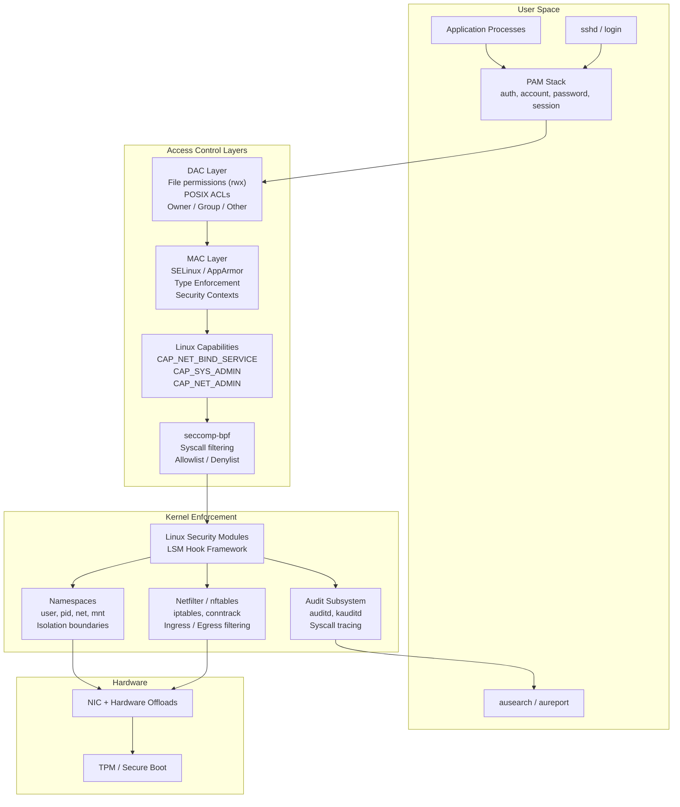
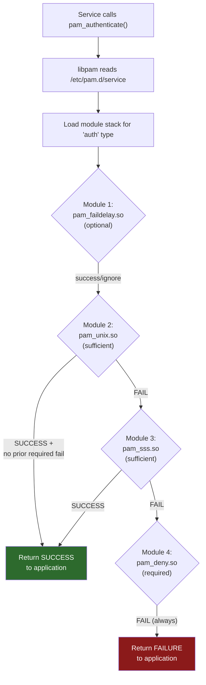
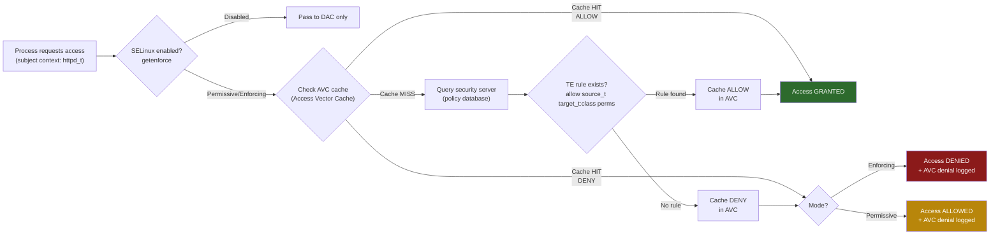
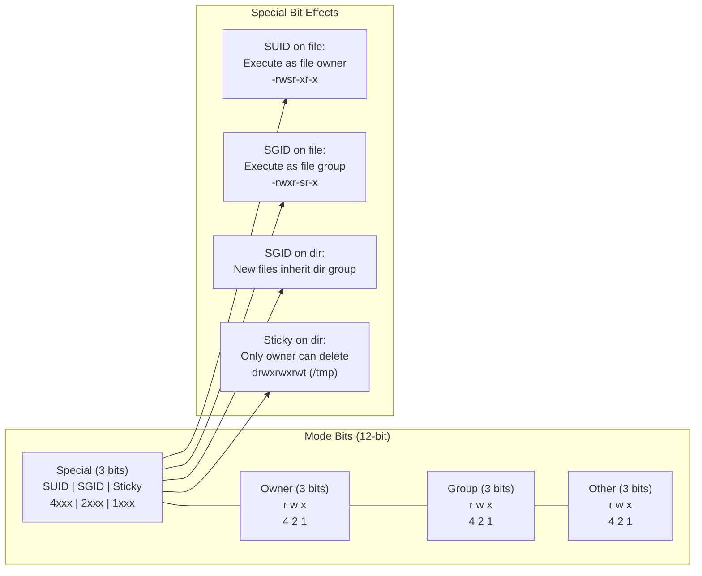
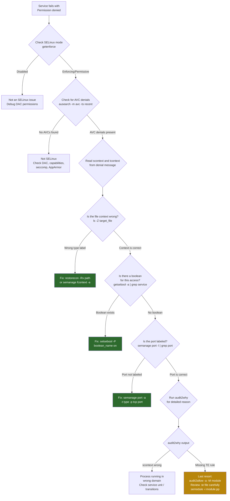

# Topic 09: Security -- SELinux, PAM, Capabilities, Hardening, and Audit Framework

> **Target Audience:** Senior SRE / Staff+ Cloud Engineers (10+ years experience)
> **Depth Level:** Principal Engineer interview preparation
> **Cross-references:** [Fundamentals](../00-fundamentals/fundamentals.md) | [Networking](../06-networking/networking.md) | [Kernel Internals](../07-kernel-internals/kernel-internals.md) | [Process Management](../01-process-management/process-management.md)

---

<!-- toc -->
## Table of Contents

- [1. Concept (Senior-Level Understanding)](#1-concept-senior-level-understanding)
  - [Defense in Depth: The Layered Security Model](#defense-in-depth-the-layered-security-model)
  - [DAC vs. MAC: The Critical Distinction](#dac-vs-mac-the-critical-distinction)
  - [Security Architecture Overview](#security-architecture-overview)
- [2. Internal Working](#2-internal-working)
  - [2.1 PAM Authentication Flow](#21-pam-authentication-flow)
  - [2.2 SELinux Context and Decision Path](#22-selinux-context-and-decision-path)
  - [2.3 Linux Permission Bits Layout](#23-linux-permission-bits-layout)
  - [2.4 Linux Capabilities](#24-linux-capabilities)
  - [2.5 seccomp-bpf: Syscall Filtering](#25-seccomp-bpf-syscall-filtering)
  - [2.6 The Linux Audit Framework](#26-the-linux-audit-framework)
- [3. Commands Reference](#3-commands-reference)
  - [File Permissions and Ownership](#file-permissions-and-ownership)
  - [SELinux](#selinux)
  - [PAM](#pam)
  - [SSH Hardening](#ssh-hardening)
  - [Capabilities](#capabilities)
  - [Firewall (iptables / nftables)](#firewall-iptables-nftables)
  - [Audit Framework](#audit-framework)
- [4. Debugging](#4-debugging)
  - [SELinux Denying Access: Troubleshooting Tree](#selinux-denying-access-troubleshooting-tree)
  - [Common Debugging Workflows](#common-debugging-workflows)
- [5. Real-World Incidents](#5-real-world-incidents)
  - [Incident 1: SELinux Blocking Application After Yum Update](#incident-1-selinux-blocking-application-after-yum-update)
  - [Incident 2: PAM Misconfiguration Locking Out All Users](#incident-2-pam-misconfiguration-locking-out-all-users)
  - [Incident 3: SSH Brute Force with Weak Key](#incident-3-ssh-brute-force-with-weak-key)
  - [Incident 4 (Composite): Capability Escalation + Container Escape](#incident-4-composite-capability-escalation-container-escape)
  - [Incident 5 (Composite): Audit Log Overflow Masking Intrusion](#incident-5-composite-audit-log-overflow-masking-intrusion)
- [6. Interview Questions](#6-interview-questions)
  - [Q1: Explain DAC vs. MAC in Linux. When would you choose to deploy SELinux over standard permissions?](#q1-explain-dac-vs-mac-in-linux-when-would-you-choose-to-deploy-selinux-over-standard-permissions)
  - [Q2: Walk through the SELinux troubleshooting process when a service is denied access.](#q2-walk-through-the-selinux-troubleshooting-process-when-a-service-is-denied-access)
  - [Q3: Describe the PAM architecture. How would you implement MFA for SSH without breaking console access?](#q3-describe-the-pam-architecture-how-would-you-implement-mfa-for-ssh-without-breaking-console-access)
  - [Q4: What are Linux capabilities? Why is CAP_SYS_ADMIN called "the new root"?](#q4-what-are-linux-capabilities-why-is-cap_sys_admin-called-the-new-root)
  - [Q5: How does seccomp-bpf work? How do container runtimes use it?](#q5-how-does-seccomp-bpf-work-how-do-container-runtimes-use-it)
  - [Q6: Explain the Linux audit framework. How would you configure it for SOC2/PCI compliance?](#q6-explain-the-linux-audit-framework-how-would-you-configure-it-for-soc2pci-compliance)
  - [Q7: How would you harden an SSH server for a production bastion host?](#q7-how-would-you-harden-an-ssh-server-for-a-production-bastion-host)
  - [Q8: What is the difference between iptables and nftables? Why is the industry moving to nftables?](#q8-what-is-the-difference-between-iptables-and-nftables-why-is-the-industry-moving-to-nftables)
  - [Q9: How do user namespaces interact with Linux capabilities and security?](#q9-how-do-user-namespaces-interact-with-linux-capabilities-and-security)
  - [Q10: Describe the SUID/SGID security implications and how capabilities replace them.](#q10-describe-the-suidsgid-security-implications-and-how-capabilities-replace-them)
  - [Q11: How does Fail2Ban work? What are its limitations at scale?](#q11-how-does-fail2ban-work-what-are-its-limitations-at-scale)
  - [Q12: Explain the CIS Benchmarks for Linux. How would you automate compliance?](#q12-explain-the-cis-benchmarks-for-linux-how-would-you-automate-compliance)
  - [Q13: How would you investigate a suspected privilege escalation on a Linux server?](#q13-how-would-you-investigate-a-suspected-privilege-escalation-on-a-linux-server)
  - [Q14: What is the relationship between namespaces, cgroups, capabilities, and seccomp in container security?](#q14-what-is-the-relationship-between-namespaces-cgroups-capabilities-and-seccomp-in-container-security)
  - [Q15: How would you design a zero-trust SSH access architecture for a large fleet?](#q15-how-would-you-design-a-zero-trust-ssh-access-architecture-for-a-large-fleet)
  - [Q16: Explain immutable audit rules and why they matter for security.](#q16-explain-immutable-audit-rules-and-why-they-matter-for-security)
- [7. Common Pitfalls](#7-common-pitfalls)
- [8. Pro Tips](#8-pro-tips)
- [9. Quick Reference / Cheatsheet](#9-quick-reference-cheatsheet)
  - [SELinux Quick Reference](#selinux-quick-reference)
  - [PAM Quick Reference](#pam-quick-reference)
  - [Critical sysctl Security Parameters](#critical-sysctl-security-parameters)
  - [Hardening Checklist (CIS Level 1 Essentials)](#hardening-checklist-cis-level-1-essentials)

<!-- toc stop -->

## 1. Concept (Senior-Level Understanding)

### Defense in Depth: The Layered Security Model

Linux security is not a single feature -- it is a composition of independent, overlapping enforcement layers. Each layer operates under the assumption that every other layer has already been compromised. A principal engineer designs systems where the failure of any single control does not yield full compromise.

The three foundational principles are:

1. **Defense in depth.** Multiple independent controls (DAC, MAC, capabilities, seccomp, firewalling, audit) stack such that an attacker must defeat every layer to gain meaningful access. A container escape that bypasses seccomp still faces SELinux policies; a privilege escalation that acquires `CAP_SYS_ADMIN` still faces firewall egress rules.

2. **Principle of least privilege.** Every process, user, and service runs with the minimum set of permissions required for its function. Root is avoided. Capabilities replace wholesale superuser access. SELinux confines daemons to precisely the files, ports, and syscalls they need.

3. **Mandatory vs. discretionary control.** Traditional UNIX permissions (DAC) let resource owners set permissions -- which means they can set them wrong. Mandatory Access Control (MAC) enforces administrator-defined policies that even root cannot override within the policy scope.

### DAC vs. MAC: The Critical Distinction

| Dimension | DAC (Discretionary) | MAC (Mandatory) |
|---|---|---|
| **Who sets policy** | Resource owner (user) | System administrator / security team |
| **Override by root** | root can bypass all checks | root is confined by policy |
| **Granularity** | User/group/other + ACLs | Security contexts, labels, types, roles |
| **Failure mode** | Permissive (user error = exposure) | Restrictive (deny by default) |
| **Linux implementation** | chmod/chown, POSIX ACLs | SELinux, AppArmor, TOMOYO |
| **Where used** | General-purpose systems | Government, finance, health care, containers |

### Security Architecture Overview



---

## 2. Internal Working

### 2.1 PAM Authentication Flow

PAM (Pluggable Authentication Modules) is the universal authentication framework for Linux. Every service that authenticates users -- `sshd`, `sudo`, `login`, `su`, `gdm` -- delegates to PAM via `libpam`. PAM reads service-specific configuration from `/etc/pam.d/<service>` and executes a stack of modules in order.

**Four module types** form the PAM stack:

| Type | Purpose | Key Modules |
|---|---|---|
| **auth** | Verify identity (password, key, OTP) | `pam_unix`, `pam_google_authenticator`, `pam_sss` |
| **account** | Check account validity (expiration, time restrictions) | `pam_unix`, `pam_access`, `pam_time` |
| **password** | Handle credential changes | `pam_unix`, `pam_pwquality`, `pam_cracklib` |
| **session** | Setup/teardown session (env, limits, logging) | `pam_limits`, `pam_systemd`, `pam_umask` |

**Control flags** determine how module results affect the overall stack:

- **required** -- Module must succeed. On failure, remaining modules still execute (no info leak), but final result is failure.
- **requisite** -- Module must succeed. On failure, immediately returns failure to the application. Short-circuits the stack.
- **sufficient** -- If this module succeeds and no prior required module has failed, immediately return success. On failure, the result is ignored.
- **optional** -- Result matters only if this is the sole module for the type.
- **include** / **substack** -- Pull in rules from another file.



**Key configuration files:**

- `/etc/pam.d/sshd` -- SSH authentication stack
- `/etc/pam.d/sudo` -- sudo authentication
- `/etc/pam.d/system-auth` (RHEL) or `/etc/pam.d/common-auth` (Debian) -- shared base stack
- `/etc/pam.d/password-auth` -- for remote services (RHEL)
- `/etc/security/limits.conf` -- consumed by `pam_limits.so`
- `/etc/security/access.conf` -- consumed by `pam_access.so`
- `/etc/security/pwquality.conf` -- consumed by `pam_pwquality.so`

### 2.2 SELinux Context and Decision Path

SELinux assigns a **security context** (label) to every object in the system -- processes, files, ports, devices. Every access decision is computed by comparing the context of the subject (process) with the context of the object.

**Security context format:** `user:role:type:level`

- **user** -- SELinux identity (e.g., `system_u`, `unconfined_u`)
- **role** -- RBAC role (e.g., `system_r`, `object_r`)
- **type** -- The primary enforcement unit (e.g., `httpd_t`, `var_log_t`). Type Enforcement (TE) rules define which types can access which other types.
- **level** -- MLS/MCS sensitivity level (e.g., `s0`, `s0:c0.c1023`)

**Example contexts:**

```
# Process context
system_u:system_r:httpd_t:s0          # Apache httpd

# File context
system_u:object_r:httpd_sys_content_t:s0  # /var/www/html/*

# Port context
system_u:object_r:http_port_t:s0      # TCP 80, 443
```

**Type Enforcement rule:** `allow httpd_t httpd_sys_content_t:file { read getattr open };`

This rule permits processes running as `httpd_t` to read files labeled `httpd_sys_content_t`.



**SELinux modes:**

| Mode | Behavior | Use Case |
|---|---|---|
| **Enforcing** | Denies and logs violations | Production |
| **Permissive** | Allows but logs violations | Debugging, policy development |
| **Disabled** | No SELinux processing | Not recommended |

**Key SELinux policy types (RHEL):**

- **targeted** -- Confines specific daemons; everything else runs unconfined. Default on RHEL/CentOS.
- **mls** -- Multi-Level Security. Full Bell-LaPadula model for classified environments.

### 2.3 Linux Permission Bits Layout

Every inode carries a 16-bit mode field. The lower 12 bits encode the permission and special bits.



**Beyond mode bits -- POSIX ACLs:**

POSIX ACLs extend the user/group/other model to arbitrary named users and groups. They are stored as extended attributes (`system.posix_acl_access`) and evaluated after owner checks but before the "other" bits.

```bash
# Grant read to specific user without changing ownership
setfacl -m u:deployer:rx /var/www/html
# Grant read/write to a group
setfacl -m g:developers:rw /opt/app/config
# Set default ACL on directory (inherited by new files)
setfacl -d -m g:developers:rw /opt/app/config
# View ACLs (+ flag in ls -l indicates ACL present)
getfacl /var/www/html
```

### 2.4 Linux Capabilities

Linux capabilities decompose root's monolithic privilege into ~41 distinct capabilities. A process can hold only the specific capabilities it needs rather than operating as UID 0.

**Capability sets per process:**

| Set | Purpose |
|---|---|
| **Permitted** | Upper bound of capabilities the process can activate |
| **Effective** | Currently active capabilities checked by kernel |
| **Inheritable** | Capabilities preservable across `execve()` |
| **Bounding** | Hard limit that cannot be re-added once dropped |
| **Ambient** | Capabilities preserved across `execve()` for non-SUID binaries |

**Critical capabilities:**

| Capability | Power | Risk Level |
|---|---|---|
| `CAP_SYS_ADMIN` | Mount, swapon, sethostname, load kernel modules, configure namespaces | CRITICAL -- "the new root" |
| `CAP_NET_ADMIN` | Configure interfaces, routing, firewall, promiscuous mode | HIGH |
| `CAP_NET_BIND_SERVICE` | Bind to ports < 1024 | LOW |
| `CAP_NET_RAW` | Raw sockets, packet crafting | MEDIUM |
| `CAP_DAC_OVERRIDE` | Bypass file read/write/execute permission checks | HIGH |
| `CAP_SETUID` / `CAP_SETGID` | Arbitrary UID/GID changes | CRITICAL |
| `CAP_SYS_PTRACE` | Trace/inject into any process | CRITICAL |
| `CAP_CHOWN` | Change file ownership arbitrarily | MEDIUM |

**File capabilities:** Capabilities can be set on executables to avoid SUID entirely:

```bash
# Allow nginx to bind port 80 without root
setcap 'cap_net_bind_service=+ep' /usr/sbin/nginx
# Verify
getcap /usr/sbin/nginx
# Remove
setcap -r /usr/sbin/nginx
```

### 2.5 seccomp-bpf: Syscall Filtering

seccomp (secure computing mode) restricts the system calls a process can invoke. In BPF mode, a BPF program is attached to the process that inspects each syscall number and arguments, returning ALLOW, KILL, ERRNO, TRACE, or LOG.

**Architecture:**

1. Process loads seccomp BPF filter via `prctl(PR_SET_SECCOMP)` or `seccomp()` syscall
2. Kernel invokes the BPF filter on every subsequent syscall entry
3. Filter cannot be loosened once applied (only tightened)
4. Child processes inherit the filter across `fork()` and `execve()`

**Container runtimes** (Docker, containerd, CRI-O) apply a default seccomp profile that blocks ~44 of 300+ syscalls, including `mount`, `ptrace`, `reboot`, `kexec_load`, `init_module`, `delete_module`, and `unshare` (with CLONE_NEWUSER).

**Kubernetes integration:** `securityContext.seccompProfile` with `RuntimeDefault` applies the container runtime's default profile. Custom profiles can be loaded from the node filesystem.

### 2.6 The Linux Audit Framework

The audit framework provides kernel-level syscall tracing and event logging for security monitoring and compliance. It is composed of:

- **kauditd** -- Kernel thread that receives audit events from kernel hooks and sends them to userspace via netlink
- **auditd** -- Userspace daemon that receives events, writes to `/var/log/audit/audit.log`
- **auditctl** -- CLI for managing rules at runtime
- **ausearch** -- Search/filter audit logs by criteria (user, syscall, time, key)
- **aureport** -- Generate summary reports (authentication, anomalies, files, syscalls)

**Configuration files:**

- `/etc/audit/auditd.conf` -- Daemon settings (log size, rotation, disk full action)
- `/etc/audit/rules.d/*.rules` -- Persistent rules loaded by `augenrules` at boot
- `/etc/audit/audit.rules` -- Auto-generated aggregate rule file

**Rule types:**

```bash
# Watch a file for changes
-w /etc/shadow -p wa -k shadow_changes
# Watch a directory
-w /etc/sudoers.d/ -p wa -k sudoers_changes
# Trace a syscall (execve for all command execution)
-a always,exit -F arch=b64 -S execve -k command_exec
# Track privilege escalation
-a always,exit -F arch=b64 -S setuid -S setgid -k priv_esc
# Track network socket creation
-a always,exit -F arch=b64 -S socket -F a0=2 -k network_socket
```

---

## 3. Commands Reference

### File Permissions and Ownership

```bash
# Permission management
chmod 750 /opt/app/bin/service         # rwxr-x--- (owner full, group rx, other none)
chmod u+s /usr/local/bin/helper        # Set SUID bit
chmod g+s /shared/project              # Set SGID bit (new files inherit group)
chmod +t /tmp                          # Set sticky bit
chmod -R o-rwx /opt/app/               # Recursive: remove all other permissions

# Ownership
chown appuser:appgroup /opt/app -R     # Recursive ownership change
chown --reference=/opt/app/bin /opt/app/lib  # Match ownership from reference

# ACLs
setfacl -m u:deployer:rx /var/www      # Named user ACL
setfacl -m g:ops:rwx /opt/configs      # Named group ACL
setfacl -x u:deployer /var/www         # Remove specific ACL entry
setfacl -b /var/www                    # Remove all ACLs
setfacl -d -m g:ops:rw /opt/configs    # Default ACL (inheritance)
getfacl /var/www                       # Display ACLs
```

### SELinux

```bash
# Status and modes
getenforce                             # Show current mode
setenforce 1                           # Set enforcing (runtime, non-persistent)
sestatus                               # Detailed status (mode, policy, MLS)

# Contexts
ls -Z /var/www/html                    # List file contexts
ps -eZ | grep httpd                    # List process contexts
id -Z                                  # Current user context

# Context management
chcon -t httpd_sys_content_t /var/www/html/index.html  # Temporary context change
restorecon -Rv /var/www/html           # Restore default contexts (from policy)
semanage fcontext -a -t httpd_sys_content_t "/srv/web(/.*)?"  # Persistent rule
restorecon -Rv /srv/web                # Apply the persistent rule

# Port labeling
semanage port -l | grep http           # List HTTP port labels
semanage port -a -t http_port_t -p tcp 8443  # Allow httpd on 8443

# Booleans
getsebool -a | grep httpd              # List httpd-related booleans
setsebool -P httpd_can_network_connect on  # Persistent boolean change

# Troubleshooting
ausearch -m avc -ts recent             # Recent AVC denials
sealert -a /var/log/audit/audit.log    # Human-readable analysis (requires setroubleshoot)
audit2why < /var/log/audit/audit.log   # Explain denials
audit2allow -a -M mypolicy            # Generate policy module from all denials
semodule -i mypolicy.pp               # Install policy module
semodule -l                            # List installed modules
```

### PAM

```bash
# View PAM stack for a service
cat /etc/pam.d/sshd
cat /etc/pam.d/sudo
cat /etc/pam.d/system-auth             # RHEL shared stack

# Account lockout (faillock replaces pam_tally2 on RHEL 8+)
faillock --user jdoe                   # Show failed attempts
faillock --user jdoe --reset           # Reset lockout counter
# Legacy: pam_tally2 --user=jdoe --reset

# Password quality
pwscore <<< "MyP@ssw0rd2025"          # Score a password
cat /etc/security/pwquality.conf       # View password policy

# Resource limits (pam_limits.so)
cat /etc/security/limits.conf
ulimit -a                              # Current shell limits
```

### SSH Hardening

```bash
# Key generation (modern algorithms)
ssh-keygen -t ed25519 -C "user@host"           # Ed25519 (preferred)
ssh-keygen -t rsa -b 4096 -C "user@host"       # RSA 4096 (legacy compat)
ssh-keygen -t ecdsa -b 384                       # ECDSA 384

# Key management
ssh-copy-id -i ~/.ssh/id_ed25519.pub user@host  # Deploy public key
ssh-add -l                                       # List agent keys
ssh-add ~/.ssh/id_ed25519                        # Load key into agent

# Hardened sshd_config directives
# PermitRootLogin no
# PasswordAuthentication no
# PubkeyAuthentication yes
# MaxAuthTries 3
# AllowUsers deployer admin
# AllowGroups sre-team
# ClientAliveInterval 300
# ClientAliveCountMax 2
# X11Forwarding no
# PermitEmptyPasswords no
# Protocol 2
# LoginGraceTime 30
# MaxStartups 10:30:60

# Restart and validate
sshd -t                               # Test config syntax
systemctl reload sshd                  # Reload without dropping connections
```

### Capabilities

```bash
# File capabilities
setcap 'cap_net_bind_service=+ep' /usr/bin/node  # Bind low ports
getcap /usr/bin/node                              # Verify
setcap -r /usr/bin/node                           # Remove

# Process capabilities
getpcaps $$                            # Current shell capabilities
grep Cap /proc/self/status             # Raw capability bitmask
capsh --decode=00000000a80425fb        # Decode bitmask

# Find SUID binaries (audit for capability migration)
find / -perm -4000 -type f 2>/dev/null
# Find files with capabilities
getcap -r / 2>/dev/null
```

### Firewall (iptables / nftables)

```bash
# iptables (legacy, still widely deployed)
iptables -L -n -v --line-numbers       # List all rules
iptables -A INPUT -p tcp --dport 22 -s 10.0.0.0/8 -j ACCEPT  # Allow SSH from internal
iptables -A INPUT -p tcp --dport 22 -j DROP                     # Drop other SSH
iptables -A INPUT -m state --state ESTABLISHED,RELATED -j ACCEPT  # Stateful
iptables -P INPUT DROP                 # Default deny inbound
iptables-save > /etc/iptables.rules    # Persist rules

# nftables (modern replacement)
nft list ruleset                       # Show all rules
nft add table inet filter              # Create table
nft add chain inet filter input '{ type filter hook input priority 0; policy drop; }'
nft add rule inet filter input tcp dport 22 ip saddr 10.0.0.0/8 accept
nft add rule inet filter input ct state established,related accept
```

### Audit Framework

```bash
# Status
auditctl -s                            # Audit system status
auditctl -l                            # List active rules

# Add rules (runtime)
auditctl -w /etc/passwd -p wa -k passwd_changes
auditctl -a always,exit -F arch=b64 -S execve -k exec_log

# Search and report
ausearch -k passwd_changes -ts today   # Search by key
ausearch -m USER_LOGIN -ts today       # Login events
ausearch --uid 0 -ts today             # All root activity
aureport --auth                        # Authentication summary
aureport --anomaly                     # Anomaly report
aureport -x --summary                  # Executable summary

# Log management
head -20 /var/log/audit/audit.log      # Raw log format
```

---

## 4. Debugging

### SELinux Denying Access: Troubleshooting Tree



### Common Debugging Workflows

**PAM lockout recovery:**

1. Boot into single-user mode or rescue mode (bypass PAM)
2. Check `/etc/pam.d/system-auth` and `/etc/pam.d/sshd` for misconfigurations
3. Look for `pam_deny.so` as `required` with no preceding `sufficient` success path
4. Verify `faillock --user <user>` for account lockout state
5. Check `/var/log/secure` (RHEL) or `/var/log/auth.log` (Debian) for PAM error messages

**Capability debugging:**

```bash
# Process denied an operation that requires a capability
# 1. Identify the required capability
man capabilities  # Search for the operation
# 2. Check current capabilities
getpcaps <pid>
grep Cap /proc/<pid>/status
capsh --decode=<hex_value>
# 3. Check if Docker/Kubernetes dropped it
docker inspect <container> | jq '.[0].HostConfig.CapDrop'
# 4. Add the minimum capability needed
# Docker: --cap-add=NET_BIND_SERVICE
# K8s: securityContext.capabilities.add: ["NET_BIND_SERVICE"]
```

**Audit log analysis for incident investigation:**

```bash
# Timeline of events around a suspicious time
ausearch -ts 03/15/2026 14:00:00 -te 03/15/2026 15:00:00
# All commands run by a specific user
ausearch -ua 1001 -i
# File access to sensitive paths
ausearch -f /etc/shadow -i
# Failed authentication attempts
ausearch -m USER_LOGIN --success no -i
# Network connections by a process
ausearch -k network_socket -i
```

---

## 5. Real-World Incidents

### Incident 1: SELinux Blocking Application After Yum Update

**Context:** Production RHEL 8 web server running Apache serving static content from `/srv/webapp`. After a routine `dnf update` that included an httpd package update, the site returns 403 Forbidden errors.

**Symptoms:**
- HTTP 403 on all previously working pages
- Apache error log: `Permission denied: access to /index.html denied`
- Files are readable (`ls -la` shows correct DAC permissions)
- Problem does not occur on dev servers (which run `setenforce 0`)

**Investigation:**
```bash
ausearch -m avc -ts recent | grep httpd
# type=AVC msg=audit(1710500000.123:456): avc: denied { read } for
#   pid=1234 comm="httpd" name="index.html" dev="sda1" ino=654321
#   scontext=system_u:system_r:httpd_t:s0
#   tcontext=unconfined_u:object_r:default_t:s0 tclass=file

ls -Z /srv/webapp/
# unconfined_u:object_r:default_t:s0 index.html   <-- WRONG context
```

**Root Cause:** The `dnf update` modified the httpd package, triggering a restorecon on standard content paths. But `/srv/webapp` was a custom content directory that was never added to the SELinux file context database. Previous file creation by an unconfined admin gave files `default_t` instead of `httpd_sys_content_t`. Earlier Apache versions may have had a more permissive policy module.

**Fix:**
```bash
semanage fcontext -a -t httpd_sys_content_t "/srv/webapp(/.*)?"
restorecon -Rv /srv/webapp
# Verify
ls -Z /srv/webapp/
# system_u:object_r:httpd_sys_content_t:s0 index.html
```

**Prevention:**
- Include `semanage fcontext` commands in deployment automation (Ansible, Puppet)
- Add SELinux context verification to CI/CD deployment validation
- Never run production with `setenforce 0` -- always fix the policy
- Add audit rules: `-w /srv/webapp -p a -k webapp_access`

---

### Incident 2: PAM Misconfiguration Locking Out All Users

**Context:** A security engineer modifies `/etc/pam.d/system-auth` on a RHEL 7 server to enforce MFA using `pam_google_authenticator.so`. After the change, no user -- including root -- can authenticate via SSH or console.

**Symptoms:**
- All SSH logins fail immediately with `Permission denied`
- Console login prompts for password, then fails regardless of correct input
- `/var/log/secure` shows: `pam_google_authenticator(sshd:auth): Failed to read secret file`

**Investigation:**
```bash
# After booting into rescue mode and mounting filesystem:
cat /mnt/sysroot/etc/pam.d/system-auth
# auth required pam_google_authenticator.so   <-- FIRST LINE, no fallback
# auth required pam_unix.so
```

The problem: `pam_google_authenticator.so` was set as `required` before `pam_unix.so`, but no user had configured a TOTP secret (the `~/.google_authenticator` file was missing for all users). Since `required` means the module must succeed and the module failed for every user, the entire auth stack failed.

**Root Cause:** The module was added as `required` without first deploying TOTP secrets to all users. The engineer also modified `system-auth` (shared by all services) rather than scoping the change to `sshd` only.

**Fix:**
```bash
# From rescue mode:
mount -o remount,rw /mnt/sysroot
# Restore working PAM config
cp /mnt/sysroot/etc/pam.d/system-auth.bak /mnt/sysroot/etc/pam.d/system-auth
# Reboot into normal mode
```

**Prevention:**
- Always test PAM changes on a single service (`/etc/pam.d/sshd`) before modifying shared stacks
- Keep a rescue shell open during PAM modifications -- test login from a separate terminal before closing
- Use `pam_faildelay.so` or `pam_warn.so` in development to log without enforcing
- Maintain an out-of-band access path (BMC/IPMI/console) independent of PAM
- Version control `/etc/pam.d/` and deploy changes via configuration management with rollback

---

### Incident 3: SSH Brute Force with Weak Key

**Context:** A production bastion host at a fintech company is compromised. Investigation reveals the attacker gained access via SSH using a stolen DSA key from a developer's laptop that was left unencrypted.

**Symptoms:**
- Anomalous `authorized_keys` modifications on downstream servers
- New cron jobs installing cryptocurrency miners
- Auth logs show successful SSH from an IP in a foreign country
- The compromised account had `sudo NOPASSWD: ALL`

**Investigation:**
```bash
# Auth log shows repeated successful logins from unknown IP
ausearch -m USER_LOGIN --success yes -i | grep 203.0.113.50
# User's authorized_keys had an old 1024-bit DSA key
ssh-keygen -l -f /home/devuser/.ssh/authorized_keys
# 1024 SHA256:... devuser@oldlaptop (DSA)

# Attacker pivoted using sudo
ausearch -ua devuser -k exec_log | grep sudo
```

**Root Cause:** The developer's SSH key was a 1024-bit DSA key (considered cryptographically weak since 2013) with no passphrase. The private key was exfiltrated from an unencrypted laptop backup. The bastion host accepted DSA keys because `PubkeyAcceptedKeyTypes` was not restricted.

**Fix:**
```bash
# Immediate response
# 1. Revoke the compromised key from all authorized_keys files
grep -rl "devuser@oldlaptop" /home/*/.ssh/authorized_keys | xargs sed -i '/devuser@oldlaptop/d'
# 2. Kill active sessions
pkill -u devuser
# 3. Restrict accepted key types
echo "PubkeyAcceptedKeyTypes ssh-ed25519,rsa-sha2-512,rsa-sha2-256" >> /etc/ssh/sshd_config
echo "HostKeyAlgorithms ssh-ed25519,rsa-sha2-512,rsa-sha2-256" >> /etc/ssh/sshd_config
systemctl reload sshd
# 4. Require sudo password
# Remove NOPASSWD from sudoers
```

**Prevention:**
- Mandate Ed25519 or RSA-4096 minimum; disable DSA and ECDSA with small curves
- Require key passphrase via policy and key scanning tools
- Implement SSH certificate authority (CA) with short-lived certificates (e.g., Vault SSH secrets engine)
- `sudo` should never be `NOPASSWD` for interactive users
- Deploy Fail2Ban or `pam_faillock` on bastion hosts
- Audit `authorized_keys` changes with inotify watchers or audit rules

---

### Incident 4 (Composite): Capability Escalation + Container Escape

**Context:** A Kubernetes cluster running a multi-tenant SaaS application. A container running a logging agent has `CAP_SYS_ADMIN` in its security context (added by an operator "to fix a mount issue"). An attacker exploits an RCE vulnerability in the logging agent.

**Symptoms:**
- Unexpected processes running on worker nodes outside any container namespace
- New user accounts appearing in `/etc/passwd` on the node
- Anomalous outbound traffic from the node to a C2 server
- Pod security admission logs show `privileged: true` warnings that were ignored

**Investigation:**
```bash
# On the node
ps auxf | grep -v containerd  # Non-containerized processes
# Found: /tmp/.x86_miner running as root

# Check container capabilities
kubectl get pod logging-agent-xyz -o jsonpath='{.spec.containers[0].securityContext}'
# {"capabilities":{"add":["SYS_ADMIN"]},"privileged":false}

# The attacker used CAP_SYS_ADMIN to:
# 1. Mount the host filesystem: mount -t proc proc /mnt
# 2. Access /mnt/1/root (host PID 1's root filesystem)
# 3. Write a cron job to the host
# 4. Break out of the container namespace via nsenter
```

**Root Cause:** `CAP_SYS_ADMIN` grants the ability to mount filesystems, including the host's proc filesystem. From there, an attacker can access the host root filesystem via `/proc/1/root`, escaping the container entirely. The logging agent needed only `CAP_DAC_READ_SEARCH` to read log files, not `CAP_SYS_ADMIN`.

**Fix:**
1. Remove `SYS_ADMIN` capability; grant only `DAC_READ_SEARCH`
2. Apply a restrictive seccomp profile blocking `mount`, `unshare`, `pivot_root`
3. Enable Pod Security Standards at `restricted` level
4. Deploy OPA/Gatekeeper policy: deny any pod requesting `SYS_ADMIN`
5. Rebuild the node from a clean image (assume full compromise)

**Prevention:**
- Enforce Pod Security Standards (`restricted` profile) cluster-wide
- Deploy admission controllers that block `CAP_SYS_ADMIN`, `CAP_SYS_PTRACE`, `privileged: true`
- Apply custom seccomp profiles to all workloads
- Run containers as non-root with `runAsNonRoot: true`
- Use read-only root filesystems (`readOnlyRootFilesystem: true`)

---

### Incident 5 (Composite): Audit Log Overflow Masking Intrusion

**Context:** A financial services company running RHEL 8 servers with `auditd` for compliance. An attacker gains initial access via a web application SQL injection, escalates to shell access, then deliberately generates millions of audit events to overflow the audit log and mask their tracks.

**Symptoms:**
- `auditd` stops writing logs; disk full on `/var/log/audit`
- SOC alerts on audit log gap (no events for 45 minutes)
- After disk space is freed, no trace of attacker commands in audit logs -- only repetitive benign events
- Network IDS alerts on large outbound data transfer during the log gap

**Investigation:**
```bash
# Audit log filled with millions of identical events
aureport -x --summary | head
# 4500000  /usr/bin/ls  <-- Attacker script ran 'ls' in a tight loop

# Check auditd.conf behavior on disk full
grep -E "space_left_action|admin_space_left_action|disk_full_action" /etc/audit/auditd.conf
# space_left_action = SYSLOG
# admin_space_left_action = SUSPEND  <-- auditd suspended itself
# disk_full_action = SUSPEND         <-- instead of HALT

# During the 45-minute gap, attacker exfiltrated database
# Found evidence in network flow logs (not audit logs)
```

**Root Cause:** The `auditd.conf` was set to `SUSPEND` on disk full rather than `HALT` (which would stop the system). This allowed the attacker to continue operating without audit logging. The audit partition was also not separately sized -- it shared `/var` with application logs. The attacker used a deliberate log-flooding technique to fill the partition.

**Fix:**
```bash
# 1. Set auditd to halt the system if logging fails (compliance requirement)
# In /etc/audit/auditd.conf:
# disk_full_action = HALT
# admin_space_left_action = HALT
# space_left_action = email

# 2. Dedicate partition to audit logs
# /var/log/audit on its own LV with adequate size

# 3. Rate-limit audit events per UID
# -a always,exit -F arch=b64 -S execve -F rate=100 -k exec_log

# 4. Forward audit events to remote SIEM in real-time
# Use audisp-remote plugin to ship events off-box
```

**Prevention:**
- Dedicate `/var/log/audit` to its own partition (minimum 4 GB for most workloads)
- Set `disk_full_action = HALT` for compliance-sensitive systems
- Forward audit logs to remote SIEM (Splunk, Elastic, Chronicle) via `audisp-remote`
- Monitor audit log rate and volume; alert on anomalous spikes
- Implement immutable audit rules (`-e 2` in audit.rules -- rules cannot be modified until reboot)
- Add network-level exfiltration detection (NetFlow analysis, DNS anomaly detection)

---

## 6. Interview Questions

### Q1: Explain DAC vs. MAC in Linux. When would you choose to deploy SELinux over standard permissions?

- **DAC (Discretionary Access Control):** The resource owner sets permissions (chmod, chown, POSIX ACLs). The kernel checks UID/GID of the calling process against file permissions. Root bypasses all checks.
- **MAC (Mandatory Access Control):** The administrator defines security policies enforced by the kernel. Even root is confined within the policy. Implemented via Linux Security Modules (LSM) framework.
- **Key difference:** DAC fails when a user makes a mistake (world-readable secrets, 777 on directories) or when a process running as root is compromised. MAC adds a second, independent enforcement layer.
- **Deploy SELinux when:**
  1. Running internet-facing services that are frequent exploit targets (httpd, named, nginx)
  2. Compliance requirements mandate it (PCI-DSS, HIPAA, FedRAMP, SOC2)
  3. Operating multi-tenant systems where tenant isolation is critical
  4. Running containers -- SELinux provides per-container confinement independent of user namespaces
- **Practical note:** Use RHEL's `targeted` policy. Only ~150 daemons are confined; user processes run unconfined. This gives 90% of the security benefit with 10% of the administration burden.

---

### Q2: Walk through the SELinux troubleshooting process when a service is denied access.

1. **Confirm SELinux is involved:** `getenforce` shows Enforcing, and `ausearch -m avc -ts recent` shows denials for the service
2. **Read the AVC message:** Identify `scontext` (process), `tcontext` (target), `tclass` (file, port, socket), and denied permissions (read, write, open, connect)
3. **Check file context first:** `ls -Z <target>`. If the type is wrong (e.g., `default_t` instead of `httpd_sys_content_t`), fix with `restorecon -Rv <path>` or `semanage fcontext -a`
4. **Check booleans:** `getsebool -a | grep <service>`. Many common access patterns are controlled by booleans (e.g., `httpd_can_network_connect`, `httpd_use_nfs`)
5. **Check port labels:** `semanage port -l | grep <port>`. Custom ports need to be labeled (e.g., `semanage port -a -t http_port_t -p tcp 8443`)
6. **Use audit2why:** Pipe the AVC to `audit2why` for a human-readable explanation with suggested fixes
7. **Last resort -- audit2allow:** Generate a custom policy module. Always review the `.te` file before loading -- ensure it does not grant overly broad permissions
8. **Never do:** `setenforce 0` in production, or create allow rules with `audit2allow` without reviewing them

---

### Q3: Describe the PAM architecture. How would you implement MFA for SSH without breaking console access?

- **Architecture:**
  - PAM is a shared library (`libpam`) that applications link against
  - Configuration lives in `/etc/pam.d/<service>` (one file per service)
  - Four module types: auth, account, password, session
  - Modules are stacked in order; control flags (required, sufficient, requisite, optional) govern pass/fail logic
  - Applications call `pam_authenticate()`, `pam_acct_mgmt()`, `pam_chauthtok()`, `pam_open_session()`

- **Implementing MFA for SSH only:**
  1. Edit `/etc/pam.d/sshd` (not `system-auth`) to add `auth required pam_google_authenticator.so` after `pam_unix.so`
  2. In `sshd_config`, set `ChallengeResponseAuthentication yes` and `AuthenticationMethods publickey,keyboard-interactive`
  3. Each user runs `google-authenticator` to generate their TOTP secret before enforcement
  4. Leave `/etc/pam.d/login` (console) unchanged -- so console access still works with password only
  5. Test in a separate SSH session before closing the current one

- **Critical safeguards:**
  - Always keep an open rescue session during PAM changes
  - Use `nullok` option on the MFA module initially (allows login if user has not enrolled)
  - Have IPMI/BMC/serial console access as out-of-band fallback
  - Version control PAM files; deploy via configuration management with canary rollouts

---

### Q4: What are Linux capabilities? Why is CAP_SYS_ADMIN called "the new root"?

- **Capabilities decompose root into ~41 distinct privileges.** Instead of checking `uid == 0`, the kernel checks whether the process has the specific capability needed for each privileged operation.
- **Five capability sets per process:** Permitted, Effective, Inheritable, Bounding, Ambient. The Effective set is what the kernel actually checks. Permitted is the upper bound.
- **CAP_SYS_ADMIN is "the new root" because:**
  1. It encompasses ~30% of all capability-guarded operations
  2. Grants: mount/umount, swapon/swapoff, sethostname, setdomainname, ioctl on devices, BPF operations, namespace configuration, keyring management
  3. In container escapes, it enables mounting the host's procfs and accessing PID 1's root filesystem
  4. LWN.net analysis (2012, still true): if the goal of capabilities is to limit programs to less than root, granting CAP_SYS_ADMIN effectively negates the model
- **Best practices:**
  - Never grant CAP_SYS_ADMIN to containers unless they absolutely need it (and almost none do)
  - Use specific capabilities: CAP_NET_BIND_SERVICE for port 80, CAP_DAC_READ_SEARCH for log readers
  - Drop all capabilities and add back only what is needed
  - Use file capabilities instead of SUID bits where possible

---

### Q5: How does seccomp-bpf work? How do container runtimes use it?

- **Mechanism:**
  1. Process calls `seccomp(SECCOMP_SET_MODE_FILTER, flags, &bpf_prog)` or `prctl(PR_SET_SECCOMP, SECCOMP_MODE_FILTER, &bpf_prog)`
  2. BPF program is attached that inspects syscall number and arguments on every syscall entry
  3. Filter returns an action: ALLOW, KILL_PROCESS, ERRNO(n), TRACE, LOG
  4. Filters are inherited by child processes; can only be tightened, never loosened
- **Container runtime integration:**
  - Docker/containerd apply a default profile blocking ~44 dangerous syscalls
  - Blocked: `mount`, `umount2`, `ptrace`, `kexec_load`, `reboot`, `init_module`, `delete_module`, `unshare` (with certain flags)
  - Profile is a JSON file mapping syscall names to actions
  - Kubernetes: `securityContext.seccompProfile.type: RuntimeDefault` applies the runtime's default profile
  - Custom profiles can be placed on nodes at `/var/lib/kubelet/seccomp/` and referenced by `localhostProfile`
- **Why it matters:** Even if an attacker gains code execution inside a container with all capabilities dropped, seccomp prevents them from invoking dangerous syscalls. It is the final enforcement layer.

---

### Q6: Explain the Linux audit framework. How would you configure it for SOC2/PCI compliance?

- **Components:**
  - `kauditd` (kernel) generates events and sends to userspace via netlink
  - `auditd` (daemon) receives events, writes to `/var/log/audit/audit.log`
  - `auditctl` manages rules; `ausearch` queries logs; `aureport` generates reports
- **Rule types:** file watches (`-w`), syscall rules (`-a`), and task rules
- **SOC2/PCI compliance configuration:**
  1. Track all authentication events: enabled by default (USER_LOGIN, USER_AUTH messages)
  2. Track privileged commands: `-a always,exit -F arch=b64 -S execve -F euid=0 -k root_commands`
  3. Monitor sensitive files: `-w /etc/shadow -p wa -k identity`, `-w /etc/sudoers -p wa -k sudoers`
  4. Track network changes: `-a always,exit -F arch=b64 -S sethostname -S setdomainname -k system_identity`
  5. Make rules immutable: `-e 2` (cannot be changed until reboot)
  6. Set `disk_full_action = HALT` to prevent logging gaps
  7. Forward logs to SIEM via audisp-remote plugin
  8. Retain logs for required duration (PCI: 1 year, SOC2: varies by control)

---

### Q7: How would you harden an SSH server for a production bastion host?

1. **Authentication:**
   - `PasswordAuthentication no` (key-based only)
   - `PubkeyAcceptedKeyTypes ssh-ed25519,rsa-sha2-512,rsa-sha2-256`
   - `PermitRootLogin no`
   - `MaxAuthTries 3`
   - Implement certificate-based auth with short-lived certs (HashiCorp Vault SSH CA)
2. **Access control:**
   - `AllowGroups bastion-users` (whitelist approach)
   - `AllowTCPForwarding no` (prevent tunneling unless explicitly needed)
   - `X11Forwarding no`
   - `PermitTunnel no`
3. **Session management:**
   - `ClientAliveInterval 300` + `ClientAliveCountMax 2` (terminate idle sessions)
   - `LoginGraceTime 30` (30 seconds to authenticate)
   - `MaxStartups 10:30:60` (rate limit connection attempts)
4. **Cryptography:**
   - Explicit `Ciphers` and `KexAlgorithms` lists (follow Mozilla Modern guidelines)
   - Regenerate host keys with Ed25519 and RSA-4096
5. **Logging and monitoring:**
   - `LogLevel VERBOSE` for detailed auth logging
   - Deploy Fail2Ban or `pam_faillock` for brute force protection
   - Forward auth logs to SIEM

---

### Q8: What is the difference between iptables and nftables? Why is the industry moving to nftables?

- **iptables:**
  - Userspace tool interfacing with the `{ip,ip6,arp,eb}_tables` kernel modules
  - Separate binaries for IPv4 (iptables), IPv6 (ip6tables), ARP (arptables), bridging (ebtables)
  - Linear rule evaluation (O(n) per packet in each chain)
  - Atomic rule replacement requires saving/restoring entire rule set
- **nftables:**
  - Single unified framework replacing all four iptables variants
  - One binary (`nft`) for IPv4, IPv6, ARP, and bridge filtering
  - Uses a virtual machine in the kernel (nf_tables) -- rules compile to bytecode
  - Supports sets, maps, and concatenated matches for O(1) lookups
  - Atomic rule updates by default (transactions)
  - Native support for multi-action rules (verdict maps)
  - Better API for programmatic management (libnftables, JSON)
- **Migration path:**
  - RHEL 8+, Debian 10+ default to nftables backend
  - `iptables-nft` provides backward-compatible iptables syntax on the nftables kernel backend
  - CIS benchmarks now offer nftables as the recommended firewall option

---

### Q9: How do user namespaces interact with Linux capabilities and security?

- **User namespaces** create a mapping between UIDs inside and outside the namespace
- A process can be UID 0 inside the namespace (gaining capabilities within it) while being an unprivileged UID outside
- **Capabilities are scoped to the namespace:** `CAP_NET_ADMIN` inside a user namespace only affects the network namespace associated with it, not the host's
- **Security implications:**
  1. Rootless containers use user namespaces to run as "root" inside without host root
  2. The bounding set prevents capabilities from leaking to the initial user namespace
  3. Kernel defenses: many operations still check the initial user namespace for dangerous capabilities
  4. User namespaces expand attack surface because they allow unprivileged users to reach kernel code paths previously only reachable by root
  5. Some distros disable unprivileged user namespaces by default (`kernel.unprivileged_userns_clone = 0`)

---

### Q10: Describe the SUID/SGID security implications and how capabilities replace them.

- **SUID (Set User ID):** When executed, the process runs with the file owner's UID (usually root). The `passwd` command is SUID root to write to `/etc/shadow`.
- **SGID (Set Group ID):** Process inherits the file's group. On directories, new files inherit the directory's group.
- **Security risks of SUID:**
  1. Any vulnerability in a SUID-root binary gives the attacker full root access
  2. Buffer overflows, race conditions, and path injection in SUID binaries are common exploit vectors
  3. SUID binaries increase the attack surface of the root privilege
- **Capabilities as replacement:**
  - `setcap 'cap_net_bind_service=+ep' /usr/bin/node` -- lets Node.js bind port 80 without SUID
  - `setcap 'cap_dac_read_search=+ep' /usr/bin/logread` -- lets a log reader access all files without root
  - Eliminates the all-or-nothing nature of SUID root
- **Audit your SUID inventory:**
  - `find / -perm -4000 -type f 2>/dev/null` -- list all SUID binaries
  - Every SUID binary should be justified or converted to file capabilities
  - Mount user home directories and temp filesystems with `nosuid`

---

### Q11: How does Fail2Ban work? What are its limitations at scale?

- **Mechanism:** Python daemon that monitors log files (auth.log, sshd, nginx) via regex patterns. When it detects repeated failures from an IP, it executes a ban action (typically adding an iptables/nftables DROP rule).
- **Configuration:** Jails defined in `/etc/fail2ban/jail.local` specify: log path, filter regex, max retries, ban duration, action.
- **Limitations at scale:**
  1. Regex-based log parsing is CPU-intensive with high log volume
  2. Each ban adds an iptables rule -- thousands of bans create O(n) traversal overhead
  3. Distributed attacks from botnets rotate IPs faster than Fail2Ban can ban them
  4. Not effective against credential stuffing with unique IPs per attempt
  5. IPv6 support is limited; banning /128s is ineffective when attackers use /64 subnets
- **Alternatives at scale:**
  - CrowdSec (community-driven threat intelligence sharing)
  - Edge-level rate limiting (Cloudflare, AWS WAF)
  - SSHGuard (lower overhead, written in C)
  - eBPF-based XDP programs for wire-speed packet dropping

---

### Q12: Explain the CIS Benchmarks for Linux. How would you automate compliance?

- **CIS (Center for Internet Security) Benchmarks** are prescriptive configuration standards for hardening operating systems, covering:
  - Filesystem configuration (separate partitions, mount options, permissions)
  - User management (password policies, account lockout, umask)
  - Network configuration (firewall, IP forwarding, ICMP, TCP wrappers)
  - Logging and auditing (rsyslog, auditd rules)
  - SSH hardening
  - Kernel parameters (sysctl: ASLR, core dump restriction, SYN cookies)
- **Two profile levels:**
  - Level 1: Practical hardening, minimal performance impact
  - Level 2: Defense-in-depth, may reduce functionality
- **Automation approaches:**
  1. **Ansible:** `ansible-lockdown/RHEL8-CIS` role applies and remediates CIS controls
  2. **OpenSCAP:** `oscap` tool with CIS content for scanning and remediation
  3. **Packer:** Bake hardened AMIs/images with CIS controls applied at build time
  4. **Ubuntu USG:** `sudo ua enable usg` applies CIS Level 1 or Level 2 profiles
  5. **InSpec:** Compliance-as-code profiles for continuous auditing in CI/CD

---

### Q13: How would you investigate a suspected privilege escalation on a Linux server?

1. **Capture volatile state immediately:**
   - `w` (who is logged in), `last -20` (recent logins), `lastb -20` (failed logins)
   - `ps auxf` (full process tree), `ss -tanp` (network connections)
   - `cat /proc/*/cmdline` for all running process arguments
2. **Examine audit logs:**
   - `ausearch --uid 0 -ts today -i` (all root activity)
   - `ausearch -m EXECVE -k exec_log -i` (all executed commands)
   - `ausearch -m USER_CMD -i` (sudo usage)
3. **Check for persistence mechanisms:**
   - Cron: `/var/spool/cron/`, `/etc/cron.d/`, `/etc/crontab`
   - Systemd: `systemctl list-unit-files --state=enabled` (look for unknown units)
   - SSH: check all `~/.ssh/authorized_keys` files for unauthorized keys
   - SUID: `find / -perm -4000 -newer /etc/passwd -type f` (recently modified SUID files)
4. **File integrity:**
   - `rpm -Va` (RHEL) or `debsums -c` (Debian) -- check package integrity
   - `aide --check` -- compare against known-good baseline
5. **Timeline reconstruction:**
   - Correlate audit logs, auth logs, application logs, and network flow data
   - `ausearch -ts <start_time> -te <end_time> -i` for precise time windows
6. **Containment:**
   - Isolate the host from the network (but keep it running for forensics)
   - Preserve memory dump and disk image before remediation

---

### Q14: What is the relationship between namespaces, cgroups, capabilities, and seccomp in container security?

- **Namespaces** (pid, net, mnt, uts, ipc, user, cgroup) provide **isolation** -- the container cannot see or interact with host resources
- **Cgroups** provide **resource control** -- limit CPU, memory, I/O, PIDs to prevent resource exhaustion and noisy-neighbor effects
- **Capabilities** provide **privilege control** -- the container runs with a restricted set of Linux capabilities (Docker drops ~14 capabilities by default)
- **Seccomp-bpf** provides **syscall control** -- the container can only invoke whitelisted system calls
- **Together they form the security boundary:**
  1. Namespaces isolate the view (PID 1 in container is not PID 1 on host)
  2. Cgroups prevent resource abuse (OOM killer targets the container, not the host)
  3. Dropping capabilities prevents most privileged operations (no mounting, no module loading)
  4. Seccomp prevents invoking dangerous syscalls even if capabilities are somehow acquired
  5. SELinux/AppArmor adds a MAC layer on top (container processes get a confined type/profile)
- **Defense in depth:** an exploit must defeat all four layers simultaneously. A container escape typically requires: breaking out of the namespace AND having a capability that allows host access AND the required syscall not being blocked by seccomp.

---

### Q15: How would you design a zero-trust SSH access architecture for a large fleet?

1. **Certificate-based authentication** (not static keys):
   - Deploy a CA using HashiCorp Vault SSH secrets engine or `step-ca`
   - Issue short-lived certificates (1-8 hours) tied to user identity from IdP (Okta, Google Workspace)
   - `sshd` trusts the CA (`TrustedUserCAKeys /etc/ssh/trusted-user-ca-keys.pem`), not individual public keys
   - No `authorized_keys` files needed; certificates contain principal names and validity periods
2. **Identity-aware proxy layer:**
   - Deploy Teleport, Boundary (HashiCorp), or AWS SSM Session Manager
   - Users authenticate to the proxy with SSO + MFA; proxy issues ephemeral credentials
   - All sessions are recorded and auditable
3. **Network segmentation:**
   - No direct SSH from internet to production hosts
   - SSH traffic only from proxy to hosts on a dedicated management VLAN
   - Security groups restrict SSH (port 22) to proxy IPs only
4. **Least privilege:**
   - Certificates encode allowed principals (roles, not usernames)
   - `AuthorizedPrincipalsFile` maps certificate principals to OS users
   - Time-bound `sudo` access via just-in-time privilege escalation tools
5. **Logging and detection:**
   - All sessions logged centrally with command audit
   - Alert on anomalous access patterns (off-hours, unusual source, privilege escalation)

---

### Q16: Explain immutable audit rules and why they matter for security.

- **Immutable rules** are activated by adding `-e 2` as the last line in `/etc/audit/audit.rules`
- **Effect:** Once loaded, audit rules cannot be modified, deleted, or disabled until the system reboots
- **Why it matters:**
  1. An attacker who gains root cannot disable auditing to cover tracks
  2. Provides tamper-evident logging -- any attempt to modify rules is itself a detectable anomaly (the system must reboot)
  3. Required by several compliance frameworks (PCI-DSS 10.5.2 requires protecting audit trails from unauthorized modification)
  4. Pairs with remote log forwarding -- even if the host is compromised, the remote SIEM already has the logs
- **Practical considerations:**
  - Rules must be thoroughly tested before enabling immutability (any mistake requires a reboot to fix)
  - Combine with `disk_full_action = HALT` to prevent audit evasion via log overflow
  - Use `augenrules --check` to validate rules before loading

---

## 7. Common Pitfalls

1. **Setting `setenforce 0` "temporarily" and forgetting.** This disables SELinux system-wide. Use `semanage permissive -a httpd_t` to make a single domain permissive instead.

2. **Using `audit2allow` blindly.** The generated policy may be overly permissive. Always review the `.te` file -- look for `allow <type> <type>:file *` patterns that grant everything.

3. **Editing `/etc/pam.d/system-auth` instead of service-specific files.** A mistake here locks out ALL authentication including console. Always scope PAM changes to specific services first.

4. **Running containers with `--privileged` or `CAP_SYS_ADMIN`.** This negates all container isolation. Nearly every use case has a specific, narrower capability that suffices.

5. **SSH `authorized_keys` sprawl.** Over years, keys accumulate with no expiration. Old keys from departed employees remain. Use SSH CA with short-lived certificates instead.

6. **`NOPASSWD` in sudoers for interactive users.** This means a compromised session immediately has root. Reserve `NOPASSWD` for automated service accounts with extremely narrow command lists.

7. **Audit log on the same partition as `/var`.** A runaway application log or deliberate log flooding fills the partition and disables auditing. Dedicate a separate partition/LV for `/var/log/audit`.

8. **Ignoring the bounding set when dropping capabilities.** Dropping from the effective set is insufficient if the bounding set still allows re-acquisition across `execve()`. Use `capsh --drop=cap_sys_admin --` to drop from the bounding set.

9. **Firewall rules that only filter INPUT.** Egress filtering (OUTPUT chain) is essential to prevent data exfiltration and C2 communication from compromised hosts.

10. **Assuming container isolation equals security.** Containers share a kernel. A kernel exploit (CVE-2022-0185, CVE-2021-31440) can escape any container regardless of namespace, seccomp, or capability restrictions. Defense in depth includes VM isolation for strong multi-tenancy.

---

## 8. Pro Tips

1. **Use `semanage permissive -a <domain>_t` instead of `setenforce 0`.** This makes only the specific domain permissive while keeping the rest of the system enforcing. Perfect for debugging a single service.

2. **Test PAM changes with `pamtester`.** `pamtester sshd username authenticate` lets you validate the PAM stack without actually SSHing, reducing lockout risk.

3. **Deploy SSH CA certificates via Vault.** `vault write ssh-client-signer/sign/my-role public_key=@id_ed25519.pub` gives you a 4-hour certificate. No more `authorized_keys` management.

4. **Use `ausearch -i` for human-readable output.** Without `-i`, audit logs show raw numeric UIDs, syscall numbers, and hex values. The `-i` flag translates them.

5. **Pin `seccomp` profiles per workload in Kubernetes.** Don't rely solely on the `RuntimeDefault` profile -- create custom profiles using `strace` or `sysdig` to capture the syscalls your application actually uses, then lock down to exactly those.

6. **Monitor capability usage with eBPF.** `bpftrace -e 'kprobe:ns_capable { printf("%s needs cap %d\n", comm, arg1); }'` reveals which capabilities your processes actually use, enabling precise capability dropping.

7. **Use `--immutable` audit rules in production.** Add `-e 2` as the last audit rule. Combined with remote log forwarding, this makes it extremely difficult for an attacker to operate undetected.

8. **Set `nosuid,noexec,nodev` on `/tmp`, `/var/tmp`, `/dev/shm`.** These mount options prevent SUID exploitation, script execution, and device file creation in world-writable directories. This is a CIS Level 1 requirement.

9. **Replace `iptables -j LOG` with `nft log` + `nflog` group.** Kernel logging via `dmesg` is rate-limited and hard to parse. NFLOG sends packets to userspace (ulogd2, Suricata) for proper analysis.

10. **Use `pam_faillock` over `pam_tally2`.** `pam_tally2` is deprecated in RHEL 8+. `pam_faillock` provides per-user lockout state in `/var/run/faillock/` and integrates with `faillock` CLI for management.

---

## 9. Quick Reference / Cheatsheet

### SELinux Quick Reference

| Task | Command |
|---|---|
| Check mode | `getenforce` |
| Set enforcing (runtime) | `setenforce 1` |
| Full status | `sestatus` |
| List file contexts | `ls -Z /path` |
| Restore contexts | `restorecon -Rv /path` |
| Add persistent context | `semanage fcontext -a -t type "/path(/.*)?"` |
| List booleans | `getsebool -a` |
| Set boolean (persistent) | `setsebool -P boolean on` |
| Add port label | `semanage port -a -t type -p tcp port` |
| Recent AVC denials | `ausearch -m avc -ts recent` |
| Explain denial | `audit2why < /var/log/audit/audit.log` |
| Generate policy | `audit2allow -a -M name && semodule -i name.pp` |

### PAM Quick Reference

| Task | Command/File |
|---|---|
| SSH PAM config | `/etc/pam.d/sshd` |
| Shared auth stack (RHEL) | `/etc/pam.d/system-auth` |
| Shared auth stack (Debian) | `/etc/pam.d/common-auth` |
| Resource limits | `/etc/security/limits.conf` |
| Password quality | `/etc/security/pwquality.conf` |
| Check account lockout | `faillock --user <user>` |
| Reset lockout | `faillock --user <user> --reset` |
| Test PAM config | `pamtester <service> <user> authenticate` |

### Critical sysctl Security Parameters

```bash
# ASLR (Address Space Layout Randomization)
kernel.randomize_va_space = 2                    # Full randomization

# Core dump restrictions
fs.suid_dumpable = 0                             # No core dumps from SUID

# SYN flood protection
net.ipv4.tcp_syncookies = 1

# Source routing disabled
net.ipv4.conf.all.accept_source_route = 0

# ICMP redirect disabled
net.ipv4.conf.all.accept_redirects = 0
net.ipv4.conf.all.send_redirects = 0

# IP forwarding disabled (unless router)
net.ipv4.ip_forward = 0

# Unprivileged BPF disabled
kernel.unprivileged_bpf_disabled = 1

# Restrict dmesg access
kernel.dmesg_restrict = 1

# Restrict /proc/kallsyms
kernel.kptr_restrict = 2

# Restrict user namespaces (if not needed)
kernel.unprivileged_userns_clone = 0
```

### Hardening Checklist (CIS Level 1 Essentials)

- [ ] Separate partitions for `/tmp`, `/var`, `/var/log`, `/var/log/audit`, `/home`
- [ ] Mount `/tmp`, `/var/tmp`, `/dev/shm` with `nosuid,noexec,nodev`
- [ ] Disable unused filesystems (cramfs, freevxfs, hfs, hfsplus, squashfs, udf)
- [ ] Set `umask 027` system-wide
- [ ] Password complexity via `pam_pwquality`
- [ ] Account lockout via `pam_faillock` (5 attempts, 15 min lockout)
- [ ] SSH: key-only auth, no root login, restrict algorithms
- [ ] `auditd` running with immutable rules (`-e 2`)
- [ ] Firewall default-deny inbound
- [ ] AIDE or OSSEC for file integrity monitoring
- [ ] Automatic security updates enabled
- [ ] No world-writable files outside `/tmp`: `find / -xdev -type f -perm -0002`
- [ ] SUID audit: `find / -perm -4000 -type f 2>/dev/null`
