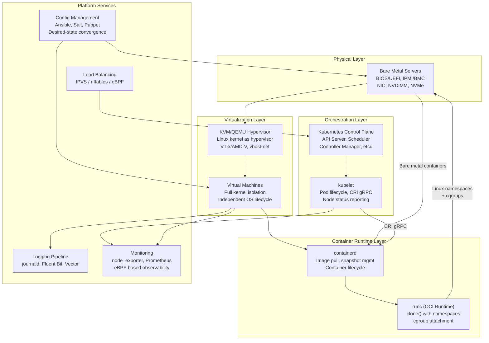
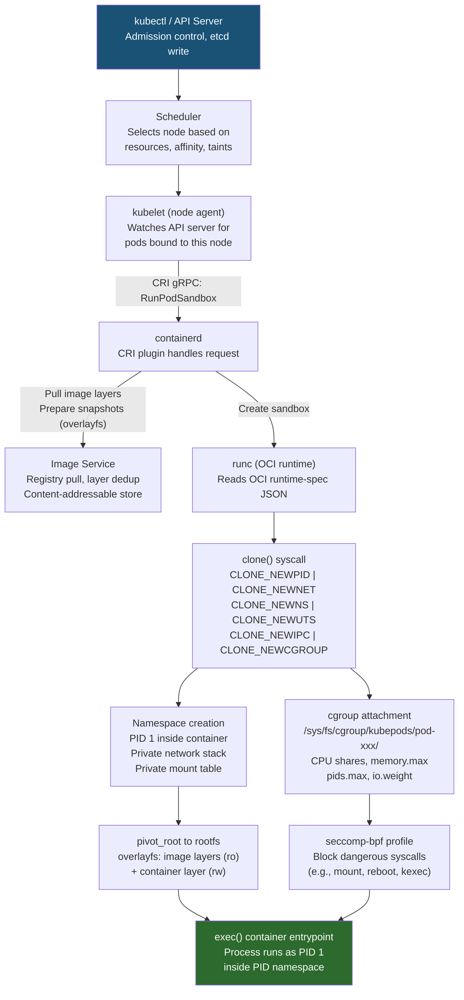
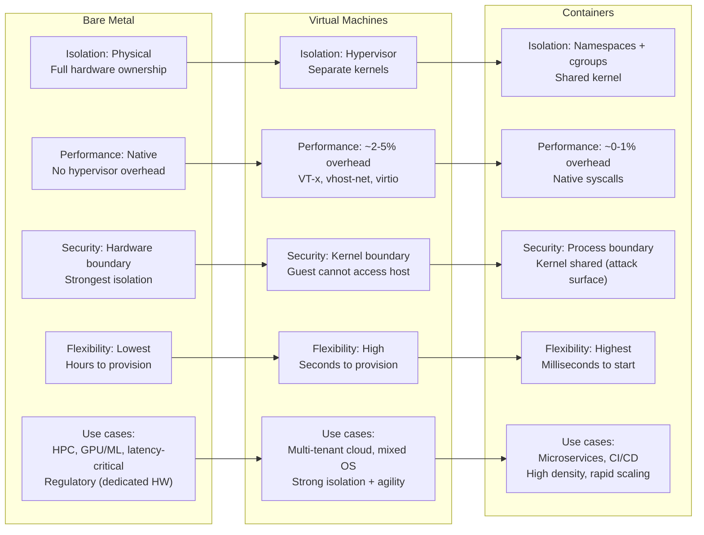
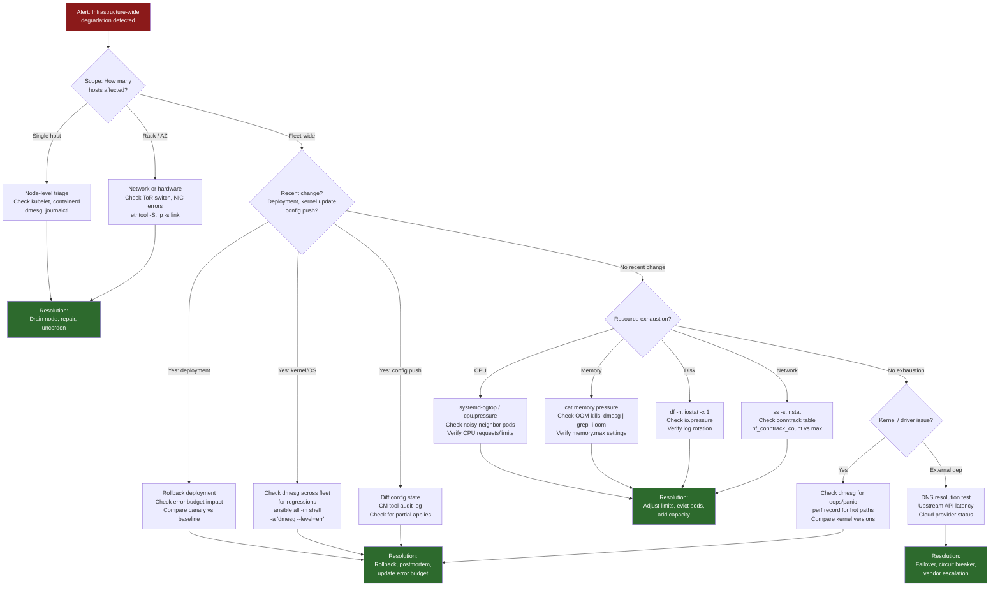
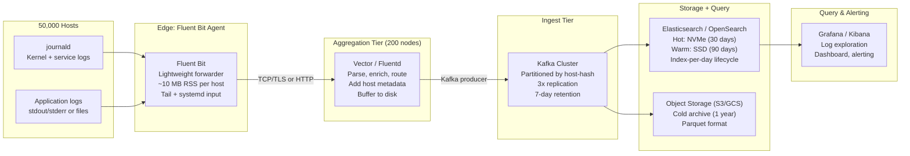
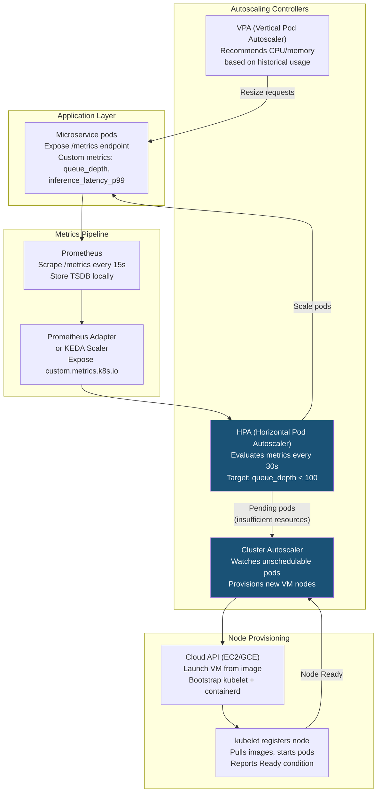
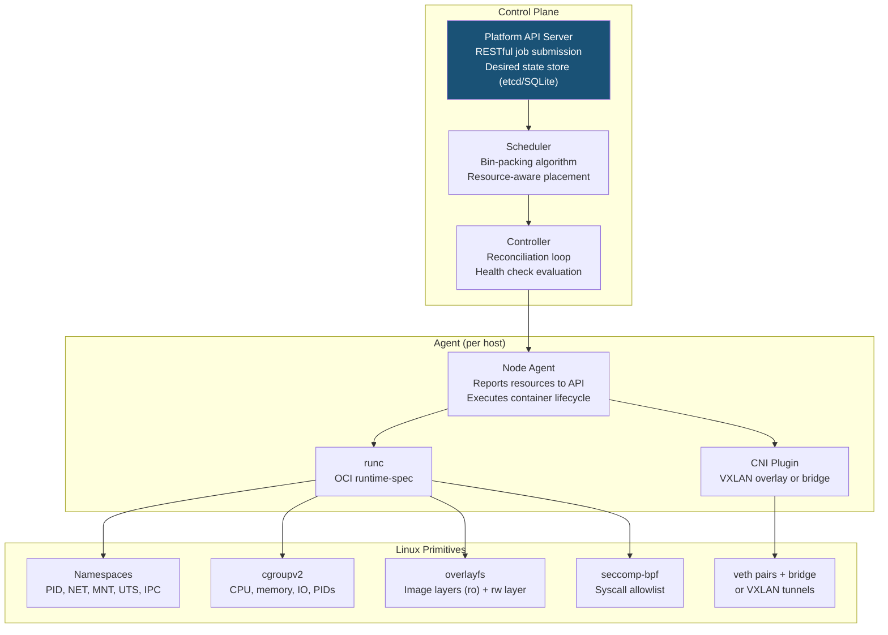
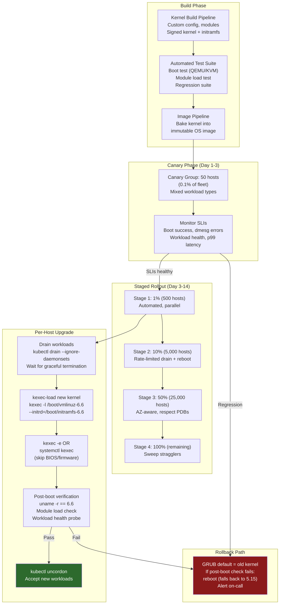
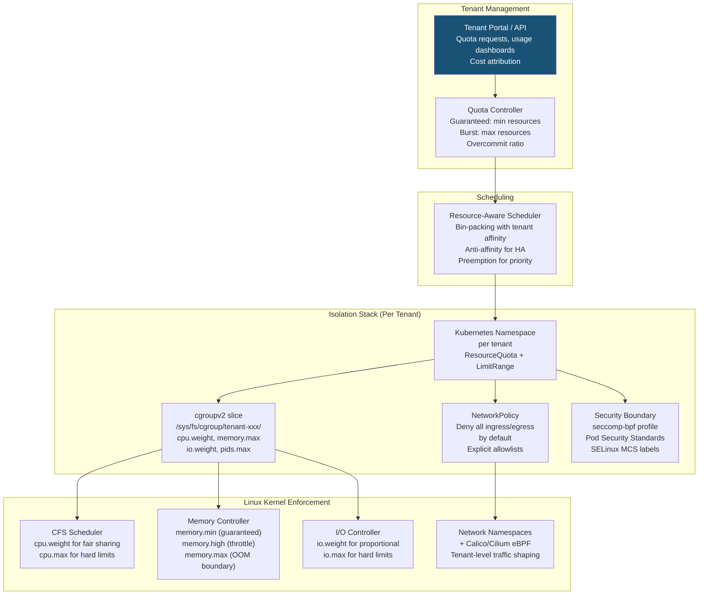

# Topic 10: System Design Scenarios -- Infrastructure Architecture, Containers, Fleet Management, and Capacity Planning

> **Target Audience:** Senior SRE / Staff+ Cloud Engineers (10+ years experience)
> **Depth Level:** Principal Engineer interview preparation
> **Cross-references:** [Fundamentals](../00-fundamentals/fundamentals.md) | [Process Management](../01-process-management/process-management.md) | [CPU Scheduling](../02-cpu-scheduling/cpu-scheduling.md) | [Memory Management](../03-memory-management/memory-management.md) | [Filesystem & Storage](../04-filesystem-and-storage/filesystem-and-storage.md) | [LVM](../05-lvm/lvm.md) | [Networking](../06-networking/networking.md) | [Kernel Internals](../07-kernel-internals/kernel-internals.md) | [Performance & Debugging](../08-performance-and-debugging/performance-and-debugging.md) | [Security](../09-security/security.md)

---

<!-- toc -->
## Table of Contents

- [1. Concept (Senior-Level Understanding)](#1-concept-senior-level-understanding)
  - [Linux as the Foundation of Modern Infrastructure](#linux-as-the-foundation-of-modern-infrastructure)
  - [SRE Reliability Framework](#sre-reliability-framework)
  - [Infrastructure Architecture Overview](#infrastructure-architecture-overview)
- [2. Internal Working](#2-internal-working)
  - [2.1 Kubernetes Node Architecture: From API Call to Running Container](#21-kubernetes-node-architecture-from-api-call-to-running-container)
  - [2.2 Compute Spectrum: Bare Metal to VMs to Containers](#22-compute-spectrum-bare-metal-to-vms-to-containers)
  - [2.3 Configuration Drift and Convergence](#23-configuration-drift-and-convergence)
- [3. Commands (Infrastructure Tooling)](#3-commands-infrastructure-tooling)
  - [Kubernetes / Container Runtime](#kubernetes-container-runtime)
  - [cgroup Management (cgroupv2)](#cgroup-management-cgroupv2)
  - [Namespace Inspection](#namespace-inspection)
  - [Fleet Management and Systemd](#fleet-management-and-systemd)
- [4. Debugging (Infrastructure-Level Triage)](#4-debugging-infrastructure-level-triage)
  - [Infrastructure Issue Triage Flowchart](#infrastructure-issue-triage-flowchart)
  - [Fleet-Wide Debugging Toolkit](#fleet-wide-debugging-toolkit)
  - [Correlating Across Layers](#correlating-across-layers)
- [5. Design Scenarios](#5-design-scenarios)
  - [Scenario 1: Design a Log Aggregation Pipeline for 50,000 Hosts](#scenario-1-design-a-log-aggregation-pipeline-for-50000-hosts)
  - [Scenario 2: Design Auto-Scaling Infrastructure with Custom Metrics](#scenario-2-design-auto-scaling-infrastructure-with-custom-metrics)
  - [Scenario 3: Design a Container Platform from Scratch (No Kubernetes)](#scenario-3-design-a-container-platform-from-scratch-no-kubernetes)
  - [Scenario 4: Design Fleet-Wide Kernel Upgrade Rollout (Zero Downtime)](#scenario-4-design-fleet-wide-kernel-upgrade-rollout-zero-downtime)
  - [Scenario 5: Design Multi-Tenant Compute Platform with Resource Isolation](#scenario-5-design-multi-tenant-compute-platform-with-resource-isolation)
- [6. Interview Questions](#6-interview-questions)
  - [Q1: You are designing a log pipeline for 50,000 Linux hosts. Walk through your architecture, explaining each layer's purpose and the Linux-specific decisions.](#q1-you-are-designing-a-log-pipeline-for-50000-linux-hosts-walk-through-your-architecture-explaining-each-layers-purpose-and-the-linux-specific-decisions)
  - [Q2: Explain the Kubernetes container startup chain from `kubectl run` to a running process. What Linux primitives does each step use?](#q2-explain-the-kubernetes-container-startup-chain-from-kubectl-run-to-a-running-process-what-linux-primitives-does-each-step-use)
  - [Q3: Compare bare metal, VMs, and containers. When would you recommend each for production workloads?](#q3-compare-bare-metal-vms-and-containers-when-would-you-recommend-each-for-production-workloads)
  - [Q4: How do cgroups v2 provide multi-tenant resource isolation? Explain the specific controllers and their semantics.](#q4-how-do-cgroups-v2-provide-multi-tenant-resource-isolation-explain-the-specific-controllers-and-their-semantics)
  - [Q5: Describe how you would design a fleet-wide kernel upgrade process for 50,000 hosts with zero user-facing downtime.](#q5-describe-how-you-would-design-a-fleet-wide-kernel-upgrade-process-for-50000-hosts-with-zero-user-facing-downtime)
  - [Q6: What is the difference between `memory.min`, `memory.low`, `memory.high`, and `memory.max` in cgroups v2? Design a configuration for a production service.](#q6-what-is-the-difference-between-memorymin-memorylow-memoryhigh-and-memorymax-in-cgroups-v2-design-a-configuration-for-a-production-service)
  - [Q7: How would you detect and remediate configuration drift across a fleet of 10,000 Linux hosts?](#q7-how-would-you-detect-and-remediate-configuration-drift-across-a-fleet-of-10000-linux-hosts)
  - [Q8: Design the networking layer for a container platform. How do you provide cross-host container connectivity?](#q8-design-the-networking-layer-for-a-container-platform-how-do-you-provide-cross-host-container-connectivity)
  - [Q9: What is an error budget and how does it drive infrastructure decisions?](#q9-what-is-an-error-budget-and-how-does-it-drive-infrastructure-decisions)
  - [Q10: Explain PSI (Pressure Stall Information) and how you would use it for fleet-wide capacity planning.](#q10-explain-psi-pressure-stall-information-and-how-you-would-use-it-for-fleet-wide-capacity-planning)
  - [Q11: How would you build a container from scratch using only Linux syscalls?](#q11-how-would-you-build-a-container-from-scratch-using-only-linux-syscalls)
  - [Q12: You observe intermittent OOM kills on Kubernetes nodes. How do you investigate and resolve this?](#q12-you-observe-intermittent-oom-kills-on-kubernetes-nodes-how-do-you-investigate-and-resolve-this)
  - [Q13: How does Linux overlayfs work and why is it critical for containers?](#q13-how-does-linux-overlayfs-work-and-why-is-it-critical-for-containers)
  - [Q14: Describe immutable infrastructure and its Linux implementation.](#q14-describe-immutable-infrastructure-and-its-linux-implementation)
  - [Q15: Design capacity planning for a platform serving 200 teams on shared infrastructure.](#q15-design-capacity-planning-for-a-platform-serving-200-teams-on-shared-infrastructure)
  - [Q16: Security implications of shared kernel in containers. How do you mitigate?](#q16-security-implications-of-shared-kernel-in-containers-how-do-you-mitigate)
- [7. Gotchas and Pitfalls](#7-gotchas-and-pitfalls)
- [8. Pro Tips (Staff+ Level)](#8-pro-tips-staff-level)
- [9. Quick Reference / Cheatsheet](#9-quick-reference-cheatsheet)

<!-- toc stop -->

## 1. Concept (Senior-Level Understanding)

### Linux as the Foundation of Modern Infrastructure

Every infrastructure decision -- bare metal provisioning, VM placement, container orchestration, fleet management -- maps to a Linux kernel primitive. A pod is namespaces and cgroups; a VM is a KVM/QEMU process scheduled by CFS; a load balancer is a netfilter/nftables ruleset. This topic ties all preceding topics into infrastructure-scale system design.

Three architectural principles govern Linux infrastructure at scale:

1. **Isolation through composition.** Linux offers namespaces (mount, PID, network, IPC, UTS, user, cgroup, time), cgroups (CPU, memory, I/O, PIDs), seccomp-bpf, and LSM hooks. Container runtimes, VMs, and multi-tenant platforms compose these primitives differently. The design question: which primitives, at what granularity, with what failure modes?

2. **Observability as a first-class constraint.** Every design must answer: how do you detect degradation before users do? SLI/SLO-driven alerting, fleet-wide telemetry, kernel tracing (eBPF, ftrace, perf), and structured logging -- designed before the first workload lands.

3. **Immutability and convergence.** At 50,000 hosts, drift is the default state unless actively prevented. Immutable images (built once, deployed everywhere) and convergent configuration management (desired-state enforcement) are the two strategies.

### SRE Reliability Framework

| Concept | Definition | Linux Infrastructure Example |
|---|---|---|
| **SLI** (Service Level Indicator) | Quantitative measure of service behavior | p99 request latency, packet loss rate, filesystem I/O latency |
| **SLO** (Service Level Objective) | Target value for an SLI | p99 latency < 200ms for 99.9% of 5-minute windows |
| **SLA** (Service Level Agreement) | Business contract with consequences | 99.95% monthly availability; breach triggers credit |
| **Error Budget** | 1 - SLO; permitted unreliability | 99.9% SLO = 43.2 min/month of allowed downtime |

Error budgets balance reliability with velocity. Budget available: ship features. Budget exhausted: freeze deployments, invest in reliability. Every scenario below includes SLI/SLO definitions.

### Infrastructure Architecture Overview




---

## 2. Internal Working

### 2.1 Kubernetes Node Architecture: From API Call to Running Container

When `kubectl run nginx --image=nginx` executes, this chain fires on the target node. Every step maps to a Linux primitive.



**Key Linux primitives in the chain:**

| Step | Syscall / Mechanism | Kernel Subsystem |
|---|---|---|
| Namespace creation | `clone()` with `CLONE_NEW*` flags | `kernel/nsproxy.c` |
| cgroup attachment | `mkdir` + write to cgroup fs | `kernel/cgroup/` |
| Filesystem isolation | `pivot_root()` + overlayfs mount | VFS, overlayfs |
| Syscall filtering | `prctl(PR_SET_SECCOMP)` | seccomp-bpf |
| Network isolation | veth pair + bridge or CNI plugin | `net/core/`, `net/bridge/` |
| Resource limits | `memory.max`, `cpu.max` in cgroupv2 | `mm/memcontrol.c`, `kernel/sched/` |

### 2.2 Compute Spectrum: Bare Metal to VMs to Containers

The choice is a spectrum of isolation strength vs. resource efficiency. Each point composes different Linux primitives.



**Decision framework:**

| Dimension | Bare Metal | VM | Container | Containers-on-VMs |
|---|---|---|---|---|
| **Isolation** | Physical | Hypervisor (separate kernels) | Namespace (shared kernel) | Both (defense in depth) |
| **Startup time** | 5-30 min (PXE) | 5-30 sec | 50-500 ms | Seconds + ms |
| **Density** | 1/host | 10-50/host | 100-1000/host | 10-50 VMs x containers |
| **Kernel vuln blast** | Isolated | Per VM | All containers | 1 VM |
| **Live migration** | No | Yes (QEMU) | CRIU | Yes (VM layer) |
| **FAANG usage** | GPU, storage | Strong isolation | Microservices (90%+) | Production K8s nodes |

Industry standard at scale: **containers-on-VMs**. GKE, EKS, and AKS all use this model.

### 2.3 Configuration Drift and Convergence

At fleet scale (10,000+ hosts), every host touched by a human has drifted: divergent `sysctl` values, stale packages, orphaned cron jobs, modified `/etc/` files, manually loaded kernel modules.

| Strategy | Mechanism | Strength | Weakness |
|---|---|---|---|
| **Convergent** | Ansible/Puppet/Salt enforces desired state periodically | Fixes drift in-place; works on legacy | Drift between runs; agent overhead |
| **Immutable** | New image built, old host replaced | No drift by construction; auditable | Requires image pipeline; stateful migration |

Modern fleets use **both**: immutable base OS + convergent management for runtime config (certificates, DNS, feature flags).

---

## 3. Commands (Infrastructure Tooling)

### Kubernetes / Container Runtime

```bash
# Node inspection
kubectl get nodes -o wide                          # Node status, kernel, runtime
kubectl describe node <node>                       # Resources, taints, conditions
kubectl top nodes                                  # CPU/memory per node
kubectl debug node/<node> -it --image=busybox      # Debug shell on node

# Pod debugging
kubectl exec -it <pod> -- /bin/sh                  # Shell into container
kubectl logs <pod> -c <container> --previous       # Crashed container logs
kubectl describe pod <pod> | grep -A5 "Limits\|Requests"  # Resource limits

# Container runtime (crictl -> containerd via CRI)
crictl ps                                          # Running containers
crictl inspect <id> | jq '.info.runtimeSpec.linux' # Namespace/cgroup config
crictl stats                                       # Container resource usage

# Low-level OCI runtime
runc list                                          # Containers managed by runc
runc state <id>                                    # PID, cgroup path, status
```

### cgroup Management (cgroupv2)

```bash
# Inspect cgroup hierarchy
ls /sys/fs/cgroup/                                 # Root cgroup controllers
cat /sys/fs/cgroup/cgroup.controllers              # Available controllers
cat /sys/fs/cgroup/cgroup.subtree_control          # Enabled for children

# Kubernetes pod cgroups
find /sys/fs/cgroup/kubepods.slice -name "memory.max" -exec sh -c 'echo "$1: $(cat $1)"' _ {} \;
cat /sys/fs/cgroup/kubepods.slice/kubepods-burstable.slice/kubepods-burstable-pod<uid>.slice/memory.current
cat /sys/fs/cgroup/kubepods.slice/kubepods-burstable.slice/kubepods-burstable-pod<uid>.slice/cpu.stat

# Manual cgroup creation (for custom isolation)
mkdir /sys/fs/cgroup/mygroup
echo "+cpu +memory +io +pids" > /sys/fs/cgroup/mygroup/cgroup.subtree_control
echo "100000 1000000" > /sys/fs/cgroup/mygroup/cpu.max       # 10% CPU (100ms per 1s)
echo "536870912" > /sys/fs/cgroup/mygroup/memory.max          # 512 MiB hard limit
echo "268435456" > /sys/fs/cgroup/mygroup/memory.high         # 256 MiB soft limit (throttle)
echo "100" > /sys/fs/cgroup/mygroup/pids.max                  # Max 100 processes
echo $$ > /sys/fs/cgroup/mygroup/cgroup.procs                 # Move current process

# Monitor cgroup pressure (PSI)
cat /sys/fs/cgroup/kubepods.slice/cpu.pressure                # CPU pressure stall info
cat /sys/fs/cgroup/kubepods.slice/memory.pressure             # Memory pressure stall info
cat /sys/fs/cgroup/kubepods.slice/io.pressure                 # I/O pressure stall info
```

### Namespace Inspection

```bash
# List namespaces of a process
ls -la /proc/<pid>/ns/                             # All namespace inodes
lsns                                               # System-wide namespace listing
lsns -t net                                        # Network namespaces only

# Enter a container's namespaces
nsenter -t <pid> -n ip addr show                   # Enter net namespace, show interfaces
nsenter -t <pid> -m -p ps aux                      # Enter mount + PID namespace
nsenter -t <pid> -a                                # Enter all namespaces

# Create namespaces manually
unshare --mount --pid --fork --mount-proc /bin/bash  # New mount + PID namespace
ip netns add test-ns                               # Create network namespace
ip netns exec test-ns ip link                      # Run command in net namespace
```

### Fleet Management and Systemd

```bash
# Systemd service management
systemctl list-units --failed                        # Failed services
systemd-cgtop                                        # Top-like cgroup view
systemctl show <svc> -p MemoryMax -p CPUQuota        # Service resource limits
systemctl set-property <svc> MemoryMax=1G CPUQuota=200%  # Runtime change

# Journal queries
journalctl -u kubelet --since "1 hour ago" --no-pager  # kubelet logs
journalctl -k --priority=err                           # Kernel errors only

# Fleet-wide (Ansible ad-hoc)
ansible all -m shell -a "uname -r"                     # Kernel versions fleet-wide
ansible all -m shell -a "cat /proc/pressure/cpu"       # CPU pressure fleet-wide
ansible all -m shell -a "dmesg --level=err | tail -5"  # Recent kernel errors
```

---

## 4. Debugging (Infrastructure-Level Triage)

### Infrastructure Issue Triage Flowchart

Systematic triage for fleet-wide degradation (e.g., "20% of pods failing health checks"):



### Fleet-Wide Debugging Toolkit

| Symptom | Investigation Commands | What to Look For |
|---|---|---|
| Pods OOMKilled across nodes | `dmesg \| grep -i oom`, `cat /sys/fs/cgroup/kubepods.slice/*/memory.events` | `oom_kill` counter > 0, `memory.max` too low vs actual usage |
| High p99 latency spike | `perf record -g -p <pid>`, `cat cpu.pressure`, `mpstat -P ALL 1` | CPU throttling (`nr_throttled` in `cpu.stat`), steal time in VMs |
| Container startup failures | `crictl logs <id>`, `journalctl -u containerd`, `dmesg \| grep -i overlayfs` | Image pull failures, overlayfs mount errors, PID exhaustion |
| Network partition | `conntrack -C`, `nstat \| grep -i drop`, `ethtool -S <nic>` | Conntrack table full, NIC ring buffer drops, TCP retransmits |
| Disk I/O stalls | `cat /sys/fs/cgroup/*/io.pressure`, `iostat -x 1`, `blktrace` | io.pressure `some` or `full` > 10%, await > 50ms, queue depth saturation |

### Correlating Across Layers

Principal-level skill: correlate across the stack. Example: pod health checks fail --> kubelet NotReady --> containerd image pull timeout --> NIC RX drops in `ethtool -S` --> ToR switch firmware bug. Resolution: switch firmware upgrade, not a Kubernetes change.

Always start with: **What changed? What is the blast radius? What layer is the root cause?**

---

## 5. Design Scenarios

### Scenario 1: Design a Log Aggregation Pipeline for 50,000 Hosts

**Requirements:**
- Ingest structured logs from 50,000 Linux hosts (mix of bare metal, VMs, containers)
- Average 10 KB/sec per host = ~500 MB/sec aggregate, ~43 TB/day
- Retention: 30 days hot (searchable), 1 year cold (archival)
- Latency: logs searchable within 60 seconds of generation
- Reliability: no log loss during single-node failures

**Architecture:**




### 1. Hosts & Edge Collection (The Source)
* **Hosts:** This is where your applications and services run. They generate raw data, such as standard **Application Logs** and system-level **Journald Logs**.
* **Edge Collection (Fluent Bit Agent):** Instead of having the applications send logs directly over the network, a lightweight agent like Fluent Bit sits on the edge (often as a DaemonSet in container orchestration environments). Its primary job is to quickly tail files, collect the logs, and forward them out of the host with minimal CPU and memory overhead.

### 2. Aggregation Tier (Processing & Routing)
* **Vector or Fluentd:** The edge agents send data over TCP or TLS to this heavier aggregation tier. Tools like Vector or Fluentd act as the central processing hub. They parse the raw text into structured JSON, filter out noise/debug logs to save storage costs, enrich the logs with metadata (like IP addresses or container IDs), and route them to the next destination.

### 3. Ingest Tier (The Buffer)
* **Kafka Cluster:** This is a critical component for system reliability. Aggregators act as "Kafka producers," sending the structured logs into a Kafka topic. Kafka serves as a highly durable, high-throughput message queue. 
    * **Why it's here:** If there is a sudden spike in log traffic, or if the storage layer goes down for maintenance, Kafka buffers the data. It prevents the edge and aggregation layers from crashing under backpressure and ensures no logs are lost.

### 4. Storage Layer (Tiered Retention)
Logs are pulled from Kafka into the storage layer, which is split into two paths for cost optimization:
* **Elasticsearch (Hot/Warm Data):** Highly indexed, fast storage used for recent logs that need to be searched or alerted on immediately. It's computationally expensive, so data usually only stays here for a short retention period (e.g., 7 to 30 days).
* **Object Storage (Cold Archive):** Cheap, highly durable storage (like AWS S3 or GCS) used for long-term retention and compliance. If you need to investigate an incident from six months ago, you would rehydrate data from here.

### 5. Query and Alerting (The Interface)
* **Grafana or Kibana:** This is the visualization layer. Engineers and operators use these dashboards to query the hot/warm data in Elasticsearch, set up alerts for error spikes, and troubleshoot live system issues.

**Linux-specific decisions:**
1. **journald as universal collector** -- Fluent Bit reads via `systemd` input plugin with cursor tracking (exactly-once).
2. **Fluent Bit over Fluentd** -- C-based, ~10 MB RSS vs ~60 MB (Ruby). At 50K hosts, saves ~2.5 TB fleet-wide agent memory.
3. **Kernel ring buffer** -- `kmsg` input captures hardware errors, OOM kills, driver messages.
4. **Disk-backed buffering** -- filesystem queues survive aggregator outages. 1 GB local buffer per host.
5. **Log rotation** -- `copytruncate` for apps holding FDs. `SystemMaxUse=2G` in `journald.conf`.

**Failure modes:** Aggregator down = local buffer (delayed, not lost). Kafka broker loss = 3x replication covers single failure. Network partition = exponential backoff retry.

**SLIs/SLOs:** Ingestion latency < 60s (99%). Log delivery > 99.99%.

---

### Scenario 2: Design Auto-Scaling Infrastructure with Custom Metrics

**Requirements:**
- Platform runs 3,000 microservices on Kubernetes
- Scale based on custom application metrics (queue depth, inference latency), not just CPU/memory
- Scale-up latency: new pod serving traffic within 120 seconds
- Scale-down with safety: no premature termination of in-flight requests
- Cluster auto-scaling: add/remove nodes when pod-level scaling is insufficient

**Architecture:**




This diagram illustrates a complete, multi-dimensional **Kubernetes Autoscaling Architecture**. It shows how a cluster dynamically adjusts its capacity at both the application (Pod) level and the infrastructure (Node) level based on real-time demand. 

Mastering this interplay between metrics, pod scaling, and node provisioning is a core system design concept and foundational knowledge for advanced cluster management (and certifications like the CKA).

Here is the breakdown of how these components interact:

### 1. The Metrics Pipeline (The Observers)
Before the cluster can scale, it needs to know what's happening. 
* **Application Layer:** Your microservice pods expose telemetry data (like requests per second or queue length).
* **Prometheus & Prometheus Adapter:** Prometheus scrapes these metrics at a regular interval (every 15s). Because Kubernetes doesn't natively understand Prometheus metrics, the **Prometheus Adapter** translates them into a format the Kubernetes API can read (Custom Metrics). 

### 2. Pod-Level Autoscaling (The Decision Makers)
Once the cluster has the metrics, it uses two distinct controllers to adjust the application footprint:
* **Horizontal Pod Autoscaler (HPA):** This reads the custom metrics and scales *out* or *in*. If traffic spikes, HPA increases the number of Pod replicas.
* **Vertical Pod Autoscaler (VPA):** Instead of adding more pods, the VPA scales *up* or *down*. It observes the actual CPU and memory usage of your pods and resizes their resource `requests` and `limits` so they have exactly what they need without wasting capacity. *(Note: Typically, you avoid running HPA and VPA on the exact same metrics to prevent them from fighting each other).*

### 3. Cluster-Level Autoscaling (The Infrastructure Builders)
The HPA can request as many new pods as it wants, but if the underlying physical or virtual servers (Nodes) are full, those pods have nowhere to go.
* **Cluster Autoscaler (CA):** The CA watches for pods that are stuck in a **"pending"** state because of insufficient CPU or memory on existing nodes.
* **Node Provisioning:** When the CA sees pending pods, it signals the **Cloud API** (e.g., AWS EC2, GCP Compute Engine) to launch a new Virtual Machine. 
* Once the VM boots, the **Kubelet** process starts, registers the new node as "Ready" with the cluster, and the pending pods are finally scheduled and run.


**Linux-specific decisions:**
1. **cgroupv2 memory.high for graceful degradation** -- VPA sets `memory.high` (soft limit) below `memory.max` (hard limit). When a pod exceeds `memory.high`, the kernel throttles allocation and triggers reclaim rather than OOM-killing. This gives the application time to adapt.
2. **CPU bandwidth control** -- HPA scales pod replicas, but each pod's CPU is bounded by `cpu.max` in cgroupv2. Setting `cpu.max` to `200000 100000` gives 2 CPUs. CFS bandwidth throttling (`nr_throttled` in `cpu.stat`) is an SLI for "pod needs more CPU."
3. **Graceful termination** -- `preStop` hooks + `SIGTERM` handling + `terminationGracePeriodSeconds`. The kernel delivers SIGTERM; the application drains connections. After the grace period, SIGKILL. Readiness probe removal happens before SIGTERM so the service mesh stops routing traffic.
4. **Node bootstrap optimization** -- Immutable node images with containerd cache pre-warmed. Critical container images pre-pulled. Reduces node-to-ready time from 5+ minutes to ~90 seconds. Uses `cloud-init` for kubelet configuration and certificate bootstrap.
5. **PSI (Pressure Stall Information)** -- Monitor `/proc/pressure/cpu`, `/proc/pressure/memory`, `/proc/pressure/io` as fleet-wide SLIs. Scaling decisions can incorporate PSI: if `some` CPU pressure exceeds 25% sustained, the node is overcommitted.

**Failure modes:** Metrics lag = HPA uses stale data (mitigate with staleness detection). Thundering herd = buffer nodes with low-priority placeholder pods. Scale-down race = PDB + connection draining + readiness gate.

**SLIs/SLOs:** Scale-up within 120s (95%). Zero request drops during scale-down.

---

### Scenario 3: Design a Container Platform from Scratch (No Kubernetes)

**Requirements:**
- Run 5,000 containerized workloads across 500 hosts
- No Kubernetes dependency -- build on Linux primitives directly
- Support resource isolation, health checking, basic scheduling
- Support rolling deployments with rollback
- Network connectivity between containers across hosts

**Architecture:**




This diagram outlines a custom container orchestration engine built directly on top of fundamental Linux kernel features. Stripping away the abstraction of modern, off-the-shelf orchestrators and designing the system from first principles is one of the most effective ways to master system design and fully grasp the mechanics of workload scheduling.

To meet the requirements of running 5,000 workloads across 500 hosts with rolling deployments and strict isolation, this architecture divides responsibilities into a centralized brain, a distributed worker agent, and the underlying OS kernel.

Here is a breakdown of how this custom platform functions:

### 1. The Control Plane (The Global State)
This tier is responsible for cluster-wide decisions, maintaining the declarative state, and orchestrating rollouts.

* **Platform API Server:** The central entry point. Engineers submit the desired state here (e.g., "Deploy 10 instances of Service A, version 2.0"). This component typically persists data in a highly available key-value store (like etcd or Consul) to maintain state across the 500 hosts.
* **Scheduler:** Responsible for the bin-packing algorithm. When the API Server registers a new job, the Scheduler evaluates the fleet of 500 hosts, filtering out those lacking sufficient CPU/Memory, and ranks the remaining nodes to find the optimal placement for the workload. 
* **Controller:** The engine of the **reconciliation loop**. It constantly compares the *desired* state (in the API Server) with the *actual* state reported by the nodes. 
    * *Rolling Deployments & Rollbacks:* To satisfy the scenario requirement, the Controller manages the rollout logic. It instructs the API to scale up version `v2` on new nodes while gracefully terminating `v1` workloads, pausing or reversing the process if health checks fail.

### 2. The Node Agent Layer (The Local Manager)
Running on every single one of the 500 hosts, this daemon translates the Controller's declarative instructions into imperative actions. If you are familiar with Kubernetes architecture, this is essentially a custom-built `kubelet`.

* **Node Agent:** Receives the allocation instructions. It is responsible for executing local health checks on the running processes and reporting node capacity and workload status back to the Control Plane.
* **OCI Runtime (e.g., runc, crun):** The Node Agent delegates the actual creation and lifecycle management of the container to an Open Container Initiative (OCI) compliant runtime. 
* **CNI Plugin (Container Network Interface):** Handles the scenario's cross-host network connectivity requirement. The Node Agent calls the CNI plugin to attach the newly created container to an overlay network (e.g., VXLAN or BGP routing), ensuring it gets an IP address capable of reaching containers on the other 499 hosts.

### 3. Linux Primitives (The Engine)
Containers are not physical constructs; they are just Linux processes wrapped in specialized kernel features. The OCI Runtime interacts directly with these primitives to satisfy the isolation and resource requirements:

* **Namespaces:** Provide *isolation*. They trick the process into thinking it has its own dedicated operating system. The OCI runtime configures PID namespaces (hiding other processes), Mount namespaces (isolating the filesystem), and Network namespaces (providing an isolated network stack).
* **Cgroups v2 (Control Groups):** Provide *resource limits*. This satisfies the scenario's requirement to prevent noisy neighbors. Cgroups ensure that a specific workload cannot consume more CPU cycles or memory than the Scheduler allocated to it.
* **Overlay Filesystem:** Allows multiple containers to share the same underlying base image (read-only) while giving each container its own writable top layer, massively saving disk space across the fleet.
* **Seccomp BPF:** Acts as a security boundary by filtering the system calls the containerized process is allowed to make to the Linux kernel, preventing privilege escalation.


**Linux-specific decisions:**
1. **Container lifecycle without Docker/containerd:**
   - Pull image: HTTP GET from OCI registry, untar layers into content-addressable store
   - Prepare rootfs: Stack layers using `mount -t overlay overlay -o lowerdir=...,upperdir=...,workdir=... /merged`
   - Create container: Write OCI runtime-spec `config.json` with namespace, cgroup, seccomp, and mount configuration
   - Start: `runc create <id> && runc start <id>` -- runc calls `clone()` with appropriate `CLONE_NEW*` flags
   - Health check: Agent sends HTTP/TCP/exec probe; on failure, `runc kill <id> SIGTERM` then recreate

2. **Networking without Kubernetes CNI abstraction:**
   - Option A (single host): `brctl addbr platform0`, create veth pair per container, attach one end to bridge, other to container net namespace
   - Option B (multi-host): VXLAN overlay: `ip link add vxlan0 type vxlan id 42 dstport 4789 dev eth0`, bridge VXLAN interface per host, route container subnets via host routing table
   - DNS: Run `dnsmasq` per host, inject `/etc/resolv.conf` into container mount namespace

3. **Resource management without kubelet:**
   - Create cgroupv2 hierarchy: `/sys/fs/cgroup/platform/<job-id>/`
   - Set `cpu.max`, `memory.max`, `memory.high`, `pids.max`, `io.weight`
   - Monitor `memory.events` for OOM events, `cpu.stat` for throttling
   - Agent reports cgroup metrics to control plane every 10 seconds

4. **Rolling deployment:**
   - Controller maintains desired count per job (e.g., 10 instances)
   - Rolling update: start 1 new instance, health check passes, kill 1 old instance, repeat
   - Rollback: if 3 consecutive new instances fail health check, stop rollout, restore old count
   - State tracked in etcd/SQLite with generation numbers

5. **Security baseline:**
   - All containers run as non-root user (`user` namespace mapping)
   - seccomp-bpf profile: deny `mount`, `reboot`, `kexec_load`, `init_module`, `ptrace`
   - Drop all capabilities except `CAP_NET_BIND_SERVICE` (if needed)
   - Read-only rootfs (`runc` config: `"readonly": true`), writable `/tmp` via tmpfs

**Failure modes:** Agent crash = host marked unhealthy after 3 missed heartbeats, containers rescheduled. OOM = detected via `memory.events` inotify, restart with backoff. Network partition = containers continue, agent caches last-known-good state.

**SLIs/SLOs:** Container start < 5s (99%). Health check pass rate > 99.9%.

---

### Scenario 4: Design Fleet-Wide Kernel Upgrade Rollout (Zero Downtime)

**Requirements:**
- 50,000 hosts running mixed workloads (Kubernetes nodes, bare metal database servers, GPU compute)
- Upgrade kernel from 5.15 LTS to 6.6 LTS
- Zero user-facing downtime during the rollout
- Rollback capability within 5 minutes per host
- Full fleet upgraded within 14 days

**Architecture:**




This architecture represents a highly mature, site reliability engineering approach to infrastructure lifecycle management. Upgrading the kernel across a massive, heterogeneous fleet without dropping user traffic requires a delicate balance of aggressive automation, strict blast radius control, and deep OS-level optimizations. 

Here is a breakdown of how this pipeline functions and how it specifically satisfies your scenario's demanding requirements.

### 1. The Global Rollout Strategy (Blast Radius Mitigation)
Upgrading 50,000 nodes requires an exponential rollout strategy to catch edge-case regressions before they become fleet-wide outages.

* **Build Phase:** The new 6.6 LTS kernel is compiled, passed through automated test suites, and baked into an immutable OS image.
* **Canary Phase:** The new image is deployed to a tiny, highly monitored control group (e.g., 50 hosts). The system pauses here to monitor core Service Level Indicators (SLIs) like error rates, latency, and system load. If an anomaly is detected, the pipeline automatically halts and triggers a rollback.
* **Staged Rollout (1% → 10% → 50% → 100%):** Once the canary survives, the pipeline accelerates. Moving from 5.15 to 6.6 is a major jump; this phased approach ensures that rare kernel bugs affecting specific hardware profiles or niche workloads are caught early. To hit the 14-day deadline, the initial stages run for a few days to bake, while the final 50% stage can execute rapidly across tens of thousands of nodes in parallel.

### 2. Per-Host Execution (Zero Downtime & Fast Recovery)
The bottom layer of the diagram dictates what actually happens on individual servers, which is critical for meeting the "zero downtime" and "5-minute rollback" constraints.

* **Drain Workloads:** To achieve zero user-facing downtime, the nodes must be gracefully emptied before the upgrade begins. In a containerized environment, the node is cordoned (marked as unschedulable), and running pods are evicted. The cluster's scheduler seamlessly spins up replacement pods on other healthy nodes in the fleet before the target node goes offline. 
* **Load New Kernel & Execute Kexec:** This is the most critical technical mechanism in the diagram. A standard server reboot requires going through the hardware BIOS/UEFI POST sequence, which can take 5 to 15 minutes on large enterprise servers. **Kexec (Kernel Execution)** is a Linux feature that allows you to boot a new kernel directly from the currently running one, entirely bypassing the hardware initialization. This reduces reboot times from minutes to mere seconds. 
* **Post-Boot Verification & Uncordon:** Once the node is back up on the 6.6 kernel, a local daemon verifies system health. If it passes, the node is uncordoned and allowed to accept new scheduled workloads. If it fails (e.g., network drivers don't load), the fast Kexec mechanism is used to immediately pivot back to the known-good 5.15 kernel, easily satisfying the <5 minute rollback SLA.

**Linux-specific decisions:**
1. **kexec for fast reboot** -- `kexec` loads the new kernel into memory and jumps directly to it, bypassing BIOS/UEFI POST and bootloader. Reduces reboot time from 3-5 minutes to 15-30 seconds. Critical for meeting zero-downtime SLOs when draining 50,000 hosts.
   ```bash
   kexec -l /boot/vmlinuz-6.6.x --initrd=/boot/initramfs-6.6.x --reuse-cmdline
   kexec -e  # Execute the loaded kernel
   ```

2. **GRUB fallback for rollback** -- Set `GRUB_DEFAULT=saved` and `grub2-set-default` to the old kernel entry before kexec. If the new kernel fails post-boot checks, a standard reboot falls back to the old kernel automatically. Also configure `panic=10` kernel parameter so kernel panics trigger automatic reboot.

3. **Kexec Handover (KHO)** -- Linux 6.16+ preserves memory mappings across kernel transitions for stateful hosts. Fallback: live migration (VMs) or workload drain (containers).

4. **Kernel module compatibility** -- Out-of-tree modules (`nvidia.ko`, `mlx5_core.ko`) rebuilt against new headers. Test in QEMU. Use DKMS for automated rebuild.

5. **Staged rollout with circuit breaker:** Monitor boot success, `dmesg` errors, workload SLIs, OOM rate per stage. Halt if >1% fail post-boot. AZ-aware (max 33%). PDB-respected during drain.

**Failure modes:** Kernel panic = `panic=10` auto-reboots to GRUB fallback. Module failure = post-boot check detects, host reverted. Performance regression = canary SLIs halt rollout. kexec unsupported = fall back to standard reboot.

**SLIs/SLOs:** Host reboot < 5 min including drain (99%). Post-upgrade error rate delta < 0.1%.

---

### Scenario 5: Design Multi-Tenant Compute Platform with Resource Isolation

**Requirements:**
- Platform serves 200 internal teams (tenants) sharing a pool of 2,000 hosts
- Strong isolation: one tenant's workload must not degrade another's performance
- Fair resource sharing with burst capability
- Quota enforcement: each tenant has guaranteed and maximum resource allocations
- Security: tenants must not be able to access each other's data or network traffic

**Architecture:**




This architecture details a robust **multi-tenant compute platform**, heavily inspired by Kubernetes design patterns, that solves the classic "noisy neighbor" problem. When 200 teams share 2,000 hosts, you cannot rely on application-level logic to share resources fairly; you must enforce it at the operating system kernel level.

Here is a breakdown of how this architecture meets your scenario's strict requirements for isolation, burst capability, and security:

### 1. Tenant Management & Scheduling (The Control Plane)
Before a workload ever reaches a server, the platform must ensure the cluster isn't overbooked.
* **Tenant Portal & Quota Controller:** This is where the 200 teams interact with the platform. The Quota Controller acts as the bank manager. It ensures that a team cannot request more CPU or memory than their department paid for (their quota). It establishes the baseline for "fair sharing" across the entire 2,000-host fleet.
* **Resource Aware Scheduler:** When a workload is approved, this component acts as the dispatcher. It looks at the current resource utilization across all 2,000 hosts and places the workload on a host that has enough spare capacity to honor the tenant's requested resource guarantees.

### 2. The Isolation Stack (The Logical Boundaries)
Once the scheduler assigns a workload to a specific host, the local agent configures logical boundaries.
* **Kubernetes Namespace:** This provides a virtual cluster for each tenant. It scopes resources so Team A cannot even see the pods, secrets, or services belonging to Team B.
* **Network Policy & Security Boundary:** These satisfy your security requirement. Network Policies act as a distributed firewall, dropping all cross-tenant traffic by default. Security boundaries restrict the workload's privileges (e.g., preventing a container from running as the root user). 

### 3. Kernel Enforcement (The Physical Boundaries)
This is the most critical layer for performance isolation. Logical boundaries are useless if one tenant's infinite loop consumes 100% of the host's CPU. The architecture maps the logical "Cgroup Slices" down to fundamental Linux kernel features:
* **CFS Scheduler (Completely Fair Scheduler):** This handles CPU time. It allows you to set a **"weight" (guarantee)** and a **"limit" (ceiling)**. This satisfies your burst requirement. If the host is mostly idle, Tenant A can "burst" up to their ceiling. But if Tenant B suddenly needs their guaranteed CPU time, the CFS Scheduler immediately throttles Tenant A back down to their baseline, ensuring fair sharing.
* **Memory Controller:** Enforces hard RAM limits. If a tenant's application has a memory leak and exceeds its boundary, the kernel's OOM (Out of Memory) killer will terminate that specific process before it starves the rest of the host.
* **IO Controller:** Prevents disk contention. If Tenant A is heavily reading/writing to the disk, the IO controller throttles their throughput to ensure Tenant B's database queries aren't delayed by hardware bottlenecks.
* **Network Namespaces & eBPF:** Translates the logical Network Policies into low-level packet filtering rules right at the network interface, ensuring strict traffic isolation with very low overhead.

**Linux-specific decisions:**

1. **cgroupv2 hierarchical resource control:**
   ```
   /sys/fs/cgroup/
     kubepods.slice/
       tenant-alpha.slice/         # Tenant A: guaranteed 100 CPUs, max 200 CPUs
         cpu.weight = 10000        # Proportional share (relative to other tenants)
         cpu.max = 20000000 100000 # Hard cap: 200 CPUs
         memory.min = 107374182400 # 100 GiB guaranteed (cannot be reclaimed)
         memory.max = 214748364800 # 200 GiB hard limit
         pids.max = 50000          # Prevent fork bombs
       tenant-beta.slice/          # Tenant B: different allocation
         ...
   ```
   The key insight: `memory.min` provides guaranteed memory that the kernel will never reclaim, even under pressure. This is what separates "guaranteed" from "best-effort" tenancy.

2. **Noisy neighbor prevention:**
   - **CPU:** `cpu.weight` for proportional sharing during contention; `cpu.max` for absolute ceiling. CFS bandwidth throttling prevents burst from starving others.
   - **Memory:** `memory.high` triggers kernel reclaim (slowdown, not kill) before `memory.max` OOM. Prevents sudden OOM cascading.
   - **I/O:** `io.weight` for proportional BFQ scheduling; `io.max` for IOPS/bandwidth caps per device.
   - **Network:** eBPF-based traffic shaping (Cilium bandwidth manager) or `tc` with `htb` qdisc. Rate-limit egress per tenant cgroup.
   - **PIDs:** `pids.max` per tenant slice prevents fork bomb from exhausting PID space.

3. **Network isolation:**
   - Each tenant gets a Kubernetes namespace with `NetworkPolicy` defaulting to deny-all
   - Cilium eBPF enforces policies at the kernel level (no iptables overhead)
   - VXLAN or WireGuard encryption for cross-node tenant traffic
   - Tenant DNS isolation: CoreDNS with per-namespace views

4. **Security boundaries:**
   - SELinux Multi-Category Security (MCS): each tenant's pods get a unique MCS label (`s0:c<N>,c<M>`). Pods cannot access files or signals across MCS categories even if they escape the container.
   - Pod Security Standards: `restricted` profile enforced per namespace (no privileged containers, no host namespaces, no root)
   - seccomp-bpf: deny `mount`, `ptrace`, `kexec_load`, `init_module` for all tenant workloads
   - Read-only rootfs + `tmpfs` for `/tmp` and `/run`

5. **Quota and admission control:**
   - `ResourceQuota` per namespace: hard limits on CPU, memory, pod count, PVC count
   - `LimitRange` injects defaults for pods without explicit requests/limits
   - Admission webhook rejects quota violations and security policy breaches
   - Overcommit ratios: CPU 4:1, memory 1.5:1

**Failure modes:** Fork bomb = `pids.max` caps PID allocation. Noisy neighbor I/O = `io.weight` ensures BFQ fairness. Container escape = SELinux MCS + VM boundary. Quota gaming = admission webhook enforces minimum pod size.

**SLIs/SLOs:** Scheduling latency < 10s (99%). Cross-tenant impact < 5% latency degradation. Zero cross-tenant data access.

---

## 6. Interview Questions

### Q1: You are designing a log pipeline for 50,000 Linux hosts. Walk through your architecture, explaining each layer's purpose and the Linux-specific decisions.

1. **Collection layer:** Fluent Bit agent on every host (10 MB RSS vs 60 MB for Fluentd). Reads `journald` via systemd input plugin (cursor-based exactly-once tracking) and application logs via `tail` plugin with inotify-based file watching.
2. **Transport:** TLS-encrypted TCP to aggregation tier. At 50K hosts x 10 KB/s, aggregate bandwidth is ~500 MB/s. Partition across 200 aggregator nodes by consistent hashing on hostname.
3. **Aggregation:** Vector or Fluentd performs parsing (grok/regex), enrichment (add host metadata from `/etc/machine-id`, kernel version, cgroup path), filtering (drop debug logs in production), and routing to downstream sinks.
4. **Buffering:** Kafka cluster as durable buffer. 3x replication, partitioned by host hash. Decouples ingest rate from indexing rate. 7-day retention for replay capability.
5. **Storage:** Elasticsearch/OpenSearch with index-per-day lifecycle management. Hot tier (NVMe, 30 days) for active queries. Warm tier (SSD, 90 days) for archival queries. Cold tier (object storage, 1 year) for compliance.
6. **Linux-specific:** `journald` configured with `RateLimitIntervalSec=0` to prevent log suppression during incidents. `SystemMaxUse=2G` to prevent journal filling root. `logrotate` with `copytruncate` for apps holding file descriptors. Kernel ring buffer (`/dev/kmsg`) captured separately for hardware events and OOM kills.

---

### Q2: Explain the Kubernetes container startup chain from `kubectl run` to a running process. What Linux primitives does each step use?

1. **API Server:** Validates, authenticates, runs admission controllers, writes Pod spec to etcd
2. **Scheduler:** Evaluates node resources (from cgroup reported allocatable), affinity rules, taints/tolerations. Binds Pod to a node.
3. **kubelet:** Watches API server for Pods bound to its node. Calls containerd via CRI gRPC `RunPodSandbox`.
4. **containerd:** Pulls image layers from registry (HTTP GET), stores in content-addressable filesystem. Prepares overlayfs mount: read-only image layers as `lowerdir`, new writable layer as `upperdir`.
5. **runc:** Reads OCI runtime-spec (`config.json`). Calls `clone()` with `CLONE_NEWPID | CLONE_NEWNET | CLONE_NEWNS | CLONE_NEWUTS | CLONE_NEWIPC | CLONE_NEWCGROUP`.
6. **Namespace creation:** New PID namespace (container sees PID 1), new network namespace (private network stack), new mount namespace (private mount table via `pivot_root()`).
7. **cgroup attachment:** Creates cgroup under `/sys/fs/cgroup/kubepods.slice/...`, writes `cpu.max`, `memory.max`, `pids.max`. Moves container PID into cgroup.
8. **seccomp-bpf:** Applies syscall filter via `prctl(PR_SET_SECCOMP)`. Default Kubernetes profile blocks ~44 dangerous syscalls.
9. **exec:** `execve()` the container entrypoint. Process runs as PID 1 inside the PID namespace, with the overlayfs rootfs, constrained by cgroups and seccomp.

---

### Q3: Compare bare metal, VMs, and containers. When would you recommend each for production workloads?

- **Bare metal:**
  - Best for: HPC, GPU/ML training, latency-critical workloads (sub-microsecond matters), regulatory requirements demanding dedicated hardware
  - Isolation: Physical -- strongest possible
  - Drawback: Hours to provision, no live migration, single workload per host
  - Linux relevance: Direct hardware access, custom kernel tuning (`sysctl`, IRQ affinity, hugepages), no hypervisor overhead

- **Virtual machines:**
  - Best for: Multi-tenant cloud platforms, mixed OS environments, workloads needing separate kernels
  - Isolation: Hypervisor boundary -- separate kernel per VM. Kernel vulnerability in one VM does not affect others.
  - Linux relevance: KVM converts Linux kernel into hypervisor. VMs are regular Linux processes (visible in `ps`). Uses VT-x/AMD-V, virtio for near-native I/O, vhost-net for kernel-level packet processing.
  - Industry standard: Managed Kubernetes runs on VMs (GKE, EKS, AKS)

- **Containers:**
  - Best for: Microservices, CI/CD pipelines, high-density stateless workloads, rapid scaling
  - Isolation: Namespace + cgroup -- shared kernel is both the strength (performance) and weakness (attack surface)
  - Linux relevance: Built entirely on Linux primitives: `clone()`, `pivot_root()`, overlayfs, cgroups, seccomp-bpf, capabilities

- **Containers-on-VMs (recommended default):**
  - Combines container density with VM isolation
  - Kernel vulnerability blast radius is limited to one VM (typically 10-50 containers)
  - Live migration at the VM layer for host maintenance
  - This is what every major cloud provider uses

---

### Q4: How do cgroups v2 provide multi-tenant resource isolation? Explain the specific controllers and their semantics.

1. **CPU controller:**
   - `cpu.weight` (1-10000): Proportional sharing during contention. Tenant A with weight 5000 gets 2x CPU of Tenant B with weight 2500 when both are competing.
   - `cpu.max` (quota period): Hard ceiling. `200000 100000` = 2 CPUs maximum regardless of idle capacity.
   - `cpu.stat`: Reports `nr_throttled` and `throttled_usec` -- critical SLI for detecting CPU starvation.

2. **Memory controller:**
   - `memory.min`: Guaranteed memory. Kernel will never reclaim below this, even under global pressure. Essential for guaranteed tenancy.
   - `memory.low`: Best-effort protection. Kernel avoids reclaiming but will if system-wide pressure is critical.
   - `memory.high`: Throttle point. Exceeding triggers kernel direct reclaim (slows allocation). Prevents sudden OOM.
   - `memory.max`: Hard limit. Exceeding triggers OOM killer scoped to the cgroup.
   - `memory.events`: Counters for `low`, `high`, `max`, `oom`, `oom_kill` -- monitored via inotify for real-time alerting.

3. **I/O controller:**
   - `io.weight` (1-10000): Proportional I/O bandwidth per device via BFQ scheduler.
   - `io.max`: Hard IOPS and bandwidth limits per device (`rbps`, `wbps`, `riops`, `wiops`).
   - Works with `io.pressure` PSI metrics for stall detection.

4. **PIDs controller:**
   - `pids.max`: Limits total process/thread count in the cgroup hierarchy. Prevents fork bombs.

5. **Hierarchy matters:** cgroupv2 uses a single unified hierarchy. Resource limits at parent apply to all children. A tenant slice's `memory.max` caps total memory for all pods within that tenant, regardless of individual pod limits.

---

### Q5: Describe how you would design a fleet-wide kernel upgrade process for 50,000 hosts with zero user-facing downtime.

1. **Build and test phase:**
   - Custom kernel config built in CI pipeline
   - Automated QEMU boot test: kernel boots, modules load, basic system calls work
   - Regression suite: network stack, filesystem, cgroup behavior, custom module compatibility
   - Kernel and initramfs signed (Secure Boot chain)

2. **Canary phase (0.1% of fleet, 50 hosts):**
   - Mix of workload types: Kubernetes nodes, database servers, GPU hosts
   - Monitor for 48-72 hours: `dmesg` error count, workload p99 latency, OOM kill rate, module load failures
   - Circuit breaker: any regression halts rollout

3. **Staged rollout:**
   - 1% -> 10% -> 50% -> 100%, with monitoring gates between stages
   - Per-host: drain workloads (respect PodDisruptionBudgets), load new kernel via `kexec`, verify, uncordon
   - `kexec` reduces reboot from 3-5 minutes to 15-30 seconds (skips BIOS/UEFI POST)
   - AZ-aware: never exceed 33% of an AZ in upgrade simultaneously

4. **Rollback:** GRUB default set to old kernel before kexec. If post-boot checks fail, standard reboot falls back automatically. Rollback time: <5 minutes per host.

5. **Stateful hosts:** Database servers cannot simply drain. Options: live migration (VM-level), kernel live patching (`kpatch`/`livepatch`) for security-only patches, or scheduled maintenance windows.

---

### Q6: What is the difference between `memory.min`, `memory.low`, `memory.high`, and `memory.max` in cgroups v2? Design a configuration for a production service.

- **`memory.min`** -- Hard guarantee. Kernel will not reclaim memory below this value, even under extreme system pressure. Use for guaranteed-tier tenants.
- **`memory.low`** -- Soft guarantee. Kernel prefers not to reclaim below this, but will if there is no other option (global OOM pressure). Use for best-effort protection.
- **`memory.high`** -- Throttle point. When usage exceeds this, kernel puts the process into direct reclaim (slows down allocation, does not OOM-kill). Provides a "warning zone."
- **`memory.max`** -- Hard limit. Exceeding triggers OOM killer scoped to this cgroup. Final safety net.

- **Production configuration for a Java service (4 GiB heap):**
  ```
  memory.min  = 4294967296   # 4 GiB (guaranteed, never reclaimed)
  memory.low  = 4831838208   # 4.5 GiB (soft protection for file cache)
  memory.high = 5368709120   # 5 GiB (throttle before OOM -- JVM GC gets time to run)
  memory.max  = 5905580032   # 5.5 GiB (OOM kill -- should never reach here if high works)
  ```
- **Rationale:** The gap between `high` and `max` gives the JVM time to perform GC under memory pressure. The gap between `min` and `low` protects filesystem page cache that the JVM relies on for mmap'd files.

---

### Q7: How would you detect and remediate configuration drift across a fleet of 10,000 Linux hosts?

1. **Detection methods:**
   - Configuration management dry-run: `ansible-playbook --check --diff` across all hosts. Report hosts where changes would be applied.
   - File integrity monitoring: `aide --check` or `osquery` scheduled queries comparing `/etc/`, `/boot/`, kernel parameters against golden baseline.
   - Kernel parameter drift: `sysctl -a` piped to a hash. Compare hash fleet-wide. Any divergence indicates drift.
   - Package version drift: `rpm -qa --qf '%{NAME}-%{VERSION}\n' | sort | sha256sum` per host. Compare across fleet.

2. **Remediation strategies:**
   - **Convergent:** Run configuration management on a schedule (every 30 minutes). CM tool enforces desired state, reverts manual changes. Works for mutable infrastructure.
   - **Immutable:** Never patch in-place. Build new image with desired configuration, rolling-replace old hosts. Drift is impossible because hosts are never mutated.
   - **Hybrid:** Immutable base OS image + convergent management for certificates, DNS config, feature flags that change frequently.

3. **Prevention:**
   - Disable SSH for humans in production (all access via automation)
   - All changes go through CM pipeline with code review
   - `auditd` rules on `/etc/` directory for unauthorized modifications
   - Break-glass procedure for emergencies, with mandatory post-incident CM sync

---

### Q8: Design the networking layer for a container platform. How do you provide cross-host container connectivity?

1. **Single-host networking:**
   - Linux bridge (`brctl addbr cni0`), one veth pair per container
   - One end of veth in container's network namespace, other end attached to bridge
   - Bridge has an IP; containers get IPs from a per-host subnet (e.g., 10.244.1.0/24)
   - `iptables` or `nftables` NAT for egress traffic

2. **Cross-host connectivity (overlay):**
   - VXLAN: `ip link add vxlan0 type vxlan id 42 dstport 4789 dev eth0`
   - Each host runs a routing daemon or uses a CNI plugin (Calico, Cilium, Flannel)
   - Pod subnet per host (e.g., host1=10.244.1.0/24, host2=10.244.2.0/24)
   - Host routing table: `ip route add 10.244.2.0/24 via <host2-ip> dev vxlan0`
   - MTU consideration: VXLAN adds 50-byte overhead. Inner MTU = 1450 if outer is 1500.

3. **eBPF-based (Cilium):**
   - Replaces iptables with eBPF programs attached to TC (traffic control) hooks
   - O(1) lookup for network policy enforcement vs O(n) iptables chain traversal
   - Transparent encryption via WireGuard or IPsec at the kernel level
   - Provides L7 visibility (HTTP, gRPC, DNS) without sidecars

4. **Network policy enforcement:**
   - Default deny all ingress/egress per namespace
   - Explicit allowlists via Kubernetes NetworkPolicy or Cilium CiliumNetworkPolicy
   - Enforced in kernel: eBPF programs or nftables rules
   - Critical for multi-tenant isolation: tenant A's pods cannot reach tenant B's pods

---

### Q9: What is an error budget and how does it drive infrastructure decisions?

1. **Definition:** Error budget = 1 - SLO. If your SLO is 99.9% availability, your error budget is 0.1% or ~43.2 minutes per month.

2. **How it drives decisions:**
   - Budget available (e.g., 40 minutes remaining): Ship features, run experiments, perform upgrades. Accept the risk of minor outages.
   - Budget near exhaustion (e.g., 5 minutes remaining): Freeze deployments, prioritize reliability work, invest in automation and testing.
   - Budget exceeded: All engineering effort shifts to reliability. No new features until SLO is restored. Postmortem required.

3. **Infrastructure examples:**
   - Kernel upgrade rollout consumes error budget (each host reboot = brief pod unavailability). Schedule rollouts when budget is healthy.
   - Chaos engineering experiments (killing nodes, injecting latency) are funded by error budget. Stop experiments when budget is low.
   - Overcommit ratios affect budget: aggressive overcommit (8:1 CPU) increases noisy neighbor risk, consuming budget through latency violations.

4. **Measurement infrastructure:**
   - Probe-based SLIs: synthetic requests from monitoring system measure availability and latency
   - Log-based SLIs: parse access logs for error rate (5xx / total)
   - Per-tenant SLIs: each tenant has their own error budget, tracked independently
   - Dashboard: Grafana showing remaining error budget as a burn-down chart

---

### Q10: Explain PSI (Pressure Stall Information) and how you would use it for fleet-wide capacity planning.

1. **What PSI measures:**
   - `/proc/pressure/cpu`: Percentage of time tasks are stalled waiting for CPU
   - `/proc/pressure/memory`: Percentage of time tasks are stalled waiting for memory (reclaim or swap)
   - `/proc/pressure/io`: Percentage of time tasks are stalled waiting for I/O
   - Two metrics: `some` (at least one task stalled) and `full` (all tasks stalled)
   - Reported as 10-second, 60-second, and 300-second moving averages

2. **Capacity planning use:**
   - Export PSI metrics from every host via node_exporter
   - Alert on `some > 25%` sustained for 5 minutes (early warning of overcommit)
   - Alert on `full > 10%` for 1 minute (critical: host is effectively unusable)
   - Fleet-wide dashboard: heatmap of PSI values across all hosts, grouped by cluster/AZ/tenant
   - Trend analysis: if median `some` CPU pressure is rising 2% per week, capacity addition is needed before it hits the alert threshold

3. **Advantages over traditional metrics:**
   - CPU utilization can be 90% without any task stalling (high throughput, no contention)
   - CPU utilization can be 50% with 30% stall time (CFS bandwidth throttling)
   - PSI directly measures user-visible impact, not just resource consumption
   - Works at cgroup level too: per-pod, per-tenant pressure

---

### Q11: How would you build a container from scratch using only Linux syscalls?

1. **Prepare rootfs:** `debootstrap --variant=minbase bookworm /rootfs` or extract Alpine tarball (~5 MB)
2. **Create namespaces:** `clone()` with `CLONE_NEWPID | CLONE_NEWNS | CLONE_NEWUTS | CLONE_NEWIPC | CLONE_NEWNET | CLONE_NEWCGROUP`
3. **Inside child:** `sethostname()`, `mount("proc")`, `pivot_root("/rootfs", ".old_root")`, `umount2("/.old_root", MNT_DETACH)`, `mount("tmpfs", "/tmp")`
4. **Attach cgroups:** `mkdir /sys/fs/cgroup/mycontainer`, write `cpu.max`, `memory.max`, `pids.max`, write PID to `cgroup.procs`
5. **seccomp-bpf:** `prctl(PR_SET_SECCOMP, SECCOMP_MODE_FILTER, &prog)` -- block dangerous syscalls
6. **Drop capabilities + exec:** `capng_clear()`, then `execve("/bin/sh")`

---

### Q12: You observe intermittent OOM kills on Kubernetes nodes. How do you investigate and resolve this?

1. **Identify scope:** `dmesg | grep -i oom` on affected nodes. Check if OOM kills are within a specific cgroup (pod) or system-wide.

2. **Check cgroup memory events:**
   ```bash
   find /sys/fs/cgroup/kubepods.slice -name memory.events -exec sh -c \
     'oom=$(grep oom_kill "$1" | awk "{print \$2}"); [ "$oom" -gt 0 ] && echo "$1: $oom"' _ {} \;
   ```

3. **Analyze victim selection:** The OOM killer selects the process with the highest `oom_score_adj` + memory usage. Kubernetes sets `oom_score_adj` based on QoS class:
   - Guaranteed: -997 (almost never killed)
   - Burstable: 2-999 (killed proportionally)
   - BestEffort: 1000 (killed first)

4. **Common root causes and fixes:**
   - Pod `memory.max` too low: Increase resource limits in pod spec
   - Memory leak in application: Profile with `jmap` (Java), `valgrind` (C/C++), or `go tool pprof` (Go)
   - Kernel memory (kmem) consumption not accounted: check `memory.stat` for `kernel` and `slab` usage
   - Node-level overcommit: sum of all pods' `memory.max` exceeds node allocatable. Reduce overcommit ratio or add nodes.
   - tmpfs consuming memory: `/dev/shm` or secret volumes backed by tmpfs count against the pod's memory cgroup

5. **Prevention:**
   - Set `memory.high` below `memory.max` to trigger throttling before OOM
   - Use VPA to right-size memory requests based on historical usage
   - Monitor `memory.events` via Prometheus for early warning of `high` and `max` events

---

### Q13: How does Linux overlayfs work and why is it critical for containers?

1. **Structure:** `lowerdir` (read-only image layers) + `upperdir` (container writable layer) + `workdir` (atomic ops) merged into single view
2. **Read:** Kernel searches upperdir first, then lowerdirs. First match wins.
3. **Write (copy-on-write):** File from lower layer copied to upperdir, then modified. Lower layers untouched. Multiple containers share same image layers.
4. **Delete:** "Whiteout" file in upperdir masks lower layer file.
5. **Why it matters:** 100 containers from same image share base layers (deduplication). No full copy on start. Layer caching across images. At 1000 containers/host, saves terabytes.
6. **Gotcha:** inode exhaustion on ext4 at high density. Use XFS (dynamic inode allocation) for `/var/lib/containerd`.

---

### Q14: Describe immutable infrastructure and its Linux implementation.

1. **Definition:** Servers never modified after deployment. Changes = build new image + replace host. No SSH, no drift.
2. **Linux implementation:** Packer/image-builder bakes packages, kernel, config. `cloud-init`/`ignition` for per-instance data. Root fs read-only or dm-verity. Updates: new image, rolling-replace.
3. **Runtime config still needed:** TLS certificates, DNS resolvers, feature flags, secrets (from vault, not baked in)
4. **Trade-offs:** No drift + auditable + rollback = previous image. Requires mature image pipeline. Stateful services need persistent volumes. Hybrid: immutable base + convergent CM for runtime config.

---

### Q15: Design capacity planning for a platform serving 200 teams on shared infrastructure.

1. **Data collection:** Per-tenant CPU/memory/I/O from cgroup metrics, PSI per tenant and node, scheduling latency, weekly growth trends
2. **Capacity model:** Sum of guaranteed resources (`memory.min`, CPU weight) = minimum cluster. Add 30-50% burst headroom. N+1 per AZ. Bin-packing efficiency: 70-85%.
3. **Planning process:** Quarterly review with growth projections. Bare metal lead time = weeks (order ahead). Charge-back on guaranteed allocations. Reduce overcommit if `some` CPU pressure > 15%.
4. **Automation:** Cluster auto-scaler, VPA right-sizing, spot instances for batch, alerts at 30/60/90 day capacity projections.

---

### Q16: Security implications of shared kernel in containers. How do you mitigate?

1. **Risks:** Kernel vulnerability affects all containers (unlike VMs). Container escape = host access. `/proc`/`/sys` leak host info. Privileged containers = host root.

2. **Mitigation (defense in depth):**
   - **User namespaces:** Container root mapped to unprivileged host UID
   - **seccomp-bpf:** Block ~44 dangerous syscalls, reduce attack surface ~50%
   - **Capabilities:** Drop all, never grant `CAP_SYS_ADMIN`
   - **SELinux MCS:** Unique label per container prevents cross-container access
   - **Read-only rootfs:** Writable only via tmpfs
   - **VM layer:** Containers-on-VMs limits blast radius to one VM
   - **Kata/gVisor:** MicroVM or user-space kernel for untrusted workloads

3. **Operations:** Pod Security Standards (`restricted`), no `hostPID`/`hostNetwork`, regular kernel patching, runtime detection (Falco/Tetragon)

---

## 7. Gotchas and Pitfalls

1. **cgroupv1 vs cgroupv2 mismatch.** Older Java reads `/sys/fs/cgroup/memory/memory.limit_in_bytes` (cgroupv1 path), misdetects memory on cgroupv2 host, sets heap to host size, gets OOM-killed. Fix: cgroupv2-aware runtime or compatibility shims.

2. **Conntrack table exhaustion.** 1000 containers x 100 connections = 100K entries. Default `nf_conntrack_max` often 65536. Symptom: `nf_conntrack: table full, dropping packet`. Fix: increase max or use Cilium (bypasses conntrack).

3. **Overlayfs inode exhaustion.** `df -i` shows 100% but `df -h` shows free space. Fix: XFS (dynamic inodes) instead of ext4 (fixed at mkfs).

4. **PID namespace confusion.** Host tools (perf, node_exporter) see host PIDs; container sees PID 1. Correlate via `/proc/<host-pid>/status` `NSpid` field.

5. **kexec + GPU/IOMMU.** kexec may not reinitialize GPU/SR-IOV devices. Test on each hardware platform before fleet rollout.

6. **`memory.high` tail latency.** Hitting `memory.high` triggers direct reclaim = p99 spikes (not OOM). Monitor `memory.events` `high` counter.

7. **DNS bootstrap race.** Container starts before DNS pod. Fix: init container or IP-based discovery for bootstrap paths.

8. **Immutable infra log loss.** Replaced hosts lose unbuffered logs. Drain Fluent Bit buffers before termination via lifecycle hooks.

---

## 8. Pro Tips (Staff+ Level)

1. **Use PSI as your fleet-wide overcommit governor.** Instead of static overcommit ratios (e.g., 4:1 CPU), use `cpu.pressure some avg10` > 20% as the signal to stop admitting new workloads to a node. PSI directly measures user-visible impact, while CPU utilization does not.

2. **Pre-warm container images on node boot.** Include a systemd unit that pulls the top 20 container images during node initialization (before kubelet marks the node Ready). This eliminates image pull latency for the most common workloads and reduces p99 pod startup time by 30-60 seconds.

3. **Use `memory.min` for guaranteed tenancy, not just `requests`.** Kubernetes `requests` are used for scheduling but do not provide kernel-level guarantees. If you need hard isolation (SLA-backed tenancy), configure `memory.min` at the cgroup level via a custom device plugin or kubelet configuration. This ensures the kernel never reclaims that memory, even under node pressure.

4. **eBPF for zero-overhead service mesh.** Traditional service meshes (Istio/Envoy sidecar) add ~2ms p99 latency and ~50 MB memory per pod. Cilium service mesh uses eBPF to implement L4/L7 load balancing, mTLS, and observability in kernel space. At 10,000 pods, this saves ~500 GB of memory fleet-wide.

5. **Canary kernel changes with `sched_debug`.** Before fleet-wide kernel upgrades, enable `/proc/sched_debug` on canary hosts and compare CFS scheduling behavior (latency histograms, runqueue depth) between old and new kernels. Scheduler regressions are subtle and often missed by application-level monitoring.

6. **Use `io.latency` controller for latency-sensitive workloads.** cgroupv2's `io.latency` controller lets you set a target I/O latency per cgroup. The kernel throttles sibling cgroups to meet the target. This is superior to `io.weight` for workloads where I/O latency directly maps to user-visible latency (databases, search indices).

7. **Implement blast-radius controls in your deployment pipeline.** Every deployment should specify: max percentage of fleet affected simultaneously, rollback trigger conditions, and monitoring queries that gate progression. Encode these as code (not wiki pages) that the deployment tool enforces.

8. **For disaster recovery, test the recovery, not just the backup.** Schedule quarterly DR drills: kill an entire AZ's worth of infrastructure and measure time-to-recovery. Track recovery time as an SLI. If recovery takes longer than your SLA allows, your DR plan has a bug.

---

## 9. Quick Reference / Cheatsheet

| Layer | Component | Linux Primitive | Key Command |
|---|---|---|---|
| Orchestration | kubelet | gRPC to CRI | `kubectl describe node` |
| High-level runtime | containerd | Image mgmt, snapshot | `crictl ps`, `crictl inspect` |
| Low-level runtime | runc | `clone()`, `pivot_root()` | `runc list`, `runc state` |
| Isolation | Namespaces | `CLONE_NEW*` flags | `lsns`, `nsenter -t <pid> -a` |
| Resource control | cgroupv2 | `/sys/fs/cgroup/` | `systemd-cgtop`, `cat cpu.stat` |
| Syscall filter | seccomp-bpf | `prctl(PR_SET_SECCOMP)` | `grep Seccomp /proc/<pid>/status` |
| Filesystem | overlayfs | `mount -t overlay` | `mount \| grep overlay` |

**cgroupv2 memory:** `min` (guaranteed) < `low` (soft protect) < `high` (throttle) < `max` (OOM kill)

**Isolation spectrum:** Bare metal (physical, minutes) > VM (hypervisor, seconds) > Container (ns+cgroup, ms) > Container-on-VM (both, recommended)

**SRE:** SLI (measure) -> SLO (target) -> SLA (contract). Error budget = 1 - SLO. Budget available = ship. Budget low = freeze. Budget burned = fix.

See [full cheatsheet](../cheatsheets/10-system-design-scenarios.md) for detailed commands and checklists.
