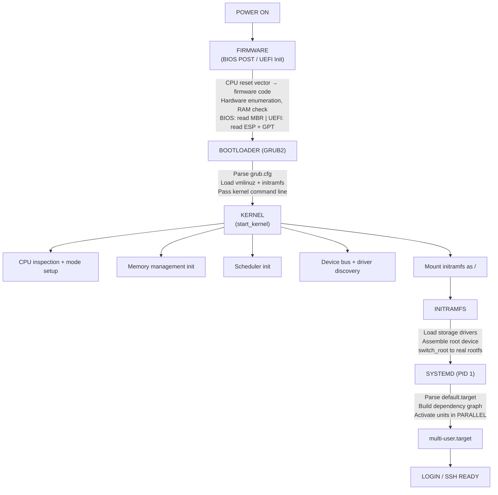
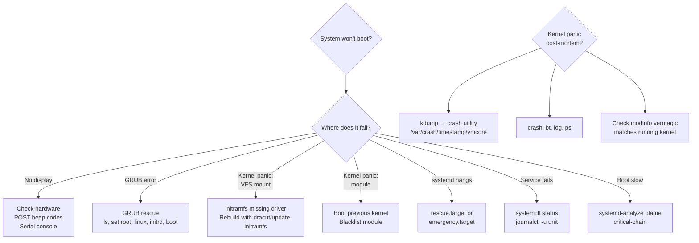

# Cheatsheet: 00 -- Fundamentals (Boot Process, Kernel Architecture, System Calls)

> Quick reference for senior SRE interviews and production debugging.
> Full topic: [fundamentals.md](../00-fundamentals/fundamentals.md)

---

## Boot Sequence



---

## Key File Paths

### Boot Files

| Path | Description |
|---|---|
| `/boot/vmlinuz-*` | Compressed kernel image |
| `/boot/initrd.img-*` or `/boot/initramfs-*.img` | Initial RAM filesystem |
| `/boot/grub/grub.cfg` | GRUB configuration (auto-generated) |
| `/etc/default/grub` | GRUB defaults (human-editable) |
| `/etc/grub.d/` | GRUB config scripts |
| `/boot/efi/` | UEFI ESP mount point |

### /proc Essentials

| Path | Description |
|---|---|
| `/proc/cmdline` | Kernel boot parameters |
| `/proc/version` | Kernel version string |
| `/proc/uptime` | Uptime in seconds (system, idle) |
| `/proc/stat` | CPU stats, context switches, boot time |
| `/proc/interrupts` | IRQ counts per CPU per device |
| `/proc/meminfo` | Memory breakdown |
| `/proc/cpuinfo` | CPU model, flags, cores |
| `/proc/modules` | Loaded kernel modules |
| `/proc/<PID>/status` | Process state, memory, UIDs |
| `/proc/<PID>/stack` | Kernel stack trace (D-state debug) |
| `/proc/<PID>/maps` | Virtual memory mappings |
| `/proc/<PID>/syscall` | Current syscall being executed |

### /sys Essentials

| Path | Description |
|---|---|
| `/sys/firmware/efi/` | UEFI variables (presence = UEFI boot) |
| `/sys/devices/system/clocksource/*/current_clocksource` | Active clocksource |
| `/sys/kernel/debug/` | debugfs (ftrace, tracing) |
| `/sys/fs/cgroup/` | cgroup hierarchies |
| `/sys/class/net/` | Network interfaces |
| `/sys/block/` | Block devices |

---

## Essential Commands

### Boot Analysis

```bash
systemd-analyze                          # Total boot time breakdown
systemd-analyze blame | head -20         # Slowest units to start
systemd-analyze critical-chain           # Dependency chain determining boot time
systemd-analyze plot > boot.svg          # Visual boot timeline
systemd-analyze verify <unit>            # Check unit file for errors/cycles
systemd-analyze dot <unit> | dot -Tsvg   # Dependency graph for a unit
```

### Kernel Messages

```bash
dmesg -T                                 # Kernel ring buffer (human timestamps)
dmesg -T --level=err,warn                # Only errors and warnings
journalctl -k -b 0                       # Kernel messages, current boot
journalctl -b -1 -p err                  # Errors from previous boot
journalctl --list-boots                  # List all recorded boots
```

### Kernel & Module Info

```bash
uname -r                                 # Kernel version
uname -a                                 # Full kernel info
cat /proc/cmdline                        # Boot parameters
lsmod                                    # Loaded modules
modinfo <module>                         # Module details + vermagic
modprobe <module>                        # Load module
modprobe -r <module>                     # Unload module
lspci -k                                 # PCI devices + kernel driver in use
```

### System Call Tracing

```bash
strace -c <command>                      # Syscall summary (count + time)
strace -e trace=openat,read,write <cmd>  # Filter specific syscalls
strace -T -p <PID>                       # Attach to process, show duration
strace -ff -o /tmp/trace -p <PID>        # Trace all threads, separate files
ltrace <command>                         # Library call tracing
perf trace -p <PID>                      # Lower-overhead syscall tracing
```

### Service Management

```bash
systemctl --failed                       # List failed units
systemctl status <unit>                  # Unit status + recent logs
systemctl list-dependencies <unit>       # Show dependency tree
systemctl cat <unit>                     # Show unit file contents
systemctl edit <unit>                    # Create override (drop-in)
systemctl daemon-reload                  # Reload after unit file changes
systemctl mask <unit>                    # Prevent unit from starting entirely
systemctl unmask <unit>                  # Reverse mask
```

---

## Syscall Path Quick Reference (x86_64)

```mermaid
flowchart LR
    A["Application"] --> B["glibc wrapper"]
    B --> |"RAX=syscall#<br/>RDI-R9=args"| C["SYSCALL instruction"]
    C --> |"Ring 3 → Ring 0"| D["entry_SYSCALL_64"]
    D --> E[""sys_call_table[RAX"]"]
    E --> F["Handler"]
    F --> |"SYSRET<br/>Ring 0 → Ring 3"| G["glibc"]
    G --> |"check RAX<br/>set errno"| H["Application"]
```

| Register | Purpose |
|---|---|
| RAX | Syscall number (e.g., write=1, read=0, open=2) |
| RDI | Arg 1 |
| RSI | Arg 2 |
| RDX | Arg 3 |
| R10 | Arg 4 |
| R8 | Arg 5 |
| R9 | Arg 6 |
| RAX (return) | Return value (negative = error) |

### vDSO-Accelerated Syscalls (No Kernel Entry)

- `clock_gettime()` -- most impactful
- `gettimeofday()`
- `time()`
- `getcpu()`

Verify: `ldd /bin/ls | grep vdso` -- shows `linux-vdso.so.1`

---

## GRUB Rescue Quick Reference

```bash
# At grub> prompt:
ls                                       # List partitions
ls (hd0,gpt2)/boot/                      # Browse filesystem
set root=(hd0,gpt2)                      # Set GRUB root
linux /vmlinuz-<version> root=UUID=<uuid> ro
initrd /initrd.img-<version>
boot

# Permanent repair from rescue media:
mount /dev/sda2 /mnt
for i in dev proc sys run; do mount --bind /$i /mnt/$i; done
chroot /mnt
grub-install /dev/sda                    # BIOS
# OR
grub-install --target=x86_64-efi --efi-directory=/boot/efi  # UEFI
update-grub
```

---

## Rescue Boot Options (Kernel Command Line)

| Parameter | Effect |
|---|---|
| `systemd.unit=rescue.target` | Single-user mode (minimal services, root shell) |
| `systemd.unit=emergency.target` | Emergency mode (no mounts, no services) |
| `init=/bin/bash` | Skip init entirely, raw root shell |
| `rd.break` | Drop into initramfs shell before switch_root |
| `single` or `-s` | Legacy single-user mode |
| `fsck.mode=skip` | Skip filesystem checks |
| `modprobe.blacklist=<mod>` | Prevent module from loading |
| `nomodeset` | Disable kernel mode-setting (video issues) |

---

## initramfs Rebuild

```bash
# Debian/Ubuntu:
update-initramfs -u -k $(uname -r)      # Update current kernel's initramfs
update-initramfs -u -k all              # Update all kernels

# RHEL/Fedora:
dracut --force                           # Rebuild current kernel's initramfs
dracut --add-drivers "nvme mpt3sas" --force  # Include specific drivers

# Inspect initramfs contents:
lsinitramfs /boot/initrd.img-$(uname -r)     # Debian/Ubuntu
lsinitrd /boot/initramfs-$(uname -r).img     # RHEL/Fedora
```

---

## Production Kernel Command Line (Common Additions)

```bash
# Serial console (cloud/bare-metal OOB):
console=tty0 console=ttyS0,115200n8

# kdump crash dump reserve:
crashkernel=256M

# Transparent huge pages (disable for databases):
transparent_hugepage=madvise

# IOMMU (VMs, DPDK, PCIe passthrough):
intel_iommu=on iommu=pt

# Disable unnecessary hardware modules:
modprobe.blacklist=usb-storage,bluetooth

# Quiet boot:
quiet loglevel=3
```

---

## Debugging Decision Tree



---

## BIOS vs UEFI Quick Comparison

| Feature | Legacy BIOS | UEFI |
|---|---|---|
| Partition table | MBR (4 primary, 2TB max) | GPT (128 partitions, 9.4ZB max) |
| Boot code location | MBR boot sector (446 bytes) | ESP (FAT32 partition, unlimited size) |
| Filesystem awareness | None | FAT12/16/32 |
| Secure Boot | No | Yes (signature verification) |
| Boot manager | None (chain loads) | Built-in, configurable |
| OS detection | `[ -d /sys/firmware/efi ] && echo UEFI \|\| echo BIOS` | |
| Config tool | N/A | `efibootmgr -v` |

---

> Full reference: [fundamentals.md](../00-fundamentals/fundamentals.md) | Interview questions: [00-fundamentals.md](../interview-questions/00-fundamentals.md)
