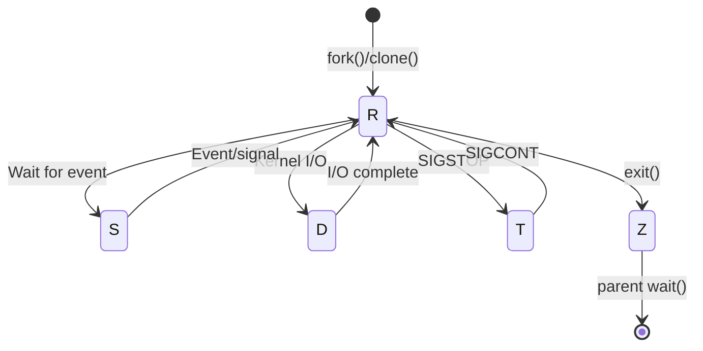
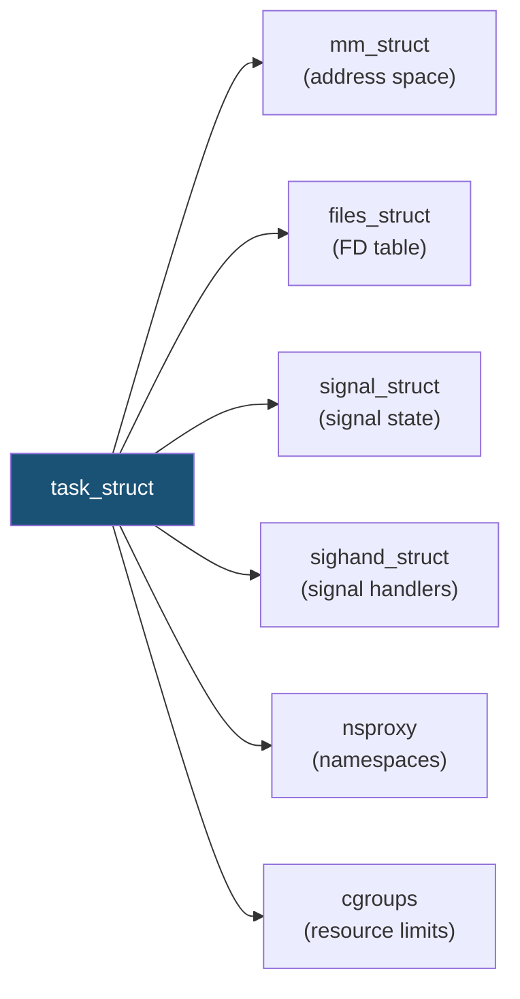

# Cheatsheet: Process Management

> Quick reference for senior SRE/Cloud Engineers
> Full guide: [Process Management](../01-process-management/process-management.md)

---

<!-- toc -->
## Table of Contents

- [Process Inspection Commands](#process-inspection-commands)
- [Process Control Commands](#process-control-commands)
- [Priority & Scheduling](#priority-scheduling)
- [Signals Reference](#signals-reference)
- [Process States](#process-states)
- [`/proc/<PID>/` Quick Reference](#procpid-quick-reference)
- [System-Wide `/proc` Paths](#system-wide-proc-paths)
- [Debugging Toolkit](#debugging-toolkit)
  - [Trace and Profile](#trace-and-profile)
  - [Quick Diagnostics](#quick-diagnostics)
- [Common SRE Runbooks](#common-sre-runbooks)
  - [Zombie Cleanup](#zombie-cleanup)
  - [D-State Process Investigation](#d-state-process-investigation)
  - [Fork Bomb Recovery](#fork-bomb-recovery)
- [Key Kernel Data Structures](#key-kernel-data-structures)
  - [PID vs TGID](#pid-vs-tgid)
- [`clone()` Flags Reference](#clone-flags-reference)

<!-- toc stop -->

## Process Inspection Commands

| Command | Purpose | When to Use |
|---------|---------|-------------|
| `ps auxf` | All processes, tree format | First look at system state |
| `ps -eo pid,ppid,uid,stat,wchan:30,comm,args --sort=-%cpu` | Custom format sorted by CPU | Hunting resource hogs |
| `ps -Lp <PID> -o pid,tid,nlwp,pcpu,stat,comm` | Show threads of a process | Thread leak investigation |
| `ps aux \| awk '$8~/Z/'` | List zombie processes | Zombie accumulation alert |
| `ps -eo pid,stat,wchan:32,comm \| awk '$2~/D/'` | List D-state processes | Uninterruptible sleep debugging |
| `top -H -p <PID>` | Real-time per-thread view | Live debugging specific process |
| `top -bn1 -o %MEM \| head -20` | Batch mode, sorted by memory | Scripted monitoring snapshot |
| `htop -t` | Interactive tree view | General system exploration |
| `pstree -p <PID>` | Process tree from PID | Understanding parent-child chains |
| `pgrep -a <name>` | Find PID by name with cmdline | Quick PID lookup |
| `pidof <exact-name>` | Find PID by exact binary name | Simple exact match |

## Process Control Commands

| Command | Purpose | Signal Sent |
|---------|---------|-------------|
| `kill -TERM <PID>` | Graceful shutdown | SIGTERM (15) |
| `kill -HUP <PID>` | Reload config / hangup | SIGHUP (1) |
| `kill -USR1 <PID>` | App-defined (e.g., reopen logs) | SIGUSR1 (10) |
| `kill -STOP <PID>` | Freeze process (uncatchable) | SIGSTOP (19) |
| `kill -CONT <PID>` | Resume frozen process | SIGCONT (18) |
| `kill -KILL <PID>` | Force kill (last resort) | SIGKILL (9) |
| `kill -CHLD <PPID>` | Nudge parent to reap zombies | SIGCHLD (17) |
| `pkill -TERM -f "pattern"` | Kill by command line match | SIGTERM (15) |
| `pkill -KILL -P <PPID>` | Kill all children of parent | SIGKILL (9) |
| `killall -9 <name>` | Kill all by exact name | SIGKILL (9) |

## Priority & Scheduling

| Command | Purpose |
|---------|---------|
| `nice -n 10 ./cmd` | Start with lower priority (nice=10) |
| `nice -n -20 ./cmd` | Start with highest priority (root only) |
| `renice -n 15 -p <PID>` | Change running process to nice=15 |
| `renice -n -5 -u postgres` | Boost all processes of a user |
| `chrt -f 99 ./cmd` | SCHED_FIFO real-time priority 99 |
| `chrt -r 50 -p <PID>` | SCHED_RR real-time priority 50 |
| `chrt -p <PID>` | Query scheduling policy |
| `taskset -c 0,1 -p <PID>` | Pin process to CPU cores 0 and 1 |

## Signals Reference

| Signal | # | Default | Catchable? | Common Use |
|--------|---|---------|------------|------------|
| `SIGHUP` | 1 | Terminate | Yes | Daemon config reload |
| `SIGINT` | 2 | Terminate | Yes | Ctrl+C |
| `SIGQUIT` | 3 | Core dump | Yes | Ctrl+\\ (get stack dump) |
| `SIGKILL` | 9 | Terminate | **No** | Force kill |
| `SIGPIPE` | 13 | Terminate | Yes | Broken pipe (ignore in servers) |
| `SIGTERM` | 15 | Terminate | Yes | Graceful shutdown |
| `SIGCHLD` | 17 | Ignore | Yes | Child status change |
| `SIGCONT` | 18 | Continue | Yes | Resume stopped process |
| `SIGSTOP` | 19 | Stop | **No** | Freeze process |
| `SIGTSTP` | 20 | Stop | Yes | Ctrl+Z |
| `SIGUSR1` | 10 | Terminate | Yes | App-defined |
| `SIGUSR2` | 12 | Terminate | Yes | App-defined |

## Process States

| STAT | Kernel Constant | Description | Killable? |
|------|----------------|-------------|-----------|
| `R` | `TASK_RUNNING` | On CPU or run queue | Yes |
| `S` | `TASK_INTERRUPTIBLE` | Sleeping, wakes on signal | Yes |
| `D` | `TASK_UNINTERRUPTIBLE` | Sleeping, ignores all signals | **No** |
| `D` | `TASK_KILLABLE` | Sleeping, responds to SIGKILL only | SIGKILL only |
| `T` | `TASK_STOPPED` | Stopped by signal | Yes |
| `t` | `TASK_TRACED` | Stopped by debugger | After detach |
| `Z` | `EXIT_ZOMBIE` | Dead, awaiting parent wait() | Already dead |
| `X` | `EXIT_DEAD` | Being removed | N/A |

**STAT modifiers:** `s` = session leader, `l` = multi-threaded, `+` = foreground, `<` = high priority, `N` = low priority, `L` = locked pages



## `/proc/<PID>/` Quick Reference

| Path | Content | Use Case |
|------|---------|----------|
| `status` | Human-readable process info | Quick overview (state, memory, threads) |
| `stat` | Machine-readable process info | Scripted monitoring |
| `cmdline` | Full command line (null-delimited) | Identify process purpose |
| `environ` | Environment variables (null-delimited) | Find config, deploy version |
| `maps` | Memory mappings | Library dependencies, heap/stack |
| `fd/` | Symlinks to open file descriptors | FD leak detection, socket inspection |
| `limits` | Resource limits (soft/hard) | Check ulimits |
| `stack` | Kernel stack trace | Diagnose D-state / stuck processes |
| `wchan` | Wait channel name | One-word "what is it waiting on" |
| `cgroup` | Cgroup membership | Container/slice identification |
| `ns/` | Namespace inode links | Namespace isolation verification |
| `oom_score` | OOM kill priority (0-1000) | Check OOM vulnerability |
| `oom_score_adj` | Adjustable OOM score (-1000 to 1000) | Protect/prioritize for OOM |
| `io` | I/O statistics | Disk I/O attribution |
| `task/` | Per-thread subdirectories | Thread-level inspection |

## System-Wide `/proc` Paths

| Path | Content | Default |
|------|---------|---------|
| `/proc/sys/kernel/pid_max` | Maximum PID value | 32768 (max: 4194304) |
| `/proc/sys/kernel/threads-max` | Maximum threads system-wide | ~30000 (varies) |
| `/proc/loadavg` | Load averages + running/total + last PID | N/A |
| `/proc/stat` | `processes` line = cumulative forks | N/A |
| `/proc/sys/vm/max_map_count` | Max memory map areas per process | 65530 |

## Debugging Toolkit

### Trace and Profile

| Command | Purpose |
|---------|---------|
| `strace -fp <PID> -e trace=file` | Trace file operations |
| `strace -fp <PID> -e trace=network` | Trace network operations |
| `strace -fp <PID> -e trace=process` | Trace fork/exec/exit |
| `strace -c -p <PID>` | Syscall count summary |
| `strace -T -p <PID>` | Time each syscall |
| `ltrace -p <PID>` | Library call trace |
| `perf top -p <PID>` | Live CPU sampling |
| `perf record -g -p <PID> -- sleep 30` | Record profile with call graph |
| `lsof -p <PID>` | All open files |
| `lsof -i -p <PID>` | Network connections only |

### Quick Diagnostics

```bash
# Count all processes
ls -d /proc/[0-9]* | wc -l

# Count zombies
ps aux | awk '$8=="Z"' | wc -l

# Find zombie parents
ps -eo ppid,stat | awk '$2=="Z"{print $1}' | sort | uniq -c | sort -rn

# FD count per process (top 10)
for p in /proc/[0-9]*/fd; do echo "$(ls $p 2>/dev/null | wc -l) $(readlink ${p%fd}exe 2>/dev/null)"; done | sort -rn | head -10

# Process creation rate (forks/sec)
F1=$(awk '/processes/{print $2}' /proc/stat); sleep 10; F2=$(awk '/processes/{print $2}' /proc/stat); echo "$(( (F2 - F1) / 10 )) forks/sec"

# Thread count for a process
cat /proc/<PID>/status | grep Threads

# Memory of process (RSS in KB)
awk '/VmRSS/{print $2, $3}' /proc/<PID>/status

# Check if process is containerized
cat /proc/<PID>/cgroup | grep -v "^0::" | head -5
```

## Common SRE Runbooks

### Zombie Cleanup

```bash
# 1. Count and identify
ZOMBIES=$(ps -eo ppid,pid,stat,comm | awk '$3=="Z"')
echo "$ZOMBIES" | wc -l
echo "$ZOMBIES" | awk '{print $1}' | sort | uniq -c | sort -rn

# 2. Try nudging parent
PPID=<parent_pid>
kill -CHLD $PPID

# 3. If parent is unresponsive, restart it
kill -TERM $PPID
sleep 5
kill -KILL $PPID   # zombies re-parented to init and reaped
```

### D-State Process Investigation

```bash
PID=<stuck_pid>
# 1. Confirm state
cat /proc/$PID/status | grep State

# 2. See what it's waiting for
cat /proc/$PID/wchan
cat /proc/$PID/stack

# 3. Check if TASK_KILLABLE (look for "killable" in wchan/stack)
# If killable: kill -9 $PID
# If not killable: fix underlying I/O issue

# 4. For storage issues
cat /sys/block/*/device/state
# If "blocked": echo running > /sys/block/<dev>/device/state
# Last resort: echo offline > /sys/block/<dev>/device/state
```

### Fork Bomb Recovery

```bash
# If you have a shell:
kill -9 -1                                    # as the offending user
loginctl kill-user <username>                 # kill all of user's processes

# If system is frozen, use SysRq:
echo i > /proc/sysrq-trigger                 # SIGKILL all except init

# Prevention:
echo "* hard nproc 4096" >> /etc/security/limits.conf
sysctl -w kernel.pid_max=4194304
```

## Key Kernel Data Structures



### PID vs TGID

| | Single-threaded | Multi-threaded (main) | Multi-threaded (child thread) |
|-|----------------|----------------------|-------------------------------|
| `pid` | 1234 | 1234 | 1235 |
| `tgid` | 1234 | 1234 | 1234 |
| `getpid()` | 1234 | 1234 | 1234 |
| `gettid()` | 1234 | 1234 | 1235 |

## `clone()` Flags Reference

| Flag | Shares | fork() | pthread_create() |
|------|--------|--------|-------------------|
| `CLONE_VM` | Address space | No | Yes |
| `CLONE_FILES` | File descriptors | No | Yes |
| `CLONE_FS` | Filesystem (cwd, root) | No | Yes |
| `CLONE_SIGHAND` | Signal handlers | No | Yes |
| `CLONE_THREAD` | Thread group (TGID) | No | Yes |
| `CLONE_NEWPID` | -- (new PID namespace) | No | No |
| `CLONE_NEWNS` | -- (new mount namespace) | No | No |
| `CLONE_NEWNET` | -- (new network namespace) | No | No |

---

*[Back to main guide](../01-process-management/process-management.md) | [Interview Questions](../interview-questions/01-process-management.md)*
