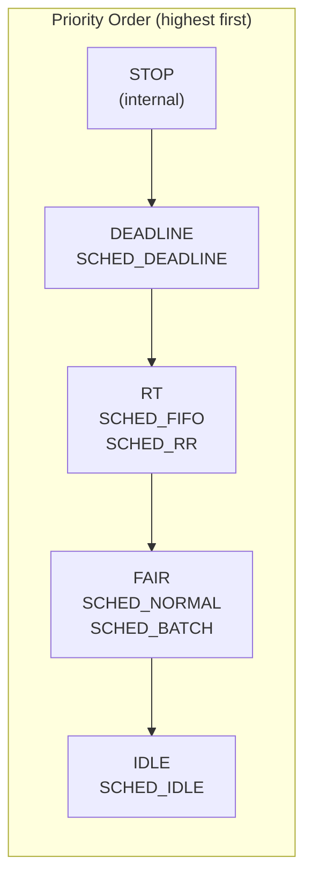
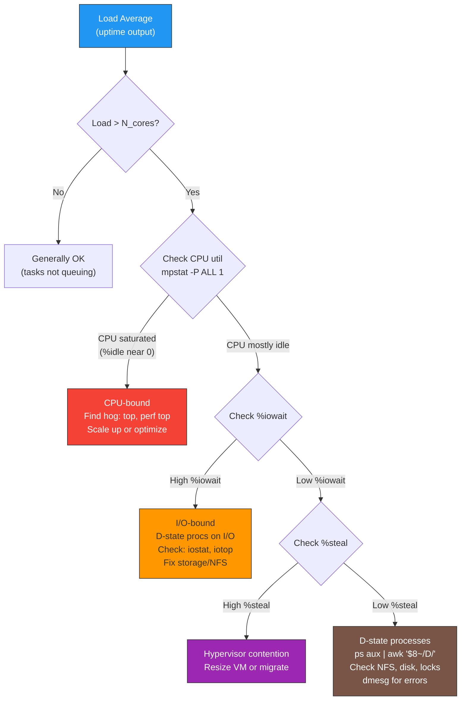

# Cheatsheet: 02 -- CPU Scheduling

> Quick reference for senior SRE interviews and production debugging.
> Full topic: [cpu-scheduling.md](../02-cpu-scheduling/cpu-scheduling.md)
> Interview questions: [02-cpu-scheduling.md](../interview-questions/02-cpu-scheduling.md)

---

<!-- toc -->
## Table of Contents

- [Scheduler Architecture at a Glance](#scheduler-architecture-at-a-glance)
- [Scheduling Policy Comparison](#scheduling-policy-comparison)
- [Nice Value to Weight Mapping (Key Values)](#nice-value-to-weight-mapping-key-values)
- [CFS vs EEVDF Quick Comparison](#cfs-vs-eevdf-quick-comparison)
- [Essential Commands](#essential-commands)
  - [View & Set Scheduling Policy](#view-set-scheduling-policy)
  - [Nice & Renice](#nice-renice)
  - [CPU Affinity & NUMA](#cpu-affinity-numa)
  - [Monitoring](#monitoring)
  - [Process-Level Scheduler Info](#process-level-scheduler-info)
  - [perf sched (Advanced)](#perf-sched-advanced)
- [cgroups v2 CPU Controller](#cgroups-v2-cpu-controller)
  - [Setup](#setup)
  - [Weight (Proportional Share)](#weight-proportional-share)
  - [Bandwidth Limit (Hard Cap)](#bandwidth-limit-hard-cap)
  - [CPU Pinning via cgroups](#cpu-pinning-via-cgroups)
  - [Monitoring](#monitoring)
  - [Systemd Equivalents](#systemd-equivalents)
- [Load Average Interpretation Guide](#load-average-interpretation-guide)
  - [Quick Rules](#quick-rules)
- [Context Switching Reference](#context-switching-reference)
- [RT Throttling Safety Net](#rt-throttling-safety-net)
- [Key /proc and /sys Paths](#key-proc-and-sys-paths)
- [Interview One-Liners](#interview-one-liners)

<!-- toc stop -->

## Scheduler Architecture at a Glance



---

## Scheduling Policy Comparison

| Policy | Class | Priority | Time Slice | Preempts Normal? | Key Risk |
|---|---|---|---|---|---|
| `SCHED_DEADLINE` | Deadline | Highest (user) | Runtime/Period | Yes (preempts RT too) | Admission test may reject |
| `SCHED_FIFO` | RT | 1-99 | None (runs until yield) | Yes | Can starve entire system |
| `SCHED_RR` | RT | 1-99 | 100ms default | Yes | Less dangerous than FIFO |
| `SCHED_NORMAL` | Fair | Nice -20..+19 | Dynamic (weight-based) | No | Default for all tasks |
| `SCHED_BATCH` | Fair | Nice -20..+19 | Dynamic (less preemption) | No | Higher latency |
| `SCHED_IDLE` | Fair (idle) | Lowest | Dynamic | No | Can cause priority inversion |

---

## Nice Value to Weight Mapping (Key Values)

| Nice | Weight | CPU Share vs Nice 0 |
|------|--------|---------------------|
| -20 | 88761 | 86.7x |
| -15 | 29154 | 28.5x |
| -10 | 9548 | 9.3x |
| -5 | 3121 | 3.0x |
| 0 | **1024** | **1.0x (baseline)** |
| 5 | 335 | 0.33x |
| 10 | 110 | 0.11x |
| 15 | 36 | 0.035x |
| 19 | 15 | 0.015x |

**Rule:** Each nice level = ~10% change in CPU share (multiplicative, ratio = 1.25 per level)

---

## CFS vs EEVDF Quick Comparison

| Aspect | CFS (kernel <= 6.5) | EEVDF (kernel >= 6.6) |
|---|---|---|
| Selection | Leftmost vruntime in RB-tree | Earliest virtual deadline among eligible tasks |
| Latency | Tunable knobs | Algorithmic (lag-based) |
| Sleeper fairness | Ad-hoc min_vruntime hack | Lag tracking (natural) |
| Tuning | Many sysctls | Minimal |

---

## Essential Commands

### View & Set Scheduling Policy

```bash
chrt -p <PID>                          # View policy & priority
chrt -f -p 50 <PID>                   # Set SCHED_FIFO, priority 50
chrt -r -p 10 <PID>                   # Set SCHED_RR, priority 10
chrt -o -p 0 <PID>                    # Set SCHED_NORMAL (rescue!)
chrt -m                                # Show max priority per policy
```

### Nice & Renice

```bash
nice -n 10 <CMD>                       # Launch with nice 10
renice -n -5 -p <PID>                 # Increase priority (root)
renice -n 10 -u username              # All user's processes
ps -eo pid,ni,pri,pcpu,comm --sort=-pcpu  # View with nice values
```

### CPU Affinity & NUMA

```bash
taskset -p <PID>                       # View affinity mask
taskset -pc 0,1 <PID>                 # Pin to CPUs 0,1
taskset -c 4-7 <CMD>                  # Launch pinned to CPUs 4-7
numactl --hardware                     # Show NUMA topology
numactl --cpunodebind=0 --membind=0 <CMD>  # NUMA-aware launch
numastat -p <PID>                      # Per-process NUMA stats
lscpu | grep -i numa                   # Quick NUMA check
cat /proc/<PID>/numa_maps | head       # Process NUMA mapping
```

### Monitoring

```bash
mpstat -P ALL 1 5                      # Per-CPU utilization
pidstat -u -w 1 5                      # Per-process CPU + ctx switches
vmstat 1 5                             # Run queue, ctx switches, CPU
uptime                                 # Load average
cat /proc/loadavg                      # Load avg + running/total
cat /proc/pressure/cpu                 # CPU pressure (PSI)
sar -q 1 10                            # Run queue length over time
```

### Process-Level Scheduler Info

```bash
cat /proc/<PID>/sched                  # vruntime, switches, runtime
cat /proc/<PID>/status | grep ctxt     # Context switch counts
cat /proc/sched_debug | head -100      # All run queues detail
cat /proc/schedstat                    # Per-CPU sched stats
```

### perf sched (Advanced)

```bash
perf sched record -- sleep 10          # Record sched events
perf sched latency --sort max          # Analyze scheduling latency
perf sched timehist                    # Per-switch timeline
perf sched map                         # CPU-task mapping timeline
perf stat -e context-switches,cpu-migrations -a sleep 5  # Counters
```

---

## cgroups v2 CPU Controller

### Setup

```bash
# Enable CPU controller
echo "+cpu" > /sys/fs/cgroup/parent/cgroup.subtree_control
mkdir /sys/fs/cgroup/parent/child
echo <PID> > /sys/fs/cgroup/parent/child/cgroup.procs
```

### Weight (Proportional Share)

```bash
echo 200 > /sys/fs/cgroup/G/cpu.weight     # 2x default (default=100)
echo 500 > /sys/fs/cgroup/G/cpu.weight     # 5x default
# Range: 1-10000. Only matters when CPUs are contended.
```

### Bandwidth Limit (Hard Cap)

```bash
# Format: QUOTA_us PERIOD_us
echo "100000 100000" > /sys/fs/cgroup/G/cpu.max    # 1 core max
echo "200000 100000" > /sys/fs/cgroup/G/cpu.max    # 2 cores max
echo "50000 100000" > /sys/fs/cgroup/G/cpu.max     # 0.5 cores max
echo "max 100000" > /sys/fs/cgroup/G/cpu.max       # No limit
```

### CPU Pinning via cgroups

```bash
echo "0-3" > /sys/fs/cgroup/G/cpuset.cpus          # Pin to CPUs 0-3
echo "0" > /sys/fs/cgroup/G/cpuset.mems             # Pin to NUMA node 0
```

### Monitoring

```bash
cat /sys/fs/cgroup/G/cpu.stat
# usage_usec    -- total CPU time consumed
# user_usec     -- user-space CPU time
# system_usec   -- kernel CPU time
# nr_periods    -- total CFS periods elapsed
# nr_throttled  -- periods where cgroup was throttled
# throttled_usec -- total time spent throttled

cat /sys/fs/cgroup/G/cpu.pressure       # Per-cgroup PSI
```

### Systemd Equivalents

```bash
systemctl set-property myapp.service CPUWeight=200
systemctl set-property myapp.service CPUQuota=200%      # 2 cores
systemctl set-property myapp.service AllowedCPUs=0-3
systemctl set-property myapp.service NUMAPolicy=bind
systemctl set-property myapp.service NUMAMask=0
```

---

## Load Average Interpretation Guide



### Quick Rules

| Scenario | Load Avg | CPU % | Diagnosis |
|---|---|---|---|
| Healthy | < cores | Moderate | Normal |
| CPU saturated | > cores | ~100% usr+sys | CPU bottleneck |
| I/O bottleneck | >> cores | Low, high %wa | Storage/NFS issue |
| Hypervisor steal | > cores | Low, high %st | VM contention |
| Lock contention | > cores | Low, low %wa | D-state from kernel locks |

**Key fact:** Linux load average includes D-state (uninterruptible sleep) processes. Other Unixes do not. This is the #1 trick question in Linux interviews.

---

## Context Switching Reference

| Type | Cause | Diagnostic |
|---|---|---|
| Voluntary | Process blocks (I/O, sleep, lock wait) | Normal and expected |
| Involuntary | Scheduler preempts (time slice expired, higher-prio task) | High counts = contention |

```bash
# System-wide: vmstat cs column
vmstat 1 5

# Per-process
pidstat -w 1 5               # cswch/s = voluntary, nvcswch/s = involuntary
cat /proc/<PID>/status        # voluntary_ctxt_switches / nonvoluntary_ctxt_switches
```

**Rules of thumb:**
- Context switch cost: ~2-5 microseconds per switch
- Healthy server: < 20K switches/sec per core
- Alarm: > 50K switches/sec per core (significant overhead)
- Thread pool too large if `involuntary >> voluntary`

---

## RT Throttling Safety Net

```bash
# View current settings (ALWAYS keep in production)
cat /proc/sys/kernel/sched_rt_runtime_us    # Default: 950000 (950ms)
cat /proc/sys/kernel/sched_rt_period_us     # Default: 1000000 (1s)
# Meaning: RT tasks get max 950ms per 1s, leaving 50ms for normal tasks

# NEVER do this in production:
# echo -1 > /proc/sys/kernel/sched_rt_runtime_us  # Disables safety net!
```

---

## Key /proc and /sys Paths

| Path | What It Shows |
|---|---|
| `/proc/loadavg` | 1/5/15 min load avg, running/total tasks, last PID |
| `/proc/pressure/cpu` | CPU PSI: `some avg10/60/300 total` |
| `/proc/<PID>/sched` | vruntime, exec runtime, switch counts |
| `/proc/<PID>/status` | voluntary/nonvoluntary context switches |
| `/proc/sched_debug` | Per-CPU run queue state |
| `/proc/schedstat` | Per-CPU scheduling counters |
| `/proc/sys/kernel/sched_rt_runtime_us` | RT throttle budget per period |
| `/proc/sys/kernel/sched_rr_timeslice_ms` | SCHED_RR quantum (default 100ms) |
| `/proc/sys/kernel/sched_autogroup_enabled` | Session grouping (disable on servers!) |
| `/sys/fs/cgroup/G/cpu.weight` | Proportional share (1-10000) |
| `/sys/fs/cgroup/G/cpu.max` | Bandwidth limit (quota period) |
| `/sys/fs/cgroup/G/cpu.stat` | Usage + throttling stats |
| `/sys/fs/cgroup/G/cpu.pressure` | Per-cgroup CPU PSI |

---

## Interview One-Liners

| Question | Key Insight |
|---|---|
| Load avg vs CPU util? | Load avg includes D-state; CPU util does not |
| How does CFS pick next task? | Leftmost node in RB-tree (lowest vruntime) |
| What replaced CFS? | EEVDF in kernel 6.6 (eligible + virtual deadline) |
| Nice -20 = all CPU? | No. 98.86% with one nice-0 competitor |
| SCHED_FIFO risk? | Can starve entire system if it loops |
| SCHED_IDLE can starve NORMAL? | Yes, via priority inversion on locks |
| cgroup cpu.weight vs cpu.max? | Weight = proportional share; max = hard cap |
| PSI vs load avg? | PSI measures actual stall time; load avg counts tasks |

---

> **Last updated:** 2026-03-24
