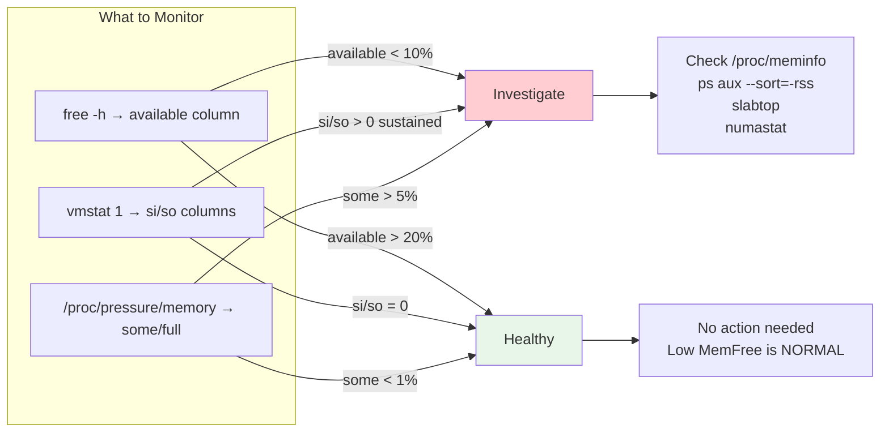
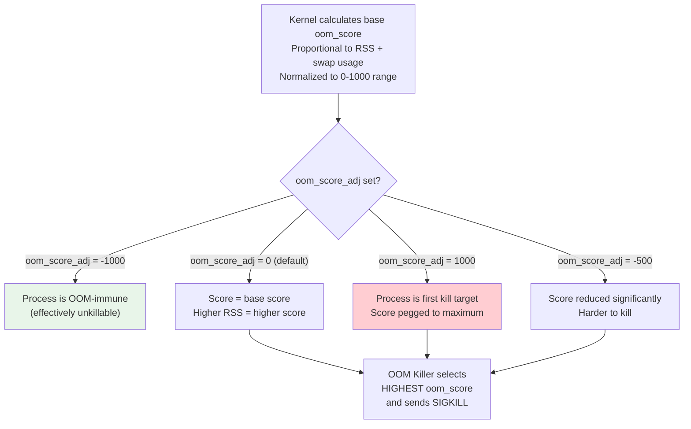

# Cheatsheet: 03 -- Memory Management (Virtual Memory, Page Tables, OOM, NUMA, Swap)

> Quick reference for senior SRE interviews and production debugging.
> Full topic: [memory-management.md](../03-memory-management/memory-management.md)

---

## Memory Overview at a Glance



---

## Essential Commands

### Quick Health Check

```bash
free -h                                      # Memory overview (focus on 'available')
vmstat 1 5                                   # Real-time: si/so=swap, b=blocked, wa=wait
cat /proc/pressure/memory                    # PSI: some=partial stall, full=total stall
```

### Detailed Memory Analysis

```bash
cat /proc/meminfo                            # Full memory breakdown
grep -E "^(MemTotal|MemAvailable|MemFree|Cached|Buffers|SReclaimable|SwapTotal|SwapFree|AnonPages|Shmem|Dirty|Committed_AS|CommitLimit)" /proc/meminfo

# Watch key fields change over time
watch -n 5 'grep -E "^(MemAvailable|AnonPages|Slab|SUnreclaim|Dirty|Committed_AS)" /proc/meminfo'
```

### Per-Process Memory

```bash
ps aux --sort=-rss | head -15                # Top RSS consumers
pmap -x <PID>                                # Detailed virtual memory map
cat /proc/<PID>/smaps_rollup                 # PSS, USS, swap per process
cat /proc/<PID>/status | grep -E "^(VmRSS|VmSize|VmSwap|RssAnon|RssFile|RssShmem)"
cat /proc/<PID>/oom_score                    # Current OOM score
cat /proc/<PID>/oom_score_adj                # OOM adjustment (-1000 to +1000)
```

### OOM Management

```bash
# Protect critical process from OOM killer
echo -900 > /proc/<PID>/oom_score_adj

# Mark non-critical process as preferred OOM target
echo 500 > /proc/<PID>/oom_score_adj

# Check recent OOM kills
dmesg | grep -i "out of memory" -A 20
journalctl -k | grep -i oom

# eBPF real-time OOM tracing
sudo oomkill                                 # bcc tool: live OOM kill events
```

### NUMA Analysis

```bash
numactl --hardware                           # Show NUMA topology
numastat                                     # Per-node hit/miss counters
numastat -m                                  # Per-node memory breakdown
numastat -p <PID>                            # Per-process NUMA allocation

# Pin process to NUMA node
numactl --cpunodebind=0 --membind=0 <command>

# Interleave memory across all nodes (databases)
numactl --interleave=all <command>
```

### Slab / Kernel Memory

```bash
slabtop -o                                   # Slab allocator overview
slabtop -o -s c | head -20                   # Sort by cache size
cat /proc/slabinfo                           # Raw slab data
```

### Swap Management

```bash
swapon --show                                # Active swap devices/files
cat /proc/swaps                              # Swap usage per device
free -h | grep Swap                          # Quick swap check

# Emergency: disable and re-enable swap (forces pages back to RAM)
swapoff -a && swapon -a                      # Only if sufficient free RAM exists!
```

### Fragmentation and Zones

```bash
cat /proc/buddyinfo                          # Free blocks per order per zone
cat /proc/pagetypeinfo                       # Page mobility types
cat /proc/zoneinfo | grep -E "Node|min|low|high|free " | head -40

# Trigger manual compaction
echo 1 > /proc/sys/vm/compact_memory
```

### Transparent Huge Pages

```bash
cat /sys/kernel/mm/transparent_hugepage/enabled    # Current THP mode
cat /sys/kernel/mm/transparent_hugepage/defrag     # Defrag policy
grep -E "^thp_|^compact_" /proc/vmstat             # THP and compaction stats

# Disable THP (recommended for Redis, MongoDB)
echo never > /sys/kernel/mm/transparent_hugepage/enabled
echo never > /sys/kernel/mm/transparent_hugepage/defrag

# Set to opt-in only (recommended default)
echo madvise > /sys/kernel/mm/transparent_hugepage/enabled
```

### Page Cache

```bash
# Drop caches (EMERGENCY ONLY -- kills read performance)
echo 1 > /proc/sys/vm/drop_caches           # Drop page cache only
echo 2 > /proc/sys/vm/drop_caches           # Drop dentries + inodes
echo 3 > /proc/sys/vm/drop_caches           # Drop all

# Page cache hit ratio (bcc tools)
sudo cachestat 1

# Lock files into page cache (vmtouch)
vmtouch -t /var/lib/mysql/ibdata1            # Touch (read into cache)
vmtouch -l /var/lib/mysql/ibdata1            # Lock into RAM
vmtouch -v /var/lib/mysql/ibdata1            # Check cache residency
```

### eBPF Memory Tools (bcc)

```bash
sudo memleak -p <PID> --top 10              # Memory leak detection
sudo oomkill                                 # Trace OOM kills live
sudo cachestat 1                             # Page cache hit/miss ratio
sudo slabratetop                             # Top slab allocation rates
sudo bpftrace -e 'tracepoint:exceptions:page_fault_user { @[comm] = count(); }'
```

---

## /proc/meminfo Field Guide

### Critical Fields

| Field | What It Means | Alert When |
|---|---|---|
| `MemTotal` | Total usable RAM | N/A (static) |
| `MemFree` | Truly unused pages | Low is NORMAL, do NOT alert on this |
| `MemAvailable` | Estimated memory for new allocations | < 10% of MemTotal |
| `Buffers` | Block device metadata cache | Growing abnormally = filesystem issue |
| `Cached` | Page cache (file data) | Large = healthy I/O caching |
| `SwapTotal` | Total swap configured | N/A (static) |
| `SwapFree` | Unused swap | < 50% of SwapTotal |
| `Dirty` | Pages waiting writeback | > 500 MiB sustained = I/O stall risk |
| `AnonPages` | Process anonymous memory (heap, stack) | Growing without plateau = leak |
| `Shmem` | tmpfs + shared memory | Counts as "used" -- not reclaimable |
| `SReclaimable` | Slab cache (reclaimable) | Part of available memory |
| `SUnreclaim` | Slab cache (permanent) | Steadily growing = kernel slab leak |
| `Committed_AS` | Total virtual memory committed | > CommitLimit with mode 2 |
| `CommitLimit` | Max allowed commit (mode 2) | N/A |
| `PageTables` | Memory used for page tables | > 2-3% of total on many-process hosts |
| `Mapped` | File pages mapped into page tables | N/A (informational) |

### Memory Calculation Formulas

```
Available ≈ MemFree + Buffers + Cached + SReclaimable - Shmem
Used = MemTotal - MemFree - Buffers - Cached - SReclaimable
Page Cache = Cached + Buffers (approximately)
Committed Ratio = Committed_AS / CommitLimit
True Process Memory = AnonPages + Shmem (roughly)
```

---

## Memory Zones Reference

| Zone | Address Range (x86_64) | Purpose | Notes |
|---|---|---|---|
| `ZONE_DMA` | 0 - 16 MiB | Legacy ISA DMA | 24-bit addressable, rarely used |
| `ZONE_DMA32` | 16 MiB - 4 GiB | 32-bit PCI DMA | Some older devices require this |
| `ZONE_NORMAL` | 4 GiB - end of RAM | General allocations | Where most memory lives |
| `ZONE_HIGHMEM` | >896 MiB (32-bit only) | Not directly kernel-mappable | Irrelevant on 64-bit |

---

## OOM Score Explained



**Recommended oom_score_adj values:**

| Service Type | Recommended oom_score_adj |
|---|---|
| `sshd`, `systemd`, `journald` | -900 to -1000 |
| Primary database (PostgreSQL, MySQL) | -800 to -900 |
| Critical application servers | -500 to -700 |
| Monitoring agents (Prometheus, node_exporter) | -300 to -500 |
| General application pods | 0 (default) |
| Batch jobs, ETL workers | +300 to +500 |
| Development/test processes | +700 to +1000 |

---

## Page Table Hierarchy (x86_64)

```mermaid
graph LR
    CR3["CR3 Register<br/>(per-process)"] --> PGD[""PGD<br/>512 entries<br/>Bits [47:39"]"]
    PGD --> PUD[""PUD<br/>512 entries<br/>Bits [38:30"]"]
    PUD --> PMD[""PMD<br/>512 entries<br/>Bits [29:21"]"]
    PMD --> PTE[""PTE<br/>512 entries<br/>Bits [20:12"]"]
    PTE --> PF[""Page Frame<br/>4 KiB page<br/>Bits [11:0"] offset"]

    PUD -.->|"1 GiB Huge Page<br/>(if PSE bit set)"| HP1G["1 GiB Page"]
    PMD -.->|"2 MiB Huge Page<br/>(if PSE bit set)"| HP2M["2 MiB Page"]

    style CR3 fill:#ffecb3
    style PF fill:#c8e6c9
    style HP1G fill:#b3e5fc
    style HP2M fill:#b3e5fc
```

**Address bits consumed per level (4-level, 48-bit VA):**

| Level | Bits | Entries | Maps |
|---|---|---|---|
| PGD | [47:39] | 512 | 512 GiB per entry |
| PUD | [38:30] | 512 | 1 GiB per entry |
| PMD | [29:21] | 512 | 2 MiB per entry |
| PTE | [20:12] | 512 | 4 KiB per entry |
| Offset | [11:0] | - | Byte within page |

---

## Critical Sysctl Tunables

```bash
# View all vm tunables
sysctl -a | grep ^vm.

# Overcommit control
sysctl vm.overcommit_memory                  # 0=heuristic, 1=always, 2=strict
sysctl vm.overcommit_ratio                   # Used with mode 2 (default: 50)

# Swap behavior
sysctl vm.swappiness                         # 0-200 (default: 60, lower=less swap)

# Reclaim tuning
sysctl vm.min_free_kbytes                    # Min free RAM before direct reclaim
sysctl vm.watermark_scale_factor             # Watermark gap (default: 10 = 0.1%)
sysctl vm.vfs_cache_pressure                 # Dentry/inode reclaim tendency (default: 100)

# Dirty page writeback
sysctl vm.dirty_ratio                        # % RAM dirty before sync writeback (default: 20)
sysctl vm.dirty_background_ratio             # % RAM dirty before async writeback (default: 10)

# NUMA
sysctl vm.zone_reclaim_mode                  # 0=off (usually best), 1=zone reclaim
sysctl kernel.numa_balancing                 # 0=off, 1=auto NUMA balancing
```

---

## Emergency Response Playbook

```
MEMORY EMERGENCY: System unresponsive / OOM imminent

1. GET ACCESS:
   - If SSH is slow: use IPMI/iLO/DRAC console
   - If shell is available but slow: be patient, commands ARE running

2. ASSESS:
   $ free -h                    # Check available memory
   $ vmstat 1 3                 # Check si/so, b, wa columns

3. IDENTIFY TOP CONSUMER:
   $ ps aux --sort=-rss | head -5

4. IMMEDIATE RELIEF:
   $ kill -9 <PID>             # Kill largest non-critical process
   $ echo 1 > /proc/sys/vm/drop_caches  # Free page cache

5. STABILIZE:
   $ echo 500 > /proc/<batch-PID>/oom_score_adj  # Target batch jobs first
   $ echo -900 > /proc/<critical-PID>/oom_score_adj  # Protect critical services

6. POST-MORTEM:
   $ dmesg | grep -i oom -A 30           # OOM kill details
   $ journalctl -k --since "1 hour ago"  # Kernel messages
   $ cat /proc/meminfo                    # Full memory snapshot
```

---

## Common Gotchas

| Myth | Reality |
|---|---|
| "0% free memory = out of memory" | Linux uses free RAM for page cache. Check `available`, not `free`. |
| "`vm.swappiness=0` disables swap" | It minimizes swapping but kernel will still swap under extreme pressure. Use `swapoff -a` to truly disable. |
| "OOM killer picks the right process" | It picks by RSS, not importance. Protect critical services with `oom_score_adj`. |
| "Huge pages always improve performance" | THP causes latency spikes in Redis/MongoDB due to compaction. Use `madvise` mode. |
| "High RSS means the process is leaking" | RSS includes shared pages counted for every process. Use PSS/USS for accurate measurement. |
| "`drop_caches` is safe and harmless" | It forces subsequent I/O to go to disk. Performance cliff for read-heavy workloads. Emergency only. |
| "Adding swap is always bad" | Small swap on fast storage provides a safety buffer before OOM. `zram` gives memory-speed swap. |
