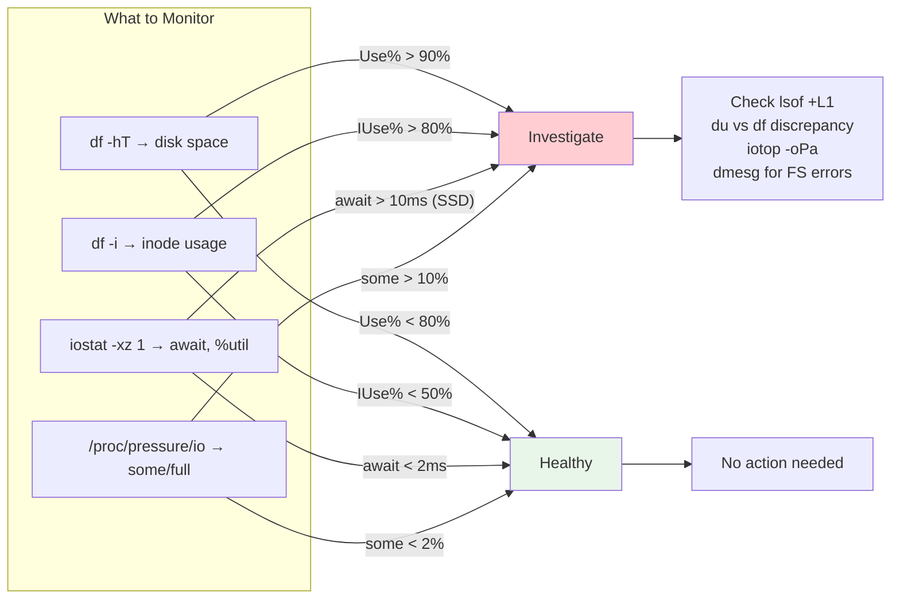

# Cheatsheet: 04 -- Filesystem & Storage (VFS, Inodes, Journaling, I/O Schedulers)

> Quick reference for senior SRE interviews and production debugging.
> Full topic: [filesystem-and-storage.md](../04-filesystem-and-storage/filesystem-and-storage.md)

---

## Filesystem Health at a Glance



---

## Essential Commands

### Quick Health Check

```bash
df -hT                                       # Disk space with filesystem type
df -i                                        # Inode usage (catches inode exhaustion!)
findmnt --real                               # Tree view of real mounts
iostat -xz 1 3                               # I/O stats (await, %util, IOPS)
cat /proc/pressure/io                        # I/O pressure (kernel 4.20+)
```

### Space Investigation

```bash
du -h --max-depth=1 /var | sort -rh | head   # Top space consumers
ncdu /var                                    # Interactive disk usage browser
lsof +L1                                     # Deleted-but-open files (CRITICAL)
lsof +L1 | awk '{s+=$7}END{printf "%.1f GiB\n",s/2^30}'  # Total space held

# df vs du discrepancy? Almost always deleted-but-open files
# Fix: truncate via fd or signal process to reopen
: > /proc/<PID>/fd/<N>                       # Truncate deleted-but-open file
kill -USR1 <PID>                             # Nginx: reopen log files
```

### Inode Investigation

```bash
ls -li /path/to/file                         # Show inode number
stat /path/to/file                           # Full inode details
find / -inum 12345 2>/dev/null               # Find all hard links to inode
find / -xdev -type d -exec sh -c \
  'echo "$(find "$1" -maxdepth 1 | wc -l) $1"' _ {} \; \
  2>/dev/null | sort -rn | head -15          # Find inode-heavy directories
```

### I/O Performance

```bash
iostat -xz 1                                 # Extended stats per device
# Key fields: await (latency), %util (saturation), r/s w/s (IOPS)

iotop -oPa                                   # Per-process I/O (accumulated)
cat /proc/<PID>/io                           # Per-process I/O counters
blktrace -d /dev/sda -o - | blkparse -i -   # Deep I/O tracing
cat /proc/diskstats                          # Raw kernel I/O counters
```

### Filesystem Operations

```bash
mount -t ext4 -o noatime /dev/sda1 /mnt     # Mount with noatime
mount -o remount,noatime /                   # Remount without unmounting
mount --bind /src /dst                       # Bind mount

# Check and repair (UNMOUNT FIRST)
e2fsck -fvy /dev/sda1                        # ext4: force check, auto-repair
xfs_repair /dev/sda1                         # XFS repair
tune2fs -l /dev/sda1                         # ext4 superblock info
xfs_info /dev/sda1                           # XFS filesystem info
```

### I/O Scheduler Management

```bash
cat /sys/block/sda/queue/scheduler           # Current scheduler
echo none > /sys/block/nvme0n1/queue/scheduler   # Set to none for NVMe
cat /sys/block/sda/queue/rotational          # 0=SSD, 1=HDD
blockdev --getra /dev/sda                    # Current readahead
blockdev --setra 4096 /dev/sda              # Set readahead to 2 MiB
```

---

## Filesystem Comparison

| | ext4 | XFS | Btrfs | ZFS |
|---|---|---|---|---|
| **Max file** | 16 TiB | 8 EiB | 16 EiB | 16 EiB |
| **Inodes** | Static | Dynamic | Dynamic | Dynamic |
| **Checksums** | Meta only | Meta only | Data+meta | Data+meta |
| **Snapshots** | No | No | Yes | Yes |
| **Shrink** | Yes | No | Yes | No |
| **Default** | Debian | RHEL | SUSE | FreeBSD |
| **Best for** | General | Large files | Desktop/NAS | Enterprise |

---

## I/O Scheduler Quick Reference

| Scheduler | Best For | Avoid |
|---|---|---|
| **none** | NVMe, fast SSD | HDD |
| **mq-deadline** | HDD, SATA SSD, databases | Fast NVMe |
| **bfq** | Desktop, interactive I/O | High-throughput servers |
| **kyber** | Latency-sensitive SSD | HDD |

**Rule of thumb:** NVMe = `none`, HDD = `mq-deadline`

---

## Journaling Modes (ext4)

| Mode | Journals | Safety | Speed | Use Case |
|---|---|---|---|---|
| `data=journal` | Data + metadata | Highest | Slowest | Audit logs |
| `data=ordered` | Metadata (data flushed first) | High | Default | General purpose |
| `data=writeback` | Metadata only | Lower | Fastest | Databases w/ own WAL |

---

## Key /proc and /sys Paths

| Path | What It Shows |
|---|---|
| `/proc/diskstats` | Per-device I/O counters |
| `/proc/mounts` | Mounted filesystems |
| `/proc/pressure/io` | I/O pressure (PSI) |
| `/proc/sys/fs/file-nr` | Open file descriptor count |
| `/proc/<PID>/fd/` | Process file descriptors |
| `/proc/<PID>/io` | Process I/O stats |
| `/sys/block/<dev>/queue/scheduler` | I/O scheduler |
| `/sys/block/<dev>/queue/rotational` | SSD vs HDD |

---

## Kernel Tunables

```bash
# Dirty page writeback (for database servers, reduce these)
sysctl -w vm.dirty_ratio=5                   # Sync writeback threshold (default: 20)
sysctl -w vm.dirty_background_ratio=2        # Background writeback (default: 10)

# VFS cache
sysctl vm.vfs_cache_pressure                 # dcache/icache reclaim (default: 100)

# File descriptor limits
sysctl fs.file-max                           # System-wide max fds
ulimit -n                                    # Per-process max fds
```

---

## Emergency Procedures

```bash
# Filesystem remounted read-only after error
dmesg | grep -iE "ext4|xfs|error|readonly"  # Check kernel log
dd if=/dev/sda1 of=/backup/sda1.img bs=64K  # BACKUP FIRST
umount /dev/sda1 && e2fsck -fvy /dev/sda1   # Repair

# Cannot unmount filesystem
fuser -vm /mount/point                       # Find blocking processes
lsof +D /mount/point                         # All open files
umount -l /mount/point                       # Lazy unmount (last resort)

# Stale NFS handle
umount -f /mnt/nfs-share                     # Force unmount NFS
umount -l /mnt/nfs-share                     # Lazy unmount if force fails

# ext4 superblock corrupted
dumpe2fs /dev/sda1 | grep -i superblock      # Find backup locations
e2fsck -b 32768 /dev/sda1                    # Use backup superblock
```

---

## Interview One-Liners

- **VFS core objects:** superblock, inode, dentry, file
- **Hard vs soft link:** hard = same inode, soft = separate inode pointing by name
- **3 fd tables:** per-process fd table → open file description (struct file) → inode
- **fork() shares:** open file descriptions (offsets); dup() also shares within same process
- **df vs du gap:** deleted-but-open files, stacked mounts, reserved blocks
- **fsync vs fdatasync:** fsync = data + all metadata; fdatasync = data + essential metadata only
- **inode exhaustion:** `df -i` to detect; use XFS for dynamic inodes or `mkfs.ext4 -i 4096`
- **%util 100% on NVMe:** misleading -- check await instead; NVMe can do 100% util at low latency
