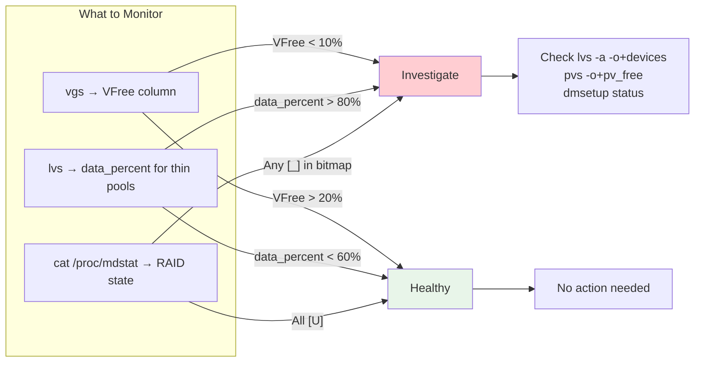

# Cheatsheet: 05 -- LVM & Disk Management (Logical Volumes, RAID, Partitioning)

> Quick reference for senior SRE interviews and production debugging.
> Full topic: [lvm.md](../05-lvm/lvm.md)

---

## LVM Overview at a Glance



---

## Essential Commands

### Quick Health Check

```bash
pvs                                          # Physical volumes summary
vgs                                          # Volume groups (focus on VFree)
lvs                                          # Logical volumes
lvs -a -o+devices,seg_pe_ranges              # Detailed: show PE mapping
lsblk -f                                     # Block device tree with FS types
cat /proc/mdstat                             # RAID array status
```

### LV Resize (Most Common Production Operation)

```bash
# GROW ext4/xfs (online, safe)
lvextend -L +50G -r /dev/vg_data/lv_data     # Extend LV + filesystem together
lvextend -l +100%FREE -r /dev/vg_data/lv_data # Use all remaining VG space

# SHRINK ext4 only (XFS CANNOT shrink)
umount /data
e2fsck -f /dev/vg_data/lv_data               # Must fsck before shrink
lvreduce -L 200G -r /dev/vg_data/lv_data     # -r handles resize2fs automatically
mount /data
```

### Adding a New Disk to Existing VG

```bash
# 1. Partition the new disk (GPT, single partition, LVM type)
sgdisk -Z /dev/sdd                            # Zap existing tables
sgdisk -n 1:0:0 -t 1:8e00 /dev/sdd           # Single LVM partition
partprobe /dev/sdd                            # Inform kernel

# 2. Create PV, extend VG, extend LV
pvcreate /dev/sdd1
vgextend vg_data /dev/sdd1
lvextend -l +100%FREE -r /dev/vg_data/lv_data
```

### Online Data Migration (pvmove)

```bash
# Move all data from old PV to new PV
pvmove /dev/sda1 /dev/nvme0n1p1

# Move specific LV only
pvmove -n lv_data /dev/sda1 /dev/nvme0n1p1

# Monitor progress
lvs -a -o+copy_percent

# Abort if needed (reverts to original)
pvmove --abort

# After complete: remove old PV from VG
vgreduce vg_data /dev/sda1
pvremove /dev/sda1
```

### Snapshot Operations

```bash
# Classic snapshot (specify COW size)
lvcreate -s -L 10G -n snap_data /dev/vg_data/lv_data

# Check snapshot fill level
lvs -o+snap_percent

# Remove snapshot (frees COW space)
lvremove /dev/vg_data/snap_data

# Thin pool + thin snapshot (preferred)
lvcreate --type thin-pool -L 500G -n thinpool vg_data
lvcreate -V 200G --thin -n lv_thin1 vg_data/thinpool
lvcreate -s -n lv_thin1_snap vg_data/lv_thin1

# Monitor thin pool
lvs -o+data_percent,metadata_percent --select 'seg_type=thin-pool'
```

### RAID (mdadm)

```bash
# Create RAID 10 (4 disks)
mdadm --create /dev/md/data --level=10 --raid-devices=4 /dev/sd[b-e]1

# Check status
cat /proc/mdstat
mdadm --detail /dev/md/data

# Handle disk failure
mdadm --fail /dev/md/data /dev/sdc1          # Mark failed
mdadm --remove /dev/md/data /dev/sdc1        # Remove from array
mdadm --add /dev/md/data /dev/sdf1           # Add replacement

# Save config
mdadm --detail --scan >> /etc/mdadm/mdadm.conf

# Weekly scrub (detect silent corruption)
echo check > /sys/block/md0/md/sync_action
cat /sys/block/md0/md/mismatch_cnt           # Should be 0
```

---

## Emergency Procedures

### VG Full -- Cannot Write to Any LV

```bash
# 1. Identify what is consuming space
lvs -a -o lv_name,lv_size,data_percent,snap_percent vg_name

# 2. Remove stale snapshots (quickest fix)
lvremove /dev/vg_name/stale_snapshot

# 3. Or add emergency disk
pvcreate /dev/sdX1 && vgextend vg_name /dev/sdX1

# 4. Or extend thin pool if thin-based
lvextend -L +100G vg_name/thinpool
```

### LVM Metadata Corruption

```bash
# Check backups (LVM auto-saves on every metadata change)
ls -lt /etc/lvm/archive/                      # Timestamped backups
ls -lt /etc/lvm/backup/                       # Latest backup per VG

# Restore from backup
vgcfgrestore -f /etc/lvm/archive/vg_data_NNNNN.vg vg_data
vgchange -ay vg_data
```

### RAID Degraded -- Disk Failed

```bash
# 1. Identify failed disk
mdadm --detail /dev/md0 | grep -E "State|faulty"

# 2. Remove failed disk
mdadm --remove /dev/md0 /dev/sdX1

# 3. Replace hardware, then add new disk
mdadm --add /dev/md0 /dev/sdY1

# 4. Monitor rebuild
watch cat /proc/mdstat
```

---

## Cloud Volume Resize (AWS EBS, No Reboot)

```bash
# 1. Resize in AWS
aws ec2 modify-volume --volume-id vol-XXX --size 500

# 2. Grow partition
growpart /dev/xvdf 1

# 3a. If using LVM:
pvresize /dev/xvdf1
lvextend -l +100%FREE -r /dev/vg_data/lv_data

# 3b. If no LVM:
resize2fs /dev/xvdf1                          # ext4
xfs_growfs /mountpoint                        # xfs
```

---

## Key Decision Tables

### Filesystem Resize Support

| Operation | ext4 | xfs | btrfs |
|---|---|---|---|
| Online grow | Yes | Yes | Yes |
| Offline grow | Yes | No (must be mounted) | Yes |
| Shrink | Offline only | **Not supported** | Online |

### RAID Level Selection

| Need | RAID Level | Why |
|---|---|---|
| Max performance, no redundancy | 0 | Stripe only |
| Boot/OS disk | 1 | Simple mirror, fast rebuild |
| Database (high IOPS) | 10 | Stripe + mirror, fast rebuild |
| Archive/bulk storage | 6 | Dual parity, tolerates 2 failures |
| **Avoid for large disks** | **5** | **URE risk during rebuild** |

### LVM vs Direct Partition

| Scenario | Choice |
|---|---|
| Need runtime resize | LVM |
| Multi-disk aggregation | LVM |
| Snapshot/backup workflows | LVM (thin) |
| Single ephemeral cloud disk | Direct partition |
| ZFS/Btrfs environment | No LVM needed |

---

## Critical One-Liners

```bash
# Find which PV holds a specific LV
lvs -o+devices /dev/vg_data/lv_data

# Show PE-to-LE mapping for an LV
pvs -o+pv_name,seg_start_pe,seg_size_pe --segments /dev/vg_data/lv_data

# Device-mapper table inspection
dmsetup table /dev/mapper/vg_data-lv_data

# All LVs with their snapshot status and fill percent
lvs -a -o lv_name,origin,snap_percent,data_percent,pool_lv

# VG space breakdown
vgs -o vg_name,vg_size,vg_free,lv_count,snap_count

# Verify block sizes match before pvmove
blockdev --getbsz /dev/sda1; blockdev --getbsz /dev/nvme0n1p1
```
